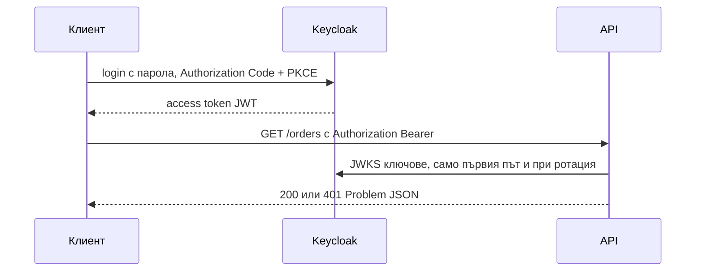

# Authentication

API-то не издава пароли и token-и: потребителят влиза при OIDC provider (Keycloak), а API-то само проверява `Authorization: Bearer <JWT>` при всяка заявка. Така паролите, MFA и refresh логиката живеят в един специализиран сървис, а твоят код остава stateless.

## 1. Инсталация

Ползваме `go-oidc`, защото сам открива issuer-а, кешира JWKS ключовете и проверява подпис, `iss`, `aud` и `exp`.

```bash
go get github.com/coreos/go-oidc/v3/oidc@latest
```

Локално Keycloak върви в compose (realm `shop` и client `shop-api` създаваш веднъж от UI-то на `http://localhost:8081`).

```yaml compose.yaml
services:
  keycloak:
    image: quay.io/keycloak/keycloak:26.0
    command: start-dev
    environment:
      KC_BOOTSTRAP_ADMIN_USERNAME: admin
      KC_BOOTSTRAP_ADMIN_PASSWORD: admin
    ports:
      - "8081:8080"
```

## 2. Минимален пример

Verifier-ът се създава веднъж при старт. `NewProvider` прави заявка към `/.well-known/openid-configuration`, затова API-то не тръгва, ако Keycloak не е достъпен.

```go internal/auth/oidc.go
package auth

import (
	"context"
	"fmt"

	"github.com/coreos/go-oidc/v3/oidc"
)

func NewVerifier(ctx context.Context, issuerURL, clientID string) (*oidc.IDTokenVerifier, error) {
	provider, err := oidc.NewProvider(ctx, issuerURL)
	if err != nil {
		return nil, fmt.Errorf("oidc provider: %w", err)
	}
	return provider.Verifier(&oidc.Config{ClientID: clientID}), nil
}
```

Middleware-ът чете token-а, проверява го, намира локалния потребител по `sub` и слага `User` в context.

```go internal/auth/middleware.go
package auth

import (
	"context"
	"net/http"
	"slices"
	"strings"

	"github.com/coreos/go-oidc/v3/oidc"

	"github.com/acme/shop/internal/httpx"
)

type User struct {
	ID      int64  // локалното users.id
	Subject string // OIDC "sub"
	Email   string
	Roles   []string
}

func (u User) HasRole(role string) bool { return slices.Contains(u.Roles, role) }

// UserResolver се имплементира от user.Store.
type UserResolver interface {
	ResolveUser(ctx context.Context, subject, email string) (int64, error)
}

type ctxKey struct{}

func UserFrom(ctx context.Context) (User, bool) {
	u, ok := ctx.Value(ctxKey{}).(User)
	return u, ok
}

type claims struct {
	Email       string `json:"email"`
	RealmAccess struct {
		Roles []string `json:"roles"`
	} `json:"realm_access"`
}

func Authenticate(v *oidc.IDTokenVerifier, users UserResolver) func(http.Handler) http.Handler {
	return func(next http.Handler) http.Handler {
		return http.HandlerFunc(func(w http.ResponseWriter, r *http.Request) {
			raw, ok := strings.CutPrefix(r.Header.Get("Authorization"), "Bearer ")
			if !ok || raw == "" {
				httpx.WriteProblem(w, r, http.StatusUnauthorized, "липсва Bearer token")
				return
			}
			idToken, err := v.Verify(r.Context(), raw)
			if err != nil {
				httpx.WriteProblem(w, r, http.StatusUnauthorized, "невалиден token")
				return
			}
			var c claims
			if err := idToken.Claims(&c); err != nil {
				httpx.WriteProblem(w, r, http.StatusUnauthorized, "невалидни claims")
				return
			}
			id, err := users.ResolveUser(r.Context(), idToken.Subject, c.Email)
			if err != nil {
				httpx.WriteError(w, r, err)
				return
			}
			u := User{ID: id, Subject: idToken.Subject, Email: c.Email, Roles: c.RealmAccess.Roles}
			next.ServeHTTP(w, r.WithContext(context.WithValue(r.Context(), ctxKey{}, u)))
		})
	}
}
```

Keycloak слага ролите от realm-а в `realm_access.roles`, а не в стандартен claim, затова структурата `claims` ги чете оттам.

Resolver-ът прави just-in-time provisioning: първата заявка на нов потребител създава ред в `users`, следващите само обновяват имейла. Една upsert заявка, без отделен SELECT.

```sql internal/db/queries/users.sql
-- name: UpsertUserBySubject :one
INSERT INTO users (subject, email) VALUES ($1, $2)
ON CONFLICT (subject) DO UPDATE SET email = EXCLUDED.email
RETURNING id;
```

```go internal/user/store.go
func (s *Store) ResolveUser(ctx context.Context, subject, email string) (int64, error) {
	return s.q.UpsertUserBySubject(ctx, sqlc.UpsertUserBySubjectParams{Subject: subject, Email: email})
}
```

## 3. Закачане в routes.go

Публичните routes остават извън групата, всичко защитено минава през `Authenticate`.

```go internal/server/routes.go
func (s *Server) routes(verifier *oidc.IDTokenVerifier, users auth.UserResolver) http.Handler {
	r := chi.NewRouter()
	r.Get("/healthz", s.health)
	r.Get("/products", s.products.List)

	r.Group(func(r chi.Router) {
		r.Use(auth.Authenticate(verifier, users))
		r.Mount("/orders", s.orders.Routes())
	})
	return r
}
```

В handler-а взимаш потребителя така:

```go internal/order/handler.go
func (h *Handler) Create(w http.ResponseWriter, r *http.Request) {
	user, _ := auth.UserFrom(r.Context())
	// user.ID е локалното users.id (int64), ползвай го като owner на поръчката
	...
}
```

## 4. Как минава един login



## 5. Капани

- Issuer-ът трябва да съвпада буквално с `iss` в token-а. Ако клиентът взима token от `http://localhost:8081`, а API-то в compose вика `http://keycloak:8080`, проверката пада; задай `KC_HOSTNAME` или ползвай един и същ адрес.
- Access token-ите на Keycloak по подразбиране имат `aud: account`, не твоя client. Добави Audience mapper за `shop-api` в Keycloak, вместо да изключваш проверката със `SkipClientIDCheck`.
- Не пиши собствен JWT parsing и не приемай `alg: none`; `Verify` вече проверява подпис, срок и issuer.
- Не логвай token-а. Логвай `user.ID`, ако ти трябва следа. Не ползвай `sub` като foreign key, за това е локалното `users.id`.
- Връщай 401 само за липсващ или невалиден token. Липса на права е 403, виж [Authorization](Authorization.md).

## 6. Свързани документи

- [Authorization](Authorization.md)
- [Middleware](Middleware.md)
- [Context](Context.md)
- [Грешки](Errors.md)
- [Конфигурация](Configuration.md)
