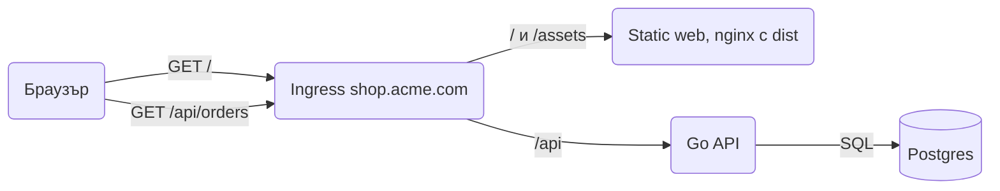

# Backend и фронтенд

Фронтендът е SPA на React и Vite в `web/` на същото repo, а Go API-то отговаря на всичко под `/api`. В production двете са на един домейн зад ingress, а локално Vite проксира `/api` към Go, така че браузърът винаги вижда един origin.

## 1. Инсталация

Създаваш Vite проекта в `web/` и добавяш генератора на типове от OpenAPI.

```bash
npm create vite@latest web -- --template react-ts
cd web
npm install openapi-fetch
npm install -D openapi-typescript
```

## 2. Минимален пример: Vite proxy за локална разработка

```text
shop/
  api/openapi.yaml            договорът, от него се генерират Go и TS
  cmd/api/main.go             слуша на :8080, всички route-ове под /api
  internal/...
  web/
    package.json
    vite.config.ts
    src/api/schema.d.ts       генериран, не се редактира
    src/api/client.ts
    src/main.tsx
    dist/                     build output, не е в git
  k8s/ingress.yaml
```

```ts web/vite.config.ts
import { defineConfig } from "vite";
import react from "@vitejs/plugin-react";

export default defineConfig({
  plugins: [react()],
  server: {
    port: 5173,
    proxy: {
      "/api": "http://localhost:8080",
    },
  },
});
```

Пускаш `air` за Go и `npm run dev` в `web/`, отваряш `http://localhost:5173`. Заявка към `/api/orders` минава през Vite сървъра към Go, затова CORS не ти трябва нито локално, нито в production, където всичко е на един origin.

## 3. Production: един домейн през ingress



```yaml k8s/ingress.yaml
apiVersion: networking.k8s.io/v1
kind: Ingress
metadata:
  name: shop
spec:
  ingressClassName: nginx
  tls:
    - hosts: [shop.acme.com]
      secretName: shop-tls
  rules:
    - host: shop.acme.com
      http:
        paths:
          - path: /api
            pathType: Prefix
            backend:
              service: { name: shop-api, port: { number: 8080 } }
          - path: /
            pathType: Prefix
            backend:
              service: { name: shop-web, port: { number: 80 } }
```

`shop-web` е малък nginx image с `web/dist`, който връща `index.html` за непознат път, за да работи client-side routing-ът. Двата image-а се билдват и деплойват отделно (виж [Docker и деплой](Docker_Deploy.md)).

## 4. Типизиран клиент от OpenAPI

TypeScript типовете се генерират от същия `api/openapi.yaml`, от който Go генерира сървъра (виж [API документация](API_Docs.md)). Промяна в договора чупи компилацията и от двете страни.

```json web/package.json
{
  "scripts": {
    "dev": "vite",
    "build": "tsc -b && vite build",
    "gen:api": "openapi-typescript ../api/openapi.yaml -o src/api/schema.d.ts"
  }
}
```

```ts web/src/api/client.ts
import createClient from "openapi-fetch";
import type { paths } from "./schema";
import { getAccessToken } from "../auth";

export const api = createClient<paths>({ baseUrl: "/api" });

api.use({
  async onRequest({ request }) {
    const token = await getAccessToken();
    if (token) request.headers.set("Authorization", `Bearer ${token}`);
    return request;
  },
});
```

```ts web/src/orders/useOrder.ts
const { data, error } = await api.GET("/orders/{orderID}", {
  params: { path: { orderID: 42 } },
});
// data е типизиран като Order, error като Problem
```

## 5. Authentication накратко

SPA-то влиза през Keycloak с Authorization Code и PKCE, държи access token-а в паметта и го праща в `Authorization: Bearer`. Go API-то само проверява token-а и не знае нищо за login страницата. Детайлите са в [Authentication](Authentication.md).

## 6. Капани

- Абсолютен `baseUrl` като `http://localhost:8080/api` във фронтенда води до CORS и до различни URL-и по среди. Винаги относителен `/api`.
- Без fallback към `index.html` в nginx refresh на `/orders/42` връща 404.
- Access token в `localStorage` е достъпен за всеки XSS. Дръж го в паметта и го подновявай с OIDC библиотеката.
- Ако забравиш `npm run gen:api` след промяна на спецификацията, фронтендът компилира срещу стари типове. Пусни го в CI и провери `git diff`.
- Go route-ове извън `/api` (като `/metrics`) не се публикуват през ingress-а. Те са на вътрешния порт.

## 7. Свързани документи

- [API документация](API_Docs.md)
- [Authentication](Authentication.md)
- [Docker и деплой](Docker_Deploy.md)
- [Routing с chi](Routing.md)
