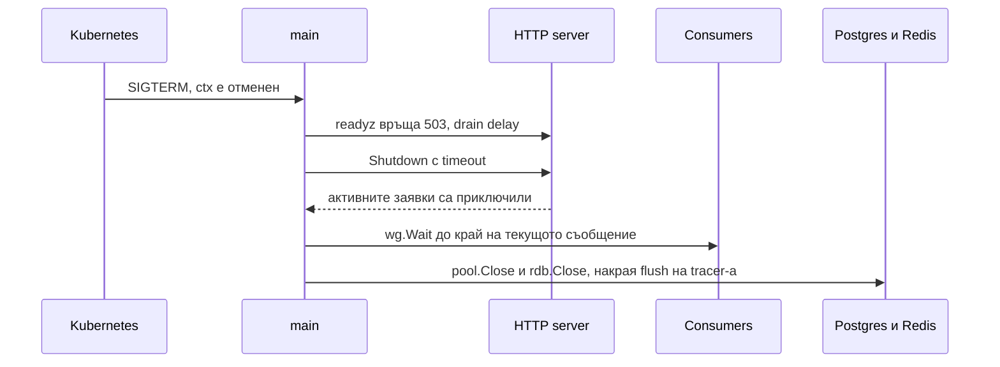

# Graceful shutdown

Graceful shutdown значи, че при SIGTERM сървисът спира да приема нови заявки, довършва текущите и затваря ресурсите си по ред, вместо да умре по средата на транзакция. Всичко е от стандартната библиотека: `os/signal` за сигнала и `(*http.Server).Shutdown` от `net/http` за довършването на заявките.

## 1. Минимален пример

`internal/server/server.go` държи `http.Server` с timeouts, readiness флаг и метода `Run`, който блокира до сигнал и после спира сървъра.

```go internal/server/server.go
package server

import (
	"context"
	"errors"
	"log/slog"
	"net/http"
	"sync/atomic"
	"time"
)

type Server struct {
	http  *http.Server
	ready atomic.Bool
}

func New(addr string, h http.Handler) *Server {
	s := &Server{}
	mux := http.NewServeMux()
	mux.HandleFunc("GET /readyz", s.readyz)
	mux.Handle("/", h)

	s.http = &http.Server{
		Addr:              addr,
		Handler:           mux,
		ReadHeaderTimeout: 5 * time.Second,
		ReadTimeout:       15 * time.Second,
		WriteTimeout:      30 * time.Second,
		IdleTimeout:       60 * time.Second,
	}
	return s
}

// Run блокира, докато ctx не бъде отменен, после спира сървъра.
func (s *Server) Run(ctx context.Context, drainDelay, timeout time.Duration) error {
	errCh := make(chan error, 1)
	go func() {
		slog.Info("http server listening", "addr", s.http.Addr)
		if err := s.http.ListenAndServe(); err != nil && !errors.Is(err, http.ErrServerClosed) {
			errCh <- err
		}
	}()
	s.ready.Store(true)

	select {
	case err := <-errCh:
		return err
	case <-ctx.Done():
	}

	// Kubernetes маха pod-а от Service endpoints с малко закъснение.
	// Докато това стане, още приемаме трафик, но readiness вече е 503.
	s.ready.Store(false)
	slog.Info("shutdown started, draining", "delay", drainDelay)
	time.Sleep(drainDelay)

	shutdownCtx, cancel := context.WithTimeout(context.Background(), timeout)
	defer cancel()
	if err := s.http.Shutdown(shutdownCtx); err != nil {
		return err
	}
	slog.Info("http server stopped")
	return nil
}

func (s *Server) readyz(w http.ResponseWriter, _ *http.Request) {
	if !s.ready.Load() {
		w.WriteHeader(http.StatusServiceUnavailable)
		return
	}
	w.WriteHeader(http.StatusOK)
}
```

`Shutdown` затваря listener-ите, изчаква активните заявки да свършат и връща грешка, ако timeout-ът изтече преди това.

## 2. Ред на затваряне в main

`signal.NotifyContext` превръща SIGINT и SIGTERM в отменен context. Ресурсите се затварят в обратен ред на стартирането и `defer` го прави безплатно: последното отворено се затваря първо. Затова логиката е в `run() error`, а не в `main`, иначе `os.Exit` прескача defer-ите.

```go cmd/api/main.go
func main() {
	if err := run(); err != nil {
		slog.Error("api stopped with error", "err", err)
		os.Exit(1)
	}
}

func run() error {
	ctx, stop := signal.NotifyContext(context.Background(), os.Interrupt, syscall.SIGTERM)
	defer stop()

	cfg, err := config.Load()
	if err != nil {
		return err
	}

	shutdownTracing, err := observability.InitTracing(ctx, "shop-api")
	if err != nil {
		return err
	}
	defer func() {
		// ctx вече е отменен, затова flush-ът получава собствен context.
		flushCtx, cancel := context.WithTimeout(context.Background(), 5*time.Second)
		defer cancel()
		_ = shutdownTracing(flushCtx)
	}()

	pool, err := db.New(ctx, cfg.DB.URL)
	if err != nil {
		return err
	}
	defer pool.Close()

	log := logging.New(cfg.Env, cfg.LogLevel)

	rdb, err := redis.New(ctx, cfg.Redis.URL)
	if err != nil {
		return err
	}
	defer rdb.Close()

	var wg sync.WaitGroup
	defer wg.Wait() // consumers и workers довършват, преди да се затвори pool-ът
	wg.Add(1)
	go func() {
		defer wg.Done()
		// Consume връща nil, когато ctx бъде отменен, виж Kafka.md.
		err := kafka.Consume(ctx, cfg.Kafka.Brokers, "shop-api", "payments.events",
			func(ctx context.Context, e kafka.Event) error {
				log.InfoContext(ctx, "payment event", "event", e)
				return nil
			})
		if err != nil {
			log.Error("payments consumer", "err", err)
		}
	}()

	orderHandler := order.NewHandler(order.NewService(order.NewStore(pool), pool, log))
	productHandler := product.NewHandler(product.NewService(product.NewStore(pool)))
	router := server.Routes(orderHandler, productHandler)
	srv := server.New(cfg.HTTP.Addr, router)
	return srv.Run(ctx, cfg.HTTP.DrainDelay, cfg.HTTP.ShutdownTimeout)
}
```

## 3. Последователност при SIGTERM



## 4. Kubernetes настройки

Сумата от drain delay и shutdown timeout трябва да е по-малка от `terminationGracePeriodSeconds`, иначе kubelet праща SIGKILL посред затварянето.

```yaml k8s/deployment.yaml
spec:
  template:
    spec:
      terminationGracePeriodSeconds: 40
      containers:
        - name: api
          readinessProbe:
            httpGet:
              path: /readyz
              port: 8080
            periodSeconds: 2
            failureThreshold: 1
```

## 5. Капани

- Без `ReadHeaderTimeout` бавен клиент държи връзка отворена безкрайно (Slowloris). `gosec` в golangci-lint го отбелязва.
- `ListenAndServe` връща `http.ErrServerClosed` веднага след `Shutdown`. Това не е грешка и не бива да стига до `os.Exit(1)`.
- `Shutdown` не чака hijack-нати връзки като WebSockets. Тях ги затваряш сам през `RegisterOnShutdown` или техния hub.
- Goroutines, пуснати от handler-и, не се изчакват от `Shutdown`. Дълга работа отива в [Background jobs](Background_Jobs.md).
- Ако Dockerfile-ът стартира през shell (`CMD api`), SIGTERM отива при shell-а и сървисът не го получава. Ползвай exec форма `CMD ["/api"]`.

## 6. Свързани документи

- [Context](Context.md)
- [Goroutines и конкурентност](Concurrency.md)
- [Docker и деплой](Docker_Deploy.md)
- [Метрики и tracing](Observability.md)
- [WebSockets](WebSockets.md)
