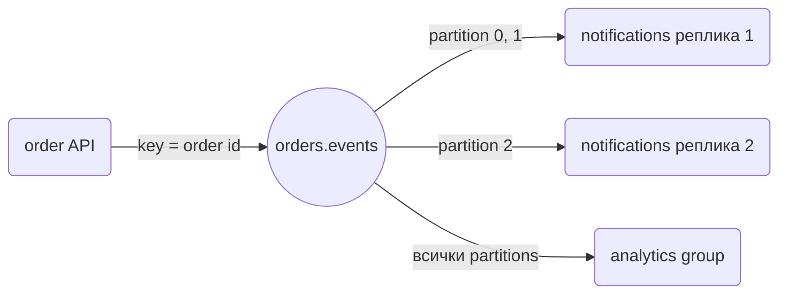

# Kafka

Kafka е лог от събития, който няколко сървиса четат независимо: `order` публикува `order.created`, а `notifications`, `analytics` и `warehouse` го консумират всеки със своя consumer group. Ползваме `segmentio/kafka-go`, защото е чист Go без cgo, с прост API за writer и reader, който управлява consumer group-ите вместо теб.

## 1. Инсталация

Библиотеката и `uuid` за ID на събитията.

```bash
go get github.com/segmentio/kafka-go@latest
go get github.com/google/uuid@latest
```

Локално един broker в KRaft режим, без ZooKeeper:

```yaml compose.yaml
services:
  kafka:
    image: apache/kafka:3.9.0
    ports:
      - "9092:9092"
    environment:
      KAFKA_NODE_ID: 1
      KAFKA_PROCESS_ROLES: broker,controller
      KAFKA_LISTENERS: PLAINTEXT://:9092,CONTROLLER://:9093
      KAFKA_ADVERTISED_LISTENERS: PLAINTEXT://localhost:9092
      KAFKA_CONTROLLER_LISTENER_NAMES: CONTROLLER
      KAFKA_LISTENER_SECURITY_PROTOCOL_MAP: CONTROLLER:PLAINTEXT,PLAINTEXT:PLAINTEXT
      KAFKA_CONTROLLER_QUORUM_VOTERS: 1@localhost:9093
      KAFKA_OFFSETS_TOPIC_REPLICATION_FACTOR: 1
      KAFKA_TRANSACTION_STATE_LOG_REPLICATION_FACTOR: 1
      KAFKA_TRANSACTION_STATE_LOG_MIN_ISR: 1
      KAFKA_NUM_PARTITIONS: 3
```

## 2. Producer

Всяко събитие е в общ JSON envelope, за да могат consumer-ите да разпознават типа и да дедупликират по `ID`.

```go internal/platform/kafka/producer.go
package kafka

import (
	"context"
	"encoding/json"
	"time"

	"github.com/google/uuid"
	kafkago "github.com/segmentio/kafka-go"
)

type Event struct {
	ID         string          `json:"id"`
	Type       string          `json:"type"`
	OccurredAt time.Time       `json:"occurred_at"`
	Data       json.RawMessage `json:"data"`
}

type Producer struct{ w *kafkago.Writer }

func NewProducer(brokers []string, topic string) *Producer {
	return &Producer{w: &kafkago.Writer{
		Addr:         kafkago.TCP(brokers...),
		Topic:        topic,
		Balancer:     &kafkago.Hash{},
		RequiredAcks: kafkago.RequireAll,
		// По подразбиране writer-ът чака до 1s да напълни batch.
		BatchTimeout: 10 * time.Millisecond,
	}}
}

// key определя partition-а: всички събития за една поръчка отиват в един partition и запазват реда си.
func (p *Producer) Publish(ctx context.Context, key, eventType string, data any) error {
	payload, err := json.Marshal(data)
	if err != nil {
		return err
	}
	value, err := json.Marshal(Event{
		ID: uuid.NewString(), Type: eventType, OccurredAt: time.Now().UTC(), Data: payload,
	})
	if err != nil {
		return err
	}
	return p.w.WriteMessages(ctx, kafkago.Message{Key: []byte(key), Value: value})
}

func (p *Producer) Close() error { return p.w.Close() }
```

Извикването е `producer.Publish(ctx, strconv.FormatInt(o.ID, 10), "order.created", o)`.

## 3. Consumer group



Репликите с еднакъв `GroupID` си поделят partition-ите; различен `GroupID` получава всички съобщения отначало. Commit-ваш offset-а едва след успешна обработка, затова доставката е at-least-once.

```go internal/platform/kafka/consumer.go
package kafka

import (
	"context"
	"encoding/json"
	"errors"
	"log/slog"

	kafkago "github.com/segmentio/kafka-go"
)

type Handler func(ctx context.Context, e Event) error

func Consume(ctx context.Context, brokers []string, groupID, topic string, h Handler) error {
	r := kafkago.NewReader(kafkago.ReaderConfig{Brokers: brokers, GroupID: groupID, Topic: topic})
	defer r.Close()

	for {
		m, err := r.FetchMessage(ctx)
		if err != nil {
			if errors.Is(err, context.Canceled) {
				return nil
			}
			return err
		}

		var e Event
		if err := json.Unmarshal(m.Value, &e); err != nil {
			// Невалидно съобщение няма да стане валидно при retry; логваме и продължаваме.
			slog.Error("bad kafka message", "offset", m.Offset, "err", err)
		} else if err := h(ctx, e); err != nil {
			// Без commit: след рестарт или rebalance съобщението ще дойде отново.
			return err
		}

		if err := r.CommitMessages(ctx, m); err != nil {
			return err
		}
	}
}
```

В `cmd/worker/main.go` пускаш `kafka.Consume(ctx, cfg.Kafka.Brokers, "notifications", "orders.events", handler)` в goroutine; при SIGTERM `ctx` се отменя, `FetchMessage` връща грешка и `defer r.Close()` напуска групата чисто. Producer-ът в API се създава с `kafka.NewProducer(cfg.Kafka.Brokers, "orders.events")` и се затваря с `producer.Close()` след спирането на HTTP сървъра, за да изпрати буферираните съобщения.

## 4. Капани

- Handler-ът трябва да е идемпотентен. Пази обработените `Event.ID` в таблица с unique constraint и пропускай повторенията.
- Без `Key` балансьорът разпръсква съобщенията и `order.paid` може да се обработи преди `order.created`. Редът е гарантиран само в рамките на един partition.
- Ако handler-ът върне грешка, а ти все пак commit-неш, съобщението е изгубено. Ако не commit-неш и продължиш напред, следващият commit ще го прескочи.
- Публикуване след `tx.Commit` може да падне и събитието да се изгуби. За критични събития пиши в outbox таблица в същата транзакция и я изпращай от worker.
- Повече реплики от partitions в една група означава, че излишните стоят без работа.

## 5. Свързани документи

- [NATS](NATS.md)
- [Background jobs](Background_Jobs.md)
- [Events в процеса](Events.md)
- [Graceful shutdown](Graceful_Shutdown.md)
- [Структура на микросървиси](Microservices_Structure.md)
