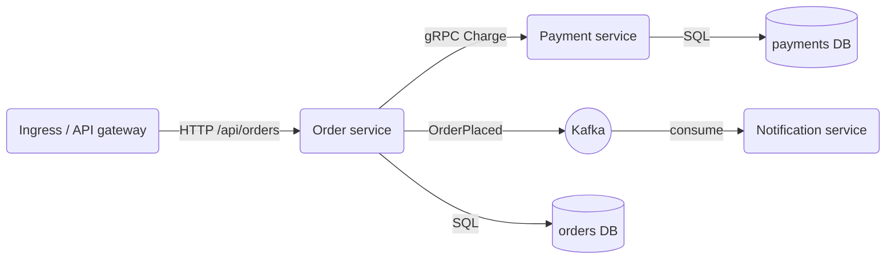

# Структура на микросървиси

Когато системата се разделя на няколко сървиса, всеки има собствен Go модул, собствена база и собствен цикъл на деплой, а споделеното е само договорът между тях. Ползваме един monorepo с модул на сървис и `go.work` за локална разработка, защото така промяна в proto и в двата сървиса се прави в един pull request.

## 1. Минимален пример: дървото на repo-то

```text
shop/
  go.work                     само локално, в .gitignore
  proto/
    buf.yaml
    buf.gen.yaml
    order/v1/order.proto
    payment/v1/payment.proto
  gen/                        module github.com/acme/shop/gen
    go.mod
    order/v1/order.pb.go, order_grpc.pb.go
    payment/v1/...
  pkg/                        module github.com/acme/shop/pkg
    go.mod
    logging/logging.go
    httpx/problem.go
  services/
    order/                    module github.com/acme/shop/services/order
      go.mod
      cmd/api/main.go
      internal/order/...      handler, service, store
      internal/db/...
      migrations/
      Dockerfile
    payment/                  module github.com/acme/shop/services/payment
    notification/             module github.com/acme/shop/services/notification
  deploy/k8s/
  Makefile
```

Всеки сървис вътре следва същата структура като в [Структура на проекта](Project_Structure.md). `services/order/internal` не може да се импортира от `payment`, и това е желаното.

## 2. go.mod и go.work

Сървисът зависи от `gen` и `pkg` по версия (git таг `gen/v0.5.0`), както от всяка външна библиотека:

```text services/order/go.mod
module github.com/acme/shop/services/order

go 1.25

require (
	github.com/acme/shop/gen v0.5.0
	github.com/acme/shop/pkg v0.2.1
	github.com/go-chi/chi/v5 v5.2.1
	github.com/jackc/pgx/v5 v5.7.2
	google.golang.org/grpc v1.72.0
)
```

Версиите на външните библиотеки са примерни: вземай текущите с `go get <модул>@latest` и `go mod tidy` в директорията на сървиса.

Локално `go.work` пренасочва тези модули към работните ти копия, без `replace` в `go.mod`:

```text go.work
go 1.25

use (
	./gen
	./pkg
	./services/order
	./services/payment
	./services/notification
)
```

```bash
go work init ./gen ./pkg ./services/order ./services/payment ./services/notification
(cd proto && buf generate)                   # пише в ../gen
git tag gen/v0.6.0 && git push origin gen/v0.6.0
cd services/order && go get github.com/acme/shop/gen@v0.6.0
```

CI билдва всеки сървис без `go.work` (`GOWORK=off`), така че версията в `go.mod` е тази, която реално отива в production.

## 3. Как си говорят



- Отвън идва само HTTP през ingress или API gateway, който прави TLS и routing по път към съответния сървис.
- Синхронно вътре в клъстера: gRPC по договор от `proto/`, когато отговорът ти трябва веднага (виж [gRPC](GRPC.md)).
- Асинхронно: събития в Kafka, когато другият сървис само трябва да реагира (виж [Kafka](Kafka.md)). Notification не се вика директно от никого.
- Всеки сървис има собствена база или поне собствена schema с отделен потребител. Данни от чужд сървис получаваш през API или събитие, никога през SQL.

## 4. Правила

- Без споделена база. Ако два сървиса пишат в една таблица, те са един сървис.
- Без споделени domain модели. `pkg/` не съдържа `Order` или `User`. Всеки сървис има свой тип, а между тях минават само proto съобщенията.
- `pkg/` е малък и наистина общ: logging setup, `httpx` за problem+json, middleware. Ако нещо се ползва от един сървис, мястото му е в неговия `internal`.
- Proto-то е версионирано по пакет (`order.v1`). Добавяш полета с нови номера, никога не преномерираш и не триеш поле без `reserved`. Несъвместима промяна означава `order.v2`, който живее паралелно, докато всички клиенти минат.
- Събитията в Kafka също имат схема и версия. Consumer-ът игнорира непознати полета.
- Всеки сървис има свой Dockerfile, свой pipeline и деплой независимо. CI пуска само job-овете на сървисите, чиито файлове са променени.

## 5. Капани

- Твърде ранно разделяне: три сървиса с една база и синхронни извиквания във верига е разпределен монолит, по-лош от обикновения. Започни с модулен монолит и отдели сървис, когато има отделен екип или различно натоварване.
- Верига от синхронни gRPC извиквания умножава latency и отказите. Задай timeout чрез `context` на всяко извикване (виж [Context](Context.md)).
- Запис в базата и публикуване в Kafka не са атомарни. Ползвай outbox таблица в същата транзакция (виж [Транзакции](Transactions.md)).
- Ако `go.work` е комитнат, CI билдва с локалните копия и скрива, че `go.mod` сочи стара версия на `gen`.

## 6. Свързани документи

- [Структура на проекта](Project_Structure.md)
- [gRPC](GRPC.md)
- [Kafka](Kafka.md)
- [Go modules и инструменти](Modules_Tooling.md)
- [Docker и деплой](Docker_Deploy.md)
