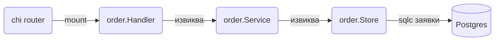

# Структура на проекта

Go не налага структура, но toolchain-ът има едно твърдо правило: пакетите под `internal/` могат да се import-ват само от кода в родителската директория. Върху това правило и върху пакети по feature стъпва layout-ът, който ползваме във всички документи на наръчника.

## 1. Минимален пример

Това е скелетът на сървис за онлайн магазин. Не създавай всичко наведнъж, добавяй директории, когато се появи нужда.

```text
go.mod                     module github.com/acme/shop
Makefile
sqlc.yaml
.golangci.yml
.air.toml
compose.yaml
Dockerfile
api/
  openapi.yaml             спецификацията на API-то
  spec.go                  package apispec, embed на спецификацията
cmd/
  api/main.go              HTTP API, composition root
  worker/main.go           background jobs, consumers, cron
  migrate/main.go          пуска миграциите
  seed/main.go             dev data
internal/
  apperr/apperr.go         ErrNotFound, ErrConflict, ErrInvalid, ErrForbidden, ErrUnauthorized
  api/api.gen.go           генерирани типове от OpenAPI
  config/config.go
  server/server.go         http.Server
  server/routes.go         chi router, mount на feature routes
  server/internal.go       NewInternal: /metrics и /debug/pprof/
  server/session.go
  httpx/                   json.go, problem.go, middleware.go, validate.go, pagination.go, ratelimit.go
  auth/                    oidc.go, middleware.go
  order/                   model.go, handler.go, service.go, store.go, events.go
  product/                 същата форма
  user/
  db/db.go                 pgxpool
  db/tx.go
  db/queries/orders.sql    вход за sqlc
  db/sqlc/                 генериран код, не се редактира
  platform/                redis, kafka, nats, mail, storage, events, ws
  platform/httpclient/     HTTP клиенти към външни услуги
  platform/grpcclient/     gRPC клиенти
  jobs/                    River workers
  logging/logging.go
gen/                       генериран protobuf/gRPC код
migrations/                000001_create_orders.up.sql, .down.sql
```

## 2. Защо cmd и internal

Всяка поддиректория на `cmd/` е отделен `package main` и отделен бинарен файл. `cmd/api` и `cmd/worker` споделят един и същ код от `internal/`, но се deploy-ват и скалират отделно.

`internal/` пази кода ти от чужди import-и: друго репо не може да зависи от `github.com/acme/shop/internal/order`. Така можеш да преименуваш и пренареждаш свободно, без да чупиш никого. Директория `pkg/` не ползваме, защото споделени библиотеки живеят в отделни модули.

## 3. Пакети по feature

Групирай по бизнес домейн, а не по технически слой. Пакет `order` съдържа всичко за поръчките:

```text
internal/order/
  model.go      Order, OrderItem, Status, грешки като ErrNotFound
  handler.go    Handler struct, HTTP методи, Routes()
  service.go    Service struct, бизнес правила
  store.go      Store struct, обвива sqlc заявките
  events.go     OrderPlaced и други събития
```

Така от извикващия код четеш `order.Service`, `order.Handler`, `order.ErrNotFound`, вместо `services.OrderService` и `handlers.OrderHandler`. Промяна в поръчките засяга една директория.

## 4. Посока на зависимостите

Зависимостите вървят само в една посока. Handler-ът познава service-а, service-ът познава store-а, store-ът познава генерирания sqlc код. Обратното е забранено: service не import-ва `net/http`, store не знае за HTTP статуси.



Ако два feature пакета трябва да говорят, `order.Service` получава `product.Service` (или малък interface) в конструктора си. Циклични import-и Go не позволява, така че ако `product` иска нещо от `order`, ползвай event.

## 5. Composition root в main.go

`cmd/api/main.go` е единственото място, където обектите се създават и свързват. Няма глобални променливи и няма `init()` с логика.

```go cmd/api/main.go
package main

import (
	"context"
	"log/slog"
	"os"
	"os/signal"
	"syscall"

	"github.com/acme/shop/internal/config"
	"github.com/acme/shop/internal/db"
	"github.com/acme/shop/internal/logging"
	"github.com/acme/shop/internal/order"
	"github.com/acme/shop/internal/server"
)

func main() {
	if err := run(); err != nil {
		slog.Error("api stopped", "err", err)
		os.Exit(1)
	}
}

func run() error {
	ctx, stop := signal.NotifyContext(context.Background(), os.Interrupt, syscall.SIGTERM)
	defer stop()

	cfg, err := config.Load()
	if err != nil {
		return err
	}
	log := logging.New(cfg.Env, cfg.LogLevel)

	pool, err := db.New(ctx, cfg.DB.URL)
	if err != nil {
		return err
	}
	defer pool.Close()

	orderStore := order.NewStore(pool)
	orderService := order.NewService(orderStore, pool, log)
	orderHandler := order.NewHandler(orderService)

	router := server.Routes(orderHandler)
	srv := server.New(cfg.HTTP.Addr, router)
	return srv.Run(ctx, cfg.HTTP.DrainDelay, cfg.HTTP.ShutdownTimeout)
}
```

`run()` връща грешка, вместо да вика `os.Exit` навсякъде, така `defer pool.Close()` винаги се изпълнява. `srv.Run` блокира до SIGTERM и спира сървъра, виж [Graceful shutdown](Graceful_Shutdown.md).

## 6. Капани

- Пакети `utils`, `common` и `helpers` бързо стават сметище. Кажи какво прави пакетът: `httpx`, `money`, `slug`.
- Пакет `models` с всички structs води до циклични import-и. Типовете живеят при feature-а си.
- Не слагай бизнес логика в `cmd/`. Ако `main.go` расте над 100 реда, wiring-ът е твърде подробен или логика е изтекла там.
- Не прави interface за всеки struct предварително. Дефинирай го при потребителя, когато имаш втора имплементация или тест.
- Глобален `var DB *pgxpool.Pool` изглежда удобно, но прави тестовете зависими един от друг и скрива зависимостите.

## 7. Свързани документи

- [Go modules и инструменти](Modules_Tooling.md)
- [Конфигурация](Configuration.md)
- [Интерфейси и DI](Interfaces_DI.md)
- [Graceful shutdown](Graceful_Shutdown.md)
- [Структура на микросървиси](Microservices_Structure.md)
