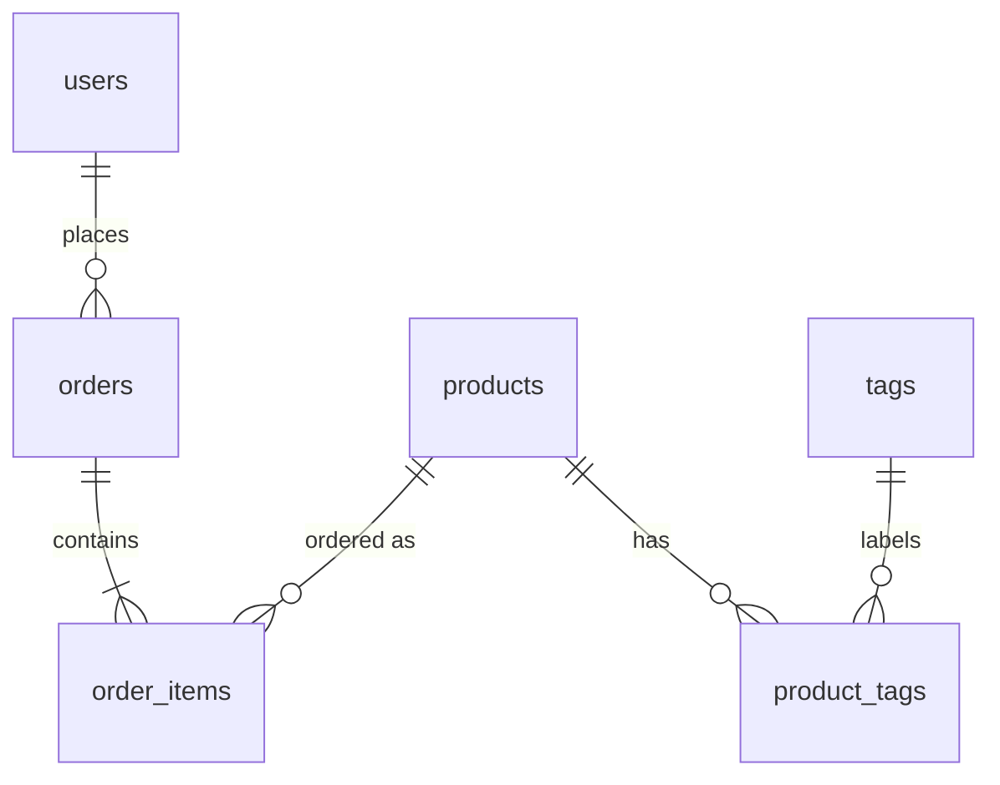

# Релации

Без ORM релациите са просто foreign key-ове в схемата и заявки, които ти пишеш изрично. Тук е как да моделираш one-to-many и many-to-many и да ги зареждаш със sqlc без N+1 заявки.

## 1. Инсталация

Нищо ново: ползваш pgx и sqlc от [sqlc вместо ORM](SQLC.md).

```bash
go install github.com/sqlc-dev/sqlc/cmd/sqlc@latest
```

## 2. Минимален пример

Една поръчка има много редове (`order_items`), а продуктите и таговете са many-to-many през join таблицата `product_tags`.



`orders`, `order_items` и `products` са създадени в първата миграция (виж [Миграции](Migrations.md)). `order_items` има `order_id bigint NOT NULL REFERENCES orders(id) ON DELETE CASCADE` и `product_id bigint NOT NULL REFERENCES products(id)`. Таговете идват с нова миграция:

```sql migrations/000002_create_tags.up.sql
CREATE TABLE tags (
    id   bigserial PRIMARY KEY,
    name text NOT NULL UNIQUE
);

CREATE TABLE product_tags (
    product_id bigint NOT NULL REFERENCES products(id) ON DELETE CASCADE,
    tag_id     bigint NOT NULL REFERENCES tags(id) ON DELETE CASCADE,
    PRIMARY KEY (product_id, tag_id)
);

CREATE INDEX product_tags_tag_id_idx ON product_tags (tag_id);
CREATE INDEX order_items_order_id_idx ON order_items (order_id);
```

Postgres не създава автоматично индекс върху foreign key колона, затова `order_items.order_id` и `product_tags.tag_id` ги получават изрично.

## 3. Поръчки с редовете им без N+1

Ако за всяка поръчка правиш отделна заявка за редовете, при 50 поръчки имаш 51 заявки. Вместо това зареждаш поръчките, после всички редове с една заявка по списък от id-та.

```sql internal/db/queries/orders.sql
-- name: ListOrderItemsByOrderIDs :many
SELECT * FROM order_items
WHERE order_id = ANY(sqlc.arg(order_ids)::bigint[])
ORDER BY order_id, id;
```

Генерираната функция приема `[]int64`. Групирането става в Go с map:

```go internal/order/store.go
func (s *Store) ListByUser(ctx context.Context, userID int64) ([]Order, error) {
	rows, err := s.q.ListOrdersByUser(ctx, userID)
	if err != nil {
		return nil, err
	}
	if len(rows) == 0 {
		return []Order{}, nil
	}

	ids := make([]int64, len(rows))
	for i, r := range rows {
		ids[i] = r.ID
	}
	itemRows, err := s.q.ListOrderItemsByOrderIDs(ctx, ids)
	if err != nil {
		return nil, err
	}

	byOrder := make(map[int64][]Item, len(rows))
	for _, it := range itemRows {
		byOrder[it.OrderID] = append(byOrder[it.OrderID], Item{
			ProductID:  it.ProductID,
			Quantity:   it.Quantity,
			PriceCents: it.PriceCents,
		})
	}

	orders := make([]Order, len(rows))
	for i, r := range rows {
		orders[i] = toOrder(r)
		orders[i].Items = byOrder[r.ID]
	}
	return orders, nil
}
```

Винаги две заявки, независимо колко поръчки има. `Item` и полето `Items []Item` са в `internal/order/model.go`.

## 4. Many-to-many: запис и JOIN

Записът в join таблицата е обикновен `INSERT`. `ON CONFLICT DO NOTHING` го прави идемпотентен, повторното добавяне на същия таг не е грешка.

```sql internal/db/queries/products.sql
-- name: AddProductTag :exec
INSERT INTO product_tags (product_id, tag_id)
VALUES ($1, $2)
ON CONFLICT DO NOTHING;

-- name: RemoveProductTag :exec
DELETE FROM product_tags
WHERE product_id = $1 AND tag_id = $2;

-- name: ListTagsForProduct :many
SELECT t.id, t.name
FROM tags t
JOIN product_tags pt ON pt.tag_id = t.id
WHERE pt.product_id = $1
ORDER BY t.name;
```

`ListTagsForProduct` връща `[]sqlc.Tag`, защото колоните съвпадат точно с таблицата `tags`.

## 5. Редове от JOIN със sqlc.embed

Когато искаш целия ред на поръчката и целия продукт в един резултат, `sqlc.embed` генерира struct с вложени модели вместо плосък списък от колони.

```sql internal/db/queries/orders.sql
-- name: ListOrderItemsWithProduct :many
SELECT sqlc.embed(order_items), sqlc.embed(products)
FROM order_items
JOIN products ON products.id = order_items.product_id
WHERE order_items.order_id = $1
ORDER BY order_items.id;
```

```go internal/order/store.go
func (s *Store) ItemsWithProduct(ctx context.Context, orderID int64) ([]ItemView, error) {
	rows, err := s.q.ListOrderItemsWithProduct(ctx, orderID)
	if err != nil {
		return nil, err
	}
	out := make([]ItemView, len(rows))
	for i, r := range rows {
		out[i] = ItemView{
			ProductID:   r.Product.ID,
			ProductName: r.Product.Name,
			Quantity:    r.OrderItem.Quantity,
			PriceCents:  r.OrderItem.PriceCents,
		}
	}
	return out, nil
}
```

Генерираният ред е `ListOrderItemsWithProductRow` с полета `OrderItem sqlc.OrderItem` и `Product sqlc.Product`. `ItemView` е малък DTO в `internal/order/model.go`.

## 6. Капани

- Заявка в цикъл по резултатите на друга заявка е N+1. Събирай id-тата и ползвай `ANY($1::bigint[])`.
- Без индекс върху foreign key колоната и `ANY`, и `ON DELETE CASCADE` правят пълно сканиране.
- `ON DELETE CASCADE` слагай само където детето няма смисъл без родителя (`order_items`). За `products` в поръчки не трий, а маркирай като неактивен.
- Цената в `order_items.price_cents` е копие към момента на поръчката. Не я чети от `products` при показване на стара поръчка.
- `sqlc.embed` при LEFT JOIN не работи добре с nullable редове. За опционални релации пиши изрично колоните.

## 7. Свързани документи

- [sqlc вместо ORM](SQLC.md)
- [Миграции](Migrations.md)
- [Транзакции](Transactions.md)
- [Pagination](Pagination.md)
