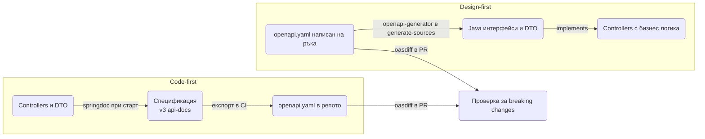
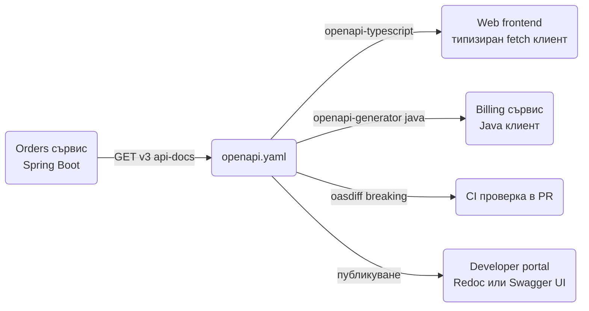

# API документация

OpenAPI спецификацията е договорът между твоя backend и всички, които го ползват: frontend екипът, другите сървиси, QA и бъдещият ти аз след шест месеца. В Spring Boot тя се генерира от кода с `springdoc-openapi`, а Swagger UI дава интерактивна страница, в която всеки може да пробва endpoint-ите с реален token. Този документ показва как да настроиш springdoc, кои анотации наистина си струват, как да опишеш security схемите, pagination и грешките с `ProblemDetail`, как да групираш и версионираш API-то, как да генерираш клиенти за frontend и за други сървиси и как да хванеш breaking changes в CI. Накрая има пълен пример с контролер и полученият yaml.

| Какво | Кога | Инструмент |
|---|---|---|
| Генерирана спецификация от кода | Всеки REST сървис | `springdoc-openapi-starter-webmvc-ui` |
| Интерактивна документация | Dev, staging, вътрешни потребители | Swagger UI на `/swagger-ui.html` |
| Описание на DTO и грешки | Публично API, frontend екип | `@Schema`, `@ApiResponse` с `ProblemDetail` |
| Design-first | Договорът се пише преди кода, няколко екипа | `openapi-generator-maven-plugin` |
| Клиент за frontend | SPA или мобилно приложение | `openapi-typescript`, `openapi-generator` |
| Проверка за breaking changes | Всеки PR | `oasdiff` в CI |

## 1. Зависимости и настройка

### Защо генерирана спецификация

Ръчно писаната документация остарява в деня, в който някой промени едно поле. Генерираната от кода спецификация е винаги вярна за това, което реално отговаря сървисът, защото се чете от същите контролери, DTO-та и Bean Validation анотации. Тя дава три конкретни ползи:

- Договор за frontend екипа: те генерират типове и клиент от спецификацията и грешките в имена на полета стават compile-time грешки в TypeScript, не runtime изненади.
- Генериране на клиенти за други сървиси: Java клиент с `RestClient` под капака, без ръчно писане на DTO-та втори път.
- Review: diff на спецификацията в PR показва веднага дали си счупил нещо за клиентите, виж раздел 9.

### Maven зависимост

```xml pom.xml
<dependency>
    <groupId>org.springdoc</groupId>
    <artifactId>springdoc-openapi-starter-webmvc-ui</artifactId>
    <version>2.8.9</version> <!-- виж последната версия в Maven Central -->
</dependency>
```

Този starter включва и Swagger UI. Ако искаш само спецификацията без UI (например в сървис, който я публикува другаде), ползвай `springdoc-openapi-starter-webmvc-api`.

След стартиране имаш два URL-а по подразбиране:

- `/v3/api-docs` връща спецификацията като JSON, а `/v3/api-docs.yaml` като YAML.
- `/swagger-ui.html` пренасочва към `/swagger-ui/index.html`, интерактивната страница.

### Минимален application.yml

```yaml src/main/resources/application.yml
springdoc:
  api-docs:
    path: /api-docs
  swagger-ui:
    path: /docs
    operations-sorter: method
    tags-sorter: alpha
    display-request-duration: true
    try-it-out-enabled: true
  packages-to-scan: com.acme.shop
  paths-to-match: /api/**
  default-produces-media-type: application/json
```

`packages-to-scan` и `paths-to-match` ограничават кои контролери влизат в спецификацията, без тях влиза всичко, включително тестови и вътрешни endpoint-и. `default-produces-media-type` спира springdoc да пише `*/*` като content type, когато контролерът не казва изрично `produces`.

### Изключване в production или защита

Решението зависи от аудиторията. За публично API документацията е част от продукта и остава включена. За вътрешен сървис обикновено я изключваш в `prod` профила или я защитаваш със security.

```yaml src/main/resources/application-prod.yml
# application-prod.yml
springdoc:
  api-docs:
    enabled: false
  swagger-ui:
    enabled: false
```

Ако предпочиташ да я оставиш, но само за админи, добави правило в `SecurityFilterChain`. Пътищата са тези от `springdoc.api-docs.path` и `springdoc.swagger-ui.path` плюс статичните ресурси на UI-а.

```java src/main/java/com/acme/shop/common/config/SecurityConfig.java
@Bean
SecurityFilterChain apiSecurity(HttpSecurity http) throws Exception {
    http.authorizeHttpRequests(a -> a
        .requestMatchers("/api-docs/**", "/docs", "/swagger-ui/**").hasRole("ADMIN")
        .requestMatchers("/api/**").authenticated()
        .anyRequest().denyAll());
    return http.build();
}
```

Как се настройва самата автентикация е описано в [Authentication](Authentication.md). Трета опция е `springdoc.use-management-port: true`, която сервира спецификацията на management порта на Actuator, недостъпен отвън.

## 2. Минимален работещ пример

Без нито една анотация springdoc вече генерира спецификация от сигнатурите на контролерите и от record DTO-тата. Този контролер е достатъчен, за да видиш работещ Swagger UI.

```java src/main/java/com/acme/shop/order/OrderController.java
package com.acme.shop.order;

import org.springframework.http.HttpStatus;
import org.springframework.web.bind.annotation.*;

@RestController
@RequestMapping("/api/orders")
public class OrderController {

    private final OrderService orderService;

    public OrderController(OrderService orderService) {
        this.orderService = orderService;
    }

    @GetMapping("/{id}")
    public OrderResponse get(@PathVariable UUID id) {
        return orderService.get(id);
    }

    @PostMapping
    @ResponseStatus(HttpStatus.CREATED)
    public OrderResponse create(@RequestBody @Valid CreateOrderRequest request) {
        return orderService.create(request);
    }
}
```

```java src/main/java/com/acme/shop/order/dto/
package com.acme.shop.order.dto;

import jakarta.validation.constraints.*;
import java.math.BigDecimal;
import java.time.Instant;
import java.util.List;
import java.util.UUID;

public record CreateOrderRequest(
        @NotNull UUID customerId,
        @NotEmpty List<@Valid OrderLine> lines,
        @Size(max = 500) String note) {}

public record OrderLine(
        @NotNull UUID productId,
        @Min(1) @Max(1000) int quantity) {}

public record OrderResponse(
        UUID id,
        UUID customerId,
        OrderStatus status,
        BigDecimal total,
        Instant createdAt) {}

public enum OrderStatus { NEW, PAID, SHIPPED, CANCELLED }
```

Отвори `/docs` и ще видиш две операции под tag `order-controller`, схеми `CreateOrderRequest`, `OrderLine`, `OrderResponse` и enum `OrderStatus` с четирите стойности. `quantity` вече има `minimum: 1` и `maximum: 1000`, `customerId` е в `required`, `note` има `maxLength: 500`. Това идва от Bean Validation, не от OpenAPI анотации, виж раздел 4.

### Глобален OpenAPI bean

Заглавие, версия, сървъри и контакт се задават веднъж с bean от тип `OpenAPI`.

```java src/main/java/com/acme/shop/common/config/OpenApiConfig.java
package com.acme.shop.common.config;

import io.swagger.v3.oas.models.OpenAPI;
import io.swagger.v3.oas.models.info.Contact;
import io.swagger.v3.oas.models.info.Info;
import io.swagger.v3.oas.models.info.License;
import io.swagger.v3.oas.models.servers.Server;

@Configuration
public class OpenApiConfig {

    @Bean
    OpenAPI ordersOpenApi(@Value("${app.version:dev}") String version) {
        return new OpenAPI()
            .info(new Info()
                .title("Orders API")
                .version(version)
                .description("Поръчки, плащания и доставки. Всички дати са UTC в ISO 8601.")
                .contact(new Contact().name("Orders team").email("orders@example.com"))
                .license(new License().name("Proprietary")))
            .servers(List.of(
                new Server().url("https://api.example.com").description("Production"),
                new Server().url("http://localhost:8080").description("Local")));
    }
}
```

`app.version` идва от `build-info` на Maven или от env променлива в деплоя. Списъкът `servers` е dropdown-ът "Servers" в Swagger UI и base URL по подразбиране в генерираните клиенти.

## 3. Анотации по контролери и DTO

Правилото е: анотирай това, което springdoc не може да изведе сам. Имената на полетата, типовете, required и ограниченията вече ги има. Трябва да добавиш смисъла: какво значи полето, пример, кога се връща коя грешка.

### Tag и Operation

```java src/main/java/com/acme/shop/order/OrderController.java
package com.acme.shop.order;

import io.swagger.v3.oas.annotations.Operation;
import io.swagger.v3.oas.annotations.Parameter;
import io.swagger.v3.oas.annotations.media.*;
import io.swagger.v3.oas.annotations.responses.*;
import io.swagger.v3.oas.annotations.tags.Tag;
import org.springframework.http.ProblemDetail;

@RestController
@RequestMapping("/api/orders")
@Tag(name = "Orders", description = "Създаване и проследяване на поръчки")
public class OrderController {

    @Operation(
        summary = "Връща поръчка по id",
        description = "Клиентът вижда само своите поръчки. Админ вижда всички.")
    @ApiResponses({
        @ApiResponse(responseCode = "200", description = "Поръчката е намерена"),
        @ApiResponse(responseCode = "404", description = "Няма такава поръчка",
            content = @Content(mediaType = "application/problem+json",
                schema = @Schema(implementation = ProblemDetail.class)))
    })
    @GetMapping("/{id}")
    public OrderResponse get(
            @Parameter(description = "UUID на поръчката", example = "0f8fad5b-d9cb-469f-a165-70867728950e")
            @PathVariable UUID id) {
        return orderService.get(id);
    }
}
```

- `@Tag` на класа групира операциите в UI-а под четимо име вместо `order-controller`.
- `summary` е едно изречение, което се показва в списъка. `description` е за детайлите: права, странични ефекти, идемпотентност.
- `@ApiResponse` за грешките сочи към `ProblemDetail`, защото точно това връща `@RestControllerAdvice` при `spring.mvc.problemdetails.enabled=true`, виж [Грешки и ProblemDetail](Exception_Handling.md). Content type-ът е `application/problem+json`.

За да не повтаряш `@ApiResponse` за 400, 401, 403 и 500 на всяка операция, ги добавяш глобално с `OpenApiCustomizer`, показано в раздел 7.

### Schema на records и полета

```java src/main/java/com/acme/shop/order/dto/
package com.acme.shop.order.dto;

import io.swagger.v3.oas.annotations.media.ArraySchema;
import io.swagger.v3.oas.annotations.media.Schema;
import io.swagger.v3.oas.annotations.media.Schema.RequiredMode;

@Schema(description = "Заявка за нова поръчка")
public record CreateOrderRequest(

        @Schema(description = "Клиентът, за когото е поръчката", requiredMode = RequiredMode.REQUIRED,
                example = "3fa85f64-5717-4562-b3fc-2c963f66afa6")
        @NotNull UUID customerId,

        @ArraySchema(minItems = 1, schema = @Schema(implementation = OrderLine.class))
        @NotEmpty List<@Valid OrderLine> lines,

        @Schema(description = "Бележка към куриера", maxLength = 500, example = "Звънете на втория етаж")
        @Size(max = 500) String note) {}

public record OrderResponse(
        @Schema(requiredMode = RequiredMode.REQUIRED) UUID id,
        @Schema(requiredMode = RequiredMode.REQUIRED) OrderStatus status,
        @Schema(description = "Сума с ДДС", example = "129.90") BigDecimal total,
        @Schema(description = "UTC момент на създаване", example = "2026-03-14T09:26:53Z") Instant createdAt) {}
```

- `requiredMode = REQUIRED` на response полета е важно за генерираните клиенти: без него TypeScript типът е `id?: string` и frontend-ът трябва да проверява за `undefined` на всяко място.
- `example` на ниво поле се показва в Swagger UI като попълнена примерна заявка. Един добър пример спестява повече въпроси от три абзаца описание.
- `@ArraySchema` описва самия масив (`minItems`, `uniqueItems`), а вложената `schema` описва елемента.

### Enum, дати и формати

springdoc сам превежда стандартните Java типове:

| Java тип | OpenAPI | Бележка |
|---|---|---|
| `UUID` | `string`, `format: uuid` | |
| `LocalDate` | `string`, `format: date` | `2026-03-14` |
| `Instant`, `OffsetDateTime`, `ZonedDateTime` | `string`, `format: date-time` | Jackson ги пише ISO 8601, виж [DTO и mapping](DTO_Mapping.md) |
| `LocalDateTime` | `string`, `format: date-time` | Без зона, избягвай го в API |
| `BigDecimal` | `number` | Ако сериализираш парите като string, сложи `type = "string"` в `@Schema` |
| `enum` | `string` с `enum: [...]` | Стойностите са `name()`, освен ако нямаш `@JsonValue` |
| `MultipartFile` | `string`, `format: binary` | Само в `multipart/form-data` |

Ако enum-ът има `@JsonValue` на метод, springdoc ползва неговите стойности. Ако имаш описание на всяка стойност, сложи го в `@Schema(description = ...)` на enum-а, OpenAPI 3.0 няма описание на отделна стойност.

### Hidden

`@Hidden` на клас, метод или поле го маха от спецификацията. Ползвай го за вътрешни endpoint-и, които не искаш да се виждат, но по-добре ги изнеси в отделна група (раздел 6), за да има документация и за тях. Полета на DTO с `@JsonIgnore` също не влизат в схемата, springdoc чете Jackson анотациите.

## 4. Какво springdoc извежда от Bean Validation

Това е най-големият спестител на анотации. Всяка constraint анотация от `jakarta.validation` се превежда в OpenAPI ограничение, така че документацията и реалната валидация никога не се разминават. Подробности за самите валидации са в [Валидации](Validation.md).

| Bean Validation | OpenAPI |
|---|---|
| `@NotNull`, `@NotBlank`, `@NotEmpty` | полето влиза в `required` |
| `@Size(min, max)` | `minLength` / `maxLength` за string, `minItems` / `maxItems` за колекция |
| `@Min`, `@Max` | `minimum`, `maximum` |
| `@DecimalMin`, `@DecimalMax` | `minimum`, `maximum`, с `exclusiveMinimum` при `inclusive = false` |
| `@Positive`, `@PositiveOrZero` | `minimum: 0` с или без `exclusiveMinimum` |
| `@Pattern(regexp)` | `pattern` |
| `@Email` | `format: email` |

```java src/main/java/com/acme/shop/user/dto/RegisterUserRequest.java
package com.acme.shop.user.dto;

public record RegisterUserRequest(
        @NotBlank @Email String email,
        @NotBlank @Size(min = 12, max = 128) String password) {}
```

Генерираната схема:

```yaml
RegisterUserRequest:
  type: object
  required: [email, password]
  properties:
    email: { type: string, format: email, minLength: 1 }
    password: { type: string, minLength: 12, maxLength: 128 }
```

Практическо следствие: не пиши `requiredMode = REQUIRED` на поле, което вече има `@NotNull`. Пиши `@Schema` само за `description` и `example`.

## 5. Pagination и файлове в спецификацията

### Pageable с ParameterObject

Без анотация springdoc би описал `Pageable` като един обект в body, което е грешно. `@ParameterObject` го разгъва на query параметри `page`, `size` и `sort`.

```java src/main/java/com/acme/shop/order/OrderController.java
import org.springdoc.core.annotations.ParameterObject;
import org.springframework.data.domain.Pageable;

@Operation(summary = "Списък с поръчки на клиент")
@GetMapping
public PageResponse<OrderResponse> list(
        @Parameter(description = "Филтър по статус") @RequestParam(required = false) OrderStatus status,
        @ParameterObject Pageable pageable) {
    return orderService.list(status, pageable);
}
```

Същият подход работи за всеки record с филтри: сложи `@ParameterObject` пред него и всяко поле става query параметър. Как се прави whitelist на `sort` и защо не връщаме `Page` директно е описано в [Pagination](Pagination.md).

### Схема на PageResponse

Generic record се описва коректно, springdoc генерира отделна схема за всяка конкретизация (`PageResponseOrderResponse`).

```java src/main/java/com/acme/shop/common/web/PageResponse.java
package com.acme.shop.common.web;

@Schema(description = "Страница с резултати")
public record PageResponse<T>(
        @ArraySchema(schema = @Schema(description = "Елементите на текущата страница")) List<T> items,
        @Schema(description = "Номер на страницата, от 0", example = "0") int page,
        @Schema(description = "Размер на страницата", example = "20") int size,
        @Schema(description = "Общо елементи", example = "143") long totalElements,
        @Schema(description = "Общо страници", example = "8") int totalPages) {}
```

Ако името `PageResponseOrderResponse` ти пречи в генерирания клиент, най-простото е конкретен record `OrderPage` за публичното API.

### Файлове

Upload с `@RequestPart MultipartFile` се описва като `multipart/form-data` с поле от тип `string`, `format: binary`. Ако заедно с файла пращаш JSON метаданни, двете части се виждат като отделни полета.

```java src/main/java/com/acme/shop/order/OrderController.java
@Operation(summary = "Прикачва документ към поръчката")
@PostMapping(value = "/{id}/documents", consumes = MediaType.MULTIPART_FORM_DATA_VALUE)
@ResponseStatus(HttpStatus.CREATED)
public DocumentResponse upload(
        @PathVariable UUID id,
        @Parameter(description = "PDF или изображение до 10 MB") @RequestPart MultipartFile file,
        @RequestPart(required = false) DocumentMeta meta) {
    return documentService.attach(id, file, meta);
}
```

Download endpoint, който връща `ResponseEntity<Resource>`, е добре да получи изричен `@ApiResponse` с `content = @Content(mediaType = "application/octet-stream", schema = @Schema(type = "string", format = "binary"))`, иначе Swagger UI показва празен отговор. Валидацията на файлове и съхранението са в [Файлове](Files.md).

## 6. Security схеми и групи

### Bearer JWT

Security схемата се декларира веднъж и после се реферира от операциите. Най-лесно е с анотация на `@Configuration` клас.

```java src/main/java/com/acme/shop/common/config/OpenApiSecurityConfig.java
package com.acme.shop.common.config;

import io.swagger.v3.oas.annotations.enums.SecuritySchemeIn;
import io.swagger.v3.oas.annotations.enums.SecuritySchemeType;
import io.swagger.v3.oas.annotations.security.SecurityScheme;

@Configuration
@SecurityScheme(
    name = "bearer-jwt",
    type = SecuritySchemeType.HTTP,
    scheme = "bearer",
    bearerFormat = "JWT",
    in = SecuritySchemeIn.HEADER,
    description = "Access token от POST /api/auth/login")
public class OpenApiSecurityConfig {}
```

За да важи за всички операции, добави глобално изискване в `OpenAPI` bean-а:

```java src/main/java/com/acme/shop/common/config/OpenApiConfig.java
import io.swagger.v3.oas.models.security.SecurityRequirement;

@Bean
OpenAPI ordersOpenApi() {
    return new OpenAPI()
        .info(new Info().title("Orders API").version("1.0"))
        .addSecurityItem(new SecurityRequirement().addList("bearer-jwt"));
}
```

Публичните операции (login, health, регистрация) получават празен списък, който отменя глобалното изискване:

```java src/main/java/com/acme/shop/auth/AuthController.java
import io.swagger.v3.oas.annotations.security.SecurityRequirements;

@SecurityRequirements   // празно: без security за тази операция
@PostMapping("/api/auth/login")
public TokenResponse login(@RequestBody @Valid LoginRequest request) { ... }
```

### OAuth2 с Authorization Code

Когато token-ите идват от Keycloak или друг identity provider, Swagger UI може сам да направи login flow. Схемата описва URL-ите и scope-овете.

```java src/main/java/com/acme/shop/common/config/OAuthDocsConfig.java
package com.acme.shop.common.config;

import io.swagger.v3.oas.annotations.security.OAuthFlow;
import io.swagger.v3.oas.annotations.security.OAuthFlows;
import io.swagger.v3.oas.annotations.security.OAuthScope;

@SecurityScheme(
    name = "oauth2",
    type = SecuritySchemeType.OAUTH2,
    flows = @OAuthFlows(authorizationCode = @OAuthFlow(
        authorizationUrl = "${app.oauth2.issuer}/protocol/openid-connect/auth",
        tokenUrl = "${app.oauth2.issuer}/protocol/openid-connect/token",
        scopes = @OAuthScope(name = "orders:write", description = "Създаване и промяна"))))
@Configuration
public class OAuthDocsConfig {}
```

```yaml src/main/resources/application.yml
springdoc:
  swagger-ui:
    oauth:
      client-id: swagger-ui
      use-pkce-with-authorization-code-grant: true
    persist-authorization: true
```

С декларирана схема в Swagger UI се появява бутон "Authorize": за bearer схема пействаш access token-а без префикса `Bearer `, за OAuth2 минаваш през login на provider-а, и всяка "Try it out" заявка носи `Authorization` header. `persist-authorization` пази token-а в browser storage между refresh-ове. Операциите със security са с катинар, тези с празен `@SecurityRequirements` са без. Самата конфигурация на resource server-а е в [Authentication](Authentication.md).

### Групи public, admin, internal

Една спецификация с всичко вътре е объркваща за външен потребител и издава вътрешни endpoint-и. `GroupedOpenApi` bean-овете правят отделни спецификации, всяка на свой URL (`/api-docs/public`, `/api-docs/admin`), а Swagger UI показва dropdown за избор.

```java src/main/java/com/acme/shop/common/config/OpenApiGroups.java
package com.acme.shop.common.config;

import org.springdoc.core.models.GroupedOpenApi;

@Configuration
public class OpenApiGroups {

    @Bean
    GroupedOpenApi publicApi() {
        return GroupedOpenApi.builder()
            .group("public")
            .displayName("Public API")
            .pathsToMatch("/api/v1/**")
            .pathsToExclude("/api/v1/admin/**")
            .build();
    }

    @Bean
    GroupedOpenApi adminApi() {
        return GroupedOpenApi.builder()
            .group("admin")
            .displayName("Admin API")
            .pathsToMatch("/api/v1/admin/**")
            .build();
    }
}
```

Трета група `internal` се прави по същия начин с `packagesToScan("com.acme.shop.internal")` вместо path. Когато има поне един `GroupedOpenApi` bean, глобалните `springdoc.paths-to-match` и `packages-to-scan` спират да важат, групите ги заместват. Всяка група може да има и собствен `OpenApiCustomizer` чрез `.addOpenApiCustomizer(...)`, например различно заглавие и различни security схеми.

### Версии на API в спецификацията

Ако версионираш по path (`/api/v1`, `/api/v2`), една група на версия е най-чистото: `pathsToMatch("/api/v2/**")`. Клиентите на v1 генерират от групата v1 и не виждат промените във v2. Ако версионираш по header или media type, springdoc не може да раздели операциите по path, затова маркирай v2 контролерите с отделен `@Tag` и ги филтрирай с `OperationCustomizer`, или ползвай `producesToMatch("application/vnd.example.v2+json")` на групата. Стратегиите за версиониране са сравнени в [Routing](Routing.md).

## 7. Персонализиране с customizers

### Стандартни отговори за грешки на всички операции

`OpenApiCustomizer` получава готовата спецификация и може да я промени преди сервиране. Най-честата употреба е да добавиш `ProblemDetail` схемата и стандартните грешки навсякъде, за да не повтаряш `@ApiResponse` по контролерите.

```java src/main/java/com/acme/shop/common/openapi/OpenApiCustomizers.java
import io.swagger.v3.oas.models.media.Content;
import io.swagger.v3.oas.models.media.MediaType;
import io.swagger.v3.oas.models.media.Schema;
import io.swagger.v3.oas.models.responses.ApiResponse;
import org.springdoc.core.customizers.OpenApiCustomizer;

@Bean
OpenApiCustomizer standardErrors() {
    return openApi -> {
        Schema<?> problem = new Schema<>().$ref("#/components/schemas/ProblemDetail");
        Content content = new Content().addMediaType("application/problem+json",
            new MediaType().schema(problem));

        openApi.getPaths().values().forEach(path -> path.readOperations().forEach(op -> {
            op.getResponses().addApiResponse("400",
                new ApiResponse().description("Невалидна заявка").content(content));
            op.getResponses().addApiResponse("500",
                new ApiResponse().description("Вътрешна грешка").content(content));
        }));
    };
}
```

Схемата `ProblemDetail` трябва да съществува в `components`. springdoc я добавя сам, щом поне една `@ApiResponse` сочи `ProblemDetail.class`; за сигурност можеш да я регистрираш в `OpenAPI` bean-а чрез `components(new Components().addSchemas("ProblemDetail", ...))`. Ако имаш разширени полета в `ProblemDetail` (например `errors` за валидация, `code` за домейн грешка), направи свой record `ApiProblem` със `@Schema` и сочи към него.

### Стандартен header на всяка операция

`OperationCustomizer` се вика за всяка операция и има достъп до `HandlerMethod`. Класически случай е да документираш header като `X-Request-Id`, който filter-ът ти чете или генерира (виж [Middleware](Middleware.md)).

```java src/main/java/com/acme/shop/common/openapi/OpenApiCustomizers.java
import io.swagger.v3.oas.models.Operation;
import io.swagger.v3.oas.models.media.StringSchema;
import io.swagger.v3.oas.models.parameters.HeaderParameter;
import org.springdoc.core.customizers.OperationCustomizer;
import org.springframework.web.method.HandlerMethod;

@Bean
OperationCustomizer requestIdHeader() {
    return (Operation operation, HandlerMethod handlerMethod) -> {
        operation.addParametersItem(new HeaderParameter()
            .name("X-Request-Id")
            .description("Идентификатор за проследяване. Ако липсва, сървърът генерира и го връща в отговора.")
            .required(false)
            .schema(new StringSchema().format("uuid")));
        return operation;
    };
}
```

Тук можеш да добавяш и `operationId` по свое правило (`handlerMethod.getMethod().getName()` плюс името на контролера), което прави генерираните клиенти с предвидими имена на методи. springdoc по подразбиране прави `get`, `get_1`, `get_2` при дублиращи се имена на методи в различни контролери, и това води до грозни клиенти.

## 8. Design-first: спецификацията преди кода

### Кога има смисъл

Code-first е по подразбиране за един екип, който владее и backend-а, и клиентите. Design-first печели, когато договорът се обсъжда преди кода (няколко екипа, външни партньори), когато frontend-ът тръгва паралелно с backend-а, или когато същият API се имплементира на няколко езика. Тогава `openapi.yaml` живее в репото, минава review като код, и сървърните интерфейси се генерират от него.



| Критерий | Code-first | Design-first |
|---|---|---|
| Източник на истината | Java кодът | `openapi.yaml` |
| Старт на нов сървис | По-бърз, нула инфраструктура | Нужен плъгин и дисциплина |
| Паралелна работа frontend и backend | След първия деплой или експорт | От ден едно, по договора |
| Риск от разминаване | Няма, спецификацията е от кода | Ако някой пипне контролера извън интерфейса |
| Review на промяна в API | Diff на Java код плюс експортиран yaml | Diff на yaml, лесен за не-Java хора |
| Подходящо за | Вътрешни сървиси, малки екипи | Публични API, много консуматори |

### openapi-generator-maven-plugin

Плъгинът генерира интерфейси в `target/generated-sources`, а ти ги имплементираш в обикновен `@RestController`.

```xml pom.xml
<plugin>
    <groupId>org.openapitools</groupId>
    <artifactId>openapi-generator-maven-plugin</artifactId>
    <version>7.13.0</version> <!-- виж последната версия в Maven Central -->
    <executions>
        <execution>
            <goals>
                <goal>generate</goal>
            </goals>
            <configuration>
                <inputSpec>${project.basedir}/src/main/resources/openapi/orders.yaml</inputSpec>
                <generatorName>spring</generatorName>
                <apiPackage>com.acme.shop.generated.api</apiPackage>
                <modelPackage>com.acme.shop.generated.model</modelPackage>
                <generateSupportingFiles>false</generateSupportingFiles>
                <configOptions>
                    <useSpringBoot3>true</useSpringBoot3>
                    <interfaceOnly>true</interfaceOnly>
                    <skipDefaultInterface>true</skipDefaultInterface>
                    <useTags>true</useTags>
                    <useResponseEntity>true</useResponseEntity>
                    <documentationProvider>springdoc</documentationProvider>
                    <openApiNullable>false</openApiNullable>
                </configOptions>
            </configuration>
        </execution>
    </executions>
</plugin>
```

- `useSpringBoot3` превключва на `jakarta.*` импорти. Без него генерираният код е `javax.*` и не компилира.
- `interfaceOnly` генерира само интерфейси с `@RequestMapping` анотациите. Ти пишеш `@RestController class OrderController implements OrdersApi`.
- `useTags` прави по един интерфейс на tag (`OrdersApi`, `PaymentsApi`) вместо един гигантски интерфейс на path.
- `documentationProvider=springdoc` добавя `@Operation` и `@ApiResponse` анотациите в интерфейсите, така че Swagger UI в приложението показва същото, което е в yaml-а.
- `openApiNullable=false` маха зависимостта `jackson-databind-nullable`, която рядко ти трябва.

Алтернатива на `interfaceOnly` е `delegatePattern=true`: плъгинът генерира и контролера, който делегира към интерфейс `OrdersApiDelegate`, а ти имплементираш само делегата. Изборът е вкусов, `interfaceOnly` дава повече контрол върху контролера (например `@PreAuthorize`), `delegatePattern` държи анотациите изцяло в генерирания код.

```java src/main/java/com/acme/shop/order/OrderController.java
package com.acme.shop.order;

import com.acme.shop.generated.api.OrdersApi;
import com.acme.shop.generated.model.CreateOrderRequest;
import com.acme.shop.generated.model.OrderResponse;

@RestController
public class OrderController implements OrdersApi {

    @Override
    public ResponseEntity<OrderResponse> createOrder(CreateOrderRequest request) {
        return ResponseEntity.status(HttpStatus.CREATED).body(orderService.create(request));
    }
}
```

Генерираните модели са класове с builder-подобни setter-и, не records. Ако държиш на records в домейна, map-вай ги на границата, виж [DTO и mapping](DTO_Mapping.md).

## 9. Клиенти от спецификацията и публикуване в CI



### TypeScript клиент за frontend

`openapi-typescript` генерира само типове, без runtime код, и се комбинира с `openapi-fetch` за типизирани заявки. Това е най-лекият вариант и най-малко се чупи при upgrade.

```bash
npx openapi-typescript http://localhost:8080/api-docs -o src/api/schema.d.ts
```

В `package.json` същата команда е script `api:types`, който сочи към commit-натия `openapi/orders.yaml`, за да не зависи от работещ backend. Ако frontend-ът иска готови функции по операция, `openapi-generator` с `typescript-fetch` или `typescript-axios` генератор прави клас на tag. Тук добрите `operationId`-та от раздел 7 стават важни, защото те са имената на методите.

### Java клиент за друг сървис

Същият `openapi-generator-maven-plugin` в консуматора с `generatorName=java` и `library=restclient` генерира `OrdersApi` клас върху `RestClient`. Base URL, timeouts и retry се конфигурират върху `RestClient.Builder`, който подаваш в генерирания `ApiClient`. Как се настройват timeouts, retry и circuit breaker е в [HTTP клиенти](HTTP_Clients.md). За малки интеграции с два-три endpoint-а ръчно написан `@HttpExchange` интерфейс е по-малко багаж от генериран клиент.

### Експорт на спецификацията в CI

Спецификацията трябва да е файл в репото или артефакт в CI, за да може да се diff-ва. Най-простият начин е интеграционен тест, който вдига контекста, тегли `/api-docs.yaml` и го записва.

```java src/test/java/com/acme/shop/OpenApiExportTest.java
package com.acme.shop;

import org.junit.jupiter.api.Test;
import org.springframework.boot.test.context.SpringBootTest;
import org.springframework.boot.test.web.client.TestRestTemplate;
import org.springframework.boot.test.context.SpringBootTest.WebEnvironment;

@SpringBootTest(webEnvironment = WebEnvironment.RANDOM_PORT)
class OpenApiExportTest {

    @Test
    void exportsSpec(@Autowired TestRestTemplate rest) throws Exception {
        String yaml = rest.getForObject("/api-docs.yaml", String.class);
        Path out = Path.of("target", "openapi.yaml");
        Files.createDirectories(out.getParent());
        Files.writeString(out, yaml);
    }
}
```

Алтернатива без тест е `springdoc-openapi-maven-plugin`, който се закача за `integration-test` фазата след `spring-boot:start` и записва `openapi.json` с `apiDocsUrl`. Тестът е по-прост, защото ползва същата инфраструктура като другите интеграционни тестове с Testcontainers, виж [Testing](Testing.md).

След експорта `target/openapi.yaml` се качва като артефакт на pipeline-а, а при release се копира в `openapi/orders.yaml` в репото и се commit-ва. Така историята на API-то е видима в git.

### Diff за breaking changes с oasdiff

```yaml .github/workflows/api-check.yml
# .github/workflows/api-check.yml
name: API contract
on: [pull_request]
jobs:
  breaking:
    runs-on: ubuntu-latest
    steps:
      - uses: actions/checkout@v4
      - uses: actions/setup-java@v4
        with: { distribution: temurin, java-version: '21' }
      - run: mvn -q -Dtest=OpenApiExportTest test
      - uses: oasdiff/oasdiff-action/breaking@main
        with:
          base: openapi/orders.yaml
          revision: target/openapi.yaml
          fail-on: ERR
```

`oasdiff breaking` връща грешка при премахнат endpoint, премахнато или преименувано поле в отговор, ново задължително поле в заявка, стеснен enum. Добавяне на незадължително поле не е breaking. Ако промяната е умишлена, обновяваш `openapi/orders.yaml` в същия PR и reviewer-ът вижда diff-а.

### Contract tests и AsyncAPI

`oasdiff` проверява формата, не поведението. Ако консуматорът разчита на конкретни отговори при конкретни заявки, Spring Cloud Contract генерира от DSL контракти едновременно тестове за producer-а и WireMock stubs за consumer-а. Това е следващата стъпка след OpenAPI, когато имаш повече от два-три сървиса с тесни връзки. За повечето системи OpenAPI плюс `oasdiff` плюс интеграционни тестове с WireMock са достатъчни.

OpenAPI описва само HTTP. Събитията по Kafka или друг broker имат собствен стандарт, AsyncAPI, със същата идея: yaml с channels, messages и schemas. Генераторът `springwolf` чете `@KafkaListener` методите и прави AsyncAPI спецификация и UI, аналогично на springdoc. Ако сървисът ти публикува събития, които друг екип консумира, документирай ги по същия начин както HTTP endpoint-ите. Самите producer-и и consumer-и са в [Message brokers](Message_Brokers.md).

## 10. Swagger UI съвети

```yaml src/main/resources/application.yml
springdoc:
  swagger-ui:
    display-request-duration: true
    operations-sorter: alpha
    tags-sorter: alpha
    doc-expansion: none
    persist-authorization: true
    try-it-out-enabled: true
```

- `display-request-duration` показва колко милисекунди е отнела заявката, полезно при ръчни проверки на бавни endpoint-и.
- `operations-sorter: alpha` подрежда по path, `method` подрежда по HTTP метод. Без настройка редът е този на декларацията.
- `doc-expansion: none` държи всичко свито при зареждане, което при 80 операции спестява скролване.
- `try-it-out-enabled: true` отваря формата за заявка направо, без да цъкаш "Try it out" на всяка операция.
- Token-ът от "Authorize" важи за всички групи, но се губи при презареждане без `persist-authorization`.

При работа през reverse proxy с друг context path Swagger UI не намира спецификацията. Решението е `server.forward-headers-strategy: framework` и коректни `X-Forwarded-Prefix` headers от proxy-то, описано в [Docker и деплой](Docker_Deploy.md).

## 11. Пълен пример: контролер и резултатът

```java src/main/java/com/acme/shop/order/OrderController.java
package com.acme.shop.order;

import io.swagger.v3.oas.annotations.Operation;
import io.swagger.v3.oas.annotations.Parameter;
import io.swagger.v3.oas.annotations.media.Content;
import io.swagger.v3.oas.annotations.media.Schema;
import io.swagger.v3.oas.annotations.responses.ApiResponse;
import io.swagger.v3.oas.annotations.security.SecurityRequirement;
import io.swagger.v3.oas.annotations.tags.Tag;
import org.springframework.http.ProblemDetail;

@RestController
@RequestMapping("/api/v1/orders")
@Tag(name = "Orders", description = "Поръчки на клиенти")
@SecurityRequirement(name = "bearer-jwt")
public class OrderController {

    private final OrderService orderService;

    public OrderController(OrderService orderService) {
        this.orderService = orderService;
    }

    @Operation(summary = "Поръчка по id")
    @ApiResponse(responseCode = "200", description = "Намерена")
    @ApiResponse(responseCode = "404", description = "Няма такава поръчка или не е твоя",
        content = @Content(mediaType = "application/problem+json", schema = @Schema(implementation = ProblemDetail.class)))
    @GetMapping("/{id}")
    public OrderResponse get(@PathVariable UUID id) {
        return orderService.get(id);
    }

    @Operation(summary = "Създава поръчка", description = "Идемпотентна при повторен Idempotency-Key в рамките на 24 часа.")
    @ApiResponse(responseCode = "201", description = "Създадена, Location сочи към нея")
    @ApiResponse(responseCode = "422", description = "Продукт без наличност",
        content = @Content(mediaType = "application/problem+json", schema = @Schema(implementation = ProblemDetail.class)))
    @PostMapping
    public ResponseEntity<OrderResponse> create(
            @Parameter(description = "Ключ за идемпотентност", example = "c9a1f3e0-1b2d-4c5e-8f6a-7b8c9d0e1f2a")
            @RequestHeader("Idempotency-Key") UUID idempotencyKey,
            @RequestBody @Valid CreateOrderRequest request) {
        OrderResponse created = orderService.create(idempotencyKey, request);
        return ResponseEntity.created(URI.create("/api/v1/orders/" + created.id())).body(created);
    }

}
```

Откъс от `/api-docs.yaml` за операцията `create`:

```yaml
openapi: 3.0.1
info:
  title: Orders API
  version: 1.4.2
security:
  - bearer-jwt: []
paths:
  /api/v1/orders:
    post:
      tags: [Orders]
      summary: Създава поръчка
      description: Идемпотентна при повторен Idempotency-Key в рамките на 24 часа.
      operationId: create
      parameters:
        - name: Idempotency-Key
          in: header
          required: true
          description: Ключ за идемпотентност
          example: c9a1f3e0-1b2d-4c5e-8f6a-7b8c9d0e1f2a
          schema: { type: string, format: uuid }
        - name: X-Request-Id
          in: header
          required: false
          schema: { type: string, format: uuid }
      requestBody:
        required: true
        content:
          application/json:
            schema: { $ref: '#/components/schemas/CreateOrderRequest' }
      responses:
        '201':
          description: Създадена, Location сочи към нея
          content:
            application/json:
              schema: { $ref: '#/components/schemas/OrderResponse' }
        '422':
          description: Продукт без наличност
          content:
            application/problem+json:
              schema: { $ref: '#/components/schemas/ProblemDetail' }
        '400':
          description: Невалидна заявка
          content:
            application/problem+json:
              schema: { $ref: '#/components/schemas/ProblemDetail' }
      # 401 и 500 са добавени по същия начин от customizer-а
components:
  securitySchemes:
    bearer-jwt:
      type: http
      scheme: bearer
      bearerFormat: JWT
  schemas:
    CreateOrderRequest:
      type: object
      required: [customerId, lines]
      properties:
        customerId: { type: string, format: uuid, description: Клиентът, за когото е поръчката }
        lines:
          type: array
          minItems: 1
          items: { $ref: '#/components/schemas/OrderLine' }
        note: { type: string, maxLength: 500 }
    OrderResponse:
      type: object
      required: [id, customerId, status]
      properties:
        id: { type: string, format: uuid }
        status: { type: string, enum: [NEW, PAID, SHIPPED, CANCELLED] }
        createdAt: { type: string, format: date-time }
    ProblemDetail:
      type: object
      properties:
        type: { type: string, format: uri }
        title: { type: string }
        status: { type: integer }
        detail: { type: string }
```

Полето `X-Request-Id` идва от `OperationCustomizer`, `400` от `OpenApiCustomizer`, `security` от глобалното изискване, а `minItems` и `maxLength` от Bean Validation. Нито едно от тях не е написано в контролера.

## 12. Капани

- Спецификацията е публична в production без да искаш. springdoc е включен по подразбиране на всички профили. Или го изключи в `application-prod.yml`, или го защити в `SecurityFilterChain`. Проверявай с `curl` след деплой.
- Дублирани `operationId` (`get`, `get_1`, `get_2`), когато няколко контролера имат метод `get`. Генерираните клиенти стават нечетими. Задай `operationId` в `@Operation` или го изчисли в `OperationCustomizer`.
- `Pageable` без `@ParameterObject` се описва като JSON body на GET заявка. Клиентите генерират грешен код. Винаги слагай анотацията.
- Полета в response без `requiredMode = REQUIRED` стават optional в TypeScript и frontend-ът е пълен с `!` и `?.`. Маркирай полетата, които винаги връщаш.
- `LocalDateTime` в API се документира като `date-time`, но Jackson го сериализира без зона, което клиентите интерпретират като UTC или локално време според настроение. Ползвай `Instant` или `OffsetDateTime`.
- Design-first с ръчни промени по генерираните файлове в `target/`. При следващия build изчезват. Генерираният код не се редактира и не се commit-ва.
- Swagger UI зад reverse proxy с prefix не намира `/api-docs`. Нужни са `server.forward-headers-strategy: framework` и `X-Forwarded-Prefix` от proxy-то.
- Експортираната спецификация е различна при всеки build заради нестабилен ред на схемите или сървъри от env променливи. Фиксирай `servers` само в експорта или ги махни с customizer, за да е diff-ът чист.

## 13. Чеклист

- [ ] `springdoc-openapi-starter-webmvc-ui` е добавен и `/api-docs.yaml` връща спецификация.
- [ ] `OpenAPI` bean с `Info`, версия от build-а и списък `servers`.
- [ ] Security схема за bearer JWT или OAuth2, глобално изискване и `@SecurityRequirements` на публичните операции.
- [ ] Всеки контролер има `@Tag`, всяка операция има `summary`, грешките сочат `ProblemDetail`.
- [ ] Стандартните 400, 401, 403, 500 и header `X-Request-Id` са добавени с customizers, не на ръка.
- [ ] Response record-ите имат `requiredMode = REQUIRED` на полетата, които винаги се връщат.
- [ ] `Pageable` и филтър record-ите са с `@ParameterObject`.
- [ ] Отделни `GroupedOpenApi` за public, admin и internal, ако сървисът има повече от една аудитория.
- [ ] В production спецификацията е изключена или защитена.
- [ ] Спецификацията се експортира в CI, `oasdiff breaking` блокира PR при несъвместима промяна, а frontend-ът генерира типове от нея.

## 14. Свързани документи

- [Грешки и ProblemDetail](Exception_Handling.md): форматът на грешките, който документираш в `@ApiResponse`.
- [Валидации](Validation.md): constraint анотациите, от които springdoc извежда ограниченията.
- [Pagination](Pagination.md): `Pageable`, whitelist на сортиране и форматът на `PageResponse`.
- [Authentication](Authentication.md): JWT и OAuth2 resource server, който стои зад security схемите.
- [Routing](Routing.md): стратегии за версиониране, които се отразяват в групите.
- [HTTP клиенти](HTTP_Clients.md): как консуматорът ползва генерирания Java клиент с `RestClient`.
- [Testing](Testing.md): интеграционният тест, който експортира спецификацията.
- [springdoc-openapi documentation](https://springdoc.org/)
