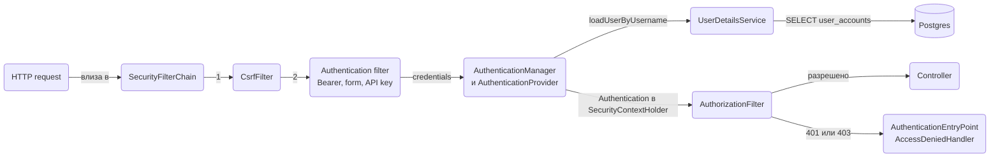
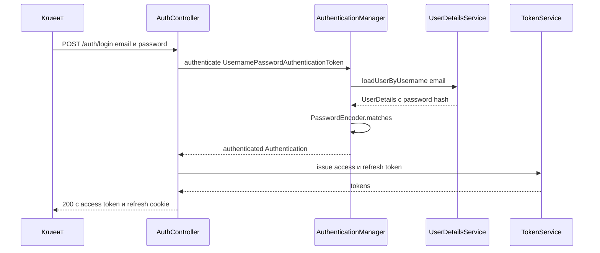

# Authentication

Authentication е отговорът на въпроса "кой прави този request": проверка на парола, валидиране на token, разпознаване на session cookie или API ключ. В Spring Boot това е Spring Security 6.5, който по подразбиране заключва всичко и чака ти да му кажеш как се удостоверяват хората и услугите. Този документ обяснява модела (`SecurityFilterChain`, `AuthenticationManager`, `UserDetailsService`, `SecurityContextHolder`), показва три пълни конфигурации, които покриват почти всеки нов сървис: session login за server-rendered приложения, stateless JWT за API с refresh token-и в базата, и OAuth2 login с Google или GitHub плюс Keycloak като външен identity provider. Накрая има API ключове за service-to-service, `ProblemDetail` отговори при 401 и 403, няколко filter chain-а за API и web, password reset и тестване с `spring-security-test`. Какво може потребителят, след като е разпознат, е темата на [Authorization](Authorization.md).

| Сценарий | Механизъм | Състояние | Раздел |
|---|---|---|---|
| Server-rendered приложение с Thymeleaf | `formLogin` + session cookie | stateful, в сървъра | 5 |
| REST API за SPA или mobile | JWT access token + refresh token в базата | stateless | 6 |
| "Влез с Google" | `oauth2Login` + връзка с локален потребител | session | 7 |
| Корпоративен SSO, Keycloak | `oauth2ResourceServer` с `issuer-uri` | stateless | 7 |
| Service-to-service, cron, webhook | API ключ в header, custom filter | stateless | 9 |
| Admin панел и API в едно приложение | два `SecurityFilterChain` със `securityMatcher` | смесено | 10 |

## 1. Зависимости и настройка

```xml pom.xml
<dependency>
    <groupId>org.springframework.boot</groupId>
    <artifactId>spring-boot-starter-security</artifactId>
</dependency>
<!-- JWT: носи spring-security-oauth2-jose и Nimbus -->
<dependency>
    <groupId>org.springframework.boot</groupId>
    <artifactId>spring-boot-starter-oauth2-resource-server</artifactId>
</dependency>
<!-- Login с Google, GitHub, Keycloak -->
<dependency>
    <groupId>org.springframework.boot</groupId>
    <artifactId>spring-boot-starter-oauth2-client</artifactId>
</dependency>
<dependency>
    <groupId>org.springframework.security</groupId>
    <artifactId>spring-security-test</artifactId>
    <scope>test</scope>
</dependency>
```

Само със `spring-boot-starter-security` в classpath-а Spring Boot прави следното: всеки endpoint изисква authentication, има form login на `/login` и HTTP Basic, един потребител `user` с парола, която се печата в лога при старт (`Using generated security password: ...`), CSRF защита е включена и се пращат security header-и. Това е умишлено: по-добре да е заключено и да отвориш каквото трябва, отколкото обратното. Първата ти задача е да замениш генерирания потребител със `SecurityFilterChain` bean и `UserDetailsService`.

```yaml src/main/resources/application.yml
app:
  security:
    jwt:
      issuer: shop-api
      access-token-ttl: 15m
      refresh-token-ttl: 30d
      public-key: classpath:keys/public.pem
      private-key: classpath:keys/private.pem
```

Ключовете се генерират веднъж и в production идват от secret store, не от classpath:

```bash
openssl genpkey -algorithm RSA -pkeyopt rsa_keygen_bits:2048 -out private.pem
openssl rsa -in private.pem -pubout -out public.pem
```

## 2. Моделът на Spring Security

Spring Security е верига от servlet filter-и, регистрирана като един filter `springSecurityFilterChain` пред `DispatcherServlet`. Всеки filter има една задача: прочети credentials от request-а, валидирай ги, сложи резултата в `SecurityContextHolder`, или провери дали вече има authentication и пусни или откажи.



| Компонент | Роля | Какво правиш с него |
|---|---|---|
| `SecurityFilterChain` | кой filter за кои URL-и, какви правила | дефинираш го като bean, един или няколко |
| `AuthenticationManager` | приема `Authentication` с credentials, връща authenticated `Authentication` | викаш го ръчно в login endpoint |
| `AuthenticationProvider` | знае как да провери един вид credentials | `DaoAuthenticationProvider` се създава сам при наличие на `UserDetailsService` |
| `UserDetailsService` | зарежда потребител по username | имплементираш го върху JPA |
| `PasswordEncoder` | хешира и сравнява пароли | bean, един за приложението |
| `SecurityContextHolder` | `ThreadLocal` с текущия `Authentication` | четеш го в сървиси |
| `Authentication` | principal, authorities, `isAuthenticated()` | получаваш го в controller като параметър |
| `Principal` | "кой": `UserDetails`, `Jwt`, `OAuth2User` | `@AuthenticationPrincipal` |



## 3. Потребители и пароли

### PasswordEncoder и entity

Паролата никога не се пази в чист вид. `PasswordEncoder` bean-ът е един за цялото приложение: `PasswordEncoderFactories.createDelegatingPasswordEncoder()`. `DelegatingPasswordEncoder` записва хеша с prefix (`{bcrypt}$2a$10$...`), така че по-късно можеш да минеш на argon2 без да счупиш старите хешове. По подразбиране делегиращият encoder хешира с bcrypt (strength 10). За argon2 (препоръка на OWASP за нови системи): `Argon2PasswordEncoder.defaultsForSpringSecurity_v5_8()`, увит в `DelegatingPasswordEncoder` с id `argon2`.

```java src/main/java/com/acme/shop/user/
@Entity
@Table(name = "user_accounts")
public class UserAccount {

    @Id private UUID id = UUID.randomUUID();
    @Column(nullable = false, unique = true) private String email;
    @Column(name = "password_hash", nullable = false) private String passwordHash;
    @Column(nullable = false) private boolean enabled = true;

    @ElementCollection(fetch = FetchType.EAGER)
    @CollectionTable(name = "user_roles", joinColumns = @JoinColumn(name = "user_id"))
    @Column(name = "role")
    @Enumerated(EnumType.STRING)
    private Set<Role> roles = new HashSet<>();

    protected UserAccount() {}

    public UserAccount(String email, String passwordHash) {
        this.email = email;
        this.passwordHash = passwordHash;
    }
    // getters, add/remove role
}

public enum Role { ADMIN, MANAGER, CUSTOMER }
```

`EAGER` на ролите е оправдан: винаги ти трябват заедно с потребителя и са няколко реда (виж [Релации](Relations.md)).

### UserDetailsService върху JPA

`UserDetails` е контрактът, който `DaoAuthenticationProvider` разбира. Собствен `AppUserPrincipal` е по-удобен от вградения `User`, защото носи и `id`, който ти трябва навсякъде.

```java src/main/java/com/acme/shop/user/AppUserPrincipal.java
package com.acme.shop.user;

import org.springframework.security.core.userdetails.UserDetails;

public record AppUserPrincipal(UUID id, String email, String passwordHash, boolean enabled,
                               Set<Role> roles) implements UserDetails {

    public static AppUserPrincipal from(UserAccount u) {
        return new AppUserPrincipal(u.getId(), u.getEmail(), u.getPasswordHash(), u.isEnabled(), Set.copyOf(u.getRoles()));
    }

    @Override
    public Collection<? extends GrantedAuthority> getAuthorities() {
        return roles.stream().map(r -> new SimpleGrantedAuthority("ROLE_" + r.name())).toList();
    }

    @Override public String getPassword() { return passwordHash; }
    @Override public String getUsername() { return email; }
    @Override public boolean isEnabled() { return enabled; }
}
```

```java src/main/java/com/acme/shop/user/JpaUserDetailsService.java
package com.acme.shop.user;

import org.springframework.security.core.userdetails.UserDetailsService;
import org.springframework.security.core.userdetails.UsernameNotFoundException;

@Service
public class JpaUserDetailsService implements UserDetailsService {

    private final UserAccountRepository users;

    public JpaUserDetailsService(UserAccountRepository users) {
        this.users = users;
    }

    @Override
    @Transactional(readOnly = true)
    public UserDetails loadUserByUsername(String email) {
        return users.findByEmailIgnoreCase(email)
                .map(AppUserPrincipal::from)
                .orElseThrow(() -> new UsernameNotFoundException("No user " + email));
    }
}
```

`DaoAuthenticationProvider` превръща `UsernameNotFoundException` в `BadCredentialsException`, така че клиентът не може да различи "няма такъв email" от "грешна парола". Не го "поправяй".

## 4. Минимален работещ пример

Най-малката конфигурация, която заменя генерирания потребител: публичен каталог, всичко останало зад HTTP Basic (удобен за curl, докато изградиш JWT).

```java src/main/java/com/acme/shop/common/config/SecurityConfig.java
package com.acme.shop.common.config;

import org.springframework.security.config.Customizer;
import org.springframework.security.config.annotation.web.configuration.EnableWebSecurity;
import org.springframework.security.config.http.SessionCreationPolicy;

@Configuration
@EnableWebSecurity
public class SecurityConfig {

    @Bean
    public SecurityFilterChain filterChain(HttpSecurity http) throws Exception {
        http
            .authorizeHttpRequests(a -> a
                .requestMatchers(HttpMethod.GET, "/api/products/**", "/api/categories/**").permitAll()
                .requestMatchers("/actuator/health/**", "/v3/api-docs/**", "/swagger-ui/**").permitAll()
                .anyRequest().authenticated())
            .httpBasic(Customizer.withDefaults())
            .sessionManagement(s -> s.sessionCreationPolicy(SessionCreationPolicy.STATELESS))
            .csrf(c -> c.disable());
        return http.build();
    }
}
```

`requestMatchers` приема path pattern-и (`**` за произволна дълбочина) и опционално `HttpMethod`. Редът има значение: първото съвпадение печели, затова `anyRequest()` е винаги последно. CSRF е изключен, защото няма cookie session, която атакуващ сайт може да използва; при session login остава включен (виж секция 8).

## 5. Session login за server-rendered приложения

Класическият вариант за Thymeleaf приложение: form login, session cookie `JSESSIONID`, logout. Spring Security пази `SecurityContext` в HTTP session-а, а cookie-то го идентифицира.

```java src/main/java/com/acme/shop/common/config/SecurityConfig.java
@Bean
public SecurityFilterChain webFilterChain(HttpSecurity http) throws Exception {
    http
        .authorizeHttpRequests(a -> a
            .requestMatchers("/", "/login", "/register", "/css/**", "/js/**", "/images/**").permitAll()
            .requestMatchers("/admin/**").hasRole("ADMIN")
            .anyRequest().authenticated())
        .formLogin(f -> f
            .loginPage("/login")
            .loginProcessingUrl("/login")
            .usernameParameter("email")
            .passwordParameter("password")
            .defaultSuccessUrl("/orders", false)
            .failureUrl("/login?error"))
        .logout(l -> l
            .logoutUrl("/logout")
            .logoutSuccessUrl("/login?logout")
            .invalidateHttpSession(true)
            .deleteCookies("JSESSIONID"))
        .rememberMe(r -> r.key("${app.security.remember-me-key}").tokenValiditySeconds(14 * 24 * 3600));
    return http.build();
}
```

Login формата е `POST /login` с полета `email` и `password`; Thymeleaf с `thymeleaf-extras-springsecurity6` добавя CSRF token-а в `th:action` формите автоматично. `loginProcessingUrl` се обработва от `UsernamePasswordAuthenticationFilter`; ти не пишеш controller за него, само `GET /login`, който връща шаблона. `defaultSuccessUrl("/orders", false)` връща потребителя на страницата, която е поискал преди login, а `/orders` е резервният вариант. Remember-me, session timeout, concurrent sessions и session fixation са в [Sessions и cookies](Sessions.md). Шаблоните са в [Имейли и HTML шаблони](Emails_Templates.md).

## 6. Stateless JWT за API

### Как работи

Клиентът праща email и парола на `POST /auth/login`. Сървърът проверява през `AuthenticationManager`, издава подписан JWT access token с кратък живот (15 минути) и refresh token с дълъг живот (30 дни), който се пази хеширан в базата. Всеки следващ request носи `Authorization: Bearer <access>`; `BearerTokenAuthenticationFilter` го валидира с `JwtDecoder` (подпис, `exp`, `iss`) без да пипа базата. Когато access token-ът изтече, клиентът праща refresh token-а, получава нова двойка, а старият refresh е отменен (rotation). Logout отменя refresh token-а; access token-ът остава валиден до `exp`, затова е кратък.

| Claim | Съдържание | Защо |
|---|---|---|
| `sub` | UUID на потребителя | стабилен идентификатор, не email (email се сменя) |
| `iss` | `shop-api` | decoder-ът отхвърля token-и от друг издател |
| `iat`, `exp` | издаден, изтича | `JwtTimestampValidator` проверява `exp` с 60 секунди clock skew |
| `jti` | UUID на token-а | за blacklist, ако някога ти потрябва |
| `roles` | `["ADMIN", "MANAGER"]` | конвертира се в `ROLE_*` authorities |
| `email` | за логове и UI | не е за идентификация |

### Ключове, encoder и decoder

```java src/main/java/com/acme/shop/common/config/JwtConfig.java
package com.acme.shop.common.config;

import com.nimbusds.jose.jwk.JWKSet;
import com.nimbusds.jose.jwk.RSAKey;
import com.nimbusds.jose.jwk.source.ImmutableJWKSet;
import com.nimbusds.jose.jwk.source.JWKSource;
import com.nimbusds.jose.proc.SecurityContext;
import org.springframework.security.oauth2.jwt.*;

@Configuration
public class JwtConfig {

    private final RSAPublicKey publicKey;
    private final RSAPrivateKey privateKey;

    // Spring Security регистрира конвертор от PEM файл към RSA ключ, затова @Value с classpath или file път работи
    public JwtConfig(@Value("${app.security.jwt.public-key}") RSAPublicKey publicKey,
                     @Value("${app.security.jwt.private-key}") RSAPrivateKey privateKey) {
        this.publicKey = publicKey;
        this.privateKey = privateKey;
    }

    @Bean
    public JwtEncoder jwtEncoder() {
        RSAKey jwk = new RSAKey.Builder(publicKey).privateKey(privateKey).keyID("shop-2026-10").build();
        JWKSource<SecurityContext> jwks = new ImmutableJWKSet<>(new JWKSet(jwk));
        return new NimbusJwtEncoder(jwks);
    }

    @Bean
    public JwtDecoder jwtDecoder() {
        return NimbusJwtDecoder.withPublicKey(publicKey).build();
    }
}
```

Вариант с HMAC secret вместо RSA, когато само този сървис издава и проверява token-ите (при няколко сървиса RSA е по-добре, защото публичният ключ може да се раздава свободно): `new NimbusJwtEncoder(new ImmutableSecret<>(secretKey))` и `NimbusJwtDecoder.withSecretKey(secretKey).macAlgorithm(MacAlgorithm.HS256).build()`, където `secretKey` е `new SecretKeySpec(secret.getBytes(UTF_8), "HmacSHA256")` с поне 32 байта secret. При HMAC `JwsHeader.with(MacAlgorithm.HS256)` е задължителен при encode, иначе encoder-ът търси RSA ключ.

### TokenService: издаване, refresh и отмяна

Refresh token-ът е случаен string, който се връща на клиента, а в базата стои само SHA-256 хешът му (ако базата изтече, token-ите не стават за нищо). Rotation: всяко използване отменя стария и издава нов. Reuse detection: ако се появи вече отменен token, някой го е откраднал, и отменяме всички token-и на потребителя.

```java src/main/java/com/acme/shop/auth/
@Entity
@Table(name = "refresh_tokens")
public class RefreshToken {

    @Id private UUID id = UUID.randomUUID();
    @Column(name = "token_hash", nullable = false, unique = true) private String tokenHash;
    @Column(name = "user_id", nullable = false) private UUID userId;
    @Column(name = "expires_at", nullable = false) private Instant expiresAt;
    @Column(name = "revoked_at") private Instant revokedAt;

    protected RefreshToken() {}

    public RefreshToken(String tokenHash, UUID userId, Instant expiresAt) {
        this.tokenHash = tokenHash;
        this.userId = userId;
        this.expiresAt = expiresAt;
    }

    public boolean isActive(Instant now) { return revokedAt == null && expiresAt.isAfter(now); }
    public void revoke(Instant now) { this.revokedAt = now; }
    public UUID getUserId() { return userId; }
}

public interface RefreshTokenRepository extends JpaRepository<RefreshToken, UUID> {
    Optional<RefreshToken> findByTokenHash(String tokenHash);

    @Modifying
    @Query("UPDATE RefreshToken t SET t.revokedAt = :now WHERE t.userId = :userId AND t.revokedAt IS NULL")
    int revokeAllForUser(@Param("userId") UUID userId, @Param("now") Instant now);

    int deleteByExpiresAtBefore(Instant before);
}
```

```java src/main/java/com/acme/shop/auth/TokenService.java
package com.acme.shop.auth;

import org.springframework.security.oauth2.jose.jws.SignatureAlgorithm;
import org.springframework.security.oauth2.jwt.JwsHeader;
import org.springframework.security.oauth2.jwt.JwtClaimsSet;
import org.springframework.security.oauth2.jwt.JwtEncoder;
import org.springframework.security.oauth2.jwt.JwtEncoderParameters;

@Service
public class TokenService {

    private final JwtEncoder jwtEncoder;
    private final RefreshTokenRepository refreshTokens;
    private final UserAccountRepository users;
    private final JwtProperties props;
    private final Clock clock;
    private final SecureRandom random = new SecureRandom();

    public TokenService(JwtEncoder jwtEncoder, RefreshTokenRepository refreshTokens,
                        UserAccountRepository users, JwtProperties props, Clock clock) {
        this.jwtEncoder = jwtEncoder;
        this.refreshTokens = refreshTokens;
        this.users = users;
        this.props = props;
        this.clock = clock;
    }

    public record TokenPair(String accessToken, String refreshToken, Instant accessExpiresAt) {}

    @Transactional
    public TokenPair issue(AppUserPrincipal user) {
        Instant now = clock.instant();
        return new TokenPair(createAccessToken(user, now), createRefreshToken(user.id(), now),
                now.plus(props.accessTokenTtl()));
    }

    @Transactional
    public TokenPair refresh(String presentedRefreshToken) {
        Instant now = clock.instant();
        RefreshToken stored = refreshTokens.findByTokenHash(hash(presentedRefreshToken))
                .orElseThrow(() -> new InvalidRefreshTokenException("unknown"));
        if (!stored.isActive(now)) {
            // Повторна употреба на отменен token: приемаме, че е откраднат, и затваряме всички сесии
            refreshTokens.revokeAllForUser(stored.getUserId(), now);
            throw new InvalidRefreshTokenException("reused or expired");
        }
        stored.revoke(now);
        UserAccount account = users.findById(stored.getUserId())
                .filter(UserAccount::isEnabled)
                .orElseThrow(() -> new InvalidRefreshTokenException("user disabled"));
        return issue(AppUserPrincipal.from(account));
    }

    @Transactional
    public void revoke(String presentedRefreshToken) {
        refreshTokens.findByTokenHash(hash(presentedRefreshToken)).ifPresent(t -> t.revoke(clock.instant()));
    }

    private String createAccessToken(AppUserPrincipal user, Instant now) {
        JwtClaimsSet claims = JwtClaimsSet.builder()
                .issuer(props.issuer())
                .issuedAt(now)
                .expiresAt(now.plus(props.accessTokenTtl()))
                .subject(user.id().toString())
                .id(UUID.randomUUID().toString())
                .claim("email", user.email())
                .claim("roles", user.roles().stream().map(Enum::name).toList())
                .build();
        JwsHeader header = JwsHeader.with(SignatureAlgorithm.RS256).keyId("shop-2026-10").build();
        return jwtEncoder.encode(JwtEncoderParameters.from(header, claims)).getTokenValue();
    }

    private String createRefreshToken(UUID userId, Instant now) {
        byte[] bytes = new byte[32];
        random.nextBytes(bytes);
        String token = Base64.getUrlEncoder().withoutPadding().encodeToString(bytes);
        refreshTokens.save(new RefreshToken(hash(token), userId, now.plus(props.refreshTokenTtl())));
        return token;
    }

    private static String hash(String token) {
        try {
            MessageDigest sha = MessageDigest.getInstance("SHA-256");
            return HexFormat.of().formatHex(sha.digest(token.getBytes(StandardCharsets.UTF_8)));
        } catch (NoSuchAlgorithmException e) {
            throw new IllegalStateException(e);
        }
    }
}
```

`JwtProperties` е `@ConfigurationProperties(prefix = "app.security.jwt")` record с `issuer`, `accessTokenTtl` и `refreshTokenTtl`. `Clock` е bean (`Clock.systemUTC()`), за да може тестът да движи времето. Изтеклите refresh token-и се чистят от scheduled job с `deleteByExpiresAtBefore`, виж [Cron, @Async и опашки](Scheduling_Queues.md).

### Login, refresh и logout endpoint-и

```java src/main/java/com/acme/shop/auth/AuthController.java
package com.acme.shop.auth;

import org.springframework.http.ResponseCookie;
import org.springframework.security.authentication.AuthenticationManager;
import org.springframework.security.authentication.UsernamePasswordAuthenticationToken;

@RestController
@RequestMapping("/auth")
public class AuthController {

    private static final String REFRESH_COOKIE = "refresh_token";

    private final AuthenticationManager authenticationManager;
    private final TokenService tokenService;
    private final JwtProperties props;

    public AuthController(AuthenticationManager authenticationManager, TokenService tokenService, JwtProperties props) {
        this.authenticationManager = authenticationManager;
        this.tokenService = tokenService;
        this.props = props;
    }

    public record LoginRequest(@Email @NotBlank String email, @NotBlank String password) {}
    public record TokenResponse(String accessToken, String tokenType, long expiresInSeconds) {}

    @PostMapping("/login")
    public ResponseEntity<TokenResponse> login(@Valid @RequestBody LoginRequest request) {
        Authentication auth = authenticationManager.authenticate(
                UsernamePasswordAuthenticationToken.unauthenticated(request.email(), request.password()));
        return respondWithTokens(tokenService.issue((AppUserPrincipal) auth.getPrincipal()));
    }

    @PostMapping("/refresh")
    public ResponseEntity<TokenResponse> refresh(@CookieValue(REFRESH_COOKIE) String refreshToken) {
        return respondWithTokens(tokenService.refresh(refreshToken));
    }

    @PostMapping("/logout")
    public ResponseEntity<Void> logout(@CookieValue(name = REFRESH_COOKIE, required = false) String refreshToken) {
        if (refreshToken != null) {
            tokenService.revoke(refreshToken);
        }
        return ResponseEntity.noContent().header("Set-Cookie", refreshCookie("", Duration.ZERO).toString()).build();
    }

    private ResponseEntity<TokenResponse> respondWithTokens(TokenService.TokenPair pair) {
        long expiresIn = Duration.between(Instant.now(), pair.accessExpiresAt()).toSeconds();
        return ResponseEntity.ok()
                .header("Set-Cookie", refreshCookie(pair.refreshToken(), props.refreshTokenTtl()).toString())
                .body(new TokenResponse(pair.accessToken(), "Bearer", expiresIn));
    }

    private ResponseCookie refreshCookie(String value, Duration maxAge) {
        return ResponseCookie.from(REFRESH_COOKIE, value)
                .httpOnly(true).secure(true).sameSite("Strict").path("/auth").maxAge(maxAge).build();
    }
}
```

`AuthenticationManager` bean-ът се дефинира като `config.getAuthenticationManager()` от инжектиран `AuthenticationConfiguration`.

```http
POST /auth/login HTTP/1.1
Content-Type: application/json

{"email": "ivan@example.com", "password": "secret"}

HTTP/1.1 200 OK
Set-Cookie: refresh_token=Q3h...; Path=/auth; HttpOnly; Secure; SameSite=Strict; Max-Age=2592000
Content-Type: application/json

{"accessToken": "eyJraWQiOiJzaG9wLTIwMjYtMTAiLCJhbGciOiJSUzI1NiJ9...", "tokenType": "Bearer", "expiresInSeconds": 900}
```

### Къде клиентът пази token-ите

| Място | Access token | Refresh token | Риск |
|---|---|---|---|
| `Authorization` header, в паметта на SPA | да | не | изчезва при reload, затова refresh е нужен |
| `httpOnly` cookie | възможно, но тогава трябва CSRF защита | да, с `Path=/auth` и `SameSite` | CSRF, ако cookie-то важи за API-то |
| `localStorage` | не | никога | всяко XSS краде token-ите |

Схемата горе (access в паметта и в header, refresh в `httpOnly` cookie, ограничено до `/auth`) е добрият компромис за SPA: XSS не може да прочете refresh token-а, а CSRF върху `/auth/refresh` дава на атакуващия само нов access token в response, който не вижда. За mobile клиенти refresh token-ът се връща в body и се пази в secure storage на устройството.

### Resource server конфигурация

```java src/main/java/com/acme/shop/common/config/SecurityConfig.java
@Bean
public SecurityFilterChain apiFilterChain(HttpSecurity http, JwtDecoder jwtDecoder,
                                          ProblemDetailAuthenticationEntryPoint entryPoint,
                                          ProblemDetailAccessDeniedHandler deniedHandler) throws Exception {
    http
        .securityMatcher("/api/**", "/auth/**")
        .authorizeHttpRequests(a -> a
            .requestMatchers("/auth/login", "/auth/refresh", "/auth/logout").permitAll()
            .requestMatchers(HttpMethod.GET, "/api/products/**").permitAll()
            .anyRequest().authenticated())
        .oauth2ResourceServer(o -> o
            .jwt(j -> j.decoder(jwtDecoder).jwtAuthenticationConverter(jwtAuthenticationConverter()))
            .authenticationEntryPoint(entryPoint)
            .accessDeniedHandler(deniedHandler))
        .exceptionHandling(e -> e.authenticationEntryPoint(entryPoint).accessDeniedHandler(deniedHandler))
        .sessionManagement(s -> s.sessionCreationPolicy(SessionCreationPolicy.STATELESS))
        .csrf(c -> c.disable());
    return http.build();
}

private JwtAuthenticationConverter jwtAuthenticationConverter() {
    JwtGrantedAuthoritiesConverter authorities = new JwtGrantedAuthoritiesConverter();
    authorities.setAuthoritiesClaimName("roles");
    authorities.setAuthorityPrefix("ROLE_");
    JwtAuthenticationConverter converter = new JwtAuthenticationConverter();
    converter.setJwtGrantedAuthoritiesConverter(authorities);
    return converter;
}
```

Без `JwtAuthenticationConverter` Spring чете claim `scope` и прави `SCOPE_*` authorities; конверторът го пренасочва към `roles` и `ROLE_*`, за да работи `hasRole("ADMIN")`. Entry point-ът се задава и на `oauth2ResourceServer`, защото той има свой `BearerTokenAuthenticationEntryPoint`, който иначе печели. Token с `exp` в миналото, грешен подпис или грешен `iss` води до 401 с `WWW-Authenticate: Bearer error="invalid_token"`; `iss` се валидира, ако добавиш `JwtValidators.createDefaultWithIssuer(issuer)` към decoder-а чрез `setJwtValidator`.

## 7. OAuth2 login и външен IdP

### Login с Google и GitHub

`spring-boot-starter-oauth2-client` реализира Authorization Code flow: redirect към provider-а, callback на `/login/oauth2/code/{registrationId}`, размяна на code за token, зареждане на профила. Резултатът е session с `OAuth2User` или `OidcUser` principal.

```yaml src/main/resources/application.yml
spring:
  security:
    oauth2:
      client:
        registration:
          google:
            client-id: ${GOOGLE_CLIENT_ID}
            client-secret: ${GOOGLE_CLIENT_SECRET}
            scope: openid,profile,email
          github:
            client-id: ${GITHUB_CLIENT_ID}
            client-secret: ${GITHUB_CLIENT_SECRET}
            scope: read:user,user:email
```

Google и GitHub са предефинирани в `CommonOAuth2Provider`, затова не описваш `provider` endpoint-ите. Единственото, което ти трябва отвъд конфигурацията, е да свържеш външния профил с локален `UserAccount`, за да имаш `id`, роли и собствени данни:

```java src/main/java/com/acme/shop/auth/LinkingOAuth2UserService.java
package com.acme.shop.auth;

import org.springframework.security.oauth2.client.userinfo.DefaultOAuth2UserService;
import org.springframework.security.oauth2.client.userinfo.OAuth2UserRequest;
import org.springframework.security.oauth2.core.user.DefaultOAuth2User;
import org.springframework.security.oauth2.core.user.OAuth2User;

@Service
public class LinkingOAuth2UserService extends DefaultOAuth2UserService {

    private final UserAccountService accounts;

    public LinkingOAuth2UserService(UserAccountService accounts) {
        this.accounts = accounts;
    }

    @Override
    public OAuth2User loadUser(OAuth2UserRequest request) {
        OAuth2User external = super.loadUser(request);
        String provider = request.getClientRegistration().getRegistrationId();
        String email = external.getAttribute("email");
        if (email == null) {
            throw new OAuth2AuthenticationException("email_required");
        }
        UserAccount local = accounts.findOrCreateFromProvider(provider, external.getName(), email);
        Map<String, Object> attributes = new HashMap<>(external.getAttributes());
        attributes.put("localUserId", local.getId().toString());
        return new DefaultOAuth2User(AppUserPrincipal.from(local).getAuthorities(), attributes, "email");
    }
}
```

Google връща OpenID Connect `id_token`, затова за него Spring използва `OidcUserService` и ти трябва аналогичен `OidcUserService` подклас. GitHub не дава email в профила, ако е скрит; тогава се извиква и `https://api.github.com/user/emails`. Закачането в chain-а е `http.oauth2Login(o -> o.loginPage("/login").userInfoEndpoint(u -> u.userService(oauth2UserService).oidcUserService(oidcUserService)).defaultSuccessUrl("/orders", false))`, като `/login/**` и `/oauth2/**` са `permitAll`. Login страницата има линкове към `/oauth2/authorization/google` и `/oauth2/authorization/github`. Ако приложението е API със SPA, след OAuth2 login можеш да издадеш собствен JWT през `successHandler`, но по-простото е SPA-то да работи със session cookie за този flow.

### Keycloak като resource server

Когато организацията има Keycloak (или Entra ID, Okta, Auth0), приложението не издава token-и изобщо. Клиентите ги получават от IdP-то, а ти само ги валидираш по `issuer-uri`: Spring тегли `.well-known/openid-configuration`, намира JWKS endpoint-а и валидира подписа с ротиращи ключове.

```yaml src/main/resources/application.yml
spring:
  security:
    oauth2:
      resourceserver:
        jwt:
          issuer-uri: https://sso.example.com/realms/shop
          audiences: shop-api
```

Keycloak слага ролите в `realm_access.roles` или `resource_access.<client>.roles`, не в top-level claim, затова конверторът е ръчен:

```java src/main/java/com/acme/shop/common/config/SecurityConfig.java
JwtAuthenticationConverter converter = new JwtAuthenticationConverter();
converter.setJwtGrantedAuthoritiesConverter(jwt -> {
    Map<String, Object> realmAccess = jwt.getClaimAsMap("realm_access");
    if (realmAccess == null) return List.of();
    @SuppressWarnings("unchecked")
    List<String> roles = (List<String>) realmAccess.getOrDefault("roles", List.of());
    return roles.stream().map(r -> (GrantedAuthority) new SimpleGrantedAuthority("ROLE_" + r.toUpperCase())).toList();
});
converter.setPrincipalClaimName("preferred_username");
```

`JwtDecoder` bean-ът идва от auto-configuration по `issuer-uri`; не дефинирай свой, иначе го заменяш. `sub` в Keycloak е UUID на потребителя в IdP-то; ако имаш локална таблица с потребители, пази този `sub` в нея като `external_id` и го свързваш при първия request (lazy provisioning).

## 8. CSRF, грешки и текущ потребител

### CSRF

Правилото е просто: ако браузърът прикача credentials автоматично (session cookie, Basic auth, cookie с JWT за API-то), CSRF защитата остава. Ако credentials идват в `Authorization` header, който JavaScript слага ръчно, атакуващ сайт не може да го прати и CSRF е излишен. Затова `csrf(c -> c.disable())` е в API chain-а с Bearer token и остава включен в web chain-а. За SPA със session cookie се използва `CookieCsrfTokenRepository.withHttpOnlyFalse()` и `CsrfTokenRequestAttributeHandler`; подробностите са в [Sessions и cookies](Sessions.md).

### 401 и 403 като ProblemDetail

По подразбиране API получава празно 401 или redirect към `/login`, което за JSON клиент е безполезно. Entry point-ът и handler-ът пишат `ProblemDetail`, същият формат като останалите грешки, виж [Грешки и ProblemDetail](Exception_Handling.md).

```java src/main/java/com/acme/shop/common/security/ProblemDetailAuthenticationEntryPoint.java
package com.acme.shop.common.security;

import org.springframework.http.ProblemDetail;
import org.springframework.security.core.AuthenticationException;
import org.springframework.security.web.AuthenticationEntryPoint;

@Component
public class ProblemDetailAuthenticationEntryPoint implements AuthenticationEntryPoint {

    private final ObjectMapper json;

    public ProblemDetailAuthenticationEntryPoint(ObjectMapper json) {
        this.json = json;
    }

    @Override
    public void commence(HttpServletRequest request, HttpServletResponse response,
                         AuthenticationException ex) throws IOException {
        ProblemDetail problem = ProblemDetail.forStatusAndDetail(HttpStatus.UNAUTHORIZED, "Authentication required");
        problem.setTitle("Unauthorized");
        problem.setType(URI.create("https://api.example.com/problems/unauthorized"));
        problem.setInstance(URI.create(request.getRequestURI()));
        response.setStatus(HttpStatus.UNAUTHORIZED.value());
        response.setHeader("WWW-Authenticate", "Bearer");
        response.setContentType(MediaType.APPLICATION_PROBLEM_JSON_VALUE);
        json.writeValue(response.getOutputStream(), problem);
    }
}
```

`ProblemDetailAccessDeniedHandler` имплементира `AccessDeniedHandler` по същия начин с `HttpStatus.FORBIDDEN`, title `Forbidden` и без `WWW-Authenticate`. Тези два класа работят на ниво filter, преди `DispatcherServlet`, затова `@RestControllerAdvice` не ги вижда. `BadCredentialsException` от `/auth/login` обаче се хвърля от controller-а и се обработва в advice-а като 401.

### Текущият потребител в controller и в service

```java src/main/java/com/acme/shop/order/OrderController.java
@GetMapping("/api/orders/mine")
public List<OrderSummary> mine(@AuthenticationPrincipal Jwt jwt) {
    return orderService.forCustomer(UUID.fromString(jwt.getSubject()));
}
```

Алтернативата е параметър `Authentication authentication` и `authentication.getName()`. `@AuthenticationPrincipal` дава principal-а, какъвто е: `Jwt` при resource server, `AppUserPrincipal` при form login, `OAuth2User` при OAuth2 login. Ако едно приложение има повече от един от тях, controller-ите стават грозни. Решението е `CurrentUser` record и provider, който го конструира от всеки вид principal и работи еднакво в controller и в service:

```java src/main/java/com/acme/shop/common/security/
public record CurrentUser(UUID id, String email, Set<String> roles) {}

@Component
public class CurrentUserProvider {

    public CurrentUser require() {
        return current().orElseThrow(() -> new AuthenticationCredentialsNotFoundException("No authenticated user"));
    }

    public Optional<CurrentUser> current() {
        Authentication auth = SecurityContextHolder.getContext().getAuthentication();
        if (auth == null || !auth.isAuthenticated() || auth instanceof AnonymousAuthenticationToken) {
            return Optional.empty();
        }
        Set<String> roles = auth.getAuthorities().stream()
                .map(GrantedAuthority::getAuthority)
                .filter(a -> a.startsWith("ROLE_"))
                .map(a -> a.substring(5))
                .collect(Collectors.toSet());
        return switch (auth.getPrincipal()) {
            case Jwt jwt -> Optional.of(new CurrentUser(UUID.fromString(jwt.getSubject()), jwt.getClaimAsString("email"), roles));
            case AppUserPrincipal p -> Optional.of(new CurrentUser(p.id(), p.email(), roles));
            case OAuth2User o -> Optional.of(new CurrentUser(UUID.fromString(o.getAttribute("localUserId")), o.getAttribute("email"), roles));
            default -> Optional.empty();
        };
    }
}
```

`SecurityContextHolder` е `ThreadLocal`; в `@Async` метод или в нова нишка контекстът го няма, освен ако не включиш `MODE_INHERITABLETHREADLOCAL` или не подадеш потребителя като параметър (по-чисто). Виртуалните нишки на Tomcat (`spring.threads.virtual.enabled=true`) не променят нищо тук: всеки request си има нишка и контекст.

## 9. API ключове за service-to-service

Cron job-ове, webhook-ове от партньори и вътрешни сървиси нямат потребител и парола. API ключът е случаен string, който се пази хеширан в таблица `api_keys` със собственик, scope-ове и `expires_at`, и се праща в header `X-Api-Key`.

```java src/main/java/com/acme/shop/common/security/ApiKeyAuthenticationFilter.java
package com.acme.shop.common.security;

import org.springframework.security.web.authentication.preauth.PreAuthenticatedAuthenticationToken;
import org.springframework.web.filter.OncePerRequestFilter;

public class ApiKeyAuthenticationFilter extends OncePerRequestFilter {

    private final ApiKeyService apiKeys;

    public ApiKeyAuthenticationFilter(ApiKeyService apiKeys) {
        this.apiKeys = apiKeys;
    }

    @Override
    protected void doFilterInternal(HttpServletRequest request, HttpServletResponse response, FilterChain chain)
            throws ServletException, IOException {
        String key = request.getHeader("X-Api-Key");
        if (key != null && SecurityContextHolder.getContext().getAuthentication() == null) {
            apiKeys.authenticate(key).ifPresent(client -> {
                var authorities = client.scopes().stream().map(s -> new SimpleGrantedAuthority("SCOPE_" + s)).toList();
                SecurityContextHolder.getContext().setAuthentication(
                        new PreAuthenticatedAuthenticationToken(client, null, authorities));
            });
        }
        chain.doFilter(request, response);
    }
}
```

`PreAuthenticatedAuthenticationToken` с authorities в конструктора е вече authenticated, затова не ти трябва собствен `Authentication` клас. Filter-ът не отказва заявки: ако ключът липсва или е невалиден, просто не слага authentication и `AuthorizationFilter` ще върне 401 през entry point-а. Отделен chain за вътрешните пътища:

```java src/main/java/com/acme/shop/common/config/SecurityConfig.java
@Bean
@Order(1)
public SecurityFilterChain internalFilterChain(HttpSecurity http, ApiKeyService apiKeys,
                                               ProblemDetailAuthenticationEntryPoint entryPoint) throws Exception {
    http
        .securityMatcher("/internal/**")
        .authorizeHttpRequests(a -> a
            .requestMatchers("/internal/reports/**").hasAuthority("SCOPE_reports:read")
            .anyRequest().authenticated())
        .addFilterBefore(new ApiKeyAuthenticationFilter(apiKeys), AuthorizationFilter.class)
        .exceptionHandling(e -> e.authenticationEntryPoint(entryPoint))
        .sessionManagement(s -> s.sessionCreationPolicy(SessionCreationPolicy.STATELESS))
        .csrf(c -> c.disable());
    return http.build();
}
```

`ApiKeyService.authenticate` хешира ключа с SHA-256, търси по хеша, проверява `expires_at` и връща `ApiClient(id, name, scopes)`. Ключът се показва на собственика веднъж при създаване и никога повече.

## 10. Няколко filter chain-а и header-и

Приложение с admin панел на Thymeleaf и JSON API за SPA има два различни свята: session и CSRF за единия, Bearer и stateless за другия. Всеки `SecurityFilterChain` със `securityMatcher` обслужва своите пътища; `@Order` определя кой се пробва пръв, а chain без `securityMatcher` хваща всичко останало и трябва да е последен.

Chain 1 (`@Order(1)`, `securityMatcher("/internal/**")`) и chain 2 (`@Order(2)`, `securityMatcher("/api/**", "/auth/**")`) са показани в секции 9 и 6; третият, без `securityMatcher`, е за web:

```java src/main/java/com/acme/shop/common/config/SecurityConfig.java
@Bean
@Order(3)
public SecurityFilterChain webFilterChain(HttpSecurity http) throws Exception {
    http
        .authorizeHttpRequests(a -> a
            .requestMatchers("/", "/login", "/css/**", "/js/**", "/actuator/health/**").permitAll()
            .requestMatchers("/admin/**").hasRole("ADMIN")
            .anyRequest().authenticated())
        .formLogin(f -> f.loginPage("/login").permitAll())
        .logout(l -> l.logoutSuccessUrl("/login?logout"))
        .headers(h -> h.frameOptions(fo -> fo.sameOrigin()));
    return http.build();
}
```

Request към `/api/orders` съвпада с chain 2 и никога не стига до chain 3, затова form login redirect-ът не го засяга. Общите bean-ове (`UserDetailsService`, `PasswordEncoder`, entry point) се споделят.

Spring Security праща по подразбиране `X-Content-Type-Options: nosniff`, `X-Frame-Options: DENY`, `Cache-Control: no-cache, no-store`, `X-XSS-Protection: 0` и `Strict-Transport-Security` (само при HTTPS request). Обикновено пипаш две неща: `frameOptions(sameOrigin())` за embedded iframe-ове и `contentSecurityPolicy(csp -> csp.policyDirectives("default-src 'self'"))` за web chain-а. За публични API endpoint-и, които трябва да се кешират, виж [Кеширане](Caching.md).

## 11. Password reset и MFA

Password reset е authentication без парола, затова е най-атакуваната част от системата. Схемата:

1. `POST /auth/password-reset` с email. Отговорът е винаги 202, независимо дали email-ът съществува (иначе издаваш кой е регистриран).
2. Ако съществува: генерираш 32 случайни байта, пазиш SHA-256 хеша в `password_reset_tokens` с `expires_at = now + 30 min` и `used_at = null`, и пращаш линк `https://app.example.com/reset?token=<raw>` по email (виж [Имейли и HTML шаблони](Emails_Templates.md)).
3. `POST /auth/password-reset/confirm` с `token` и `newPassword`: търсиш по хеша, проверяваш `expires_at` и `used_at`, сменяш паролата през `PasswordEncoder`, маркираш token-а като използван и отменяш всички refresh token-и на потребителя (`revokeAllForUser`), защото някой със стария достъп не трябва да го запази.

Rate limit на първия endpoint по IP и по email е задължителен, виж [Middleware: Filters, Interceptors, AOP](Middleware.md).

MFA с TOTP (Google Authenticator) се добавя като втора стъпка след паролата: при login с включен MFA връщаш временен token с единствен scope `mfa:pending`, клиентът праща 6-цифрения код на `POST /auth/mfa/verify`, и чак тогава издаваш истинските token-и. Secret-ът на потребителя се пази криптиран; библиотека за генериране и проверка на кодове е `dev.samstevens.totp:totp` (виж последната версия в Maven Central). Passkeys (WebAuthn) са вградени в Spring Security 6.4+ през `http.webAuthn(...)` и са по-добрият избор от TOTP за нови потребителски приложения, но изискват повече frontend работа.

## 12. Тестване

`spring-security-test` дава три инструмента, всеки за различен слой. Общата настройка на `MockMvc` и Testcontainers е в [Testing](Testing.md).

```java src/test/java/com/acme/shop/order/OrderControllerSecurityTest.java
package com.acme.shop.order;

@WebMvcTest(OrderController.class)
@Import(SecurityConfig.class)
class OrderControllerSecurityTest {

    @Autowired MockMvc mvc;
    @MockitoBean OrderService orderService;
    @MockitoBean JwtDecoder jwtDecoder;

    @Test
    void anonymousGets401ProblemDetail() throws Exception {
        mvc.perform(get("/api/orders/mine"))
                .andExpect(status().isUnauthorized())
                .andExpect(header().string("Content-Type", "application/problem+json"))
                .andExpect(jsonPath("$.title").value("Unauthorized"));
    }

    @Test
    void jwtWithRolesClaimIsAccepted() throws Exception {
        UUID userId = UUID.randomUUID();
        mvc.perform(get("/api/orders/mine")
                        .with(jwt().jwt(j -> j.subject(userId.toString()).claim("roles", List.of("CUSTOMER")))
                                   .authorities(new SimpleGrantedAuthority("ROLE_CUSTOMER"))))
                .andExpect(status().isOk());
        verify(orderService).forCustomer(userId);
    }
}
```

`@WithMockUser(roles = "ADMIN")` на тестов метод слага вграден `User` без `id` в контекста и е достатъчен за проверка на роли. За session login с custom principal се използва `with(user(principal))`, където `principal` е `AppUserPrincipal`. `jwt()` подменя резултата на `BearerTokenAuthenticationFilter`, затова `JwtDecoder` не се използва, но bean-ът трябва да съществува за контекста. За end-to-end тест на login и refresh срещу реална база: `@SpringBootTest(webEnvironment = RANDOM_PORT)` с Testcontainers PostgreSQL, `RestClient` към `/auth/login`, после `/api/orders/mine` с получения token, после `/auth/refresh` с cookie-то, и проверка, че старият refresh token дава 401 при повторна употреба. Този тест хваща повечето регресии в `TokenService`.

## 13. Капани

- `spring-boot-starter-security` без `SecurityFilterChain` bean: приложението тръгва с генерирана парола в лога и всички endpoint-и заключени. Хората "решават" проблема с `permitAll()` на всичко и забравят. Напиши chain-а още в първия commit.
- Email като `sub` в JWT: потребителят сменя email-а и всички издадени token-и сочат към несъществуващ акаунт. `sub` е UUID.
- Дълъг access token без refresh: logout и смяна на парола не действат до `exp`. 15 минути access, refresh в базата с rotation.
- Refresh token в чист вид в базата: при изтичане на дъмп всеки има безсрочен достъп. Пази SHA-256 хеш.
- Без reuse detection при rotation: откраднат refresh token се използва паралелно с легитимния и никой не забелязва. Отменен token при повторна употреба отменя всички.
- JWT в `localStorage`: едно XSS и token-ът е в ръцете на атакуващия. Access в паметта, refresh в `httpOnly` cookie.
- CSRF изключен за session login, защото "пречеше": формите стават уязвими. Изключвай само в stateless chain.
- `anyRequest().authenticated()` преди `permitAll()` правила: първото съвпадение печели, всичко е заключено. `anyRequest()` е последен.
- Chain без `securityMatcher` с `@Order(1)`: хваща всички пътища и останалите chain-ове не се използват никога. Catch-all chain-ът е последен.
- `JwtAuthenticationConverter` не е зададен: claim-ът `roles` се игнорира, `hasRole("ADMIN")` връща 403 за всички, а в лога няма нищо.
- Entry point само в `exceptionHandling`, не в `oauth2ResourceServer`: resource server-ът ползва своя `BearerTokenAuthenticationEntryPoint` и връща празно 401 вместо `ProblemDetail`.
- Различно съобщение за "няма такъв потребител" и "грешна парола": enumeration на регистрираните email-и. Едно и също 401 за двата случая, същото за password reset.

## 14. Чеклист

- [ ] `SecurityFilterChain` bean с явни `permitAll` пътища (health, docs, публичен каталог) и `anyRequest().authenticated()` последно.
- [ ] `PasswordEncoder` е `DelegatingPasswordEncoder` с bcrypt или argon2, никъде няма пароли в чист вид.
- [ ] `UserDetailsService` върху JPA с `AppUserPrincipal`, който носи `id`.
- [ ] API chain-ът е `STATELESS`, с изключен CSRF и `oauth2ResourceServer().jwt()`; web chain-ът е със session и включен CSRF.
- [ ] JWT: RSA или HMAC ключове от secret store, `sub` е UUID, `iss` се валидира, access TTL 15 минути, `roles` claim с `JwtAuthenticationConverter`.
- [ ] Refresh token-ите са хеширани в базата, с rotation, reuse detection, отмяна при logout и смяна на парола, и scheduled cleanup.
- [ ] Refresh token-ът е в `httpOnly`, `Secure`, `SameSite` cookie с `Path=/auth`, access token-ът се връща в body.
- [ ] 401 и 403 се връщат като `ProblemDetail` от entry point и access denied handler, зададени и на `oauth2ResourceServer`.
- [ ] Текущият потребител се взема през `CurrentUserProvider`, не през casting на principal по controller-ите.
- [ ] Service-to-service достъпът е с хеширани API ключове в отделен chain, не със споделен потребител и парола.
- [ ] Password reset връща 202 винаги, token-ът е хеширан, с 30 минути живот и еднократна употреба, с rate limit.
- [ ] Има `@WebMvcTest` с `jwt()` и `@WithMockUser` за правилата и end-to-end тест на login, refresh и reuse.

## 15. Свързани документи

- [Authorization](Authorization.md): какво може разпознатият потребител, `@PreAuthorize`, роли и permissions.
- [Sessions и cookies](Sessions.md): session timeout, remember-me, CSRF за SPA със session cookie.
- [Грешки и ProblemDetail](Exception_Handling.md): форматът на 401 и 403 и обработката на `BadCredentialsException` в advice.
- [Имейли и HTML шаблони](Emails_Templates.md): линкът за password reset и login страницата.
- [Middleware: Filters, Interceptors, AOP](Middleware.md): rate limit за login и password reset, място на custom filter-ите.
- [Кеширане](Caching.md): `Cache-Control` header-и, които Spring Security задава, и как се презаписват.
- [Testing](Testing.md): `MockMvc`, `@WebMvcTest` и Testcontainers за end-to-end login тест.
- [Seeding](Seeding.md): създаване на първия admin с парола от env.
- [Spring Security reference](https://docs.spring.io/spring-security/reference/)
