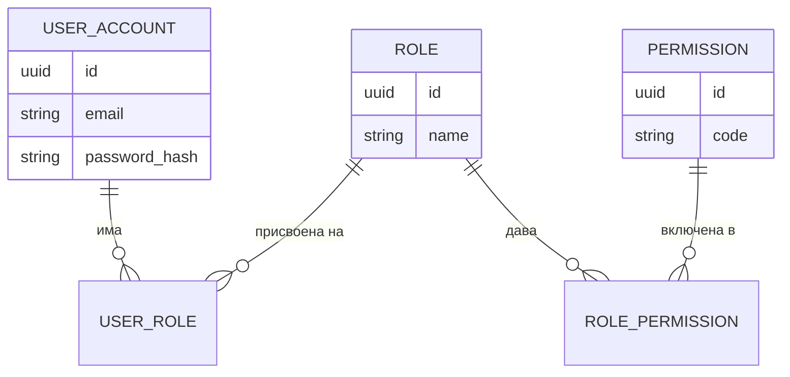
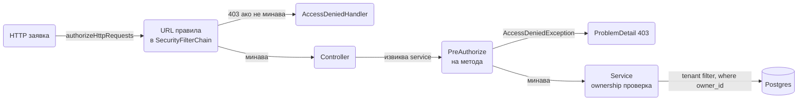

# Authorization

Authorization е въпросът "може ли този потребител да направи това действие върху този ресурс", който се задава след като вече знаеш кой е потребителят. В Spring Security отговорът се дава на три места: по URL в `SecurityFilterChain`, по метод с `@PreAuthorize` и по данни в service слоя и заявките към базата. Този документ показва как да дефинираш роли и permissions, как да ги заредиш от базата или от JWT, как да правиш ownership и tenant проверки, и как да тестваш всичко това без да вдигаш цялото приложение. Примерите са за домейн с поръчки, който вече използва автентикацията от [Authentication](Authentication.md).

| Какво | Кога | Инструмент |
|---|---|---|
| Грубо ограничение по път и HTTP метод | Цели секции от API | `authorizeHttpRequests` в `SecurityFilterChain` |
| Проверка на ниво бизнес операция | Всеки service метод, който променя данни | `@PreAuthorize` с SpEL и bean проверка |
| Ownership на конкретен ред | Поръчка, профил, документ на потребител | Проверка в service, `AccessDeniedException` |
| Изолация на наемател в multi-tenant | SaaS с общи таблици | `tenant_id` колона, Hibernate `@Filter` |
| Йерархия admin > manager > user | Да не изброяваш всички роли навсякъде | `RoleHierarchy` bean |
| Собствени правила отвъд роли | Policy по атрибути, време, лимити | `AuthorizationManager`, `PermissionEvaluator` |
| Скриване на полета по роля | Един DTO за admin и за клиент | `@JsonView` |

## 1. Зависимости и настройка

Authorization идва със същия starter като автентикацията. За method security не трябва нищо допълнително, само анотацията `@EnableMethodSecurity`. За зареждане на роли от базата ти трябва JPA, за JWT claims ти трябва resource server.

```xml pom.xml
<dependency>
    <groupId>org.springframework.boot</groupId>
    <artifactId>spring-boot-starter-security</artifactId>
</dependency>
<dependency>
    <groupId>org.springframework.boot</groupId>
    <artifactId>spring-boot-starter-data-jpa</artifactId>
</dependency>
<!-- само ако authorities идват от JWT -->
<dependency>
    <groupId>org.springframework.boot</groupId>
    <artifactId>spring-boot-starter-oauth2-resource-server</artifactId>
</dependency>
<dependency>
    <groupId>org.springframework.security</groupId>
    <artifactId>spring-security-test</artifactId>
    <scope>test</scope>
</dependency>
```

```yaml src/main/resources/application-dev.yml
logging:
  level:
    org.springframework.security.authorization: DEBUG
    org.springframework.security.web.access: DEBUG
```

Логването на `authorization` пакета показва кой `AuthorizationManager` е отказал и защо. Включвай го само в `dev` профила.

### Authentication срещу authorization

Authentication установява самоличност: кой си, доказано с парола, token или сертификат, и резултатът е обект `Authentication` в `SecurityContextHolder`. Authorization взима този обект и решава дали конкретно действие е позволено. Двете са отделни стъпки с отделни грешки: липсваща или невалидна самоличност дава 401, валидна самоличност без права дава 403. Как се стига до обекта `Authentication` е описано в [Authentication](Authentication.md); тук приемаме, че той вече съществува и има списък от `GrantedAuthority`.

## 2. Роли, authorities и модел на правата

### GrantedAuthority и префиксът ROLE_

В Spring Security всичко, което потребителят "има", е `GrantedAuthority`, обикновено `SimpleGrantedAuthority` с един string. Няма отделен тип за роля. Ролята е просто authority, който по конвенция започва с `ROLE_`. Това определя поведението на двата helper метода:

| Израз | Какво проверява реално |
|---|---|
| `hasRole("ADMIN")` | authority със стойност `ROLE_ADMIN` |
| `hasAuthority("ROLE_ADMIN")` | същото, но ти пишеш префикса |
| `hasAuthority("order:write")` | authority със стойност `order:write`, без никакъв префикс |
| `hasRole("ROLE_ADMIN")` | грешка при стартиране в Security 6: префиксът не бива да се подава |

Практично правило: роли за хора (`ROLE_ADMIN`, `ROLE_SUPPORT`) и fine-grained permissions за действия (`order:read`, `order:write`, `invoice:approve`). Ролята е набор от permissions. В кода проверяваш permissions, защото те рядко се сменят, докато кой има коя роля е административно решение.

### Опции за модел на правата

| Модел | Как изглежда | Подходящ за | Цена |
|---|---|---|---|
| Само роли | `hasRole("ADMIN")` навсякъде | Вътрешни инструменти, до 3 до 4 роли | Всяка нова нужда става нова роля |
| Роли + permissions | Роля е набор от `resource:action` | Повечето продуктови приложения | Още две таблици и admin UI |
| Ownership | "само собственикът на поръчката" | Всяко приложение с потребителски данни | Проверка в service, не в URL |
| ABAC или policy | Правила по атрибути: тенант, статус, час, сума | Сложни домейни, финанси, здраве | Policy engine, трудно за тестване |
| Външен PDP като OPA | Приложението пита по HTTP или sidecar | Много сървиси с общи правила | Мрежов hop, още една система за поддръжка |

Препоръка по размер: малък сървис с един екип започва с роли + ownership. Продукт с клиенти и admin панел взима роли + permissions + ownership. ABAC и външен policy engine има смисъл само когато правилата се променят от хора извън екипа или се споделят между десетки сървиси.

### ER модел на user, role и permission



## 3. Къде се взима решението

Решението се взима на три нива и всяко ниво хваща различен клас грешки. URL слоят спира заявки, които изобщо не трябва да стигат до controller. Method слоят защитава бизнес операциите независимо откъде са извикани. Data слоят гарантира, че дори оторизиран потребител вижда само своите редове.



Правило за разпределение: бизнес правилата ("поръчка може да се отмени само от собственика и само докато е в статус NEW") живеят в service слоя, където имат достъп до данните. Security слоят държи грубите правила: кой изобщо може да извиква тази група endpoints. Ако едно правило изисква да заредиш entity, то не е за `SecurityFilterChain`.

## 4. Минимален работещ пример

Един `SecurityFilterChain` с URL правила, един service с `@PreAuthorize` и bean за ownership. Това покрива 80 процента от нуждите на типичен API.

```java src/main/java/com/acme/shop/common/config/SecurityConfig.java
package com.acme.shop.common.config;

import org.springframework.context.annotation.Bean;
import org.springframework.context.annotation.Configuration;
import org.springframework.http.HttpMethod;
import org.springframework.security.config.annotation.method.configuration.EnableMethodSecurity;
import org.springframework.security.config.annotation.web.configuration.EnableWebSecurity;
import org.springframework.security.config.annotation.web.builders.HttpSecurity;
import org.springframework.security.web.SecurityFilterChain;

@Configuration
@EnableWebSecurity
@EnableMethodSecurity
public class SecurityConfig {

    @Bean
    SecurityFilterChain api(HttpSecurity http) throws Exception {
        http
            .authorizeHttpRequests(a -> a
                .requestMatchers("/actuator/health", "/actuator/info").permitAll()
                .requestMatchers("/api/auth/**").permitAll()
                .requestMatchers(HttpMethod.GET, "/api/products/**").permitAll()
                .requestMatchers(HttpMethod.POST, "/api/orders/**").hasAuthority("order:write")
                .requestMatchers(HttpMethod.DELETE, "/api/orders/**").hasRole("ADMIN")
                .requestMatchers("/api/admin/**").hasRole("ADMIN")
                .requestMatchers("/internal/**").denyAll()
                .anyRequest().authenticated())
            .oauth2ResourceServer(o -> o.jwt(j -> {}));
        return http.build();
    }
}
```

Редът на matchers има значение: Spring взима първия, който съвпада, и спира. Затова по-специфичните пътища стоят отгоре, а `anyRequest()` е винаги последен. Ако сложиш `anyRequest().authenticated()` преди `permitAll()` правилата, те никога няма да се изпълнят, а Security 6 ще хвърли грешка при стартиране, защото открива недостижим matcher.

```java src/main/java/com/acme/shop/order/OrderService.java
package com.acme.shop.order;

import org.springframework.security.access.prepost.PreAuthorize;
import org.springframework.stereotype.Service;
import org.springframework.transaction.annotation.Transactional;

@Service
public class OrderService {

    private final OrderRepository orders;

    public OrderService(OrderRepository orders) {
        this.orders = orders;
    }

    @PreAuthorize("hasAuthority('order:read') and @orderSecurity.isOwner(#id, authentication)")
    @Transactional(readOnly = true)
    public OrderResponse get(Long id) {
        return OrderResponse.from(orders.findById(id).orElseThrow());
    }

    @PreAuthorize("hasAuthority('order:write')")
    @Transactional
    public OrderResponse create(CreateOrderRequest req, String currentUser) {
        var order = new Order(currentUser, req.lines());
        return OrderResponse.from(orders.save(order));
    }

    @PreAuthorize("hasRole('ADMIN') or @orderSecurity.isOwner(#id, authentication)")
    @Transactional
    public void cancel(Long id) {
        var order = orders.findById(id).orElseThrow();
        order.cancel();
    }
}
```

```java src/main/java/com/acme/shop/order/OrderSecurity.java
package com.acme.shop.order;

import org.springframework.security.core.Authentication;
import org.springframework.stereotype.Component;

@Component("orderSecurity")
public class OrderSecurity {

    private final OrderRepository orders;

    public OrderSecurity(OrderRepository orders) {
        this.orders = orders;
    }

    public boolean isOwner(Long orderId, Authentication authentication) {
        if (authentication == null || orderId == null) {
            return false;
        }
        return orders.existsByIdAndOwnerEmail(orderId, authentication.getName());
    }
}
```

Bean проверката е предпочитана пред дълги SpEL изрази: тя е обикновена Java, тества се с unit test и се преизползва от няколко метода. Името на bean-а в `@Component("orderSecurity")` е това, което пишеш след `@` в израза.

```http
GET /api/orders/42 HTTP/1.1
Authorization: Bearer eyJ...

HTTP/1.1 403 Forbidden
Content-Type: application/problem+json

{
  "type": "about:blank",
  "title": "Forbidden",
  "status": 403,
  "detail": "Access Denied",
  "instance": "/api/orders/42"
}
```

## 5. URL правила в дълбочина

### Matchers и HTTP методи

`requestMatchers(String...)` в Boot 3.5 ползва `PathPatternRequestMatcher` за MVC приложения, така че синтаксисът е същият като в `@RequestMapping`: `**` за много сегменти, `{id}` за променлива. Ако имаш и MVC, и други servlets на различни пътища, Security изисква явен избор на matcher тип; при чисто MVC приложение не мислиш за това.

```java src/main/java/com/acme/shop/common/config/SecurityConfig.java
.authorizeHttpRequests(a -> a
    .requestMatchers(HttpMethod.GET, "/api/orders/{id}").hasAnyAuthority("order:read", "order:write")
    .requestMatchers(HttpMethod.PUT, "/api/orders/{id}/status").hasAuthority("order:manage")
    .requestMatchers("/api/reports/**").access(new WebExpressionAuthorizationManager(
        "hasRole('ADMIN') and hasIpAddress('10.0.0.0/8')"))
    .anyRequest().authenticated())
```

`WebExpressionAuthorizationManager` ти дава пълния SpEL, когато `hasRole` и `hasAuthority` не стигат.

### denyAll по подразбиране

Правилото `anyRequest().authenticated()` означава, че всеки нов endpoint автоматично изисква поне логнат потребител. Това е правилният default. Още по-строг вариант за чувствителни сървиси е `anyRequest().denyAll()`, при който всеки нов endpoint трябва изрично да бъде добавен в конфигурацията. Той е по-шумен, но нов controller никога не излиза неволно публичен.

Когато имаш и публичен API, и admin панел с различни правила, разделяш на две вериги с `securityMatcher("/admin/**")` и `@Order`; първата верига, която съвпада по път, обработва заявката. Примерът с две вериги е в [Authentication](Authentication.md).

## 6. Method security

### Включване и анотациите

`@EnableMethodSecurity` включва `@PreAuthorize`, `@PostAuthorize`, `@PreFilter` и `@PostFilter` чрез AOP proxy около bean-а. Това означава две неща: анотацията работи само на public методи, извикани отвън през proxy-то, и самоизвикване вътре в същия клас я заобикаля. Същата механика като при `@Transactional`, описана в [Middleware](Middleware.md).

| Анотация | Кога се изпълнява | Типична употреба |
|---|---|---|
| `@PreAuthorize` | преди метода | почти всичко: роли, permissions, ownership по id |
| `@PostAuthorize` | след метода, има достъп до `returnObject` | ownership, когато трябва да заредиш обекта, за да разбереш чий е |
| `@PreFilter` | филтрира колекция в аргумент | batch операция, в която потребителят подава списък от id |
| `@PostFilter` | филтрира върната колекция | малки списъци; за големи ползвай WHERE в заявката |

```java src/main/java/com/acme/shop/order/OrderService.java
@PostAuthorize("returnObject.ownerEmail == authentication.name or hasRole('ADMIN')")
public Order loadForEdit(Long id) {
    return orders.findById(id).orElseThrow();
}

@PostFilter("filterObject.ownerEmail == authentication.name")
public List<Order> recent() {
    return orders.findTop50ByOrderByCreatedAtDesc();
}
```

`@PostFilter` зарежда всичко от базата и после реже в паметта. За списъци над няколкостотин реда това е загуба; слагай условието в заявката и подавай текущия потребител като параметър, както е показано в раздел 9.

### SpEL изразите, които реално ползваш

| Израз | Значение |
|---|---|
| `hasRole('ADMIN')` | authority `ROLE_ADMIN` |
| `hasAuthority('order:write')` | точен authority |
| `hasAnyAuthority('a', 'b')` | поне един от тях |
| `authentication.name == #username` | параметърът `username` е текущият потребител |
| `principal.id == #userId` | когато principal е твой клас с поле `id` |
| `@orderSecurity.isOwner(#id, authentication)` | извикване на bean |
| `isAuthenticated()`, `isAnonymous()` | състояние на сесията |
| `hasPermission(#id, 'Order', 'read')` | делегира към `PermissionEvaluator` |

Имената на параметрите (`#id`) се извличат от байткода. С Maven плъгина на Boot флагът `-parameters` е включен по подразбиране, но ако имаш собствена компилаторна конфигурация, увери се, че го има; иначе получаваш `IllegalArgumentException` при първото извикване.

### Custom PermissionEvaluator

Когато ownership проверката се повтаря за няколко типа entity, `hasPermission` дава единен вход. Трябват ти два bean-а: evaluator и expression handler, който го ползва.

```java src/main/java/com/acme/shop/common/security/DomainPermissionEvaluator.java
package com.acme.shop.common.security;

import java.io.Serializable;
import org.springframework.security.access.PermissionEvaluator;
import org.springframework.security.core.Authentication;
import org.springframework.stereotype.Component;

@Component
public class DomainPermissionEvaluator implements PermissionEvaluator {

    private final OrderRepository orders;
    private final InvoiceRepository invoices;

    public DomainPermissionEvaluator(OrderRepository orders, InvoiceRepository invoices) {
        this.orders = orders;
        this.invoices = invoices;
    }

    @Override
    public boolean hasPermission(Authentication auth, Object target, Object permission) {
        if (target instanceof Order order) {
            return check(auth, order.getOwnerEmail(), "order:" + permission);
        }
        return false;
    }

    @Override
    public boolean hasPermission(Authentication auth, Serializable id, String type, Object permission) {
        return switch (type) {
            case "Order" -> orders.findById((Long) id)
                .map(o -> check(auth, o.getOwnerEmail(), "order:" + permission))
                .orElse(false);
            case "Invoice" -> invoices.findById((Long) id)
                .map(i -> check(auth, i.getCustomerEmail(), "invoice:" + permission))
                .orElse(false);
            default -> false;
        };
    }

    private boolean check(Authentication auth, String ownerEmail, String requiredAuthority) {
        boolean isAdmin = auth.getAuthorities().stream()
            .anyMatch(g -> g.getAuthority().equals("ROLE_ADMIN"));
        boolean hasAuthority = auth.getAuthorities().stream()
            .anyMatch(g -> g.getAuthority().equals(requiredAuthority));
        return isAdmin || (hasAuthority && ownerEmail.equals(auth.getName()));
    }
}
```

```java src/main/java/com/acme/shop/common/config/MethodSecurityConfig.java
package com.acme.shop.common.config;

import org.springframework.context.annotation.Bean;
import org.springframework.context.annotation.Configuration;
import org.springframework.security.access.expression.method.DefaultMethodSecurityExpressionHandler;
import org.springframework.security.access.expression.method.MethodSecurityExpressionHandler;

@Configuration
public class MethodSecurityConfig {

    @Bean
    static MethodSecurityExpressionHandler methodSecurityExpressionHandler(
            DomainPermissionEvaluator evaluator) {
        var handler = new DefaultMethodSecurityExpressionHandler();
        handler.setPermissionEvaluator(evaluator);
        return handler;
    }
}
```

Методът е `static`, защото Security го създава рано, преди останалите bean-ове, и иначе получаваш предупреждение за early initialization. След това в service слоя: `@PreAuthorize("hasPermission(#id, 'Order', 'read')")`.

## 7. AuthorizationManager API

От Security 6 всяко решение минава през `AuthorizationManager<T>`. За URL `T` е `RequestAuthorizationContext`, за методи е `MethodInvocation`. Ако нито SpEL, нито `PermissionEvaluator` описват правилото ти, пишеш собствен manager.

```java src/main/java/com/acme/shop/common/security/BusinessHoursAuthorizationManager.java
package com.acme.shop.common.security;

import java.util.function.Supplier;
import org.springframework.security.authorization.AuthorizationDecision;
import org.springframework.security.authorization.AuthorizationManager;
import org.springframework.security.core.Authentication;
import org.springframework.security.web.access.intercept.RequestAuthorizationContext;

public class BusinessHoursAuthorizationManager
        implements AuthorizationManager<RequestAuthorizationContext> {

    private final java.time.Clock clock;

    public BusinessHoursAuthorizationManager(java.time.Clock clock) {
        this.clock = clock;
    }

    // В Security 7 абстрактният метод е authorize и връща AuthorizationResult.
    @Override
    public AuthorizationDecision check(Supplier<Authentication> authentication,
                                       RequestAuthorizationContext context) {
        var auth = authentication.get();
        boolean isAdmin = auth != null && auth.getAuthorities().stream()
            .anyMatch(g -> g.getAuthority().equals("ROLE_ADMIN"));
        int hour = java.time.LocalTime.now(clock).getHour();
        return new AuthorizationDecision(isAdmin || (hour >= 8 && hour < 20));
    }
}
```

```java src/main/java/com/acme/shop/common/config/SecurityConfig.java
.authorizeHttpRequests(a -> a
    .requestMatchers("/api/payouts/**").access(new BusinessHoursAuthorizationManager(clock))
    .anyRequest().authenticated())
```

`RequestMatcherDelegatingAuthorizationManager` е класът, който стои зад `authorizeHttpRequests`: списък от двойки matcher и manager, обхождан по ред, като `AuthorityAuthorizationManager.hasAuthority(...)` и `AuthenticatedAuthorizationManager.authenticated()` са готовите manager-и зад `hasAuthority()` и `authenticated()`. Можеш да го построиш ръчно с `RequestMatcherDelegatingAuthorizationManager.builder().add(matcher, manager)`, когато правилата идват от конфигурация или база, и да го подадеш с `.anyRequest().access(delegating)`. За методи SpEL може да се замени със собствен `AuthorizationManager<MethodInvocation>` и `AuthorizationManagerBeforeMethodInterceptor`, но това е рядко нужно; bean проверка в SpEL е достатъчна.

## 8. Зареждане на правата

### От базата през UserDetailsService

При локална автентикация (парола, сесия) правата се четат при login и се слагат в `UserDetails`. С модела от ER диаграмата:

```java src/main/java/com/acme/shop/user/
package com.acme.shop.user;

import jakarta.persistence.*;
import java.util.HashSet;
import java.util.Set;

@Entity
@Table(name = "user_account")
public class UserAccount {
    @Id @GeneratedValue
    private Long id;
    @Column(nullable = false, unique = true)
    private String email;
    private String passwordHash;

    @ManyToMany(fetch = FetchType.EAGER)
    @JoinTable(name = "user_role",
        joinColumns = @JoinColumn(name = "user_id"),
        inverseJoinColumns = @JoinColumn(name = "role_id"))
    private Set<Role> roles = new HashSet<>();
}

@Entity
public class Role {
    @Id @GeneratedValue
    private Long id;
    @Column(nullable = false, unique = true)
    private String name;

    @ManyToMany(fetch = FetchType.EAGER)
    @JoinTable(name = "role_permission",
        joinColumns = @JoinColumn(name = "role_id"),
        inverseJoinColumns = @JoinColumn(name = "permission_id"))
    private Set<Permission> permissions = new HashSet<>();
}

@Entity
public class Permission {
    @Id @GeneratedValue
    private Long id;
    @Column(nullable = false, unique = true)
    private String code;
}
```

EAGER тук е оправдан: ролите са малко, трябват при всеки login и нищо друго не ги зарежда. За другите релации в приложението правилото остава LAZY, както е описано в [Релации](Relations.md).

```java src/main/java/com/acme/shop/user/JpaUserDetailsService.java
package com.acme.shop.user;

import java.util.stream.Stream;
import org.springframework.security.core.authority.SimpleGrantedAuthority;
import org.springframework.security.core.userdetails.User;
import org.springframework.security.core.userdetails.UserDetails;
import org.springframework.security.core.userdetails.UserDetailsService;
import org.springframework.security.core.userdetails.UsernameNotFoundException;
import org.springframework.stereotype.Service;
import org.springframework.transaction.annotation.Transactional;

@Service
public class JpaUserDetailsService implements UserDetailsService {

    private final UserAccountRepository users;

    public JpaUserDetailsService(UserAccountRepository users) {
        this.users = users;
    }

    @Override
    @Transactional(readOnly = true)
    public UserDetails loadUserByUsername(String email) {
        var user = users.findByEmail(email)
            .orElseThrow(() -> new UsernameNotFoundException(email));

        var authorities = user.getRoles().stream()
            .flatMap(role -> Stream.concat(
                Stream.of(new SimpleGrantedAuthority("ROLE_" + role.getName())),
                role.getPermissions().stream()
                    .map(p -> new SimpleGrantedAuthority(p.getCode()))))
            .distinct()
            .toList();

        return User.withUsername(user.getEmail())
            .password(user.getPasswordHash())
            .authorities(authorities)
            .build();
    }
}
```

Резултатът за потребител с роля `MANAGER`, която включва `order:read` и `order:write`, е четири authorities: `ROLE_MANAGER`, `order:read`, `order:write` и каквото още носи ролята. Така `hasRole('MANAGER')` и `hasAuthority('order:write')` работят едновременно.

### От JWT claims

При resource server правата идват от token-а. По подразбиране `JwtAuthenticationConverter` чете claim `scope` или `scp` и слага префикс `SCOPE_`. Ако identity provider-ът ти издава claim `roles`, пренастройваш конвертера:

```java src/main/java/com/acme/shop/common/config/JwtAuthoritiesConfig.java
package com.acme.shop.common.config;

import org.springframework.context.annotation.Bean;
import org.springframework.context.annotation.Configuration;
import org.springframework.security.oauth2.server.resource.authentication.JwtAuthenticationConverter;
import org.springframework.security.oauth2.server.resource.authentication.JwtGrantedAuthoritiesConverter;

@Configuration
public class JwtAuthoritiesConfig {

    @Bean
    JwtAuthenticationConverter jwtAuthenticationConverter() {
        var roles = new JwtGrantedAuthoritiesConverter();
        roles.setAuthoritiesClaimName("roles");
        roles.setAuthorityPrefix("ROLE_");

        var scopes = new JwtGrantedAuthoritiesConverter();
        scopes.setAuthoritiesClaimName("scope");
        scopes.setAuthorityPrefix("");

        var converter = new JwtAuthenticationConverter();
        converter.setJwtGrantedAuthoritiesConverter(jwt -> {
            var all = new java.util.ArrayList<org.springframework.security.core.GrantedAuthority>();
            all.addAll(roles.convert(jwt));
            all.addAll(scopes.convert(jwt));
            return all;
        });
        return converter;
    }
}
```

Boot автоматично подава този bean на `oauth2ResourceServer().jwt()`. Token с `"roles": ["ADMIN"]` и `"scope": "order:read order:write"` дава `ROLE_ADMIN`, `order:read`, `order:write`. Ако claim-ът е вложен (Keycloak слага ролите в `realm_access.roles`), пишеш свой `Converter<Jwt, Collection<GrantedAuthority>>`, който чете `jwt.getClaimAsMap("realm_access")`.

### Йерархия на ролите

Без йерархия `hasRole('USER')` отхвърля admin, който няма изрично `ROLE_USER`. `RoleHierarchy` bean решава това и се прилага автоматично и в URL правила, и в method security.

```java src/main/java/com/acme/shop/common/config/SecurityConfig.java
@Bean
static RoleHierarchy roleHierarchy() {
    return RoleHierarchyImpl.withDefaultRolePrefix()
        .role("ADMIN").implies("MANAGER")
        .role("MANAGER").implies("USER")
        .build();
}
```

Йерархията работи само за роли, не за permissions. Ако искаш `order:manage` да включва `order:write`, го правиш при зареждане на authorities, не тук.

## 9. Данни: ownership и tenant изолация

### Ownership проверка в service

`@PreAuthorize` с bean проверка прави една допълнителна заявка само за да провери собственика. Когато методът така или иначе зарежда поръчката, по-евтино е проверката да е в самия метод. Хвърлената `AccessDeniedException` се превръща в 403 от `@RestControllerAdvice` в [Грешки и ProblemDetail](Exception_Handling.md).

```java src/main/java/com/acme/shop/order/OrderService.java
import org.springframework.security.access.AccessDeniedException;

@Transactional
public void cancel(Long id, CurrentUser current) {
    var order = orders.findById(id)
        .orElseThrow(() -> new OrderNotFoundException(id));
    if (!order.belongsTo(current) && !current.isAdmin()) {
        throw new AccessDeniedException("Order " + id + " is not owned by " + current.email());
    }
    order.cancel();
}
```

Важна подробност: при `GET /api/orders/{id}` на чужда поръчка често е по-правилно да върнеш 404, а не 403, за да не потвърждаваш, че поръчката съществува. Решението е по домейн, но бъди последователен в целия сървис.

```java src/main/java/com/acme/shop/common/security/CurrentUser.java
package com.acme.shop.common.security;

public record CurrentUser(String email, Long tenantId, Set<String> authorities) {
    public boolean isAdmin() {
        return authorities.contains("ROLE_ADMIN");
    }

    public static CurrentUser from(Authentication auth) {
        var jwt = (Jwt) auth.getPrincipal();
        return new CurrentUser(
            auth.getName(),
            jwt.getClaim("tenant_id"),
            auth.getAuthorities().stream().map(GrantedAuthority::getAuthority).collect(toSet()));
    }
}
```

В controller получаваш `Authentication` като параметър на метода или през `@AuthenticationPrincipal Jwt jwt`, и създаваш `CurrentUser`, който подаваш надолу. Service слоят не бива да чете `SecurityContextHolder` директно; така е тестваем без Security.

### Tenant изолация с колона и Hibernate filter

В multi-tenant SaaS с общи таблици всяка таблица има `tenant_id`, а всяка заявка трябва да филтрира по него. Да го пишеш ръчно във всеки repository метод е сигурен начин да го забравиш. Hibernate `@Filter` го добавя автоматично към всеки SELECT за entity-та с анотацията, веднъж активиран за текущата session.

```java src/main/java/com/acme/shop/order/Order.java
package com.acme.shop.order;

import jakarta.persistence.*;
import org.hibernate.annotations.Filter;
import org.hibernate.annotations.FilterDef;
import org.hibernate.annotations.ParamDef;

@Entity
@FilterDef(name = "tenantFilter", parameters = @ParamDef(name = "tenantId", type = Long.class))
@Filter(name = "tenantFilter", condition = "tenant_id = :tenantId")
public class Order {
    @Id @GeneratedValue
    private Long id;
    @Column(name = "tenant_id", nullable = false, updatable = false)
    private Long tenantId;
    private String ownerEmail;
    // ...
}
```

Филтърът се активира за всяка заявка, преди да започне работата с базата. Най-надеждното място е aspect около transactional service методите или `HandlerInterceptor`, който чете `TenantContext`.

```java src/main/java/com/acme/shop/common/security/TenantContext.java
package com.acme.shop.common.security;

public final class TenantContext {
    private static final ThreadLocal<Long> CURRENT = new ThreadLocal<>();

    public static void set(Long tenantId) { CURRENT.set(tenantId); }
    public static Long get() { return CURRENT.get(); }
    public static void clear() { CURRENT.remove(); }
}
```

```java src/main/java/com/acme/shop/common/security/TenantFilterAspect.java
package com.acme.shop.common.security;

import jakarta.persistence.EntityManager;
import org.aspectj.lang.ProceedingJoinPoint;
import org.aspectj.lang.annotation.Around;
import org.aspectj.lang.annotation.Aspect;
import org.hibernate.Session;
import org.springframework.stereotype.Component;

@Aspect
@Component
public class TenantFilterAspect {

    private final EntityManager em;

    public TenantFilterAspect(EntityManager em) {
        this.em = em;
    }

    @Around("@within(org.springframework.transaction.annotation.Transactional) || "
          + "@annotation(org.springframework.transaction.annotation.Transactional)")
    public Object enableFilter(ProceedingJoinPoint pjp) throws Throwable {
        Long tenantId = TenantContext.get();
        if (tenantId == null) {
            throw new IllegalStateException("No tenant in context for " + pjp.getSignature());
        }
        em.unwrap(Session.class).enableFilter("tenantFilter").setParameter("tenantId", tenantId);
        return pjp.proceed();
    }
}
```

`TenantContext` се пълни от filter в началото на заявката, като чете claim `tenant_id` от token-а, и се чисти в `finally`. С виртуални нишки `ThreadLocal` работи, но не се пренася в `@Async` методи; там подаваш tenant id явно като аргумент. Aspect-ът трябва да е с по-нисък приоритет от транзакционния, за да се изпълнява вътре в отворената транзакция, иначе `enableFilter` е върху друга session; задай `@Order(Ordered.LOWEST_PRECEDENCE - 10)` на aspect-а.

Рисковете на този подход: `@Filter` не се прилага при `em.find()` по id и при зареждане на lazy асоциации, а само при HQL и Criteria заявки. Затова за достъп по id ползваш `findByIdAndTenantId`, а при критични таблици добавяш и уникални индекси, включващи `tenant_id`. Пълната алтернатива е Postgres row level security с `SET app.tenant_id` при вземане на връзка от pool-а, което се прилага и за native SQL; тя е по-сигурна, но изисква настройка на базата, виж [База данни и ORM](Database_ORM.md).

### Винаги филтриращи repository методи

По-прост вариант без Hibernate filter е repository, в който няма метод без tenant аргумент:

```java src/main/java/com/acme/shop/order/OrderRepository.java
package com.acme.shop.order;

public interface OrderRepository extends JpaRepository<Order, Long> {
    Optional<Order> findByIdAndTenantId(Long id, Long tenantId);
    Page<Order> findAllByTenantIdAndOwnerEmail(Long tenantId, String ownerEmail, Pageable pageable);
    boolean existsByIdAndOwnerEmail(Long id, String ownerEmail);
}
```

Недостатъкът е, че наследените `findById` и `findAll` остават достъпни. Можеш да ги скриеш, като наследиш `Repository<Order, Long>` вместо `JpaRepository` и декларираш само нужните методи. Проверката в code review е проста: grep за `findById(` в service слоя.

## 10. Допълнителни механизми

### Impersonation с SwitchUserFilter

Support екипът често иска "да види приложението през очите на клиента". `SwitchUserFilter` сменя `Authentication` с този на целевия потребител, като пази оригиналния в authority `ROLE_PREVIOUS_ADMINISTRATOR`, за да може да се върне. Регистрираш го с `http.addFilterAfter(switchUserFilter(), AuthorizationFilter.class)`, ограничаваш пътя `/impersonate` до admin и логваш всяко превключване. Работи само със сесии, не със stateless JWT; при JWT вариантът е admin-ът да поиска token с claim `act` от identity provider-а.

### Полета по роля с JsonView

Един `OrderResponse` може да връща `internalMargin` само на admin. `@JsonView` маркира полетата, а controller-ът избира view според ролята. Подробности за mapping-а в [DTO и mapping](DTO_Mapping.md).

```java src/main/java/com/acme/shop/common/web/Views.java
package com.acme.shop.common.web;

public class Views {
    public interface Customer {}
    public interface Admin extends Customer {}
}
```

```java src/main/java/com/acme/shop/order/dto/OrderResponse.java
package com.acme.shop.order.dto;

public record OrderResponse(
    @JsonView(Views.Customer.class) Long id,
    @JsonView(Views.Customer.class) BigDecimal total,
    @JsonView(Views.Admin.class) BigDecimal internalMargin) {}
```

```java src/main/java/com/acme/shop/order/OrderController.java
@GetMapping("/{id}")
public MappingJacksonValue get(@PathVariable Long id, Authentication auth) {
    var body = new MappingJacksonValue(orderService.get(id));
    boolean admin = auth.getAuthorities().stream()
        .anyMatch(g -> g.getAuthority().equals("ROLE_ADMIN"));
    body.setSerializationView(admin ? Views.Admin.class : Views.Customer.class);
    return body;
}
```

### Audit log на отказан достъп

Security 6 публикува `AuthorizationDeniedEvent` за всеки отказ, стига да има регистриран `AuthorizationEventPublisher`. Това е най-евтиният audit за "кой се опита да направи какво".

```java src/main/java/com/acme/shop/common/config/SecurityConfig.java
@Bean
AuthorizationEventPublisher authorizationEventPublisher(ApplicationEventPublisher publisher) {
    return new SpringAuthorizationEventPublisher(publisher);
}
```

```java src/main/java/com/acme/shop/common/security/DeniedAccessAuditor.java
package com.acme.shop.common.security;

@Component
public class DeniedAccessAuditor {

    private static final Logger log = LoggerFactory.getLogger(DeniedAccessAuditor.class);

    @EventListener
    public void on(AuthorizationDeniedEvent<?> event) {
        var auth = event.getAuthentication().get();
        log.warn("access denied user={} target={}", auth != null ? auth.getName() : "anonymous",
            event.getObject());
    }
}
```

Записвай потребител, път или метод и време; не записвай тялото на заявката. Ако audit-ът трябва да е траен, слушателят пише в таблица `access_audit` с `@Async`, за да не бави отговора.

## 11. Тестване

### Method security без web слой

`@WithMockUser` създава `Authentication` в контекста за времето на теста. Зареждаш само service слоя и method security, не целия MVC.

```java src/test/java/com/acme/shop/order/OrderServiceAuthorizationTest.java
package com.acme.shop.order;

import static org.assertj.core.api.Assertions.assertThatThrownBy;
import org.junit.jupiter.api.Test;
import org.springframework.beans.factory.annotation.Autowired;
import org.springframework.boot.test.context.SpringBootTest;
import org.springframework.security.access.AccessDeniedException;
import org.springframework.security.test.context.support.WithMockUser;
import org.springframework.test.context.bean.override.mockito.MockitoBean;

@SpringBootTest(classes = {OrderService.class, OrderSecurity.class, MethodSecurityConfig.class,
                           DomainPermissionEvaluator.class})
class OrderServiceAuthorizationTest {

    @Autowired OrderService service;
    @MockitoBean OrderRepository orders;
    @MockitoBean InvoiceRepository invoices;

    @Test
    @WithMockUser(username = "ivan@example.com", authorities = "order:read")
    void ownerCanRead() {
        when(orders.existsByIdAndOwnerEmail(42L, "ivan@example.com")).thenReturn(true);
        when(orders.findById(42L)).thenReturn(Optional.of(new Order("ivan@example.com", List.of())));
        service.get(42L);
    }

    @Test
    @WithMockUser(username = "maria@example.com", authorities = "order:read")
    void strangerGets403() {
        when(orders.existsByIdAndOwnerEmail(42L, "maria@example.com")).thenReturn(false);
        assertThatThrownBy(() -> service.get(42L)).isInstanceOf(AccessDeniedException.class);
    }

    @Test
    @WithMockUser(roles = "ADMIN")
    void adminCanCancelAnything() {
        when(orders.findById(42L)).thenReturn(Optional.of(new Order("ivan@example.com", List.of())));
        service.cancel(42L);
    }
}
```

`@WithMockUser(roles = "ADMIN")` добавя `ROLE_ADMIN`; `authorities = "order:read"` слага точния string. Не смесвай двете в една анотация без да знаеш, че `authorities` замества генерираните от `roles`.

`@WithUserDetails("ivan@example.com")` вика истинския `UserDetailsService`, така че тества и зареждането на правата от базата. Изисква бean-ът да е наличен в контекста, обикновено заедно с Testcontainers Postgres.

### URL правила с MockMvc

```java src/test/java/com/acme/shop/order/OrderControllerSecurityTest.java
package com.acme.shop.order;

@WebMvcTest(OrderController.class)
@Import(SecurityConfig.class)
class OrderControllerSecurityTest {

    @Autowired MockMvc mvc;
    @MockitoBean OrderService service;
    @MockitoBean JwtDecoder jwtDecoder;

    @Test
    void anonymousGets401() throws Exception {
        mvc.perform(get("/api/orders/1")).andExpect(status().isUnauthorized());
    }

    @Test
    void userWithoutWriteGets403() throws Exception {
        mvc.perform(post("/api/orders").with(jwt().authorities(new SimpleGrantedAuthority("order:read")))
                .contentType(MediaType.APPLICATION_JSON).content("{}"))
            .andExpect(status().isForbidden());
    }

    @Test
    void writerCanCreate() throws Exception {
        mvc.perform(post("/api/orders").with(jwt().authorities(new SimpleGrantedAuthority("order:write")))
                .contentType(MediaType.APPLICATION_JSON).content("{\"lines\":[]}"))
            .andExpect(status().isCreated());
    }
}
```

`jwt()` е от `SecurityMockMvcRequestPostProcessors` и подменя декодирането на token; `JwtDecoder` е mock-нат само за да стартира контекстът. Повече за организацията на тестовете в [Testing](Testing.md).

## 12. Капани

- `hasRole("ROLE_ADMIN")` хвърля `IllegalArgumentException` при стартиране. Пишеш `hasRole("ADMIN")` или `hasAuthority("ROLE_ADMIN")`, никога двете заедно.
- Без `@EnableMethodSecurity` всички `@PreAuthorize` анотации са просто декорация и тестовете минават, защото никой не ги проверява. Сложи един тест, който очаква 403, и той ще ти каже, ако анотацията е изключена.
- Проверка само в controller-а оставя service слоя отворен за извикване от scheduler, listener или друг controller. Правилото живее в service, controller-ът само го ползва.
- `@PreAuthorize` върху private метод или извикан от същия клас не работи, защото няма proxy по пътя. Извади логиката в отделен bean.
- Да вярваш на id от клиента: `PUT /api/orders/42` с тяло `{"ownerEmail": "admin"}` не бива да може да смени собственика. Собственикът идва от `Authentication`, не от тялото. Същото за `tenantId`.
- `anyRequest().permitAll()` оставен от локално тестване стига до production. Ползвай `authenticated()` като последен ред и тест, който го доказва.
- `@PostFilter` върху `findAll()` зарежда цялата таблица, за да филтрира в паметта. Условието е в заявката, с текущия потребител като параметър.
- Hibernate `@Filter` не се прилага при `em.find()` и при lazy зареждане на асоциации. Достъпът по id минава през `findByIdAndTenantId`.
- `ThreadLocal` tenant контекст не се пренася в `@Async` и в `CompletableFuture` нишки. Подавай tenant id като аргумент или ползвай `TaskDecorator`, който го копира.
- Кеширане на резултати от `@PreAuthorize` методи с `@Cacheable`: ако кешът е преди security проверката по ред на aspect-ите, вторият потребител получава чуждите данни от кеша. Ключът на кеша трябва да включва потребителя, виж [Кеширане](Caching.md).
- Промяна на роли в базата не се отразява на вече логнат потребител със сесия или с дълъг JWT. При сесии презареди `Authentication` или инвалидирай сесията; при JWT дръж token-а кратък.
- `@WithMockUser` без `authorities` дава `ROLE_USER`. Тест, който очаква 403 за роля `USER`, минава по погрешка, ако методът изисква `hasRole('USER')`.

## 13. Чеклист

- [ ] `@EnableMethodSecurity` е на конфигурационен клас и има поне един тест за 403 от `@PreAuthorize`.
- [ ] `SecurityFilterChain` завършва с `anyRequest().authenticated()` или `denyAll()`, а `permitAll` пътищата са изброени поименно.
- [ ] Permissions са във формат `resource:action`, ролите са с `ROLE_` префикс само в данните, никога в `hasRole`.
- [ ] Ownership проверките са в service слоя и хвърлят `AccessDeniedException`, която advice-ът превръща в `ProblemDetail` 403.
- [ ] Собственик и tenant на нов запис се вземат от `Authentication`, не от тялото на заявката.
- [ ] При multi-tenant: `tenant_id` във всяка таблица, Hibernate filter или задължителен tenant параметър в repository, тест за изолация с два тенанта.
- [ ] `RoleHierarchy` bean е дефиниран, ако има повече от две роли с включване.
- [ ] Authorities от JWT се конвертират с явен `JwtAuthenticationConverter`, с документирани имена на claims.
- [ ] `AuthorizationEventPublisher` е регистриран и отказите се логват с потребител и ресурс.
- [ ] Тестове с `@WithMockUser` за всяка роля върху критичните service методи и `MockMvc` тестове за URL правилата.
- [ ] Чувствителни полета в отговорите са скрити по роля с `@JsonView` или отделен DTO.

## 14. Свързани документи

- [Authentication](Authentication.md): как се стига до обекта `Authentication`, върху който стъпва всичко тук.
- [Sessions и cookies](Sessions.md): какво се случва с правата при сесии, logout и смяна на роли.
- [Грешки и ProblemDetail](Exception_Handling.md): превръщане на `AccessDeniedException` в 403 с `ProblemDetail`.
- [DTO и mapping](DTO_Mapping.md): `@JsonView` и отделни DTO за различни роли.
- [База данни и ORM](Database_ORM.md): row level security и tenant колони на ниво база.
- [Middleware: Filters, Interceptors, AOP](Middleware.md): proxy механиката, от която зависи `@PreAuthorize`.
- [Testing](Testing.md): `spring-security-test`, `@WithMockUser` и `jwt()` post processor.
- [Spring Security reference, Authorization](https://docs.spring.io/spring-security/reference/servlet/authorization/index.html)
