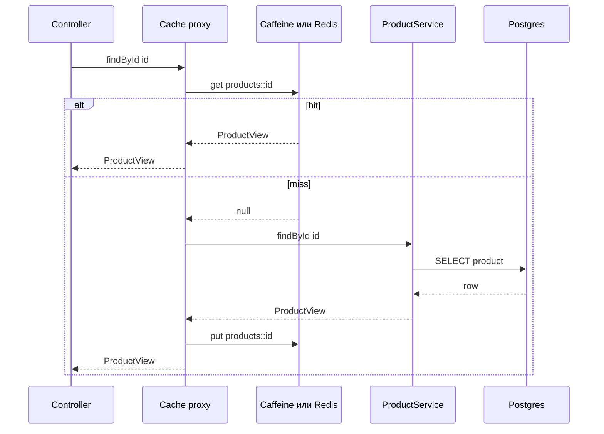
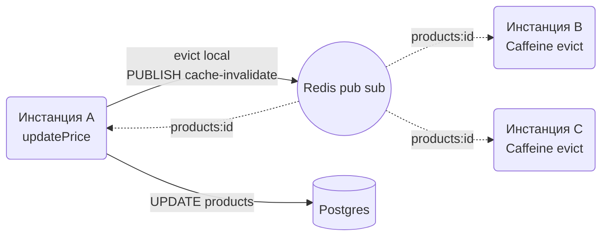

# Кеширане

Кешът е памет между приложението и бавен източник (база, външно API, тежка калкулация), която връща вече изчислен резултат вместо да го смята пак. Помага когато четенията са много повече от записите, когато изчислението е скъпо и когато бизнесът търпи данни, остарели с няколко секунди или минути. Цената е една: инвалидация, тоест въпросът "кога кешираната стойност вече е грешна", и почти всеки cache бъг е грешен отговор на този въпрос. Този документ показва Spring Cache абстракцията с Caffeine за локален кеш и Redis за споделен кеш между инстанции, стратегиите за инвалидация, защитата от stampede, директната работа с `RedisTemplate` за броячи и rate limits, и HTTP кеширането с `ETag` и `Cache-Control`. Домейнът е продуктов каталог и поръчки, базата е PostgreSQL.

| Какво | Кога | Инструмент |
|---|---|---|
| Локален in-memory кеш | една инстанция или данни, които може да са леко различни по инстанции | Caffeine през `@Cacheable` |
| Споделен кеш | няколко инстанции, скъпи данни, които трябва да са еднакви навсякъде | Redis през `RedisCacheManager` |
| Двустепенен кеш | много горещи ключове и много инстанции | Caffeine пред Redis с pub/sub инвалидация |
| Броячи, rate limit, set с TTL | неща, които не са "кеш на метод" | `StringRedisTemplate` директно |
| Кеш на HTTP response | публични ресурси, условни заявки | `ETag`, `Cache-Control`, `ShallowEtagHeaderFilter` |
| Изключване в тестове | unit и slice тестове | `spring.cache.type=none` |

## 1. Зависимости и настройка

`spring-boot-starter-cache` дава абстракцията и auto-configuration. Caffeine се закача автоматично, ако е в classpath-а; Redis също, ако има `spring-boot-starter-data-redis`. Когато са и двата, `spring.cache.type` избира кой е `CacheManager` по подразбиране.

```xml
<dependency>
    <groupId>org.springframework.boot</groupId>
    <artifactId>spring-boot-starter-cache</artifactId>
</dependency>
<dependency>
    <groupId>com.github.ben-manes.caffeine</groupId>
    <artifactId>caffeine</artifactId>
</dependency>
<dependency>
    <groupId>org.springframework.boot</groupId>
    <artifactId>spring-boot-starter-data-redis</artifactId>
</dependency>
```

```yaml
spring:
  cache:
    type: caffeine
    cache-names: products,productsByCategory,customers
    caffeine:
      spec: maximumSize=10000,expireAfterWrite=10m,recordStats
  data:
    redis:
      host: ${REDIS_HOST:localhost}
      port: 6379
management:
  endpoints:
    web:
      exposure:
        include: health,metrics,caches
```

`@EnableCaching` е задължителен, иначе `@Cacheable` е просто анотация, която нищо не прави:

```java
package com.example.shop.config;

import org.springframework.cache.annotation.EnableCaching;
import org.springframework.context.annotation.Configuration;

@Configuration
@EnableCaching
public class CacheConfig {}
```

За локална разработка Redis идва от compose файла. Spring Boot Docker Compose support (`spring-boot-docker-compose` dependency) разпознава `redis` image-а и настройва връзката сам:

```yaml
# compose.yaml
services:
  redis:
    image: redis:7-alpine
    ports:
      - "6379:6379"
    command: ["redis-server", "--maxmemory", "256mb", "--maxmemory-policy", "allkeys-lru"]
```

`allkeys-lru` е правилната политика за кеш: когато паметта свърши, Redis изхвърля най-отдавна неползваните ключове вместо да откаже запис.

## 2. Минимален работещ пример

Cache-aside през анотации: `@Cacheable` проверява кеша преди метода и записва резултата след него, `@CacheEvict` чисти при промяна. Кешираме DTO, не entity (защо, в секция 5).

```java
package com.example.shop.product;

import org.springframework.cache.annotation.CacheEvict;
import org.springframework.cache.annotation.Cacheable;
import org.springframework.stereotype.Service;
import org.springframework.transaction.annotation.Transactional;

@Service
public class ProductService {

    private final ProductRepository products;
    private final ProductMapper mapper;

    public ProductService(ProductRepository products, ProductMapper mapper) {
        this.products = products;
        this.mapper = mapper;
    }

    @Cacheable(cacheNames = "products", key = "#id", unless = "#result == null", sync = true)
    @Transactional(readOnly = true)
    public ProductView findById(UUID id) {
        return products.findById(id).map(mapper::toView).orElse(null);
    }

    @CacheEvict(cacheNames = "products", key = "#id")
    @Transactional
    public ProductView updatePrice(UUID id, BigDecimal newPrice) {
        Product product = products.findById(id).orElseThrow(() -> new ProductNotFoundException(id));
        product.changePrice(newPrice);
        return mapper.toView(product);
    }
}
```



Какво се случва отвътре: Spring обвива `ProductService` в proxy. При извикване на `findById` proxy-то строи ключ (`#id`), пита `CacheManager.getCache("products").get(key)`, и само при miss вика реалния метод. Това означава, че всичко, което важи за `@Transactional` proxy-тата, важи и тук: self-invocation не минава през кеша, private методи не се кешират, `final` класове не могат да бъдат proxy-нати. Виж [Транзакции и locking](Transactions.md) за същия механизъм.

## 3. Анотациите в дълбочина

| Анотация | Какво прави | Типична употреба |
|---|---|---|
| `@Cacheable` | ако има в кеша, връща го без да вика метода; иначе вика и записва | четене по ключ |
| `@CachePut` | винаги вика метода и записва резултата | update, който връща новата стойност |
| `@CacheEvict` | изтрива ключ или целия кеш | delete, update без връщане |
| `@Caching` | групира няколко анотации от различен тип | update, който пипа няколко кеша |
| `@CacheConfig` | общи настройки на ниво клас (`cacheNames`) | по-малко повторение |

### Ключове със SpEL

```java
@Cacheable(cacheNames = "productsByCategory", key = "#categoryId + ':' + #pageable.pageNumber")
public List<ProductView> byCategory(UUID categoryId, Pageable pageable) { ... }

@Cacheable(cacheNames = "customers", key = "#request.customerId")
public CustomerView lookup(CustomerLookupRequest request) { ... }

@CachePut(cacheNames = "products", key = "#result.id")
public ProductView create(CreateProductRequest request) { ... }

@CacheEvict(cacheNames = "products", key = "#product.id")
public void archive(Product product) { ... }
```

Без `key` Spring използва `SimpleKeyGenerator`: всички параметри в `SimpleKey`. Работи, но е крехко (промяна на сигнатурата променя ключа) и не се чете в Redis. Винаги задавай ключ явно. `#result` е наличен само в `@CachePut` и в `unless` на `@Cacheable`, не в `key` на `@Cacheable` (резултатът още не съществува при проверката).

### condition и unless

`condition` се оценява преди метода и решава дали изобщо да се ползва кешът. `unless` се оценява след метода и решава дали резултатът да се запише:

```java
@Cacheable(cacheNames = "products",
           key = "#id",
           condition = "#includeDrafts == false",
           unless = "#result == null || #result.archived()")
public ProductView findById(UUID id, boolean includeDrafts) { ... }
```

`unless = "#result == null"` е почти винаги нужно: иначе `null` се кешира (Caffeine го поддържа, Redis също по подразбиране) и след създаване на продукта с този id клиентът продължава да получава "няма такъв", докато не изтече TTL-ът.

### @CacheEvict: allEntries и beforeInvocation

```java
@CacheEvict(cacheNames = {"products", "productsByCategory"}, allEntries = true)
public void reindexCatalog() { ... }

@CacheEvict(cacheNames = "products", key = "#id", beforeInvocation = true)
public void delete(UUID id) { ... }
```

`allEntries = true` е чукът: чисти целия кеш. Използва се, когато ключовете на засегнатите записи не са известни (промяна на категория засяга неизвестно много `productsByCategory` ключове). По подразбиране evict става след успешно връщане на метода; `beforeInvocation = true` чисти преди метода, така че и при exception ключът е махнат. За delete това е по-безопасното поведение.

### @Caching за няколко кеша

```java
@Caching(
    put = @CachePut(cacheNames = "products", key = "#result.id"),
    evict = @CacheEvict(cacheNames = "productsByCategory", allEntries = true))
@Transactional
public ProductView update(UUID id, UpdateProductRequest request) { ... }
```

### Кеш и транзакции

`@Cacheable` записва в кеша веднага щом методът върне, независимо дали транзакцията после ще commit-не. Ако `@CachePut` метод записва в базата и транзакцията rollback-не след това (например в извикващия метод), кешът съдържа стойност, която никога не е стигнала до базата. Решението е `TransactionAwareCacheManagerProxy`, който отлага put и evict до commit:

```java
@Bean
public CacheManager cacheManager(CaffeineCacheManager caffeine) {
    return new TransactionAwareCacheManagerProxy(caffeine);
}
```

За Redis `RedisCacheManager.builder(...).transactionAware()` прави същото. Включи го, ако кешираш в методи с `@Transactional`, което е почти винаги.

## 4. Caffeine като локален кеш

Caffeine е най-бързият JVM кеш и е правилният избор по подразбиране за една инстанция или за данни, при които е приемливо две инстанции да виждат леко различно състояние за минута.

### Глобален spec

`spring.cache.caffeine.spec` важи за всички кешове. Най-важните ключове: `maximumSize` (брой записи), `expireAfterWrite` (TTL от запис), `expireAfterAccess` (TTL от последно четене), `recordStats` (без него actuator не показва hit ratio). Без `maximumSize` кешът расте неограничено и това е memory leak, маскиран като кеш.

### Различни настройки за различни кешове

Продуктите са 10 000 и се сменят рядко, курсовете на валутите са 20 и се сменят на час, а резултатите от търсене са безброй и трябва да живеят секунди. Един spec не пасва на всичко:

```java
package com.example.shop.config;

import com.github.benmanes.caffeine.cache.Caffeine;
import org.springframework.cache.caffeine.CaffeineCacheManager;
import org.springframework.context.annotation.Bean;
import org.springframework.context.annotation.Configuration;

import java.time.Duration;

@Configuration
public class CaffeineConfig {

    @Bean
    public CaffeineCacheManager caffeineCacheManager() {
        CaffeineCacheManager manager = new CaffeineCacheManager();
        manager.setCaffeine(Caffeine.newBuilder()
                .maximumSize(1_000)
                .expireAfterWrite(Duration.ofMinutes(5))
                .recordStats());
        manager.registerCustomCache("products", Caffeine.newBuilder()
                .maximumSize(10_000)
                .expireAfterWrite(Duration.ofMinutes(30))
                .recordStats()
                .build());
        manager.registerCustomCache("exchangeRates", Caffeine.newBuilder()
                .maximumSize(100)
                .expireAfterWrite(Duration.ofHours(1))
                .recordStats()
                .build());
        manager.registerCustomCache("searchResults", Caffeine.newBuilder()
                .maximumSize(5_000)
                .expireAfterWrite(Duration.ofSeconds(30))
                .recordStats()
                .build());
        return manager;
    }
}
```

Кешовете, които не са регистрирани явно, получават настройките от `setCaffeine`. Ако дефинираш собствен `CacheManager` bean, auto-configuration-ът се оттегля и `spring.cache.caffeine.spec` вече не важи, така че настройките живеят на едно място: или yaml, или Java, не и двете.

### Метрики

С `recordStats` и actuator всеки кеш дава `cache.gets` (с tag `result=hit|miss`), `cache.puts`, `cache.evictions` и `cache.size` в `/actuator/metrics`, а `/actuator/caches` показва кешовете и позволява `DELETE /actuator/caches/products` за ръчно чистене. Hit ratio под 50 процента означава, че кешът е или с грешен ключ, или с прекалено малък `maximumSize`, или данните просто не се четат повторно. Подробности в [Observability](Observability.md).

## 5. Redis като споделен кеш

При няколко инстанции зад load balancer Caffeine означава, че всяка инстанция има свой кеш, пълни го отделно и инвалидира само себе си. Redis решава това: един кеш, който всички виждат, и evict от една инстанция важи за всички. Цената е мрежов round trip (под милисекунда в същия датацентър) и сериализация.

### Конфигурация с TTL на кеш

```yaml
spring:
  cache:
    type: redis
    redis:
      time-to-live: 10m
      key-prefix: "shop:"
      use-key-prefix: true
      cache-null-values: false
```

Това дава еднакъв TTL за всички кешове. За различен TTL и за JSON сериализация ти трябва `RedisCacheManagerBuilderCustomizer`, който допълва auto-configured manager-а, без да го заменя:

```java
package com.example.shop.config;

import org.springframework.boot.autoconfigure.cache.RedisCacheManagerBuilderCustomizer;
import org.springframework.context.annotation.Bean;
import org.springframework.context.annotation.Configuration;
import org.springframework.data.redis.cache.RedisCacheConfiguration;
import org.springframework.data.redis.serializer.GenericJackson2JsonRedisSerializer;
import org.springframework.data.redis.serializer.RedisSerializationContext;
import org.springframework.data.redis.serializer.StringRedisSerializer;

import java.time.Duration;

@Configuration
public class RedisCacheConfig {

    @Bean
    public RedisCacheConfiguration defaultRedisCacheConfiguration() {
        return RedisCacheConfiguration.defaultCacheConfig()
                .entryTtl(Duration.ofMinutes(10))
                .disableCachingNullValues()
                .prefixCacheNameWith("shop:")
                .serializeKeysWith(RedisSerializationContext.SerializationPair.fromSerializer(new StringRedisSerializer()))
                .serializeValuesWith(RedisSerializationContext.SerializationPair.fromSerializer(
                        new GenericJackson2JsonRedisSerializer()));
    }

    @Bean
    public RedisCacheManagerBuilderCustomizer perCacheTtl(RedisCacheConfiguration defaults) {
        return builder -> builder
                .transactionAware()
                .withCacheConfiguration("products", defaults.entryTtl(Duration.ofMinutes(30)))
                .withCacheConfiguration("exchangeRates", defaults.entryTtl(Duration.ofHours(1)))
                .withCacheConfiguration("searchResults", defaults.entryTtl(Duration.ofSeconds(30)));
    }
}
```

Bean от тип `RedisCacheConfiguration` се взема от Spring Boot като default конфигурация на manager-а, затова `products` ключовете стават `shop:products::<id>` и се виждат четливо в `redis-cli`.

### Сериализация

По подразбиране Redis cache използва Java сериализация: бинарна, нечетима, чупи се при промяна на класа и изисква `Serializable`. `GenericJackson2JsonRedisSerializer` пише JSON с `@class` property, за да може да десериализира обратно без да знае типа предварително. Това означава, че преименуване или преместване на `ProductView` класа прави старите записи нечетими: при deploy с такава промяна смени `key-prefix` или изчисти кеша. Record-ите се сериализират нормално с Jackson 2.17+ (Boot 3.5 носи 2.19), а `Instant` и `UUID` работят без допълнителни модули, защото Boot регистрира `JavaTimeModule`.

Ако не искаш `@class` в JSON-а (например друг сървис чете същия кеш), използвай `Jackson2JsonRedisSerializer<ProductView>` с конкретен тип за конкретния кеш през `withCacheConfiguration`.

### Какво се кешира и какво не

| Кеширай | Не кеширай |
|---|---|
| DTO и record-и, които са immutable | JPA entity (lazy proxy-та, detached state, двупосочни релации) |
| Резултати от изчисления и агрегации | `Page<T>` (съдържа `Pageable` с нестабилна сериализация) |
| Отговори от външни API с явен TTL | Данни с лични или платежни детайли без encryption at rest |
| Малки обекти, до няколко KB | Списъци от хиляди елемента под един ключ |

Entity в кеша е най-честият бъг: `@Cacheable` метод връща `Product` с lazy `category`, следващият request го взема от кеша извън транзакция и получава `LazyInitializationException`. Map-вай към DTO преди да кешираш, виж [DTO и mapping](DTO_Mapping.md).

### Двустепенен кеш

При много инстанции и много горещи ключове (началната страница, конфигурацията на магазина) Redis round trip-ът на всеки request е излишен. Решението е Caffeine с кратък TTL (10 до 30 секунди) пред Redis с дълъг TTL. Spring Cache няма вграден two-level manager; `CompositeCacheManager` не прави това (той само търси кеш по име в няколко manager-а). Практичните варианти: собствен `Cache` decorator, който първо пита Caffeine и после Redis, или да приемеш краткия TTL на Caffeine като "допустима остарялост" и да инвалидираш през pub/sub (секция 6). Повечето проекти нямат нужда от това; въведи го само след като метриките покажат, че Redis GET е значима част от latency-то.

## 6. Инвалидация

Кешът е грешен от момента, в който източникът се промени. Въпросът е колко дълго търпиш грешката и кой я поправя.

| Стратегия | Как | Остарялост | Кога |
|---|---|---|---|
| Само TTL | записваш с `expireAfterWrite`, не чистиш при промяна | до TTL | данни от външни системи, статистики, всичко с "обновява се на всеки N минути" |
| Evict при запис | `@CacheEvict` в метода, който променя | нула за същата инстанция и Redis | повечето CRUD |
| Evict през събития | domain event след commit, listener чисти кеша | милисекунди | когато промяната идва от друг модул или сървис |
| Pub/sub за локални кешове | инстанцията, която променя, публикува в Redis канал, всички чистят своя Caffeine | милисекунди | Caffeine на няколко инстанции |
| Версионирани ключове | ключът включва версия (`catalog:v42:...`), промяна = нова версия | нула | масови промени, когато evict на хиляди ключове е по-скъп от нов prefix |

### Evict през събития

Публикуваш събитие от сървиса, а listener-ът чисти кеша след commit. Така кешът не се чисти преждевременно при rollback и cache логиката не е размазана по сървисите. Механизмът на събитията е описан в [Events](Events.md).

```java
public record ProductChangedEvent(UUID productId, UUID categoryId) {}

@Component
public class ProductCacheInvalidator {

    private final CacheManager cacheManager;

    public ProductCacheInvalidator(CacheManager cacheManager) {
        this.cacheManager = cacheManager;
    }

    @TransactionalEventListener(phase = TransactionPhase.AFTER_COMMIT)
    public void on(ProductChangedEvent event) {
        Cache products = cacheManager.getCache("products");
        if (products != null) products.evict(event.productId());
        Cache byCategory = cacheManager.getCache("productsByCategory");
        if (byCategory != null) byCategory.clear();
    }
}
```

### Инвалидация на локални кешове през Redis pub/sub

Когато Caffeine работи на 4 инстанции, evict на инстанция А не знае нищо за Б, В и Г. Редис pub/sub е най-простият broadcast: А публикува "products:<id>" в канал, всички (включително А) получават съобщението и чистят локалния си кеш. Съобщенията не са гарантирани (ако инстанция е офлайн, пропуска), затова TTL-ът на Caffeine остава като предпазна мрежа.



```java
package com.example.shop.config;

import org.springframework.context.annotation.Bean;
import org.springframework.context.annotation.Configuration;
import org.springframework.data.redis.connection.RedisConnectionFactory;
import org.springframework.data.redis.listener.ChannelTopic;
import org.springframework.data.redis.listener.RedisMessageListenerContainer;
import org.springframework.data.redis.listener.adapter.MessageListenerAdapter;

@Configuration
public class CacheInvalidationConfig {

    public static final ChannelTopic TOPIC = new ChannelTopic("cache-invalidate");

    @Bean
    public RedisMessageListenerContainer cacheInvalidationListener(RedisConnectionFactory factory,
                                                                   CacheInvalidationReceiver receiver) {
        RedisMessageListenerContainer container = new RedisMessageListenerContainer();
        container.setConnectionFactory(factory);
        container.addMessageListener(new MessageListenerAdapter(receiver, "receive"), TOPIC);
        return container;
    }
}
```

```java
package com.example.shop.cache;

import org.springframework.cache.Cache;
import org.springframework.cache.CacheManager;
import org.springframework.data.redis.core.StringRedisTemplate;
import org.springframework.stereotype.Component;

@Component
public class CacheInvalidationReceiver {

    private final CacheManager localCaches;

    public CacheInvalidationReceiver(CacheManager localCaches) {
        this.localCaches = localCaches;
    }

    /** Формат на съобщението: cacheName:key, или cacheName:* за цял кеш. */
    public void receive(String message) {
        int sep = message.indexOf(':');
        String cacheName = message.substring(0, sep);
        String key = message.substring(sep + 1);
        Cache cache = localCaches.getCache(cacheName);
        if (cache == null) return;
        if ("*".equals(key)) cache.clear(); else cache.evict(key);
    }
}

@Component
public class CacheInvalidationPublisher {

    private final StringRedisTemplate redis;

    public CacheInvalidationPublisher(StringRedisTemplate redis) {
        this.redis = redis;
    }

    public void evict(String cacheName, Object key) {
        redis.convertAndSend(CacheInvalidationConfig.TOPIC.getTopic(), cacheName + ":" + key);
    }
}
```

`ProductCacheInvalidator` от предишната секция вика `publisher.evict("products", event.productId())` вместо локалния evict, и всички инстанции (включително текущата) се чистят през listener-а. Ключът в Caffeine е `UUID`, а по канала минава string, затова `receive` трябва да го парсва обратно към `UUID` преди `evict`, иначе ключът не съвпада. По-просто е ключовете на кеша да са string-ове от самото начало: `key = "#id.toString()"`.

### Версионирани ключове

```java
@Cacheable(cacheNames = "catalog", key = "'v' + @catalogVersion.current() + ':' + #categoryId")
public List<ProductView> byCategory(UUID categoryId) { ... }
```

`@catalogVersion` е bean, който пази номер на версия (в Redis, `INCR catalog:version` при масова промяна). Старите ключове остават до TTL и никой не ги чете. Удобно при импорт на 50 000 продукта, където evict на всеки ключ е невъзможен.

## 7. Stampede и защита

Stampede (thundering herd) е моментът, в който популярен ключ изтича и 200 едновременни request-а виждат miss и всички тръгват към базата с една и съща заявка. При тежка заявка това може да събори базата точно под най-голямо натоварване.

| Техника | Какво прави | Ограничение |
|---|---|---|
| `sync = true` | в една JVM само една нишка изчислява ключа, останалите чакат | не защитава между инстанции |
| Jitter на TTL | TTL от 10 минути плюс до 60 случайни секунди, за да не изтичат всички заедно | ръчна имплементация |
| Early refresh | обновяваш в background преди изтичане (`refreshAfterWrite` в Caffeine) | само Caffeine, нужен е `LoadingCache` |
| Разпределен lock | `SET key:lock NX EX 5` в Redis, само печелившият изчислява | добавя сложност; обикновено `sync` е достатъчен |

`sync = true` в `@Cacheable` се поддържа от Caffeine и Redis cache и е първото, което правиш за всеки скъп метод. Caffeine `refreshAfterWrite` не минава през Spring анотациите; нужен е директен `LoadingCache`:

```java
@Component
public class ExchangeRateCache {

    private final LoadingCache<String, BigDecimal> rates;

    public ExchangeRateCache(ExchangeRateClient client) {
        this.rates = Caffeine.newBuilder()
                .maximumSize(200)
                .expireAfterWrite(Duration.ofHours(2))
                .refreshAfterWrite(Duration.ofMinutes(55))
                .build(client::fetchRate);
    }

    public BigDecimal rate(String pair) {
        return rates.get(pair);
    }
}
```

След 55 минути първото четене връща старата стойност веднага и пуска refresh в background; никой request не чака външното API. Ако refresh-ът хвърли, старата стойност остава до 2 часа.

Jitter при ръчен cache-aside с Redis:

```java
Duration ttl = Duration.ofMinutes(10).plusSeconds(ThreadLocalRandom.current().nextInt(60));
redis.opsForValue().set(key, json, ttl);
```

## 8. Cache-aside и write-through в код

Анотациите са cache-aside: приложението чете кеша, при miss чете източника и пълни кеша. Write-through означава, че записът минава през кеша и кешът обновява източника; в Spring това е `@CachePut` върху метода, който пише:

```java
// cache-aside: кешът се пълни при четене, чисти се при запис
@Cacheable(cacheNames = "products", key = "#id") public ProductView get(UUID id) { ... }
@CacheEvict(cacheNames = "products", key = "#id") public void update(UUID id, ...) { ... }

// write-through: записът обновява и базата, и кеша, следващото четене е hit
@Cacheable(cacheNames = "products", key = "#id") public ProductView get(UUID id) { ... }
@CachePut(cacheNames = "products", key = "#id") public ProductView update(UUID id, ...) { ... }
```

Write-through изглежда по-добре (няма miss след update), но има race: два едновременни update-а на един продукт може да запишат в кеша в обратен ред спрямо базата, и кешът остава със старата стойност до TTL. Evict е по-безопасен, защото следващото четене винаги тръгва от базата. Избирай `@CachePut` само когато четенето веднага след запис е много често и `transactionAware()` е включен.

Ръчен cache-aside с `RedisTemplate`, когато имаш нужда от контрол (jitter, компресия, сложен ключ):

```java
@Service
public class StoreConfigService {

    private static final Duration TTL = Duration.ofMinutes(15);
    private final StringRedisTemplate redis;
    private final StoreConfigRepository repo;
    private final ObjectMapper json;

    public StoreConfigService(StringRedisTemplate redis, StoreConfigRepository repo, ObjectMapper json) {
        this.redis = redis;
        this.repo = repo;
        this.json = json;
    }

    public StoreConfig current() {
        String key = "shop:storeconfig";
        String cached = redis.opsForValue().get(key);
        if (cached != null) {
            return read(cached);
        }
        StoreConfig fresh = repo.load();
        redis.opsForValue().set(key, write(fresh), TTL.plusSeconds(ThreadLocalRandom.current().nextInt(90)));
        return fresh;
    }

    private StoreConfig read(String s) {
        try { return json.readValue(s, StoreConfig.class); }
        catch (JsonProcessingException e) { throw new IllegalStateException(e); }
    }

    private String write(StoreConfig c) {
        try { return json.writeValueAsString(c); }
        catch (JsonProcessingException e) { throw new IllegalStateException(e); }
    }
}
```

## 9. RedisTemplate за броячи, лимити и множества

Не всичко в Redis е "кеш на метод". Броячи, rate limit прозорци, множества с TTL и разпределени lock-ове са атомарни операции, за които `StringRedisTemplate` е правилният инструмент.

```java
@Component
public class RedisCounters {

    private final StringRedisTemplate redis;

    public RedisCounters(StringRedisTemplate redis) {
        this.redis = redis;
    }

    /** Брой прегледи на продукт за деня, ключът изтича автоматично. */
    public long incrementViews(UUID productId, LocalDate day) {
        String key = "views:" + day + ":" + productId;
        Long count = redis.opsForValue().increment(key);
        if (count != null && count == 1L) {
            redis.expire(key, Duration.ofDays(2));
        }
        return count == null ? 0 : count;
    }

    /** Fixed window rate limit: до limit заявки на минута за даден клиент. */
    public boolean allow(String clientId, int limit) {
        String key = "ratelimit:" + clientId + ":" + (System.currentTimeMillis() / 60_000);
        Long count = redis.opsForValue().increment(key);
        if (count != null && count == 1L) {
            redis.expire(key, Duration.ofMinutes(2));
        }
        return count != null && count <= limit;
    }

    /** Множество от наскоро гледани продукти на потребител. */
    public void recentlyViewed(UUID userId, UUID productId) {
        String key = "recent:" + userId;
        redis.opsForList().leftPush(key, productId.toString());
        redis.opsForList().trim(key, 0, 19);
        redis.expire(key, Duration.ofDays(30));
    }
}
```

`increment` и `expire` не са атомарни заедно; при crash между тях ключът остава без TTL. За критични случаи използвай Lua script през `redis.execute(RedisScript, ...)` или `SET ... NX EX` за lock. Как rate limit-ът се закача като filter е показано в [Middleware: Filters, Interceptors, AOP](Middleware.md).

## 10. HTTP кеширане

Кешът на сървъра пести заявки към базата. Кешът на клиента и на CDN пести заявки към сървъра изобщо. Два механизма: условни заявки с `ETag` (клиентът пита "промени ли се", сървърът отговаря 304 без body) и `Cache-Control` (клиентът не пита изобщо до изтичане).

### ETag с ShallowEtagHeaderFilter

Най-лесният вариант: filter, който хешира response body-то и праща `ETag`; при `If-None-Match` със същата стойност връща 304. Пести трафик, не пести работа на сървъра (body-то се генерира и после се изхвърля).

```java
@Bean
public FilterRegistrationBean<ShallowEtagHeaderFilter> etagFilter() {
    FilterRegistrationBean<ShallowEtagHeaderFilter> reg = new FilterRegistrationBean<>(new ShallowEtagHeaderFilter());
    reg.addUrlPatterns("/api/products/*", "/api/categories/*");
    return reg;
}
```

### Ръчен ETag от версия на записа

Ако entity има `@Version` или `updatedAt`, ETag може да се изчисли без да се генерира body, и 304 е почти безплатен:

```java
@GetMapping("/{id}")
public ResponseEntity<ProductView> get(@PathVariable UUID id, WebRequest request) {
    ProductView product = productService.findById(id);
    if (product == null) {
        return ResponseEntity.notFound().build();
    }
    String etag = "\"" + product.version() + "\"";
    if (request.checkNotModified(etag)) {
        return null;
    }
    return ResponseEntity.ok()
            .eTag(etag)
            .cacheControl(CacheControl.maxAge(Duration.ofMinutes(1)).cachePrivate())
            .body(product);
}
```

`WebRequest.checkNotModified` сравнява с `If-None-Match`, и ако съвпада, сам задава 304 и `ETag` header; връщането на `null` казва на Spring MVC да не пише body. Връща ли се `ResponseEntity.status(304)` ръчно, се пропуска частта с header-ите, затова се ползва помощният метод.

```http
GET /api/products/7a2f... HTTP/1.1
If-None-Match: "17"

HTTP/1.1 304 Not Modified
ETag: "17"
```

### Cache-Control за публични ресурси

```java
@GetMapping("/categories")
public ResponseEntity<List<CategoryView>> categories() {
    return ResponseEntity.ok()
            .cacheControl(CacheControl.maxAge(Duration.ofHours(1)).cachePublic().staleWhileRevalidate(Duration.ofMinutes(5)))
            .body(categoryService.all());
}
```

`cachePublic()` позволява на CDN и прокси да кешират; за всичко, което зависи от логнатия потребител, е `cachePrivate()` или `noStore()`. Spring Security по подразбиране праща `Cache-Control: no-cache, no-store, max-age=0, must-revalidate` за всички отговори; за публични endpoint-и това трябва да се изключи с `http.headers(h -> h.cacheControl(c -> c.disable()))` на отделен `SecurityFilterChain` или да се презапише от controller-а (controller header-ът печели, защото Spring Security пише своя само ако няма зададен). Статичните ресурси се кешират с `spring.web.resources.cache.cachecontrol.max-age=365d` и content hash в името, виж [Файлове](Files.md).

## 11. Кеш в тестове

Unit тестовете на сървис с mock repository не искат кеш: вторият `findById` в теста трябва да стигне до mock-а. Slice тестовете (`@DataJpaTest`, `@WebMvcTest`) и без това не зареждат `CacheAutoConfiguration`, но `@SpringBootTest` го зарежда.

```yaml
# src/test/resources/application-test.yml
spring:
  cache:
    type: none
```

Когато тестваш самия кеш (че `updatePrice` наистина evict-ва), оставяш `type: simple` (`ConcurrentHashMap`, без TTL) и проверяваш през `CacheManager`:

```java
@SpringBootTest(properties = "spring.cache.type=simple")
class ProductCacheTest {

    @Autowired ProductService service;
    @Autowired CacheManager cacheManager;
    @MockitoSpyBean ProductRepository repository;

    @Test
    void secondReadIsServedFromCache() {
        UUID id = seedProduct();
        service.findById(id);
        service.findById(id);
        verify(repository, times(1)).findById(id);
        assertThat(cacheManager.getCache("products").get(id)).isNotNull();
    }

    @Test
    void updateEvictsEntry() {
        UUID id = seedProduct();
        service.findById(id);
        service.updatePrice(id, new BigDecimal("99.00"));
        assertThat(cacheManager.getCache("products").get(id)).isNull();
    }
}
```

За Redis-специфична сериализация пускаш Testcontainers с `redis:7-alpine` и `@ServiceConnection`; виж [Testing](Testing.md).

## 12. Капани

- Липсващ `@EnableCaching`: анотациите се компилират, нищо не се кешира, никой не забелязва месеци. Провери с метриките на actuator, че `cache.gets` расте.
- Self-invocation: `this.findById(id)` от друг метод в същия клас не минава през proxy-то и не вижда кеша. Изнеси в отделен bean или инжектирай себе си през `ObjectProvider`.
- Кеширане на JPA entity: `LazyInitializationException` при второ четене извън транзакция, или две инстанции с различни lazy състояния. Кеширай DTO.
- Caffeine без `maximumSize`: кешът расте до OOM. Всеки Caffeine spec има горна граница.
- `null` в кеша: "няма такъв продукт" остава кеширано след създаването му. `unless = "#result == null"` или `disableCachingNullValues()`.
- Redis с Java сериализация: нечетими стойности, `NotSerializableException` при record без `Serializable`, счупен кеш при всяка промяна на класа. JSON serializer плюс нов prefix при несъвместима промяна.
- `@CachePut` без `transactionAware()`: кешът пази стойност от транзакция, която е rollback-ната. Включи го или използвай evict след commit през събитие.
- `allEntries = true` на кеш с хиляди ключове в Redis: `KEYS pattern` блокира Redis. Spring използва `SCAN` в новите версии, но за големи кешове версионираните ключове са по-добрият път.
- Еднакъв TTL за всички ключове, създадени при старт на приложението: изтичат в една и съща секунда и базата получава stampede. Jitter или `refreshAfterWrite`.
- Кеш, който съдържа данни на един потребител, под ключ без потребителски id: `@Cacheable(key = "#orderId")` за endpoint, който проверява собственост, връща чуждата поръчка от кеша. Ключът включва всичко, от което зависи резултатът.
- `ShallowEtagHeaderFilter` на endpoint-и със streaming или големи файлове: буферира целия body в паметта, за да го хешира.
- Spring Security `Cache-Control: no-store` на публични endpoint-и: CDN-ът не кешира нищо и ти не разбираш защо. Задай header-а явно от controller-а.

## 13. Чеклист

- [ ] `@EnableCaching` присъства, `spring.cache.type` е зададен явно (caffeine или redis).
- [ ] Всеки кеш има име в `cache-names` или е регистриран явно, с `maximumSize` и TTL според данните.
- [ ] Кешират се DTO и record-и, не entity и не `Page`.
- [ ] Всеки `@Cacheable` има явен `key`, `unless = "#result == null"` и `sync = true` за скъпите методи.
- [ ] Всеки метод, който променя кеширани данни, има `@CacheEvict` или публикува събитие, което чисти след commit.
- [ ] `transactionAware()` е включен, когато кешът се пипа в `@Transactional` методи.
- [ ] Redis използва JSON сериализация, `key-prefix` с име на приложението и `disableCachingNullValues`.
- [ ] При няколко инстанции с Caffeine има pub/sub инвалидация или TTL-ът е достатъчно кратък.
- [ ] `recordStats` и actuator `caches` endpoint са включени, hit ratio се вижда в dashboard-а.
- [ ] Публичните GET endpoint-и пращат `Cache-Control` и `ETag`, потребителските са `private` или `no-store`.
- [ ] `spring.cache.type=none` в тестовия профил, отделен тест за evict логиката.
- [ ] Redis в compose файла е с `maxmemory` и `allkeys-lru`.

## 14. Свързани документи

- [Транзакции и locking](Transactions.md): proxy механизмът и self-invocation, които важат еднакво за кеш и транзакции.
- [DTO и mapping](DTO_Mapping.md): защо кешираме DTO, а не entity, и как се map-ва.
- [Events](Events.md): `@TransactionalEventListener` за инвалидация след commit.
- [Middleware: Filters, Interceptors, AOP](Middleware.md): rate limit filter върху броячите в Redis.
- [Observability](Observability.md): метриките `cache.gets`, `cache.puts` и actuator `caches` endpoint.
- [Testing](Testing.md): Testcontainers за Redis и `@MockitoSpyBean` за проверка на hit и miss.
- [Файлове](Files.md): `Cache-Control` и content hash за статични ресурси.
- [Spring Framework reference: Cache abstraction](https://docs.spring.io/spring-framework/reference/integration/cache.html)
