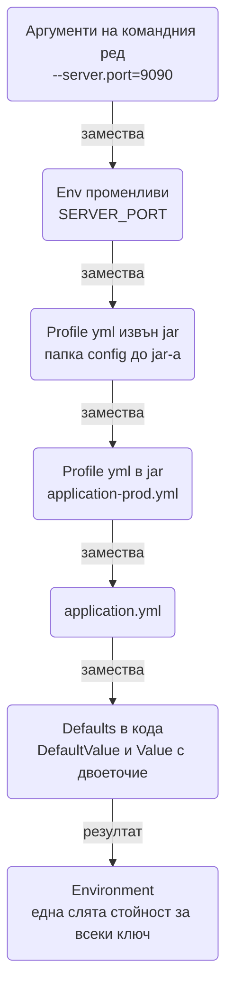

# Конфигурация и профили

Един и същи jar трябва да работи на лаптопа ти, в dev, в staging и в production, като единствената разлика е конфигурацията, която му подаваш отвън. Spring Boot решава това с подредена йерархия от property източници, профили и типизирано свързване на настройките към Java обекти. Тук ще видиш реда, в който се четат стойностите, как env променливите се картографират към `application.yml`, как се пишат `@ConfigurationProperties` records с валидация, къде да държиш тайните и как да тестваш различни конфигурации, без да пренаписваш файлове. Целта е при нов сървис да копираш модела за четири среди и да не мислиш повече за това.

| Какво | Кога | Инструмент |
|---|---|---|
| Базови настройки | Винаги | `application.yml` |
| Разлики между среди | Local, dev, staging, prod | `application-{profile}.yml`, `spring.profiles.active` |
| Тайни | Пароли, API ключове, сертификати | Env променливи, `.env` файл локално, secrets manager |
| Типизирани настройки | Всяка група от повече от две properties | `@ConfigurationProperties` record |
| Feature flags | Включване на функционалност без deploy | `@ConditionalOnProperty` |
| Отговор на "каква стойност е заредена" | Debug на средата | Actuator `env`, `configprops` |
| Различни стойности в тестове | Testcontainers, mock сървиси | `@DynamicPropertySource`, `@TestPropertySource` |

## 1. Зависимости и настройка

Нищо допълнително за самата конфигурация: `spring-boot-starter` я включва. За валидация на properties и за IDE метаданни добавяш:

```xml
<dependency>
    <groupId>org.springframework.boot</groupId>
    <artifactId>spring-boot-starter-validation</artifactId>
</dependency>
<dependency>
    <groupId>org.springframework.boot</groupId>
    <artifactId>spring-boot-configuration-processor</artifactId>
    <optional>true</optional>
</dependency>
```

Минимален `application.yml` на нов сървис:

```yaml
spring:
  application:
    name: shop
  profiles:
    default: local
server:
  port: 8080
```

`spring.profiles.default: local` означава, че ако никой не е задал профил, си локално. В production винаги задаваш профил явно, така че defaults никога не се ползват там.

## 2. Минимален работещ пример

```yaml
# application.yml
app:
  mail:
    from: noreply@acme.com
    retry-attempts: 3
  payments:
    base-url: https://payments.acme.com
    timeout: 5s
```

```java
package com.acme.shop.common.config;

import java.time.Duration;
import org.springframework.boot.context.properties.ConfigurationProperties;

@ConfigurationProperties(prefix = "app")
public record AppProperties(Mail mail, Payments payments) {

    public record Mail(String from, int retryAttempts) {}

    public record Payments(String baseUrl, Duration timeout) {}
}
```

```java
package com.acme.shop;

import org.springframework.boot.SpringApplication;
import org.springframework.boot.autoconfigure.SpringBootApplication;
import org.springframework.boot.context.properties.ConfigurationPropertiesScan;

@SpringBootApplication
@ConfigurationPropertiesScan
public class ShopApplication {
    public static void main(String[] args) {
        SpringApplication.run(ShopApplication.class, args);
    }
}
```

```java
@Service
public class MailService {

    private final AppProperties.Mail mail;

    public MailService(AppProperties props) {
        this.mail = props.mail();
    }

    public void sendOrderConfirmation(Order order) {
        // mail.from() и mail.retryAttempts() са типизирани, няма String parsing
    }
}
```

Override от командния ред или от средата, без да пипаш файла:

```bash
java -jar shop.jar --app.mail.from=orders@acme.com
APP_MAIL_FROM=orders@acme.com java -jar shop.jar
```

## 3. Източници и ред на четене

### yml или properties

| | `application.yml` | `application.properties` |
|---|---|---|
| Йерархия | Вложена, четима за големи конфигурации | Плоска, `a.b.c=x` |
| Списъци | `- item` | `a.b[0]=x` |
| Няколко документа в един файл | Да, с `---` | Да, с `#---` |
| Риск | Отстъпи и табулации | Дълги повтарящи се префикси |

Ползвай yml. Ако в един проект съществуват и двата файла с едно и също име, properties печели за дублираните ключове, което обърква всички, затова просто няма properties файл.

### Ред на приоритет

От най-висок към най-нисък приоритет, стойност от по-горен ред замества по-долен:

| Ред | Източник | Пример |
|---|---|---|
| 1 | `@TestPropertySource` и `@DynamicPropertySource` (само в тестове) | `properties = "app.mail.from=x"` |
| 2 | Аргументи на командния ред | `--server.port=9090` |
| 3 | `SPRING_APPLICATION_JSON` | `{"server":{"port":9090}}` |
| 4 | Java system properties | `-Dserver.port=9090` |
| 5 | Env променливи на OS | `SERVER_PORT=9090` |
| 6 | `random.*` | `${random.uuid}` |
| 7 | `application-{profile}.yml` извън jar-а | `./config/application-prod.yml` |
| 8 | `application.yml` извън jar-а | `./config/application.yml` |
| 9 | `application-{profile}.yml` в jar-а | `src/main/resources/application-prod.yml` |
| 10 | `application.yml` в jar-а | `src/main/resources/application.yml` |
| 11 | `@PropertySource` в `@Configuration` клас | Рядко, за legacy файлове |
| 12 | `SpringApplication.setDefaultProperties` | Програмни defaults |



Файловете извън jar-а се търсят в `./config/`, `./config/*/` и `./` спрямо работната директория. В Docker това означава, че може да сложиш `/app/config/application-prod.yml` като mounted файл и той ще замести вградения, без да пипаш образа.

### Relaxed binding на env променливи

Env променливите не позволяват точки и тирета, затова Spring Boot прилага правило за картографиране: точката става долна черта, тиретата изчезват, всичко е с главни букви.

| Property | Env променлива |
|---|---|
| `spring.datasource.url` | `SPRING_DATASOURCE_URL` |
| `app.mail.from` | `APP_MAIL_FROM` |
| `app.mail.retry-attempts` | `APP_MAIL_RETRYATTEMPTS` |
| `app.allowed-origins[0]` | `APP_ALLOWEDORIGINS_0_` |
| `logging.level.com.acme` | `LOGGING_LEVEL_COM_ACME` |

Правилото работи в двете посоки: в yml може да пишеш `retry-attempts`, `retryAttempts` или `retry_attempts` и трите стигат до `retryAttempts()` в record-а. Стандартът в yml е kebab-case.

За списъци през env е по-удобно да подадеш запетая-разделен низ и да го свържеш в `List<String>`: `APP_ALLOWED_ORIGINS=https://a.com,https://b.com` към `List<String> allowedOrigins`. Spring Boot конвертира автоматично.

## 4. Профили

### Активиране

```bash
java -jar shop.jar --spring.profiles.active=prod
SPRING_PROFILES_ACTIVE=prod,eu java -jar shop.jar
./mvnw spring-boot:run -Dspring-boot.run.profiles=local
```

Профилите се четат отляво надясно, последният печели при конфликт. `spring.profiles.active` не може да се задава в profile-specific файл, само в `application.yml`, в env или на командния ред.

### Profile-specific файлове

```yaml
# application-local.yml
spring:
  datasource:
    url: jdbc:postgresql://localhost:5432/shop
    username: shop
    password: shop
  jpa:
    show-sql: true
logging:
  level:
    com.acme.shop: DEBUG
```

```yaml
# application-prod.yml
spring:
  datasource:
    url: ${DB_URL}
    username: ${DB_USER}
    password: ${DB_PASSWORD}
    hikari:
      maximum-pool-size: 20
logging:
  level:
    root: INFO
```

Ако `DB_URL` липсва в production, приложението спира при старт с `Could not resolve placeholder 'DB_URL'`. Това е желаното: по-добре да не стартира, отколкото да тръгне към грешна база.

### Няколко документа в един файл

Алтернатива на отделни файлове, удобна за малки разлики:

```yaml
spring:
  application:
    name: shop
---
spring:
  config:
    activate:
      on-profile: local
  jpa:
    show-sql: true
---
spring:
  config:
    activate:
      on-profile: prod
server:
  shutdown: graceful
```

Документът без `on-profile` важи винаги. Документите с `on-profile` важат само при съответния профил. `on-profile` приема и изрази: `"prod | staging"`, `"!local"`.

### Profile groups

Когато "prod" означава пет неща едновременно:

```yaml
spring:
  profiles:
    group:
      prod: prod-db,prod-mq,metrics
      staging: prod-db,staging-mq,metrics
```

`--spring.profiles.active=prod` активира `prod`, `prod-db`, `prod-mq` и `metrics`, и зарежда съответните `application-*.yml`. Така разделяш конфигурацията по аспект, а не само по среда.

### Bean-ове по профил

```java
@Configuration
public class PaymentConfig {

    @Bean
    @Profile("local | test")
    PaymentGateway fakeGateway() {
        return new FakePaymentGateway();
    }

    @Bean
    @Profile("!local & !test")
    PaymentGateway stripeGateway(RestClient.Builder builder, AppProperties props) {
        return new StripeGateway(builder.baseUrl(props.payments().baseUrl()).build());
    }
}
```

`@Profile` работи и на клас с `@Component`. Използвай го пестеливо: един или два bean-а на профил са нормални, десетки означават, че трябва ти feature flag през `@ConditionalOnProperty`, а не профил.

## 5. Типизирани настройки

### @Value срещу @ConfigurationProperties

| | `@Value("${app.mail.from}")` | `@ConfigurationProperties` |
|---|---|---|
| За какво | Единична стойност, рядко | Група свързани настройки |
| Валидация | Няма | `@Validated` и jakarta constraints |
| IDE autocomplete | Не | Да, с configuration processor |
| Тестване | Трябва контекст | `new AppProperties(...)` |
| Default | `${app.mail.from:noreply@acme.com}` | `@DefaultValue` |
| Relaxed binding | Не, точното име | Да |

Правило: `@Value` само за една-две стойности в helper класове. Всичко друго е `@ConfigurationProperties` record.

### Пълен record с вложени групи и defaults

```java
package com.acme.shop.common.config;

import java.time.Duration;
import java.util.List;
import jakarta.validation.Valid;
import jakarta.validation.constraints.Email;
import jakarta.validation.constraints.Max;
import jakarta.validation.constraints.Min;
import jakarta.validation.constraints.NotBlank;
import jakarta.validation.constraints.NotEmpty;
import org.springframework.boot.context.properties.ConfigurationProperties;
import org.springframework.boot.context.properties.bind.DefaultValue;
import org.springframework.boot.convert.DataSizeUnit;
import org.springframework.boot.convert.DurationUnit;
import org.springframework.util.unit.DataSize;
import org.springframework.util.unit.DataUnit;
import org.springframework.validation.annotation.Validated;
import java.time.temporal.ChronoUnit;

@Validated
@ConfigurationProperties(prefix = "app")
public record AppProperties(
        @Valid Mail mail,
        @Valid Payments payments,
        @Valid Upload upload,
        @NotEmpty List<String> allowedOrigins,
        @DefaultValue("false") boolean maintenanceMode) {

    public record Mail(
            @NotBlank @Email String from,
            @Min(0) @Max(10) @DefaultValue("3") int retryAttempts,
            @DefaultValue("PT2S") Duration retryDelay) {}

    public record Payments(
            @NotBlank String baseUrl,
            @NotBlank String apiKey,
            @DurationUnit(ChronoUnit.SECONDS) @DefaultValue("5") Duration timeout) {}

    public record Upload(
            @DataSizeUnit(DataUnit.MEGABYTES) @DefaultValue("10") DataSize maxFileSize,
            @DefaultValue("jpg,png,pdf") List<String> allowedExtensions) {}
}
```

```yaml
app:
  mail:
    from: noreply@acme.com
    retry-delay: 500ms
  payments:
    base-url: https://payments.acme.com
    api-key: ${PAYMENTS_API_KEY}
    timeout: 10
  upload:
    max-file-size: 25MB
  allowed-origins:
    - https://shop.acme.com
    - https://admin.acme.com
```

Какво става тук:

- `@Validated` на record-а включва валидацията при свързване. Ако `app.mail.from` е празно, стартът спира с `Binding to target ... failed` и списък на нарушенията. Грешката се вижда веднага, а не при първото изпращане на имейл.
- `@Valid` на вложените полета е задължително, иначе се валидира само горното ниво.
- `@DefaultValue` работи за record компоненти, защото record няма setter-и и default не може да се зададе в полето.
- `Duration` разбира `500ms`, `5s`, `2m`, `1h`, `PT30S`. Без суфикс се чете в милисекунди, освен ако `@DurationUnit` не каже друго (в примера `timeout: 10` означава 10 секунди).
- `DataSize` разбира `10MB`, `512KB`, `1GB`. Без суфикс се чете в байтове, освен при `@DataSizeUnit`.

### Регистрация

Два начина, избери един за проекта:

```java
// 1. Сканиране на целия пакет (най-просто)
@SpringBootApplication
@ConfigurationPropertiesScan
public class ShopApplication { ... }

// 2. Явно изброяване, обикновено в config клас
@Configuration
@EnableConfigurationProperties({AppProperties.class, CacheProperties.class})
public class PropertiesConfig {}
```

Не слагай `@Component` върху `@ConfigurationProperties` record. Работи, но смесва двата механизма и изключва constructor binding в някои случаи.

### Метаданни за IDE

`spring-boot-configuration-processor` генерира `META-INF/spring-configuration-metadata.json` при компилация. IntelliJ и VS Code четат този файл и дават autocomplete, документация и предупреждения за непознати ключове в `application.yml`. Javadoc върху record компонентите става описание в IDE:

```java
public record Mail(
        /** Адрес, от който се изпращат всички системни имейли. */
        @NotBlank @Email String from,
        ...
```

За ключове, които не са в `@ConfigurationProperties` (например четени с `Environment`), описваш ръчно в `META-INF/additional-spring-configuration-metadata.json`.

## 6. Тайни

### Правила

1. Никога в git. Нито в `application-prod.yml`, нито в `docker-compose.yml`, нито в тестове.
2. В `application-*.yml` стоят само placeholders: `password: ${DB_PASSWORD}`.
3. Стойностите идват от средата: env променливи, secrets manager, mounted файлове.
4. Локално има `.env` файл, който е в `.gitignore`, и `.env.example` с ключовете без стойности, който е в git.

### Локално с .env

```yaml
spring:
  config:
    import: optional:file:.env[.properties]
```

```properties
# .env (в .gitignore)
DB_PASSWORD=shop
PAYMENTS_API_KEY=sk_test_abc
```

`optional:` означава, че липсата на файла не е грешка (в production го няма). `[.properties]` казва на Spring как да парсва файл без разширение. Стойностите стават properties с нисък приоритет, но достатъчен за placeholders. Същият `.env` се чете и от `docker compose`, така че локалният стек и приложението ползват един файл.

### Docker secrets и mounted файлове

Kubernetes и Docker Swarm монтират тайните като файлове, по един файл на ключ, в директория:

```
/run/secrets/
├── db-password
└── payments-api-key
```

```yaml
spring:
  config:
    import: optional:configtree:/run/secrets/
```

`configtree:` прави всяко име на файл property с име на файла и стойност неговото съдържание: `db-password` и `payments-api-key`. Връзваш ги с `${db-password}`. Файловете със скрити имена и поддиректории също работят (`/run/secrets/app/mail/from` става `app.mail.from`).

### Secrets manager

`spring.config.import` е точка за разширение. С Spring Cloud Vault или Spring Cloud AWS добавяш:

```yaml
spring:
  config:
    import:
      - optional:vault://secret/shop
      - optional:aws-secretsmanager:/shop/prod/
```

Стойностите се четат при старт и влизат в `Environment` като всеки друг източник. Самите библиотеки, техните версии и authentication към secrets manager-а са извън обхвата на този документ; важното е, че кодът на приложението не се променя, защото той вижда само `AppProperties`.

### Env променливи в Docker и Kubernetes

```yaml
# docker-compose.yml
services:
  shop:
    image: acme/shop:1.4.0
    environment:
      SPRING_PROFILES_ACTIVE: prod
      DB_URL: jdbc:postgresql://db:5432/shop
      DB_USER: shop
      DB_PASSWORD: ${DB_PASSWORD}
```

В Kubernetes същите ключове идват от `Secret` през `envFrom` или `valueFrom.secretKeyRef`. Детайли в [Docker и деплой](Docker_Deploy.md).

## 7. Feature flags с ConditionalOnProperty

```yaml
app:
  features:
    recommendations: true
    new-checkout: false
```

```java
@Service
@ConditionalOnProperty(name = "app.features.recommendations", havingValue = "true")
public class RecommendationService {
    ...
}
```

```java
@RestController
@RequestMapping("/api/orders")
public class OrderController {

    private final Optional<RecommendationService> recommendations;

    public OrderController(Optional<RecommendationService> recommendations) {
        this.recommendations = recommendations;
    }

    @GetMapping("/{id}")
    OrderResponse get(@PathVariable Long id) {
        var order = orderService.get(id);
        var related = recommendations.map(r -> r.forOrder(order)).orElse(List.of());
        return new OrderResponse(order, related);
    }
}
```

`matchIfMissing = true` обръща default-а: bean-ът съществува, освен ако property-то не го изключи явно. Това е правилният избор за стабилни функционалности с "kill switch", а `matchIfMissing = false` (default) за нови функционалности, които пускаш постепенно.

За флагове, които се сменят по време на работа (без рестарт), `@ConditionalOnProperty` не върши работа, защото се оценява веднъж при старт. Тогава четеш стойността от `AppProperties` в runtime или ползваш отделна библиотека за feature flags.

## 8. Модел за четири среди

### Файлове

```
src/main/resources/
├── application.yml            # общи настройки, placeholders за тайни
├── application-local.yml      # лаптоп, docker compose
├── application-dev.yml        # споделена dev среда
├── application-staging.yml    # копие на prod с други адреси
└── application-prod.yml       # prod, само placeholders и размери на pool-ове
```

```yaml
# application.yml
spring:
  application:
    name: shop
  profiles:
    default: local
  jpa:
    open-in-view: false
  datasource:
    url: ${DB_URL}
    username: ${DB_USER}
    password: ${DB_PASSWORD}
app:
  mail:
    from: noreply@acme.com
  payments:
    base-url: ${PAYMENTS_URL}
    api-key: ${PAYMENTS_API_KEY}
management:
  endpoints:
    web:
      exposure:
        include: health,info
```

```yaml
# application-local.yml
spring:
  datasource:
    url: jdbc:postgresql://localhost:5432/shop
    username: shop
    password: shop
  jpa:
    show-sql: true
app:
  payments:
    base-url: http://localhost:8089
    api-key: test
logging:
  level:
    com.acme.shop: DEBUG
    org.springframework.security: DEBUG
management:
  endpoints:
    web:
      exposure:
        include: "*"
```

```yaml
# application-dev.yml
app:
  payments:
    base-url: https://payments-sandbox.acme.com
logging:
  level:
    com.acme.shop: DEBUG
```

```yaml
# application-staging.yml
spring:
  datasource:
    hikari:
      maximum-pool-size: 10
server:
  shutdown: graceful
```

```yaml
# application-prod.yml
spring:
  datasource:
    hikari:
      maximum-pool-size: 20
server:
  shutdown: graceful
  forward-headers-strategy: framework
logging:
  level:
    root: INFO
```

Принципи:

- `application.yml` съдържа всичко общо и всички placeholders. Ако `DB_URL` липсва в staging, стартът спира, което е по-добре от fallback към localhost.
- `application-local.yml` е единственият файл с реални стойности, и те са за локални контейнери.
- `prod` и `staging` се различават само с числа (pool-ове, timeouts) и адреси, никога с логика.
- Тестовете имат `application-test.yml` в `src/test/resources`, който се активира с `@ActiveProfiles("test")`.

### Environment и Value с default

```java
@Component
public class RegionResolver {

    private final String region;
    private final Environment environment;

    public RegionResolver(@Value("${app.region:eu-central}") String region,
                          Environment environment) {
        this.region = region;
        this.environment = environment;
    }

    public boolean isProd() {
        return environment.matchesProfiles("prod");
    }

    public String property(String key) {
        return environment.getProperty(key, "n/a");
    }
}
```

`Environment` е полезен в два случая: проверка на активен профил и четене на динамични ключове (например `app.limits.${tenant}`). За всичко друго е `AppProperties`.

### Placeholders и random

```yaml
app:
  instance-id: ${HOSTNAME:local}-${random.uuid}
  internal-port: ${random.int[9000,9999]}
  cache-dir: ${java.io.tmpdir}/shop
server:
  port: ${PORT:8080}
info:
  app:
    version: "@project.version@"
```

- `${VAR:default}` подава default, ако липсва.
- `${random.uuid}`, `${random.int}`, `${random.int[1000,9999]}`, `${random.long}`, `${random.value}` генерират стойност при старт, една и съща за целия живот на процеса.
- `@project.version@` се замества от Maven при build благодарение на resource filtering в parent POM. Полезно за `/actuator/info`.

## 9. Проверка на заредената конфигурация

### Actuator env и configprops

```yaml
management:
  endpoints:
    web:
      exposure:
        include: health,info,env,configprops
  endpoint:
    env:
      show-values: when-authorized
    configprops:
      show-values: when-authorized
```

```http
GET /actuator/env/app.mail.from
GET /actuator/configprops/app
```

`env` показва всеки property source и коя стойност печели, което е най-бързият начин да разбереш защо приложението в staging ползва грешен адрес. `configprops` показва вече свързаните `@ConfigurationProperties` обекти.

От Spring Boot 3.0 стойностите са скрити по подразбиране (`show-values: never`). `when-authorized` ги показва само на authenticated потребител с роля, която Spring Security е пуснала до `/actuator/**`. `always` е само за локално.

Ключове, чието име съдържа `password`, `secret`, `key`, `token`, `credentials`, се маскират като `******` дори при `always`. За допълнителни правила дефинираш `SanitizingFunction` bean:

```java
@Bean
SanitizingFunction apiKeySanitizer() {
    return data -> data.getKey().endsWith("api-key") ? data.withValue("******") : data;
}
```

### Логване при старт

Не логвай `AppProperties` с `toString()`, защото record-ът ще изпише `apiKey`. Ако искаш отчет при старт, напиши го явно:

```java
@EventListener(ApplicationReadyEvent.class)
void logConfig() {
    log.info("profiles={}, paymentsUrl={}, mailFrom={}",
            List.of(environment.getActiveProfiles()),
            props.payments().baseUrl(),
            props.mail().from());
}
```

Виж и [Logging](Logging.md) за маскиране в структурирани логове.

## 10. Конфигурация в тестове

### Статични стойности

```java
@SpringBootTest(properties = "app.mail.from=test@acme.com")
@ActiveProfiles("test")
class MailServiceTest { ... }
```

```java
@SpringBootTest
@TestPropertySource(properties = {
        "app.features.recommendations=false",
        "app.payments.base-url=http://localhost:0"
})
class OrderControllerTest { ... }
```

И двата подхода имат най-висок приоритет, над env променливите. `@SpringBootTest(properties)` е по-кратък; `@TestPropertySource` може да сочи и файл: `@TestPropertySource("classpath:order-test.properties")`.

### Динамични стойности с Testcontainers

Когато портът се знае едва след стартиране на контейнера:

```java
@SpringBootTest
@Testcontainers
class OrderRepositoryIT {

    @Container
    static PostgreSQLContainer<?> postgres = new PostgreSQLContainer<>("postgres:16");

    @DynamicPropertySource
    static void datasource(DynamicPropertyRegistry registry) {
        registry.add("spring.datasource.url", postgres::getJdbcUrl);
        registry.add("spring.datasource.username", postgres::getUsername);
        registry.add("spring.datasource.password", postgres::getPassword);
    }
}
```

За стандартните контейнери (Postgres, Redis, Kafka) `@ServiceConnection` замества целия `@DynamicPropertySource`:

```java
@Container
@ServiceConnection
static PostgreSQLContainer<?> postgres = new PostgreSQLContainer<>("postgres:16");
```

`@DynamicPropertySource` остава за твои собствени услуги: WireMock адрес, mock SMTP порт. Повече в [Testing](Testing.md).

### Тест на самите properties

```java
class AppPropertiesTest {

    @Test
    void bindsAndValidates() {
        var context = new ApplicationContextRunner()
                .withUserConfiguration(PropertiesConfig.class)
                .withPropertyValues(
                        "app.mail.from=noreply@acme.com",
                        "app.payments.base-url=https://x",
                        "app.payments.api-key=k",
                        "app.allowed-origins=https://a.com");

        context.run(ctx -> {
            var props = ctx.getBean(AppProperties.class);
            assertThat(props.mail().retryAttempts()).isEqualTo(3);
            assertThat(props.payments().timeout()).isEqualTo(Duration.ofSeconds(5));
        });
    }

    @Test
    void failsWithoutMailFrom() {
        new ApplicationContextRunner()
                .withUserConfiguration(PropertiesConfig.class)
                .withPropertyValues("app.payments.base-url=https://x", "app.payments.api-key=k")
                .run(ctx -> assertThat(ctx).hasFailed());
    }
}
```

`ApplicationContextRunner` е от `spring-boot-test` и вдига минимален контекст за милисекунди.

## 11. Капани

- Таб вместо интервали в yml. YAML не допуска табулации за отстъп и грешката е объркваща (`found character '\t' that cannot start any token`). Настрой редактора да заменя табовете.
- `spring.profiles.active` в `application-prod.yml` се игнорира мълчаливо. Профилът се задава отвън.
- `@ConfigurationProperties` без `@Validated` зарежда празни и грешни стойности без оплакване и грешката изскача в runtime. Валидирай всяка group, която има задължителни полета.
- `@Valid` липсва на вложен record и само горното ниво се валидира. При всяко вложено ниво слагай `@Valid`.
- Стойност като `on`, `yes`, `no`, `010` или `1e3` в yml се интерпретира като boolean или число, не като низ. Слагай кавички за такива низове, особено за версии (`"1.10"`) и региони.
- `${DB_PASSWORD}` без default в `application.yml` счупва локалните тестове, ако нямат `application-test.yml` с реална стойност. Тестовият профил трябва да покрива всеки placeholder.
- `.env` файлът е commit-нат по погрешка. `.gitignore` с `.env` и `.env.*` без `.env.example`, плюс pre-commit hook, който спира `sk_live` низове.
- `management.endpoint.env.show-values: always` в production показва env променливите на всеки, който стигне до endpoint-а. Ползвай `when-authorized` и защити `/actuator/**`.
- `Duration` без суфикс (`timeout: 5`) се чете като 5 милисекунди и всичко изглежда "бавно" или "timeout-ва мигновено". Пиши `5s` или слагай `@DurationUnit`.
- Logback и `logging.config` се четат преди профилите в някои сценарии: ако конфигурираш logging през `application-prod.yml`, ползвай `logback-spring.xml` с `<springProfile>`, не `logback.xml`.
- Profile-specific файлове с еднакво име в `./config/` до jar-а на сървъра заместват вградените, и никой не помни, че са там. Документирай mounted конфигурацията в deploy описанието.

## 12. Чеклист

- [ ] `application.yml` е единственият базов файл, `application.properties` не съществува
- [ ] `spring.application.name` и `spring.profiles.default: local` са зададени
- [ ] Има `application-local.yml`, `application-dev.yml`, `application-staging.yml`, `application-prod.yml`, `application-test.yml`
- [ ] Всички тайни са placeholders в yml и реални стойности само в `.env` (локално) или secrets manager
- [ ] `.env` е в `.gitignore`, `.env.example` е в git
- [ ] Настройките на приложението са в `@ConfigurationProperties` record с `@Validated`, `@Valid` на вложените
- [ ] `Duration` и `DataSize` се ползват за времена и размери, не `int`
- [ ] `spring-boot-configuration-processor` е добавен и autocomplete в IDE работи
- [ ] Feature flags са `@ConditionalOnProperty` с осъзнат `matchIfMissing`
- [ ] Actuator `env` и `configprops` са със `show-values: when-authorized` и зад authentication
- [ ] Тестовете ползват `@ServiceConnection` или `@DynamicPropertySource`, не hardcoded портове
- [ ] Стартът спира при липсваща задължителна настройка, вместо да ползва тих default

## 13. Свързани документи

- [Структура на проекта](Project_Setup.md): къде стои `AppProperties`, как се регистрират bean-ове и какво прави `@ConditionalOnProperty` в автоконфигурацията.
- [Валидации](Validation.md): пълният списък на jakarta constraints, които работят и в `@ConfigurationProperties`.
- [Docker и деплой](Docker_Deploy.md): как env променливите, mounted файлове и secrets стигат до контейнера.
- [Testing](Testing.md): `@SpringBootTest`, `@ServiceConnection` и как да държиш тестовата конфигурация изолирана.
- [Observability](Observability.md): защита и излагане на actuator endpoints, включително `env`.
- [Logging](Logging.md): конфигурация на logging по профил с `logback-spring.xml`.
- [Spring Boot externalized configuration](https://docs.spring.io/spring-boot/reference/features/external-config.html)
