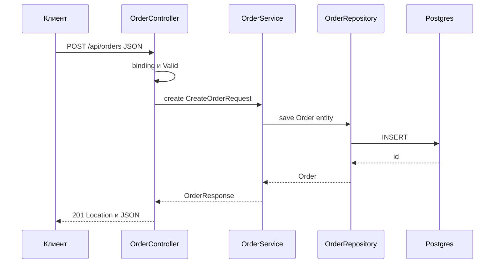

# Controllers

Контролерът е границата между HTTP и твоята бизнес логика: приема request, свързва го към Java обекти, валидира, вика service, превръща резултата в статус, headers и тяло. Когато тази граница е тънка и предсказуема, всичко останало в сървиса се тества без HTTP, а API-то се чете като документация. Този документ показва анатомията на един controller метод, какво и как се инжектира, как се ползва `ResponseEntity` за правилни статуси, пълен CRUD пример с service и DTO, частични update-и, файлове, async отговори, HTML форми с Thymeleaf, конвертори за path параметри и как се тества контролер изолирано. Накрая има таблица кой HTTP статус за кой случай, за да не се спори всеки път.

| Какво | Кога | Инструмент |
|---|---|---|
| JSON API | Почти винаги | `@RestController`, records, `ResponseEntity` |
| HTML страници | Admin панели, server-rendered сайтове | `@Controller`, Thymeleaf, `Model` |
| Входни данни | Всеки POST, PUT, PATCH | `@RequestBody @Valid` record |
| Частичен update | PATCH | Patch DTO с null означава без промяна |
| Файлове | Upload и download | `MultipartFile`, `Resource`, `StreamingResponseBody` |
| Дълги операции | Отчети, външни извиквания | Виртуални нишки, `CompletableFuture` |
| Грешки | Винаги | `@RestControllerAdvice`, `ProblemDetail` |
| Тест | Всеки контролер | `@WebMvcTest`, `MockMvc` |

## 1. Зависимости и настройка

```xml pom.xml
<dependency>
    <groupId>org.springframework.boot</groupId>
    <artifactId>spring-boot-starter-web</artifactId>
</dependency>
<dependency>
    <groupId>org.springframework.boot</groupId>
    <artifactId>spring-boot-starter-validation</artifactId>
</dependency>
<!-- само за HTML страници -->
<dependency>
    <groupId>org.springframework.boot</groupId>
    <artifactId>spring-boot-starter-thymeleaf</artifactId>
</dependency>
```

```yaml src/main/resources/application.yml
spring:
  jackson:
    default-property-inclusion: non_null
    deserialization:
      fail-on-unknown-properties: false
  mvc:
    problemdetails:
      enabled: true
  threads:
    virtual:
      enabled: true
  servlet:
    multipart:
      max-file-size: 10MB
      max-request-size: 25MB
```

`spring.threads.virtual.enabled: true` кара Tomcat да обработва всеки request във виртуална нишка. Това означава, че блокиращ код в контролера (JDBC, `RestClient`) не държи platform нишка и обикновено прави async return типовете излишни.

## 2. RestController срещу Controller

```java src/main/java/com/acme/shop/order/
@RestController
@RequestMapping("/api/orders")
class OrderController {
    @GetMapping("/{id}")
    OrderResponse get(@PathVariable Long id) { ... }   // обектът става JSON
}

@Controller
@RequestMapping("/orders")
class OrderPageController {
    @GetMapping("/{id}")
    String page(@PathVariable Long id, Model model) {   // низът е име на view
        model.addAttribute("order", orderService.get(id));
        return "orders/detail";
    }

    @GetMapping("/{id}/summary")
    @ResponseBody
    OrderResponse summary(@PathVariable Long id) { ... }   // изключение: JSON в Controller
}
```

`@RestController` е `@Controller` плюс `@ResponseBody` на всеки метод. При `@Controller` return стойността се третира като име на view, освен ако методът няма `@ResponseBody` или не връща `ResponseEntity`. Правило за проект: API контролерите са `@RestController` в пакет на feature-а, HTML контролерите са `@Controller` и са отделни класове. Не смесвай двата стила в един клас.



## 3. Анатомия на метода

### Какво може да бъде параметър

| Параметър | Откъде идва |
|---|---|
| `@PathVariable Long id` | Сегмент от URL |
| `@RequestParam String q` | Query string или form поле |
| `@RequestBody CreateOrderRequest body` | Тялото, десериализирано от Jackson |
| `@Valid` или `@Validated` пред горните | Включва Bean Validation, грешката е `MethodArgumentNotValidException` |
| `OrderFilter filter` без анотация | Query параметри в record (виж [Routing](Routing.md)) |
| `@RequestHeader`, `@CookieValue` | Headers и cookies |
| `@RequestPart MultipartFile file` | Част от multipart тяло |
| `HttpServletRequest`, `HttpServletResponse` | Суров достъп, рядко нужен |
| `HttpHeaders` | Всички request headers |
| `HttpMethod` | Методът, полезно в общ handler |
| `Principal` | Authenticated потребител, `null` ако няма |
| `Authentication` | Пълният Spring Security обект |
| `@AuthenticationPrincipal UserAccount user` | Твоят principal тип директно |
| `Locale`, `TimeZone`, `ZoneId` | Резолвани от `LocaleResolver` |
| `UriComponentsBuilder` | Builder с host и context path на текущия request |
| `Pageable`, `Sort` | От `page`, `size`, `sort` параметри |
| `Model`, `RedirectAttributes` | Само в `@Controller` за views |
| `BindingResult` | Грешки от binding, веднага след валидирания параметър |
| `InputStream`, `Reader` | Сурово тяло |
| `@SessionAttribute`, `@RequestAttribute` | Атрибути от сесия или от filter |

```java src/main/java/com/acme/shop/order/OrderController.java
@PostMapping
ResponseEntity<OrderResponse> create(@RequestBody @Valid CreateOrderRequest request,
                                     @AuthenticationPrincipal UserAccount user,
                                     Locale locale,
                                     UriComponentsBuilder uriBuilder) {
    var created = orderService.create(request, user.id(), locale);
    var location = uriBuilder.path("/api/orders/{id}").buildAndExpand(created.id()).toUri();
    return ResponseEntity.created(location).body(created);
}
```

`@AuthenticationPrincipal` е от `spring-security`, виж [Authentication](Authentication.md). Без Spring Security `Principal` е `null`, а `@AuthenticationPrincipal` не се резолва.

### ResponseEntity

```java
ResponseEntity.ok(body)                                        // 200
ResponseEntity.ok().eTag("\"v3\"").body(body)                  // 200 с ETag
ResponseEntity.created(location).body(body)                    // 201 с Location
ResponseEntity.accepted().build()                              // 202, за async обработка
ResponseEntity.noContent().build()                             // 204, delete и update без тяло
ResponseEntity.notFound().build()                              // 404 без тяло
ResponseEntity.of(optionalBody)                                // 200 или 404
ResponseEntity.status(HttpStatus.CONFLICT).body(problemDetail) // произволен статус
ResponseEntity.ok().header("X-Total-Count", "120").body(list)  // custom header
ResponseEntity.ok().cacheControl(CacheControl.maxAge(Duration.ofMinutes(5)).cachePublic()).body(body)
```

`ResponseEntity.of(Optional)` е най-късият начин за "намери или 404", но без тяло. Ако искаш 404 с `ProblemDetail`, хвърляй `NotFoundException` от service и я обработвай в `@RestControllerAdvice`, виж [Грешки и ProblemDetail](Exception_Handling.md). Това е и препоръчаният подход, защото контролерът не взема решение за грешката.

Когато статусът е константен и няма headers, `@ResponseStatus` е по-кратък:

```java src/main/java/com/acme/shop/order/OrderController.java
@PostMapping
@ResponseStatus(HttpStatus.CREATED)
OrderResponse create(@RequestBody @Valid CreateOrderRequest request) {
    return orderService.create(request);
}

@DeleteMapping("/{id}")
@ResponseStatus(HttpStatus.NO_CONTENT)
void delete(@PathVariable Long id) {
    orderService.delete(id);
}
```

За 201 обаче `ResponseEntity.created(location)` е по-правилен, защото `Location` header е част от семантиката.

### Правилото за тънък контролер

Контролерът прави четири неща: binding, валидация на формата (не на бизнес правилата), mapping между DTO и service вход и избор на статус. Всичко друго е в service.

| В контролера | В service |
|---|---|
| `@Valid` на входа | "Поръчка над 1000 лв изисква одобрение" |
| `ResponseEntity.created(location)` | `@Transactional`, `orderRepository.save` |
| `@AuthenticationPrincipal` към `userId` | Проверка дали потребителят има право да види поръчката |
| `@PathVariable Long id` | `findById(id).orElseThrow(NotFoundException::new)` |
| Кой DTO се връща | Какви данни се четат и как се изчисляват |

Тест: ако service методът изисква `HttpServletRequest` или връща `ResponseEntity`, слоевете са смесени.

## 4. Минимален работещ пример: пълен CRUD

### DTO

```java src/main/java/com/acme/shop/order/dto/
package com.acme.shop.order.dto;

import jakarta.validation.Valid;
import jakarta.validation.constraints.*;
import java.math.BigDecimal;
import java.time.Instant;
import java.util.List;

public record CreateOrderRequest(
        @NotEmpty @Valid List<LineRequest> lines,
        @Size(max = 500) String note) {

    public record LineRequest(@NotNull Long productId, @Min(1) @Max(100) int quantity) {}
}

public record UpdateOrderRequest(
        @NotEmpty @Valid List<CreateOrderRequest.LineRequest> lines,
        @Size(max = 500) String note) {}

public record OrderResponse(
        Long id,
        String number,
        OrderStatus status,
        BigDecimal total,
        String note,
        List<LineResponse> lines,
        Instant createdAt) {

    public record LineResponse(Long productId, String productName, int quantity, BigDecimal lineTotal) {}
}

public record OrderSummary(Long id, String number, OrderStatus status, BigDecimal total, Instant createdAt) {}
```

### Controller

```java src/main/java/com/acme/shop/order/OrderController.java
package com.acme.shop.order;

import com.acme.shop.order.dto.*;
import jakarta.validation.Valid;
import org.springframework.data.domain.Page;
import org.springframework.data.domain.Pageable;
import org.springframework.data.web.PageableDefault;
import org.springframework.http.ResponseEntity;
import org.springframework.web.bind.annotation.*;
import org.springframework.web.util.UriComponentsBuilder;

@RestController
@RequestMapping("/api/orders")
class OrderController {

    private final OrderService orderService;

    OrderController(OrderService orderService) {
        this.orderService = orderService;
    }

    @GetMapping
    Page<OrderSummary> list(@Valid OrderFilter filter,
                            @PageableDefault(size = 20, sort = "createdAt") Pageable pageable) {
        return orderService.list(filter, pageable);
    }

    @GetMapping("/{id}")
    OrderResponse get(@PathVariable Long id) {
        return orderService.get(id);
    }

    @PostMapping
    ResponseEntity<OrderResponse> create(@RequestBody @Valid CreateOrderRequest request,
                                         UriComponentsBuilder uriBuilder) {
        var created = orderService.create(request);
        var location = uriBuilder.path("/api/orders/{id}").buildAndExpand(created.id()).toUri();
        return ResponseEntity.created(location).body(created);
    }

    @PutMapping("/{id}")
    OrderResponse replace(@PathVariable Long id, @RequestBody @Valid UpdateOrderRequest request) {
        return orderService.replace(id, request);
    }

    @PatchMapping("/{id}")
    OrderResponse patch(@PathVariable Long id, @RequestBody @Valid PatchOrderRequest request) {
        return orderService.patch(id, request);
    }

    @PostMapping("/{id}/cancel")
    OrderResponse cancel(@PathVariable Long id) {
        return orderService.cancel(id);
    }

    @DeleteMapping("/{id}")
    ResponseEntity<Void> delete(@PathVariable Long id) {
        orderService.delete(id);
        return ResponseEntity.noContent().build();
    }
}
```

`POST /{id}/cancel` вместо `PATCH` със `status: CANCELLED` е умишлено: отказът е операция с правила (само от определени статуси, със side effects), не редакция на поле. Такива преходи са по-ясни като глаголни endpoints.

### Service

```java src/main/java/com/acme/shop/order/OrderService.java
package com.acme.shop.order;

import com.acme.shop.common.error.NotFoundException;
import com.acme.shop.order.dto.*;
import com.acme.shop.product.ProductService;
import org.springframework.data.domain.Page;
import org.springframework.data.domain.Pageable;
import org.springframework.stereotype.Service;
import org.springframework.transaction.annotation.Transactional;

@Service
@Transactional(readOnly = true)
public class OrderService {

    private final OrderRepository orderRepository;
    private final ProductService productService;
    private final OrderMapper mapper;

    public OrderService(OrderRepository orderRepository, ProductService productService, OrderMapper mapper) {
        this.orderRepository = orderRepository;
        this.productService = productService;
        this.mapper = mapper;
    }

    public Page<OrderSummary> list(OrderFilter filter, Pageable pageable) {
        return orderRepository.findAll(OrderSpecifications.matching(filter), pageable).map(mapper::toSummary);
    }

    public OrderResponse get(Long id) {
        return mapper.toResponse(require(id));
    }

    @Transactional
    public OrderResponse create(CreateOrderRequest request) {
        var order = new Order(request.note());
        for (var line : request.lines()) {
            var product = productService.requireAvailable(line.productId());
            order.addLine(product, line.quantity());
        }
        return mapper.toResponse(orderRepository.save(order));
    }

    @Transactional
    public OrderResponse replace(Long id, UpdateOrderRequest request) {
        var order = require(id);
        order.replaceLines(request.lines().stream()
                .map(l -> new Order.LineDraft(productService.requireAvailable(l.productId()), l.quantity()))
                .toList());
        order.setNote(request.note());
        return mapper.toResponse(order);
    }

    @Transactional
    public OrderResponse patch(Long id, PatchOrderRequest request) {
        var order = require(id);
        if (request.note() != null) {
            order.setNote(request.note());
        }
        if (request.shippingAddress() != null) {
            order.setShippingAddress(request.shippingAddress());
        }
        return mapper.toResponse(order);
    }

    @Transactional
    public OrderResponse cancel(Long id) {
        var order = require(id);
        order.cancel();   // хвърля IllegalStateException при недопустим преход
        return mapper.toResponse(order);
    }

    @Transactional
    public void delete(Long id) {
        var order = require(id);
        orderRepository.delete(order);
    }

    private Order require(Long id) {
        return orderRepository.findById(id).orElseThrow(() -> new NotFoundException("Order", id));
    }
}
```

При `replace` и `patch` няма `save`: entity-то е managed в транзакцията и Hibernate прави `UPDATE` при commit. Подробности за това в [Транзакции и locking](Transactions.md) и [База данни и ORM](Database_ORM.md). За `OrderMapper` виж [DTO и mapping](DTO_Mapping.md).

### Request и response

```http
POST /api/orders HTTP/1.1
Content-Type: application/json

{"lines":[{"productId":7,"quantity":2}],"note":"Остави на рецепция"}

HTTP/1.1 201 Created
Location: https://shop.acme.com/api/orders/42
Content-Type: application/json

{"id":42,"number":"BG-000042","status":"NEW","total":59.80,"note":"Остави на рецепция",
 "lines":[{"productId":7,"productName":"Кафе 1кг","quantity":2,"lineTotal":59.80}],
 "createdAt":"2025-10-07T09:12:44Z"}
```

```http
POST /api/orders HTTP/1.1
Content-Type: application/json

{"lines":[]}

HTTP/1.1 400 Bad Request
Content-Type: application/problem+json

{"type":"about:blank","title":"Bad Request","status":400,
 "detail":"Invalid request content.","instance":"/api/orders",
 "errors":[{"field":"lines","message":"must not be empty"}]}
```

Полето `errors` идва от твоя `@RestControllerAdvice`, виж [Валидации](Validation.md).

## 5. Request body и Jackson

### Records

Jackson десериализира records по канонния конструктор без допълнителни анотации. Имената на JSON полетата съвпадат с компонентите; за различно име се ползва `@JsonProperty`:

```java src/main/java/com/acme/shop/order/dto/CreateOrderRequest.java
package com.acme.shop.order.dto;

public record CreateOrderRequest(
        @JsonProperty("order_lines") @NotEmpty List<LineRequest> lines,
        @JsonFormat(pattern = "dd.MM.yyyy") LocalDate deliveryDate,
        @JsonIgnore String internalFlag) {}
```

Глобално snake_case се включва с `spring.jackson.property-naming-strategy: SNAKE_CASE`, което е по-добре от `@JsonProperty` на всяко поле. Полетата, които липсват в JSON, стават `null` (или `0`, `false` за примитиви, затова в DTO ползвай `Integer`, не `int`, когато "липсва" е валидно състояние).

`fail-on-unknown-properties: false` (Boot default) означава, че непознатите полета се игнорират. Това е правилно за публично API (клиентите могат да добавят полета без да чупят), но при вътрешни API понякога искаш `true`, за да хващаш правописни грешки рано.

### Частичен update с PATCH

Проблемът на PATCH: как различаваш "полето не е изпратено" от "полето е изпратено като null". Три подхода:

| Подход | Семантика | Кога |
|---|---|---|
| Patch DTO с nullable полета | `null` означава "не променяй" | 90% от случаите; не можеш да нулираш поле |
| `JsonNullable<T>` от `jackson-databind-nullable` | Различава undefined от null | Когато нулирането на поле е валидна операция |
| JSON Merge Patch (`application/merge-patch+json`) | Стандарт RFC 7396, `null` изтрива | Публични API с нужда от стандарт |

Patch DTO:

```java src/main/java/com/acme/shop/order/dto/PatchOrderRequest.java
package com.acme.shop.order.dto;

public record PatchOrderRequest(
        @Size(max = 500) String note,
        @Valid Address shippingAddress) {}
```

Service-ът проверява всяко поле за `null` (виж `patch` в примера по-горе). Просто, явно и достатъчно.

С `JsonNullable`:

```xml pom.xml
<dependency>
    <groupId>org.openapitools</groupId>
    <artifactId>jackson-databind-nullable</artifactId>
    <version>0.2.6</version>
</dependency>
```

```java src/main/java/com/acme/shop/
@Bean
JsonNullableModule jsonNullableModule() {
    return new JsonNullableModule();
}

public record PatchOrderRequest(
        JsonNullable<String> note,
        JsonNullable<Address> shippingAddress) {}
```

```java src/main/java/com/acme/shop/order/OrderService.java
if (request.note().isPresent()) {
    order.setNote(request.note().get());   // get() може да върне null и това означава "изчисти"
}
```

`Optional<T>` не върши тази работа: Jackson превръща и липсващо поле, и `null` в `Optional.empty()`.

## 6. Файлове и streams

### Upload

```java src/main/java/com/acme/shop/order/OrderController.java
@PostMapping(value = "/{id}/attachments", consumes = MediaType.MULTIPART_FORM_DATA_VALUE)
ResponseEntity<AttachmentResponse> upload(@PathVariable Long id,
                                          @RequestPart("file") MultipartFile file,
                                          @RequestPart("meta") @Valid AttachmentMeta meta,
                                          UriComponentsBuilder uriBuilder) {
    if (file.isEmpty()) {
        throw new IllegalArgumentException("Файлът е празен");
    }
    var saved = attachmentService.store(id, file, meta);
    var location = uriBuilder.path("/api/orders/{id}/attachments/{aid}").buildAndExpand(id, saved.id()).toUri();
    return ResponseEntity.created(location).body(saved);
}
```

```bash
curl -F "file=@invoice.pdf" -F 'meta={"kind":"INVOICE"};type=application/json' \
     http://localhost:8080/api/orders/42/attachments
```

`@RequestPart` за JSON частта минава през Jackson, затова `meta` може да е record с `@Valid`. При един файл без метаданни `@RequestParam MultipartFile file` също работи. Лимитите са `spring.servlet.multipart.max-file-size` и `max-request-size`; при превишаване се хвърля `MaxUploadSizeExceededException`, която трябва да е обработена като 413. Съхранение, content-type проверки и S3 са в [Файлове](Files.md).

### Download

```java src/main/java/com/acme/shop/order/OrderController.java
@GetMapping("/{id}/invoice")
ResponseEntity<Resource> invoice(@PathVariable Long id) {
    var pdf = invoiceService.render(id);   // връща byte[] или Path
    var resource = new ByteArrayResource(pdf);
    return ResponseEntity.ok()
            .contentType(MediaType.APPLICATION_PDF)
            .contentLength(pdf.length)
            .header(HttpHeaders.CONTENT_DISPOSITION,
                    ContentDisposition.attachment().filename("invoice-" + id + ".pdf").build().toString())
            .body(resource);
}
```

За файл от диск `new FileSystemResource(path)` или `new PathResource(path)`; Spring поддържа `Range` заявки за тях автоматично. `ContentDisposition.builder` се грижи за encoding на не-ASCII имена (`filename*=UTF-8''...`).

### Streaming на голям отговор

Когато CSV с милион реда не трябва да се събира в паметта:

```java src/main/java/com/acme/shop/order/OrderController.java
@GetMapping(value = "/export", produces = "text/csv")
ResponseEntity<StreamingResponseBody> export(@Valid OrderFilter filter) {
    StreamingResponseBody body = out -> {
        var writer = new BufferedWriter(new OutputStreamWriter(out, StandardCharsets.UTF_8));
        writer.write("id,number,status,total\n");
        try (var stream = orderService.streamForExport(filter)) {
            stream.forEach(o -> writeLine(writer, o));
        }
        writer.flush();
    };
    return ResponseEntity.ok()
            .header(HttpHeaders.CONTENT_DISPOSITION, "attachment; filename=orders.csv")
            .body(body);
}
```

`StreamingResponseBody` се изпълнява в отделна нишка (async MVC), а `streamForExport` трябва да е `@Transactional(readOnly = true)` метод, който връща `Stream<Order>` от repository и се затваря с `try`. Виж [Pagination](Pagination.md) за streaming от JPA.

## 7. Асинхронни отговори

С виртуални нишки обикновеният блокиращ метод е правилният избор. Async return типовете остават за три случая: композиране на няколко паралелни извиквания, дълго чакане на външно събитие и push към клиента.

```java src/main/java/com/acme/shop/order/OrderController.java
@GetMapping("/{id}/dashboard")
CompletableFuture<DashboardResponse> dashboard(@PathVariable Long id) {
    var order = CompletableFuture.supplyAsync(() -> orderService.get(id), executor);
    var shipment = CompletableFuture.supplyAsync(() -> shippingClient.track(id), executor);
    var payment = CompletableFuture.supplyAsync(() -> paymentClient.status(id), executor);
    return order.thenCombine(shipment, (o, s) -> new Object[]{o, s})
                .thenCombine(payment, (os, p) -> new DashboardResponse((OrderResponse) os[0], (Shipment) os[1], p));
}
```

`executor` е `Executor` bean; с `spring.threads.virtual.enabled: true` Boot регистрира `applicationTaskExecutor` върху виртуални нишки. Spring освобождава Tomcat нишката и записва отговора, когато future-ът завърши.

`DeferredResult<T>` е същото, но попълвано от друго място (например callback от message broker):

```java src/main/java/com/acme/shop/order/OrderController.java
@PostMapping("/{id}/pay")
DeferredResult<PaymentResponse> pay(@PathVariable Long id) {
    var result = new DeferredResult<PaymentResponse>(Duration.ofSeconds(30).toMillis());
    paymentService.startPayment(id, result::setResult, result::setErrorResult);
    return result;
}
```

`SseEmitter` праща събития към браузъра по една HTTP връзка:

```java src/main/java/com/acme/shop/order/OrderController.java
@GetMapping(value = "/{id}/events", produces = MediaType.TEXT_EVENT_STREAM_VALUE)
SseEmitter events(@PathVariable Long id) {
    var emitter = new SseEmitter(Duration.ofMinutes(5).toMillis());
    orderEvents.subscribe(id, emitter);
    return emitter;
}
```

Timeout за всички async типове е `spring.mvc.async.request-timeout`. Пълните примери за SSE и WebSocket, включително отписване и heartbeat, са в [WebSockets и SSE](WebSockets.md).

## 8. HTML контролери с Thymeleaf

### Страница и форма

```java src/main/java/com/acme/shop/order/web/OrderPageController.java
package com.acme.shop.order.web;

import jakarta.validation.Valid;
import org.springframework.stereotype.Controller;
import org.springframework.ui.Model;
import org.springframework.validation.BindingResult;
import org.springframework.web.bind.annotation.*;
import org.springframework.web.servlet.mvc.support.RedirectAttributes;

@Controller
@RequestMapping("/orders")
class OrderPageController {

    private final OrderService orderService;
    private final ProductService productService;

    OrderPageController(OrderService orderService, ProductService productService) {
        this.orderService = orderService;
        this.productService = productService;
    }

    @GetMapping
    String list(Model model, @RequestParam(defaultValue = "0") int page) {
        model.addAttribute("orders", orderService.list(OrderFilter.empty(), PageRequest.of(page, 20)));
        return "orders/list";
    }

    @GetMapping("/new")
    String newForm(Model model) {
        model.addAttribute("form", new OrderForm(null, 1, ""));
        model.addAttribute("products", productService.listActive());
        return "orders/new";
    }

    @PostMapping
    String create(@ModelAttribute("form") @Valid OrderForm form,
                  BindingResult result,
                  Model model,
                  RedirectAttributes redirect) {
        if (result.hasErrors()) {
            model.addAttribute("products", productService.listActive());
            return "orders/new";
        }
        var created = orderService.create(form.toRequest());
        redirect.addFlashAttribute("message", "Поръчка " + created.number() + " е създадена");
        return "redirect:/orders/" + created.id();
    }

    @GetMapping("/{id}")
    String detail(@PathVariable Long id, Model model) {
        model.addAttribute("order", orderService.get(id));
        return "orders/detail";
    }
}
```

```java src/main/java/com/acme/shop/order/web/OrderForm.java
package com.acme.shop.order.web;

public record OrderForm(
        @NotNull Long productId,
        @Min(1) @Max(100) int quantity,
        @Size(max = 500) String note) {

    CreateOrderRequest toRequest() {
        return new CreateOrderRequest(List.of(new CreateOrderRequest.LineRequest(productId, quantity)), note);
    }
}
```

```html src/main/resources/templates/orders/new.html
<!-- src/main/resources/templates/orders/new.html -->
<form th:action="@{/orders}" th:object="${form}" method="post">
  <select th:field="*{productId}">
    <option th:each="p : ${products}" th:value="${p.id}" th:text="${p.name}"></option>
  </select>
  <p th:if="${#fields.hasErrors('productId')}" th:errors="*{productId}"></p>
  <input type="number" th:field="*{quantity}">
  <p th:if="${#fields.hasErrors('quantity')}" th:errors="*{quantity}"></p>
  <textarea th:field="*{note}"></textarea>
  <button type="submit">Поръчай</button>
</form>
```

Правила:

- `BindingResult` стои непосредствено след валидирания параметър, иначе Spring хвърля изключение вместо да го попълни.
- Шаблонът "POST, после redirect, после GET" (PRG) предпазва от повторно изпращане при refresh. `addFlashAttribute` живее до следващия request и после изчезва, което е точно за съобщение "успех".
- `@ModelAttribute("form")` задава името, под което обектът е в модела. При грешки същият обект с въведените стойности се връща към формата.
- CSRF token се добавя автоматично от Thymeleaf при `th:action`, ако Spring Security е включен. Виж [Sessions и cookies](Sessions.md).

Пълните примери за layouts, фрагменти и i18n са в [Имейли и HTML шаблони](Emails_Templates.md).

## 9. Грешки, CORS, binders и конвертори

### Грешки

Контролерите не хващат изключения. Service хвърля `NotFoundException`, `IllegalStateException` или domain изключение, а един `@RestControllerAdvice` ги превръща в `ProblemDetail` с правилен статус. Всичко за това е в [Грешки и ProblemDetail](Exception_Handling.md). Локален `@ExceptionHandler` в контролера е оправдан само когато един контролер има уникална грешка с уникален формат.

### CORS

```java src/main/java/com/acme/shop/order/OrderController.java
@CrossOrigin(origins = "https://shop.acme.com", maxAge = 3600)
@RestController
@RequestMapping("/api/orders")
class OrderController { ... }
```

`@CrossOrigin` е удобен за един контролер, но при Spring Security CORS трябва да е конфигуриран на ниво filter chain, за да работи и за preflight заявки, които не стигат до контролера. Глобалната конфигурация с `CorsConfigurationSource` е описана в [Middleware: Filters, Interceptors, AOP](Middleware.md).

### InitBinder

`@InitBinder` настройва `WebDataBinder` за контролера: trimming, забранени полета, custom editors.

```java src/main/java/com/acme/shop/order/web/OrderPageController.java
@InitBinder
void initBinder(WebDataBinder binder) {
    // празните низове от форми стават null, за да минават @Size и Optional проверки
    binder.registerCustomEditor(String.class, new StringTrimmerEditor(true));
    // защита от mass assignment при @ModelAttribute на entity (което така или иначе не правим)
    binder.setDisallowedFields("id", "createdAt");
}
```

Глобално за всички контролери се слага в клас с `@ControllerAdvice`. `@InitBinder` не влияе на `@RequestBody`, което минава през Jackson, а не през `WebDataBinder`.

### Конвертори за path и query параметри

Enum от URL с различен регистър и value object за идентификатор:

```java src/main/java/com/acme/shop/common/web/
package com.acme.shop.common.web;

import org.springframework.core.convert.converter.Converter;
import org.springframework.stereotype.Component;

@Component
public class OrderStatusConverter implements Converter<String, OrderStatus> {
    @Override
    public OrderStatus convert(String source) {
        return OrderStatus.valueOf(source.trim().toUpperCase());
    }
}

@Component
public class OrderNumberConverter implements Converter<String, OrderNumber> {
    @Override
    public OrderNumber convert(String source) {
        return OrderNumber.parse(source);   // хвърля IllegalArgumentException при грешен формат, което е 400
    }
}
```

Spring Boot регистрира автоматично всеки `Converter`, `GenericConverter` и `Formatter` bean в `ConversionService` на MVC. След това:

```java src/main/java/com/acme/shop/order/OrderController.java
@GetMapping("/by-number/{number}")
OrderResponse byNumber(@PathVariable OrderNumber number) { ... }

@GetMapping
Page<OrderSummary> list(@RequestParam(required = false) OrderStatus status, Pageable pageable) { ... }
```

`GET /api/orders?status=paid` работи, а `?status=bogus` дава 400 от `MethodArgumentTypeMismatchException`. Същият конвертор се ползва и за `@ConfigurationProperties`, затова е добра идея да е в `common.web`.

За enums в JSON тяло конвертирането е на Jackson, не на `ConversionService`: `@JsonCreator` статичен метод в enum-а или `spring.jackson.mapper.accept-case-insensitive-enums: true`.

## 10. Тестване на контролер

`@WebMvcTest` вдига само MVC слоя: контролера, `@ControllerAdvice`, конверторите, Jackson и Spring Security. Service се подменя с mock:

```java src/test/java/com/acme/shop/order/OrderControllerTest.java
package com.acme.shop.order;

import org.junit.jupiter.api.Test;
import org.springframework.beans.factory.annotation.Autowired;
import org.springframework.boot.test.autoconfigure.web.servlet.WebMvcTest;
import org.springframework.http.MediaType;
import org.springframework.test.context.bean.override.mockito.MockitoBean;
import org.springframework.test.web.servlet.MockMvc;

import static org.mockito.ArgumentMatchers.any;
import static org.mockito.Mockito.when;
import static org.springframework.security.test.web.servlet.request.SecurityMockMvcRequestPostProcessors.*;
import static org.springframework.test.web.servlet.request.MockMvcRequestBuilders.*;
import static org.springframework.test.web.servlet.result.MockMvcResultMatchers.*;

@WebMvcTest(OrderController.class)
class OrderControllerTest {

    @Autowired MockMvc mvc;
    @MockitoBean OrderService orderService;

    @Test
    void createReturns201WithLocation() throws Exception {
        when(orderService.create(any())).thenReturn(sampleResponse(42L));

        mvc.perform(post("/api/orders")
                        .with(user("ivan").roles("CUSTOMER"))
                        .with(csrf())
                        .contentType(MediaType.APPLICATION_JSON)
                        .content("""
                                {"lines":[{"productId":7,"quantity":2}]}
                                """))
                .andExpect(status().isCreated())
                .andExpect(header().string("Location", "http://localhost/api/orders/42"))
                .andExpect(jsonPath("$.id").value(42));
    }

    @Test
    void createWithEmptyLinesReturns400() throws Exception {
        mvc.perform(post("/api/orders")
                        .with(user("ivan").roles("CUSTOMER"))
                        .with(csrf())
                        .contentType(MediaType.APPLICATION_JSON)
                        .content("{\"lines\":[]}"))
                .andExpect(status().isBadRequest())
                .andExpect(jsonPath("$.errors[0].field").value("lines"));
    }

    @Test
    void getUnknownReturns404() throws Exception {
        when(orderService.get(999L)).thenThrow(new NotFoundException("Order", 999L));

        mvc.perform(get("/api/orders/999").with(user("ivan")))
                .andExpect(status().isNotFound())
                .andExpect(jsonPath("$.title").value("Not Found"));
    }
}
```

`@MockitoBean` (Boot 3.4+) замества `@MockBean`. Тестът проверява точно отговорностите на контролера: статус, headers, валидация, формат на грешката. Бизнес логиката се тества в `OrderServiceTest` без Spring, а пълният поток с база в `@SpringBootTest` с Testcontainers. Всичко това е в [Testing](Testing.md).

## 11. HTTP семантика

| Случай | Статус | Тяло |
|---|---|---|
| GET на съществуващ ресурс | 200 OK | Ресурсът |
| GET на списък, дори празен | 200 OK | `[]` или страница с `content: []` |
| POST, създаден ресурс | 201 Created | Ресурсът, `Location` header |
| POST, операция без нов ресурс (cancel, pay) | 200 OK | Резултатът |
| POST, приета за async обработка | 202 Accepted | Статус URL или нищо |
| PUT, пълна замяна | 200 OK | Обновеният ресурс |
| PATCH, частична промяна | 200 OK | Обновеният ресурс |
| DELETE | 204 No Content | Нищо |
| DELETE на несъществуващ | 404 Not Found или 204 ако е идемпотентно по избор | `ProblemDetail` при 404 |
| Невалиден JSON или валидационна грешка | 400 Bad Request | `ProblemDetail` с `errors` |
| Няма authentication | 401 Unauthorized | `ProblemDetail` |
| Има authentication, няма права | 403 Forbidden | `ProblemDetail` |
| Ресурсът не съществува | 404 Not Found | `ProblemDetail` |
| Грешен HTTP метод за пътя | 405 Method Not Allowed | `ProblemDetail`, `Allow` header |
| Неприемлив `Accept` | 406 Not Acceptable | `ProblemDetail` |
| Конфликт на състояние (вече платена, дублиран email) | 409 Conflict | `ProblemDetail` |
| Валиден JSON, но бизнес правило е нарушено | 422 Unprocessable Content | `ProblemDetail` |
| Твърде голям upload | 413 Content Too Large | `ProblemDetail` |
| Rate limit | 429 Too Many Requests | `Retry-After` header |
| Необработена грешка | 500 Internal Server Error | `ProblemDetail` без stack trace |
| Външна зависимост не отговаря | 502 или 503 | `ProblemDetail`, `Retry-After` при 503 |

Разликата между 400 и 422: 400 е за "не разбирам request-а" (счупен JSON, липсващо задължително поле, грешен тип), 422 е за "разбирам го, но не мога да го изпълня по правила" (продуктът е изчерпан, датата е в миналото). Отборите често ползват 400 и за двете; важното е да е последователно в цялото API и документирано в [API документация](API_Docs.md).

## 12. Капани

- `@RequestBody` без `@Valid`: валидационните анотации в record-а не правят нищо и грешните данни стигат до базата. Всеки body параметър е с `@Valid`.
- `BindingResult` не е непосредствено след валидирания параметър и Spring хвърля `MethodArgumentNotValidException` вместо да върне формата с грешки. Редът на параметрите има значение.
- Entity като `@RequestBody` или `@ModelAttribute`: клиентът може да зададе `id`, `createdAt`, `status`. Винаги DTO, никога entity на входа.
- Връщане на entity от контролер: lazy релациите гърмят със `LazyInitializationException` при сериализация или сериализират половината база. Винаги DTO на изхода.
- `Optional<T>` в PATCH DTO с идеята да различава null от липсващо. Jackson не го прави. Patch DTO с nullable полета или `JsonNullable`.
- `int` в DTO за незадължително поле: липсващото става `0` и минава `@Min(0)`. Ползвай `Integer` и `@NotNull` където е задължително.
- `ResponseEntity<?>` с различни типове тяло в един метод прави OpenAPI документацията безполезна. Един метод, един тип тяло; грешките през `@RestControllerAdvice`.
- `@CrossOrigin` на контролера, а Spring Security блокира preflight `OPTIONS` с 401. CORS се конфигурира в `SecurityFilterChain`.
- `StreamingResponseBody` с `@Transactional` на контролер метода: транзакцията приключва преди да започне записването, и `Stream<Order>` вече е затворен. Транзакцията е в service метода, който се извиква вътре в lambda-та.
- `@WebMvcTest` без `@MockitoBean` за всяко inject-нато service: контекстът не стартира с `NoSuchBeanDefinitionException`. Всяка зависимост на контролера трябва да е mock-ната.
- Логика в контролера "защото е малка" (`if (order.total() > 1000) requireApproval()`): след месец същата проверка липсва в batch job-а, който също създава поръчки. Правилата са в service.
- Хардкоднат `Location: /api/orders/` + id вместо `UriComponentsBuilder`: зад context path или gateway клиентът получава грешен URL.

## 13. Чеклист

- [ ] API контролерите са `@RestController`, HTML контролерите са отделни `@Controller` класове
- [ ] Всеки `@RequestBody` и всеки query record имат `@Valid`
- [ ] Вход и изход са records в `dto` пакета; никъде не се подава или връща entity
- [ ] POST за създаване връща 201 с `Location` от `UriComponentsBuilder`
- [ ] DELETE връща 204, update връща 200 с ресурса
- [ ] PATCH ползва patch DTO с ясна семантика за `null`
- [ ] Преходи на състояние са глаголни endpoints (`/cancel`, `/pay`), не `PATCH status`
- [ ] Контролерът не хваща изключения; има един `@RestControllerAdvice` с `ProblemDetail`
- [ ] Enums и value objects в path и query имат `Converter<String, X>` bean
- [ ] Upload лимитите са зададени и `MaxUploadSizeExceededException` се връща като 413
- [ ] `spring.threads.virtual.enabled: true` е включено, async типове се ползват само с причина
- [ ] Всеки контролер има `@WebMvcTest` за статуси, валидация и формат на грешките

## 14. Свързани документи

- [Routing](Routing.md): как request-ът стига до метода, `@PathVariable`, `@RequestParam`, content negotiation.
- [Валидации](Validation.md): constraints върху records, групи, custom validators и форматът на грешките.
- [Грешки и ProblemDetail](Exception_Handling.md): `@RestControllerAdvice`, който превръща изключенията от service в правилните статуси.
- [DTO и mapping](DTO_Mapping.md): mapper между entity и DTO, MapStruct или ръчно.
- [Файлове](Files.md): съхранение на upload-и, проверка на content type, S3.
- [WebSockets и SSE](WebSockets.md): пълна реализация на `SseEmitter` и WebSocket endpoints.
- [Testing](Testing.md): `@WebMvcTest`, `@SpringBootTest`, Testcontainers и Security в тестове.
- [Spring MVC annotated controllers](https://docs.spring.io/spring-framework/reference/web/webmvc/mvc-controller.html)
