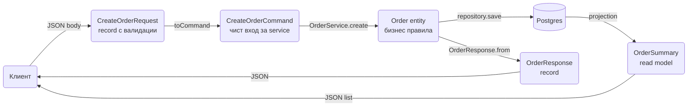

# DTO и mapping

DTO (data transfer object) е формата, в която API-то ти говори със света: какво приема в request и какво връща в response. Отделянето му от JPA entity-то е първото нещо, което разграничава сервис, който ще се поддържа две години, от такъв, който ще се пренапише след шест месеца. Този документ показва как се пишат DTO-та като Java records, как се прави mapping между тях и домейна (на ръка или с MapStruct), как се конфигурира Jackson в Boot и как се представят датите, парите, enum-ите и ID-тата така, че клиентите да не се чудят. Накрая са Spring Data projections, с които четеш DTO директно от базата без entity.

| Какво | Кога | Инструмент |
|---|---|---|
| Request тяло | всяко `POST`, `PUT`, `PATCH` | `record CreateOrderRequest` с validation анотации |
| Response тяло | всеки endpoint, който връща данни | `record OrderResponse` със static factory `from(...)` |
| Лек списъчен изглед | списъци, pagination | `record OrderSummary` или Spring Data projection |
| Mapping с 3 до 5 полета | малки DTO-та | на ръка, `OrderResponse.from(order)` |
| Mapping с 10+ полета, nested, update | големи форми, PATCH | MapStruct `@Mapper(componentModel = "spring")` |
| Различни изгледи на един обект | публично срещу admin API | `@JsonView` или отделни DTO-та |
| Един endpoint, няколко вида обекти | плащания, събития | sealed interface + `@JsonTypeInfo` |

## 1. Зависимости и настройка

Jackson идва със `spring-boot-starter-web`. MapStruct и Lombok са по избор и изискват annotation processor конфигурация в Maven, при това в правилния ред, когато са заедно.

```xml pom.xml
<properties>
    <mapstruct.version>1.6.3</mapstruct.version> <!-- виж последната версия в Maven Central -->
    <lombok-mapstruct-binding.version>0.2.0</lombok-mapstruct-binding.version>
</properties>

<dependencies>
    <dependency>
        <groupId>org.mapstruct</groupId>
        <artifactId>mapstruct</artifactId>
        <version>${mapstruct.version}</version>
    </dependency>
    <dependency>
        <groupId>org.projectlombok</groupId>
        <artifactId>lombok</artifactId>
        <optional>true</optional>
    </dependency>
</dependencies>

<build>
    <plugins>
        <plugin>
            <groupId>org.apache.maven.plugins</groupId>
            <artifactId>maven-compiler-plugin</artifactId>
            <configuration>
                <annotationProcessorPaths>
                    <path>
                        <groupId>org.projectlombok</groupId>
                        <artifactId>lombok</artifactId>
                        <version>${lombok.version}</version>
                    </path>
                    <path>
                        <groupId>org.projectlombok</groupId>
                        <artifactId>lombok-mapstruct-binding</artifactId>
                        <version>${lombok-mapstruct-binding.version}</version>
                    </path>
                    <path>
                        <groupId>org.mapstruct</groupId>
                        <artifactId>mapstruct-processor</artifactId>
                        <version>${mapstruct.version}</version>
                    </path>
                </annotationProcessorPaths>
                <compilerArgs>
                    <arg>-Amapstruct.defaultComponentModel=spring</arg>
                    <arg>-Amapstruct.unmappedTargetPolicy=ERROR</arg>
                </compilerArgs>
            </configuration>
        </plugin>
    </plugins>
</build>
```

`lombok-mapstruct-binding` кара MapStruct да вижда getter-ите и builder-ите, които Lombok генерира. Без него MapStruct се компилира преди Lombok да е свършил и получаваш "no property found". `${lombok.version}` се управлява от `spring-boot-starter-parent`. `unmappedTargetPolicy=ERROR` е умишлено: по-добре build-ът да падне, отколкото ново поле в entity-то тихо да остане `null` в response-а.

```yaml src/main/resources/application.yml
spring:
  jackson:
    default-property-inclusion: non_null
    time-zone: UTC
    deserialization:
      fail-on-unknown-properties: false
      read-unknown-enum-values-using-default-value: true
    serialization:
      write-dates-as-timestamps: false
    mapper:
      default-view-inclusion: false
```

## 2. Защо не връщаме entity от controller

Да върнеш `Order` директно от `@GetMapping` работи на демо и се чупи в продукция по четири предвидими начина:

1. Lazy loading. `Order.items` е `LAZY`. Jackson сериализира извън транзакцията и получаваш `LazyInitializationException`, или включваш `spring.jpa.open-in-view=true` и получаваш N+1 заявки при всяка сериализация.
2. Изтичане на полета. Добавяш `internalNotes` или `passwordHash` в entity-то и то автоматично се появява в API-то. Никой не е решил това съзнателно.
3. Coupling на API към схемата. Преименуваш колона, рефакторираш релация, и всеки клиент се чупи. API контрактът трябва да е стабилен независимо от базата.
4. Цикли. `Order` има `items`, всеки `OrderItem` има `order`. Jackson влиза в безкрайна рекурсия. `@JsonManagedReference` / `@JsonBackReference` го "решават", но превръщат entity-то в JSON модел, което е обратното на целта.

Същото важи и в обратната посока: `@RequestBody Order` позволява на клиента да подаде `id`, `createdAt`, `status: PAID` и каквото друго има в класа. Това е mass assignment уязвимост.

Правилото: entity-тата живеят в service слоя и надолу; controller-ът вижда само DTO-та.

## 3. Минимален работещ пример

Records са естественият DTO в Java 21: immutable, с `equals`/`hashCode`/`toString`, Jackson ги чете и пише без допълнителни анотации. Конвенция за имената, която следваме навсякъде:

| Суфикс | Посока | Пример |
|---|---|---|
| `...Request` | вход, тяло на `POST`/`PUT`/`PATCH` | `CreateOrderRequest`, `UpdateOrderAddressRequest` |
| `...Response` | изход, пълен обект | `OrderResponse` |
| `...Summary` | изход, лек списъчен изглед | `OrderSummary` |
| `...Command` / `...Query` | вътрешно, controller към service | `CreateOrderCommand` |

```java src/main/java/com/acme/shop/order/dto/CreateOrderRequest.java
package com.acme.shop.order.dto;

import jakarta.validation.Valid;
import jakarta.validation.constraints.NotBlank;
import jakarta.validation.constraints.NotEmpty;
import jakarta.validation.constraints.NotNull;
import jakarta.validation.constraints.Positive;
import java.util.List;
import java.util.UUID;

public record CreateOrderRequest(
        @NotNull UUID customerId,
        @NotEmpty List<@Valid Item> items,
        @Valid Address shippingAddress,
        String note
) {
    public record Item(@NotNull UUID productId, @Positive int quantity) {}

    public record Address(@NotBlank String line1, String line2, @NotBlank String city,
                          @NotBlank String postalCode, @NotBlank String countryCode) {}
}
```

```java src/main/java/com/acme/shop/order/dto/OrderResponse.java
package com.acme.shop.order.dto;

import com.acme.shop.order.Order;
import com.acme.shop.order.OrderItem;
import java.math.BigDecimal;
import java.time.Instant;
import java.util.List;
import java.util.UUID;

public record OrderResponse(
        UUID id,
        String status,
        UUID customerId,
        List<ItemResponse> items,
        BigDecimal total,
        String currency,
        Instant createdAt,
        Instant updatedAt
) {
    public record ItemResponse(UUID productId, String productName, int quantity,
                               BigDecimal unitPrice, BigDecimal lineTotal) {}

    public static OrderResponse from(Order order) {
        return new OrderResponse(
                order.getPublicId(),
                order.getStatus().name(),
                order.getCustomer().getPublicId(),
                order.getItems().stream().map(OrderResponse::item).toList(),
                order.getTotal().amount(),
                order.getTotal().currency().getCurrencyCode(),
                order.getCreatedAt(),
                order.getUpdatedAt());
    }

    private static ItemResponse item(OrderItem item) {
        return new ItemResponse(item.getProduct().getPublicId(), item.getProductName(),
                item.getQuantity(), item.getUnitPrice(), item.lineTotal());
    }
}
```

```java src/main/java/com/acme/shop/order/OrderController.java
package com.acme.shop.order;

@RestController
@RequestMapping("/api/orders")
public class OrderController {

    private final OrderService orderService;

    public OrderController(OrderService orderService) {
        this.orderService = orderService;
    }

    @PostMapping
    public ResponseEntity<OrderResponse> create(@Valid @RequestBody CreateOrderRequest request) {
        Order order = orderService.create(request.toCommand());
        return ResponseEntity
                .created(URI.create("/api/orders/" + order.getPublicId()))
                .body(OrderResponse.from(order));
    }

    @GetMapping("/{id}")
    public OrderResponse get(@PathVariable UUID id) {
        return OrderResponse.from(orderService.getByPublicId(id));
    }
}
```

```http
POST /api/orders HTTP/1.1
Content-Type: application/json

{
  "customerId": "6f1e4d2a-9c3b-4b7e-8a6d-2f0c1e9b7a11",
  "items": [
    { "productId": "0a3b9c7d-1111-4e8f-9a2b-3c4d5e6f7a8b", "quantity": 2 }
  ],
  "shippingAddress": { "line1": "ul. Vitosha 1", "city": "Sofia", "postalCode": "1000", "countryCode": "BG" }
}
```

```http
HTTP/1.1 201 Created
Location: /api/orders/3c2a1f0e-7b6d-4c5e-9f8a-1b2c3d4e5f60
Content-Type: application/json

{
  "id": "3c2a1f0e-7b6d-4c5e-9f8a-1b2c3d4e5f60",
  "status": "NEW",
  "customerId": "6f1e4d2a-9c3b-4b7e-8a6d-2f0c1e9b7a11",
  "items": [
    { "productId": "0a3b9c7d-1111-4e8f-9a2b-3c4d5e6f7a8b", "productName": "Keyboard", "quantity": 2,
      "unitPrice": 49.90, "lineTotal": 99.80 }
  ],
  "total": 99.80,
  "currency": "EUR",
  "createdAt": "2026-10-07T09:14:03.120Z",
  "updatedAt": "2026-10-07T09:14:03.120Z"
}
```

Nested DTO-та са вложени records вътре в родителския record: така `Item` и `Address` имат ясна принадлежност и не замърсяват пакета с десет класа `Address`. Ако един nested тип се ползва от няколко DTO-та (`MoneyResponse`, `AddressResponse`), го изваждаш отделно.

## 4. Потокът през слоевете



Request DTO-то не трябва да стига до service слоя: service-ът приема `Command` record или прости аргументи, за да не зависи от web анотации и от формата на JSON-а. При малки сервиси `toCommand()` е просто метод на request record-а. Read model-ите (`OrderSummary`) могат да заобиколят entity-то изцяло и да се четат с projection (секция 10).

## 5. Mapping на ръка срещу MapStruct

| Критерий | На ръка (`from`) | MapStruct |
|---|---|---|
| Полета | до 6 до 8 | 10+ или много DTO-та |
| Nested обекти и списъци | ръчен stream, лесно се вижда | автоматично през други mapper-и |
| Update на съществуващ обект (PATCH) | ръчен `if (x != null)` | `@MappingTarget` + `NullValuePropertyMappingStrategy.IGNORE` |
| Грешки при ново поле | тихо: полето липсва в response | compile error с `unmappedTargetPolicy=ERROR` |
| Бизнес логика в mapping-а | естествено | нужни `expression` или `@AfterMapping`, става неудобно |
| Debug | обикновен код | генериран код в `target/generated-sources`, четим |
| Build setup | нищо | annotation processor, ред спрямо Lombok |

Правило: започни на ръка. Мини на MapStruct, когато имаш повече от три DTO-та на entity или mapping-ът се повтаря в няколко места.

### MapStruct: основен mapper

```java src/main/java/com/acme/shop/order/OrderMapper.java
package com.acme.shop.order;

import com.acme.shop.order.dto.OrderResponse;
import org.mapstruct.Mapper;
import org.mapstruct.Mapping;

@Mapper(componentModel = "spring", uses = MoneyMapper.class)
public interface OrderMapper {

    @Mapping(target = "id", source = "publicId")
    @Mapping(target = "customerId", source = "customer.publicId")
    @Mapping(target = "total", source = "total.amount")
    @Mapping(target = "currency", source = "total.currency.currencyCode")
    OrderResponse toResponse(Order order);

    @Mapping(target = "productId", source = "product.publicId")
    @Mapping(target = "lineTotal", expression = "java(item.lineTotal())")
    OrderResponse.ItemResponse toItemResponse(OrderItem item);
}
```

MapStruct разбира records като target: намира каноничния конструктор и подрежда аргументите по име. `List<OrderItem>` към `List<ItemResponse>` се прави автоматично, защото в същия mapper има метод за единичния елемент. Nested пътища като `customer.publicId` са null-safe: ако `customer` е `null`, резултатът е `null`, а не NPE.

### Update с @MappingTarget

```java src/main/java/com/acme/shop/order/AddressMapper.java
package com.acme.shop.order;

import com.acme.shop.order.dto.UpdateAddressRequest;
import org.mapstruct.BeanMapping;
import org.mapstruct.Mapper;
import org.mapstruct.Mapping;
import org.mapstruct.MappingTarget;
import org.mapstruct.NullValuePropertyMappingStrategy;

@Mapper(componentModel = "spring")
public interface AddressMapper {

    @BeanMapping(nullValuePropertyMappingStrategy = NullValuePropertyMappingStrategy.IGNORE)
    @Mapping(target = "id", ignore = true)
    @Mapping(target = "version", ignore = true)
    void update(UpdateAddressRequest request, @MappingTarget Address address);
}
```

`IGNORE` означава "ако полето в request-а е `null`, не пипай target-а", което е семантиката на PATCH. `ignore = true` за `id` и `version` е задължително, иначе `unmappedTargetPolicy=ERROR` ще спре build-а, а и не искаш клиент да ги променя.

### Enum mapping и nested mapper

```java src/main/java/com/acme/shop/order/MoneyMapper.java
package com.acme.shop.order;

@Mapper(componentModel = "spring")
public interface MoneyMapper {

    default BigDecimal toAmount(Money money) {
        return money == null ? null : money.amount();
    }
}
```

```java src/main/java/com/acme/shop/order/StatusMapper.java
package com.acme.shop.order;

@Mapper(componentModel = "spring")
public interface StatusMapper {

    @ValueMapping(target = "CANCELLED", source = "CANCELED")
    @ValueMapping(target = MappingConstants.NULL, source = MappingConstants.ANY_REMAINING)
    OrderStatus toDomain(ApiOrderStatus apiStatus);
}
```

Enum към enum със същите имена се прави без анотации; `@ValueMapping` е за разликите. `ANY_REMAINING` към `NULL` е безопасният вариант, когато API enum-ът има стойности, които домейнът не познава.

Генерираният код е в `target/generated-sources/annotations`. Когато нещо не се map-ва както очакваш, отвори `OrderMapperImpl.java`, там няма магия.

## 6. Jackson конфигурация в Boot

Boot създава `ObjectMapper` bean с разумни default-и: `WRITE_DATES_AS_TIMESTAMPS` е изключен, `FAIL_ON_UNKNOWN_PROPERTIES` е изключен, `JavaTimeModule` е регистриран. Всичко друго се настройва през `spring.jackson.*`.

| Property | Стойност | Защо |
|---|---|---|
| `default-property-inclusion` | `non_null` | без `"note": null` в отговорите; клиентите третират липса и null еднакво |
| `deserialization.fail-on-unknown-properties` | `false` (default) | клиентът може да праща повече полета, API-то не се чупи при нови версии |
| `property-naming-strategy` | `SNAKE_CASE` само ако контрактът го изисква | camelCase е default, не го сменяй без причина |
| `serialization.write-dates-as-timestamps` | `false` (default) | ISO 8601 текст вместо epoch числа |
| `time-zone` | `UTC` | влияе само на `java.util.Date` и `LocalDateTime` при форматиране; `Instant` винаги е UTC |
| `date-format` | не го ползвай | по-добре `@JsonFormat` на конкретно поле |
| `mapper.default-view-inclusion` | `false` | полета без `@JsonView` да не се включват при view сериализация |

Ако искаш strict API, в който непознато поле е грешка (полезно, когато клиентите често грешат имена), включи `fail-on-unknown-properties: true` и мапни `HttpMessageNotReadableException` към 400 с ясно съобщение, виж [Грешки и ProblemDetail](Exception_Handling.md).

### Анотации, които наистина ти трябват

```java src/main/java/com/acme/shop/product/dto/ProductResponse.java
package com.acme.shop.product.dto;

public record ProductResponse(
        UUID id,
        String name,
        @JsonProperty("sku_code") String sku,
        @JsonInclude(JsonInclude.Include.NON_EMPTY) List<String> tags,
        @JsonFormat(shape = JsonFormat.Shape.STRING) BigDecimal price,
        @JsonFormat(pattern = "yyyy-MM-dd") LocalDate availableFrom,
        @JsonIgnore String internalCode
) {}
```

- `@JsonProperty`: само за единични отклонения от конвенцията. Ако всяко поле има `@JsonProperty`, по-добре смени naming strategy.
- `@JsonIgnore` в response DTO е знак, че полето не трябва да е в DTO-то изобщо. Полезно е основно при request DTO-та за полета, които се попълват от сървъра.
- `@JsonInclude(NON_EMPTY)` на конкретно поле, когато глобалният `non_null` не стига.
- `@JsonFormat(shape = STRING)` за `BigDecimal` пази точността в JavaScript клиенти, където `99.80` става `99.8` и `0.1 + 0.2` не е `0.3`.

### @JsonCreator с records

Jackson чете records през каноничния конструктор без анотации. `@JsonCreator` ти трябва, когато има повече от един конструктор или искаш нормализация на входа:

```java src/main/java/com/acme/shop/user/dto/RegisterUserRequest.java
package com.acme.shop.user.dto;

public record RegisterUserRequest(String email, String displayName) {

    @JsonCreator
    public RegisterUserRequest(@JsonProperty("email") String email,
                               @JsonProperty("displayName") String displayName) {
        this.email = email == null ? null : email.trim().toLowerCase();
        this.displayName = displayName == null ? null : displayName.strip();
    }
}
```

При records по-простият вариант е компактен конструктор без `@JsonCreator`, той се изпълнява при всяко създаване, включително от Jackson:

```java src/main/java/com/acme/shop/user/dto/RegisterUserRequest.java
package com.acme.shop.user.dto;

public record RegisterUserRequest(String email, String displayName) {
    public RegisterUserRequest {
        email = email == null ? null : email.trim().toLowerCase();
        displayName = displayName == null ? null : displayName.strip();
    }
}
```

Компактният конструктор е и правилното място за задължителна нормализация, защото работи и в тестове, където създаваш record-а на ръка.

### Custom serializer и deserializer

Пример за value object `Money`, който в JSON искаш като `{ "amount": "99.80", "currency": "EUR" }`:

```java src/main/java/com/acme/shop/common/config/MoneyJson.java
package com.acme.shop.common.config;

import com.acme.shop.order.Money;
import com.fasterxml.jackson.core.JsonGenerator;
import com.fasterxml.jackson.core.JsonParser;
import com.fasterxml.jackson.databind.DeserializationContext;
import com.fasterxml.jackson.databind.JsonDeserializer;
import com.fasterxml.jackson.databind.JsonNode;
import com.fasterxml.jackson.databind.JsonSerializer;
import com.fasterxml.jackson.databind.SerializerProvider;
import org.springframework.boot.jackson.JsonComponent;

import java.io.IOException;
import java.math.BigDecimal;
import java.util.Currency;

@JsonComponent
public class MoneyJson {

    public static class Serializer extends JsonSerializer<Money> {
        @Override
        public void serialize(Money value, JsonGenerator gen, SerializerProvider sp) throws IOException {
            gen.writeStartObject();
            gen.writeStringField("amount", value.amount().toPlainString());
            gen.writeStringField("currency", value.currency().getCurrencyCode());
            gen.writeEndObject();
        }
    }

    public static class Deserializer extends JsonDeserializer<Money> {
        @Override
        public Money deserialize(JsonParser p, DeserializationContext ctx) throws IOException {
            JsonNode node = p.getCodec().readTree(p);
            return new Money(new BigDecimal(node.get("amount").asText()),
                    Currency.getInstance(node.get("currency").asText()));
        }
    }
}
```

`@JsonComponent` е Boot анотация: регистрира вложените serializer/deserializer в глобалния `ObjectMapper` без да пишеш `Module`. За една употреба на едно поле е по-просто `@JsonSerialize(using = ...)` на record компонента.

### Jackson2ObjectMapperBuilderCustomizer

Когато ти трябва нещо, което няма property, не създавай нов `ObjectMapper` bean (губиш всички Boot default-и), а добави customizer:

```java src/main/java/com/acme/shop/common/config/JacksonConfig.java
package com.acme.shop.common.config;

@Configuration
public class JacksonConfig {

    @Bean
    public Jackson2ObjectMapperBuilderCustomizer jacksonCustomizer() {
        return builder -> builder
                .featuresToEnable(JsonParser.Feature.ALLOW_COMMENTS)
                .featuresToDisable(SerializationFeature.FAIL_ON_EMPTY_BEANS)
                .serializerByType(Instant.class, new InstantMillisSerializer())
                .modules(new BlackbirdModule());
    }
}
```

Customizer-ите се прилагат върху Boot builder-а, така че `JavaTimeModule`, `spring.jackson.*` и `@JsonComponent` продължават да работят.

## 7. Дати, пари, enum-и, ID-та

### Дати и часове

| Тип в Java | В JSON | Кога |
|---|---|---|
| `Instant` | `"2026-10-07T09:14:03.120Z"` | момент във времето: `createdAt`, `paidAt`, `expiresAt`. Default избор. |
| `OffsetDateTime` | `"2026-10-07T12:14:03+03:00"` | когато offset-ът носи информация (час на събитие в локално време на клиента) |
| `LocalDate` | `"2026-10-07"` | дата без час: дата на раждане, падеж на фактура |
| `LocalDateTime` | `"2026-10-07T12:14:03"` | почти никога в API: няма зона и е двусмислен |
| `ZonedDateTime` | с `[Europe/Sofia]` suffix | никога в API: суфиксът не е ISO 8601 и чупи клиенти |

В базата: `timestamptz` за `Instant`, `date` за `LocalDate`. Hibernate 6 map-ва `Instant` към `timestamp with time zone` правилно. Задължително `-Duser.timezone=UTC` или `TZ=UTC` в контейнера, за да няма разлика между dev и prod, виж [Docker и деплой](Docker_Deploy.md).

### Пари

Никога `double` или `float`. Два приемливи варианта:

```java
// Вариант 1: BigDecimal с фиксиран scale, като string в JSON
public record Money(BigDecimal amount, Currency currency) {
    public Money {
        amount = amount.setScale(currency.getDefaultFractionDigits(), RoundingMode.HALF_EVEN);
    }
}

// Вариант 2: minor units, целочислено
public record PriceResponse(long amountMinor, String currency) {}
// 9980 EUR означава 99.80 EUR
```

Вариант 1 е по-четим за хора и по-близо до `numeric(19,4)` в базата. Вариант 2 е това, което Stripe и повечето платежни API ползват, и няма проблеми с rounding изобщо. Избери един за целия сервис. `HALF_EVEN` (banker's rounding) е стандартът за финансови изчисления.

### Enum-и

По подразбиране Jackson пише `name()` на enum-а. Това е добре, стига имената да са стабилна част от контракта. Два проблема за решаване:

```java src/main/java/com/acme/shop/order/OrderStatus.java
package com.acme.shop.order;

public enum OrderStatus {
    NEW("new"), PAID("paid"), SHIPPED("shipped"), CANCELLED("cancelled"),
    @JsonEnumDefaultValue UNKNOWN("unknown");

    private final String code;

    OrderStatus(String code) {
        this.code = code;
    }

    @JsonValue
    public String code() {
        return code;
    }

    @JsonCreator
    public static OrderStatus fromCode(String code) {
        for (var s : values()) {
            if (s.code.equalsIgnoreCase(code)) {
                return s;
            }
        }
        return UNKNOWN;
    }
}
```

- `@JsonValue` пише custom код вместо името, така че можеш да преименуваш константата в Java без да чупиш API-то.
- Непозната стойност при четене: `@JsonEnumDefaultValue` плюс `read-unknown-enum-values-using-default-value: true` от секция 1. Полезно, когато консумираш enum от друг сервис, който може да добави стойности. За собствените request DTO-та обикновено искаш обратното: непозната стойност да е 400, което е default поведението без тези настройки.

### ID-та

| Вариант | Плюс | Минус |
|---|---|---|
| `long` auto-increment, изложен навън | компактен, подреден индекс | издава обем и ред, лесен за enumeration атака |
| `UUID` v4 като primary key | непредвидим, генерира се в клиента | 16 байта, случаен ред чупи B-tree локалността в Postgres |
| `long` вътрешен + `UUID` `public_id` с unique индекс | бърз PK, безопасно публично ID | две колони, mapping между тях |

За нов сервис: третият вариант или UUID v7 (подреден по време) чрез библиотека. Във всички случаи DTO-тата показват само публичното ID, а `OrderService.getByPublicId` го превежда. Никога не излагай вътрешен `long` ID за user, invoice или order, ако не искаш някой да изброи всичките ти клиенти с `for i in 1..100000`.

## 8. @JsonView за различни представяния

Когато един и същ response има публична и admin версия, и разликата е 2 до 3 полета, `@JsonView` спестява второ DTO:

```java src/main/java/com/acme/shop/user/dto/
package com.acme.shop.user.dto;

public class Views {
    public interface Public {}
    public interface Admin extends Public {}
}

public record UserResponse(
        @JsonView(Views.Public.class) UUID id,
        @JsonView(Views.Public.class) String displayName,
        @JsonView(Views.Admin.class) String email,
        @JsonView(Views.Admin.class) Instant lastLoginAt
) {}
```

```java src/main/java/com/acme/shop/user/UserController.java
@GetMapping("/api/users/{id}")
@JsonView(Views.Public.class)
public UserResponse get(@PathVariable UUID id) { ... }

@GetMapping("/api/admin/users/{id}")
@JsonView(Views.Admin.class)
public UserResponse getAsAdmin(@PathVariable UUID id) { ... }
```

С `default-view-inclusion: false` полета без `@JsonView` се пропускат, когато е активен view. Ако разликата е повече от няколко полета или структурата е различна, направи две DTO-та: `@JsonView` става нечетим бързо и не се вижда в OpenAPI схемата без допълнителна работа.

## 9. Полиморфен JSON

Един endpoint за плащания, различни типове: карта, банков превод, портфейл. Sealed interface плюс records плюс `@JsonTypeInfo`:

```java src/main/java/com/acme/shop/payment/dto/PaymentMethodRequest.java
package com.acme.shop.payment.dto;

import com.fasterxml.jackson.annotation.JsonSubTypes;
import com.fasterxml.jackson.annotation.JsonTypeInfo;
import jakarta.validation.constraints.NotBlank;
import jakarta.validation.constraints.Pattern;

@JsonTypeInfo(use = JsonTypeInfo.Id.NAME, property = "type")
@JsonSubTypes({
        @JsonSubTypes.Type(value = PaymentMethodRequest.Card.class, name = "card"),
        @JsonSubTypes.Type(value = PaymentMethodRequest.BankTransfer.class, name = "bank_transfer")
})
public sealed interface PaymentMethodRequest {

    record Card(@NotBlank String token, @Pattern(regexp = "\\d{2}/\\d{2}") String expiry)
            implements PaymentMethodRequest {}

    record BankTransfer(@NotBlank String iban, @NotBlank String holderName)
            implements PaymentMethodRequest {}
}
```

```json
{ "type": "card", "token": "tok_1abc", "expiry": "12/27" }
```

```java src/main/java/com/acme/shop/payment/PaymentService.java
public Payment create(PaymentMethodRequest method) {
    return switch (method) {
        case PaymentMethodRequest.Card c -> cardGateway.charge(c.token());
        case PaymentMethodRequest.BankTransfer b -> bankService.initiate(b.iban(), b.holderName());
    };
}
```

Sealed interface плюс pattern matching `switch` дава compile error, когато добавиш нов тип и забравиш да го обработиш. `Id.NAME` с явни имена е единствената безопасна опция: `Id.CLASS` позволява на клиента да инстанцира произволен клас от classpath-а.

## 10. Spring Data projections като read model

За списъци и справки не ти трябва entity. Projection чете само нужните колони, без lazy proxies и без N+1.

### Interface projection

```java src/main/java/com/acme/shop/order/OrderSummaryView.java
package com.acme.shop.order;

import java.math.BigDecimal;
import java.time.Instant;
import java.util.UUID;

public interface OrderSummaryView {
    UUID getPublicId();
    String getStatus();
    BigDecimal getTotalAmount();
    Instant getCreatedAt();
    CustomerView getCustomer();

    interface CustomerView {
        UUID getPublicId();
        String getDisplayName();
    }
}
```

```java src/main/java/com/acme/shop/order/OrderRepository.java
package com.acme.shop.order;

public interface OrderRepository extends JpaRepository<Order, Long> {
    List<OrderSummaryView> findByStatusOrderByCreatedAtDesc(OrderStatus status);
}
```

Closed projections (само getter-и, без `@Value`) се превеждат до `select` само на изброените колони. Nested interface за `customer` работи, но прави join; ако ти трябва само едно поле от релацията, record projection с `@Query` е по-ефективен.

### Record projection с constructor expression

```java src/main/java/com/acme/shop/order/dto/OrderSummary.java
package com.acme.shop.order.dto;

public record OrderSummary(UUID id, String status, BigDecimal total, String customerName, Instant createdAt) {}
```

```java src/main/java/com/acme/shop/order/OrderRepository.java
package com.acme.shop.order;

public interface OrderRepository extends JpaRepository<Order, Long> {

    @Query("""
            select new com.acme.shop.order.dto.OrderSummary(
                o.publicId, cast(o.status as string), o.total.amount, c.displayName, o.createdAt)
            from Order o join o.customer c
            where o.status = :status
            order by o.createdAt desc
            """)
    Page<OrderSummary> findSummaries(@Param("status") OrderStatus status, Pageable pageable);

    // динамична projection: същата заявка, различен резултат според type
    <T> List<T> findByCustomerPublicId(UUID customerId, Class<T> type);
}
```

Record projection през derived query (`findByCustomerPublicId(id, OrderSummary.class)`) работи, когато имената на компонентите на record-а съвпадат с property-та на entity-то. За всичко с join, агрегации или преименуване ползваш `@Query` с `new ...`. От Hibernate 6.3 нататък в HQL може и без пълното име на класа, ако record-ът е импортиран, но пълното име работи навсякъде.

Projections са правилният DTO за списъчни endpoint-и: controller-ът връща `Page<OrderSummary>` директно от repository-то, без да минава през entity. Как се оформя pagination отговорът е описано в [Pagination](Pagination.md).

## 11. Envelope, pagination и грешки

Не обвивай отговорите в `{ "success": true, "data": {...} }`. HTTP статусът вече казва дали е успех, а envelope-ът кара всеки клиент да разопакова всичко и чупи стандартни инструменти (OpenAPI генератори, HAL клиенти). Контрактът е:

| Случай | Тяло |
|---|---|
| Единичен обект | обектът директно, `200` или `201` с `Location` |
| Списък без pagination | JSON масив |
| Списък с pagination | `{ "content": [...], "page": {...} }`, виж [Pagination](Pagination.md) |
| Грешка | `application/problem+json` по RFC 9457, виж [Грешки и ProblemDetail](Exception_Handling.md) |
| Няма съдържание | `204` без тяло |

## 12. Валидации на request DTO

Validation анотациите живеят на request record-а, не на entity-то и не на command-а. Полето се валидира преди да стигне до service слоя, а грешката се връща като ProblemDetail със списък `errors`. Групи, custom constraints и cross-field проверки са описани във [Валидации](Validation.md). Записът на record компоненти с `@NotNull`, `@Valid` на nested и `List<@Valid Item>` от секция 3 е всичко, което ти трябва в 90% от случаите.

## 13. Lombok: кога помага

Records правят Lombok ненужен за DTO-та: `@Value`, `@Data`, `@AllArgsConstructor` са това, което record-ът дава вграден. Остават два случая, в които Lombok си заслужава:

```java src/main/java/com/acme/shop/order/Order.java
@Entity
@Table(name = "orders")
@Getter
@NoArgsConstructor(access = AccessLevel.PROTECTED)
@Builder
@AllArgsConstructor(access = AccessLevel.PRIVATE)
public class Order {
    @Id @GeneratedValue
    private Long id;
    @Column(nullable = false, unique = true)
    private UUID publicId;
    ...
}
```

- `@Builder` на entity с 10+ полета, когато ги създаваш в тестове и seed данни. `@NoArgsConstructor(PROTECTED)` е задължителен за Hibernate.
- `@Getter` на entity. Никога `@Data` на entity: `equals`/`hashCode` по всички полета чупят `Set` релациите и lazy loading, `toString` с релации дава `LazyInitializationException` в лог ред.

За всичко, което е DTO, command, event или value object: record.

## 14. Immutable колекции в records

Record-ът е immutable само на повърхността: `List<Item> items` може да се модифицира отвън, ако някой държи референцията. Защитно копие в компактния конструктор:

```java src/main/java/com/acme/shop/order/dto/CreateOrderRequest.java
package com.acme.shop.order.dto;

public record CreateOrderRequest(UUID customerId, List<Item> items, String note) {
    public CreateOrderRequest {
        items = items == null ? List.of() : List.copyOf(items);
    }
}
```

`List.copyOf` връща unmodifiable копие и хвърля `NullPointerException` при `null` елемент, което е добре, защото `null` в списък е грешка така или иначе. Jackson подава `ArrayList` в конструктора, така че копието се прави и при десериализация. Същото за `Set.copyOf` и `Map.copyOf`. Цената е незначителна спрямо JSON parsing-а.

## 15. Капани

- `@RequestBody Order` (entity) приема `id`, `status`, `createdAt` от клиента. Mass assignment, който минава през всяка валидация. Винаги отделен request record.
- Response от entity с `LAZY` релация и `open-in-view=false` дава `LazyInitializationException` при сериализация. С `open-in-view=true` дава N+1 заявки. DTO или projection решава и двете.
- `double` за пари: `0.1 + 0.2 != 0.3`. `BigDecimal` или minor units.
- `LocalDateTime` в API: клиентът в Лондон и клиентът в София виждат различен момент. `Instant`.
- `ZonedDateTime` се сериализира с `[Europe/Sofia]` суфикс, който не е валиден ISO 8601 за повечето клиенти.
- Нов `ObjectMapper` bean изтрива всички Boot default-и: датите стават epoch числа, `spring.jackson.*` спира да работи. Ползвай `Jackson2ObjectMapperBuilderCustomizer`.
- MapStruct без `lombok-mapstruct-binding` не вижда Lombok getter-ите и генерира празни mapper-и.
- MapStruct с default `unmappedTargetPolicy=WARN`: добавяш поле в entity-то, mapper-ът го пропуска тихо, response-ът е без него. Сложи `ERROR`.
- `@JsonTypeInfo(use = Id.CLASS)` позволява на клиента да избере клас за инстанциране. Само `Id.NAME` с явни `@JsonSubTypes`.
- `@Data` на entity: `hashCode` по mutable полета чупи `HashSet` релации, `toString` тригерира lazy loading.
- Interface projection с `@Value("#{target.customer.name}")` (open projection) зарежда цялото entity и губиш ползата. Ползвай closed projection или `@Query` с `new`.
- Enum с `@JsonValue` без `@JsonCreator` се пише с код, но се чете по име и десериализацията на собствения ти изход се чупи.

## 16. Чеклист

- [ ] Нито един controller не приема или връща `@Entity` клас
- [ ] Request и response са records с имена по конвенцията `...Request`, `...Response`, `...Summary`
- [ ] Response DTO-тата имат static factory `from(entity)` или MapStruct mapper, не и двете за едно DTO
- [ ] Ако има MapStruct: `componentModel=spring`, `unmappedTargetPolicy=ERROR`, `lombok-mapstruct-binding` в processor path
- [ ] `spring.jackson.default-property-inclusion: non_null`, `time-zone: UTC`, няма custom `ObjectMapper` bean
- [ ] Всички timestamps са `Instant`, всички дати са `LocalDate`, контейнерът работи с `TZ=UTC`
- [ ] Парите са `BigDecimal` със scale или `long` minor units, еднакво в целия сервис
- [ ] Enum-ите в API имат стабилни стойности и решение за непознати стойности
- [ ] Публичните ID-та са UUID, вътрешните `long` ID не излизат от сервиса
- [ ] Списъчните endpoint-и ползват projection или `Summary` record, не пълното entity
- [ ] Няма envelope около успешните отговори, грешките са ProblemDetail
- [ ] Records с колекции правят `List.copyOf` в компактния конструктор

## 17. Свързани документи

- [Валидации](Validation.md): анотациите на request records и как грешките стават ProblemDetail.
- [Грешки и ProblemDetail](Exception_Handling.md): форматът на грешките, който замества envelope-а.
- [Pagination](Pagination.md): формата на списъчните отговори и `Page<OrderSummary>` от projection.
- [Controllers](Controllers.md): `@RequestBody`, `ResponseEntity`, message converters.
- [База данни и ORM](Database_ORM.md): entity дизайн, `publicId` колона, типове за дати и пари в Postgres.
- [Релации](Relations.md): защо lazy релациите не могат да се сериализират и как projections ги заобикалят.
- [API документация](API_Docs.md): как records и `@JsonTypeInfo` се отразяват в OpenAPI схемата.
- [MapStruct reference](https://mapstruct.org/documentation/stable/reference/html/)
