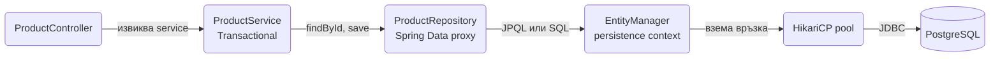
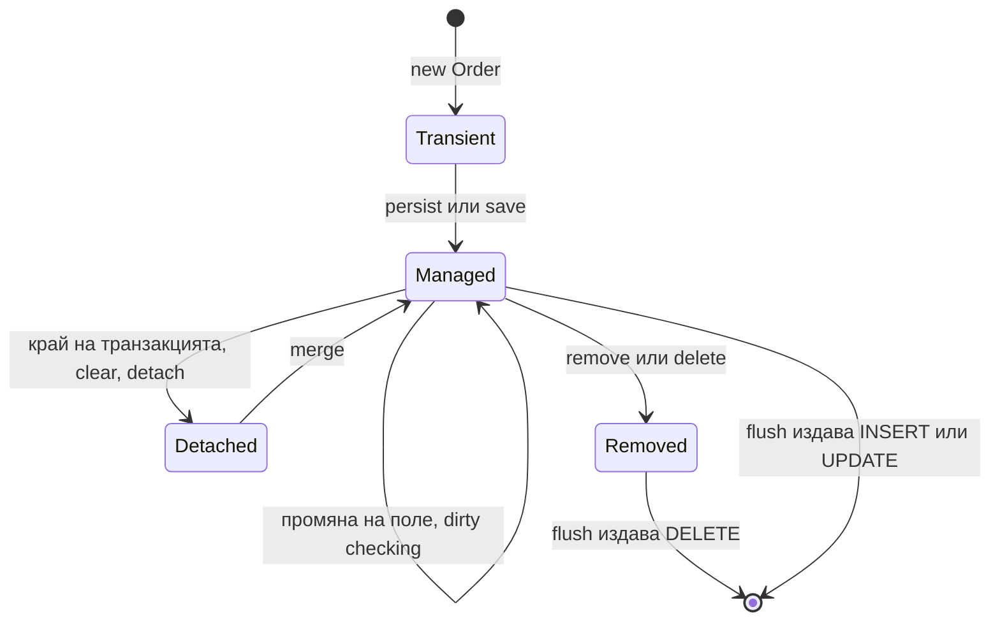

# База данни и ORM

Почти всеки сървис в Spring Boot пази състоянието си в релационна база, а при нас това е PostgreSQL. Spring Data JPA върху Hibernate ти дава entity класове, repository интерфейси и persistence context, който следи промените и ги записва вместо теб. Това е удобно, но крие механика, която трябва да разбираш: кога се отварят връзки, кога се изпълняват заявки, защо изведнъж имаш 200 SELECT-а за един списък. Този документ показва как се настройва datasource и Hibernate за production, как се пишат entity и repository класове, как се избягва N+1, кога да минеш на `JdbcClient` и чист SQL, и как се тества всичко това с реален Postgres.

| Какво | Кога | Инструмент |
|---|---|---|
| CRUD върху agregate (Order, Invoice) | Записваш и четеш цели обекти с релации | JPA entity + `JpaRepository` |
| Списъци и read endpoints | Трябват ти 5 колони, не цял entity граф | Projection (`record` или interface) |
| Филтри с много незадължителни параметри | Търсачка на поръчки | `JpaSpecificationExecutor` |
| Отчети, агрегации, CTE, window функции | JPQL не стига или е грозен | `JdbcClient` с чист SQL |
| Масов update/delete | Хиляди редове наведнъж | `@Modifying @Query` или `JdbcClient` |
| Схема на базата | Винаги | Flyway, виж [Миграции](Migrations.md) |
| Тестове | Repository и query логика | `@DataJpaTest` + Testcontainers |

## 1. Зависимости и настройка

### Maven

```xml pom.xml
<dependency>
    <groupId>org.springframework.boot</groupId>
    <artifactId>spring-boot-starter-data-jpa</artifactId>
</dependency>
<dependency>
    <groupId>org.postgresql</groupId>
    <artifactId>postgresql</artifactId>
    <scope>runtime</scope>
</dependency>
<dependency>
    <groupId>org.flywaydb</groupId>
    <artifactId>flyway-core</artifactId>
</dependency>
<dependency>
    <groupId>org.flywaydb</groupId>
    <artifactId>flyway-database-postgresql</artifactId>
</dependency>
```

`spring-boot-starter-data-jpa` дърпа Hibernate, Spring Data JPA, HikariCP и Spring транзакциите. Flyway не е задължителен за този документ, но на практика винаги го искаш, защото схемата се управлява от миграции, а не от Hibernate.

### application.yml

```yaml src/main/resources/application.yml
spring:
  datasource:
    url: jdbc:postgresql://localhost:5432/shop
    username: shop
    password: ${DB_PASSWORD}
    hikari:
      maximum-pool-size: 10
      minimum-idle: 2
      connection-timeout: 5000
      max-lifetime: 1800000
      pool-name: shop-pool
  jpa:
    open-in-view: false
    hibernate:
      ddl-auto: validate
    properties:
      hibernate:
        default_batch_fetch_size: 50
        jdbc:
          batch_size: 50
          time_zone: UTC
        order_inserts: true
        order_updates: true

logging:
  level:
    org.hibernate.SQL: DEBUG
    org.hibernate.orm.jdbc.bind: TRACE
```

Какво е важно във всяка група:

### HikariCP

HikariCP е pool-ът по подразбиране. Две настройки решават повечето production проблеми:

- `maximum-pool-size`: броят едновременни връзки към Postgres от една инстанция. По подразбиране е 10 и това е добро начало. Повече връзки не означава повече производителност: Postgres обработва връзките с процеси и при 4 ядра на базата 10 до 20 активни връзки е оптимумът. Ако имаш 8 инстанции на сървиса по 10 връзки, базата вижда 80 връзки. Сметни ги спрямо `max_connections` на Postgres или сложи PgBouncer.
- `connection-timeout`: колко милисекунди чака нишка за свободна връзка, преди да получи `SQLTransientConnectionException`. По подразбиране е 30 секунди, което е твърде дълго за HTTP request. 5 секунди е разумно: по-добре бърз fail, отколкото 30 секунди висящи заявки, които запълват thread pool-а на Tomcat.
- `max-lifetime` трябва да е по-малко от timeout-а на базата или на load balancer-а между вас (например при managed Postgres зад proxy), иначе ще виждаш "connection closed" грешки.

### open-in-view=false

`spring.jpa.open-in-view` по подразбиране е `true` и Spring Boot те предупреждава за това при старт. С `true` Spring отваря `EntityManager` при влизане на HTTP request-а и го затваря след като response-ът е изпратен. Това значи, че lazy релация може да се зареди дори в controller-а или по време на JSON сериализация. Звучи удобно, но:

- Връзката от pool-а се държи за целия request, включително докато чакаш външен HTTP или рендираш шаблон. При 10 връзки в pool-а и бавен външен API сървисът спира да отговаря.
- Заявките се изпълняват от места, където не ги очакваш (Jackson, Thymeleaf), което прави N+1 невидим в code review.
- Грешки от базата се появяват след като си върнал 200 и headers-ите вече са изпратени.

Сложи `false` и зареждай каквото ти трябва изрично в service слоя. Ще получиш `LazyInitializationException` там, където преди е "работело случайно". Как се оправя е описано в [Релации](Relations.md).

### ddl-auto=validate

`spring.jpa.hibernate.ddl-auto` управлява дали Hibernate пипа схемата. Стойности: `none`, `validate`, `update`, `create`, `create-drop`. В production и staging използвай `validate`: Hibernate сравнява entity класовете със схемата при старт и ако липсва колона или типът е различен, приложението не стартира. Това хваща забравена миграция преди първия request. Схемата се създава и променя само чрез Flyway, виж [Миграции](Migrations.md). `update` никога, дори локално, защото създава схема, която не съвпада с тази от миграциите, и ти тестваш нещо различно от production.

### SQL logging

`spring.jpa.show-sql=true` пише SQL-а на `System.out`, без параметри и извън logging framework-а. Не го ползвай. Вместо това:

```yaml src/main/resources/application-local.yml
logging:
  level:
    org.hibernate.SQL: DEBUG
    org.hibernate.orm.jdbc.bind: TRACE
```

`org.hibernate.SQL` дава заявките през SLF4J с формата на останалите логове, а `org.hibernate.orm.jdbc.bind` (Hibernate 6) показва bind параметрите. Включвай ги само в `local` профила, в production са скъпи и могат да изтекат лични данни в логовете. За броене на заявки в тестове използвай `spring.jpa.properties.hibernate.generate_statistics=true` и `SessionFactory.getStatistics()`.

## 2. Минимален работещ пример

Схемата (миграция `V20250107_1000__create_products.sql`):

```sql src/main/resources/db/migration/V20250107_1000__create_products.sql
create table products (
    id         bigint generated by default as identity primary key,
    sku        varchar(64)    not null unique,
    name       varchar(255)   not null,
    price      numeric(12, 2) not null,
    status     varchar(32)    not null,
    version    integer        not null default 0,
    created_at timestamptz    not null default now(),
    updated_at timestamptz    not null default now()
);
```

Entity:

```java src/main/java/com/acme/shop/product/Product.java
package com.acme.shop.product;

import jakarta.persistence.*;
import org.hibernate.annotations.CreationTimestamp;
import org.hibernate.annotations.UpdateTimestamp;

import java.math.BigDecimal;
import java.time.Instant;

@Entity
@Table(name = "products")
public class Product {

    @Id
    @GeneratedValue(strategy = GenerationType.IDENTITY)
    private Long id;

    @Column(nullable = false, unique = true, length = 64)
    private String sku;

    @Column(nullable = false)
    private String name;

    @Column(nullable = false, precision = 12, scale = 2)
    private BigDecimal price;

    @Enumerated(EnumType.STRING)
    @Column(nullable = false, length = 32)
    private ProductStatus status;

    @Version
    private int version;

    @CreationTimestamp
    @Column(nullable = false, updatable = false)
    private Instant createdAt;

    @UpdateTimestamp
    @Column(nullable = false)
    private Instant updatedAt;

    protected Product() {
    }

    public Product(String sku, String name, BigDecimal price) {
        this.sku = sku;
        this.name = name;
        this.price = price;
        this.status = ProductStatus.ACTIVE;
    }

    public void rename(String newName) {
        this.name = newName;
    }

    public void changePrice(BigDecimal newPrice) {
        if (newPrice.signum() <= 0) {
            throw new IllegalArgumentException("Цената трябва да е положителна");
        }
        this.price = newPrice;
    }

    public void discontinue() {
        this.status = ProductStatus.DISCONTINUED;
    }

    public Long getId() { return id; }
    public String getSku() { return sku; }
    public BigDecimal getPrice() { return price; }
    public ProductStatus getStatus() { return status; }
}
```

Repository и service (controller-ът само вика service-а и връща DTO, виж [Controllers](Controllers.md)):

```java src/main/java/com/acme/shop/product/ProductRepository.java
package com.acme.shop.product;

public interface ProductRepository extends JpaRepository<Product, Long> {
    Optional<Product> findBySku(String sku);
    boolean existsBySku(String sku);
}
```

```java src/main/java/com/acme/shop/product/ProductService.java
package com.acme.shop.product;

@Service
public class ProductService {

    private final ProductRepository products;

    public ProductService(ProductRepository products) {
        this.products = products;
    }

    @Transactional
    public Long create(CreateProductRequest req) {
        if (products.existsBySku(req.sku())) {
            throw new DuplicateSkuException(req.sku());
        }
        Product product = products.save(new Product(req.sku(), req.name(), req.price()));
        return product.getId();
    }

    @Transactional
    public void changePrice(Long id, BigDecimal newPrice) {
        Product product = products.findById(id)
                .orElseThrow(() -> new ProductNotFoundException(id));
        product.changePrice(newPrice);
        // няма save(): entity е managed и dirty checking записва промяната при commit
    }

    @Transactional(readOnly = true)
    public ProductResponse get(Long id) {
        return products.findById(id)
                .map(ProductResponse::from)
                .orElseThrow(() -> new ProductNotFoundException(id));
    }
}
```

Пътят на един request през слоевете:



Транзакцията започва при влизане в `ProductService`, persistence context-ът живее колкото транзакцията, и връзката се връща в pool-а при commit. Controller-ът не вижда нито `EntityManager`, нито entity обекти, само DTO.

## 3. Анатомия на entity

### Идентификатори

| Стратегия | Postgres DDL | Плюсове | Минуси |
|---|---|---|---|
| `IDENTITY` | `bigint generated by default as identity` | Просто, id-то идва от базата | Hibernate трябва да направи INSERT веднага при `persist`, за да вземе id. JDBC batching на insert-и не работи |
| `SEQUENCE` | `create sequence orders_seq increment by 50` | Hibernate взема 50 id-та с една заявка, batch insert работи, id е известно преди flush | Трябва sequence в миграцията, `allocationSize` трябва да съвпада с `increment by` |
| UUID | `uuid` колона | Генерира се в приложението, удобно за разпределени системи и за публични id-та | 16 байта, случайните v4 разпръскват B-tree индекса. Ползвай v7, ако библиотеката ти го дава |

```java src/main/java/com/acme/shop/order/Order.java
@Id
@GeneratedValue(strategy = GenerationType.SEQUENCE, generator = "orders_seq")
@SequenceGenerator(name = "orders_seq", sequenceName = "orders_seq", allocationSize = 50)
private Long id;
```

```java src/main/java/com/acme/shop/order/Order.java
@Id
@GeneratedValue
@UuidGenerator
private UUID id;
```

Правило: `IDENTITY` за обикновени таблици, `SEQUENCE` когато вмъкваш масово (импорти, OrderItem редове), UUID когато id-то излиза навън в URL или се генерира в друг сървис.

### Колони, enum, версия

- `@Column(nullable = false, length = 64)` не прави нищо в runtime при `ddl-auto=validate`, но документира схемата и се използва при валидацията. Пиши ги, за да съвпадат с миграцията.
- `@Enumerated(EnumType.STRING)` винаги. `ORDINAL` е по подразбиране и записва индекса на enum-а. Добавиш ли стойност по средата, всички стари редове променят смисъла си.
- `@Version` включва optimistic locking: Hibernate добавя `where version = ?` към UPDATE и хвърля `ObjectOptimisticLockingFailureException`, ако някой е променил реда междувременно. Слагай го на всеки entity, който се редактира от няколко потребителя. Подробно в [Транзакции и locking](Transactions.md).
- За пари `BigDecimal` с `numeric(12,2)`, никога `double`.
- За време `Instant` и `timestamptz`. С `hibernate.jdbc.time_zone: UTC` JVM timezone-ът спира да влияе на записаните стойности.

### Auditing

`@CreationTimestamp` и `@UpdateTimestamp` са Hibernate анотации и работят без допълнителна настройка. Ако искаш и кой е направил промяната, използвай Spring Data auditing:

```java src/main/java/com/acme/shop/common/config/JpaConfig.java
package com.acme.shop.common.config;

@Configuration
@EnableJpaAuditing(auditorAwareRef = "auditorProvider")
public class JpaConfig {

    @Bean
    AuditorAware<String> auditorProvider() {
        return () -> Optional.ofNullable(SecurityContextHolder.getContext().getAuthentication())
                .filter(Authentication::isAuthenticated)
                .map(Authentication::getName);
    }
}
```

```java src/main/java/com/acme/shop/common/persistence/AuditedEntity.java
package com.acme.shop.common.persistence;

@MappedSuperclass
@EntityListeners(AuditingEntityListener.class)
public abstract class AuditedEntity {

    @CreatedDate
    @Column(nullable = false, updatable = false)
    private Instant createdAt;

    @LastModifiedDate
    @Column(nullable = false)
    private Instant updatedAt;

    @CreatedBy
    @Column(updatable = false, length = 100)
    private String createdBy;

    @LastModifiedBy
    @Column(length = 100)
    private String updatedBy;

    public Instant getCreatedAt() { return createdAt; }
    public Instant getUpdatedAt() { return updatedAt; }
    public String getCreatedBy() { return createdBy; }
    public String getUpdatedBy() { return updatedBy; }
}
```

Entity класовете наследяват `AuditedEntity` и получават четирите колони автоматично. `@MappedSuperclass` не е таблица, само споделени полета.

### Защо entity не е record и има protected конструктор

Hibernate създава инстанции през no-arg конструктор чрез reflection и след това пълни полетата. Lazy proxy-тата са подкласове на entity класа, затова класът не може да е `final`, а конструкторът трябва да е достъпен за подкласа, тоест поне `protected`. Record-ите са `final`, нямат no-arg конструктор и полетата им са `final`, което прави dirty checking невъзможен. Record-ите са за DTO и projections, entity класовете са обикновени класове с поведение.

Конструкторът с параметри е публичният API за създаване на валиден обект. Публични setter-и за всичко са анти-pattern: entity-то става анемичен контейнер и всеки service пише в него каквото иска. Излагай методи с бизнес смисъл (`changePrice`, `discontinue`).

### equals и hashCode

Не оставяй default-ната реализация, ако слагаш entity обекти в `Set` или ги сравняваш. Но и не ги генерирай по всички полета (Lombok `@Data`), защото id-то е `null` преди persist и mutable полетата променят hashCode-а, докато обектът е в `HashSet`. Правилният вариант е по business key (`sku`) или id-базиран с проверка за null. Пълното обяснение с кода е в [Релации](Relations.md).

## 4. Spring Data repositories

### JpaRepository и derived queries

`JpaRepository<T, ID>` дава `findById`, `findAll`, `save`, `saveAll`, `delete`, `count`, `existsById`, `flush`, `saveAndFlush`, `deleteAllInBatch`. Spring Data генерира proxy при старт, няма реализация за писане.

Derived queries се строят от името на метода:

```java src/main/java/com/acme/shop/order/OrderRepository.java
package com.acme.shop.order;

public interface OrderRepository extends JpaRepository<Order, Long>, JpaSpecificationExecutor<Order> {

    List<Order> findByCustomerIdOrderByCreatedAtDesc(Long customerId);

    List<Order> findByStatusAndCreatedAtAfter(OrderStatus status, Instant since);

    Optional<Order> findByNumber(String number);

    boolean existsByNumber(String number);

    long countByStatus(OrderStatus status);

    Slice<Order> findByStatus(OrderStatus status, Pageable pageable);

    List<Order> findTop10ByStatusOrderByTotalDesc(OrderStatus status);

    Streamable<Order> findByCustomerEmailContainingIgnoreCase(String fragment);

    void deleteByStatusAndCreatedAtBefore(OrderStatus status, Instant before);
}
```

Поддържани ключови думи: `And`, `Or`, `Between`, `LessThan`, `GreaterThanEqual`, `After`, `Before`, `IsNull`, `IsNotNull`, `Like`, `StartingWith`, `Containing`, `In`, `True`, `False`, `IgnoreCase`, `OrderBy...Asc/Desc`, `Top`/`First`, `Distinct`. Spring валидира името при старт: грешка в името означава, че контекстът не се вдига, което е добре.

Ограничение: щом името стане по-дълго от два условия, стани на `@Query`. `findByCustomerIdAndStatusInAndCreatedAtBetweenAndTotalGreaterThanOrderByCreatedAtDesc` не се чете и не се review-ва.

### @Query с JPQL и native

```java src/main/java/com/acme/shop/order/OrderRepository.java
@Query("""
        select o from Order o
        join fetch o.customer
        where o.status = :status
          and o.createdAt >= :since
        order by o.createdAt desc
        """)
List<Order> findRecentWithCustomer(@Param("status") OrderStatus status, @Param("since") Instant since);

@Query(value = """
        select o.* from orders o
        where o.total > :min
          and o.created_at > now() - make_interval(days => :days)
        """, nativeQuery = true)
List<Order> findBigRecentOrders(@Param("min") BigDecimal min, @Param("days") int days);
```

JPQL работи с entity имена и полета, не с таблици. Native SQL е Postgres SQL и може да връща entity (ако select-неш всички колони), скаларни стойности или projection. С Java 21 compile-а с `-parameters` (Spring Boot го включва по подразбиране през Maven plugin-а), затова `@Param` не е задължителен, но е по-ясно с него.

### @Modifying

Заявки, които променят данни, трябва да са `@Modifying` и да се извикват в транзакция:

```java src/main/java/com/acme/shop/order/OrderRepository.java
@Modifying(clearAutomatically = true)
@Transactional
@Query("update Order o set o.status = :to where o.status = :from and o.createdAt < :before")
int expireOrders(@Param("from") OrderStatus from, @Param("to") OrderStatus to, @Param("before") Instant before);
```

Bulk UPDATE заобикаля persistence context-а. Ако в същата транзакция вече си заредил `Order`, той ще остане със старата стойност на `status`. `clearAutomatically = true` чисти persistence context-а след заявката, така че следващият `findById` чете прясно от базата. `flushAutomatically = true` flush-ва преди заявката, за да не изгубиш незаписани промени. Подробно в раздел 9.

### Return types

| Тип | Кога |
|---|---|
| `Optional<T>` | Единичен резултат, който може да липсва. Никога `T` с null проверка |
| `T` | Единичен резултат, който винаги съществува (рядко) |
| `List<T>` | Малък, ограничен списък |
| `Streamable<T>` | Като `List`, но с `map`, `filter`, `and` без да зареждаш друго |
| `Stream<T>` | Голям резултат, обработван ред по ред. Трябва `try-with-resources` и `@Transactional` |
| `Slice<T>` | Пагинация без `count(*)`, за "има ли още" | 
| `Page<T>` | Пагинация с общ брой, виж [Pagination](Pagination.md) |
| `boolean`, `long` | `existsBy`, `countBy` |

Ако заявка с единичен резултат върне два реда, получаваш `IncorrectResultSizeDataAccessException`. Това е сигнал, че ти липсва unique constraint.

## 5. Динамични заявки със Specification

Търсачка на поръчки с незадължителни филтри: статус, клиент, период, минимална сума, текст. С derived queries ще ти трябват 2 на степен 5 метода. `Specification` композира `where` клаузата по време на изпълнение:

```java src/main/java/com/acme/shop/order/OrderFilter.java
package com.acme.shop.order;

public record OrderFilter(
        OrderStatus status,
        Long customerId,
        Instant from,
        Instant to,
        BigDecimal minTotal,
        String search) {
}
```

```java src/main/java/com/acme/shop/order/OrderSpecifications.java
package com.acme.shop.order;

import jakarta.persistence.criteria.JoinType;
import org.springframework.data.jpa.domain.Specification;

import java.util.ArrayList;
import java.util.List;

public final class OrderSpecifications {

    private OrderSpecifications() {
    }

    public static Specification<Order> matching(OrderFilter f) {
        List<Specification<Order>> specs = new ArrayList<>();
        if (f.status() != null) {
            specs.add((root, q, cb) -> cb.equal(root.get("status"), f.status()));
        }
        if (f.customerId() != null) {
            specs.add((root, q, cb) -> cb.equal(root.get("customer").get("id"), f.customerId()));
        }
        if (f.from() != null) {
            specs.add((root, q, cb) -> cb.greaterThanOrEqualTo(root.get("createdAt"), f.from()));
        }
        if (f.to() != null) {
            specs.add((root, q, cb) -> cb.lessThan(root.get("createdAt"), f.to()));
        }
        if (f.minTotal() != null) {
            specs.add((root, q, cb) -> cb.greaterThanOrEqualTo(root.get("total"), f.minTotal()));
        }
        if (f.search() != null && !f.search().isBlank()) {
            String like = "%" + f.search().toLowerCase() + "%";
            specs.add((root, q, cb) -> {
                var customer = root.join("customer", JoinType.LEFT);
                return cb.or(
                        cb.like(cb.lower(root.get("number")), like),
                        cb.like(cb.lower(customer.get("email")), like));
            });
        }
        return Specification.allOf(specs);
    }
}
```

```java src/main/java/com/acme/shop/order/OrderService.java
@Transactional(readOnly = true)
public Page<OrderSummary> search(OrderFilter filter, Pageable pageable) {
    return orders.findAll(OrderSpecifications.matching(filter), pageable)
            .map(OrderSummary::from);
}
```

`Specification.allOf` с празен списък дава specification без условие, затова не ти трябва специален случай. Полетата са низове (`"status"`), което не се проверява при компилация. Ако имаш Hibernate JPA metamodel generator (`hibernate-jpamodelgen`), пиши `Order_.status`.

Querydsl дава типизиран DSL (`QOrder.order.status.eq(...)`) и `QuerydslPredicateExecutor`, но изисква annotation processor и има бавна поддръжка за Jakarta. За нов проект `Specification` стига, а за сложните неща има `JdbcClient`.

## 6. Projections

Read endpoint, който връща списък с 6 колони, не трябва да зарежда entity с 20 полета и три lazy релации. Projection-ите карат Hibernate да select-не само нужното и да не следи нищо в persistence context-а.

### Record чрез constructor expression

```java src/main/java/com/acme/shop/order/OrderSummary.java
package com.acme.shop.order;

public record OrderSummary(Long id, String number, OrderStatus status, BigDecimal total, String customerEmail) {
}
```

```java src/main/java/com/acme/shop/order/OrderRepository.java
@Query("""
        select new com.acme.shop.order.OrderSummary(
            o.id, o.number, o.status, o.total, c.email)
        from Order o
        join o.customer c
        where o.status = :status
        """)
Page<OrderSummary> findSummaries(@Param("status") OrderStatus status, Pageable pageable);
```

Пълното име на класа е задължително в JPQL. Резултатът са обикновени обекти, не managed, което ги прави безопасни за връщане от controller.

### Interface projection

```java src/main/java/com/acme/shop/order/
public interface OrderRow {
    Long getId();
    String getNumber();
    BigDecimal getTotal();
    CustomerRow getCustomer();

    interface CustomerRow {
        String getEmail();
    }
}

List<OrderRow> findByStatus(OrderStatus status);
```

Spring Data чете имената на getter-ите и строи select-а. Вложеният `getCustomer()` обаче може да накара Spring Data да зареди целия entity и да го обвие, което губи смисъла. За плоски списъци interface projection е най-кратък, за всичко с join използвай record с constructor expression.

### Native query към record

```java src/main/java/com/acme/shop/order/OrderRepository.java
@Query(value = """
        select o.id, o.number, o.status, o.total, c.email as customer_email
        from orders o join customers c on c.id = o.customer_id
        where o.status = :status
        """, nativeQuery = true)
List<OrderSummary> findSummariesNative(@Param("status") String status);
```

При native query Spring Data мапва по имена на колони към параметрите на record-а (`customer_email` към `customerEmail`). Ако имената не съвпадат, получаваш `ConverterNotFoundException` при изпълнение, не при старт. Покрий го с тест.

## 7. Persistence context

`EntityManager` държи persistence context: map от id към managed entity за текущата транзакция. Всичко, което прочетеш или `persist`-неш, влиза в него и Hibernate пази snapshot на полетата.



### Dirty checking и flush

При flush (преди commit, преди JPQL заявка, или при `flush()`) Hibernate сравнява всеки managed entity със snapshot-а и издава UPDATE за променените. Затова в `changePrice` по-горе няма `save()`: обектът е managed, промяната се записва при commit.

`save()` върху managed entity прави `merge`, което е безвредно, но подвежда читателя, че без него нищо няма да се запише. `save()` ти трябва за нови обекти (transient) и за detached обекти, които идват отвън. Ако entity-то има `@Version` и idентификаторът е зададен ръчно, `save` на нов обект прави `merge` със SELECT преди INSERT. Ако това те дразни, имплементирай `Persistable<ID>` с `isNew()`.

`saveAndFlush()` изпълнява UPDATE или INSERT веднага. Ползвай го, когато ти трябва грешка от constraint тук и сега (например да хванеш `DataIntegrityViolationException` и да върнеш 409), а не при commit, когато вече си извън try блока. Или когато native заявка след това трябва да вижда промяната.

### Защо това има значение

- Четеш entity два пъти в една транзакция: втория път идва от persistence context-а, без заявка, и е същата инстанция.
- Четеш 10 000 реда в една транзакция и ги обработваш: всичките стоят в паметта и всеки flush ги сравнява. За batch обработка чисти с `entityManager.clear()` на всеки N реда или ползвай projection.
- Промениш поле и после хвърлиш exception: транзакцията се rollback-ва и UPDATE не се издава. Но ако хванеш exception-а и продължиш, промяната се записва при commit, дори да не си искал.

## 8. Проблемът N+1

Entity `Order` с `@ManyToOne(fetch = LAZY) Customer customer` и `@OneToMany List<OrderItem> items`. Този код:

```java src/main/java/com/acme/shop/order/OrderService.java
@Transactional(readOnly = true)
public List<OrderResponse> listPending() {
    return orders.findByStatus(OrderStatus.PENDING).stream()
            .map(o -> new OrderResponse(o.getNumber(), o.getCustomer().getEmail(), o.getItems().size()))
            .toList();
}
```

издава 1 SELECT за поръчките, после по 1 SELECT за клиента и по 1 за items на всяка поръчка. При 100 поръчки това са 201 заявки. С логването от раздел 1 ги виждаш веднага. Решения, по ред на предпочитание:

### JOIN FETCH

```java src/main/java/com/acme/shop/order/OrderRepository.java
@Query("""
        select distinct o from Order o
        join fetch o.customer
        left join fetch o.items
        where o.status = :status
        """)
List<Order> findByStatusWithCustomerAndItems(@Param("status") OrderStatus status);
```

Една заявка. `distinct` не е нужен в Hibernate 6 за дедупликация на root entity (прави я автоматично), но не вреди. Не комбинирай fetch на колекция с `Pageable`, Hibernate ще пагинира в паметта и ще логне `HHH90003004`. Подробности и алтернативата с две заявки в [Релации](Relations.md).

### @EntityGraph

Същият ефект без да пишеш JPQL:

```java src/main/java/com/acme/shop/order/OrderRepository.java
@EntityGraph(attributePaths = {"customer", "items", "items.product"})
List<Order> findByStatus(OrderStatus status);
```

Удобно върху derived queries и `findById`. Ограничението за пагинация с колекции е същото.

### Batch fetching

`spring.jpa.properties.hibernate.default_batch_fetch_size: 50` от раздел 1 променя поведението на всички lazy релации: вместо 1 заявка на поръчка, Hibernate зарежда клиентите за 50 поръчки наведнъж с `where id in (?, ?, ...)`. 100 поръчки стават 1 + 2 + 2 заявки. Това е най-евтиното решение, защото не изисква да пипаш заявките, и го включвай винаги. Ако искаш различна стойност само за една релация, `@BatchSize(size = 20)` върху полето или класа.

Batch fetching не замества fetch join: при 10 000 реда пак са 200 допълнителни заявки. Но за типичен екран с 20 до 100 реда е достатъчно и спасява от N+1 там, където си забравил.

### Projection

Ако endpoint-ът само чете, най-доброто решение е да не зареждаш entity изобщо, виж раздел 6.

## 9. Bulk операции

### Масови update и delete

```java src/main/java/com/acme/shop/order/OrderRepository.java
@Modifying(clearAutomatically = true, flushAutomatically = true)
@Query("delete from OrderItem i where i.order.id in :orderIds")
int deleteItemsForOrders(@Param("orderIds") Collection<Long> orderIds);
```

Bulk JPQL не минава през persistence context и не задейства cascade, `@Version`, `@SQLDelete` или lifecycle callbacks. Това е нормално, затова е и бързо. Ако имаш 50 000 реда за изтриване по бизнес правило, една такава заявка вместо `findAll` + `deleteAll` (която издава 50 000 DELETE-а след 50 000 SELECT-а).

### Масови insert

За batch insert ти трябват `SEQUENCE` id (не `IDENTITY`), `hibernate.jdbc.batch_size` и `order_inserts`. Тогава `saveAll` на 1000 обекта издава 20 batch-а по 50. Postgres драйверът изисква и `reWriteBatchedInserts=true` в JDBC URL-а, за да превърне batch-а в един multi-row INSERT:

```yaml src/main/resources/application.yml
spring:
  datasource:
    url: jdbc:postgresql://localhost:5432/shop?reWriteBatchedInserts=true
```

За импорт на стотици хиляди редове ползвай `JdbcClient` с batch или `COPY` през `CopyManager` на драйвера, Hibernate не е инструментът.

## 10. JdbcClient за чист SQL

`JdbcClient` (Spring 6.1) е fluent обвивка над `JdbcTemplate` с именувани параметри и мапване към record. Използвай го, когато JPQL пречи: отчети с агрегации, CTE, window функции, `ON CONFLICT`, `SKIP LOCKED`, `jsonb` операции, или просто когато заявката е 30 реда SQL и искаш да я копираш директно в psql.

```java src/main/java/com/acme/shop/reporting/SalesReportRepository.java
package com.acme.shop.reporting;

import org.springframework.jdbc.core.simple.JdbcClient;
import org.springframework.stereotype.Repository;

import java.math.BigDecimal;
import java.time.LocalDate;
import java.util.List;

@Repository
public class SalesReportRepository {

    private final JdbcClient jdbc;

    public SalesReportRepository(JdbcClient jdbc) {
        this.jdbc = jdbc;
    }

    public record DailySales(LocalDate day, long orders, BigDecimal revenue, BigDecimal avgOrder) {
    }

    public List<DailySales> dailySales(LocalDate from, LocalDate to) {
        return jdbc.sql("""
                select date_trunc('day', created_at)::date as day,
                       count(*)                            as orders,
                       sum(total)                          as revenue,
                       round(avg(total), 2)                as avg_order
                from orders
                where status = 'PAID'
                  and created_at >= :from
                  and created_at <  :to
                group by 1
                order by 1
                """)
                .param("from", from)
                .param("to", to)
                .query(DailySales.class)
                .list();
    }

    public int upsertDailyTotal(LocalDate day, BigDecimal revenue) {
        return jdbc.sql("""
                insert into daily_totals (day, revenue)
                values (:day, :revenue)
                on conflict (day) do update set revenue = excluded.revenue
                """)
                .param("day", day)
                .param("revenue", revenue)
                .update();
    }

    public Optional<BigDecimal> customerLifetimeValue(long customerId) {
        return jdbc.sql("select coalesce(sum(total), 0) from orders where customer_id = :id and status = 'PAID'")
                .param("id", customerId)
                .query(BigDecimal.class)
                .optional();
    }
}
```

`query(DailySales.class)` мапва колоните към компонентите на record-а по име, с автоматично `snake_case` към `camelCase`. Spring Boot конфигурира `JdbcClient` bean автоматично върху същия `DataSource`, а `@Transactional` работи еднакво за JPA и JDBC, защото и двата ползват една и съща връзка от thread-а. Може да смесваш JPA и `JdbcClient` в една транзакция, но помни: JPA flush-ва преди commit, така че SQL през `JdbcClient` няма да види незаписани промени от persistence context-а, освен ако не извикаш `entityManager.flush()` преди това.

Кога `JdbcClient` вместо JPA:

| Ситуация | Инструмент |
|---|---|
| Запис и четене на aggregate с релации | JPA |
| Списък с филтри върху 1 до 2 таблици | JPA projection или Specification |
| Отчет с group by, window функции, CTE | `JdbcClient` |
| Upsert, `SKIP LOCKED`, advisory locks | `JdbcClient` |
| Импорт на много редове | `JdbcClient` batch |
| Заявка, която искаш да тестваш в psql без превод | `JdbcClient` |

## 11. Транзакции накратко

Всеки repository метод от Spring Data е транзакционен сам по себе си (`SimpleJpaRepository` е `@Transactional(readOnly = true)` с `@Transactional` върху write методите). Но това значи, че два извиквания от service без собствена транзакция са две транзакции, с два отделни persistence context-а, и lazy релации между тях гърмят. Затова service методите носят `@Transactional`, а read методите `@Transactional(readOnly = true)`. Propagation, isolation, rollback правила, self-invocation капанът и locking са в [Транзакции и locking](Transactions.md).

## 12. Soft delete

Ако бизнесът иска "изтрити" записи да остават в базата:

```java src/main/java/com/acme/shop/customer/Customer.java
package com.acme.shop.customer;

@Entity
@Table(name = "customers")
@SQLDelete(sql = "update customers set deleted_at = now() where id = ? and version = ?")
@SQLRestriction("deleted_at is null")
public class Customer {

    @Id
    @GeneratedValue(strategy = GenerationType.IDENTITY)
    private Long id;

    @Version
    private int version;

    private Instant deletedAt;
    // ...
}
```

`@SQLDelete` замества DELETE-а, който Hibernate издава при `remove`. `@SQLRestriction` (Hibernate 6.3+, замества `@Where`) добавя условието към всяка заявка за този entity, включително `findById` и релации. Параметрите в `@SQLDelete` са позиционни и следват реда id, version.

Ограничения, които трябва да знаеш:

- Native заявки и `JdbcClient` не знаят за `@SQLRestriction`. Пиши `deleted_at is null` ръчно.
- Unique constraint върху `email` ще пречи на повторна регистрация с имейл на изтрит клиент. Ползвай partial index: `create unique index on customers (email) where deleted_at is null`.
- Bulk `delete from Customer` през JPQL не минава през `@SQLDelete`, прави истински DELETE.
- Релация към soft-deleted ред (`order.customer`) ще хвърли `EntityNotFoundException` при достъп, защото restriction-ът го филтрира.

## 13. JSONB колони

Hibernate 6 мапва `jsonb` без допълнителни библиотеки:

```java src/main/java/com/acme/shop/order/
public record ShippingAddress(String street, String city, String postalCode, String country) {
}

@Entity
@Table(name = "orders")
public class Order {

    @JdbcTypeCode(SqlTypes.JSON)
    @Column(columnDefinition = "jsonb")
    private ShippingAddress shippingAddress;

    @JdbcTypeCode(SqlTypes.JSON)
    @Column(columnDefinition = "jsonb")
    private Map<String, Object> metadata = new HashMap<>();
}
```

Hibernate сериализира с Jackson (ако е на classpath-а, какъвто е случаят в Spring Boot). Миграцията: `shipping_address jsonb not null`. Dirty checking работи по стойност: ако замениш record-а, Hibernate го записва; ако мутираш `Map`-а на място, също го хваща, защото сравнява сериализираното съдържание.

За заявки по jsonb съдържание (`metadata ->> 'source' = 'mobile'`, GIN индекси, `@>`) използвай native `@Query` или `JdbcClient`. JPQL не разбира jsonb оператори. Hibernate 6.6 има `jsonb` функции в HQL (например `json_value`), но native SQL е по-прозрачен.

## 14. Няколко datasource-а

Рядко ти трябва и винаги усложнява: два `DataSource` bean-а (всеки с `@ConfigurationProperties` върху `DataSourceProperties`), два `LocalContainerEntityManagerFactoryBean` през `EntityManagerFactoryBuilder`, два `JpaTransactionManager`, два пакета с repositories, разделени чрез `@EnableJpaRepositories(basePackages, entityManagerFactoryRef, transactionManagerRef)`, и `@Transactional("reportingTransactionManager")` навсякъде за втората база. Spring Boot auto-configuration за JPA се изключва, щом дефинираш нещата ръчно, и `@Primary` решава кой е "по подразбиране".

Преди да го правиш, питай се дали втората база не е само за четене на отчети. Ако да, един `JdbcClient` върху втори `DataSource` bean (`JdbcClient.create(reportingDataSource)`) е десет пъти по-просто от втори JPA контекст. Транзакция, която обхваща две бази, не е атомарна без XA, виж [Транзакции и locking](Transactions.md).

## 15. Тестване

`@DataJpaTest` вдига само JPA частта от контекста (entity, repositories, `EntityManager`, Flyway) и прави всеки тест транзакционен с rollback в края. По подразбиране заменя datasource-а с вграден H2, което е безсмислено при Postgres-специфичен SQL. Изключи замяната и ползвай Testcontainers:

```java src/test/java/com/acme/shop/order/OrderRepositoryTest.java
package com.acme.shop.order;

@DataJpaTest
@AutoConfigureTestDatabase(replace = AutoConfigureTestDatabase.Replace.NONE)
@Testcontainers
class OrderRepositoryTest {

    @Container
    @ServiceConnection
    static PostgreSQLContainer<?> postgres = new PostgreSQLContainer<>("postgres:16-alpine");

    @Autowired
    OrderRepository orders;

    @Autowired
    TestEntityManager em;

    @Test
    void findSummaries_returnsOnlyRequestedStatus() {
        Customer c = em.persist(new Customer("ana@example.com"));
        em.persist(new Order("ORD-1", c, OrderStatus.PENDING));
        em.persist(new Order("ORD-2", c, OrderStatus.PAID));
        em.flush();
        em.clear();

        Page<OrderSummary> page = orders.findSummaries(OrderStatus.PAID, PageRequest.of(0, 10));

        assertThat(page.getContent()).extracting(OrderSummary::number).containsExactly("ORD-2");
    }
}
```

`em.flush(); em.clear();` преди заявката е важно: иначе persistence context-ът връща обектите, които току-що си създал, без да минава през базата, и тестът не доказва нищо за SQL-а. `@ServiceConnection` подава URL, потребител и парола от контейнера към `spring.datasource`, а Flyway прилага миграциите при старт на контекста. Статичният контейнер се споделя от всички тестове в класа. Как се споделя между класове, кога `@SpringBootTest` вместо `@DataJpaTest`, и защо `@Transactional` на тестове крие бъгове: [Testing](Testing.md).

## 16. Капани

- `open-in-view=true` (default) държи връзка от pool-а за целия HTTP request и прави lazy loading в controller-а да "работи", докато под натоварване pool-ът не се изчерпи. Изключи го от първия ден.
- `ddl-auto=update` локално, `validate` в production: тестваш срещу схема, която Hibernate е измислил, и производствената миграция гърми в петък. Flyway навсякъде, `validate` навсякъде.
- `@Enumerated` без `EnumType.STRING` записва ordinal. Вмъкването на нова enum константа по средата тихо променя смисъла на всички съществуващи редове.
- Entity с `IDENTITY` id и `saveAll` на 10 000 реда: няма batching, 10 000 отделни INSERT-а. Мини на `SEQUENCE` с `allocationSize = 50` и `reWriteBatchedInserts=true`.
- `findAll()` без `Pageable` на таблица, която днес е малка. След година е 2 милиона реда и endpoint-ът убива сървиса. Винаги `Pageable` или `Top`.
- Lombok `@Data` върху entity: `hashCode` по всички полета, `toString` през lazy релациите (N+1 от лог ред), `equals` който се променя след persist. Виж [Релации](Relations.md).
- `@Modifying` без `clearAutomatically`: след bulk update четеш стари стойности от persistence context-а и пишеш тест, който "доказва", че update-ът не работи.
- Bulk JPQL операции заобикалят `@SQLDelete`, `@Version` и cascade. Ако разчиташ на soft delete, bulk delete-ът прави hard delete.
- `Stream<T>` от repository извън транзакция: връзката се затваря преди да си прочел stream-а. Трябва `@Transactional` и `try-with-resources`.
- `Specification` с `root.join(...)` в `Page` заявка: join-ът се прави и в `count` заявката, а при `@OneToMany` join дублира редове. Ползвай `distinct` в query-то или филтрирай през subquery.
- `show-sql=true` в production: `System.out`, без параметри, не минава през logger конфигурацията, и не може да се изключи без рестарт.
- Native projection към record с колона, чието име не съвпада с компонент: грешката е runtime, при първия request, не при старт. Покрий всяка native заявка с тест.

## 17. Чеклист

- [ ] `spring.jpa.open-in-view: false` и `ddl-auto: validate` във всички профили
- [ ] HikariCP: `maximum-pool-size` съобразен с броя инстанции и `max_connections`, `connection-timeout` под 10 секунди
- [ ] Flyway е добавен и първата миграция съществува преди първия entity
- [ ] SQL logging през `org.hibernate.SQL` само в `local` профил
- [ ] `hibernate.default_batch_fetch_size` и `jdbc.batch_size` са настроени
- [ ] Всеки entity има `protected` no-arg конструктор, `@Version` ако се редактира конкурентно, и `@Enumerated(STRING)` за всеки enum
- [ ] Auditing полета чрез `@MappedSuperclass` и `@EnableJpaAuditing`
- [ ] Всички `@ManyToOne` са `fetch = LAZY`
- [ ] Read endpoints връщат projection, не entity
- [ ] Списъци с филтри минават през `Specification` и `Pageable`
- [ ] Отчети и upsert са в `JdbcClient` repository
- [ ] `@DataJpaTest` с Testcontainers Postgres, не H2

## 18. Свързани документи

- [Релации](Relations.md): fetch стратегии, `LazyInitializationException`, equals/hashCode, cascade, пълен пример с Order и OrderItem.
- [Транзакции и locking](Transactions.md): `@Transactional` в дълбочина, optimistic и pessimistic locking, propagation.
- [Миграции](Migrations.md): Flyway конфигурация, naming, zero-downtime промени на схемата.
- [Pagination](Pagination.md): `Page` срещу `Slice`, keyset пагинация, сортиране.
- [DTO и mapping](DTO_Mapping.md): как entity се превръща в response record без да изтича навън.
- [Testing](Testing.md): Testcontainers, споделени контейнери, `@DataJpaTest` срещу `@SpringBootTest`.
- [Seeding](Seeding.md): начални данни отделно от схемата.
- [Spring Data JPA reference](https://docs.spring.io/spring-data/jpa/reference/)
