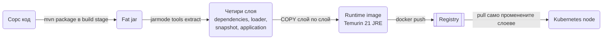
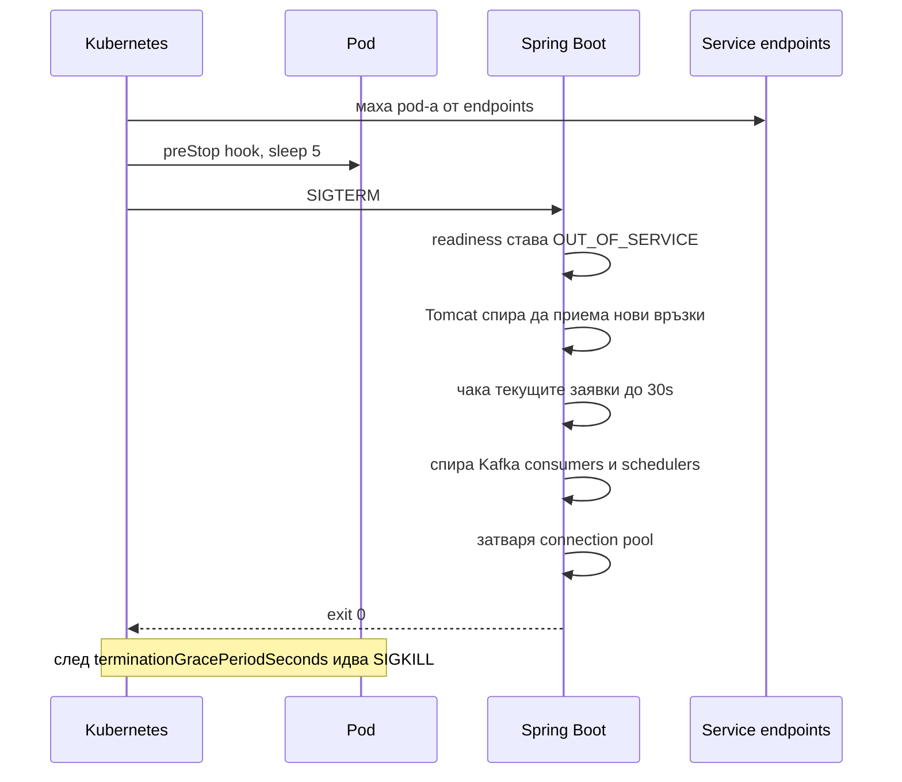
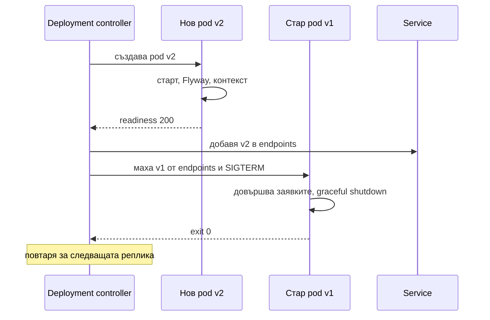

# Docker и деплой

Деплоят на Spring Boot сървис е jar, пакетиран в контейнер, с правилно настроена JVM, конфигурация през environment, graceful shutdown и health probes, които оркестраторът разбира. Повечето production инциденти в първите седмици идват не от бизнес логиката, а от OOM kill заради грешна памет, от loadbalancer, който праща трафик към инстанция, която още не е готова, или от миграция, пусната едновременно от три pod-а. Този документ показва как се строи production image с layered jar или Buildpacks, как се настройва JVM в контейнер, как изглежда docker compose за локална разработка, какво значи graceful shutdown отвътре, как се пишат Kubernetes probes и Deployment, как изглежда CI/CD pipeline-ът и какво е различно при деплой на една машина със systemd. Накрая има чеклист за zero-downtime деплой.

| Какво | Кога | Инструмент |
|---|---|---|
| Fat jar | Винаги, базата на всичко | `mvn package`, `spring-boot-maven-plugin` |
| Layered jar в Dockerfile | Когато искаш пълен контрол върху image-а | `java -Djarmode=tools -jar app.jar extract --layers` |
| Buildpacks без Dockerfile | Малък екип, стандартни нужди | `mvn spring-boot:build-image` |
| Локална среда с всички зависимости | Всеки ден в dev | docker compose + `spring-boot-docker-compose` |
| Health probes | Kubernetes, loadbalancer | Actuator `liveness` и `readiness` |
| Graceful shutdown | Всеки деплой с трафик | `server.shutdown=graceful` |
| Сканиране и SBOM | CI на всеки image | Trivy, `cyclonedx-maven-plugin` |
| Една машина без Kubernetes | Малък продукт, вътрешен инструмент | systemd + docker compose |

## 1. Зависимости и настройка

Самият деплой не изисква нови starters, но тези три неща трябва да са в проекта преди първия image.

```xml pom.xml
<!-- health probes, info, metrics -->
<dependency>
    <groupId>org.springframework.boot</groupId>
    <artifactId>spring-boot-starter-actuator</artifactId>
</dependency>

<!-- стартира docker compose при локален run, не влиза в jar-а -->
<dependency>
    <groupId>org.springframework.boot</groupId>
    <artifactId>spring-boot-docker-compose</artifactId>
    <scope>runtime</scope>
    <optional>true</optional>
</dependency>
```

```xml pom.xml
<build>
    <plugins>
        <plugin>
            <groupId>org.springframework.boot</groupId>
            <artifactId>spring-boot-maven-plugin</artifactId>
            <configuration>
                <image>
                    <name>ghcr.io/example/orders:${project.version}</name>
                </image>
            </configuration>
            <executions>
                <execution>
                    <goals>
                        <goal>build-info</goal>
                    </goals>
                </execution>
            </executions>
        </plugin>
    </plugins>
</build>
```

`build-info` слага версия и време на build в `/actuator/info`, което е единственият сигурен начин да разбереш коя версия всъщност върти pod-ът.

```yaml src/main/resources/application.yml
server:
  shutdown: graceful
  forward-headers-strategy: framework
spring:
  lifecycle:
    timeout-per-shutdown-phase: 30s
  threads:
    virtual:
      enabled: true
management:
  endpoints:
    web:
      exposure:
        include: health,info,prometheus,sbom
  endpoint:
    health:
      probes:
        enabled: true
      group:
        readiness:
          include: readinessState,db
```

## 2. Минимален работещ пример

Най-късият път от код до работещ контейнер е fat jar плюс Dockerfile от десет реда.

```bash
mvn -DskipTests package
ls target/*.jar
```

`spring-boot-maven-plugin` прави `target/orders-1.4.2.jar`, изпълним jar с всички зависимости вътре и loader, който ги зарежда.

```dockerfile Dockerfile
FROM eclipse-temurin:21-jre
WORKDIR /app
COPY target/*.jar app.jar
USER 1000
ENTRYPOINT ["java", "-jar", "app.jar"]
```

```bash
docker build -t orders:dev .
docker run --rm -p 8080:8080 -e SPRING_PROFILES_ACTIVE=dev orders:dev
curl localhost:8080/actuator/health
```

Това работи, но има два проблема: при всяка промяна на един ред код Docker пресъздава целия слой с 60 MB зависимости, и build-ът зависи от локално инсталиран Maven. Останалата част от документа решава тези и още няколко.

## 3. Production image

### Layered jar и защо слоевете помагат

Docker кешира image-а слой по слой. Ако слоят със зависимостите не е променен, при push и pull се прехвърля само слоят с твоя код, обикновено под 1 MB. Spring Boot разделя jar-а на четири слоя по честота на промяна:

| Слой | Съдържание | Колко често се променя |
|---|---|---|
| `dependencies` | Release версии на библиотеките | Рядко, при upgrade |
| `spring-boot-loader` | Loader класовете на Boot | При upgrade на Boot |
| `snapshot-dependencies` | `-SNAPSHOT` зависимости | При вътрешни библиотеки |
| `application` | Твоите класове и ресурси | На всеки commit |

От Boot 3.3 извличането става с jarmode `tools`:

```bash
java -Djarmode=tools -jar target/orders-1.4.2.jar extract --layers --destination extracted
ls extracted
# application  dependencies  snapshot-dependencies  spring-boot-loader
```

В по-стари версии командата е `java -Djarmode=layertools -jar app.jar extract`, със същата структура на изхода. Слоят `application` съдържа тънък `orders-1.4.2.jar` с `Class-Path` към `lib/`, така че `java -jar` работи без loader магия.



### Multi-stage Dockerfile

```dockerfile Dockerfile
# syntax=docker/dockerfile:1.7

FROM eclipse-temurin:21-jdk AS build
WORKDIR /src
COPY .mvn/ .mvn/
COPY mvnw pom.xml ./
# зависимостите се теглят в отделен слой, за да не се повтарят при промяна на код
RUN --mount=type=cache,target=/root/.m2 ./mvnw -q dependency:go-offline
COPY src/ src/
RUN --mount=type=cache,target=/root/.m2 ./mvnw -q -DskipTests package

FROM eclipse-temurin:21-jre AS extract
WORKDIR /extract
COPY --from=build /src/target/*.jar app.jar
RUN java -Djarmode=tools -jar app.jar extract --layers --destination out

FROM eclipse-temurin:21-jre
RUN groupadd --system app && useradd --system --gid app --uid 1000 app
WORKDIR /app
COPY --from=extract --chown=app:app /extract/out/dependencies/ ./
COPY --from=extract --chown=app:app /extract/out/spring-boot-loader/ ./
COPY --from=extract --chown=app:app /extract/out/snapshot-dependencies/ ./
COPY --from=extract --chown=app:app /extract/out/application/ ./
USER app
EXPOSE 8080
ENV JAVA_TOOL_OPTIONS="-XX:MaxRAMPercentage=75.0 -XX:+ExitOnOutOfMemoryError -Djava.security.egd=file:/dev/./urandom"
ENTRYPOINT ["java", "-jar", "app.jar"]
```

Какво е важно тук:

- Три stage-а: `build` с JDK и Maven, `extract` само разопакова, финалният е JRE без build инструменти. Крайният image е около 250 MB вместо 700 MB.
- `--mount=type=cache` за `.m2` пази зависимостите между build-ове на същата машина или runner.
- Non-root потребител. Много кластери отказват да стартират pod като root (`runAsNonRoot: true` в PodSecurity).
- `ENTRYPOINT` в exec форма (JSON масив). Shell формата `ENTRYPOINT java -jar app.jar` пуска `sh -c`, и SIGTERM отива към shell-а, не към Java. Тогава graceful shutdown не се случва никога и Kubernetes убива pod-а след timeout.
- `JAVA_TOOL_OPTIONS` се чете от JVM автоматично и се вижда в логовете при старт (`Picked up JAVA_TOOL_OPTIONS`). Така флаговете са в image-а, а деплоят може да ги override-не с env променлива.
- Distroless алтернатива: `gcr.io/distroless/java21-debian12:nonroot` няма shell и package manager, което намалява атакуваемата повърхност, но и прави `kubectl exec` безполезен за debug. За `ENTRYPOINT` при distroless пишеш `["java", "-jar", "app.jar"]` по същия начин.

```text .dockerignore
# .dockerignore
target/
!target/*.jar
.git/
.idea/
*.md
docker-compose*.yml
.env*
```

`.dockerignore` намалява build context-а и, по-важно, спира `.env` файлове със secrets да влязат в image-а.

### Buildpacks: image без Dockerfile

```bash
mvn spring-boot:build-image -DskipTests
# или с явно име
mvn spring-boot:build-image -Dspring-boot.build-image.imageName=ghcr.io/example/orders:1.4.2
```

Cloud Native Buildpacks (Paketo) анализират jar-а и строят image с подходящ JRE, layered структура, non-root потребител и memory calculator, който сам задава `-Xmx` според лимита на контейнера. Няма Dockerfile за поддръжка и базовият image се обновява от Paketo с CVE fix-ове.

```xml pom.xml
<plugin>
    <groupId>org.springframework.boot</groupId>
    <artifactId>spring-boot-maven-plugin</artifactId>
    <configuration>
        <image>
            <name>ghcr.io/example/orders:${project.version}</name>
            <env>
                <BP_JVM_VERSION>21</BP_JVM_VERSION>
                <BP_JVM_CDS_ENABLED>true</BP_JVM_CDS_ENABLED>
            </env>
        </image>
    </configuration>
</plugin>
```

`BP_JVM_CDS_ENABLED` прави training run по време на build и записва CDS архив, виж раздел 4.

| Критерий | Dockerfile | Buildpacks |
|---|---|---|
| Контрол върху базовия image | Пълен | Ограничен до Paketo вариантите |
| Поддръжка | Твоя | Paketo обновява JRE и OS |
| Build без Docker daemon | Да с kaniko или buildah | Нужен daemon или podman |
| Специални нужди: native библиотеки, fonts, curl за debug | Лесно | Трудно, нужен custom buildpack |
| Memory calculator | Ти го правиш с `MaxRAMPercentage` | Автоматичен, понякога твърде консервативен |
| Подходящо за | Екипи с ops познания, нестандартни image-и | Малки екипи, стандартен REST сървис |

Правило: започни с Buildpacks, премини на Dockerfile при първата реална нужда.

## 4. JVM в контейнер

### Памет: heap не е всичко

JVM от версия 10 е container-aware (`-XX:+UseContainerSupport` е включен по подразбиране) и чете cgroup лимита, не паметта на хоста. По подразбиране обаче heap-ът е 25% от лимита, което в контейнер с 1 GB дава 256 MB heap и останалото се губи. `-XX:MaxRAMPercentage=75.0` вдига heap-а до 75%, а другите 25% остават за non-heap.

Non-heap е това, което повечето хора забравят:

| Област | Типичен размер за Boot сървис | Как се контролира |
|---|---|---|
| Metaspace (класове) | 80 до 150 MB | `-XX:MaxMetaspaceSize` рядко трябва |
| Thread stacks | 1 MB на platform thread, виртуалните са евтини | `-Xss`, `spring.threads.virtual.enabled` |
| Direct buffers (Netty, NIO) | 10 до 100 MB | `-XX:MaxDirectMemorySize` |
| Code cache (JIT) | 50 до 100 MB | `-XX:ReservedCodeCacheSize` |
| GC структури, native | 30 до 80 MB | Зависи от GC |

Практическо правило за избор на лимит: heap, който ти трябва под натоварване (виж `jvm_memory_used_bytes{area="heap"}` в Prometheus след load test), раздели на 0.75 и закръгли нагоре до 512 MB стъпка. За типичен REST сървис с JPA лимит от 1 GB с `MaxRAMPercentage=75` е добра начална точка, под 768 MB JVM започва да се държи странно.

В Deployment-а (раздел 8) това е `requests: { cpu: 500m, memory: 1Gi }` и `limits: { memory: 1Gi }`. Memory `request` и `limit` еднакви: JVM не връща памет на ОС и не може да живее с по-малко от лимита, който е видяла при старт. CPU `limit` обикновено не се задава, защото cgroup throttling при JIT и GC прави latency spike-ове. Ако все пак има CPU limit под 2, JVM избира SerialGC и един GC thread, което е ОК за малки сървиси, но за по-големи задай `-XX:ActiveProcessorCount=2` или по-висок limit, за да получиш G1.

`-XX:+ExitOnOutOfMemoryError` е задължителен: без него след OOM процесът остава полужив, readiness probe-ът може да минава, а заявките висят. С него JVM умира и Kubernetes рестартира pod-а чисто.

### По-бърз старт: CDS и AppCDS

Class Data Sharing записва вече заредените и проверени класове в архив, който следващият старт map-ва в паметта вместо да parse-ва jar-ове. За Boot сървис стартът пада от около 4 на около 2 секунди. Boot 3.3 добавя `spring.context.exit=onRefresh`, който стартира контекста докрай, без да отваря порт и без да пипа базата, и излиза. Това е "training run" за архива.

```dockerfile Dockerfile
FROM eclipse-temurin:21-jre
WORKDIR /app
# същите четири COPY --from=extract реда като в production image-а
# training run: контекстът се вдига и излиза, записва се CDS архив
RUN java -XX:ArchiveClassesAtExit=app.jsa -Dspring.context.exit=onRefresh -jar app.jar
USER 1000
ENTRYPOINT ["java", "-XX:SharedArchiveFile=app.jsa", "-jar", "app.jar"]
```

Training run-ът трябва да работи без база и без broker, затова тези bean-ове трябва да не се свързват при `refresh` (JPA с `ddl-auto=validate` ще се опита да се свърже, задай `-Dspring.profiles.active=cds` с in-memory настройки или остави Flyway и JPA да fail-нат меко). Buildpacks правят това вместо теб с `BP_JVM_CDS_ENABLED`.

### GraalVM native image накратко

`mvn -Pnative native:compile` компилира сървиса до native executable: старт под 100 ms, памет 3 до 5 пъти по-малко, image под 100 MB. Цената: build от 5 до 15 минути, reflection и proxies трябва да са известни по време на build (Boot AOT го прави за повечето starters, но не за всяка библиотека), няма JIT, така че peak throughput е по-нисък, и debug е труден. Има смисъл за serverless, CLI инструменти и много малки сървиси с рядък трафик. За стандартен API с постоянен трафик JVM с CDS е по-простият избор.

## 5. Конфигурация през environment

Image-ът е един за всички среди, конфигурацията идва отвън. Spring Boot чете env променливи с relaxed binding: `SPRING_DATASOURCE_URL` става `spring.datasource.url`, `APP_PAYMENTS_TIMEOUT` става `app.payments.timeout`.

```yaml k8s/deployment.yaml
# фрагмент от Deployment
env:
  - name: SPRING_PROFILES_ACTIVE
    value: prod
  - name: SPRING_DATASOURCE_URL
    value: jdbc:postgresql://orders-db:5432/orders
  - name: SPRING_DATASOURCE_USERNAME
    valueFrom:
      secretKeyRef: { name: orders-db, key: username }
  - name: SPRING_DATASOURCE_PASSWORD
    valueFrom:
      secretKeyRef: { name: orders-db, key: password }
  - name: JAVA_TOOL_OPTIONS
    value: "-XX:MaxRAMPercentage=75.0 -XX:+ExitOnOutOfMemoryError"
```

Secrets като env променливи се виждат в `kubectl describe pod` и в crash dump-ове. По-чистата опция е mounted файлове: Kubernetes Secret като volume в `/run/secrets/`, а Boot ги чете като config tree, където името на файла е ключ, а съдържанието е стойност.

```yaml src/main/resources/application.yml
spring:
  config:
    import: optional:configtree:/run/secrets/
```

```text
/run/secrets/spring.datasource.password   -> съдържа паролата
/run/secrets/app.stripe.api-key           -> съдържа ключа
```

`optional:` означава, че локално, където директорията я няма, стартът не се чупи. Docker compose с `secrets:` монтира на същото място. Как се организират профилите и `@ConfigurationProperties` е в [Конфигурация и профили](Configuration_Profiles.md).

## 6. Docker compose за локална разработка

### Compose файл с всички зависимости

```yaml compose.yaml
# compose.yaml
services:
  postgres:
    image: postgres:16-alpine
    environment:
      POSTGRES_DB: orders
      POSTGRES_USER: orders
      POSTGRES_PASSWORD: orders
    ports: ["5432:5432"]
    volumes: ["pgdata:/var/lib/postgresql/data"]
    healthcheck:
      test: ["CMD-SHELL", "pg_isready -U orders -d orders"]
      interval: 5s
      timeout: 3s
      retries: 10

  redis:
    image: redis:7-alpine
    ports: ["6379:6379"]
    healthcheck:
      test: ["CMD", "redis-cli", "ping"]
      interval: 5s
      retries: 10

  mailpit:
    image: axllent/mailpit
    ports: ["1025:1025", "8025:8025"]

  kafka:
    image: apache/kafka:3.9.0
    ports: ["9092:9092"]
    environment:
      KAFKA_NODE_ID: 1
      KAFKA_PROCESS_ROLES: broker,controller
      KAFKA_LISTENERS: PLAINTEXT://:9092,CONTROLLER://:9093
      KAFKA_ADVERTISED_LISTENERS: PLAINTEXT://localhost:9092
      KAFKA_CONTROLLER_LISTENER_NAMES: CONTROLLER
      KAFKA_CONTROLLER_QUORUM_VOTERS: 1@localhost:9093
      KAFKA_OFFSETS_TOPIC_REPLICATION_FACTOR: 1
    healthcheck:
      test: ["CMD-SHELL", "/opt/kafka/bin/kafka-topics.sh --bootstrap-server localhost:9092 --list"]
      interval: 10s
      retries: 10

  app:
    build: .
    profiles: ["full"]
    ports: ["8080:8080"]
    environment:
      SPRING_PROFILES_ACTIVE: dev
      SPRING_DATASOURCE_URL: jdbc:postgresql://postgres:5432/orders
      SPRING_DATA_REDIS_HOST: redis
      SPRING_KAFKA_BOOTSTRAP_SERVERS: kafka:9092
      SPRING_MAIL_HOST: mailpit
    depends_on:
      postgres: { condition: service_healthy }
      redis: { condition: service_healthy }
      kafka: { condition: service_healthy }

volumes:
  pgdata:
```

`depends_on` с `condition: service_healthy` чака healthcheck-а, не само стартирането на контейнера. Без това приложението стартира преди Postgres да приема връзки, Flyway fail-ва и трябва да рестартираш. Сървисът `app` е в compose profile `full`, така че `docker compose up` вдига само зависимостите, а приложението го пускаш от IDE-то за hot reload и debug.

### spring-boot-docker-compose

С `spring-boot-docker-compose` в classpath-а (раздел 1) приложението при старт само пуска `docker compose up` за файла в работната директория, чака healthcheck-овете и конфигурира `DataSource`, `RedisConnectionFactory` и `KafkaTemplate` от портовете на контейнерите чрез `@ServiceConnection` механизма, без да пишеш URL-и в `application-dev.yml`. Поддържа Postgres, MySQL, Redis, Kafka, RabbitMQ, MongoDB и други по image name. Mailpit не е сред тях, за него `spring.mail.host=localhost` и `port=1025` остават ръчно.

```yaml src/main/resources/application-dev.yml
# application-dev.yml
spring:
  docker:
    compose:
      file: compose.yaml
      lifecycle-management: start-only
      skip:
        in-tests: true
```

`start-only` оставя контейнерите живи след спиране на приложението, за да не губиш данните и да не чакаш Kafka при всеки рестарт. `skip.in-tests` е важно: тестовете ползват Testcontainers със собствени контейнери и `@ServiceConnection`, описано в [Testing](Testing.md), и не бива да се закачат за dev compose-а.

## 7. Graceful shutdown

### Какво се случва при SIGTERM



С `server.shutdown=graceful` (по подразбиране от Boot 3.4, но го пиши изрично) при SIGTERM Tomcat спира да приема нови връзки, но довършва активните заявки до `spring.lifecycle.timeout-per-shutdown-phase`. Едновременно `ApplicationAvailability` преминава в `OUT_OF_SERVICE`, така че readiness probe-ът връща 503 и loadbalancer-ът спира да праща трафик. След това се спират `SmartLifecycle` bean-овете по фази: Kafka listener containers приключват текущия batch и commit-ват offset-ите, `@Scheduled` задачите, които вече текат, се изчакват, `TaskExecutor`-ите с `wait-for-tasks-to-complete-on-shutdown` се източват.

```yaml src/main/resources/application.yml
server:
  shutdown: graceful
spring:
  lifecycle:
    timeout-per-shutdown-phase: 30s
  task:
    execution:
      shutdown:
        await-termination: true
        await-termination-period: 20s
    scheduling:
      shutdown:
        await-termination: true
        await-termination-period: 20s
```

Как се пишат `@Scheduled` и `@Async` задачи, които могат да бъдат прекъснати безопасно, е описано в [Cron, @Async и опашки](Scheduling_Queues.md). За Kafka consumer-ите стандартният `ConcurrentKafkaListenerContainerFactory` вече е `SmartLifecycle` и спира чисто.

### Защо е нужен preStop

Kubernetes маха pod-а от Service endpoints и праща SIGTERM паралелно, не последователно. За една-две секунди kube-proxy и ingress-ът още пращат заявки към pod, който вече не приема връзки. `preStop` със `sleep 5` дава време на мрежата да се обнови, преди JVM да получи сигнала.

```yaml k8s/deployment.yaml
lifecycle:
  preStop:
    exec:
      command: ["sh", "-c", "sleep 5"]
terminationGracePeriodSeconds: 45
```

`terminationGracePeriodSeconds` трябва да е по-голям от `preStop` плюс `timeout-per-shutdown-phase`, иначе SIGKILL идва преди Spring да е приключил. При distroless image няма `sh`, тогава `preStop` е `httpGet` към endpoint, който просто спи, или просто се разчита на `sleep` в самия код чрез `ContextClosedEvent` listener.

## 8. Health probes и Kubernetes Deployment

### Какво влиза в liveness и readiness

Actuator има два отделни endpoint-а, когато `management.endpoint.health.probes.enabled=true` (включва се автоматично, ако Boot открие, че е в Kubernetes):

- `/actuator/health/liveness` отговаря на въпроса "жив ли е процесът". Включва само `livenessState`. Ако върне 503, Kubernetes рестартира контейнера. Никога не слагай тук проверка към базата: при DB outage ще рестартираш всички pod-ове в цикъл и ще влошиш нещата.
- `/actuator/health/readiness` отговаря на "може ли да поема трафик". Включва `readinessState` и това, което добавиш. Базата да, защото без нея почти всяка заявка ще fail-не. Външни API-та не: ако Stripe е бавен, не искаш целият ти сървис да изчезне от loadbalancer-а.

```yaml src/main/resources/application.yml
management:
  endpoint:
    health:
      probes:
        enabled: true
      group:
        readiness:
          include: readinessState,db
        liveness:
          include: livenessState
      show-details: never
```

Health indicator-ите, custom проверки и метрики са описани в [Observability](Observability.md).

### Deployment

```yaml k8s/deployment.yaml
apiVersion: apps/v1
kind: Deployment
metadata:
  name: orders
spec:
  replicas: 3
  strategy:
    type: RollingUpdate
    rollingUpdate:
      maxSurge: 1
      maxUnavailable: 0
  selector:
    matchLabels: { app: orders }
  template:
    metadata:
      labels: { app: orders }
      annotations:
        prometheus.io/scrape: "true"
        prometheus.io/path: /actuator/prometheus
        prometheus.io/port: "8080"
    spec:
      securityContext:
        runAsNonRoot: true
      containers:
        - name: orders
          image: ghcr.io/example/orders:1.4.2
          ports:
            - containerPort: 8080
          env:
            - name: SPRING_PROFILES_ACTIVE
              value: prod
          envFrom:
            - configMapRef: { name: orders-config }
          volumeMounts:
            - name: secrets
              mountPath: /run/secrets
              readOnly: true
          resources:
            requests: { cpu: 500m, memory: 1Gi }
            limits: { memory: 1Gi }
          startupProbe:
            httpGet: { path: /actuator/health/liveness, port: 8080 }
            periodSeconds: 2
            failureThreshold: 60
          livenessProbe:
            httpGet: { path: /actuator/health/liveness, port: 8080 }
            periodSeconds: 10
            failureThreshold: 3
          readinessProbe:
            httpGet: { path: /actuator/health/readiness, port: 8080 }
            periodSeconds: 5
            failureThreshold: 2
          lifecycle:
            preStop:
              exec:
                command: ["sh", "-c", "sleep 5"]
      terminationGracePeriodSeconds: 45
      volumes:
        - name: secrets
          secret: { secretName: orders-secrets }
```

- `startupProbe` дава до 120 секунди за старт (60 опита по 2 секунди), след което liveness поема. Без него liveness с `failureThreshold: 3` и `periodSeconds: 10` убива бавно стартиращ pod на 30-ата секунда и влизаш в CrashLoopBackOff.
- `maxUnavailable: 0` с `maxSurge: 1` гарантира, че по време на rolling update винаги има поне толкова готови pod-а, колкото `replicas`. Новият pod трябва да мине readiness, преди стар да бъде спрян.
- `prometheus.io/*` анотациите са конвенция за Prometheus с kubernetes_sd. С Prometheus Operator вместо тях се прави `ServiceMonitor`.

### Rolling deploy отвътре



### HPA

```yaml k8s/hpa.yaml
apiVersion: autoscaling/v2
kind: HorizontalPodAutoscaler
metadata:
  name: orders
spec:
  scaleTargetRef:
    apiVersion: apps/v1
    kind: Deployment
    name: orders
  minReplicas: 3
  maxReplicas: 12
  metrics:
    - type: Resource
      resource:
        name: cpu
        target:
          type: Utilization
          averageUtilization: 70
```

CPU е добра метрика за CPU-bound сървиси. За I/O-bound API с виртуални нишки CPU остава нисък дори при насищане на базата; тогава скалираш по RPS или по латентност от Prometheus чрез адаптер (`http_server_requests_seconds_count` rate на pod), или по дълбочина на опашката за consumer-и.

## 9. Миграции при деплой

Flyway при старт на приложението е най-простият вариант и работи добре с една реплика. С три реплики и rolling update три pod-а стартират Flyway едновременно. Flyway взима lock в таблицата `flyway_schema_history`, така че само един мигрира, другите чакат, но ако миграцията е дълга, другите два минават `startupProbe` timeout-а и Kubernetes ги рестартира.

| Вариант | Плюсове | Минуси | Кога |
|---|---|---|---|
| При старт на приложението | Нула инфраструктура, миграции и код винаги заедно | Бавни миграции блокират старта, няколко pod-а се надпреварват | Една реплика, бързи миграции |
| Init container със същия image | Миграцията свършва преди app контейнера, не се надпреварва с другите pod-ове | Все пак се пуска за всеки pod, ако имаш 3 реплики | Малки кластери |
| Kubernetes Job преди Deployment | Веднъж, с отделен timeout и лог, деплоят чака да приключи | Нужна стъпка в pipeline-а, Helm hook или Argo sync wave | Production с няколко реплики |

```yaml k8s/deployment.yaml
initContainers:
  - name: migrate
    image: ghcr.io/example/orders:1.4.2
    args: ["--spring.main.web-application-type=none", "--app.migrate-only=true"]
    envFrom:
      - configMapRef: { name: orders-config }
```

`app.migrate-only` е твой флаг, при който `ApplicationRunner` изчаква Flyway и излиза с `SpringApplication.exit`. В основния контейнер `spring.flyway.enabled=false`, за да не се повтаря. Как се пишат миграции, съвместими със стария код, за да може да върти v1 и v2 едновременно, е в [Миграции](Migrations.md).

## 10. Логове и метрики от контейнера

Контейнерът пише на stdout, оркестраторът събира. Никакви файлове, никакъв logrotate в image-а. В production форматът е JSON, за да може Loki или Elasticsearch да индексират полетата без grok шаблони.

```yaml src/main/resources/application-prod.yml
# application-prod.yml
logging:
  structured:
    format:
      console: ecs
```

`ecs` е Elastic Common Schema, `logstash` е другият вграден формат. Как се добавят `requestId`, `userId` и trace id в JSON-а през MDC е описано в [Logging](Logging.md). Локално оставаш на plain текст, JSON в терминала е нечетим.

Метриките се сервират от `/actuator/prometheus` и се scrape-ват по анотациите от Deployment-а. Проверка, че scrape-ът работи: `kubectl port-forward` и `curl localhost:8080/actuator/prometheus | grep http_server_requests`. Трябва да видиш редове с `uri`, `status` и `method` labels.

## 11. CI/CD pipeline

```yaml .github/workflows/ci.yml
# .github/workflows/ci.yml
name: CI
on:
  push:
    branches: [main]
  pull_request:

jobs:
  test:
    runs-on: ubuntu-latest
    steps:
      - uses: actions/checkout@v4
      - uses: actions/setup-java@v4
        with:
          distribution: temurin
          java-version: '21'
          cache: maven
      # Testcontainers ползва Docker daemon-а на runner-а, нищо допълнително не е нужно
      - run: ./mvnw -B verify

  build-image:
    needs: test
    if: github.ref == 'refs/heads/main'
    runs-on: ubuntu-latest
    permissions:
      contents: read
      packages: write
    steps:
      - uses: actions/checkout@v4
      - uses: docker/setup-buildx-action@v3
      - uses: docker/login-action@v3
        with:
          registry: ghcr.io
          username: ${{ github.actor }}
          password: ${{ secrets.GITHUB_TOKEN }}
      - uses: docker/build-push-action@v6
        with:
          context: .
          push: true
          tags: |
            ghcr.io/example/orders:${{ github.sha }}
            ghcr.io/example/orders:latest
          cache-from: type=gha
          cache-to: type=gha,mode=max
      - uses: aquasecurity/trivy-action@master
        with:
          image-ref: ghcr.io/example/orders:${{ github.sha }}
          severity: CRITICAL,HIGH
          exit-code: '1'
          ignore-unfixed: true

  deploy-staging:
    needs: build-image
    runs-on: ubuntu-latest
    environment: staging
    steps:
      - uses: actions/checkout@v4
      - run: |
          kubectl set image deployment/orders orders=ghcr.io/example/orders:${{ github.sha }} -n staging
          kubectl rollout status deployment/orders -n staging --timeout=5m
        env:
          KUBECONFIG: ${{ secrets.KUBECONFIG_STAGING }}
```

- Тагът е git sha, не `latest` и не версията от pom-а. Sha е единственият таг, който сочи към точно един build и позволява rollback с `kubectl rollout undo` или с явен sha.
- `kubectl rollout status` чака readiness на новите pod-ове и fail-ва job-а, ако деплоят не мине. Без него pipeline-ът е зелен, а production е в CrashLoopBackOff.
- Тестовете с Testcontainers вървят на стандартния ubuntu runner, който има Docker. Няма нужда от `services:` секция.
- За production стъпката е същата с `environment: production` и ръчно одобрение в GitHub environment настройките, или GitOps с Argo CD, където pipeline-ът само commit-ва новия таг в manifest репо.

### SBOM и pinning

```xml pom.xml
<plugin>
    <groupId>org.cyclonedx</groupId>
    <artifactId>cyclonedx-maven-plugin</artifactId>
    <!-- Boot управлява версията от 3.3 нататък -->
    <executions>
        <execution>
            <phase>package</phase>
            <goals>
                <goal>makeAggregateBom</goal>
            </goals>
        </execution>
    </executions>
</plugin>
```

С плъгина в build-а Actuator endpoint-ът `/actuator/sbom/application` връща CycloneDX списък на всички зависимости с версии. Security екипът може да сверява срещу CVE бази, без да има достъп до кода. Trivy в pipeline-а прави същото за OS пакетите в image-а.

Базовият image трябва да е pinned по digest, не по movable таг:

```dockerfile Dockerfile
FROM eclipse-temurin:21-jre@sha256:3f1c...a9e2
```

`eclipse-temurin:21-jre` днес и след месец са различни image-и. С digest build-ът е възпроизводим, а Dependabot или Renovate отварят PR при нов digest, който минава през теста и Trivy.

## 12. Reverse proxy и ingress

Приложението никога не вижда клиента директно, пред него има ingress controller, loadbalancer или nginx. Три неща трябва да се настроят.

```yaml src/main/resources/application.yml
server:
  forward-headers-strategy: framework
  tomcat:
    max-http-form-post-size: 10MB
    connection-timeout: 20s
spring:
  servlet:
    multipart:
      max-file-size: 10MB
      max-request-size: 12MB
```

- `forward-headers-strategy: framework` кара Spring да чете `X-Forwarded-For`, `X-Forwarded-Proto` и `X-Forwarded-Prefix`, така че `request.getRemoteAddr()`, генерираните redirect URL-и и Swagger UI да виждат оригиналния host и `https`. Без това redirect след login сочи към `http://orders-svc:8080`. `native` е вариантът, при който Tomcat сам обработва header-ите, `framework` е по-предвидим зад няколко proxy-та.
- TLS се терминира на ingress-а. Приложението слуша plain HTTP на 8080 вътре в кластера. Mutual TLS между сървисите, ако е нужен, е работа на service mesh, не на Tomcat.
- Лимит на размера на заявката има на две места: в ingress-а (`nginx.ingress.kubernetes.io/proxy-body-size: 12m`) и в Spring. Ingress лимитът трябва да е равен или малко по-голям от Spring лимита, иначе клиентът вижда 413 от nginx с HTML тяло вместо `ProblemDetail`.
- Timeout-и също са на две места: `proxy-read-timeout` на ingress-а и `spring.mvc.async.request-timeout` за async отговори. Ingress timeout-ът трябва да е по-голям от най-дългата легитимна заявка, иначе получаваш 504 докато приложението още работи.

## 13. Environment parity и 12-factor

Повечето "работи на моята машина" проблеми са нарушение на едно от тези правила:

| Принцип | Какво значи за Spring Boot |
|---|---|
| Един codebase, много деплои | Един image за dev, staging, prod. Разликата е само в env променливите и профила. |
| Зависимости декларирани | Всичко в `pom.xml`, нищо инсталирано на хоста. Testcontainers вместо локален Postgres. |
| Конфигурация в environment | Нищо специфично за среда в `application.yml`. Secrets никога в git. |
| Backing services като ресурси | Базата е URL. Смяна от локален Postgres към RDS е промяна на env, не на код. |
| Build, release, run разделени | CI строи image веднъж, deploy го ползва с различен config. Не се строи на production машината. |
| Stateless процеси | Сесии в Redis, файлове в S3, нищо на локалния диск. Pod-ът може да умре всеки момент. |
| Dev и prod близки | Същият Postgres major version локално, в CI и в prod. Същият image. |
| Логове като stream | stdout, JSON, без файлове. |

Най-честото нарушение: staging с H2 или с друга версия на Postgres. Миграция, която работи на H2, пада на Postgres с друг синтаксис, и го разбираш в production.

## 14. Деплой без Kubernetes

За вътрешен инструмент или малък продукт с една-две машини Kubernetes е излишна сложност. Две работещи алтернативи:

### Една VM със systemd и docker compose

```yaml deploy/compose.yaml
# /opt/orders/compose.yaml
services:
  app:
    image: ghcr.io/example/orders:${ORDERS_TAG}
    restart: unless-stopped
    ports: ["127.0.0.1:8080:8080"]
    env_file: /etc/orders/app.env
    secrets: [db_password]
    environment:
      SPRING_CONFIG_IMPORT: optional:configtree:/run/secrets/
    healthcheck:
      test: ["CMD", "wget", "-qO-", "http://localhost:8080/actuator/health/readiness"]
      interval: 10s
      retries: 5
    depends_on:
      postgres: { condition: service_healthy }
  postgres:
    image: postgres:16-alpine
    restart: unless-stopped
    volumes: ["/var/lib/orders/pgdata:/var/lib/postgresql/data"]
    env_file: /etc/orders/db.env
    healthcheck:
      test: ["CMD-SHELL", "pg_isready -U orders"]
      interval: 5s
      retries: 10
secrets:
  db_password:
    file: /etc/orders/secrets/spring.datasource.password
```

```ini deploy/shop.service
# /etc/systemd/system/orders.service
[Unit]
Description=Orders service
Requires=docker.service
After=docker.service network-online.target

[Service]
Type=simple
WorkingDirectory=/opt/orders
EnvironmentFile=/etc/orders/deploy.env
ExecStartPre=/usr/bin/docker compose pull --quiet
ExecStart=/usr/bin/docker compose up --remove-orphans
ExecStop=/usr/bin/docker compose down --timeout 40
Restart=always
RestartSec=5
TimeoutStopSec=60

[Install]
WantedBy=multi-user.target
```

```bash
sudo systemctl enable --now orders
# деплой на нова версия
echo 'ORDERS_TAG=3f1c2a9' | sudo tee /etc/orders/deploy.env
sudo systemctl restart orders
journalctl -u orders -f
```

`docker compose down --timeout 40` праща SIGTERM и чака до 40 секунди, което покрива graceful shutdown-а. Пред това стои nginx или Caddy на хоста за TLS, с `proxy_pass http://127.0.0.1:8080`. Downtime при деплой е няколко секунди, за повечето вътрешни инструменти това е приемливо. Ако не е, пускаш две инстанции на различни портове и сменяш upstream-а в nginx.

Ако не искаш и Docker, същият unit файл работи с `ExecStart=/usr/bin/java -jar /opt/orders/app.jar`, `User=orders` и `Environment=JAVA_TOOL_OPTIONS=-Xmx768m`, а Postgres е инсталиран от пакет.

### PaaS: Fly.io, Render, Railway

Всички взимат Dockerfile или Buildpacks и се грижат за TLS, rolling deploy и health checks. Задаваш health check path `/actuator/health/readiness`, памет поне 1 GB за JVM, secrets през техния UI или CLI, и managed Postgres. Това е най-бързият път до production за един човек. Ограничението е, че при растеж цената и липсата на контрол над мрежата стават проблем, но до тогава си спестил месеци ops работа.

## 15. Zero-downtime чеклист за деплой

Деплой без загубени заявки изисква четири неща едновременно. Липсва ли едно, има downtime.

1. Readiness gating: новият pod получава трафик само след като `readiness` върне 200. Старият спира да получава трафик преди SIGTERM. `maxUnavailable: 0`.
2. Graceful shutdown: `server.shutdown=graceful`, `preStop` sleep, `terminationGracePeriodSeconds` по-голям от сумата на timeout-ите, exec форма на `ENTRYPOINT`.
3. Backward compatible миграции: v1 и v2 вървят паралелно 1 до 2 минути срещу същата схема. Нова колона е nullable или с default. Преименуване е три деплоя: добави, мигрирай данните и кода, махни старата. Виж [Миграции](Migrations.md).
4. Feature flags за поведение, не за схема: нова функционалност е изключена при деплой и се включва след него през конфигурация или flag сървис. Деплой и release са две отделни събития.

Плюс: клиентите имат retry на идемпотентни заявки при connection reset, защото някоя заявка все пак ще уцели pod в момента на спиране.

## 16. Капани

- `ENTRYPOINT java -jar app.jar` в shell форма. SIGTERM отива към `sh`, Java не го вижда, graceful shutdown не се случва, Kubernetes убива pod-а след grace period с SIGKILL и половината in-flight заявки се губят. Винаги JSON масив.
- Контейнер с 512 MB лимит и без `MaxRAMPercentage`. Heap-ът е 128 MB, GC работи постоянно, после OOM. Или пренебрегната non-heap памет при лимит, който е равен на `-Xmx`: OOM kill от cgroup, без Java stack trace, само `exit code 137`.
- Liveness probe, който проверява базата. DB outage превръща 3 здрави pod-а в 3 рестартиращи pod-а, и когато базата се върне, всичките стартират и мигрират едновременно.
- Без `startupProbe` и бавен старт при студен node: liveness убива pod-а преди Spring да е готов, CrashLoopBackOff, никога не стартира.
- Flyway при старт с три реплики и миграция, която прави index на голяма таблица. Два pod-а чакат lock-а, минават startup timeout-а, рестартират, и всичко се повтаря. Миграцията е Job.
- `latest` таг в Deployment. `kubectl rollout restart` тегли нещо друго от това, което си тествал, и rollback е невъзможен, защото предишният `latest` вече не съществува.
- Secrets в `application-prod.yml`, commit-нати в git "само временно". Остават там завинаги и в историята. Env или mounted файлове, от първия ден.
- `forward-headers-strategy` не е зададено и редиректите след OAuth2 login сочат към вътрешния `http://` адрес. Login-ът "не работи само в production".
- Ingress timeout 30 секунди и export, който работи 45 секунди. Клиентът вижда 504, бекендът довършва и записва резултат, който никой не вижда. Дълги операции са async с polling или с линк по имейл.

## 17. Чеклист

- [ ] Multi-stage Dockerfile с layered jar или `spring-boot:build-image`, non-root потребител, exec форма на `ENTRYPOINT`.
- [ ] `.dockerignore` изключва `.git`, `.env` и `target/` без jar-а.
- [ ] Базов image pinned по digest, Renovate или Dependabot го обновява.
- [ ] `JAVA_TOOL_OPTIONS` с `-XX:MaxRAMPercentage=75.0 -XX:+ExitOnOutOfMemoryError`, memory request равен на limit, без CPU limit или поне 2 CPU.
- [ ] `server.shutdown=graceful`, `timeout-per-shutdown-phase`, `preStop` sleep и `terminationGracePeriodSeconds` по-голям от сумата.
- [ ] `startupProbe`, `livenessProbe` само с `livenessState`, `readinessProbe` с `readinessState` и `db`.
- [ ] `maxUnavailable: 0`, `maxSurge: 1`, поне 2 реплики в production.
- [ ] Конфигурация през env и `configtree`, нищо специфично за среда в image-а, secrets никога в git.
- [ ] Миграциите се пускат от Job или init container, backward compatible с предишната версия.
- [ ] Логове на stdout в JSON за prod, `/actuator/prometheus` се scrape-ва, `/actuator/info` показва версия и git sha.
- [ ] CI: `mvn verify` с Testcontainers, image с git sha таг, Trivy, `rollout status` след деплой.
- [ ] `forward-headers-strategy: framework`, размер на заявка и timeout-и съгласувани между ingress и Spring.
- [ ] Локалният `compose.yaml` вдига Postgres, Redis, Mailpit и Kafka с healthchecks, а `spring-boot-docker-compose` ги wire-ва автоматично.

## 18. Свързани документи

- [Конфигурация и профили](Configuration_Profiles.md): профили, env променливи, `configtree` и `@ConfigurationProperties`, които деплоят захранва.
- [Observability](Observability.md): health indicators, readiness групи, Prometheus метрики и tracing зад probes и scrape-а.
- [Logging](Logging.md): структурирани JSON логове и MDC, които събираш от stdout.
- [Миграции](Migrations.md): миграции без downtime и стратегии за пускане при деплой.
- [Testing](Testing.md): Testcontainers с `@ServiceConnection`, които CI pipeline-ът изпълнява преди build на image.
- [Cron, @Async и опашки](Scheduling_Queues.md): как scheduler-и и executor-и се спират чисто при graceful shutdown.
- [Нов сървис: чеклист](New_Service_Checklist.md): къде деплоят стои в последователността на първия ден.
- [Spring Boot reference: Container Images](https://docs.spring.io/spring-boot/reference/packaging/container-images/index.html)
