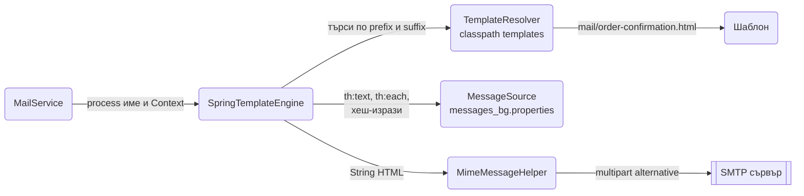
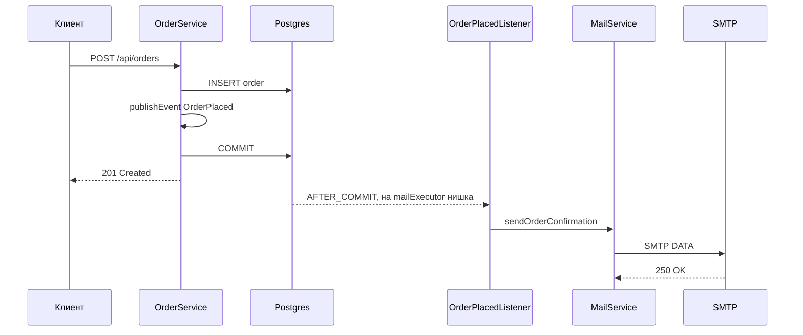

# Имейли и HTML шаблони

Почти всеки сървис в някакъв момент праща имейл: потвърждение на поръчка, забравена парола, фактура с PDF. Spring Boot покрива това с `spring-boot-starter-mail` за SMTP и Thymeleaf за HTML тялото, а същият Thymeleaf рендерира и server-side страници, когато нямаш отделен SPA. Този документ показва настройката с локален SMTP за разработка, `JavaMailSender` с HTML, прикачени файлове и inline изображения, шаблони с layout и i18n, асинхронно и надеждно изпращане през събития и outbox таблица, и как се тества всичко това без истински пощенски сървър. В края е Thymeleaf за web страници с форми и валидация.

| Какво | Кога | Инструмент |
|---|---|---|
| Изпращане през SMTP | Всеки транзакционен имейл | `JavaMailSender`, `MimeMessageHelper` |
| HTML тяло от шаблон | Имейл с данни от домейна | Thymeleaf `SpringTemplateEngine`, `Context` |
| Локална поща за dev | Да видиш имейла без да го пращаш | Mailpit в docker compose |
| Изпращане без да бавиш заявката | Всичко, което не е критично за отговора | `@Async` + `@TransactionalEventListener` |
| Гаранция, че имейлът няма да се загуби | Поръчки, фактури, правни известия | Outbox таблица + scheduler + retry |
| Многоезични имейли | Клиенти в различни страни | `MessageSource`, `#{...}`, locale на получателя |
| Server-rendered страници | Admin панел, прости форми, без SPA | `@Controller`, `Model`, `th:object` |

## 1. Зависимости и настройка

```xml
<dependency>
    <groupId>org.springframework.boot</groupId>
    <artifactId>spring-boot-starter-mail</artifactId>
</dependency>
<dependency>
    <groupId>org.springframework.boot</groupId>
    <artifactId>spring-boot-starter-thymeleaf</artifactId>
</dependency>
<!-- тестове с вграден SMTP сървър -->
<dependency>
    <groupId>com.icegreen</groupId>
    <artifactId>greenmail-junit5</artifactId>
    <version>2.1.3</version> <!-- виж последната версия в Maven Central -->
    <scope>test</scope>
</dependency>
```

```yaml
spring:
  mail:
    host: ${MAIL_HOST:localhost}
    port: ${MAIL_PORT:1025}
    username: ${MAIL_USERNAME:}
    password: ${MAIL_PASSWORD:}
    properties:
      mail:
        smtp:
          auth: ${MAIL_AUTH:false}
          starttls:
            enable: ${MAIL_STARTTLS:false}
          connectiontimeout: 5000
          timeout: 10000
          writetimeout: 10000
  thymeleaf:
    cache: true

app:
  mail:
    from: "Orders <orders@example.com>"
    reply-to: support@example.com
    base-url: https://shop.example.com
```

Паролата винаги идва от environment, никога от файл в git; как се подават тайни по профили е в [Конфигурация и профили](Configuration_Profiles.md). Timeout-ите са важни: без тях бавен SMTP сървър държи нишката минути и задръства executor-а.

### Mailpit за локална разработка

Mailpit приема всичко на порт 1025 и го показва в web UI на 8025, без да изпраща нищо навън. MailHog върши същото, но не се поддържа активно.

```yaml
services:
  mailpit:
    image: axllent/mailpit:latest
    ports:
      - "1025:1025"
      - "8025:8025"
    environment:
      MP_MAX_MESSAGES: 500
```

С `dev` профила `spring.mail.host=localhost`, `port=1025`, `auth=false` и всеки имейл се появява на `http://localhost:8025`, с HTML preview, plain text вариант и прикачените файлове.

### Доставчици в production

| Доставчик | През SMTP | През SDK |
|---|---|---|
| Amazon SES | `email-smtp.<region>.amazonaws.com:587`, SMTP credentials от IAM | `software.amazon.awssdk:ses`, нужен за bounce обработка |
| SendGrid | `smtp.sendgrid.net:587`, username `apikey` | `com.sendgrid:sendgrid-java`, шаблони при тях |
| Postmark | `smtp.postmarkapp.com:587`, token като username и password | REST API с `RestClient`, най-добра доставимост за транзакционни |

Започни със SMTP, защото кодът остава един и същ и само конфигурацията се сменя между dev и production. SDK има смисъл, когато ти трябват статистики, webhooks за bounce или шаблони на страната на доставчика.

## 2. Минимален работещ пример

Service, който рендерира Thymeleaf шаблон и го праща като HTML с plain text алтернатива.

```java
package com.example.orders.mail;

import jakarta.mail.MessagingException;
import jakarta.mail.internet.MimeMessage;
import org.springframework.mail.javamail.JavaMailSender;
import org.springframework.mail.javamail.MimeMessageHelper;
import org.springframework.stereotype.Service;
import org.thymeleaf.context.Context;
import org.thymeleaf.spring6.SpringTemplateEngine;

@Service
public class SmtpMailService implements MailService {

    private final JavaMailSender sender;
    private final SpringTemplateEngine templates;
    private final MailProperties props;

    public SmtpMailService(JavaMailSender sender, SpringTemplateEngine templates, MailProperties props) {
        this.sender = sender;
        this.templates = templates;
        this.props = props;
    }

    @Override
    public void sendOrderConfirmation(OrderSummary order) {
        var ctx = new Context(order.locale());
        ctx.setVariable("order", order);
        ctx.setVariable("baseUrl", props.baseUrl());

        var html = templates.process("mail/order-confirmation", ctx);
        var text = templates.process("text/order-confirmation", ctx);
        var subject = templates.process("text/order-confirmation-subject", ctx).strip();

        send(new EmailMessage(order.customerEmail(), subject, text, html, List.of()));
    }

    @Override
    public void send(EmailMessage message) {
        try {
            MimeMessage mime = sender.createMimeMessage();
            var helper = new MimeMessageHelper(mime, true, "UTF-8");
            helper.setFrom(props.from());
            helper.setReplyTo(props.replyTo());
            helper.setTo(message.to());
            helper.setSubject(message.subject());
            helper.setText(message.text(), message.html());
            for (var att : message.attachments()) {
                helper.addAttachment(att.fileName(), att.resource(), att.contentType());
            }
            sender.send(mime);
        } catch (MessagingException e) {
            throw new MailSendFailedException(message.to(), e);
        }
    }
}
```

```java
package com.example.orders.mail;

import org.springframework.core.io.Resource;

public interface MailService {
    void sendOrderConfirmation(OrderSummary order);
    void send(EmailMessage message);
}

public record EmailMessage(String to, String subject, String text, String html,
                           List<Attachment> attachments) {
    public record Attachment(String fileName, Resource resource, String contentType) {}
}

public record OrderSummary(Long id, String customerEmail, String customerName,
                           java.util.Locale locale, java.time.Instant createdAt,
                           java.math.BigDecimal total, List<Line> lines) {
    public record Line(String product, int quantity, java.math.BigDecimal price) {}
}
```

```java
@ConfigurationProperties(prefix = "app.mail")
public record MailProperties(String from, String replyTo, String baseUrl) {}
```

`MimeMessageHelper(mime, true, "UTF-8")` с `true` включва multipart режим, нужен за прикачени файлове и inline изображения. `setText(text, html)` създава `multipart/alternative` част, в която пощенският клиент сам избира HTML или plain text. Plain text вариантът не е формалност: spam филтрите наказват имейли само с HTML, а някои клиенти показват само текста.

Service слоят подава `OrderSummary`, не JPA entity: шаблонът се рендерира извън транзакцията, а lazy асоциации там биха хвърлили `LazyInitializationException`. Преобразуването е описано в [DTO и mapping](DTO_Mapping.md).

## 3. Thymeleaf шаблони за имейл

### Как се рендерира



Boot автоконфигурира `SpringTemplateEngine` с resolver за `classpath:/templates/` и suffix `.html`, и го свързва с `MessageSource`, така че `#{...}` изразите работят и в имейли. За plain text шаблоните добавяш втори resolver в режим `TEXT`:

```java
@Configuration
public class MailTemplateConfig {

    @Bean
    ITemplateResolver textTemplateResolver() {
        var resolver = new ClassLoaderTemplateResolver();
        resolver.setPrefix("templates/");
        resolver.setSuffix(".txt");
        resolver.setTemplateMode(TemplateMode.TEXT);
        resolver.setCharacterEncoding("UTF-8");
        resolver.setResolvablePatterns(Set.of("text/*"));
        resolver.setOrder(1);
        resolver.setCheckExistence(true);
        return resolver;
    }
}
```

Boot събира всички `ITemplateResolver` bean-ове в engine-а. `text/*` шаблоните отиват в `templates/text/`, HTML в `templates/mail/`.

### Шаблон за потвърждение

```html
<!-- src/main/resources/templates/mail/order-confirmation.html -->
<!DOCTYPE html>
<html xmlns:th="http://www.thymeleaf.org" th:lang="${#locale.language}">
<head>
  <meta charset="UTF-8">
  <title th:text="#{mail.order.subject(${order.id})}">Поръчка</title>
</head>
<body style="margin:0;padding:0;background:#f4f4f4;font-family:Arial,sans-serif;">
<table role="presentation" width="100%" cellpadding="0" cellspacing="0">
  <tr><td align="center" style="padding:24px;">
    <table role="presentation" width="600" cellpadding="0" cellspacing="0" style="background:#ffffff;">
      <tr><td th:replace="~{mail/layout :: header}"></td></tr>
      <tr><td style="padding:24px;">
        <h1 style="font-size:20px;margin:0 0 16px;"
            th:text="#{mail.order.title(${order.customerName})}">Здравей</h1>
        <p th:text="#{mail.order.intro(${order.id})}">Получихме поръчката ти.</p>

        <table width="100%" cellpadding="8" cellspacing="0" style="border-collapse:collapse;">
          <tr style="background:#eeeeee;">
            <th align="left" th:text="#{mail.order.product}">Продукт</th>
            <th align="right" th:text="#{mail.order.qty}">Бр.</th>
            <th align="right" th:text="#{mail.order.price}">Цена</th>
          </tr>
          <tr th:each="line : ${order.lines}">
            <td th:text="${line.product}">Продукт</td>
            <td align="right" th:text="${line.quantity}">1</td>
            <td align="right" th:text="${#numbers.formatDecimal(line.price, 1, 'COMMA', 2, 'POINT')} + ' лв.'">0.00</td>
          </tr>
          <tr>
            <td colspan="2" align="right"><strong th:text="#{mail.order.total}">Общо</strong></td>
            <td align="right"><strong th:text="${#numbers.formatDecimal(order.total, 1, 2)} + ' лв.'">0.00</strong></td>
          </tr>
        </table>

        <p th:if="${order.total.compareTo(new java.math.BigDecimal('100')) >= 0}"
           th:text="#{mail.order.freeShipping}">Безплатна доставка.</p>

        <p style="color:#666;font-size:12px;"
           th:text="#{mail.order.placedAt(${#temporals.format(order.createdAt, 'dd.MM.yyyy HH:mm', #locale)})}">
          Дата
        </p>
        <p><a th:href="${baseUrl + '/orders/' + order.id}" style="color:#0a66c2;">Виж поръчката</a></p>
      </td></tr>
      <tr><td th:replace="~{mail/layout :: footer}"></td></tr>
    </table>
  </td></tr>
</table>
</body>
</html>
```

```html
<!-- src/main/resources/templates/mail/layout.html -->
<html xmlns:th="http://www.thymeleaf.org">
<td th:fragment="header" style="padding:16px 24px;background:#111;color:#fff;font-size:18px;">
  
</td>
<td th:fragment="footer" style="padding:16px 24px;color:#888;font-size:11px;">
  <span th:text="#{mail.footer.company}">Example Ltd.</span><br>
  <a th:href="${baseUrl + '/account/notifications'}" th:text="#{mail.footer.unsubscribe}">Откажи известията</a>
</td>
</html>
```

Правила за имейл HTML, които не са като за web: само inline стилове (Gmail маха `<style>` блокове в много случаи), таблици за layout, ширина 600px, без JavaScript, без външни CSS файлове, изображенията с абсолютен URL или `cid:`. Тествай в поне три клиента преди да пуснеш нов шаблон.

`#temporals` е част от Thymeleaf 3.1, който Boot 3.5 ползва, и работи с `java.time` типове. `#numbers.formatDecimal(number, minIntegerDigits, decimalDigits)` форматира според locale-а на `Context`; с петте аргумента задаваш разделителите изрично.

### Plain text и subject

```text
<!-- src/main/resources/templates/text/order-confirmation.txt -->
[(#{mail.order.title(${order.customerName})})]

[(#{mail.order.intro(${order.id})})]

[# th:each="line : ${order.lines}"]- [(${line.product})] x [(${line.quantity})]: [(${#numbers.formatDecimal(line.price, 1, 2)})] лв.
[/]
[(#{mail.order.total})]: [(${#numbers.formatDecimal(order.total, 1, 2)})] лв.

[(${baseUrl})]/orders/[(${order.id})]
```

```text
<!-- src/main/resources/templates/text/order-confirmation-subject.txt -->
[(#{mail.order.subject(${order.id})})]
```

Да държиш subject-а в шаблон до тялото, вместо в Java код, означава, че преводачът вижда двете заедно и че промяната на текст не е деплой на код.

### i18n

```properties
# src/main/resources/messages_bg.properties
mail.order.subject=Поръчка {0} е приета
mail.order.title=Здравей, {0}
mail.order.intro=Получихме поръчка номер {0} и я обработваме.
mail.order.product=Продукт
mail.order.qty=Бр.
mail.order.price=Цена
mail.order.total=Общо
mail.order.freeShipping=Доставката е безплатна.
mail.order.placedAt=Направена на {0}
mail.footer.company=Example Ltd., София
mail.footer.unsubscribe=Откажи известията
```

Locale-ът на имейла е този на получателя, не на текущата заявка: admin с български интерфейс, който преиздава фактура на немски клиент, праща имейла на немски. Затова `OrderSummary` носи `locale`, записан в профила на потребителя, и той се подава в `new Context(locale)`.

### Inline изображения и прикачени файлове

```java
var helper = new MimeMessageHelper(mime, true, "UTF-8");
helper.setTo(to);
helper.setSubject(subject);
helper.setText(text, html);
// addInline задължително след setText, иначе частта се губи
helper.addInline("logo", new ClassPathResource("mail/logo.png"), "image/png");
helper.addAttachment("invoice-" + order.id() + ".pdf",
    new ByteArrayResource(pdfBytes), "application/pdf");
```

`cid:logo` в HTML съответства на името, подадено на `addInline`. За прикачени файлове от диск `FileSystemResource`, за генерирани в паметта `ByteArrayResource`. PDF фактура се прави с OpenPDF (`com.github.librepdf:openpdf`, LGPL) или iText (AGPL или комерсиален лиценз); генерирането е отделен service, който връща `byte[]`. Повечето SMTP доставчици ограничават писмото до 10 MB; за по-големи файлове прати линк за изтегляне, виж [Файлове](Files.md).

## 4. Асинхронно и надеждно изпращане

### Защо не в заявката

Изпращането по SMTP отнема от 200 ms до няколко секунди и може да се провали. Ако е в HTTP заявката за създаване на поръчка, потребителят чака, а при грешка на пощата или поръчката се отменя, или имейлът се губи тихо. Правилният ред е: commit на поръчката, после имейл, на друга нишка.



### Събитие след commit и async listener

```java
public record OrderPlaced(Long orderId) {}
```

```java
@Service
public class OrderService {

    private final OrderRepository orders;
    private final ApplicationEventPublisher events;

    public OrderService(OrderRepository orders, ApplicationEventPublisher events) {
        this.orders = orders;
        this.events = events;
    }

    @Transactional
    public Order place(CreateOrderRequest req, String customerEmail) {
        var order = orders.save(new Order(customerEmail, req.lines()));
        events.publishEvent(new OrderPlaced(order.getId()));
        return order;
    }
}
```

```java
@Component
public class OrderMailListener {

    private final OrderRepository orders;
    private final MailService mail;

    public OrderMailListener(OrderRepository orders, MailService mail) {
        this.orders = orders;
        this.mail = mail;
    }

    @Async("mailExecutor")
    @TransactionalEventListener(phase = TransactionPhase.AFTER_COMMIT)
    public void on(OrderPlaced event) {
        var summary = orders.findSummaryById(event.orderId()).orElseThrow();
        mail.sendOrderConfirmation(summary);
    }
}
```

```java
@Configuration
@EnableAsync
public class AsyncConfig {

    @Bean(name = "mailExecutor")
    ThreadPoolTaskExecutor mailExecutor() {
        var executor = new ThreadPoolTaskExecutor();
        executor.setThreadNamePrefix("mail-");
        executor.setCorePoolSize(2);
        executor.setMaxPoolSize(4);
        executor.setQueueCapacity(500);
        executor.setRejectedExecutionHandler(new ThreadPoolExecutor.CallerRunsPolicy());
        return executor;
    }
}
```

`AFTER_COMMIT` гарантира, че listener-ът вижда записаната поръчка и че при rollback имейл не се праща. `@Async` го сваля от нишката на заявката. Отделен executor е важен: ако пощата забави, не искаш да блокира другите async задачи. Повече за executor-ите в [Cron, @Async и опашки](Scheduling_Queues.md), за събитията в [Events](Events.md).

Слабото място: ако приложението бъде спряно между commit-а и изпращането, или SMTP е недостъпен за по-дълго от retry-а, имейлът се губи. За известия това е приемливо; за фактури и правни съобщения не е.

### Outbox таблица за гарантирано изпращане

Имейлът се записва като ред в същата транзакция като поръчката, а отделен scheduler го изпраща и маркира. Приложението може да падне във всеки момент и нищо не се губи.

```sql
create table email_outbox (
    id              bigserial primary key,
    event_id        uuid        not null unique,
    recipient       varchar(320) not null,
    template        varchar(100) not null,
    payload         jsonb       not null,
    locale          varchar(10) not null,
    status          varchar(20) not null default 'PENDING',
    attempts        int         not null default 0,
    next_attempt_at timestamptz not null default now(),
    last_error      text,
    created_at      timestamptz not null default now(),
    sent_at         timestamptz
);
create index on email_outbox (status, next_attempt_at);
```

```java
@Component
public class OrderMailOutboxWriter {

    private final EmailOutboxRepository outbox;
    private final OrderRepository orders;
    private final ObjectMapper json;

    public OrderMailOutboxWriter(EmailOutboxRepository outbox, OrderRepository orders, ObjectMapper json) {
        this.outbox = outbox;
        this.orders = orders;
        this.json = json;
    }

    // BEFORE_COMMIT: редът влиза в същата транзакция като поръчката
    @TransactionalEventListener(phase = TransactionPhase.BEFORE_COMMIT)
    public void on(OrderPlaced event) throws JsonProcessingException {
        var summary = orders.findSummaryById(event.orderId()).orElseThrow();
        outbox.save(EmailOutbox.pending(
            UUID.nameUUIDFromBytes(("order-placed-" + event.orderId()).getBytes()),
            summary.customerEmail(), "order-confirmation",
            json.writeValueAsString(summary), summary.locale().toLanguageTag()));
    }
}
```

```java
@Component
public class EmailOutboxSender {

    private static final Logger log = LoggerFactory.getLogger(EmailOutboxSender.class);
    private static final int MAX_ATTEMPTS = 6;

    private final EmailOutboxRepository outbox;
    private final MailService mail;
    private final TransactionTemplate tx;

    public EmailOutboxSender(EmailOutboxRepository outbox, MailService mail, TransactionTemplate tx) {
        this.outbox = outbox;
        this.mail = mail;
        this.tx = tx;
    }

    @Scheduled(fixedDelayString = "PT5S")
    @SchedulerLock(name = "emailOutbox", lockAtMostFor = "PT4M")
    public void drain() {
        List<Long> ids = tx.execute(s -> outbox.lockBatchForSending(50));
        for (Long id : ids) {
            tx.executeWithoutResult(s -> sendOne(id));
        }
    }

    private void sendOne(Long id) {
        var row = outbox.findById(id).orElseThrow();
        try {
            mail.send(row.toEmailMessage());
            row.markSent();
        } catch (MailException | MailSendFailedException e) {
            row.markFailed(e.getMessage(), backoff(row.getAttempts()), MAX_ATTEMPTS);
            log.warn("email {} to {} failed attempt {}: {}", row.getId(),
                mask(row.getRecipient()), row.getAttempts(), e.getMessage());
        }
    }

    private Duration backoff(int attempts) {
        return Duration.ofSeconds((long) Math.min(3600, 10 * Math.pow(3, attempts)));
    }
}
```

```java
public interface EmailOutboxRepository extends JpaRepository<EmailOutbox, Long> {

    @Query(value = """
        update email_outbox set status = 'SENDING'
        where id in (
            select id from email_outbox
            where status = 'PENDING' and next_attempt_at <= now()
            order by created_at
            for update skip locked
            limit :batch)
        returning id
        """, nativeQuery = true)
    List<Long> lockBatchForSending(int batch);
}
```

`for update skip locked` позволява няколко инстанции да източват опашката без да си пречат, а `SchedulerLock` от ShedLock е допълнителна застраховка; и двете са описани в [Cron, @Async и опашки](Scheduling_Queues.md). `event_id` с `unique` е идемпотентността: ако същото събитие се публикува два пъти, вторият insert се проваля и имейлът излиза веднъж. След `MAX_ATTEMPTS` редът става `FAILED` и влиза в alert; така никой не се чуди защо клиентът не е получил фактура. При голям обем същият модел се пренася върху брокер, виж [Message brokers](Message_Brokers.md).

### Retry за по-простия случай

Когато нямаш outbox, Spring Retry дава повторни опити директно върху `send`:

```xml
<dependency>
    <groupId>org.springframework.retry</groupId>
    <artifactId>spring-retry</artifactId>
</dependency>
<dependency>
    <groupId>org.springframework</groupId>
    <artifactId>spring-aspects</artifactId>
</dependency>
```

```java
@Retryable(retryFor = MailException.class, maxAttempts = 3,
           backoff = @Backoff(delay = 2000, multiplier = 3))
@Override
public void send(EmailMessage message) { ... }

@Recover
public void recover(MailException e, EmailMessage message) {
    log.error("giving up on email to {}: {}", mask(message.to()), e.getMessage());
}
```

С `@EnableRetry` на конфигурация. Retry помага при кратки прекъсвания, не при паднало приложение; изборът между двата подхода е по цената на загубен имейл.

### Логване и PII

Логвай получател с маска (`i***@example.com`), шаблон, event id и грешката. Никога не логвай тялото: то съдържа име, адрес, суми. При debug в dev гледай Mailpit, не логовете. Как се структурира логът е в [Logging](Logging.md).

### Unsubscribe и правен footer

Транзакционните имейли (потвърждение, парола) не изискват unsubscribe, но маркетинговите да. Всеки шаблон минава през общия footer с име на фирмата, адрес и линк за отказ, а за bulk имейли се добавя и header `List-Unsubscribe` през `mime.addHeader("List-Unsubscribe", "<" + url + ">")`, който Gmail показва като бутон.

## 5. Thymeleaf за web страници

Същият engine рендерира HTML страници, когато controller-ът връща име на view вместо JSON. Подходящо за admin панели и прости приложения без SPA.

```yaml
spring:
  thymeleaf:
    cache: false   # само в dev профила, за hot reload на шаблоните
  web:
    resources:
      cache:
        period: 1h
```

### Controller, Model и форма

```java
package com.example.orders.web;

import jakarta.validation.Valid;
import org.springframework.stereotype.Controller;
import org.springframework.ui.Model;
import org.springframework.validation.BindingResult;
import org.springframework.web.bind.annotation.*;
import org.springframework.web.servlet.mvc.support.RedirectAttributes;

@Controller
@RequestMapping("/admin/products")
public class ProductAdminController {

    private final ProductService products;

    public ProductAdminController(ProductService products) {
        this.products = products;
    }

    @GetMapping
    public String list(Model model) {
        model.addAttribute("products", products.findAll());
        return "admin/products/list";
    }

    @GetMapping("/new")
    public String createForm(Model model) {
        model.addAttribute("form", new ProductForm("", null, true));
        return "admin/products/form";
    }

    @PostMapping
    public String create(@Valid @ModelAttribute("form") ProductForm form,
                         BindingResult binding, RedirectAttributes redirect) {
        if (binding.hasErrors()) {
            return "admin/products/form";
        }
        var created = products.create(form.name(), form.price(), form.active());
        redirect.addFlashAttribute("message", "Продуктът " + created.name() + " е създаден");
        return "redirect:/admin/products";
    }
}

public record ProductForm(
    @NotBlank @Size(max = 120) String name,
    @NotNull @DecimalMin("0.01") BigDecimal price,
    boolean active) {}
```

Redirect след успешен POST (Post-Redirect-Get) предотвратява повторно изпращане при refresh. `BindingResult` трябва да е непосредствено след `@ModelAttribute` параметъра, иначе Spring хвърля изключението вместо да го даде на теб; правилата за валидация са в [Валидации](Validation.md).

```html
<!-- src/main/resources/templates/admin/products/form.html -->
<!DOCTYPE html>
<html xmlns:th="http://www.thymeleaf.org" th:replace="~{layout :: page(~{::title}, ~{::main})}">
<head><title>Нов продукт</title></head>
<body>
<main>
  <form th:action="@{/admin/products}" th:object="${form}" method="post">
    <label for="name">Име</label>
    <input id="name" type="text" th:field="*{name}"
           th:classappend="${#fields.hasErrors('name')} ? 'is-invalid'">
    <p class="error" th:if="${#fields.hasErrors('name')}" th:errors="*{name}">Грешка</p>

    <label for="price">Цена</label>
    <input id="price" type="number" step="0.01" th:field="*{price}">
    <p class="error" th:if="${#fields.hasErrors('price')}" th:errors="*{price}">Грешка</p>

    <label><input type="checkbox" th:field="*{active}"> Активен</label>

    <button type="submit">Запази</button>
  </form>
</main>
</body>
</html>
```

```html
<!-- src/main/resources/templates/layout.html -->
<!DOCTYPE html>
<html xmlns:th="http://www.thymeleaf.org" th:fragment="page(title, content)">
<head>
  <meta charset="UTF-8">
  <title th:replace="${title}">Shop admin</title>
  <link rel="stylesheet" th:href="@{/css/admin.css}">
</head>
<body>
<header th:insert="~{fragments/nav :: nav}"></header>
<div class="flash" th:if="${message}" th:text="${message}"></div>
<div th:replace="${content}"></div>
</body>
</html>
```

`th:replace` заменя целия елемент с фрагмента, `th:insert` го вмъква вътре в елемента. `th:field` генерира `id`, `name` и `value` от полето на `th:object` и попълва стойността обратно при грешка. Когато Spring Security е в classpath, Thymeleaf автоматично добавя скрито `_csrf` поле във всяка форма с `th:action`, така че CSRF защитата от [Sessions и cookies](Sessions.md) работи без допълнителен код. Статичните файлове под `src/main/resources/static/` се сервират от `/`, а `@{/css/admin.css}` добавя context path, ако има такъв.

При record като form обект `th:field` работи през конструктора при binding, но за `th:object` в `GET` е нужен попълнен обект; затова `createForm` подава празен `ProductForm`. Ако form-ът става сложен, class с setters е по-гъвкав от record.

## 6. Тестване

### Unit test на шаблона

Рендерирането на шаблон е чиста функция от данни към string и се тества без Spring контекст, с ръчно сглобен engine, или с `@SpringBootTest` само за `SpringTemplateEngine`.

```java
class OrderConfirmationTemplateTest {

    private final SpringTemplateEngine engine = new SpringTemplateEngine();

    OrderConfirmationTemplateTest() {
        var resolver = new ClassLoaderTemplateResolver();
        resolver.setPrefix("templates/");
        resolver.setSuffix(".html");
        resolver.setTemplateMode(TemplateMode.HTML);
        engine.setTemplateResolver(resolver);
        var messages = new ResourceBundleMessageSource();
        messages.setBasename("messages");
        messages.setDefaultEncoding("UTF-8");
        engine.setTemplateEngineMessageSource(messages);
    }

    @Test
    void rendersLinesAndTotalInBulgarian() {
        var order = new OrderSummary(42L, "ivan@example.com", "Иван", Locale.of("bg"),
            Instant.parse("2026-03-01T10:15:00Z"), new BigDecimal("120.00"),
            List.of(new OrderSummary.Line("Клавиатура", 1, new BigDecimal("120.00"))));
        var ctx = new Context(order.locale());
        ctx.setVariable("order", order);
        ctx.setVariable("baseUrl", "https://shop.test");

        String html = engine.process("mail/order-confirmation", ctx);

        assertThat(html)
            .contains("Здравей, Иван")
            .contains("Клавиатура")
            .contains("Доставката е безплатна")
            .contains("https://shop.test/orders/42")
            .doesNotContain("th:");
    }
}
```

`doesNotContain("th:")` хваща забравен невалиден атрибут, който Thymeleaf би оставил в изхода. Такъв тест за всеки шаблон е евтин и спира повечето регресии при промяна на `OrderSummary`.

### Интеграционен тест с GreenMail

GreenMail вдига SMTP в JVM-а на теста; с Testcontainers може и Mailpit (`axllent/mailpit`, порт 1025 и REST API на 8025), но GreenMail е по-бърз и има Java API за проверка.

```java
@SpringBootTest
class SmtpMailServiceIT {

    @RegisterExtension
    static GreenMailExtension greenMail = new GreenMailExtension(ServerSetupTest.SMTP)
        .withConfiguration(GreenMailConfiguration.aConfig().withUser("test", "test"))
        .withPerMethodLifecycle(false);

    @DynamicPropertySource
    static void mail(DynamicPropertyRegistry registry) {
        registry.add("spring.mail.host", () -> "localhost");
        registry.add("spring.mail.port", () -> ServerSetupTest.SMTP.getPort());
        registry.add("spring.mail.username", () -> "test");
        registry.add("spring.mail.password", () -> "test");
        registry.add("spring.mail.properties.mail.smtp.auth", () -> "true");
    }

    @Autowired MailService mail;

    @Test
    void sendsHtmlWithPlainTextAlternative() throws Exception {
        mail.sendOrderConfirmation(sampleOrder());

        var messages = greenMail.getReceivedMessages();
        assertThat(messages).hasSize(1);
        var msg = messages[0];
        assertThat(msg.getSubject()).isEqualTo("Поръчка 42 е приета");
        assertThat(msg.getAllRecipients()[0].toString()).isEqualTo("ivan@example.com");
        assertThat(GreenMailUtil.getBody(msg)).contains("Клавиатура");
        assertThat(msg.getContentType()).startsWith("multipart/");
    }
}
```

За async пътя (`OrderPlaced` -> listener -> SMTP) тестът публикува събитието в транзакция и чака с Awaitility: `await().atMost(Duration.ofSeconds(5)).untilAsserted(() -> assertThat(greenMail.getReceivedMessages()).hasSize(1))`. За outbox тестът е по-прост: проверяваш реда в `email_outbox` след commit, после извикваш `drain()` ръчно и проверяваш `status = 'SENT'`. Общата организация е в [Testing](Testing.md).

## 7. Капани

- Имейл, пратен вътре в `@Transactional` метод преди commit: при rollback клиентът получава потвърждение за несъществуваща поръчка. `AFTER_COMMIT` listener или outbox.
- `@TransactionalEventListener` без `@Async`: изпълнява се след commit, но все още на нишката на заявката, и SMTP забавянето стига до потребителя.
- `@Async` на метод в същия клас, който го извиква: proxy-то е заобиколено и методът е синхронен. Listener-ът е отделен bean.
- Entity подадено на шаблона: `LazyInitializationException` при `order.lines` на async нишка без транзакция. Шаблонът получава DTO с всичко вече заредено.
- `addInline` преди `setText`: inline частта се губи, защото `setText` пренарежда multipart структурата. Редът е `setText`, после `addInline`.
- Без timeout на SMTP: висящ сървър държи нишка от `mailExecutor` неограничено и опашката се пълни. `connectiontimeout`, `timeout`, `writetimeout` винаги.
- Locale от `LocaleContextHolder` в async нишка: той е празен или е този на admin потребителя. Locale-ът на получателя е част от данните на имейла.
- Външни CSS и `<style>` блок в имейл: Gmail и Outlook ги режат. Inline стилове, таблици, 600px.
- `spring.thymeleaf.cache=false` в production: всеки render чете шаблона от диска. Само в dev профила.
- Логване на цялото тяло "за да дебъгнем": лични данни в логовете, които после отиват в централна система. Mailpit в dev, маскиран получател в логовете.
- Повторно изпращане при retry на цялата заявка: клиентът получава два имейла. Идемпотентен ключ по event id в outbox или в `sent_emails` таблица.
- Шаблон за имейл, който никога не е тестван: промяна на поле в `OrderSummary` чупи рендерирането и грешката се вижда чак в production логовете на listener-а. Unit test на всеки шаблон.

## 8. Чеклист

- [ ] `spring.mail.*` с timeout-и, парола от environment, Mailpit в docker compose за dev.
- [ ] `MailService` интерфейс с методи по бизнес случай и `EmailMessage` record; никой controller не вика `JavaMailSender` директно.
- [ ] Всеки имейл има HTML и plain text вариант, subject в шаблон, общ header и footer фрагмент.
- [ ] Locale на получателя е част от данните и `messages_xx.properties` покрива всички ключове на шаблона.
- [ ] Изпращането е след commit, на отделен `mailExecutor`, с ограничена опашка.
- [ ] За критични имейли: outbox таблица с `event_id unique`, retry с backoff, `FAILED` статус с alert.
- [ ] Логовете съдържат маскиран получател и event id, никога тяло.
- [ ] Прикачени файлове под 10 MB, по-големите като линк.
- [ ] Unit test на всеки шаблон и поне един GreenMail тест за реалния SMTP път.
- [ ] За web страници: `spring.thymeleaf.cache=false` само в dev, форми с `th:object` и показване на грешки, PRG след POST.
- [ ] Footer с фирмени данни и unsubscribe за всичко, което не е транзакционно.

## 9. Свързани документи

- [Events](Events.md): `ApplicationEventPublisher`, `@TransactionalEventListener` и фазите на транзакцията.
- [Cron, @Async и опашки](Scheduling_Queues.md): executor конфигурация, `@Scheduled` и ShedLock за outbox източването.
- [Message brokers: Kafka, Redis, NATS](Message_Brokers.md): outbox към брокер при голям обем имейли.
- [Валидации](Validation.md): Bean Validation на form обекти и показване на грешки.
- [Sessions и cookies](Sessions.md): CSRF token-ът, който Thymeleaf добавя във формите.
- [Файлове](Files.md): генериране и съхранение на PDF фактури, линкове за изтегляне вместо прикачени файлове.
- [Logging](Logging.md): структурирани логове без лични данни.
- [Thymeleaf документация](https://www.thymeleaf.org/documentation.html)
