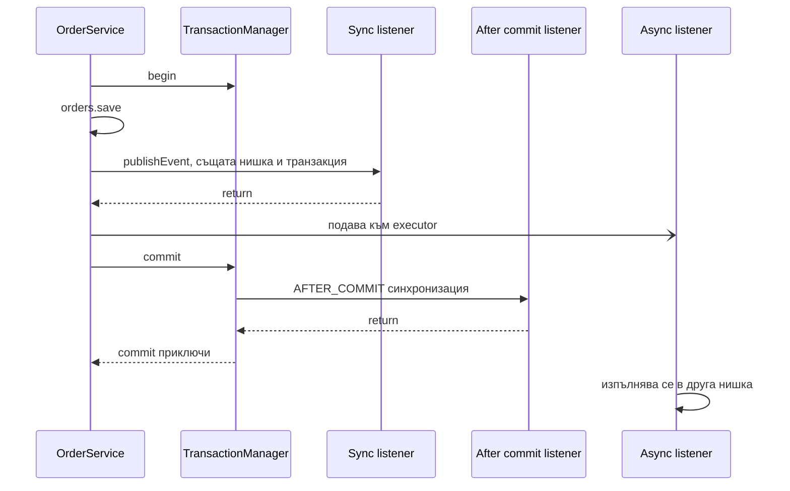
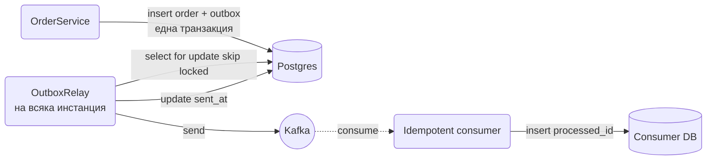

# Events

Spring има вграден event bus: публикуваш обект, а всички методи с `@EventListener` за този тип го получават. Използваш го, за да разкачиш страничните ефекти от основната операция: `OrderService.place()` само записва поръчката и публикува `OrderPlacedEvent`, а имейлът, статистиката и Kafka съобщението живеят в отделни listener-и, които не знаят един за друг. Разликата спрямо `EventEmitter` в Node.js е фундаментална: по подразбиране Spring събитията са синхронни, вървят в същата нишка и в същата транзакция като публикуващия код, и грешка в listener проваля и публикуващия. Този документ показва как се дефинират и публикуват събития, как се закачат listener-и към транзакцията с `@TransactionalEventListener`, кога и как се пускат асинхронно с `@Async`, какво правиш, когато in-process събития не стигат, и как се тестват.

| Какво | Кога | Инструмент |
|---|---|---|
| Разкачане на странични ефекти в един процес | Винаги, когато една операция има 2+ последствия | `ApplicationEventPublisher` + `@EventListener` |
| Ефект само след успешен commit | Имейл, Kafka, външни API | `@TransactionalEventListener(AFTER_COMMIT)` |
| Бавен ефект, без да бави заявката | Имейл, PDF, статистика | `@Async` listener с отделен executor |
| Събития от агрегат | Domain-driven дизайн с Spring Data | `AbstractAggregateRoot` + `@DomainEvents` |
| Гарантирана доставка между модули | Modular monolith | Spring Modulith event publication registry |
| Доставка до друг процес или сървис | Няколко инстанции, други сървиси | Outbox таблица + broker |
| Проверка, че събитие е публикувано | Тестове | `@RecordApplicationEvents` |

## 1. Зависимости и настройка

Основният event механизъм е част от `spring-context`, т.е. идва с всеки starter. Нищо допълнително не трябва.

```xml pom.xml
<dependency>
    <groupId>org.springframework.boot</groupId>
    <artifactId>spring-boot-starter-web</artifactId>
</dependency>
<dependency>
    <groupId>org.springframework.boot</groupId>
    <artifactId>spring-boot-starter-data-jpa</artifactId>
</dependency>

<!-- само за секция 9, Spring Modulith -->
<dependency>
    <groupId>org.springframework.modulith</groupId>
    <artifactId>spring-modulith-events-jpa</artifactId>
    <version>1.4.1</version> <!-- виж последната версия в Maven Central -->
</dependency>
```

Настройки, които ще използваме за асинхронните listener-и:

```yaml src/main/resources/application.yml
spring:
  task:
    execution:
      thread-name-prefix: "app-async-"
      pool:
        core-size: 4
        max-size: 8
        queue-capacity: 200
      shutdown:
        await-termination: true
        await-termination-period: 30s
```

### От EventEmitter към Spring events

Ако идваш от Node.js, таблицата по-долу е най-бързата ориентация:

| Node.js `EventEmitter` | Spring | Коментар |
|---|---|---|
| `emitter.emit("orderPlaced", data)` | `publisher.publishEvent(new OrderPlacedEvent(...))` | Типът на обекта е името на събитието |
| `emitter.on("orderPlaced", fn)` | метод с `@EventListener` в `@Component` | Регистрира се автоматично при старт |
| `emitter.once(...)` | няма пряк еквивалент | Пазиш си флаг или махаш listener-а ръчно |
| `emitter.removeListener(...)` | няма | Listener-ите са статични bean методи |
| `setImmediate(() => fn())` | `@Async` върху listener метода | Иска `@EnableAsync` и executor |
| грешка в listener-а не спира `emit` | грешка в sync listener проваля `publishEvent` | Ключова разлика, виж секция 6 |
| няма транзакции | listener-ът е в транзакцията на публикуващия | Виж секция 4 |

Ключовата разлика: в Node `emit` е просто извикване на функции в текущия tick, без контекст. В Spring `publishEvent` също е просто извикване на методи, но тези методи виждат същата нишка, същия `SecurityContext`, същия MDC и, ако публикуващият е в `@Transactional`, същата отворена транзакция. Това е удобно (listener-ът може да пише в базата в същата транзакция) и опасно (listener-ът може да провали commit-а на нещо, за което не е отговорен).

## 2. Минимален работещ пример

### Събитието е record

Не е нужно да наследяваш `ApplicationEvent`. От Spring 4.2 всеки обект може да е събитие. Record е идеалният избор: immutable, с `equals`, лесен за логване.

```java src/main/java/com/acme/shop/order/OrderPlacedEvent.java
package com.acme.shop.order;

import java.time.Instant;
import java.util.UUID;

public record OrderPlacedEvent(UUID orderId, UUID customerId, long totalCents, Instant at) {
}
```

Събитието описва факт, който вече се е случил (минало време в името), и носи само идентификатори и малко данни. Не слагай в него JPA entity: listener-ите ще го получат в друг контекст (асинхронно, след commit), където lazy полетата ще гърмят с `LazyInitializationException`.

### Публикуване от service

```java src/main/java/com/acme/shop/order/OrderService.java
package com.acme.shop.order;

import org.springframework.context.ApplicationEventPublisher;
import org.springframework.stereotype.Service;
import org.springframework.transaction.annotation.Transactional;

import java.time.Instant;

@Service
public class OrderService {

    private final OrderRepository orders;
    private final ApplicationEventPublisher events;

    public OrderService(OrderRepository orders, ApplicationEventPublisher events) {
        this.orders = orders;
        this.events = events;
    }

    @Transactional
    public Order place(PlaceOrderCommand cmd) {
        Order order = orders.save(Order.create(cmd.customerId(), cmd.lines()));
        events.publishEvent(new OrderPlacedEvent(order.getId(), order.getCustomerId(), order.getTotalCents(), Instant.now()));
        return order;
    }
}
```

`ApplicationEventPublisher` е наличен за инжектиране във всеки контекст. Самият `ApplicationContext` го имплементира, но инжектирай тесния интерфейс, за да е ясно, че service-ът само публикува.

### Listener

```java src/main/java/com/acme/shop/stats/OrderStatsListener.java
package com.acme.shop.stats;

import com.acme.shop.order.OrderPlacedEvent;
import org.springframework.context.event.EventListener;
import org.springframework.stereotype.Component;

@Component
public class OrderStatsListener {

    private final StatsRepository stats;

    public OrderStatsListener(StatsRepository stats) {
        this.stats = stats;
    }

    @EventListener
    public void on(OrderPlacedEvent event) {
        stats.incrementOrders(event.customerId(), event.totalCents());
    }
}
```

Това е всичко. При старт Spring сканира всички bean-ове за методи с `@EventListener`, индексира ги по типа на параметъра и при `publishEvent` извиква тези, чийто параметър е присвоим от типа на събитието. Няма регистрация, няма string имена, няма typo-та в "orderPlaced".

Какво се случва тук при изпълнение: `place()` отваря транзакция, записва поръчката, извиква `publishEvent`, което синхронно извиква `OrderStatsListener.on()` в същата нишка и същата транзакция, `stats.incrementOrders` пише в базата, `on()` връща, `publishEvent` връща, `place()` връща и транзакцията се commit-ва заедно с поръчката и статистиката. Ако `incrementOrders` хвърли, `place()` хвърля и нищо не се записва.

## 3. Listener-и в детайли

### Условия със SpEL

```java src/main/java/com/acme/shop/notification/BigOrderListener.java
@EventListener(condition = "#event.totalCents() >= 100_00")
public void onBigOrder(OrderPlacedEvent event) {
    salesTeam.notifyBigOrder(event.orderId());
}
```

`#event` е първият параметър, `#root.event` също работи. Условието се изчислява преди извикването, така че listener-ът дори не се вика за малки поръчки. Полезно, когато иначе методът би започвал с `if (...) return;`.

### Подредба

```java src/main/java/com/acme/shop/order/OrderFulfillmentListener.java
@Order(1)
@EventListener
public void reserveStock(OrderPlacedEvent event) { ... }

@Order(2)
@EventListener
public void chargeCard(OrderPlacedEvent event) { ... }
```

Без `@Order` редът е редът на регистрация на bean-овете, който не трябва да се разчита. Ако два listener-а наистина зависят един от друг по ред, помисли дали не трябва да са един метод или дали вторият не трябва да слуша събитие, което първият публикува.

### Слушане на родителски тип или интерфейс

```java src/main/java/com/acme/shop/order/
package com.acme.shop.order;

public sealed interface OrderEvent permits OrderPlacedEvent, OrderCancelledEvent, OrderShippedEvent {
    UUID orderId();
}

public record OrderPlacedEvent(UUID orderId, UUID customerId, long totalCents, Instant at) implements OrderEvent {}
public record OrderCancelledEvent(UUID orderId, String reason, Instant at) implements OrderEvent {}

@Component
public class OrderAuditListener {

    @EventListener
    public void audit(OrderEvent event) {
        auditLog.append(event.orderId(), event.getClass().getSimpleName(), event);
    }
}
```

Един listener получава всички събития от йерархията. Същото важи и за `@EventListener public void on(Object any)`, което слуша буквално всичко, включително вътрешните събития на Spring. Използвай го само за дебъг.

Няколко типа без общ родител се изброяват с `@EventListener({OrderPlacedEvent.class, OrderCancelledEvent.class})` върху метод без параметри или с `Object`.

### Връщане на събитие от listener

Ако listener метод върне не-void стойност, Spring я публикува като ново събитие. Колекция или масив се публикуват елемент по елемент.

```java src/main/java/com/acme/shop/loyalty/LoyaltyListener.java
@EventListener
public LoyaltyPointsEarnedEvent onOrderPlaced(OrderPlacedEvent event) {
    int points = (int) (event.totalCents() / 100);
    loyalty.addPoints(event.customerId(), points);
    return new LoyaltyPointsEarnedEvent(event.customerId(), points);
}
```

Удобно за вериги, но не прекалявай: след три нива вече никой не може да проследи кой какво е задействал без дебъгер. Избягвай и generic събития (`EntityCreated<T>`): Spring ги резолва само ако типът фиксира `T` или имплементира `ResolvableTypeProvider`.

## 4. Транзакции и after-commit listener-и

Проблемът с примера от секция 2: ако добавиш listener, който праща имейл "Поръчката е приета", имейлът ще тръгне, преди транзакцията да е commit-ната. Ако commit-ът се провали (constraint, deadlock, timeout), клиентът има имейл за поръчка, която не съществува.

`@TransactionalEventListener` връзва listener-а към фазите на текущата транзакция:

| Фаза | Кога се изпълнява | Типична употреба |
|---|---|---|
| `AFTER_COMMIT` (default) | след успешен commit | имейл, Kafka, HTTP към външна система, WebSocket push |
| `AFTER_ROLLBACK` | след rollback | компенсации, alert |
| `AFTER_COMPLETION` | след commit или rollback | почистване на ресурси, метрики |
| `BEFORE_COMMIT` | преди commit, в същата транзакция | последна валидация, запис на outbox ред |

```java src/main/java/com/acme/shop/notification/OrderConfirmationListener.java
package com.acme.shop.notification;

import com.acme.shop.order.OrderPlacedEvent;
import org.springframework.stereotype.Component;
import org.springframework.transaction.event.TransactionalEventListener;

@Component
public class OrderConfirmationListener {

    private final MailService mail;

    public OrderConfirmationListener(MailService mail) {
        this.mail = mail;
    }

    @TransactionalEventListener
    public void onOrderPlaced(OrderPlacedEvent event) {
        mail.sendOrderConfirmation(event.orderId());
    }
}
```

Механизъм: при `publishEvent` вътре в транзакция Spring не извиква метода веднага, а регистрира `TransactionSynchronization` в текущата транзакция. Когато `TransactionManager` минава през commit, вика синхронизациите в съответната фаза. Listener-ът пак се изпълнява в същата нишка, синхронно, но вече след като данните са трайно записани.

### fallbackExecution

Ако `publishEvent` е извикан без активна транзакция, `@TransactionalEventListener` по подразбиране не се изпълнява изобщо. Това е честа изненада в тестове или в код, който забравя `@Transactional`. С `fallbackExecution = true` listener-ът се вика веднага, както обикновен `@EventListener`:

```java src/main/java/com/acme/shop/notification/OrderConfirmationListener.java
@TransactionalEventListener(fallbackExecution = true)
public void onOrderPlaced(OrderPlacedEvent event) { ... }
```

### Капанът: AFTER_COMMIT не може да пише в базата

Това е най-честият бъг с транзакционни listener-и. В `AFTER_COMMIT` фазата транзакцията е commit-ната, но ресурсите (connection, `EntityManager`) още са закачени за нишката и синхронизацията е в състояние "completed". Ако listener-ът извика `repository.save()`:

- с JPA записът отива в persistence context, но никога не се flush-ва, защото няма следващ commit. Тихо се губи.
- с `@Transactional` (default `REQUIRED`) върху listener-а Spring вижда "има транзакция" и се присъединява към вече приключилата. Пак няма commit.

Решението е `REQUIRES_NEW`, което отваря нова, независима транзакция:

```java src/main/java/com/acme/shop/order/DeliveryListener.java
import org.springframework.transaction.annotation.Propagation;
import org.springframework.transaction.annotation.Transactional;

@TransactionalEventListener
@Transactional(propagation = Propagation.REQUIRES_NEW)
public void recordDelivery(OrderPlacedEvent event) {
    deliveries.save(new DeliveryRecord(event.orderId()));
}
```

Ако listener-ът трябва да пише данни, които логически са част от същата операция, не го прави в `AFTER_COMMIT`. Използвай `BEFORE_COMMIT` или обикновен `@EventListener`, така че записът да е атомарен с поръчката. За подробности за propagation виж [Транзакции и locking](Transactions.md).

### Диаграма: кой listener кога



## 5. Асинхронни listener-и

### Включване и executor

```java src/main/java/com/acme/shop/common/config/AsyncConfig.java
package com.acme.shop.common.config;

import org.springframework.context.annotation.Bean;
import org.springframework.context.annotation.Configuration;
import org.springframework.scheduling.annotation.EnableAsync;
import org.springframework.scheduling.concurrent.ThreadPoolTaskExecutor;

import java.util.concurrent.ThreadPoolExecutor;

@Configuration
@EnableAsync
public class AsyncConfig {

    @Bean(name = "mailExecutor")
    public ThreadPoolTaskExecutor mailExecutor() {
        var executor = new ThreadPoolTaskExecutor();
        executor.setThreadNamePrefix("mail-");
        executor.setCorePoolSize(2);
        executor.setMaxPoolSize(4);
        executor.setQueueCapacity(500);
        // при пълна опашка извикващата нишка изпраща сама, вместо да губим имейл
        executor.setRejectedExecutionHandler(new ThreadPoolExecutor.CallerRunsPolicy());
        executor.setWaitForTasksToCompleteOnShutdown(true);
        executor.setAwaitTerminationSeconds(30);
        return executor;
    }
}
```

Ограничи pool-а и опашката. Executor с `Integer.MAX_VALUE` опашка (default на `ThreadPoolTaskExecutor`) при пик ще натрупа стотици хиляди задачи в паметта и ще се срине процесът. Ако нямаш собствен executor bean, Spring Boot създава `applicationTaskExecutor` от `spring.task.execution.*` и `@Async` го ползва по подразбиране. Виж [Cron, @Async и опашки](Scheduling_Queues.md) за `TaskDecorator`, който пренася MDC и `SecurityContext` в новата нишка.

### Async listener

```java src/main/java/com/acme/shop/notification/OrderConfirmationListener.java
package com.acme.shop.notification;

@Component
public class OrderConfirmationListener {

    @Async("mailExecutor")
    @TransactionalEventListener
    public void onOrderPlaced(OrderPlacedEvent event) {
        mail.sendOrderConfirmation(event.orderId());
    }
}
```

Комбинацията `@Async` + `@TransactionalEventListener` е правилният начин да пратиш имейл: след commit, в друга нишка, без да бави HTTP отговора. Spring първо чака commit, после подава задачата към executor-а.

С виртуални нишки (`spring.threads.virtual.enabled=true`) `applicationTaskExecutor` става `SimpleAsyncTaskExecutor` с виртуални нишки и без опашка. Това е ок за IO задачи като имейл, но тогава няма естествен лимит и трябва да го сложиш сам (`setConcurrencyLimit`).

### Грешки в async listener

Изключение в `@Async void` метод не стига до никого: извикващият вече си е тръгнал. По подразбиране Spring го логва на ERROR през `SimpleAsyncUncaughtExceptionHandler`. Сложи си собствен, за да добавиш метрика или alert:

```java src/main/java/com/acme/shop/common/config/AsyncConfig.java
package com.acme.shop.common.config;

import org.springframework.aop.interceptor.AsyncUncaughtExceptionHandler;
import org.springframework.scheduling.annotation.AsyncConfigurer;

@Configuration
@EnableAsync
public class AsyncConfig implements AsyncConfigurer {

    private static final Logger log = LoggerFactory.getLogger(AsyncConfig.class);
    private final MeterRegistry meters;

    public AsyncConfig(MeterRegistry meters) {
        this.meters = meters;
    }

    @Override
    public AsyncUncaughtExceptionHandler getAsyncUncaughtExceptionHandler() {
        return (ex, method, params) -> {
            log.error("Async listener {} failed", method.getName(), ex);
            meters.counter("async.listener.errors", "method", method.getName()).increment();
        };
    }
}
```

Ако методът връща `CompletableFuture`, изключението отива във future-а и handler-ът не се вика. За event listener-и върни `void`.

### Всички listener-и асинхронни наведнъж

Може да дадеш executor на `ApplicationEventMulticaster` и всеки listener става асинхронен:

```java src/main/java/com/acme/shop/common/config/EventConfig.java
@Bean(name = "applicationEventMulticaster")
public ApplicationEventMulticaster applicationEventMulticaster(ThreadPoolTaskExecutor executor) {
    var multicaster = new SimpleApplicationEventMulticaster();
    multicaster.setTaskExecutor(executor);
    return multicaster;
}
```

Не го прави в приложение с база данни. Всички listener-и, включително тези, които разчитат на транзакцията, и вътрешните на Spring, изведнъж тръгват в други нишки. По-добре маркирай изрично с `@Async` само методите, които искаш.

## 6. Грешки и изолация

### Поведение по подразбиране

Синхронен listener, който хвърли изключение, го пропагира обратно през `publishEvent` до публикуващия. Ако той е в `@Transactional`, транзакцията се маркира за rollback. Това е добре, когато listener-ът е част от бизнес операцията (резервиране на стока), и лошо, когато е страничен ефект (статистика, която не трябва да спира поръчка).

За `@TransactionalEventListener` в `AFTER_COMMIT` изключението се логва от `TransactionSynchronizationUtils` и не стига до публикуващия, защото commit-ът вече е минал. Останалите after-commit listener-и продължават.

### Изолиране на listener

Най-простото: хвани изключението в самия listener.

```java src/main/java/com/acme/shop/stats/OrderStatsListener.java
@EventListener
public void on(OrderPlacedEvent event) {
    try {
        stats.incrementOrders(event.customerId(), event.totalCents());
    } catch (DataAccessException ex) {
        log.warn("stats update failed for order {}", event.orderId(), ex);
    }
}
```

Внимавай: ако listener-ът е в транзакцията на публикуващия и грешката е от JPA/JDBC, транзакцията вече може да е маркирана `rollback-only` въпреки catch-а. При commit публикуващият ще получи `UnexpectedRollbackException`. За write операции със страничен характер използвай `REQUIRES_NEW` в отделен `@Transactional` bean (не self-invocation) или ги премести в async listener.

### Централен ErrorHandler

`SimpleApplicationEventMulticaster` приема `ErrorHandler`. Той се прилага само когато има executor или когато е зададен изрично, и глътва изключенията на всички sync listener-и:

```java src/main/java/com/acme/shop/common/config/EventConfig.java
@Bean(name = "applicationEventMulticaster")
public ApplicationEventMulticaster applicationEventMulticaster() {
    var multicaster = new SimpleApplicationEventMulticaster();
    multicaster.setErrorHandler(ex -> log.error("event listener failed", ex));
    return multicaster;
}
```

Това променя семантиката за цялото приложение: вече нито един listener не може да провали публикуващия. Решение на ниво архитектура, не на ниво удобство. Повечето приложения са по-добре с try/catch в конкретните listener-и.

Няколко синхронни listener-а за едно събитие се изпълняват последователно в реда от `@Order`. Ако вторият хвърли, третият не се изпълнява, а първият вече е свършил своята работа: при транзакция всичко се връща назад, без транзакция имаш частично изпълнение.

## 7. Вградени събития на Spring

Полезни за lifecycle hook-ове без да имплементираш `SmartLifecycle`:

| Събитие | Кога | За какво |
|---|---|---|
| `ApplicationReadyEvent` | приложението е готово да приема заявки | загряване на cache, регистрация в service discovery |
| `ContextClosedEvent` | започва shutdown | спиране на consumer-и, флъш на буфери |
| `ContextRefreshedEvent` | контекстът е инициализиран | рядко, предпочитай `ApplicationReadyEvent` |
| `AuthenticationSuccessEvent` | успешен login | last login, audit |
| `AbstractAuthenticationFailureEvent` | неуспешен login | brute force детекция |
| `RequestHandledEvent` | `DispatcherServlet` приключи заявка | custom метрики за заявки |

```java src/main/java/com/acme/shop/common/config/StartupListener.java
package com.acme.shop.common.config;

@Component
public class StartupListener {

    @EventListener(ApplicationReadyEvent.class)
    public void warmUp() {
        productCache.preload();
    }

    @EventListener
    public void onLogin(AuthenticationSuccessEvent event) {
        String username = event.getAuthentication().getName();
        users.touchLastLogin(username);
    }
}
```

`AuthenticationSuccessEvent` се публикува от `AuthenticationEventPublisher`, който Spring Security регистрира по подразбиране в Boot. Ако ползваш custom `AuthenticationManager`, провери, че му подаваш publisher. Виж [Authentication](Authentication.md).

## 8. Пълен пример: поръчка с три последствия

Поръчката трябва да прати имейл, да обнови статистика и да отиде в Kafka. Три различни изисквания, три различни стратегии.

```java src/main/java/com/acme/shop/order/OrderService.java
package com.acme.shop.order;

@Service
public class OrderService {

    private final OrderRepository orders;
    private final ApplicationEventPublisher events;

    public OrderService(OrderRepository orders, ApplicationEventPublisher events) {
        this.orders = orders;
        this.events = events;
    }

    @Transactional
    public Order place(PlaceOrderCommand cmd) {
        Order order = orders.save(Order.create(cmd.customerId(), cmd.lines()));
        events.publishEvent(new OrderPlacedEvent(order.getId(), order.getCustomerId(), order.getTotalCents(), Instant.now()));
        return order;
    }
}
```

### Статистика: синхронно, в същата транзакция

Статистиката е част от данните и искаме да е консистентна с поръчката. Обикновен listener, същата транзакция.

```java src/main/java/com/acme/shop/stats/OrderStatsListener.java
package com.acme.shop.stats;

@Component
public class OrderStatsListener {

    private final JdbcClient jdbc;

    public OrderStatsListener(JdbcClient jdbc) {
        this.jdbc = jdbc;
    }

    @EventListener
    public void on(OrderPlacedEvent event) {
        jdbc.sql("""
                insert into customer_stats (customer_id, orders_count, total_cents)
                values (:customerId, 1, :total)
                on conflict (customer_id) do update
                set orders_count = customer_stats.orders_count + 1,
                    total_cents = customer_stats.total_cents + excluded.total_cents
                """)
            .param("customerId", event.customerId())
            .param("total", event.totalCents())
            .update();
    }
}
```

### Имейл: асинхронно, след commit

```java src/main/java/com/acme/shop/notification/OrderConfirmationListener.java
package com.acme.shop.notification;

@Component
public class OrderConfirmationListener {

    private final OrderRepository orders;
    private final MailService mail;

    public OrderConfirmationListener(OrderRepository orders, MailService mail) {
        this.orders = orders;
        this.mail = mail;
    }

    @Async("mailExecutor")
    @TransactionalEventListener
    public void onOrderPlaced(OrderPlacedEvent event) {
        // нова нишка, няма persistence context, затова четем наново
        Order order = orders.findById(event.orderId()).orElseThrow();
        mail.sendOrderConfirmation(order);
    }
}
```

Шаблонът на имейла и `MailService` са описани в [Имейли и HTML шаблони](Emails_Templates.md). Ако имейлът се провали, listener-ът логва и толкова. Ако имейлът е критичен (например фактура по закон), не разчитай на async listener, а го мини през outbox или job queue с retry.

### Kafka: през outbox, BEFORE_COMMIT

Публикуването в Kafka директно от `AFTER_COMMIT` listener има дупка: процесът може да умре между commit-а и `kafkaTemplate.send`. Решението е outbox: записваш съобщението в таблица в същата транзакция, а отделен relay го изпраща.

```java src/main/java/com/acme/shop/common/events/OrderOutboxListener.java
package com.acme.shop.common.events;

import org.springframework.transaction.event.TransactionPhase;
import org.springframework.transaction.event.TransactionalEventListener;

@Component
public class OrderOutboxListener {

    private final OutboxRepository outbox;
    private final ObjectMapper json;

    public OrderOutboxListener(OutboxRepository outbox, ObjectMapper json) {
        this.outbox = outbox;
        this.json = json;
    }

    @TransactionalEventListener(phase = TransactionPhase.BEFORE_COMMIT)
    public void onOrderPlaced(OrderPlacedEvent event) throws JsonProcessingException {
        outbox.save(OutboxMessage.of(
            "orders",
            event.orderId().toString(),
            "OrderPlaced",
            json.writeValueAsString(event)));
    }
}
```

`BEFORE_COMMIT` гарантира, че outbox редът е в същата транзакция като поръчката: или и двете са записани, или нито едно. Relay-ът е в секция 10.

## 9. Domain events и модули

### AbstractAggregateRoot

Spring Data позволява събитията да се събират в самия агрегат и да се публикуват автоматично при `save()`. Така `OrderService` не знае за събития, а `Order` сам казва какво му се е случило.

```java src/main/java/com/acme/shop/order/Order.java
package com.acme.shop.order;

import jakarta.persistence.Entity;
import jakarta.persistence.Id;
import org.springframework.data.domain.AbstractAggregateRoot;

@Entity
public class Order extends AbstractAggregateRoot<Order> {

    @Id
    private UUID id;
    private UUID customerId;
    private long totalCents;
    private OrderStatus status;

    public static Order create(UUID customerId, List<OrderLine> lines) {
        var order = new Order();
        order.id = UUID.randomUUID();
        order.customerId = customerId;
        order.totalCents = lines.stream().mapToLong(OrderLine::totalCents).sum();
        order.status = OrderStatus.PLACED;
        order.registerEvent(new OrderPlacedEvent(order.id, customerId, order.totalCents, Instant.now()));
        return order;
    }

    public void cancel(String reason) {
        if (status == OrderStatus.SHIPPED) {
            throw new IllegalStateException("shipped order cannot be cancelled");
        }
        status = OrderStatus.CANCELLED;
        registerEvent(new OrderCancelledEvent(id, reason, Instant.now()));
    }
}
```

`AbstractAggregateRoot` държи `@Transient` списък със събития. Методът `registerEvent` ги добавя, а repository-то (през `EventPublishingRepositoryProxyPostProcessor`) ги публикува след `save()`, `saveAll()`, `delete()` и изчиства списъка. Ако не искаш да наследяваш, сложи `@DomainEvents` върху метод, който връща колекция, и `@AfterDomainEventPublication` върху метод, който я чисти.

Важно: събитията се публикуват при `save()`, не при commit. Ако модифицираш managed entity и разчиташ на dirty checking без `save()`, нищо не се публикува. Викай `orders.save(order)` изрично след `order.cancel()`.

### Spring Modulith между модули

В modular monolith модулите `order`, `notification` и `stats` са отделни пакети, които не трябва да се викат директно. Събитията са естественият интерфейс между тях, но обикновеният `@EventListener` няма гаранция: ако имейл модулът падне след commit, събитието е загубено.

Spring Modulith добавя event publication registry: всяко събитие с listener `@ApplicationModuleListener` се записва в таблица `event_publication` в същата транзакция, а след успешно изпълнение на listener-а записът се маркира като завършен. При рестарт незавършените се пускат отново.

```xml pom.xml
<dependency>
    <groupId>org.springframework.modulith</groupId>
    <artifactId>spring-modulith-starter-jpa</artifactId>
    <version>1.4.1</version> <!-- виж последната версия в Maven Central -->
</dependency>
```

```java src/main/java/com/acme/shop/notification/OrderConfirmationListener.java
package com.acme.shop.notification;

import org.springframework.modulith.events.ApplicationModuleListener;

@Component
public class OrderConfirmationListener {

    @ApplicationModuleListener
    public void onOrderPlaced(OrderPlacedEvent event) {
        mail.sendOrderConfirmation(event.orderId());
    }
}
```

`@ApplicationModuleListener` е `@Async` + `@Transactional(REQUIRES_NEW)` + `@TransactionalEventListener` в една анотация, плюс записа в registry-то. Настройки:

```yaml src/main/resources/application.yml
spring:
  modulith:
    events:
      republish-outstanding-events-on-restart: true
      completion-mode: delete
```

Modulith изисква структура на пакетите по модули (всеки подпакет на главния е модул) и проверява зависимостите между тях в тест с `ApplicationModules.of(App.class).verify()`. Ако проектът ти не е организиран така, по-лесно е да направиш собствен outbox, както по-долу.

## 10. Когато in-process събития не стигат

In-process събитията живеят в един JVM процес. Те не стигат, когато:

- имаш няколко инстанции и ефектът трябва да се случи точно веднъж (не на всяка инстанция);
- ефектът трябва да оцелее след рестарт или crash;
- друг сървис трябва да реагира;
- искаш replay на историята.

Тогава отиваш към broker, но не публикуваш директно от service-а. Използваш transactional outbox: таблица, в която записваш съобщението в същата транзакция като бизнес данните, и relay, който чете таблицата и праща към broker-а.

### Outbox таблица

```sql src/main/resources/db/migration/V20250110_1100__create_outbox.sql
create table outbox (
    id            uuid primary key,
    aggregate     text        not null,
    aggregate_id  text        not null,
    type          text        not null,
    payload       jsonb       not null,
    created_at    timestamptz not null default now(),
    sent_at       timestamptz,
    attempts      int         not null default 0
);

create index outbox_unsent_idx on outbox (created_at) where sent_at is null;
```

### Relay с SKIP LOCKED

```java src/main/java/com/acme/shop/common/events/OutboxRelay.java
package com.acme.shop.common.events;

import org.springframework.jdbc.core.simple.JdbcClient;
import org.springframework.kafka.core.KafkaTemplate;
import org.springframework.scheduling.annotation.Scheduled;
import org.springframework.transaction.annotation.Transactional;

@Component
public class OutboxRelay {

    private final JdbcClient jdbc;
    private final KafkaTemplate<String, String> kafka;

    public OutboxRelay(JdbcClient jdbc, KafkaTemplate<String, String> kafka) {
        this.jdbc = jdbc;
        this.kafka = kafka;
    }

    @Scheduled(fixedDelay = 500)
    @Transactional
    public void relay() {
        List<OutboxRow> batch = jdbc.sql("""
                select id, aggregate, aggregate_id, type, payload::text as payload
                from outbox
                where sent_at is null and attempts < 10
                order by created_at
                limit 100
                for update skip locked
                """)
            .query(OutboxRow.class)
            .list();

        for (OutboxRow row : batch) {
            try {
                kafka.send(row.aggregate(), row.aggregateId(), row.payload()).get();
                jdbc.sql("update outbox set sent_at = now() where id = :id")
                    .param("id", row.id()).update();
            } catch (Exception ex) {
                jdbc.sql("update outbox set attempts = attempts + 1 where id = :id")
                    .param("id", row.id()).update();
            }
        }
    }

    record OutboxRow(UUID id, String aggregate, String aggregateId, String type, String payload) {}
}
```

`FOR UPDATE SKIP LOCKED` позволява няколко инстанции да въртят relay едновременно, без да вземат едни и същи редове. Доставката е at-least-once: ако процесът умре след `send` и преди `update`, съобщението ще се прати повторно. Consumer-ът трябва да е идемпотентен по `id`. Подробности за consumer страната в [Message brokers: Kafka, Redis, NATS](Message_Brokers.md), а за `@Scheduled` на няколко инстанции в [Cron, @Async и опашки](Scheduling_Queues.md).



## 11. Сравнение на стратегиите

| Стратегия | Кога се изпълнява | Транзакция | Оцелява crash | Няколко инстанции | Използвай за |
|---|---|---|---|---|---|
| `@EventListener` | веднага, същата нишка | същата | не | изпълнява се на тази, която публикува | данни, които трябва да са консистентни с операцията |
| `@TransactionalEventListener` | след commit, същата нишка | завършена, трябва `REQUIRES_NEW` за запис | не | същото | външни ефекти, които не трябва да се случват при rollback |
| `@Async` + `@TransactionalEventListener` | след commit, друга нишка | нова, ако я отвориш | не | същото | бавни ефекти като имейл |
| `@ApplicationModuleListener` | след commit, друга нишка | `REQUIRES_NEW` | да, през registry | всяка инстанция републикува своите | между модули в monolith |
| Outbox + broker | асинхронно, друг процес | consumer-ът си има своя | да | точно веднъж при идемпотентен consumer | други сървиси, durability, replay |

## 12. Тестване

### Записани събития

Spring Test има `@RecordApplicationEvents`, което закача `ApplicationEvents` bean, в който се трупат всички публикувани събития по време на теста:

```java src/test/java/com/acme/shop/order/OrderServiceTest.java
package com.acme.shop.order;

import org.springframework.test.context.event.ApplicationEvents;
import org.springframework.test.context.event.RecordApplicationEvents;

@SpringBootTest
@RecordApplicationEvents
class OrderServiceTest {

    @Autowired OrderService service;
    @Autowired ApplicationEvents events;

    @Test
    void placingOrderPublishesEvent() {
        Order order = service.place(new PlaceOrderCommand(customerId, lines));

        assertThat(events.stream(OrderPlacedEvent.class))
            .singleElement()
            .satisfies(e -> {
                assertThat(e.orderId()).isEqualTo(order.getId());
                assertThat(e.totalCents()).isEqualTo(4990L);
            });
    }
}
```

`ApplicationEvents` е scope-нат на теста, затова тук `@Autowired` на поле е приемливо (test класовете не са bean-ове с конструктор инжекция).

Самият listener е обикновен клас: най-бързият тест е unit тест, който го конструира с mock зависимости и вика метода директно с готово събитие.

### Транзакционни listener-и искат истински commit

`@SpringBootTest` + `@Transactional` на теста прави rollback в края, т.е. `AFTER_COMMIT` listener-ите никога не се изпълняват. Или не маркирай теста с `@Transactional` и чисти данните ръчно, или използвай `TestTransaction.flagForCommit()` + `TestTransaction.end()`:

```java src/test/java/com/acme/shop/order/OrderServiceTest.java
@Test
@Transactional
void confirmationSentAfterCommit() {
    service.place(cmd);

    TestTransaction.flagForCommit();
    TestTransaction.end();

    await().atMost(Duration.ofSeconds(2))
        .untilAsserted(() -> verify(mail).sendOrderConfirmation(any()));
}
```

`await()` е от Awaitility, нужно за `@Async` listener-и. За синхронизация на async в тестове може и да замениш executor-а със `SyncTaskExecutor` през test конфигурация. Повече в [Testing](Testing.md).

## 13. Капани

- Listener-ът пише в базата в `AFTER_COMMIT` без `REQUIRES_NEW`: записът тихо се губи, защото няма следващ commit. Или `REQUIRES_NEW`, или `BEFORE_COMMIT`.
- `@TransactionalEventListener` без активна транзакция не се изпълнява изобщо. В тест или в service без `@Transactional` ще мислиш, че listener-ът е счупен. `fallbackExecution = true` или сложи транзакция.
- Събитието носи JPA entity вместо идентификатори. В async или after-commit listener lazy полетата хвърлят `LazyInitializationException`, а в sync listener ти променяш managed обект, без да е ясно кой го flush-ва.
- `@Async` върху метод в същия клас, извикан директно (self-invocation), не минава през proxy и се изпълнява синхронно. Същото за `@Transactional`. Listener-ите се викат от Spring през proxy, така че там е ок, но помощни методи в същия клас не са.
- `@Async` без ограничен executor: default `ThreadPoolTaskExecutor` с неограничена опашка при пик изяжда паметта. Винаги `queueCapacity` и `maxPoolSize`.
- Грешка в sync listener проваля публикуващия. Statistics listener със счупена заявка спира приемането на поръчки. Изолирай страничните ефекти с try/catch или async.
- Listener, който хвърля и е хванат с try/catch, но вече е маркирал транзакцията rollback-only (JPA flush грешка). Публикуващият получава `UnexpectedRollbackException` при commit без видима причина.
- Директно `kafkaTemplate.send` от `AFTER_COMMIT` listener: процесът умира между commit и send, съобщението е загубено завинаги. Използвай outbox.
- Разчиташ на реда на listener-ите без `@Order`. Работи на твоята машина, чупи се след refactor на пакетите.
- `AbstractAggregateRoot` събития не се публикуват при dirty checking без `save()`. Викай `repository.save(aggregate)` изрично.
- Тест с `@Transactional` прави rollback и after-commit listener-ите не се изпълняват. Тестът минава, а продукцията не праща имейли.

## 14. Чеклист

- [ ] Събитията са записи (`record`) с минало време в името и носят идентификатори, не entity обекти.
- [ ] `ApplicationEventPublisher` е инжектиран в service-а през конструктора, а не целият `ApplicationContext`.
- [ ] За всеки listener е решено съзнателно: sync (данни), after-commit (външни ефекти), async (бавни ефекти), outbox (durability).
- [ ] Всеки `@TransactionalEventListener`, който пише в базата, има `REQUIRES_NEW` или е в `BEFORE_COMMIT`.
- [ ] `@EnableAsync` е включен, има именуван executor с ограничени pool и queue, и `@Async("име")` го сочи.
- [ ] Има `AsyncUncaughtExceptionHandler` с лог и метрика.
- [ ] Страничните listener-и (статистика, audit) не могат да провалят основната операция.
- [ ] Ефекти, които трябва да стигнат до друг процес, минават през outbox таблица с relay, не през директен send.
- [ ] Consumer страната е идемпотентна, защото outbox доставката е at-least-once.
- [ ] Тестовете на транзакционни listener-и правят истински commit.
- [ ] Executor-ите имат `waitForTasksToCompleteOnShutdown` и `awaitTerminationSeconds`, за да не се губят задачи при deploy.

## 15. Свързани документи

- [Транзакции и locking](Transactions.md): propagation, `REQUIRES_NEW`, `SKIP LOCKED` и защо after-commit listener-ите не могат да пишат.
- [Cron, @Async и опашки](Scheduling_Queues.md): executor конфигурация, `TaskDecorator`, durable job queue в Postgres, `@Scheduled` relay на няколко инстанции.
- [Message brokers: Kafka, Redis, NATS](Message_Brokers.md): consumer страната на outbox-а, идемпотентност, dead letter.
- [Имейли и HTML шаблони](Emails_Templates.md): `MailService` и шаблоните, които async listener-ът праща.
- [WebSockets и SSE](WebSockets.md): listener, който бута събитие към браузъра през `SimpMessagingTemplate`.
- [Testing](Testing.md): `@RecordApplicationEvents`, `TestTransaction`, Awaitility.
- [Authentication](Authentication.md): `AuthenticationSuccessEvent` и другите security събития.
- [Spring Framework reference, Application events](https://docs.spring.io/spring-framework/reference/core/beans/context-introduction.html#context-functionality-events)
