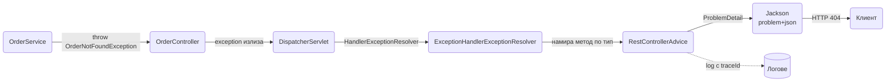

# Грешки и ProblemDetail

Всеки API има договор за грешки, независимо дали го е проектирал някой или не. Ако не го проектираш, договорът става "понякога Boot JSON с `timestamp` и `path`, понякога празно тяло, понякога stack trace". Този документ показва как да направиш един формат за всички грешки: `ProblemDetail` по RFC 9457 (бившият RFC 7807), с `type`, `title`, `status`, `detail`, `instance` и твоите разширения `code`, `errors`, `traceId`. Ще видиш как се строи йерархия от domain exceptions, как се мапват към HTTP статуси в един `@RestControllerAdvice`, какво се случва с грешките от Security, filters и async код, които не минават през advice-а, и как да тестваш всичко това.

| Какво | Кога | Инструмент |
|---|---|---|
| Бизнес грешка със статус | не е намерено, конфликт, нарушено правило | domain exception + един handler за семейството |
| Spring MVC грешки | лош JSON, грешен тип параметър, 404, 405 | наследен `ResponseEntityExceptionHandler` |
| Validation грешки | `@Valid` провал | `errors` масив, виж [Валидации](Validation.md) |
| Грешки от базата | unique constraint, optimistic lock | `DataIntegrityViolationException`, `OptimisticLockingFailureException` към 409 |
| 401 и 403 | Security filters | `AuthenticationEntryPoint`, `AccessDeniedHandler` |
| Еднократно хвърляне със статус | без да правиш клас | `ErrorResponseException` |
| Неочаквана грешка | NPE, timeout, бъг | 500 без детайли, лог с `traceId` |

## 1. Зависимости и настройка

`ProblemDetail` е в `spring-web`, идва със `spring-boot-starter-web`. Няма допълнителна зависимост.

```yaml
spring:
  mvc:
    problemdetails:
      enabled: true

server:
  error:
    include-message: never
    include-binding-errors: never
    include-stacktrace: never
    include-exception: false
    whitelabel:
      enabled: false
```

`spring.mvc.problemdetails.enabled: true` регистрира Boot-ския `ProblemDetailsExceptionHandler`, който е `ResponseEntityExceptionHandler` и връща `application/problem+json` за всички вградени Spring MVC грешки. Когато дефинираш свой `@RestControllerAdvice`, който наследява `ResponseEntityExceptionHandler`, Boot-ският не се създава (условието е липса на такъв bean), но property-то остава полезно за документация и за да е ясно какъв формат се очаква.

`server.error.include-*: never` важи за всичко, което стига до `/error`, тоест грешки от filters и неща, които advice-ът не хваща. Там не искаш нито съобщение, нито stack trace.

## 2. Default обработката на Boot и защо я заменяме

Без нищо твое, Boot обработва грешките през `BasicErrorController` на `/error`. При exception от controller `DispatcherServlet` не намира handler, Tomcat прави forward към `/error` и получаваш:

```json
{
  "timestamp": "2026-10-07T09:14:03.120+00:00",
  "status": 404,
  "error": "Not Found",
  "path": "/api/orders/42"
}
```

Проблемите:

- Форматът е собствен на Boot, не стандарт. Клиентите трябва да го научат отделно от всяко друго API.
- Няма machine-readable код на грешката. `"error": "Not Found"` е reason phrase, не нещо, по което да се прави `switch`.
- Няма място за полета при validation грешки, освен ако включиш `include-binding-errors`, което изкарва вътрешни имена на класове.
- `include-message: always` изкарва `ex.getMessage()`, който често съдържа SQL, имена на таблици или пътища.
- Forward към `/error` е втори request в MVC: interceptor-ите и някои filter-и се изпълняват отново.

С `@RestControllerAdvice` грешката се превръща в отговор вътре в `DispatcherServlet`, без forward, и форматът е стандартен. `BasicErrorController` остава само за грешки, които се случват преди `DispatcherServlet` (filters) и там държим `include-*: never`.

## 3. ProblemDetail: полетата по RFC 9457

```json
{
  "type": "https://api.example.com/problems/order-not-found",
  "title": "Order not found",
  "status": 404,
  "detail": "Order 3c2a1f0e-7b6d-4c5e-9f8a-1b2c3d4e5f60 does not exist",
  "instance": "/api/orders/3c2a1f0e-7b6d-4c5e-9f8a-1b2c3d4e5f60",
  "code": "ORDER_NOT_FOUND",
  "traceId": "4bf92f3577b34da6a3ce929d0e0e4736"
}
```

| Поле | Какво е | Правило |
|---|---|---|
| `type` | URI, идентифициращ вида грешка | стабилен, един за `code`; `about:blank` когато няма по-добър |
| `title` | кратко човешко описание на вида | едно и също за всички грешки от този `type`, преводимо |
| `status` | HTTP статус | дублира header-а, за удобство на клиента |
| `detail` | описание на конкретния случай | за хора, може да съдържа ID-та, не съдържа вътрешни детайли |
| `instance` | URI на конкретното възникване | пътят на request-а, Spring го попълва |
| extensions | произволни допълнителни полета | `code`, `errors`, `traceId`, `retryAfter` |

`Content-Type` е `application/problem+json`. Spring го слага автоматично, когато върнеш `ProblemDetail` или `ResponseEntity<ProblemDetail>`.

```java
import org.springframework.http.ProblemDetail;

ProblemDetail problem = ProblemDetail.forStatusAndDetail(HttpStatus.NOT_FOUND, "Order 42 does not exist");
problem.setType(URI.create("https://api.example.com/problems/order-not-found"));
problem.setTitle("Order not found");
problem.setProperty("code", "ORDER_NOT_FOUND");
```

`type` URI-тата не трябва да резолвират до реална страница, но е добра практика да водят до документацията на грешката. Избери base URL и не го променяй.

## 4. Минимален работещ пример

Една domain exception, един advice, един controller.

```java
package com.example.orders.domain;

public class OrderNotFoundException extends RuntimeException {

    private final UUID orderId;

    public OrderNotFoundException(UUID orderId) {
        super("Order " + orderId + " does not exist");
        this.orderId = orderId;
    }

    public UUID orderId() {
        return orderId;
    }
}
```

```java
package com.example.orders.web.error;

import com.example.orders.domain.OrderNotFoundException;
import org.springframework.http.HttpStatus;
import org.springframework.http.ProblemDetail;
import org.springframework.web.bind.annotation.ExceptionHandler;
import org.springframework.web.bind.annotation.RestControllerAdvice;

@RestControllerAdvice
public class GlobalExceptionHandler {

    @ExceptionHandler(OrderNotFoundException.class)
    public ProblemDetail handleOrderNotFound(OrderNotFoundException ex) {
        ProblemDetail problem = ProblemDetail.forStatusAndDetail(HttpStatus.NOT_FOUND, ex.getMessage());
        problem.setTitle("Order not found");
        problem.setProperty("code", "ORDER_NOT_FOUND");
        return problem;
    }
}
```

```java
@GetMapping("/api/orders/{id}")
public OrderResponse get(@PathVariable UUID id) {
    return orderRepository.findByPublicId(id)
            .map(OrderResponse::from)
            .orElseThrow(() -> new OrderNotFoundException(id));
}
```

Връщането на `ProblemDetail` директно от handler метода е достатъчно: Spring взима статуса от `problem.getStatus()`, слага `instance` от текущия path и `Content-Type: application/problem+json`. `ResponseEntity<ProblemDetail>` ти трябва само за допълнителни headers (`Retry-After`, `Location`).

## 5. Потокът на грешката



`ExceptionHandlerExceptionResolver` търси `@ExceptionHandler` първо в самия controller, после в `@ControllerAdvice` bean-овете, подредени по `@Order`. В рамките на един клас избира метода с най-специфичния тип exception. Ако никой не хване грешката, `DefaultHandlerExceptionResolver` обработва вградените Spring грешки, а всичко друго отива към `/error`.

## 6. Йерархия на domain exceptions

Целта е service слоят да хвърля смислени exceptions без да знае за HTTP, а advice-ът да има един handler на семейство вместо един на клас.

```java
package com.example.orders.domain.error;

public enum ErrorCode {
    ORDER_NOT_FOUND, PRODUCT_NOT_FOUND, CUSTOMER_NOT_FOUND,
    EMAIL_ALREADY_REGISTERED, ORDER_ALREADY_PAID,
    INSUFFICIENT_STOCK, ORDER_NOT_CANCELLABLE, CREDIT_LIMIT_EXCEEDED,
    PAYMENT_PROVIDER_UNAVAILABLE
}
```

```java
package com.example.orders.domain.error;

public abstract class DomainException extends RuntimeException {

    private final ErrorCode code;
    private final transient Map<String, Object> context;

    protected DomainException(ErrorCode code, String message, Map<String, Object> context) {
        super(message);
        this.code = code;
        this.context = Map.copyOf(context);
    }

    public ErrorCode code() {
        return code;
    }

    public Map<String, Object> context() {
        return context;
    }
}

public class NotFoundException extends DomainException {
    public NotFoundException(ErrorCode code, String entity, Object id) {
        super(code, entity + " " + id + " does not exist", Map.of("entity", entity, "id", id));
    }
}

public class ConflictException extends DomainException {
    public ConflictException(ErrorCode code, String message) {
        super(code, message, Map.of());
    }
}

public class BusinessRuleException extends DomainException {
    public BusinessRuleException(ErrorCode code, String message, Map<String, Object> context) {
        super(code, message, context);
    }
}

public class DependencyUnavailableException extends DomainException {
    public DependencyUnavailableException(ErrorCode code, String message) {
        super(code, message, Map.of());
    }
}
```

```java
@Service
public class OrderService {

    @Transactional
    public Order cancel(UUID orderId) {
        Order order = orders.findByPublicId(orderId)
                .orElseThrow(() -> new NotFoundException(ErrorCode.ORDER_NOT_FOUND, "Order", orderId));
        if (order.getStatus() == OrderStatus.SHIPPED) {
            throw new BusinessRuleException(ErrorCode.ORDER_NOT_CANCELLABLE,
                    "Shipped orders cannot be cancelled",
                    Map.of("status", order.getStatus().name()));
        }
        order.cancel();
        return order;
    }
}
```

Advice с един handler на семейство:

```java
package com.example.orders.web.error;

import com.example.orders.domain.error.*;
import org.springframework.http.HttpStatus;
import org.springframework.http.ProblemDetail;
import org.springframework.web.bind.annotation.ExceptionHandler;
import org.springframework.web.bind.annotation.RestControllerAdvice;
import org.springframework.web.servlet.mvc.method.annotation.ResponseEntityExceptionHandler;

@RestControllerAdvice
public class GlobalExceptionHandler extends ResponseEntityExceptionHandler {

    private final ProblemFactory problems;

    public GlobalExceptionHandler(ProblemFactory problems) {
        this.problems = problems;
    }

    @ExceptionHandler(NotFoundException.class)
    public ProblemDetail handleNotFound(NotFoundException ex) {
        return problems.create(HttpStatus.NOT_FOUND, ex);
    }

    @ExceptionHandler(ConflictException.class)
    public ProblemDetail handleConflict(ConflictException ex) {
        return problems.create(HttpStatus.CONFLICT, ex);
    }

    @ExceptionHandler(BusinessRuleException.class)
    public ProblemDetail handleBusinessRule(BusinessRuleException ex) {
        return problems.create(HttpStatus.UNPROCESSABLE_CONTENT, ex);
    }

    @ExceptionHandler(DependencyUnavailableException.class)
    public ProblemDetail handleDependency(DependencyUnavailableException ex) {
        return problems.create(HttpStatus.SERVICE_UNAVAILABLE, ex);
    }
}
```

Фабриката държи общата логика (`type`, `code`, `traceId`, i18n), за да не я повтаряш във всеки handler:

```java
package com.example.orders.web.error;

import com.example.orders.domain.error.DomainException;
import org.slf4j.MDC;
import org.springframework.context.MessageSource;
import org.springframework.context.i18n.LocaleContextHolder;
import org.springframework.http.HttpStatus;
import org.springframework.http.ProblemDetail;
import org.springframework.stereotype.Component;

import java.net.URI;
import java.util.Locale;

@Component
public class ProblemFactory {

    private static final String TYPE_BASE = "https://api.example.com/problems/";

    private final MessageSource messages;

    public ProblemFactory(MessageSource messages) {
        this.messages = messages;
    }

    public ProblemDetail create(HttpStatus status, DomainException ex) {
        Locale locale = LocaleContextHolder.getLocale();
        String codeKey = ex.code().name().toLowerCase().replace('_', '-');
        String title = messages.getMessage("problem." + ex.code().name() + ".title", null,
                status.getReasonPhrase(), locale);
        String detail = messages.getMessage("problem." + ex.code().name() + ".detail",
                ex.context().values().toArray(), ex.getMessage(), locale);

        ProblemDetail problem = ProblemDetail.forStatusAndDetail(status, detail);
        problem.setType(URI.create(TYPE_BASE + codeKey));
        problem.setTitle(title);
        problem.setProperty("code", ex.code().name());
        addTraceId(problem);
        return problem;
    }

    public ProblemDetail create(HttpStatus status, String code, String title, String detail) {
        ProblemDetail problem = ProblemDetail.forStatusAndDetail(status, detail);
        problem.setType(URI.create(TYPE_BASE + code.toLowerCase().replace('_', '-')));
        problem.setTitle(title);
        problem.setProperty("code", code);
        addTraceId(problem);
        return problem;
    }

    private static void addTraceId(ProblemDetail problem) {
        String traceId = MDC.get("traceId");
        if (traceId == null) {
            traceId = MDC.get("requestId");
        }
        if (traceId != null) {
            problem.setProperty("traceId", traceId);
        }
    }
}
```

## 7. Mapping към статуси

| Статус | Кога | Semantics за клиента | Пример |
|---|---|---|---|
| 400 Bad Request | синтактично или структурно лош request | поправи request-а | невалиден JSON, липсващ параметър, validation |
| 401 Unauthorized | няма или невалиден credential | влез или обнови token-а | изтекъл JWT |
| 403 Forbidden | валиден credential, недостатъчни права | не опитвай пак със същия потребител | user вижда чужда поръчка |
| 404 Not Found | ресурсът не съществува (или не трябва да се вижда) | провери ID-то | `OrderNotFound`, непознат path |
| 405 Method Not Allowed | методът не е поддържан за пътя | | `DELETE /api/orders` |
| 409 Conflict | състоянието не позволява операцията, или дубликат | прочети текущото състояние и опитай пак | unique email, optimistic lock, поръчката вече е платена |
| 413 Content Too Large | тялото надхвърля лимита | | upload над `max-file-size` |
| 415 Unsupported Media Type | грешен `Content-Type` | | XML към JSON endpoint |
| 422 Unprocessable Content | синтактично валиден, но нарушава бизнес правило | промени данните | недостатъчна наличност, кредитен лимит |
| 429 Too Many Requests | rate limit | изчакай `Retry-After` | виж [Middleware](Middleware.md) |
| 500 Internal Server Error | бъг или неочаквана грешка | докладвай `traceId` | NPE, неочакван `SQLException` |
| 503 Service Unavailable | външна зависимост не отговаря | опитай пак по-късно | платежен provider timeout |

Границата между 400 и 422 е: 400 за "не мога да прочета или разбера request-а", 422 за "разбрах го, но не мога да го изпълня". Validation на формат (`@NotBlank`, `@Email`) е 400, бизнес правила (наличност, статус на поръчката) са 422. Границата между 409 и 422: 409 когато конфликтът е със сегашното състояние на ресурса и клиентът може да го разреши с re-read, 422 когато самите данни са неприемливи.

Ако не искаш 422 (някои екипи го избягват), сложи всички бизнес правила на 409 и бъди консистентен.

## 8. Разширения: code, errors, traceId

- `code`: enum стойност, стабилна за живота на API-то. Клиентът прави `switch` по нея, не по `title` и не по `detail`. Документирана в OpenAPI.
- `errors`: само за validation, масив от `{field, message, rejectedValue}`. Пълният handler е във [Валидации](Validation.md).
- `traceId`: ключът, с който support намира лога. Идва от Micrometer Tracing (`traceId` в MDC), а без tracing от `requestId` filter-а, виж [Logging](Logging.md).
- `retryAfter`: при 429 и 503, дублира header-а `Retry-After` в секунди.

Не слагай: stack trace, имена на класове, SQL, вътрешни ID-та, host имена. Ако `detail` съдържа `ex.getMessage()` от библиотека, спри и провери какво има вътре.

## 9. Spring MVC и Spring Data грешки

`ResponseEntityExceptionHandler` вече връща ProblemDetail за около 20 вградени exception-а (405, 406, 415, 400 за липсващ параметър, 404 за непознат път, 503 за async timeout). Трябва да override-неш само тези, за които искаш `code` или по-добър `detail`:

```java
@RestControllerAdvice
public class GlobalExceptionHandler extends ResponseEntityExceptionHandler {

    private static final Logger log = LoggerFactory.getLogger(GlobalExceptionHandler.class);

    @Override
    protected ResponseEntity<Object> handleHttpMessageNotReadable(HttpMessageNotReadableException ex,
                                                                  HttpHeaders headers, HttpStatusCode status,
                                                                  WebRequest request) {
        String detail = "Request body is missing or malformed";
        if (ex.getCause() instanceof InvalidFormatException ife && !ife.getPath().isEmpty()) {
            String field = ife.getPath().stream()
                    .map(ref -> ref.getFieldName() != null ? ref.getFieldName() : "[" + ref.getIndex() + "]")
                    .collect(Collectors.joining("."));
            detail = "Field '" + field + "' has invalid value '" + ife.getValue() + "'";
        } else if (ex.getCause() instanceof UnrecognizedPropertyException upe) {
            detail = "Unknown field '" + upe.getPropertyName() + "'";
        }
        ProblemDetail problem = problems.create(HttpStatus.BAD_REQUEST, "MALFORMED_REQUEST", "Malformed request", detail);
        return ResponseEntity.badRequest().body(problem);
    }

    @Override
    protected ResponseEntity<Object> handleTypeMismatch(TypeMismatchException ex, HttpHeaders headers,
                                                        HttpStatusCode status, WebRequest request) {
        String name = ex instanceof MethodArgumentTypeMismatchException m ? m.getName() : ex.getPropertyName();
        String required = ex.getRequiredType() != null ? ex.getRequiredType().getSimpleName() : "unknown";
        ProblemDetail problem = problems.create(HttpStatus.BAD_REQUEST, "INVALID_PARAMETER", "Invalid parameter",
                "Parameter '" + name + "' must be of type " + required);
        return ResponseEntity.badRequest().body(problem);
    }

    @Override
    protected ResponseEntity<Object> handleNoResourceFoundException(NoResourceFoundException ex,
                                                                    HttpHeaders headers, HttpStatusCode status,
                                                                    WebRequest request) {
        ProblemDetail problem = problems.create(HttpStatus.NOT_FOUND, "RESOURCE_NOT_FOUND", "Not found",
                "No endpoint " + ex.getHttpMethod() + " /" + ex.getResourcePath());
        return ResponseEntity.status(HttpStatus.NOT_FOUND).body(problem);
    }

    @ExceptionHandler(DataIntegrityViolationException.class)
    public ProblemDetail handleDataIntegrity(DataIntegrityViolationException ex) {
        String constraint = extractConstraintName(ex);
        log.warn("Data integrity violation constraint={} message={}", constraint, ex.getMostSpecificCause().getMessage());
        return switch (constraint) {
            case "uk_user_account_email" -> problems.create(HttpStatus.CONFLICT, "EMAIL_ALREADY_REGISTERED",
                    "Conflict", "Email address is already registered");
            case "fk_order_item_product" -> problems.create(HttpStatus.UNPROCESSABLE_CONTENT, "PRODUCT_NOT_FOUND",
                    "Unprocessable", "Referenced product does not exist");
            default -> problems.create(HttpStatus.CONFLICT, "DATA_CONFLICT", "Conflict",
                    "The request conflicts with existing data");
        };
    }

    @ExceptionHandler(OptimisticLockingFailureException.class)
    public ProblemDetail handleOptimisticLock(OptimisticLockingFailureException ex) {
        return problems.create(HttpStatus.CONFLICT, "CONCURRENT_MODIFICATION", "Conflict",
                "The resource was modified by another request, reload and try again");
    }

    private static String extractConstraintName(DataIntegrityViolationException ex) {
        if (ex.getCause() instanceof org.hibernate.exception.ConstraintViolationException cve
                && cve.getConstraintName() != null) {
            // Postgres връща името с кавички в някои случаи
            return cve.getConstraintName().replace("\"", "");
        }
        return "";
    }
}
```

Няколко бележки:

- `MethodArgumentTypeMismatchException` наследява `TypeMismatchException`, затова се хваща от `handleTypeMismatch`. Без override получаваш 400 с `detail: "Failed to convert 'id' with value: 'abc'"`, което е прието, но без `code`.
- `NoResourceFoundException` е 404 за непознат път от Spring 6.1 (замести `NoHandlerFoundException` за статични ресурси и `/**`). `ResponseEntityExceptionHandler` го обработва по подразбиране.
- `DataIntegrityViolationException` идва при `flush`, тоест при commit на `@Transactional` метода, не при `save()`. Името на constraint-а е единственият надежден начин да различиш кой unique индекс е ударен, затова constraints в миграциите трябва да имат явни имена. Виж [Миграции](Migrations.md).
- `OptimisticLockingFailureException` (и подкласът `ObjectOptimisticLockingFailureException`) е резултат от `@Version`. Семантиката му е 409 и клиентът трябва да re-read. Виж [Транзакции и locking](Transactions.md).
- Validation exceptions (`MethodArgumentNotValidException`, `HandlerMethodValidationException`, `ConstraintViolationException`) са в същия клас, показани изцяло във [Валидации](Validation.md).

## 10. Security: 401 и 403

`AuthenticationException` и `AccessDeniedException` се хвърлят във filter chain-а на Spring Security, преди `DispatcherServlet`, и advice-ът не ги вижда. Форматът им се задава през `AuthenticationEntryPoint` (401) и `AccessDeniedHandler` (403).

```java
package com.example.orders.security;

import com.fasterxml.jackson.databind.ObjectMapper;
import jakarta.servlet.http.HttpServletRequest;
import jakarta.servlet.http.HttpServletResponse;
import org.springframework.http.HttpStatus;
import org.springframework.http.MediaType;
import org.springframework.http.ProblemDetail;
import org.springframework.security.access.AccessDeniedException;
import org.springframework.security.core.AuthenticationException;
import org.springframework.security.web.AuthenticationEntryPoint;
import org.springframework.security.web.access.AccessDeniedHandler;
import org.springframework.stereotype.Component;

import java.io.IOException;
import java.net.URI;

@Component
public class ProblemDetailSecurityHandlers implements AuthenticationEntryPoint, AccessDeniedHandler {

    private final ObjectMapper objectMapper;

    public ProblemDetailSecurityHandlers(ObjectMapper objectMapper) {
        this.objectMapper = objectMapper;
    }

    @Override
    public void commence(HttpServletRequest request, HttpServletResponse response,
                         AuthenticationException ex) throws IOException {
        response.setHeader("WWW-Authenticate", "Bearer");
        write(request, response, HttpStatus.UNAUTHORIZED, "UNAUTHENTICATED", "Authentication is required");
    }

    @Override
    public void handle(HttpServletRequest request, HttpServletResponse response,
                       AccessDeniedException ex) throws IOException {
        write(request, response, HttpStatus.FORBIDDEN, "FORBIDDEN", "You do not have access to this resource");
    }

    private void write(HttpServletRequest request, HttpServletResponse response,
                       HttpStatus status, String code, String detail) throws IOException {
        ProblemDetail problem = ProblemDetail.forStatusAndDetail(status, detail);
        problem.setTitle(status.getReasonPhrase());
        problem.setInstance(URI.create(request.getRequestURI()));
        problem.setProperty("code", code);
        response.setStatus(status.value());
        response.setContentType(MediaType.APPLICATION_PROBLEM_JSON_VALUE);
        objectMapper.writeValue(response.getOutputStream(), problem);
    }
}
```

```java
@Bean
SecurityFilterChain api(HttpSecurity http, ProblemDetailSecurityHandlers handlers) throws Exception {
    http
        .securityMatcher("/api/**")
        .authorizeHttpRequests(a -> a
            .requestMatchers("/api/public/**").permitAll()
            .anyRequest().authenticated())
        .oauth2ResourceServer(o -> o
            .jwt(Customizer.withDefaults())
            .authenticationEntryPoint(handlers)
            .accessDeniedHandler(handlers))
        .exceptionHandling(e -> e
            .authenticationEntryPoint(handlers)
            .accessDeniedHandler(handlers));
    return http.build();
}
```

Важно изключение: `AccessDeniedException` от `@PreAuthorize` на controller метод се хвърля вътре в `DispatcherServlet`. Ако advice-ът има общ `@ExceptionHandler(Exception.class)`, той ще я хване и ще върне 500. Затова advice-ът трябва да я обработи изрично и консистентно със security handler-а:

```java
@ExceptionHandler(AccessDeniedException.class)
public ProblemDetail handleAccessDenied(AccessDeniedException ex) {
    return problems.create(HttpStatus.FORBIDDEN, "FORBIDDEN", "Forbidden", "You do not have access to this resource");
}
```

Как се настройва JWT, кога се вика entry point-ът и как се тества е описано в [Authentication](Authentication.md) и [Authorization](Authorization.md).

## 11. ErrorResponseException за еднократни случаи

Когато не си заслужава нов клас, Spring дава exception, който носи `ProblemDetail` в себе си и се обработва от `ResponseEntityExceptionHandler` без допълнителен код:

```java
import org.springframework.web.ErrorResponseException;

ProblemDetail problem = ProblemDetail.forStatusAndDetail(HttpStatus.GONE, "This export link has expired");
problem.setProperty("code", "EXPORT_EXPIRED");
throw new ErrorResponseException(HttpStatus.GONE, problem, null);
```

`ResponseStatusException` е подклас на `ErrorResponseException` и върши същото с по-кратък синтаксис, но без `code`:

```java
throw new ResponseStatusException(HttpStatus.NOT_FOUND, "Report not generated yet");
```

Ползвай ги в controller-а за HTTP специфични ситуации (изтекъл линк, липсващ header). В service слоя хвърляй domain exceptions, за да не го свързваш с HTTP.

## 12. 500: нищо не изтича, всичко се логва

```java
@ExceptionHandler(Exception.class)
public ProblemDetail handleUnexpected(Exception ex, HttpServletRequest request) {
    log.error("Unhandled exception on {} {}", request.getMethod(), request.getRequestURI(), ex);
    return problems.create(HttpStatus.INTERNAL_SERVER_ERROR, "INTERNAL_ERROR", "Internal server error",
            "An unexpected error occurred. Contact support with the traceId.");
}
```

Правила:

- `detail` е фиксиран текст. Никога `ex.getMessage()`.
- Логът е на `ERROR` с пълния stack trace. `traceId` е в MDC, така че се появява в реда автоматично и съвпада с това в отговора.
- 4xx грешките се логват на `WARN` без stack trace (или на `DEBUG`), иначе всеки грешен request от клиент пълни логовете с trace-ове.
- Handler-ът за `Exception.class` е последен по специфичност, Spring го избира само ако няма по-точен. Но той хваща и `AccessDeniedException`, `AsyncRequestTimeoutException` и подобни, затова те трябва да имат свои handler-и (секция 10) или да наследяваш `ResponseEntityExceptionHandler`, който ги покрива.

Централизиран лог на всички грешки в един метод:

```java
private ProblemDetail logged(HttpStatus status, DomainException ex) {
    if (status.is5xxServerError()) {
        log.error("code={} message={}", ex.code(), ex.getMessage(), ex);
    } else {
        log.warn("code={} message={} context={}", ex.code(), ex.getMessage(), ex.context());
    }
    return problems.create(status, ex);
}
```

## 13. i18n на title и detail

`ProblemFactory` от секция 6 вече търси ключове `problem.<CODE>.title` и `problem.<CODE>.detail` в `MessageSource` с локала от `Accept-Language`:

```properties
# messages.properties
problem.ORDER_NOT_FOUND.title=Поръчката не е намерена
problem.ORDER_NOT_FOUND.detail=Поръчка {1} не съществува
problem.ORDER_NOT_CANCELLABLE.title=Поръчката не може да бъде отказана
problem.ORDER_NOT_CANCELLABLE.detail=Поръчки със статус {0} не могат да бъдат отказани
problem.INSUFFICIENT_STOCK.title=Недостатъчна наличност
```

```properties
# messages_en.properties
problem.ORDER_NOT_FOUND.title=Order not found
problem.ORDER_NOT_FOUND.detail=Order {1} does not exist
problem.ORDER_NOT_CANCELLABLE.title=Order cannot be cancelled
problem.ORDER_NOT_CANCELLABLE.detail=Orders in status {0} cannot be cancelled
```

Spring има и вградена схема за `ResponseEntityExceptionHandler`: за всяка вградена грешка търси `problemDetail.<fully.qualified.ExceptionName>` за `detail` и `problemDetail.title.<...>` за `title`. Може да ги презапишеш в `messages.properties`:

```properties
problemDetail.org.springframework.web.servlet.resource.NoResourceFoundException=Няма такъв endpoint: {0} {1}
problemDetail.title.org.springframework.web.servlet.resource.NoResourceFoundException=Не е намерено
```

Внимавай с аргументите по позиция (`{0}`, `{1}`): `Map` не гарантира ред. Ако контекстът има повече от един аргумент, подавай ги като списък в exception-а вместо `Map`.

## 14. @ExceptionHandler в един controller

`@ExceptionHandler` метод в controller клас важи само за този controller и има приоритет пред advice-а. Полезно за exception, което има смисъл само там:

```java
@RestController
@RequestMapping("/api/reports")
public class ReportController {

    @GetMapping("/{id}/download")
    public ResponseEntity<Resource> download(@PathVariable UUID id) { ... }

    @ExceptionHandler(ReportNotReadyException.class)
    public ResponseEntity<ProblemDetail> handleNotReady(ReportNotReadyException ex) {
        ProblemDetail problem = ProblemDetail.forStatusAndDetail(HttpStatus.ACCEPTED, "Report is still generating");
        problem.setProperty("code", "REPORT_NOT_READY");
        problem.setProperty("retryAfter", 30);
        return ResponseEntity.status(HttpStatus.ACCEPTED)
                .header("Retry-After", "30")
                .body(problem);
    }
}
```

Ако същото exception се обработва в два controller-а, премести го в advice-а. Два локални handler-а с различен формат за едно и също е точно непоследователността, която избягваме.

## 15. Грешки извън DispatcherServlet

| Къде | Кой обработва | Какво да направиш |
|---|---|---|
| Servlet filter | Tomcat, forward към `/error` | пиши ProblemDetail директно в response-а, не хвърляй, виж [Middleware](Middleware.md) |
| Security filter | `AuthenticationEntryPoint`, `AccessDeniedHandler` | секция 10 |
| `@Async` метод с `void` | `AsyncUncaughtExceptionHandler` | логвай с контекст, няма HTTP отговор |
| `@Async` метод с `CompletableFuture` | този, който вика `.join()` / `.get()` | обработи при consumer-а |
| `@Scheduled` | `ErrorHandler` на scheduler-а, default логва | custom `ErrorHandler` с alert |
| Kafka / Rabbit listener | error handler на container-а | retry, DLQ, виж [Message brokers](Message_Brokers.md) |

```java
@Configuration
@EnableAsync
public class AsyncConfig implements AsyncConfigurer {

    private static final Logger log = LoggerFactory.getLogger(AsyncConfig.class);

    @Override
    public AsyncUncaughtExceptionHandler getAsyncUncaughtExceptionHandler() {
        return (ex, method, params) ->
                log.error("Async method {} failed with params {}", method.getName(), params, ex);
    }
}
```

Повече за `@Async`, scheduler error handling и пренасяне на `traceId` в background thread-ове в [Cron, @Async и опашки](Scheduling_Queues.md).

## 16. Договорът за грешки в OpenAPI

Всеки endpoint в OpenAPI трябва да декларира `application/problem+json` за своите грешки, иначе генерираните клиенти не знаят как да ги парсват. С springdoc това се прави веднъж глобално:

```java
@Bean
public OperationCustomizer problemResponses() {
    return (operation, handlerMethod) -> {
        var problemSchema = new Schema<>().$ref("#/components/schemas/ProblemDetail");
        var content = new Content().addMediaType("application/problem+json", new MediaType().schema(problemSchema));
        operation.getResponses().addApiResponse("400", new ApiResponse().description("Validation or malformed request").content(content));
        operation.getResponses().addApiResponse("401", new ApiResponse().description("Not authenticated").content(content));
        operation.getResponses().addApiResponse("500", new ApiResponse().description("Unexpected error").content(content));
        return operation;
    };
}
```

Специфичните 404 / 409 / 422 се добавят на endpoint-а с `@ApiResponse`. `ProblemDetail` схемата и списъкът с `code` стойности (enum-ът `ErrorCode`) са в [API документация](API_Docs.md).

## 17. Тестване

`@WebMvcTest` зарежда `@RestControllerAdvice` bean-овете автоматично. Тестът хвърля от mock-натия service и проверява формата:

```java
@WebMvcTest(OrderController.class)
@Import(ProblemFactory.class)
class OrderControllerErrorTest {

    @Autowired
    MockMvc mvc;

    @MockitoBean
    OrderService orderService;

    @Test
    void notFoundIsProblemDetail() throws Exception {
        UUID id = UUID.randomUUID();
        given(orderService.getByPublicId(id)).willThrow(new NotFoundException(ErrorCode.ORDER_NOT_FOUND, "Order", id));

        mvc.perform(get("/api/orders/{id}", id).with(jwt()))
                .andExpect(status().isNotFound())
                .andExpect(content().contentType(MediaType.APPLICATION_PROBLEM_JSON))
                .andExpect(jsonPath("$.code").value("ORDER_NOT_FOUND"))
                .andExpect(jsonPath("$.type").value("https://api.example.com/problems/order-not-found"))
                .andExpect(jsonPath("$.instance").value("/api/orders/" + id));
    }

    @Test
    void unexpectedErrorHidesDetails() throws Exception {
        given(orderService.getByPublicId(any())).willThrow(new IllegalStateException("db password is hunter2"));

        mvc.perform(get("/api/orders/{id}", UUID.randomUUID()).with(jwt()))
                .andExpect(status().isInternalServerError())
                .andExpect(jsonPath("$.code").value("INTERNAL_ERROR"))
                .andExpect(jsonPath("$.detail").value(not(containsString("hunter2"))));
    }

    @Test
    void malformedJsonIs400() throws Exception {
        mvc.perform(post("/api/orders").with(jwt()).contentType(MediaType.APPLICATION_JSON)
                        .content("{ \"customerId\": \"not-a-uuid\" }"))
                .andExpect(status().isBadRequest())
                .andExpect(jsonPath("$.code").value("MALFORMED_REQUEST"))
                .andExpect(jsonPath("$.detail").value(containsString("customerId")));
    }
}
```

`ProblemFactory` е `@Component`, който `@WebMvcTest` не сканира, затова `@Import`. Тестът за 500 с таен текст в exception-а е най-важният: той доказва, че нищо не изтича. За `DataIntegrityViolationException` трябва интеграционен тест с реална база (Testcontainers), защото името на constraint-а идва от Postgres, виж [Testing](Testing.md).

## 18. Примерни отговори

```http
GET /api/orders/3c2a1f0e-7b6d-4c5e-9f8a-1b2c3d4e5f60 HTTP/1.1
Authorization: Bearer eyJ...
Accept-Language: bg
```

```http
HTTP/1.1 404 Not Found
Content-Type: application/problem+json

{
  "type": "https://api.example.com/problems/order-not-found",
  "title": "Поръчката не е намерена",
  "status": 404,
  "detail": "Поръчка 3c2a1f0e-7b6d-4c5e-9f8a-1b2c3d4e5f60 не съществува",
  "instance": "/api/orders/3c2a1f0e-7b6d-4c5e-9f8a-1b2c3d4e5f60",
  "code": "ORDER_NOT_FOUND",
  "traceId": "4bf92f3577b34da6a3ce929d0e0e4736"
}
```

```http
HTTP/1.1 422 Unprocessable Content
Content-Type: application/problem+json

{
  "type": "https://api.example.com/problems/order-not-cancellable",
  "title": "Order cannot be cancelled",
  "status": 422,
  "detail": "Orders in status SHIPPED cannot be cancelled",
  "instance": "/api/orders/3c2a1f0e-7b6d-4c5e-9f8a-1b2c3d4e5f60/cancel",
  "code": "ORDER_NOT_CANCELLABLE",
  "traceId": "a1b2c3d4e5f60718293a4b5c6d7e8f90"
}
```

```http
HTTP/1.1 409 Conflict
Content-Type: application/problem+json

{
  "type": "https://api.example.com/problems/email-already-registered",
  "title": "Conflict",
  "status": 409,
  "detail": "Email address is already registered",
  "instance": "/api/users",
  "code": "EMAIL_ALREADY_REGISTERED",
  "traceId": "0f1e2d3c4b5a69788796a5b4c3d2e1f0"
}
```

```http
HTTP/1.1 401 Unauthorized
Content-Type: application/problem+json
WWW-Authenticate: Bearer

{
  "type": "about:blank",
  "title": "Unauthorized",
  "status": 401,
  "detail": "Authentication is required",
  "instance": "/api/orders",
  "code": "UNAUTHENTICATED"
}
```

```http
HTTP/1.1 500 Internal Server Error
Content-Type: application/problem+json

{
  "type": "https://api.example.com/problems/internal-error",
  "title": "Internal server error",
  "status": 500,
  "detail": "An unexpected error occurred. Contact support with the traceId.",
  "instance": "/api/orders",
  "code": "INTERNAL_ERROR",
  "traceId": "9a8b7c6d5e4f30211f2e3d4c5b6a7980"
}
```

## 19. Капани

- `@ExceptionHandler(Exception.class)` без handler за `AccessDeniedException`: `@PreAuthorize` провал става 500 вместо 403.
- `ex.getMessage()` в `detail` на 500: Hibernate и JDBC съобщения съдържат SQL, имена на таблици, понякога стойности. Фиксиран текст.
- `server.error.include-message: always` в продукция "за да виждаме по-лесно". Същият проблем за всичко, което стига до `/error`.
- Два advice класа без `@Order`, и двата с handler за едно и също exception: кой печели зависи от реда на зареждане на bean-овете. Един advice или явен `@Order`.
- `DataIntegrityViolationException` се хваща с `try/catch` около `repository.save()`, но exception-ът идва при flush в края на транзакцията, така че catch-ът не го вижда. Хващай го в advice-а или извикай `saveAndFlush`.
- Constraints без имена в миграциите: Postgres генерира `user_account_email_key`, което се променя при преименуване на таблицата и чупи `switch`-а по име.
- Хвърляне на `ResponseStatusException` от service слоя: service-ът става зависим от HTTP и не може да се ползва от scheduler или listener. Domain exception.
- `ProblemDetail` с `type: about:blank` навсякъде: клиентите нямат стабилен идентификатор освен `code`. Избери base URI и го ползвай.
- Логване на всяко 4xx с stack trace на `ERROR`: логовете стават неизползваеми при първия клиент с грешен скрипт.
- `@ControllerAdvice` вместо `@RestControllerAdvice`: handler методът връща `ProblemDetail`, но Spring го търси като view name. Винаги `@RestControllerAdvice` за API.
- Exception от filter с очакване, че advice-ът ще го хване: получаваш Boot default JSON, а със `include-message: never` и без `detail`. Пиши отговора във filter-а.
- `@Transactional` метод, който хваща exception и го превръща в ProblemDetail резултат вместо да го пропусне: транзакцията ще commit-не, защото няма exception през proxy-то. Виж [Транзакции и locking](Transactions.md).

## 20. Чеклист

- [ ] `spring.mvc.problemdetails.enabled: true`, `server.error.include-*: never`
- [ ] Един `@RestControllerAdvice`, който наследява `ResponseEntityExceptionHandler`
- [ ] `ErrorCode` enum и йерархия `NotFoundException`, `ConflictException`, `BusinessRuleException` с handler на семейство
- [ ] Всеки ProblemDetail има `type`, `title`, `code` и `traceId`
- [ ] `DataIntegrityViolationException` към 409 по име на constraint, constraints в миграциите имат явни имена
- [ ] `OptimisticLockingFailureException` към 409
- [ ] `AuthenticationEntryPoint` и `AccessDeniedHandler` пишат същия ProblemDetail формат, `AccessDeniedException` има handler и в advice-а
- [ ] Handler за `Exception.class` с фиксиран `detail`, `ERROR` лог със stack trace, 4xx на `WARN` без stack
- [ ] `HttpMessageNotReadableException` дава полето с грешния формат
- [ ] `title` и `detail` се четат от `MessageSource` по `Accept-Language`
- [ ] Filter-ите пишат ProblemDetail сами, `@Async` има `AsyncUncaughtExceptionHandler`
- [ ] OpenAPI декларира `application/problem+json` за 400, 401, 500 глобално
- [ ] `@WebMvcTest`, който доказва, че 500 не съдържа текста на exception-а

## 21. Свързани документи

- [Валидации](Validation.md): handler-ите за `MethodArgumentNotValidException`, `HandlerMethodValidationException`, `ConstraintViolationException` и `errors` масивът.
- [Middleware](Middleware.md): защо filter-ите не стигат до advice-а и как пишат ProblemDetail сами.
- [Authentication](Authentication.md): кога се вика `AuthenticationEntryPoint` и как се тества с `jwt()`.
- [Authorization](Authorization.md): `@PreAuthorize` и `AccessDeniedException` в controller слоя.
- [Транзакции и locking](Transactions.md): `@Version`, `OptimisticLockingFailureException`, exception и rollback.
- [Logging](Logging.md): `traceId` в MDC и как да го намериш в логовете.
- [Cron, @Async и опашки](Scheduling_Queues.md): грешки в background код.
- [API документация](API_Docs.md): документиране на `ProblemDetail` и `ErrorCode` в OpenAPI.
- [RFC 9457, Problem Details for HTTP APIs](https://www.rfc-editor.org/rfc/rfc9457)
