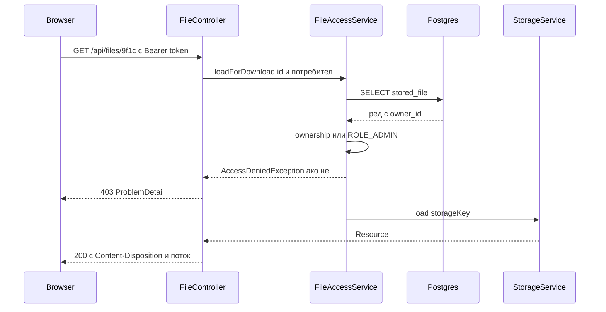
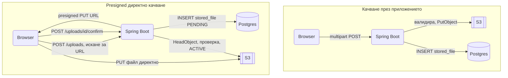

# Файлове

Качване на снимка към продукт, PDF фактура за изтегляне, CSV експорт на хиляди редове, аватар с thumbnail: файловете са навсякъде и всяка част от тях има капан, от path traversal до изчерпана памет при голям download. Този документ показва как се приема `MultipartFile` безопасно, как се валидира съдържанието, а не разширението, как се абстрахира съхранението зад `StorageService` с локална и S3 имплементация, как се сервират файлове с правилни header-и и range заявки, и кога е по-добре клиентът да качва директно в S3 с presigned URL. Домейнът е същият: поръчки, фактури и продукти със снимки.

| Какво | Кога | Инструмент |
|---|---|---|
| Приемане на файл | Форма или SPA качва към приложението | `MultipartFile`, `@RequestPart` |
| Валидация на съдържание | Винаги, преди да запишеш нещо | Apache Tika, `ImageIO`, whitelist |
| Съхранение | Локален диск за едно копие, S3 за всичко друго | `StorageService`, AWS SDK v2, MinIO в dev |
| Изтегляне с права | Фактури, лични документи | `ResponseEntity<Resource>`, проверка в service |
| Големи генерирани файлове | CSV експорт, отчети | `StreamingResponseBody` |
| Директно качване в S3 | Големи файлове, видео | Presigned PUT и confirm endpoint |
| Thumbnails | Снимки на продукти, аватари | Thumbnailator, async през събитие |

## 1. Зависимости и настройка

```xml
<dependency>
    <groupId>org.springframework.boot</groupId>
    <artifactId>spring-boot-starter-web</artifactId>
</dependency>
<dependency>
    <groupId>org.apache.tika</groupId>
    <artifactId>tika-core</artifactId>
    <version>3.1.0</version> <!-- виж последната версия в Maven Central -->
</dependency>
<dependency>
    <groupId>net.coobird</groupId>
    <artifactId>thumbnailator</artifactId>
    <version>0.4.20</version>
</dependency>
<!-- S3 и MinIO; версията идва от software.amazon.awssdk:bom в dependencyManagement -->
<dependency>
    <groupId>software.amazon.awssdk</groupId>
    <artifactId>s3</artifactId>
</dependency>
<dependency>
    <groupId>org.testcontainers</groupId>
    <artifactId>minio</artifactId>
    <scope>test</scope>
</dependency>
```

```yaml
spring:
  servlet:
    multipart:
      max-file-size: 10MB
      max-request-size: 25MB
      file-size-threshold: 512KB
      location: ${java.io.tmpdir}

app:
  storage:
    type: ${STORAGE_TYPE:local}
    local:
      root: ${STORAGE_ROOT:./data/uploads}
    s3:
      bucket: ${S3_BUCKET:orders-dev}
      region: ${S3_REGION:eu-central-1}
      endpoint: ${S3_ENDPOINT:http://localhost:9000}
      access-key: ${S3_ACCESS_KEY:minioadmin}
      secret-key: ${S3_SECRET_KEY:minioadmin}
      path-style: true
```

`file-size-threshold` е границата, под която файлът стои в паметта, а над нея Tomcat го пише в `location`. `max-request-size` важи за цялата multipart заявка, включително няколко файла и JSON частите. Reverse proxy-то отпред има собствен лимит (`client_max_body_size` в Nginx), който трябва да е поне толкова.

### MinIO за локална разработка

```yaml
services:
  minio:
    image: minio/minio:latest
    command: server /data --console-address ":9001"
    ports:
      - "9000:9000"
      - "9001:9001"
    environment:
      MINIO_ROOT_USER: minioadmin
      MINIO_ROOT_PASSWORD: minioadmin
    volumes:
      - minio-data:/data
volumes:
  minio-data:
```

Конзолата е на `http://localhost:9001`. Bucket-ът се създава ръчно веднъж или от `ApplicationRunner` в dev профила с `s3.createBucket(...)`.

## 2. Минимален работещ пример

Качване на снимка към продукт, с JSON част до файла, валидация и запис през `StorageService`.

```java
@RestController
@RequestMapping("/api/products/{productId}/images")
public class ProductImageController {

    private final ProductImageService images;

    public ProductImageController(ProductImageService images) {
        this.images = images;
    }

    @PostMapping(consumes = MediaType.MULTIPART_FORM_DATA_VALUE)
    public ResponseEntity<StoredFileResponse> upload(
            @PathVariable Long productId,
            @RequestPart("file") MultipartFile file,
            @RequestPart("meta") @Valid ImageMeta meta,
            CurrentUser user) {
        var stored = images.upload(productId, file, meta, user);
        return ResponseEntity.status(HttpStatus.CREATED).body(StoredFileResponse.from(stored));
    }
}

public record ImageMeta(@Size(max = 200) String altText, boolean primary) {}
```

`@RequestPart` разбира content type на частта: JSON частта `meta` се десериализира с Jackson, частта `file` идва като `MultipartFile`. `@RequestParam` работи само за файлове и прости полета от формата, затова при смесена заявка ползвай `@RequestPart`; за няколко файла с едно име параметърът е `@RequestParam("files") List<MultipartFile>`. Полетата се валидират с `@Valid`, както всяко друго тяло, виж [Валидации](Validation.md). Клиентът праща `multipart/form-data` с две части, `meta` с `Content-Type: application/json` и `file` с бинарното съдържание, и получава `201 Created` с метаданните на записания файл.

```java
@Service
public class ProductImageService {

    private static final long MAX_IMAGE_BYTES = 5L * 1024 * 1024;

    private final StorageService storage;
    private final FileValidator validator;
    private final StoredFileRepository files;
    private final ProductRepository products;
    private final ApplicationEventPublisher events;

    public ProductImageService(StorageService storage, FileValidator validator, StoredFileRepository files,
                               ProductRepository products, ApplicationEventPublisher events) {
        this.storage = storage;
        this.validator = validator;
        this.files = files;
        this.products = products;
        this.events = events;
    }

    @Transactional
    public StoredFile upload(Long productId, MultipartFile file, ImageMeta meta, CurrentUser user) {
        var product = products.findById(productId).orElseThrow(() -> new ProductNotFoundException(productId));
        var detected = validator.validateImage(file, MAX_IMAGE_BYTES);

        String key = "products/" + productId + "/" + UUID.randomUUID() + detected.extension();
        try (var in = file.getInputStream()) {
            storage.store(key, in, file.getSize(), detected.contentType());
        } catch (IOException e) {
            throw new StorageException("cannot store " + key, e);
        }

        var stored = files.save(new StoredFile(key, displayName(file.getOriginalFilename()),
            detected.contentType(), file.getSize(), user.id(), detected.sha256()));
        product.addImage(stored, meta.altText(), meta.primary());
        events.publishEvent(new ImageUploaded(stored.getId()));
        return stored;
    }

    // само за показване и Content-Disposition, никога част от пътя за запис
    private static String displayName(String original) {
        if (original == null || original.isBlank()) {
            return "file";
        }
        String name = original.replace('\\', '/');
        return name.substring(name.lastIndexOf('/') + 1).replaceAll("[^\\p{L}0-9._\\-]", "_");
    }
}
```

Ключът за съхранение е генериран от нас: product id, UUID и разширение, определено от съдържанието. Оригиналното име се пази само за показване. Записът в базата и записът на файла не са в една транзакция, затова при грешка след `storage.store` файлът остава сирак; job-ът в раздел 9 ги чисти.

## 3. Валидация на файловете

Разширението и `Content-Type` от клиента са просто текст, който всеки може да напише. Единственият източник на истина е съдържанието.

```java
import java.awt.image.BufferedImage;
import javax.imageio.ImageIO;
import org.apache.tika.Tika;

@Component
public class FileValidator {

    private static final Map<String, String> IMAGE_TYPES = Map.of(
        "image/jpeg", ".jpg",
        "image/png", ".png",
        "image/webp", ".webp");
    private static final int MAX_DIMENSION = 8000;

    private final Tika tika = new Tika();

    public DetectedFile validateImage(MultipartFile file, long maxBytes) {
        if (file.isEmpty()) {
            throw new InvalidFileException("empty file");
        }
        if (file.getSize() > maxBytes) {
            throw new InvalidFileException("file exceeds " + maxBytes + " bytes");
        }
        try {
            String contentType;
            try (var in = file.getInputStream()) {
                contentType = tika.detect(in);
            }
            String extension = IMAGE_TYPES.get(contentType);
            if (extension == null) {
                throw new InvalidFileException("unsupported content type " + contentType);
            }
            BufferedImage image;
            try (var in = file.getInputStream()) {
                image = ImageIO.read(in);
            }
            if (image == null) {
                throw new InvalidFileException("not a decodable image");
            }
            if (image.getWidth() > MAX_DIMENSION || image.getHeight() > MAX_DIMENSION) {
                throw new InvalidFileException("image too large: " + image.getWidth() + "x" + image.getHeight());
            }
            return new DetectedFile(contentType, extension, sha256(file), image.getWidth(), image.getHeight());
        } catch (IOException e) {
            throw new InvalidFileException("cannot read file", e);
        }
    }

    // sha256: MessageDigest през DigestInputStream и HexFormat.of().formatHex(digest.digest())

    public record DetectedFile(String contentType, String extension, String sha256, int width, int height) {}
}
```

Tika чете първите байтове и разпознава реалния формат; `.jpg` файл, който всъщност е HTML с JavaScript, се отхвърля. `ImageIO.read` декодира цялото изображение, което за 5 MB е приемливо; за по-големи файлове се четат само header-ите с `ImageReader.getWidth(0)`. Декомпресионни бомби (PNG 1x1 MB, който се разгъва до 50000x50000) се спират от проверката на размерите. За документи същата схема с whitelist `application/pdf` и без `ImageIO`.

Антивирусно сканиране (ClamAV през `clamd` socket) има смисъл, когато файловете се споделят между потребители или се отварят от служители; обикновено е async стъпка след качване, която маркира файла като `QUARANTINED` и го прави недостъпен.

### Лимити и 413

`MaxUploadSizeExceededException` се хвърля от multipart resolver-а преди controller-а и се обработва в advice-а като всяка друга грешка, виж [Грешки и ProblemDetail](Exception_Handling.md).

```java
@RestControllerAdvice
public class FileExceptionHandler {

    @ExceptionHandler(MaxUploadSizeExceededException.class)
    ProblemDetail tooLarge(MaxUploadSizeExceededException e) {
        var problem = ProblemDetail.forStatusAndDetail(HttpStatus.PAYLOAD_TOO_LARGE,
            "Файлът надвишава позволения размер");
        problem.setTitle("Payload too large");
        return problem;
    }
}
```

`InvalidFileException` от валидатора се мапва по същия начин към 422.

## 4. StorageService с две имплементации

```java
package com.example.orders.files;

import java.io.InputStream;
import java.net.URI;
import java.time.Duration;
import org.springframework.core.io.Resource;

public interface StorageService {
    void store(String key, InputStream content, long size, String contentType);
    Resource load(String key);
    void delete(String key);
    URI presignedGetUrl(String key, Duration ttl, String downloadName);
    URI presignedPutUrl(String key, Duration ttl, String contentType);
}
```

Service слоят работи само с този интерфейс. Коя имплементация е активна се решава от `app.storage.type`, така че dev може да е на локален диск, а production на S3, без промяна в кода.

### Локален диск

```java
import org.springframework.core.io.PathResource;

@Service
@ConditionalOnProperty(name = "app.storage.type", havingValue = "local", matchIfMissing = true)
public class LocalStorageService implements StorageService {

    private final Path root;

    public LocalStorageService(StorageProperties props) throws IOException {
        this.root = Path.of(props.local().root()).toAbsolutePath().normalize();
        Files.createDirectories(root);
    }

    @Override
    public void store(String key, InputStream content, long size, String contentType) {
        Path target = resolve(key);
        try {
            Files.createDirectories(target.getParent());
            Files.copy(content, target, StandardCopyOption.REPLACE_EXISTING);
        } catch (IOException e) {
            throw new StorageException("cannot write " + key, e);
        }
    }

    @Override
    public Resource load(String key) {
        Path path = resolve(key);
        if (!Files.isRegularFile(path)) {
            throw new StoredFileNotFoundException(key);
        }
        return new PathResource(path);
    }

    @Override
    public void delete(String key) {
        try {
            Files.deleteIfExists(resolve(key));
        } catch (IOException e) {
            throw new StorageException("cannot delete " + key, e);
        }
    }

    @Override
    public URI presignedGetUrl(String key, Duration ttl, String downloadName) {
        throw new UnsupportedOperationException("local storage serves through the app");
    }

    @Override
    public URI presignedPutUrl(String key, Duration ttl, String contentType) {
        throw new UnsupportedOperationException("local storage accepts uploads through the app");
    }

    private Path resolve(String key) {
        Path path = root.resolve(key).normalize();
        if (!path.startsWith(root)) {
            throw new StorageException("path traversal attempt: " + key);
        }
        return path;
    }
}
```

`normalize()` премахва `..` сегментите, а `startsWith(root)` проверява, че резултатът е останал под root. И двете са нужни: без `normalize` `startsWith` е безсмислен, без `startsWith` абсолютен ключ `/etc/passwd` би минал. Ключът идва винаги от нашия код, но проверката е защита в дълбочина за деня, в който някой подаде `originalFilename` директно.

Локалният диск е приемлив само за една инстанция без хоризонтално мащабиране. Два pod-а с локални дискове означават, че файл, качен през единия, не съществува за другия.

### S3 и MinIO

```java
import software.amazon.awssdk.auth.credentials.AwsBasicCredentials;
import software.amazon.awssdk.auth.credentials.StaticCredentialsProvider;
import software.amazon.awssdk.regions.Region;
import software.amazon.awssdk.services.s3.S3Client;
import software.amazon.awssdk.services.s3.S3Configuration;
import software.amazon.awssdk.services.s3.presigner.S3Presigner;

@Configuration
@ConditionalOnProperty(name = "app.storage.type", havingValue = "s3")
public class S3Config {

    @Bean
    S3Client s3Client(StorageProperties props) {
        var s3 = props.s3();
        return S3Client.builder()
            .region(Region.of(s3.region()))
            .credentialsProvider(StaticCredentialsProvider.create(
                AwsBasicCredentials.create(s3.accessKey(), s3.secretKey())))
            .endpointOverride(URI.create(s3.endpoint()))
            .serviceConfiguration(S3Configuration.builder().pathStyleAccessEnabled(s3.pathStyle()).build())
            .build();
    }

    // S3Presigner.builder() приема същите region, credentialsProvider, endpointOverride и serviceConfiguration
}
```

В AWS production не подаваш статични ключове и endpoint: махаш `credentialsProvider` и `endpointOverride`, SDK взима IAM ролята на pod-а през default chain и ползва virtual-hosted адреси. `endpointOverride` и path style са само за MinIO; направи ги условни по това дали `endpoint` е зададен.

```java
import software.amazon.awssdk.core.sync.RequestBody;
import software.amazon.awssdk.services.s3.model.*;
import software.amazon.awssdk.services.s3.presigner.model.*;

@Service
@ConditionalOnProperty(name = "app.storage.type", havingValue = "s3")
public class S3StorageService implements StorageService {

    private final S3Client s3;
    private final S3Presigner presigner;
    private final String bucket;

    public S3StorageService(S3Client s3, S3Presigner presigner, StorageProperties props) {
        this.s3 = s3;
        this.presigner = presigner;
        this.bucket = props.s3().bucket();
    }

    @Override
    public void store(String key, InputStream content, long size, String contentType) {
        var request = PutObjectRequest.builder()
            .bucket(bucket).key(key)
            .contentType(contentType)
            .contentLength(size)
            .serverSideEncryption(ServerSideEncryption.AES256)
            .build();
        s3.putObject(request, RequestBody.fromInputStream(content, size));
    }

    @Override
    public Resource load(String key) {
        try {
            var response = s3.getObject(GetObjectRequest.builder().bucket(bucket).key(key).build());
            return new InputStreamResource(response) {
                @Override
                public long contentLength() {
                    return response.response().contentLength();
                }
            };
        } catch (NoSuchKeyException e) {
            throw new StoredFileNotFoundException(key);
        }
    }

    @Override
    public void delete(String key) {
        s3.deleteObject(DeleteObjectRequest.builder().bucket(bucket).key(key).build());
    }

    @Override
    public URI presignedGetUrl(String key, Duration ttl, String downloadName) {
        var get = GetObjectRequest.builder().bucket(bucket).key(key)
            .responseContentDisposition("attachment; filename=\"" + downloadName + "\"")
            .build();
        var presigned = presigner.presignGetObject(GetObjectPresignRequest.builder()
            .signatureDuration(ttl).getObjectRequest(get).build());
        return URI.create(presigned.url().toString());
    }

    @Override
    public URI presignedPutUrl(String key, Duration ttl, String contentType) {
        var put = PutObjectRequest.builder().bucket(bucket).key(key).contentType(contentType).build();
        var presigned = presigner.presignPutObject(PutObjectPresignRequest.builder()
            .signatureDuration(ttl).putObjectRequest(put).build());
        return URI.create(presigned.url().toString());
    }
}
```

Bucket на environment (`orders-dev`, `orders-staging`, `orders-prod`) е най-простата изолация; prod bucket-ът е с versioning и lifecycle правило за стари версии. `ServerSideEncryption.AES256` криптира в покой с ключ на S3; за ключ под твой контрол `aws:kms` с `ssekmsKeyId`. `contentLength` при `fromInputStream` е задължителен, иначе SDK буферира целия поток в паметта.

### Metadata entity

```java
@Entity
@Table(name = "stored_file")
public class StoredFile {

    @Id
    private UUID id = UUID.randomUUID();

    @Column(nullable = false, unique = true, length = 512)
    private String storageKey;

    @Column(nullable = false)
    private String originalName;

    @Column(nullable = false, length = 100)
    private String contentType;

    @Column(nullable = false)
    private long size;

    @Column(nullable = false)
    private Long ownerId;

    @Column(nullable = false, length = 64)
    private String sha256;

    @Column(nullable = false)
    private Instant createdAt = Instant.now();

    // плюс enum status ACTIVE или PENDING, protected конструктор за JPA, публичен с всички полета,
    // getters, pending(...) фабрика и activate(etag) за директните качвания
}
```

Домейн entity-тата сочат към `StoredFile`, не към ключа: `Product` има `@OneToMany List<ProductImage>`, `Invoice` има `@ManyToOne StoredFile pdf`. Така файлът има собственик, checksum и дата, а премахването му минава през едно място. `sha256` позволява дедупликация и проверка на цялост и се връща като `ETag` при download.

## 5. Изтегляне

### През приложението с проверка на права



```java
@RestController
@RequestMapping("/api/files")
public class FileController {

    private final FileAccessService access;
    private final StorageService storage;

    public FileController(FileAccessService access, StorageService storage) {
        this.access = access;
        this.storage = storage;
    }

    @GetMapping("/{id}")
    public ResponseEntity<Resource> download(@PathVariable UUID id, CurrentUser user) {
        StoredFile file = access.loadForDownload(id, user);
        Resource body = storage.load(file.getStorageKey());
        return ResponseEntity.ok()
            .contentType(MediaType.parseMediaType(file.getContentType()))
            .contentLength(file.getSize())
            .eTag("\"" + file.getSha256() + "\"")
            .header(HttpHeaders.CONTENT_DISPOSITION, ContentDisposition.attachment()
                .filename(file.getOriginalName(), StandardCharsets.UTF_8)
                .build()
                .toString())
            .header(HttpHeaders.CACHE_CONTROL, "private, max-age=0")
            .body(body);
    }
}
```

```java
@Service
public class FileAccessService {

    private final StoredFileRepository files;

    public FileAccessService(StoredFileRepository files) {
        this.files = files;
    }

    @Transactional(readOnly = true)
    public StoredFile loadForDownload(UUID id, CurrentUser user) {
        var file = files.findById(id).orElseThrow(() -> new StoredFileNotFoundException(id.toString()));
        if (!file.getOwnerId().equals(user.id()) && !user.isAdmin()) {
            throw new AccessDeniedException("file " + id + " is not accessible by " + user.id());
        }
        return file;
    }
}
```

`ContentDisposition.attachment().filename(name, UTF_8)` генерира `filename*=UTF-8''...` за кирилица и interoperable `filename=` fallback. `inline()` вместо `attachment()` показва PDF-а в browser-а, но за всичко, което може да съдържа HTML или SVG, `attachment` плюс `X-Content-Type-Options: nosniff` (Spring Security го слага по подразбиране) спира stored XSS през качен файл. Логиката кой може да тегли е в [Authorization](Authorization.md).

### Range заявки за видео и аудио

Когато върнеш `Resource` от controller, Spring MVC сам обработва header `Range`: отговаря с `206 Partial Content`, `Content-Range` и само поисканите байтове. Нищо не трябва да пишеш, стига `Resource` да поддържа `contentLength()` и повторно отваряне, което `PathResource` и `FileSystemResource` правят. `InputStreamResource` не поддържа range, защото потокът се чете веднъж; за видео от S3 ползвай presigned URL и остави S3 да сервира.

### Генерирани файлове със StreamingResponseBody

CSV експорт на 500 000 поръчки не бива да се сглобява в `byte[]`. `StreamingResponseBody` пише директно в отговора, на отделна нишка, докато JDBC стрийми редовете.

```java
@GetMapping(value = "/api/orders/export", produces = "text/csv")
public ResponseEntity<StreamingResponseBody> export(CurrentUser user) {
    StreamingResponseBody body = out -> orderExport.writeCsv(out, user.tenantId());
    return ResponseEntity.ok()
        .header(HttpHeaders.CONTENT_DISPOSITION, "attachment; filename=\"orders.csv\"")
        .contentType(MediaType.parseMediaType("text/csv; charset=UTF-8"))
        .body(body);
}
```

```java
@Service
public class OrderExportService {

    private final JdbcClient jdbc;
    private final TransactionTemplate tx;

    public OrderExportService(JdbcClient jdbc, PlatformTransactionManager txm) {
        this.jdbc = jdbc;
        this.tx = new TransactionTemplate(txm);
        this.tx.setReadOnly(true);
    }

    public void writeCsv(OutputStream out, Long tenantId) {
        var writer = new PrintWriter(new OutputStreamWriter(out, StandardCharsets.UTF_8));
        writer.println("id,created_at,customer,total");
        // транзакцията е вътре в lambda-та, защото тялото се изпълнява на друга нишка
        tx.executeWithoutResult(status -> jdbc
            .sql("select id, created_at, customer_email, total from orders where tenant_id = :t order by id")
            .param("t", tenantId)
            .query(rs -> {
                writer.print(rs.getLong("id")); writer.print(',');
                writer.print(rs.getTimestamp("created_at").toInstant()); writer.print(',');
                writer.print("\"" + rs.getString("customer_email").replace("\"", "\"\"") + "\",");
                writer.println(rs.getBigDecimal("total"));
            }));
        writer.flush();
    }
}
```

Postgres стрийми резултата само ако `fetchSize` е ненулев и връзката е в транзакция; задай `spring.datasource.hikari.data-source-properties.defaultRowFetchSize=500`. Без това драйверът зарежда целия резултат в паметта преди първия ред. Повече за JDBC стрийминг в [База данни и ORM](Database_ORM.md). `StreamingResponseBody` изисква MVC async поддръжка, която Boot включва; с `spring.threads.virtual.enabled=true` нишката за писане е виртуална.

## 6. Директно качване в S3

За файлове над няколко MB, видео или много паралелни качвания приложението не бива да е в пътя на данните. Клиентът иска presigned PUT URL, качва директно в S3, после потвърждава.



Controller-ът има два метода: `POST /api/uploads` с `@RequestBody @Valid StartUploadRequest`, който връща `PresignedUpload`, и `POST /api/uploads/{id}/confirm`, който връща метаданните на активирания файл. Цялата логика е в service-а.

```java
public record StartUploadRequest(
    @NotBlank @Size(max = 255) String fileName,
    @NotBlank @Pattern(regexp = "image/(jpeg|png|webp)|application/pdf") String contentType,
    @Positive @Max(100L * 1024 * 1024) long size) {}

public record PresignedUpload(UUID id, URI url, Duration validFor) {}
```

```java
@Service
public class DirectUploadService {

    private final StorageService storage;
    private final StoredFileRepository files;
    private final S3Client s3;
    private final String bucket;

    // конструктор

    @Transactional
    public PresignedUpload start(StartUploadRequest req, CurrentUser user) {
        String key = "uploads/" + user.id() + "/" + UUID.randomUUID();
        var pending = files.save(StoredFile.pending(key, req.fileName(), req.contentType(), req.size(), user.id()));
        var url = storage.presignedPutUrl(key, Duration.ofMinutes(15), req.contentType());
        return new PresignedUpload(pending.getId(), url, Duration.ofMinutes(15));
    }

    @Transactional
    public StoredFile confirm(UUID id, CurrentUser user) {
        var file = files.findByIdAndOwnerId(id, user.id())
            .orElseThrow(() -> new StoredFileNotFoundException(id.toString()));
        HeadObjectResponse head;
        try {
            head = s3.headObject(HeadObjectRequest.builder().bucket(bucket).key(file.getStorageKey()).build());
        } catch (NoSuchKeyException e) {
            throw new InvalidFileException("upload not found in storage");
        }
        if (head.contentLength() != file.getSize() || !head.contentType().equals(file.getContentType())) {
            storage.delete(file.getStorageKey());
            throw new InvalidFileException("uploaded object does not match declaration");
        }
        file.activate(head.eTag());
        return file;
    }
}
```

Presigned PUT фиксира content type и ключа; размерът се проверява при confirm. Истинското съдържание не е проверено с Tika, затова за директни качвания проверката става async: събитие след confirm, worker тегли началото на обекта, пуска Tika и при несъответствие изтрива обекта и маркира реда. Редове, останали `PENDING` повече от час, се чистят от job-а в раздел 9. За browser-а трябва и CORS на bucket-а с `PUT` от домейна на SPA-то.

## 7. Обработка на изображения

Thumbnail-ите се правят след качване, не по време на заявката: обработката на 5 MB снимка отнема секунда и може да хвърли `OutOfMemoryError` при няколко паралелни.

```java
@Component
public class ThumbnailListener {

    private final StoredFileRepository files;
    private final StorageService storage;

    public ThumbnailListener(StoredFileRepository files, StorageService storage) {
        this.files = files;
        this.storage = storage;
    }

    @Async("imageExecutor")
    @TransactionalEventListener(phase = TransactionPhase.AFTER_COMMIT)
    public void on(ImageUploaded event) throws IOException {
        var file = files.findById(event.fileId()).orElseThrow();
        var original = storage.load(file.getStorageKey());
        var out = new ByteArrayOutputStream();
        try (var in = original.getInputStream()) {
            Thumbnails.of(in)
                .size(400, 400)
                .outputFormat("jpg")
                .outputQuality(0.85)
                .toOutputStream(out);
        }
        String thumbKey = file.getStorageKey().replaceFirst("(\\.[a-z]+)?$", "_thumb.jpg");
        storage.store(thumbKey, new ByteArrayInputStream(out.toByteArray()), out.size(), "image/jpeg");
        files.saveThumbnail(file.getId(), thumbKey);
    }
}
```

`imageExecutor` е с 1 или 2 нишки, защото едновременната обработка на много снимки изяжда heap-а. Thumbnailator ползва `ImageIO` отдолу, но се грижи за EXIF ориентацията и качеството на мащабирането; `ImageIO` директно игнорира EXIF и снимките от телефон излизат завъртени. Повече за събитията и listener-ите в [Events](Events.md).

## 8. Временни файлове и classpath ресурси

### Временни файлове

```java
Path tmp = Files.createTempFile("invoice-", ".pdf");
try {
    pdfGenerator.write(invoice, tmp);
    try (var in = Files.newInputStream(tmp)) {
        storage.store(key, in, Files.size(tmp), "application/pdf");
    }
} finally {
    Files.deleteIfExists(tmp);
}
```

Винаги `finally` с изтриване; временната директория в контейнер е част от writable layer и расте до спиране на pod-а. `spring.servlet.multipart.location` определя къде Tomcat пише големите multipart части; в контейнер я сочи към `emptyDir` volume, не към root файловата система. `MultipartFile.transferTo(path)` мести такъв файл без копиране, когато вече е на диска.

### Ресурси от classpath

```java
public CountryService(@Value("classpath:data/countries.csv") Resource countries) throws IOException {
    try (var in = countries.getInputStream()) {
        this.countries = parse(new String(in.readAllBytes(), StandardCharsets.UTF_8));
    }
}
```

`getInputStream()` работи и от IDE, и от jar. `getFile()` работи само от IDE, защото в jar ресурсът не е файл на диска, а запис в архив, и хвърля `FileNotFoundException` в production. Същото важи за `new ClassPathResource("...")` и за `ResourceLoader.getResource("classpath:...")`. Ако библиотека настоява за `File`, копирай ресурса във временен файл.

## 9. Публично сервиране, CDN и cleanup

Снимки на продукти са публични и еднакви за всички; сервирай ги през CDN пред публичен bucket (или bucket с CloudFront origin access), а в базата пази само ключа и строй URL-а с `app.cdn.base-url`. Фактури, лични документи и всичко, което зависи от потребител, минава през приложението или през краткотраен presigned URL (5 минути), издаден след проверка на правата. Никога не слагай лични файлове в публичен bucket, разчитайки, че UUID ключът е "непознат".

```java
@Component
public class OrphanFileCleanup {

    private final StoredFileRepository files;
    private final StorageService storage;

    public OrphanFileCleanup(StoredFileRepository files, StorageService storage) {
        this.files = files;
        this.storage = storage;
    }

    @Scheduled(cron = "0 30 3 * * *")
    @SchedulerLock(name = "orphanFileCleanup", lockAtMostFor = "PT50M")
    public void run() {
        var cutoff = Instant.now().minus(Duration.ofHours(24));
        var orphans = files.findOrphans(cutoff, 500);
        for (var file : orphans) {
            storage.delete(file.getStorageKey());
            files.delete(file);
        }
    }
}
```

`findOrphans` е JPQL с `not exists` към всяка таблица, която сочи към `stored_file`, плюс `status = 'PENDING'` за недовършени директни качвания, с `limit` за batch. Прагът от 24 часа защитава файлове, които в момента се качват или свързват. Второ правило в S3 е lifecycle, което трие обекти с prefix `uploads/` без tag `confirmed` след 7 дни, като застраховка срещу редове, изтрити без да мине през `StorageService`. Планирането и ShedLock са в [Cron, @Async и опашки](Scheduling_Queues.md).

## 10. Тестване

```java
@WebMvcTest(ProductImageController.class)
@Import(FileExceptionHandler.class)
class ProductImageControllerTest {

    @Autowired MockMvc mvc;
    @MockitoBean ProductImageService images;

    @Test
    void uploadsFileWithJsonPart() throws Exception {
        var file = new MockMultipartFile("file", "photo.jpg", "image/jpeg", pngBytes());
        var meta = new MockPart("meta", "{\"altText\":\"front\",\"primary\":true}".getBytes());
        meta.getHeaders().setContentType(MediaType.APPLICATION_JSON);

        when(images.upload(eq(7L), any(), any(), any())).thenReturn(sampleStoredFile());

        mvc.perform(multipart("/api/products/7/images").file(file).part(meta).with(user("ivan")).with(csrf()))
            .andExpect(status().isCreated())
            .andExpect(jsonPath("$.contentType").value("image/png"));
    }
}
```

`MockMvc` не минава през Tomcat multipart лимитите, затова 413 се тества с mock, който хвърля `MaxUploadSizeExceededException`, а истинският лимит се проверява с един `@SpringBootTest(webEnvironment = RANDOM_PORT)` тест с `RestClient` и реален файл над лимита.

```java
@SpringBootTest
@Testcontainers
class S3StorageServiceIT {

    @Container
    static MinIOContainer minio = new MinIOContainer("minio/minio:latest");

    @DynamicPropertySource
    static void storage(DynamicPropertyRegistry registry) {
        registry.add("app.storage.type", () -> "s3");
        registry.add("app.storage.s3.endpoint", minio::getS3URL);
        registry.add("app.storage.s3.access-key", minio::getUserName);
        registry.add("app.storage.s3.secret-key", minio::getPassword);
        registry.add("app.storage.s3.bucket", () -> "test-bucket");
    }

    @Autowired StorageService storage;

    @BeforeAll
    static void bucket(@Autowired S3Client s3) {
        s3.createBucket(CreateBucketRequest.builder().bucket("test-bucket").build());
    }

    @Test
    void storesAndLoadsRoundTrip() throws Exception {
        byte[] content = "hello".getBytes(StandardCharsets.UTF_8);
        storage.store("test/a.txt", new ByteArrayInputStream(content), content.length, "text/plain");

        var loaded = storage.load("test/a.txt");
        assertThat(loaded.getInputStream().readAllBytes()).isEqualTo(content);
        assertThat(loaded.contentLength()).isEqualTo(5);
    }
}
```

Presigned URL се тества по същия начин: `RestClient.create().get().uri(url).retrieve().body(String.class)` без никакви credentials трябва да върне съдържанието.

LocalStack (`org.testcontainers:localstack`) е алтернатива, когато тестваш и други AWS услуги; за чист S3 MinIO стартира за секунда. `LocalStorageService` се тества с `@TempDir` и тест за path traversal: `store("../../etc/passwd", ...)` трябва да хвърли `StorageException`. Общите правила за интеграционни тестове са в [Testing](Testing.md).

## 11. Капани

- Оригиналното име като част от пътя: `../../app.jar` презаписва приложението. Ключът е генериран, името е само за `Content-Disposition`.
- Доверие на `Content-Type` от клиента: `.jpg` с HTML вътре, сервиран `inline`, е stored XSS. Tika за реалния тип, whitelist, `attachment` за всичко несигурно.
- `MultipartFile.getBytes()` за голям файл: целият файл в heap-а, по веднъж на паралелна заявка. `getInputStream()` и стрийминг към storage.
- `InputStreamResource` без `contentLength`: Spring вика `contentLength()`, който чете потока до край, и после тялото е празно. Override на `contentLength` или `contentLength()` в `ResponseEntity`.
- `Resource.getFile()` за classpath ресурс: работи в IDE, пада в jar. Само `getInputStream()`.
- Локален диск с две инстанции: файлът съществува само на едната. Споделен storage от първия ден, ако има шанс за повече от един pod.
- `StreamingResponseBody` с `@Transactional` на controller метода: транзакцията приключва преди тялото да започне да се пише на другата нишка. `TransactionTemplate` вътре в lambda-та.
- JDBC без `fetchSize` при експорт: драйверът зарежда всички редове преди първия byte и голям експорт свършва с `OutOfMemoryError`.
- Presigned URL с дълъг живот в публичен отговор: линкът може да се сподели. 5 до 15 минути и издаване само след проверка на права.
- Thumbnail в HTTP заявката: бавно и уязвимо на decompression bomb. Async с ограничен executor, проверка на размерите преди декодиране.
- Запис на файл и запис в базата без cleanup: при грешка след `store` остава сирак. Job за сираци и S3 lifecycle.
- Nginx лимит по-нисък от Spring лимита: клиентът получава HTML 413 от Nginx вместо `ProblemDetail`. Синхронизирай `client_max_body_size` с `max-request-size`.

## 12. Чеклист

- [ ] `spring.servlet.multipart.*` лимити са зададени и съгласувани с reverse proxy-то; `MaxUploadSizeExceededException` връща 413 `ProblemDetail`.
- [ ] Всеки качен файл минава през Tika, whitelist по тип и проверка на размери; оригиналното име не участва в пътя.
- [ ] `StorageService` интерфейс с локална и S3 имплементация, избрани по `app.storage.type`; MinIO в docker compose.
- [ ] Path traversal защита с `normalize()` и `startsWith(root)` в локалната имплементация, с тест.
- [ ] `StoredFile` entity с ключ, тип, размер, собственик и checksum; домейн entity-тата сочат към него.
- [ ] Download endpoint с проверка на права в service, `Content-Disposition` с UTF-8 име, `Content-Length`, `ETag`.
- [ ] Големи генерирани файлове през `StreamingResponseBody` с JDBC fetch size и транзакция вътре в lambda-та.
- [ ] Директно качване с presigned PUT и confirm endpoint за файлове над няколко MB; CORS на bucket-а.
- [ ] Thumbnails и сканиране async през събитие, с малък executor.
- [ ] Cleanup job за `PENDING` и несвързани файлове плюс S3 lifecycle правило.
- [ ] Публични файлове през CDN, лични през приложението или кратък presigned URL.
- [ ] Тестове с `MockMultipartFile` за controller-а и Testcontainers MinIO за storage-а.

## 13. Свързани документи

- [Authorization](Authorization.md): ownership проверки преди изтегляне и `AccessDeniedException`.
- [Грешки и ProblemDetail](Exception_Handling.md): 413 и 422 отговори за невалидни файлове.
- [Валидации](Validation.md): Bean Validation на JSON частта и на заявката за presigned URL.
- [Events](Events.md): `ImageUploaded` събитие и async listener за thumbnails.
- [Cron, @Async и опашки](Scheduling_Queues.md): executor за обработка на изображения и cleanup job с ShedLock.
- [База данни и ORM](Database_ORM.md): JDBC стрийминг и fetch size за експорти.
- [Testing](Testing.md): Testcontainers, `@DynamicPropertySource` и `MockMvc` multipart заявки.
- [AWS SDK for Java 2.x, S3](https://docs.aws.amazon.com/sdk-for-java/latest/developer-guide/examples-s3.html)
