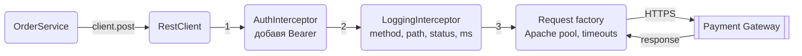
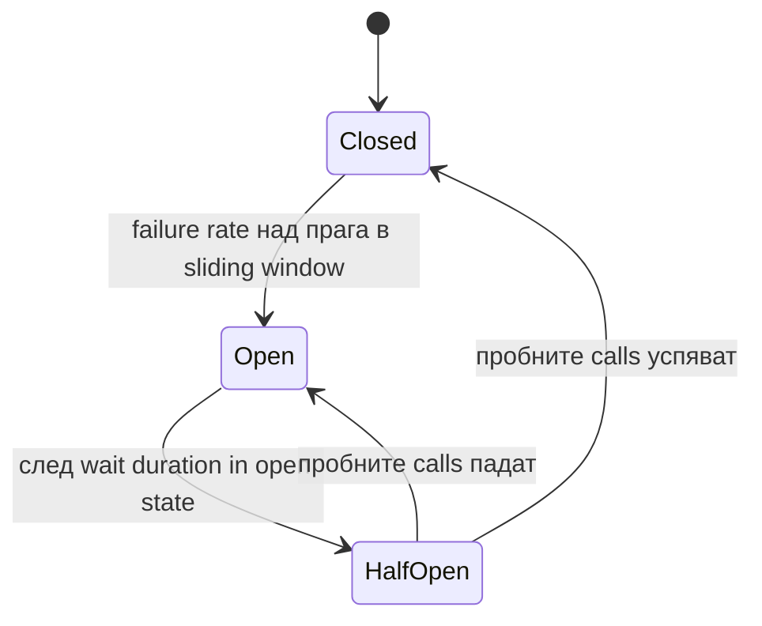

# HTTP клиенти

Почти всеки сървис говори с други сървиси по HTTP: платежен gateway, вътрешен микросървис, публично API за валутни курсове. Тук виждаш кой клиент да избереш в Spring Boot 3.5 (`RestClient` за синхронен код, декларативни `@HttpExchange` интерфейси, `WebClient` само когато ти трябва reactive или streaming), как да конфигурираш timeouts и connection pool, как да добавиш authentication и resilience с Resilience4j, и как да тестваш всичко това без да удряш реалния външен сървис. В края има пълен пример с `PaymentGatewayClient` и неговия тест, който може да копираш като шаблон.

## 1. Избор на клиент

| Клиент | Модел | Състояние | Кога |
|---|---|---|---|
| `RestClient` | синхронен, fluent API | актуален, от Spring 6.1 | Нов код в Spring MVC |
| `@HttpExchange` интерфейси | декларативен, върху `RestClient` или `WebClient` | актуален | API с много методи, чист код в сървисите |
| `WebClient` | reactive, non-blocking | актуален | WebFlux, streaming, масивен паралелизъм |
| OpenFeign | декларативен, Spring Cloud | поддържан | Екипи, които вече са на Spring Cloud |
| `RestTemplate` | синхронен | maintenance mode | Не започвай нищо ново с него |
| `java.net.http.HttpClient` | синхронен и async, без Spring | JDK | Библиотеки без Spring, прости скриптове |

Препоръка за нов сървис: `RestClient` за всеки външен API, опакован в `@HttpExchange` интерфейс, когато методите станат повече от няколко. `WebClient` само при реална нужда от reactive. `RestTemplate` не се маха от Spring, но не получава нови функции и няма причина да го ползваш в нов код.

Защо `RestClient`, а не директно `java.net.http.HttpClient`: Boot ти дава автоконфигуриран `RestClient.Builder` с message converters, Micrometer метрики, trace propagation и `RestClientCustomizer` hook-ове. Губиш всичко това, ако заобиколиш Spring.

## 2. Зависимости и настройка

`RestClient` е в `spring-web`, тоест вече го имаш със `spring-boot-starter-web`. Останалото е по избор.

```xml pom.xml
<!-- Apache HttpClient 5 за connection pooling, версията е от Boot -->
<dependency>
    <groupId>org.apache.httpcomponents.client5</groupId>
    <artifactId>httpclient5</artifactId>
</dependency>

<!-- Resilience4j: retry, circuit breaker, rate limiter. Изисква AOP -->
<dependency>
    <groupId>io.github.resilience4j</groupId>
    <artifactId>resilience4j-spring-boot3</artifactId>
    <version>2.3.0</version> <!-- виж последната версия в Maven Central -->
</dependency>
<dependency>
    <groupId>org.springframework.boot</groupId>
    <artifactId>spring-boot-starter-aop</artifactId>
</dependency>

```

За OAuth2 към външни API добавяш `spring-boot-starter-oauth2-client`, за тестове `org.wiremock:wiremock-standalone` с `test` scope. От Boot 3.4 глобалните timeouts и типът request factory се задават със `spring.http.client.*`:

```yaml src/main/resources/application.yml
spring:
  http:
    client:
      factory: http-components   # jdk, http-components, simple
      connect-timeout: 2s
      read-timeout: 10s

payments:
  base-url: https://api.payments.example.com
  api-key: ${PAYMENTS_API_KEY}
```

## 3. Минимален работещ пример

Един bean на външно API, построен от автоконфигурирания `RestClient.Builder`. Builder-ът е `prototype` scope, така че всяко инжектиране ти дава ново копие с вече закачени converters, observation и customizers.

```java src/main/java/com/acme/shop/common/http/PaymentsClientConfig.java
package com.acme.shop.common.http;

import org.springframework.web.client.RestClient;

@Configuration
class PaymentsClientConfig {

    @Bean
    RestClient paymentsRestClient(RestClient.Builder builder,
                                  @Value("${payments.base-url}") String baseUrl,
                                  @Value("${payments.api-key}") String apiKey) {
        return builder
                .baseUrl(baseUrl)
                .defaultHeader(HttpHeaders.AUTHORIZATION, "Bearer " + apiKey)
                .defaultHeader(HttpHeaders.ACCEPT, MediaType.APPLICATION_JSON_VALUE)
                .build();
    }
}
```

```java src/main/java/com/acme/shop/payment/PaymentsClient.java
package com.acme.shop.payment;

import org.springframework.core.ParameterizedTypeReference;
import org.springframework.stereotype.Component;
import org.springframework.web.client.RestClient;

import java.util.List;

@Component
public class PaymentsClient {

    private final RestClient client;

    PaymentsClient(RestClient paymentsRestClient) {
        this.client = paymentsRestClient;
    }

    public PaymentDto get(String paymentId) {
        return client.get()
                .uri("/payments/{id}", paymentId)
                .retrieve()
                .body(PaymentDto.class);
    }

    public List<PaymentDto> listForOrder(long orderId) {
        return client.get()
                .uri(b -> b.path("/payments").queryParam("orderId", orderId).build())
                .retrieve()
                .body(new ParameterizedTypeReference<List<PaymentDto>>() {});
    }
}

record CreatePaymentRequest(long orderId, long amountMinor, String currency, String idempotencyKey) {}
record PaymentDto(String id, long orderId, long amountMinor, String currency, String status) {}
```

Какво се вижда тук:

- `uri("/payments/{id}", paymentId)` прави URL encoding на променливата. Никога не лепи стойности със string concatenation: губиш encoding и отваряш врата за injection в path-а.
- `body(Class)` връща само тялото, `toEntity(Class)` връща `ResponseEntity` с headers и статус. `ParameterizedTypeReference` е задължителен за generics като `List<PaymentDto>`. POST е `client.post().uri("/payments").body(request).retrieve().toEntity(PaymentDto.class)`.
- При 4xx или 5xx `retrieve()` хвърля `HttpClientErrorException` или `HttpServerErrorException` (и двете наследяват `RestClientResponseException`). Timeout или отказана връзка хвърлят `ResourceAccessException`.

## 4. Timeouts и request factory

Без зададени timeouts един увиснал външен сървис бавно изяжда всички threads на твоя Tomcat. Задавай ги винаги.

| Timeout | Какво ограничава | Типична стойност |
|---|---|---|
| connect | установяване на TCP връзка | 1 до 3 секунди |
| read (socket) | пауза между два байта от отговора | 5 до 30 секунди, по endpoint |
| overall budget | целият call заедно с retries | смята се от read timeout и retry настройките |

Глобалните `spring.http.client.connect-timeout` и `read-timeout` се прилагат върху автоконфигурирания builder. Когато един API има нужда от различни стойности, ги задаваш програмно с `ClientHttpRequestFactorySettings` и `ClientHttpRequestFactoryBuilder` (Boot 3.4+):

```java src/main/java/com/acme/shop/common/http/PaymentsClientConfig.java
import org.springframework.boot.http.client.ClientHttpRequestFactoryBuilder;
import org.springframework.boot.http.client.ClientHttpRequestFactorySettings;

import java.time.Duration;

@Bean
RestClient paymentsRestClient(RestClient.Builder builder,
                              @Value("${payments.base-url}") String baseUrl) {
    var settings = ClientHttpRequestFactorySettings.defaults()
            .withConnectTimeout(Duration.ofSeconds(2))
            .withReadTimeout(Duration.ofSeconds(8));

    return builder
            .baseUrl(baseUrl)
            .requestFactory(ClientHttpRequestFactoryBuilder.httpComponents().build(settings))
            .build();
}
```

`ClientHttpRequestFactoryBuilder.jdk()` дава `JdkClientHttpRequestFactory` върху `java.net.http.HttpClient` (без нови зависимости, с HTTP/2). `httpComponents()` дава `HttpComponentsClientHttpRequestFactory` върху Apache HttpClient 5 с фин контрол на pool-а (раздел 9). Без помощниците на Boot същото е `new JdkClientHttpRequestFactory(httpClient)` плюс `setReadTimeout(...)`.

Правило: connect timeout къс и общ за всички API. Read timeout по endpoint: търсене с 2 секунди, генериране на PDF отсреща с 30. Ако един API има много различни read timeouts, направи два `RestClient` bean-а, вместо да вдигаш общия.

## 5. Обработка на грешки

Най-чистият модел: HTTP статусите се превеждат в domain exceptions още в клиента, така че сървисът над него не знае нищо за HTTP.

```java src/main/java/com/acme/shop/payment/PaymentsClient.java
import org.springframework.http.HttpStatusCode;

public PaymentDto get(String paymentId) {
    return client.get()
            .uri("/payments/{id}", paymentId)
            .retrieve()
            .onStatus(status -> status.value() == 404, (req, res) -> {
                throw new PaymentNotFoundException(paymentId);
            })
            .onStatus(HttpStatusCode::is4xxClientError, (req, res) -> {
                throw new PaymentRejectedException(res.getStatusCode().value());
            })
            .onStatus(HttpStatusCode::is5xxServerError, (req, res) -> {
                throw new PaymentGatewayUnavailableException(res.getStatusCode().value());
            })
            .body(PaymentDto.class);
}
```

Разделението 4xx срещу 5xx е важно за retry логиката: 4xx означава, че заявката ти е грешна и повтарянето няма да помогне, а 5xx и мрежови грешки са кандидати за retry. Затова `PaymentRejectedException` не е в `retry-exceptions`, а `PaymentGatewayUnavailableException` е. В `onStatus` handler-а имаш `res.getBody()` като `InputStream`, ако отсрещното API връща полезно тяло на грешката.

Без `onStatus` получаваш `RestClientResponseException` (или подкласовете `HttpClientErrorException.NotFound` и подобни) с `getStatusCode()` и `getResponseBodyAsString()`, които можеш да хванеш с обикновен `catch`. `e.getResponseBodyAs(ProblemDetail.class)` е удобно, когато отсрещното API връща RFC 9457 грешки. Как твоят `@RestControllerAdvice` превежда тези domain exceptions към `ProblemDetail`: [Грешки и ProblemDetail](Exception_Handling.md).

## 6. Interceptors

`ClientHttpRequestInterceptor` е еквивалентът на servlet filter за изходящи заявки. Там слагаш auth headers, correlation headers и логване.



```java src/main/java/com/acme/shop/common/http/OutboundLoggingInterceptor.java
package com.acme.shop.common.http;

import org.springframework.http.HttpRequest;
import org.springframework.http.client.ClientHttpRequestExecution;
import org.springframework.http.client.ClientHttpRequestInterceptor;
import org.springframework.http.client.ClientHttpResponse;

import java.io.IOException;

public class OutboundLoggingInterceptor implements ClientHttpRequestInterceptor {

    private static final Logger log = LoggerFactory.getLogger(OutboundLoggingInterceptor.class);

    @Override
    public ClientHttpResponse intercept(HttpRequest request, byte[] body,
                                        ClientHttpRequestExecution execution) throws IOException {
        long start = System.nanoTime();
        ClientHttpResponse response = execution.execute(request, body);
        long ms = (System.nanoTime() - start) / 1_000_000;
        log.info("outbound {} {} -> {} in {}ms",
                request.getMethod(), request.getURI().getPath(), response.getStatusCode().value(), ms);
        return response;
    }
}
```

Закачат се с `builder.requestInterceptor(...)` и се изпълняват в реда, в който са добавени. Ако искаш да логваш и тялото на отговора в interceptor, трябва да увиеш factory-то в `BufferingClientHttpRequestFactory`, иначе четеш `InputStream`-а веднъж и message converter-ът после получава празно тяло. Буферирането държи цялото тяло в памет, така че не го ползвай за клиент, който тегли големи файлове. Trace headers (`traceparent`) не ги добавяш ръчно: автоконфигурираният builder вече има `ObservationRegistry` и Micrometer Tracing ги инжектира сам, виж [Observability](Observability.md).

## 7. Декларативни HTTP интерфейси

Когато клиентът порасне, fluent кодът се повтаря. `@HttpExchange` интерфейсите го свиват до сигнатури, а Spring генерира proxy върху твоя `RestClient`.

```java src/main/java/com/acme/shop/payment/PaymentsApi.java
package com.acme.shop.payment;

import org.springframework.web.bind.annotation.PathVariable;
import org.springframework.web.bind.annotation.RequestBody;
import org.springframework.web.bind.annotation.RequestParam;
import org.springframework.web.service.annotation.GetExchange;
import org.springframework.web.service.annotation.HttpExchange;
import org.springframework.web.service.annotation.PostExchange;

import java.util.List;

@HttpExchange(url = "/payments", accept = "application/json")
public interface PaymentsApi {

    @GetExchange("/{id}")
    PaymentDto get(@PathVariable String id);

    @GetExchange
    List<PaymentDto> listForOrder(@RequestParam long orderId);

    @PostExchange(contentType = "application/json")
    ResponseEntity<PaymentDto> create(@RequestBody CreatePaymentRequest request);
}
```

Един конфигурационен клас създава всички proxy-та:

```java src/main/java/com/acme/shop/common/http/HttpInterfacesConfig.java
package com.acme.shop.common.http;

import org.springframework.web.client.support.RestClientAdapter;
import org.springframework.web.service.invoker.HttpServiceProxyFactory;

@Configuration
class HttpInterfacesConfig {

    @Bean
    PaymentsApi paymentsApi(RestClient paymentsRestClient) {
        return HttpServiceProxyFactory
                .builderFor(RestClientAdapter.create(paymentsRestClient))
                .build()
                .createClient(PaymentsApi.class);
    }
}
```

Грешките се обработват в `RestClient`-а, върху който е построен proxy-то: `defaultStatusHandler(HttpStatusCode::is5xxServerError, (req, res) -> { throw ...; })` на builder-а играе ролята на общ `onStatus` за всички методи в интерфейса.

### Сравнение с Feign

| | `@HttpExchange` | OpenFeign |
|---|---|---|
| Зависимост | само `spring-web` | `spring-cloud-starter-openfeign` + Spring Cloud BOM |
| Анотации | Spring MVC стил | Същите или Feign contract |
| Resilience | Resilience4j анотации върху извикващия код | Вграден през Spring Cloud CircuitBreaker |
| Load balancing | не, нужен ти е gateway или DNS | да, със Spring Cloud LoadBalancer |
| Тест | `MockRestServiceServer` директно | WireMock |

### OpenFeign накратко

Ако екипът вече е на Spring Cloud и Feign, няма смисъл да мигрираш. За нов сървис без Spring Cloud `@HttpExchange` е по-малко магия и една зависимост по-малко.

```java src/main/java/com/acme/shop/payment/PaymentsFeignClient.java
package com.acme.shop.payment;

@FeignClient(name = "payments", url = "${payments.base-url}", configuration = PaymentsFeignConfig.class)
public interface PaymentsFeignClient {

    @GetMapping("/payments/{id}")
    PaymentDto get(@PathVariable("id") String id);
}
```

Включва се с `@EnableFeignClients` върху application класа. Timeouts: `spring.cloud.openfeign.client.config.payments.connect-timeout: 2000` и `read-timeout: 8000` (милисекунди). Грешките идват като `FeignException`, а за превод към domain exceptions се пише `ErrorDecoder` bean. Версията на Spring Cloud идва от `spring-cloud-dependencies` BOM и трябва да е съвместима с Boot (за 3.5.x това е Spring Cloud 2025.0.x).

## 8. WebClient

`WebClient` идва със `spring-boot-starter-webflux`. В MVC приложение го добавяш само когато ти трябва нещо, което `RestClient` не прави: Server-Sent Events от външен сървис, backpressure, или стотици паралелни calls без да държиш thread на всеки.

Bean-ът се строи от автоконфигурирания `WebClient.Builder` по същия начин като `RestClient`.

```java
public Flux<RateDto> streamRates() {
    return ratesWebClient.get()
            .uri("/rates/stream")
            .accept(MediaType.TEXT_EVENT_STREAM)
            .retrieve()
            .bodyToFlux(RateDto.class);
}

public RateDto latest(String currency) {
    return ratesWebClient.get().uri("/rates/{c}", currency)
            .exchangeToMono(res -> res.statusCode().is2xxSuccessful()
                    ? res.bodyToMono(RateDto.class) : res.createError())
            .block(Duration.ofSeconds(5));
}
```

`block()` в MVC е допустим (ти така или иначе си на servlet thread), но го слагай винаги с timeout. Не го викай от reactive контекст, там хвърля `IllegalStateException`. При включени виртуални нишки `RestClient` ти дава същия паралелизъм без да сменяш програмния модел, което за повечето MVC сървиси прави `WebClient` ненужен.

## 9. Connection pooling и виртуални нишки

Apache HttpClient 5 с pool: едни и същи TCP връзки се преизползват (keep-alive), а `maxPerRoute` ограничава колко едновременни връзки отваряш към един host, което защитава и теб, и отсрещното API.

```java src/main/java/com/acme/shop/common/http/HttpClientConfig.java
import org.apache.hc.client5.http.config.ConnectionConfig;
import org.apache.hc.client5.http.impl.classic.HttpClients;
import org.apache.hc.client5.http.impl.io.PoolingHttpClientConnectionManagerBuilder;
import org.apache.hc.core5.util.TimeValue;
import org.apache.hc.core5.util.Timeout;
import org.springframework.http.client.HttpComponentsClientHttpRequestFactory;

@Bean
HttpComponentsClientHttpRequestFactory pooledRequestFactory() {
    var connectionManager = PoolingHttpClientConnectionManagerBuilder.create()
            .setMaxConnTotal(200)
            .setMaxConnPerRoute(50)
            .setDefaultConnectionConfig(ConnectionConfig.custom()
                    .setConnectTimeout(Timeout.ofSeconds(2))
                    .setSocketTimeout(Timeout.ofSeconds(8))
                    .setTimeToLive(TimeValue.ofMinutes(5))
                    .build())
            .build();

    var httpClient = HttpClients.custom()
            .setConnectionManager(connectionManager)
            .evictIdleConnections(TimeValue.ofSeconds(30))
            .evictExpiredConnections()
            .build();

    return new HttpComponentsClientHttpRequestFactory(httpClient);
}
```

`setTimeToLive` принуждава връзките да се пресъздават периодично, което е важно зад load balancer, който сменя IP адреси. Pool-ът се споделя между всички `RestClient`-и, които го ползват, така че `maxConnTotal` е общият лимит към всички външни системи.

Виртуални нишки (`spring.threads.virtual.enabled=true`): блокиращ HTTP call вече не държи platform thread, така че хиляда паралелни заявки са евтини. Pool-ът обаче остава реален лимит: 50 връзки към route означават, че 51-вата нишка чака. При виртуални нишки обикновено вдигаш `maxPerRoute`, защото бутилката вече не е броят threads, а колко connections отсрещното API може да поеме. На Java 21 `synchronized` блокове в стари HTTP библиотеки pin-ват виртуалната нишка (решено от Java 24).

## 10. Authentication към външни API

Статичен API key: `defaultHeader` или interceptor, ключът идва от environment или secret manager, никога от git ([Конфигурация и профили](Configuration_Profiles.md)).

Когато външното API изисква OAuth2 token, Spring Security ти дава `OAuth2AuthorizedClientManager`, който взима token, кешира го и го подновява преди изтичане. Не пиши сам логика за refresh.

```yaml src/main/resources/application.yml
spring:
  security:
    oauth2:
      client:
        registration:
          payments:
            client-id: ${PAYMENTS_CLIENT_ID}
            client-secret: ${PAYMENTS_CLIENT_SECRET}
            authorization-grant-type: client_credentials
            provider: payments-idp
        provider:
          payments-idp:
            token-uri: https://auth.payments.example.com/oauth2/token
```

```java src/main/java/com/acme/shop/common/http/OAuth2ClientConfig.java
package com.acme.shop.common.http;

import org.springframework.security.oauth2.client.AuthorizedClientServiceOAuth2AuthorizedClientManager;
import org.springframework.security.oauth2.client.OAuth2AuthorizedClientManager;
import org.springframework.security.oauth2.client.OAuth2AuthorizedClientProviderBuilder;
import org.springframework.security.oauth2.client.OAuth2AuthorizedClientService;
import org.springframework.security.oauth2.client.registration.ClientRegistrationRepository;

@Configuration
class OAuth2ClientConfig {

    @Bean
    OAuth2AuthorizedClientManager authorizedClientManager(ClientRegistrationRepository registrations,
                                                          OAuth2AuthorizedClientService clientService) {
        var manager = new AuthorizedClientServiceOAuth2AuthorizedClientManager(registrations, clientService);
        manager.setAuthorizedClientProvider(
                OAuth2AuthorizedClientProviderBuilder.builder().clientCredentials().build());
        return manager;
    }
}
```

`AuthorizedClientServiceOAuth2AuthorizedClientManager` работи извън HTTP request (scheduled jobs, Kafka listeners), за разлика от `DefaultOAuth2AuthorizedClientManager`, който очаква `HttpServletRequest`. За сървис към сървис това е правилният избор. Interceptor, който добавя token-а:

```java src/main/java/com/acme/shop/common/http/OAuth2ClientCredentialsInterceptor.java
package com.acme.shop.common.http;

import org.springframework.security.oauth2.client.OAuth2AuthorizeRequest;

public class OAuth2ClientCredentialsInterceptor implements ClientHttpRequestInterceptor {

    private final OAuth2AuthorizedClientManager manager;
    private final String registrationId;

    public OAuth2ClientCredentialsInterceptor(OAuth2AuthorizedClientManager manager, String registrationId) {
        this.manager = manager;
        this.registrationId = registrationId;
    }

    @Override
    public ClientHttpResponse intercept(HttpRequest request, byte[] body,
                                        ClientHttpRequestExecution execution) throws IOException {
        var authorizeRequest = OAuth2AuthorizeRequest
                .withClientRegistrationId(registrationId)
                .principal("orders-service")   // системен principal, няма реален потребител
                .build();
        var client = manager.authorize(authorizeRequest);
        if (client == null) {
            throw new IllegalStateException("Could not obtain OAuth2 token for " + registrationId);
        }
        request.getHeaders().setBearerAuth(client.getAccessToken().getTokenValue());
        return execution.execute(request, body);
    }
}
```

`manager.authorize` връща кеширания token, докато е валиден, и автоматично взима нов, когато изтече. Spring Security 6.4+ има и готов `OAuth2ClientHttpRequestInterceptor` в пакет `org.springframework.security.oauth2.client.web.client`, който прави същото и се конфигурира със `setClientRegistrationIdResolver`. Ползвай него, ако версията ти го има; горният код показва какво се случва отвътре.

## 11. Resilience с Resilience4j

Външните API падат, бавят се и връщат 503. Твоят сървис трябва да оцелява при това, без да тегли и себе си надолу. Resilience4j дава пет декоратора, конфигурирани в yaml и приложени с анотации върху Spring bean методи (`spring-boot-starter-aop` е задължителен).

| Декоратор | Защитава от | Ключови настройки |
|---|---|---|
| `@Retry` | кратки мрежови грешки, 503 | `max-attempts`, backoff, `retry-exceptions` |
| `@CircuitBreaker` | каскадни откази, когато отсреща е паднало | `failure-rate-threshold`, `wait-duration-in-open-state` |
| `@TimeLimiter` | общ бюджет на call-а, само за `CompletableFuture` | `timeout-duration` |
| `@Bulkhead` | изчерпване на threads от един бавен API | `max-concurrent-calls` |
| `@RateLimiter` | превишаване на квотата на отсрещното API | `limit-for-period`, `limit-refresh-period` |

```java src/main/java/com/acme/shop/payment/PaymentsClient.java
import io.github.resilience4j.circuitbreaker.CallNotPermittedException;
import io.github.resilience4j.circuitbreaker.annotation.CircuitBreaker;
import io.github.resilience4j.retry.annotation.Retry;

@Retry(name = "payments")
@CircuitBreaker(name = "payments", fallbackMethod = "getFallback")
public PaymentDto get(String paymentId) {
    return client.get().uri("/payments/{id}", paymentId).retrieve().body(PaymentDto.class);
}

// Същата сигнатура плюс exception като последен параметър
PaymentDto getFallback(String paymentId, CallNotPermittedException e) {
    throw new PaymentGatewayUnavailableException(503);
}
```

```yaml src/main/resources/application.yml
resilience4j:
  retry:
    instances:
      payments:
        max-attempts: 3
        wait-duration: 300ms
        enable-exponential-backoff: true
        exponential-backoff-multiplier: 2
        enable-randomized-wait: true
        randomized-wait-factor: 0.5
        retry-exceptions:
          - com.acme.shop.payment.PaymentGatewayUnavailableException
        ignore-exceptions:
          - com.acme.shop.payment.PaymentRejectedException
          - com.acme.shop.payment.PaymentNotFoundException
  circuitbreaker:
    instances:
      payments:
        sliding-window-size: 20
        minimum-number-of-calls: 10
        failure-rate-threshold: 50
        wait-duration-in-open-state: 30s
        permitted-number-of-calls-in-half-open-state: 3
        record-exceptions:
          - com.acme.shop.payment.PaymentGatewayUnavailableException
        register-health-indicator: true
  timelimiter:
    instances:
      payments:
        timeout-duration: 5s
```

### Ред на анотациите

Resilience4j прилага aspect-ите в фиксиран ред, независимо как си подредил анотациите: `Retry( CircuitBreaker( RateLimiter( TimeLimiter( Bulkhead( метод ) ) ) ) )`. Retry е най-отвън, тоест всеки опит минава през circuit breaker-а и се брои като отделен call. Това е желаното поведение: ако breaker-ът е отворен, retry спира веднага с `CallNotPermittedException`. Редът се сменя с `resilience4j.retry.retry-aspect-order` и аналогичните properties, но рядко има причина.

Анотациите работят само за calls през Spring proxy. Извикване на `this.get()` от друг метод в същия клас заобикаля всичко, виж [Middleware](Middleware.md) за механизма на proxy-тата.

### Състояния на circuit breaker



В `Closed` всичко минава и се мери. Когато в последните `sliding-window-size` calls (след поне `minimum-number-of-calls`) процентът грешки надхвърли `failure-rate-threshold`, breaker-ът става `Open` и всеки call веднага хвърля `CallNotPermittedException`, без да удря мрежата. След `wait-duration-in-open-state` пуска `permitted-number-of-calls-in-half-open-state` пробни calls и по тях решава. Fallback-ът трябва да връща нещо смислено за бизнеса: кеширана стойност, "опитай по-късно", или exception, който `@RestControllerAdvice` превежда в 503.

Какво брои за грешка: по подразбиране всяко exception. С `record-exceptions` и `ignore-exceptions` го стесняваш, така че 404 (твоята `PaymentNotFoundException`) да не отваря breaker-а.

### TimeLimiter, Bulkhead и бюджет

`@TimeLimiter` работи само с методи, връщащи `CompletableFuture`, защото трябва да може да прекъсне чакането: `@TimeLimiter(name = "payments") public CompletableFuture<PaymentDto> getAsync(String id)`. `@Bulkhead(name = "payments")` с `max-concurrent-calls` ограничава колко нишки могат едновременно да чакат един бавен API. За синхронен код read timeout-ът на request factory-то върши работата на time limiter за единичния call, а retry настройките определят общия бюджет: 3 опита по 8 секунди read timeout плюс backoff е до 30 секунди в най-лошия случай. Сметни го и реши дали е приемливо за потребителя, който чака.

### Метрики

Със `spring-boot-starter-actuator` Resilience4j регистрира `resilience4j.circuitbreaker.state`, `resilience4j.circuitbreaker.calls`, `resilience4j.retry.calls` и т.н. в Micrometer. `register-health-indicator: true` добавя breaker-а в `/actuator/health`, което е удобно, но го сложи в отделна health group, не в readiness, иначе един паднал външен API вади твоя pod от ротация.

## 12. Idempotency и безопасни retries

Retry е безопасен само ако повторението не причинява двоен ефект. Правила:

- GET, HEAD, PUT, DELETE са идемпотентни по дефиниция на HTTP. Retry-вай ги свободно.
- POST не е. Повторен `POST /payments` след timeout може да значи двойно теглене от карта. Retry-ваш POST само ако изпращаш `Idempotency-Key` header и отсрещното API го поддържа (Stripe, повечето платежни gateway-и).
- Генерирай ключа преди първия опит и го пази за всички retries на същата операция. Добър източник е твоят собствен `orderId` плюс тип на операцията, не `UUID.randomUUID()` при всеки опит.
- Jitter (`enable-randomized-wait`) е задължителен: без него всички instance-и на сървиса ти retry-ват в един и същ момент и правят thundering herd върху вече затруднено API.
- Не retry-вай 4xx, освен 408 и 429. При 429 уважи `Retry-After`.

Пълният код с `Idempotency-Key` е в раздел 17. Същият принцип от другата страна, когато ти си сървърът: [Events](Events.md) и [Транзакции и locking](Transactions.md).

## 13. Паралелни calls

Агрегиране на данни от три API за една страница: последователно е 3 пъти по-бавно от нужното. С виртуални нишки най-простият вариант е executor с виртуална нишка на задача и `CompletableFuture`:

```java src/main/java/com/acme/shop/order/OrderSummaryService.java
import java.util.concurrent.CompletableFuture;
import java.util.concurrent.Executors;

public OrderSummary summary(long orderId) {
    try (var executor = Executors.newVirtualThreadPerTaskExecutor()) {
        var order = CompletableFuture.supplyAsync(() -> ordersApi.get(orderId), executor);
        var payments = CompletableFuture.supplyAsync(() -> paymentsApi.listForOrder(orderId), executor);
        var shipment = CompletableFuture.supplyAsync(() -> shippingApi.forOrder(orderId), executor);

        CompletableFuture.allOf(order, payments, shipment).join();
        return new OrderSummary(order.join(), payments.join(), shipment.join());
    }
}
```

`try-with-resources` върху executor-а чака всички задачи да приключат при излизане. `join()` хвърля `CompletionException`, която увива реалната грешка, така че я разопаковай в exception handler-а или с `exceptionally`. MDC и `SecurityContext` не се пренасят автоматично в новите нишки, виж [Logging](Logging.md) за `TaskDecorator`. Structured concurrency (`StructuredTaskScope`) е preview в Java 21, не го ползвай в production без `--enable-preview`.

## 14. Pagination и големи отговори

Обхождане на cursor pagination на външно API:

```java src/main/java/com/acme/shop/payment/PaymentsClient.java
public List<PaymentDto> allForCustomer(String customerId) {
    var result = new ArrayList<PaymentDto>();
    String cursor = null;
    do {
        final String c = cursor;
        PageDto page = client.get()
                .uri(b -> b.path("/payments")
                        .queryParam("customerId", customerId)
                        .queryParamIfPresent("cursor", Optional.ofNullable(c))
                        .queryParam("limit", 100)
                        .build())
                .retrieve()
                .body(PageDto.class);
        result.addAll(page.items());
        cursor = page.nextCursor();
    } while (cursor != null);
    return result;
}

record PageDto(List<PaymentDto> items, String nextCursor) {}
```

Сложи горна граница на броя страници или обработвай страницата веднага (запис в DB, изпращане в Kafka), вместо да събираш всичко в памет. Pagination от страната на твоето API: [Pagination](Pagination.md).

`retrieve().body(byte[].class)` чете всичко в памет. За файлове ползвай `exchange()`, който ти дава суровия отговор и `InputStream`:

```java src/main/java/com/acme/shop/payment/PaymentsClient.java
public void downloadInvoicePdf(String invoiceId, Path target) {
    client.get()
            .uri("/invoices/{id}/pdf", invoiceId)
            .exchange((request, response) -> {
                if (!response.getStatusCode().is2xxSuccessful()) {
                    throw new InvoiceNotFoundException(invoiceId);
                }
                try (var in = response.getBody()) {
                    Files.copy(in, target, StandardCopyOption.REPLACE_EXISTING);
                }
                return null;
            });
}
```

`exchange()` затваря отговора, когато lambda-та приключи, затова копирането трябва да е вътре. Не комбинирай с `BufferingClientHttpRequestFactory`. Съхранение на файлове: [Файлове](Files.md).

## 15. Webhooks: обратната посока

Webhook е външният сървис, който вика теб. Три правила: верифицирай подписа, отговаряй бързо с 2xx, обработвай идемпотентно, защото доставчиците retry-ват при всеки timeout.

```java src/main/java/com/acme/shop/payment/PaymentWebhookController.java
package com.acme.shop.payment;

import javax.crypto.Mac;
import javax.crypto.spec.SecretKeySpec;
import java.security.MessageDigest;
import java.util.HexFormat;

@RestController
@RequestMapping("/webhooks/payments")
class PaymentWebhookController {

    private final String secret;             // от payments.webhook-secret
    private final ApplicationEventPublisher events;
    private final ProcessedWebhookRepository processed;

    // конструкторът е пропуснат, обикновена constructor injection

    @PostMapping
    ResponseEntity<Void> receive(@RequestBody byte[] rawBody,
                                 @RequestHeader("X-Signature") String signature,
                                 @RequestHeader("X-Event-Id") String eventId) throws Exception {
        if (!validSignature(rawBody, signature)) {
            return ResponseEntity.status(401).build();
        }
        if (processed.existsById(eventId)) {
            return ResponseEntity.ok().build();   // дубликат от retry на доставчика
        }
        processed.save(new ProcessedWebhook(eventId));
        events.publishEvent(new PaymentWebhookReceived(eventId, rawBody));
        return ResponseEntity.accepted().build();
    }

    private boolean validSignature(byte[] body, String provided) throws Exception {
        var mac = Mac.getInstance("HmacSHA256");
        mac.init(new SecretKeySpec(secret.getBytes(StandardCharsets.UTF_8), "HmacSHA256"));
        var expected = HexFormat.of().formatHex(mac.doFinal(body));
        return MessageDigest.isEqual(expected.getBytes(StandardCharsets.UTF_8),
                provided.getBytes(StandardCharsets.UTF_8));
    }
}
```

Приемаш `byte[]`, не DTO, защото подписът се смята върху точните байтове, а Jackson би ги пренаредил. `MessageDigest.isEqual` е constant-time сравнение. Тежката работа отива в event listener или опашка, така че да върнеш отговор за милисекунди: [Events](Events.md), [Cron, @Async и опашки](Scheduling_Queues.md). Endpoint-ът трябва да е изключен от CSRF и от нормалната authentication: [Authentication](Authentication.md).

## 16. Observability и тестване

### Какво получаваш безплатно

Автоконфигурираният `RestClient.Builder` вече е свързан с `ObservationRegistry`. Без допълнителен код имаш:

- Micrometer метрика `http.client.requests` с tags `method`, `uri` (шаблонът `/payments/{id}`, не конкретният id), `status`, `outcome`, `client.name`. Ако подаваш готов URL string вместо шаблон с променливи, tag-ът `uri` става `none` и губиш разбивката по endpoint.
- Span за всеки call и `traceparent` header към отсрещния сървис, когато имаш Micrometer Tracing.

Ако построиш `RestClient.create()` сам, нищо от това не се случва. Подробности в [Observability](Observability.md), корелация в логовете по traceId в [Logging](Logging.md).

### MockRestServiceServer с @RestClientTest

Slice тест, който вдига само клиента и подменя мрежата с mock сървър:

```java src/test/java/com/acme/shop/payment/PaymentsClientTest.java
package com.acme.shop.payment;

import org.springframework.boot.test.autoconfigure.web.client.RestClientTest;
import org.springframework.test.web.client.MockRestServiceServer;

import static org.springframework.test.web.client.match.MockRestRequestMatchers.*;
import static org.springframework.test.web.client.response.MockRestResponseCreators.*;

@RestClientTest(PaymentsClient.class)
@Import(PaymentsClientConfig.class)
@TestPropertySource(properties = {
        "payments.base-url=https://payments.test",
        "payments.api-key=test-key"
})
class PaymentsClientTest {

    @Autowired PaymentsClient client;
    @Autowired MockRestServiceServer server;

    @Test
    void getReturnsPayment() {
        server.expect(requestTo("https://payments.test/payments/pay_1"))
                .andExpect(method(HttpMethod.GET))
                .andExpect(header("Authorization", "Bearer test-key"))
                .andRespond(withSuccess("""
                        {"id":"pay_1","orderId":42,"amountMinor":1999,"currency":"EUR","status":"PAID"}
                        """, MediaType.APPLICATION_JSON));

        assertThat(client.get("pay_1").status()).isEqualTo("PAID");
        server.verify();
    }

}
```

За грешки: `andRespond(withResourceNotFound())` и `assertThatThrownBy(...).isInstanceOf(PaymentNotFoundException.class)`. `@RestClientTest` регистрира `MockServerRestClientCustomizer` върху `RestClient.Builder`, затова bean-ът трябва да е построен от инжектирания builder. Ограничение: `MockRestServiceServer` не минава през реалния request factory, така че timeouts, pool и Resilience4j aspect-ите не се тестват тук.

### WireMock

WireMock е реален HTTP сървър в теста и тества целия път, включително timeouts, retry и circuit breaker. Stub със забавяне: `okJson("{}").withFixedDelay(9_000)` надхвърля read timeout-а; stub с мрежова повреда: `aResponse().withFault(Fault.CONNECTION_RESET_BY_PEER)`. Пълен тест с WireMock е в раздел 17. С `org.wiremock.integrations:wiremock-spring-boot` сървърът се вдига с `@EnableWireMock(@ConfigureWireMock(name = "payments", baseUrlProperties = "payments.base-url"))` върху тест класа и `@DynamicPropertySource` отпада (провери атрибута според версията, в 2.x беше `property`). За истински sandbox на доставчик ползвай отделен integration профил, който не се пуска при всеки build. Общата организация на тестовете: [Testing](Testing.md).

## 17. Пълен пример: PaymentGatewayClient

Всичко от документа в един клиент: timeouts, pool, auth, error mapping, idempotency, retry и circuit breaker.

```java src/main/java/com/acme/shop/payment/PaymentGatewayClient.java
package com.acme.shop.payment;

import io.github.resilience4j.circuitbreaker.CallNotPermittedException;
import io.github.resilience4j.circuitbreaker.annotation.CircuitBreaker;
import io.github.resilience4j.retry.annotation.Retry;
import org.springframework.http.HttpStatusCode;
import org.springframework.stereotype.Component;
import org.springframework.web.client.ResourceAccessException;
import org.springframework.web.client.RestClient;

@Component
public class PaymentGatewayClient {

    private final RestClient client;

    PaymentGatewayClient(RestClient paymentsRestClient) {
        this.client = paymentsRestClient;
    }

    @Retry(name = "payments")
    @CircuitBreaker(name = "payments", fallbackMethod = "unavailable")
    public PaymentDto charge(Order order) {
        var request = new CreatePaymentRequest(order.id(), order.totalMinor(), order.currency(),
                "charge-" + order.id());
        try {
            return client.post()
                    .uri("/payments")
                    .header("Idempotency-Key", request.idempotencyKey())
                    .body(request)
                    .retrieve()
                    .onStatus(s -> s.value() == 402, (req, res) -> {
                        throw new PaymentDeclinedException(order.id());
                    })
                    .onStatus(HttpStatusCode::is4xxClientError, (req, res) -> {
                        throw new PaymentRejectedException(res.getStatusCode().value());
                    })
                    .onStatus(HttpStatusCode::is5xxServerError, (req, res) -> {
                        throw new PaymentGatewayUnavailableException(res.getStatusCode().value());
                    })
                    .body(PaymentDto.class);
        } catch (ResourceAccessException e) {
            // timeout или отказана връзка: кандидат за retry
            throw new PaymentGatewayUnavailableException(e);
        }
    }

    PaymentDto unavailable(Order order, CallNotPermittedException e) {
        throw new PaymentGatewayUnavailableException(503);
    }
}
```

Exception класовете са обикновени `RuntimeException` с конструктори за статус и за cause.

Bean-ът `paymentsRestClient` е този от раздел 3 с `requestFactory(pooledRequestFactory)` от раздел 9 и двата interceptor-а `OAuth2ClientCredentialsInterceptor` и `OutboundLoggingInterceptor`. Resilience4j yaml-ът от раздел 11 с добавена `PaymentDeclinedException` в `ignore-exceptions` на retry и на circuit breaker-а. Тестът с WireMock проверява retry, идемпотентния header и circuit breaker-а:

```java src/test/java/com/acme/shop/payment/PaymentGatewayClientTest.java
package com.acme.shop.payment;

import com.github.tomakehurst.wiremock.WireMockServer;
import com.github.tomakehurst.wiremock.core.WireMockConfiguration;
import io.github.resilience4j.circuitbreaker.CircuitBreaker;
import io.github.resilience4j.circuitbreaker.CircuitBreakerRegistry;

import static com.github.tomakehurst.wiremock.client.WireMock.*;
import static org.mockito.BDDMockito.given;

@SpringBootTest
@TestPropertySource(properties = "resilience4j.retry.instances.payments.wait-duration=10ms")
class PaymentGatewayClientTest {

    static WireMockServer wiremock = new WireMockServer(WireMockConfiguration.options().dynamicPort());

    @BeforeAll static void start() { wiremock.start(); }
    @AfterAll static void stop() { wiremock.stop(); }

    @DynamicPropertySource
    static void props(DynamicPropertyRegistry r) {
        r.add("payments.base-url", wiremock::baseUrl);
    }

    @Autowired PaymentGatewayClient client;
    @Autowired CircuitBreakerRegistry breakers;

    @MockitoBean OAuth2AuthorizedClientManager authorizedClientManager;

    @BeforeEach
    void setUp() {
        wiremock.resetAll();
        breakers.circuitBreaker("payments").reset();
        var authorized = mock(OAuth2AuthorizedClient.class, RETURNS_DEEP_STUBS);
        given(authorized.getAccessToken().getTokenValue()).willReturn("test-token");
        given(authorizedClientManager.authorize(any())).willReturn(authorized);
    }

    @Test
    void chargeSendsIdempotencyKeyAndBearer() {
        wiremock.stubFor(post("/payments").willReturn(okJson("""
                {"id":"pay_1","orderId":42,"amountMinor":1999,"currency":"EUR","status":"PAID"}
                """)));

        var result = client.charge(new Order(42L, 1999L, "EUR"));

        assertThat(result.status()).isEqualTo("PAID");
        wiremock.verify(postRequestedFor(urlEqualTo("/payments"))
                .withHeader("Idempotency-Key", equalTo("charge-42"))
                .withHeader("Authorization", equalTo("Bearer test-token")));
    }

    @Test
    void retriesOn503ThenSucceeds() {
        wiremock.stubFor(post("/payments").inScenario("flaky").whenScenarioStateIs(STARTED)
                .willReturn(serviceUnavailable()).willSetStateTo("second"));
        wiremock.stubFor(post("/payments").inScenario("flaky").whenScenarioStateIs("second")
                .willReturn(okJson("{\"id\":\"pay_1\",\"orderId\":42,\"amountMinor\":1999,\"currency\":\"EUR\",\"status\":\"PAID\"}")));

        assertThat(client.charge(new Order(42L, 1999L, "EUR")).status()).isEqualTo("PAID");
        wiremock.verify(2, postRequestedFor(urlEqualTo("/payments")));
    }

    @Test
    void breakerOpensAfterRepeatedFailures() {
        wiremock.stubFor(post("/payments").willReturn(serviceUnavailable()));

        for (int i = 0; i < 10; i++) {
            assertThatThrownBy(() -> client.charge(new Order(42L, 1999L, "EUR")))
                    .isInstanceOf(PaymentGatewayUnavailableException.class);
        }

        assertThat(breakers.circuitBreaker("payments").getState()).isEqualTo(CircuitBreaker.State.OPEN);
    }
}
```

Четвърти тест, който си струва: stub с `status(402)`, очакване за `PaymentDeclinedException` и `wiremock.verify(1, ...)`, което доказва, че бизнес грешката не се retry-ва.

## 18. Капани

- Липсващи timeouts. Default-ът на JDK и Apache клиентите е без read timeout. Един увиснал външен сървис бавно блокира всички Tomcat threads и твоят сървис "пада" заради чужд проблем.
- `RestClient.create()` вместо инжектирания `RestClient.Builder`. Губиш метрики, trace propagation, `MockRestServiceServer` в тестовете и глобалните настройки от `spring.http.client.*`.
- URL със string concatenation. `"/payments/" + id` не прави encoding и прави `uri` tag-а в метриките уникален за всяка стойност (cardinality explosion в Prometheus). Ползвай `uri("/payments/{id}", id)`.
- Retry на POST без idempotency key. Timeout не означава, че отсреща нищо не е станало. Двойно таксуване е най-скъпият bug в тази категория.
- Retry на 4xx. Заявката ти е грешна, повторението само хаби квота и време. Разделяй 4xx и 5xx още в `onStatus`.
- Resilience4j анотации върху private метод или self-invocation. Aspect-ът не се прилага и ти мислиш, че имаш circuit breaker, а нямаш. Тествай с WireMock, не вярвай на анотацията.
- Circuit breaker в readiness probe. Паднал външен API вади всички твои pod-ове от Kubernetes, което е по-лошо от деградирал отговор. Дръж го в отделна health group.
- Логване на тела с токени и карти. Interceptor-ът за логване вижда всичко, включително `Authorization` header-а. Маскирай, виж [Logging](Logging.md).
- Споделен `RestClient` с `defaultHeader` за token, който изтича. `defaultHeader` се задава веднъж при build. За динамични токени ползвай interceptor, който ги взима при всеки call.
- Fallback, който крие проблема. Ако fallback-ът тихо връща празен списък, никой няма да разбере, че платежният gateway е паднал от час. Логвай и мери fallback-ите.

## 19. Чеклист

- [ ] Един `RestClient` bean на външно API, построен от инжектирания `RestClient.Builder`, с `baseUrl`.
- [ ] Connect timeout 1 до 3 секунди, read timeout подбран по endpoint, зададени явно.
- [ ] Apache HttpClient 5 с pool и `maxPerRoute` за API с голям трафик.
- [ ] `onStatus` превежда 4xx и 5xx в отделни domain exceptions.
- [ ] Auth чрез interceptor (API key или OAuth2 client credentials с `OAuth2AuthorizedClientManager`), секретите от environment.
- [ ] `@Retry` само за мрежови грешки и 5xx, с exponential backoff и jitter.
- [ ] `@CircuitBreaker` с fallback, който е смислен за бизнеса, и `ignore-exceptions` за бизнес грешките.
- [ ] POST retry само с `Idempotency-Key`.
- [ ] Над 3 до 4 метода: `@HttpExchange` интерфейс вместо fluent код в сървиса.
- [ ] Webhook endpoint-и с HMAC проверка върху суровите байтове и дедупликация по event id.
- [ ] `@RestClientTest` за mapping-а и WireMock тест за retry, timeout и breaker; `http.client.requests` има `uri` tag с шаблон.

## 20. Свързани документи

- [Грешки и ProblemDetail](Exception_Handling.md): как domain exceptions от клиента стават HTTP отговори за твоите потребители.
- [Observability](Observability.md): метрики `http.client.requests`, trace propagation и dashboard-и за външните зависимости.
- [Logging](Logging.md): корелация по traceId, MDC в executor-и, маскиране на чувствителни данни в outbound логове.
- [Testing](Testing.md): организация на slice и integration тестове, Testcontainers, context caching.
- [Events](Events.md): обработка на webhook събития извън request-а, идемпотентни consumer-и.
- [Middleware](Middleware.md): как работят Spring proxy-тата и защо self-invocation заобикаля `@Retry`.
- [Конфигурация и профили](Configuration_Profiles.md): base URL и секрети по environment.
- [Spring Framework reference: REST Clients](https://docs.spring.io/spring-framework/reference/integration/rest-clients.html)
- [Resilience4j Spring Boot 3 guide](https://resilience4j.readme.io/docs/getting-started-3)
