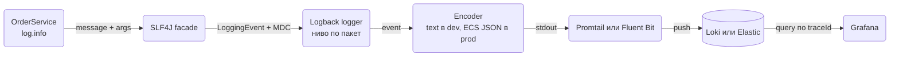
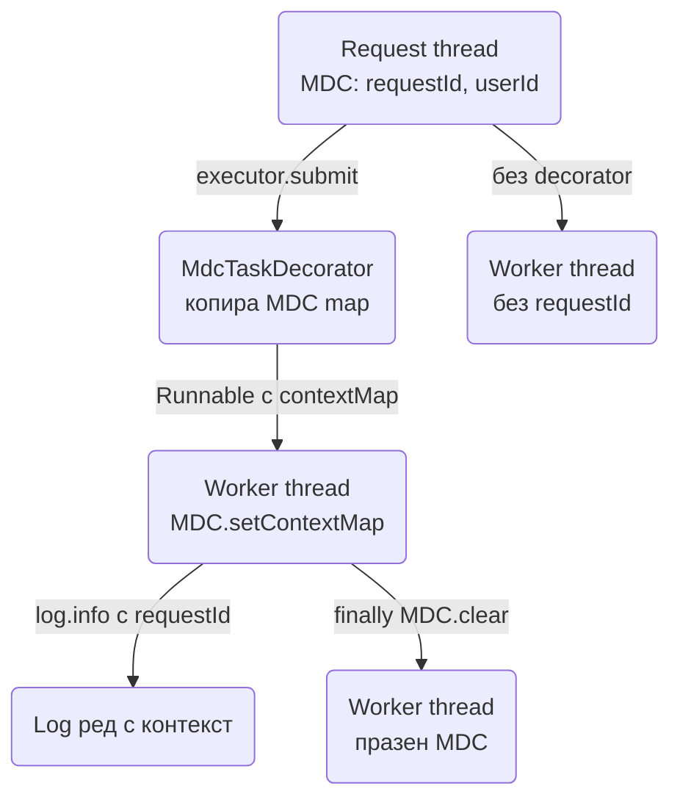
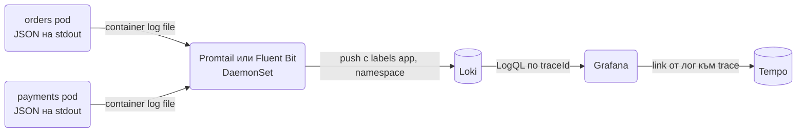

# Logging

Логовете са първото нещо, което отваряш, когато нещо се счупи в production, и последното, за което се мисли, докато се пише кодът. В Spring Boot имаш SLF4J като facade и Logback като default implementation, което покрива почти всичко: нива по пакет, JSON формат за агрегатор, MDC за корелация на заявки, смяна на ниво по време на работа през Actuator. Този документ показва как да пишеш log редове, които са полезни след шест месеца, как да ги конфигурираш по profile, как да пренасяш контекста (requestId, userId, traceId) през нишки и Kafka, какво никога не трябва да попада в лог, и как да тестваш логването. Целта е всеки нов сървис да изглежда еднакво в Grafana или Kibana от първия ден.

| Какво | Кога | Инструмент |
|---|---|---|
| Пишеш log ред | Навсякъде в кода | SLF4J `Logger`, Lombok `@Slf4j` |
| Ниво по пакет | dev срещу prod, debug на един модул | `logging.level.*` в `application.yml` |
| JSON за агрегатор | Production, Docker, Kubernetes | `logging.structured.format.console=ecs` |
| Контекст на заявка | requestId, userId, tenantId във всеки ред | MDC + servlet filter |
| Корелация между сървиси | traceId, spanId | Micrometer Tracing, автоматично в pattern-а |
| Смяна на ниво без рестарт | Debug на production проблем | Actuator `/actuator/loggers` |
| Проверка в тест | Че грешката се логва веднъж, на правилното ниво | `OutputCaptureExtension` |

## 1. Зависимости и настройка

`spring-boot-starter-web` (и всеки друг starter) дърпа `spring-boot-starter-logging`: SLF4J 2, Logback 1.5, плюс bridges за `java.util.logging` и Log4j API, така че библиотеки с други logging API-та също пишат през Logback. Не добавяш нищо за базовото логване.

```xml
<!-- По избор: Lombok за @Slf4j -->
<dependency>
    <groupId>org.projectlombok</groupId>
    <artifactId>lombok</artifactId>
    <optional>true</optional>
</dependency>

<!-- По избор: Actuator за /actuator/loggers -->
<dependency>
    <groupId>org.springframework.boot</groupId>
    <artifactId>spring-boot-starter-actuator</artifactId>
</dependency>
```

Минимална конфигурация за нов сървис:

```yaml
spring:
  application:
    name: orders

logging:
  level:
    root: info
    com.example.orders: debug
    org.springframework.web: info
    org.hibernate.SQL: info
  include-application-name: true
```

`spring.application.name` влиза в correlation prefix-а на всеки ред (`[orders,traceId,spanId]`), затова го задавай винаги. Ако имаш Log4j2 от старо решение, трябва да изключиш `spring-boot-starter-logging` и да добавиш `spring-boot-starter-log4j2`, но за нов сървис няма причина: Logback е default-ът, който Boot тества най-добре.

## 2. Минимален работещ пример

```java
package com.example.orders.service;

import org.slf4j.Logger;
import org.slf4j.LoggerFactory;
import org.springframework.stereotype.Service;

@Service
public class OrderService {

    private static final Logger log = LoggerFactory.getLogger(OrderService.class);

    private final OrderRepository orders;
    private final PaymentGatewayClient payments;

    public OrderService(OrderRepository orders, PaymentGatewayClient payments) {
        this.orders = orders;
        this.payments = payments;
    }

    public Order pay(long orderId) {
        var order = orders.findById(orderId).orElseThrow(() -> new OrderNotFoundException(orderId));
        log.debug("Paying order {} total={} currency={}", orderId, order.totalMinor(), order.currency());

        try {
            var payment = payments.charge(order);
            order.markPaid(payment.id());
            log.info("Order {} paid, paymentId={}", orderId, payment.id());
            return order;
        } catch (PaymentGatewayUnavailableException e) {
            log.warn("Payment gateway unavailable for order {}, will retry later", orderId, e);
            throw e;
        }
    }
}
```

Със Lombok същото е `@Slf4j` върху класа и полето `log` се генерира. Какво е важно в примера:

- Параметризирани съобщения `{}` вместо `"Order " + id`. Конкатенацията се изпълнява дори когато нивото е изключено; с `{}` SLF4J форматира само ако редът ще се запише.
- Exception като последен аргумент, без `{}` за него. SLF4J го разпознава и пише stack trace. `log.warn("... {}", e)` пише само `toString()` на exception-а и губиш trace-а.
- Ключ=стойност стил (`paymentId=...`) улеснява търсенето в Loki или Kibana и после се превръща в полета при JSON логване.

### Нива: кога кое

| Ниво | Кога | Пример |
|---|---|---|
| `ERROR` | Нещо се счупи и някой трябва да го види. Обикновено със stack trace | 5xx, неуспешен запис в DB, неочаквано exception |
| `WARN` | Нещо нередно, но системата се справи | retry на външен API, fallback, 4xx от клиент с грешни данни |
| `INFO` | Бизнес събития и lifecycle, малко на брой за заявка | поръчка платена, сървисът стартира, миграция приложена |
| `DEBUG` | Детайли за разработчика, изключени в prod | параметри на заявки, решения в бизнес логиката |
| `TRACE` | Байтове и всеки стъпка, почти никога | SQL bind параметри, HTTP тела |

Правило за production: `INFO` трябва да е четимо от човек, който дебъгва инцидент, без да се дави. Ако една заявка произвежда 20 INFO реда, повечето трябва да станат DEBUG.

### Скъпи съобщения

```java
if (log.isDebugEnabled()) {
    log.debug("Cart snapshot: {}", cart.toDetailedString());   // сериализацията е скъпа
}

// SLF4J 2 fluent API със supplier, същият ефект без if
log.atDebug()
   .addArgument(() -> cart.toDetailedString())
   .log("Cart snapshot: {}");
```

Guard-ът е нужен само когато самото изчисление на аргумента е скъпо. За обикновени полета `{}` е достатъчно.

## 3. Конфигурация в application.yml

```yaml
logging:
  level:
    root: info
    com.example.orders: debug
    org.springframework.web: debug          # mapping на заявки, resolve на handler-и
    org.springframework.security: debug     # защо една заявка е 401 или 403
    org.hibernate.SQL: debug                # SQL заявките
    org.hibernate.orm.jdbc.bind: trace      # bind параметрите към тях (Hibernate 6)
  pattern:
    console: "%d{HH:mm:ss.SSS} %5p [%15.15t] %-40.40logger{39} : %m%n%wEx"
  file:
    name: /var/log/orders/app.log
  logback:
    rollingpolicy:
      max-file-size: 50MB
      max-history: 14
      total-size-cap: 1GB
      file-name-pattern: ${LOG_FILE}.%d{yyyy-MM-dd}.%i.gz
```

Нивата се прилагат йерархично по пакет: `com.example.orders: debug` важи и за `com.example.orders.service`. `org.springframework.security: debug` е най-бързият начин да разбереш защо една заявка е спряна от Security filter chain (виж [Authentication](Authentication.md)). `org.hibernate.SQL: debug` е по-добро от `spring.jpa.show-sql=true`, защото минава през logger-а (с формат, ниво, JSON), а `show-sql` пише направо в stdout.

`logging.file.name` включва файлов appender с rolling policy. В Docker не го ползвай (раздел 11), но за VM deploy е стандартът.

### logback-spring.xml

Когато properties не стигат (отделен appender за audit, custom converter, различни формати по profile), пишеш `src/main/resources/logback-spring.xml`. Името със `-spring` е важно: така Boot го зарежда след като е прочел `application.yml` и `<springProfile>` и `<springProperty>` работят.

```xml
<?xml version="1.0" encoding="UTF-8"?>
<configuration>
    <include resource="org/springframework/boot/logging/logback/defaults.xml"/>
    <springProperty scope="context" name="appName" source="spring.application.name" defaultValue="app"/>

    <springProfile name="local | test">
        <include resource="org/springframework/boot/logging/logback/console-appender.xml"/>
        <root level="INFO">
            <appender-ref ref="CONSOLE"/>
        </root>
    </springProfile>

    <springProfile name="prod">
        <appender name="JSON" class="ch.qos.logback.core.ConsoleAppender">
            <encoder class="net.logstash.logback.encoder.LogstashEncoder">
                <customFields>{"service":"${appName}"}</customFields>
            </encoder>
        </appender>
        <root level="INFO">
            <appender-ref ref="JSON"/>
        </root>
    </springProfile>

    <logger name="com.example.orders" level="DEBUG"/>
</configuration>
```

`defaults.xml` дава стандартните Boot pattern-и и конверсии (`%wEx`, `%clr`). Ако имаш `logback-spring.xml`, `logging.pattern.*` в yaml спира да важи за appender-ите, които си дефинирал сам, а `logging.level.*` продължава да работи.

## 4. Структурирано JSON логване

В production логовете отиват в Loki, Elasticsearch или Datadog. Там един ред с plain text е string, в който търсиш с regex; един JSON ред е документ с полета `level`, `logger`, `traceId`, `orderId`, по които филтрираш и правиш графики. Затова в prod се логва JSON, а в dev четим текст.



### Boot 3.4+: вградена поддръжка

```yaml
logging:
  structured:
    format:
      console: ecs        # ecs, logstash или gelf
    ecs:
      service:
        name: orders
        version: ${BUILD_VERSION:dev}
        environment: ${ENVIRONMENT:local}
```

Това заменя console encoder-а с Elastic Common Schema JSON: `@timestamp`, `log.level`, `log.logger`, `message`, `error.stack_trace`, плюс всички MDC стойности като top-level полета. `logstash` формат дава полетата, които `logstash-logback-encoder` произвежда (`@timestamp`, `level`, `logger_name`, `mdc` полетата), ако агрегаторът ти вече е настроен за него. `logging.structured.format.file` прави същото за файловия appender.

От Boot 3.5 има и `logging.structured.json.add`, `exclude`, `rename` за дребни корекции без код:

```yaml
logging:
  structured:
    json:
      add:
        team: orders
        region: ${REGION:eu}
      exclude: process.thread.name
```

За нещо по-сложно имплементираш `StructuredLogFormatter<ILoggingEvent>` и подаваш пълното име на класа в `logging.structured.format.console`.

### Профил по environment

```yaml
# application.yml: default е четим текст
logging:
  pattern:
    console: "%d{HH:mm:ss.SSS} %clr(%5p) [%X{traceId:-},%X{spanId:-}] %clr(%-30.30logger{29}){cyan} : %m%n%wEx"

---
spring:
  config:
    activate:
      on-profile: prod
logging:
  structured:
    format:
      console: ecs
```

Как се организират профилите: [Конфигурация и профили](Configuration_Profiles.md).

### Boot под 3.4: logstash-logback-encoder

```xml
<dependency>
    <groupId>net.logstash.logback</groupId>
    <artifactId>logstash-logback-encoder</artifactId>
    <version>8.0</version> <!-- виж последната версия в Maven Central -->
</dependency>
```

Appender-ът с `LogstashEncoder` е показан в `logback-spring.xml` по-горе. Библиотеката остава полезна и на 3.4+, когато ти трябват неща като `StructuredArguments.kv("orderId", id)` за полета само в един ред:

```java
import static net.logstash.logback.argument.StructuredArguments.kv;

log.info("Order paid {} {}", kv("orderId", orderId), kv("paymentId", payment.id()));
```

## 5. MDC: контекст във всеки ред

MDC (Mapped Diagnostic Context) е `ThreadLocal` map, която Logback добавя към всеки log ред на текущата нишка. Там слагаш `requestId`, `userId`, `tenantId`, а Micrometer Tracing слага `traceId` и `spanId`. Резултатът: всеки ред от една заявка носи кой, какво и в кой trace, без да го подаваш като параметър.

### Filter, който пълни MDC

```java
package com.example.orders.web;

import jakarta.servlet.FilterChain;
import jakarta.servlet.ServletException;
import jakarta.servlet.http.HttpServletRequest;
import jakarta.servlet.http.HttpServletResponse;
import org.slf4j.MDC;
import org.springframework.core.Ordered;
import org.springframework.core.annotation.Order;
import org.springframework.stereotype.Component;
import org.springframework.web.filter.OncePerRequestFilter;

import java.io.IOException;
import java.util.UUID;

@Component
@Order(Ordered.HIGHEST_PRECEDENCE)
public class RequestContextFilter extends OncePerRequestFilter {

    @Override
    protected void doFilterInternal(HttpServletRequest request, HttpServletResponse response,
                                    FilterChain chain) throws ServletException, IOException {
        String requestId = request.getHeader("X-Request-Id");
        if (requestId == null || requestId.isBlank()) {
            requestId = UUID.randomUUID().toString();
        }
        response.setHeader("X-Request-Id", requestId);

        try (var ignored = MDC.putCloseable("requestId", requestId)) {
            MDC.put("tenantId", request.getHeader("X-Tenant-Id"));
            chain.doFilter(request, response);
        } finally {
            MDC.remove("tenantId");
        }
    }
}
```

`try/finally` е задължителен: Tomcat преизползва нишките и без почистване следващата заявка наследява чужд `requestId`. `MDC.putCloseable` прави това за един ключ; за няколко ключа или `MDC.clear()` във `finally`, или по едно `remove`.

`userId` го знаеш едва след Security filter chain, затова го слагаш във втори filter, подреден след `SecurityFilterChain`-а, или в `HandlerInterceptor.preHandle`, където `SecurityContextHolder` вече е попълнен. Как се подреждат filters и interceptors: [Middleware](Middleware.md).

```java
@Component
public class UserContextInterceptor implements HandlerInterceptor {

    @Override
    public boolean preHandle(HttpServletRequest request, HttpServletResponse response, Object handler) {
        var auth = SecurityContextHolder.getContext().getAuthentication();
        if (auth != null && auth.isAuthenticated()) {
            MDC.put("userId", auth.getName());
        }
        return true;
    }

    @Override
    public void afterCompletion(HttpServletRequest request, HttpServletResponse response,
                                Object handler, Exception ex) {
        MDC.remove("userId");
    }
}
```

Pattern-ът за конзола: `%X{requestId:-}` вмъква стойността или празно. В ECS JSON всички MDC ключове излизат автоматично като полета.

### Пренасяне в @Async и executors

MDC е `ThreadLocal`. Всичко, което сменя нишката (`@Async`, `CompletableFuture.supplyAsync`, `TaskExecutor`), започва с празен MDC. Решението е `TaskDecorator`, който копира MDC от извикващата нишка в работната:



```java
package com.example.orders.config;

import org.slf4j.MDC;
import org.springframework.context.annotation.Bean;
import org.springframework.context.annotation.Configuration;
import org.springframework.core.task.TaskDecorator;

import java.util.Map;

@Configuration
class AsyncConfig {

    @Bean
    TaskDecorator mdcTaskDecorator() {
        return runnable -> {
            Map<String, String> context = MDC.getCopyOfContextMap();
            return () -> {
                if (context != null) {
                    MDC.setContextMap(context);
                }
                try {
                    runnable.run();
                } finally {
                    MDC.clear();
                }
            };
        };
    }
}
```

Boot автоматично прилага `TaskDecorator` bean върху автоконфигурирания `ThreadPoolTaskExecutor` (този зад `@Async` и `spring.task.execution.*`). За собствен executor го подаваш с `executor.setTaskDecorator(mdcTaskDecorator)`. За `CompletableFuture.supplyAsync(..., executor)` подавай Spring executor, не `ForkJoinPool.commonPool()`. Повече за `@Async`: [Cron, @Async и опашки](Scheduling_Queues.md).

Ако ползваш Micrometer Tracing, `traceId` и `spanId` се пренасят в executor-и отделно, чрез `ContextPropagation` и `spring.threads.virtual` или `ContextExecutorService`; с `TaskDecorator` копираш целия MDC, което покрива и тях.

### Kafka listeners

Consumer-ът работи на нишка от listener container-а, без HTTP request. Контекстът идва от headers на съобщението: producer-ът ги слага, consumer-ът ги чете в MDC.

```java
@KafkaListener(topics = "orders.paid", groupId = "invoicing")
public void onOrderPaid(ConsumerRecord<String, OrderPaidEvent> record) {
    var header = record.headers().lastHeader("X-Request-Id");
    String requestId = header != null ? new String(header.value(), StandardCharsets.UTF_8) : "kafka-" + record.offset();

    try (var ignored = MDC.putCloseable("requestId", requestId)) {
        MDC.put("orderId", String.valueOf(record.value().orderId()));
        invoiceService.createFor(record.value());
    } finally {
        MDC.remove("orderId");
    }
}
```

За много listeners същото се изнася в `RecordInterceptor` bean, който работи за всички container-и. `traceId` през Kafka се пренася автоматично с `spring.kafka.listener.observation-enabled=true` и `spring.kafka.template.observation-enabled=true`, виж [Message brokers](Message_Brokers.md).

### traceId и spanId

Със `micrometer-tracing-bridge-otel` в classpath Boot добавя `traceId` и `spanId` в MDC и сменя default pattern-а на конзолата да включва `[orders,64f1a2...,b3c4...]`. Това е `logging.pattern.correlation`, което можеш да промениш. В JSON излизат като полета `trace.id` и `span.id` (ECS) или `traceId`/`spanId` (logstash). Пълната картина: [Observability](Observability.md).

## 6. Логване на заявки

Един ред на заявка с метод, път, статус, продължителност и потребител е най-полезният лог в сървиса. Без тела по подразбиране.

```java
package com.example.orders.web;

@Component
@Order(Ordered.HIGHEST_PRECEDENCE + 10)
public class AccessLogFilter extends OncePerRequestFilter {

    private static final Logger log = LoggerFactory.getLogger("access");

    @Override
    protected void doFilterInternal(HttpServletRequest request, HttpServletResponse response,
                                    FilterChain chain) throws ServletException, IOException {
        long start = System.nanoTime();
        try {
            chain.doFilter(request, response);
        } finally {
            long ms = (System.nanoTime() - start) / 1_000_000;
            var auth = SecurityContextHolder.getContext().getAuthentication();
            String user = auth != null && auth.isAuthenticated() ? auth.getName() : "anonymous";
            log.info("{} {} status={} durationMs={} user={}",
                    request.getMethod(), request.getRequestURI(), response.getStatus(), ms, user);
        }
    }

    @Override
    protected boolean shouldNotFilter(HttpServletRequest request) {
        return request.getRequestURI().startsWith("/actuator/health");
    }
}
```

Logger-ът се казва `access`, не класът, за да можеш да го управляваш отделно: `logging.level.access: info` в prod, `off` в тестове. Health probe-ите се изключват, иначе Kubernetes пълни лога на всеки 10 секунди.

Spring има и готов `CommonsRequestLoggingFilter`:

```java
@Bean
CommonsRequestLoggingFilter requestLoggingFilter() {
    var filter = new CommonsRequestLoggingFilter();
    filter.setIncludeQueryString(true);
    filter.setIncludeHeaders(false);
    filter.setIncludePayload(true);
    filter.setMaxPayloadLength(2_000);
    return filter;
}
```

Пише на `DEBUG` под `org.springframework.web.filter.CommonsRequestLoggingFilter` и е удобен за dev, когато искаш да видиш тялото на заявката. Не го пускай в prod с `includePayload`: тела с пароли и карти отиват в лога (раздел 7). Той също не знае статуса на отговора, затова за access log пишеш свой filter.

## 7. Какво не се логва

| Никога | Защо | Вместо това |
|---|---|---|
| Пароли, secrets, API keys | Логовете се четат от повече хора от DB-то | нищо, или `***` |
| Bearer tokens, session cookies | Replay на сесия | последните 4 символа, ако изобщо |
| Номера на карти, CVV, IBAN | PCI DSS, GDPR | маскирано `**** 4242` |
| Пълни тела на заявки с лични данни | GDPR, обем | id-та и структурни полета |
| Имейл, телефон, ЕГН в свободен текст | PII, трудно се изтрива от агрегатор | hash или вътрешен `userId` |

Две линии на защита. Първата е дисциплина в `toString()`: DTO-та с чувствителни полета не ги показват.

```java
import lombok.ToString;

public record LoginRequest(String email, @ToString.Exclude String password) {
    @Override
    public String toString() {
        return "LoginRequest[email=" + email + "]";
    }
}
```

При records `@ToString.Exclude` от Lombok работи само ако ползваш Lombok `@ToString` върху записа; иначе override-ваш `toString()` ръчно, както по-горе. Същото важи за JPA entity-та с `@ToString.Exclude` върху полета с лични данни.

Втората линия е converter в Logback, който маскира по regex всичко, което прилича на карта или token, за случаите, когато някой все пак логне грешното нещо:

```java
package com.example.orders.logging;

import ch.qos.logback.classic.pattern.MessageConverter;
import ch.qos.logback.classic.spi.ILoggingEvent;

import java.util.regex.Pattern;

public class MaskingMessageConverter extends MessageConverter {

    private static final Pattern CARD = Pattern.compile("\\b(\\d{4})\\d{8,11}(\\d{4})\\b");
    private static final Pattern BEARER = Pattern.compile("(?i)bearer\\s+[a-z0-9._-]{8,}");

    @Override
    public String convert(ILoggingEvent event) {
        String message = super.convert(event);
        message = CARD.matcher(message).replaceAll("$1********$2");
        return BEARER.matcher(message).replaceAll("Bearer ***");
    }
}
```

```xml
<conversionRule conversionWord="maskedMsg" class="com.example.orders.logging.MaskingMessageConverter"/>
<encoder>
    <pattern>%d{HH:mm:ss.SSS} %5p [%X{traceId:-}] %logger{36} : %maskedMsg%n%wEx</pattern>
</encoder>
```

Regex маскирането струва CPU на всеки ред и не хваща всичко. То е предпазна мрежа, не заместител на дисциплината.

## 8. Логване в exception handlers

Едно събитие, един ред, на правилното ниво. Най-честата грешка е exception, логнат три пъти: в сървиса, в controller-а и в `@RestControllerAdvice`.

```java
@RestControllerAdvice
public class ApiExceptionHandler {

    private static final Logger log = LoggerFactory.getLogger(ApiExceptionHandler.class);

    @ExceptionHandler(OrderNotFoundException.class)
    ProblemDetail notFound(OrderNotFoundException e) {
        log.warn("Order not found: {}", e.getMessage());      // 4xx: warn, без stack trace
        return ProblemDetail.forStatusAndDetail(HttpStatus.NOT_FOUND, e.getMessage());
    }

    @ExceptionHandler(Exception.class)
    ProblemDetail unexpected(Exception e, HttpServletRequest request) {
        log.error("Unhandled exception on {} {}", request.getMethod(), request.getRequestURI(), e);
        var problem = ProblemDetail.forStatus(HttpStatus.INTERNAL_SERVER_ERROR);
        problem.setProperty("traceId", MDC.get("traceId"));
        return problem;
    }
}
```

Правила:

- 4xx е грешка на клиента: `WARN` или дори `INFO`, без stack trace. Validation грешки на `DEBUG`, иначе бот с грешни заявки ти пълни лога.
- 5xx е твоя грешка: `ERROR` със stack trace, веднъж, в handler-а. В сървиса не логваш, ако хвърляш нагоре. Ако хващаш и продължаваш (fallback), логваш `WARN` там и не хвърляш.
- `traceId` в `ProblemDetail` позволява на support да намери точния лог от screenshot на потребителя.

Пълният модел на грешките: [Грешки и ProblemDetail](Exception_Handling.md).

## 9. Обем, sampling и debug в production

Лог на `INFO` с 3 до 5 реда на заявка при 500 заявки в секунда е 2500 реда в секунда, което струва пари в Datadog и диск в Loki. Какво помага:

- Access log на `INFO`, бизнес събития на `INFO`, всичко друго на `DEBUG`.
- Health и metrics endpoint-и извън access лога.
- Без `DEBUG` за `org.hibernate.SQL` в prod. Ако трябва, включи го за минути през Actuator и го изключи.
- Sampling за шумни места: логвай всеки 100-ти ред с брояч, или ползвай `Observation`/метрика вместо лог (виж [Observability](Observability.md)). Метрика "колко пъти се случи" е по-евтина от лог ред за всяко случване.

### Смяна на ниво по време на работа

Actuator `loggers` endpoint-ът променя нивото в живия процес, без рестарт и без deploy:

```yaml
management:
  endpoints:
    web:
      exposure:
        include: health,info,metrics,loggers
```

```bash
# текущо ниво
curl -s http://localhost:8080/actuator/loggers/com.example.orders.payments

# включи DEBUG за пакета
curl -s -X POST http://localhost:8080/actuator/loggers/com.example.orders.payments \
     -H 'Content-Type: application/json' \
     -d '{"configuredLevel":"DEBUG"}'

# върни на наследеното ниво
curl -s -X POST http://localhost:8080/actuator/loggers/com.example.orders.payments \
     -H 'Content-Type: application/json' \
     -d '{"configuredLevel":null}'
```

Endpoint-ът трябва да е зад authentication с админска роля, иначе всеки може да ти включи `TRACE` на root и да ти свали сървиса. Промяната важи за този instance; при 5 pod-а я правиш на всеки или само на този, който възпроизвежда проблема.

## 10. SQL и бавни заявки

```yaml
logging:
  level:
    org.hibernate.SQL: debug
    org.hibernate.orm.jdbc.bind: trace
spring:
  jpa:
    properties:
      hibernate:
        session.events.log.LOG_QUERIES_SLOWER_THAN_MS: 250
        generate_statistics: false
```

`LOG_QUERIES_SLOWER_THAN_MS` логва на `INFO` всяка заявка над прага и е единственото от горните, което си струва в prod. `generate_statistics: true` с `org.hibernate.stat: debug` показва брой заявки на сесия и е най-бързият начин да хванеш N+1 в тест (виж [База данни и ORM](Database_ORM.md)).

За пълни SQL заявки с реалните стойности (не `?`) и време на изпълнение на JDBC ниво има два starter-а от общността: `com.github.gavlyukovskiy:p6spy-spring-boot-starter` и `com.github.gavlyukovskiy:datasource-proxy-spring-boot-starter`. Увиват `DataSource`-а и логват всичко, включително `JdbcClient` заявки, които Hibernate не вижда. Само за dev и test профил: в prod удвояват цената на всяка заявка.

## 11. Контейнери и агрегация

В Docker и Kubernetes сървисът пише JSON на stdout и нищо друго. Файлове в контейнера се губят при рестарт, пълнят ephemeral диска и никой не ги чете. Runtime-ът (containerd, Docker) събира stdout, а агент го праща към хранилището.



Търсене в Grafana Loki по trace от двата сървиса едновременно:

```
{namespace="shop"} | json | trace_id="64f1a2b3c4d5e6f7a8b9c0d1e2f3a4b5"
```

Същата заявка в Kibana е `trace.id: "64f1a2..."`. Затова `traceId` в MDC и JSON формат са задължителни: без тях корелацията между `orders` и `payments` е ръчна работа с timestamps. Deploy детайлите, включително `logging.structured.format.console=ecs` само за prod профила: [Docker и деплой](Docker_Deploy.md).

## 12. Audit log

Audit ("кой какво промени и кога") не е същото като application log. Трябва да е пълен, да не се губи при sampling и да се пази по-дълго. Два подхода:

Отделен logger с отделен appender, който отива в отделен stream или index:

```java
public class AuditLog {

    private static final Logger audit = LoggerFactory.getLogger("audit");

    public static void record(String action, String entity, Object id) {
        audit.info("action={} entity={} id={} user={} tenant={}",
                action, entity, id, MDC.get("userId"), MDC.get("tenantId"));
    }
}
```

```xml
<appender name="AUDIT" class="ch.qos.logback.core.ConsoleAppender">
    <encoder class="net.logstash.logback.encoder.LogstashEncoder">
        <customFields>{"stream":"audit"}</customFields>
    </encoder>
</appender>
<logger name="audit" level="INFO" additivity="false">
    <appender-ref ref="AUDIT"/>
</logger>
```

`additivity="false"` спира редовете да отиват и в root appender-а. Вторият подход е таблица `audit_event` в базата, записана в същата транзакция като промяната. Той е правилният, когато audit-ът е законово изискване или трябва да се показва в UI, защото логовете могат да се загубят, а транзакцията не. За промените на entity-та това се прави с `@EntityListeners` или domain event, виж [Events](Events.md).

## 13. Логване в тестове

### Проверка на log редове

```java
import org.springframework.boot.test.system.CapturedOutput;
import org.springframework.boot.test.system.OutputCaptureExtension;

@ExtendWith({MockitoExtension.class, OutputCaptureExtension.class})
class OrderServiceLoggingTest {

    @Mock OrderRepository orders;
    @Mock PaymentGatewayClient payments;
    @InjectMocks OrderService service;

    @Test
    void logsWarningOnceWhenGatewayIsDown(CapturedOutput output) {
        given(orders.findById(42L)).willReturn(Optional.of(Order.pending(42L)));
        given(payments.charge(any())).willThrow(new PaymentGatewayUnavailableException(503));

        assertThatThrownBy(() -> service.pay(42L)).isInstanceOf(PaymentGatewayUnavailableException.class);

        assertThat(output.getOut())
                .contains("WARN")
                .contains("Payment gateway unavailable for order 42");
        assertThat(output.getOut().split("Payment gateway unavailable")).hasSize(2);   // точно един ред
    }
}
```

`OutputCaptureExtension` хваща stdout и stderr за теста. Работи и със `@SpringBootTest`. Ползвай го за малкото случаи, където логът е част от договора: audit, "грешката се логва веднъж", маскиране на карти.

### Тихи тестове

```yaml
# src/test/resources/application-test.yml
logging:
  level:
    root: warn
    com.example.orders: info
    access: off
    org.testcontainers: info
```

Тестовете, които пишат мегабайти логове, забавят CI и крият реалните грешки. Debug на един тест: `@TestPropertySource(properties = "logging.level.com.example.orders=debug")` върху класа. Пълната организация: [Testing](Testing.md).

## 14. Капани

- Конкатенация в log съобщения: `log.debug("Order " + order)` извиква `toString()` дори когато DEBUG е изключен, и ако `toString()` зарежда lazy релация, имаш скрита заявка към базата.
- Exception с `{}`: `log.error("Failed {}", e)` печата само съобщението. Exception-ът трябва да е последен аргумент без placeholder.
- Двойно логване: `catch (Exception e) { log.error(...); throw e; }` в сървиса плюс `@RestControllerAdvice` дава два `ERROR` реда и два stack trace-а за едно събитие. Логвай там, където обработваш.
- MDC без почистване: Tomcat преизползва нишките, следващата заявка наследява стария `userId`. Винаги `try/finally` или `putCloseable`.
- MDC и `@Async` без `TaskDecorator`: редовете от background задачата нямат `requestId` и не можеш да ги свържеш със заявката.
- `spring.jpa.show-sql=true`: пише в stdout извън logger-а, без ниво, без JSON, не се изключва от `logging.level`. Ползвай `org.hibernate.SQL: debug`.
- `logging.file.name` в Docker: файлът пълни ephemeral диска и никой не го чете. stdout е единственият изход в контейнер.
- `includePayload` на `CommonsRequestLoggingFilter` в prod: тела с пароли и карти в лога.
- Логване на `Authentication` или `HttpServletRequest` обекти: `toString()` на `Authentication` съдържа credentials и authorities.
- `/actuator/loggers` без authentication: всеки може да включи `TRACE` на root и да свали сървиса с I/O.
- `logback.xml` вместо `logback-spring.xml`: `<springProfile>` не работи, защото файлът се зарежда преди Spring environment-а.

## 15. Чеклист

- [ ] `spring.application.name` зададено, `logging.level.root: info`, твоят пакет на `debug` само в dev профил.
- [ ] Параметризирани `{}` съобщения, exception като последен аргумент, ключ=стойност стил.
- [ ] `RequestContextFilter` с `requestId` (от header или генериран), върнат и в response header, с почистване във `finally`.
- [ ] `userId` и `tenantId` в MDC след authentication.
- [ ] `TaskDecorator` bean за MDC в `@Async` и executors; MDC от Kafka headers в listeners.
- [ ] Prod профил с `logging.structured.format.console=ecs` (или logstash encoder), dev с четим pattern.
- [ ] Access log filter с метод, път, статус, продължителност, потребител; health probe-ите изключени.
- [ ] Един `ERROR` ред със stack trace на 5xx в `@RestControllerAdvice`, `WARN` без trace на 4xx, `traceId` в `ProblemDetail`.
- [ ] `toString()` на DTO-та и entity-та без пароли, токени, карти; masking converter като предпазна мрежа.
- [ ] `/actuator/loggers` достъпен само с админска роля.
- [ ] Без файлови appender-и в контейнер; `OutputCaptureExtension` тест за критичните log редове.

## 16. Свързани документи

- [Observability](Observability.md): Micrometer Tracing, откъде идват `traceId` и `spanId`, метрики вместо шумни логове.
- [Middleware](Middleware.md): ред на filters и interceptors, където живеят MDC и access log filter-ите.
- [Грешки и ProblemDetail](Exception_Handling.md): кой exception на кое ниво се логва и как `traceId` стига до клиента.
- [Message brokers](Message_Brokers.md): headers в Kafka съобщения и observation за consumer-и.
- [Docker и деплой](Docker_Deploy.md): stdout логове, JSON формат по profile, агрегация в Kubernetes.
- [Testing](Testing.md): тестови профили, тихи логове в CI, `OutputCaptureExtension`.
- [Конфигурация и профили](Configuration_Profiles.md): различни logging настройки по environment.
- [Spring Boot reference: Logging](https://docs.spring.io/spring-boot/reference/features/logging.html)
