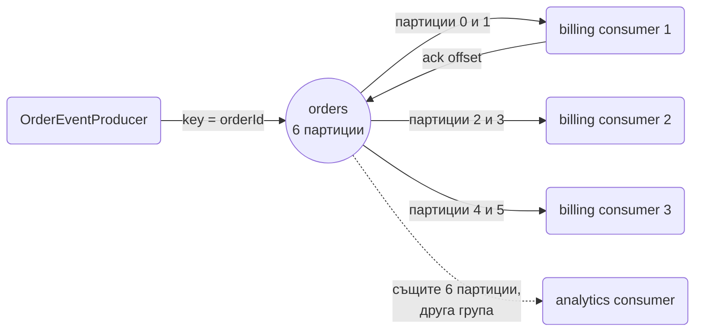
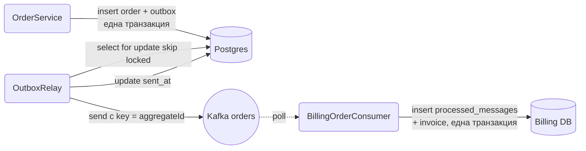
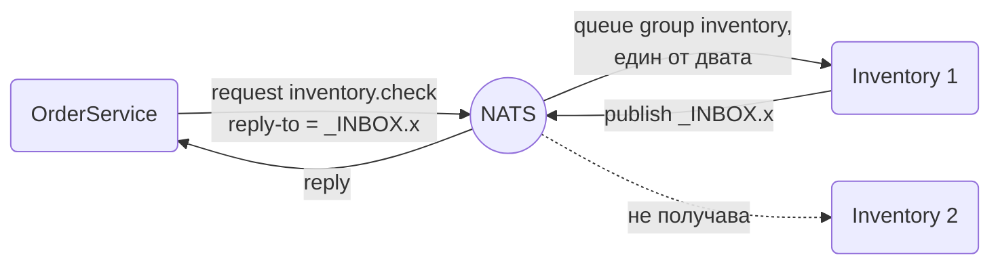

# Message brokers: Kafka, Redis, NATS

Когато едно събитие трябва да стигне до друг сървис, да оцелее след crash, да се обработи от точно един от N consumer-а или да се преигра от историята, in-process събитията и Postgres опашката вече не стигат и ти трябва broker. Kafka е distributed log с партиции, replay и consumer groups. Redis дава pub/sub за fire-and-forget fan-out и Streams за лека durable опашка с consumer groups. NATS е най-лекият от трите, с request/reply и queue groups в core и durable streams в JetStream. Този документ показва кога кой е правилният избор, пълната конфигурация със `spring-kafka`, Spring Data Redis и `jnats`, идемпотентен consumer, dead letter обработка, outbox producer и тестове с Testcontainers.

| Какво | Кога | Инструмент |
|---|---|---|
| Събитие в същия процес | Странични ефекти в един сървис | `@EventListener`, виж Events.md |
| Задача, която не трябва да се губи, един сървис | Имейл, export, retry | Postgres job queue, виж Scheduling_Queues.md |
| Събития между сървиси с replay и висок обем | Event-driven архитектура, аналитика | Kafka |
| Fan-out към всички инстанции без durability | WebSocket broadcast, cache invalidation | Redis pub/sub |
| Лека durable опашка с consumer group | Малък екип, вече има Redis | Redis Streams |
| Request/reply, queue groups, durable streams с минимум ops | Вътрешни микросървиси | NATS core и JetStream |
| Класически task queue с routing и DLX | Работни опашки, RPC | RabbitMQ |

## 1. Зависимости и настройка

```xml pom.xml
<!-- Kafka -->
<dependency>
    <groupId>org.springframework.kafka</groupId>
    <artifactId>spring-kafka</artifactId>
</dependency>

<!-- Redis pub/sub и Streams -->
<dependency>
    <groupId>org.springframework.boot</groupId>
    <artifactId>spring-boot-starter-data-redis</artifactId>
</dependency>

<!-- NATS -->
<dependency>
    <groupId>io.nats</groupId>
    <artifactId>jnats</artifactId>
    <version>2.21.1</version> <!-- виж последната версия в Maven Central -->
</dependency>

```

За тестовете (секция 9) добави с `test` scope `spring-boot-testcontainers`, `org.testcontainers:kafka` и `org.awaitility:awaitility`, всички с версии от Boot BOM-а.

```yaml src/main/resources/application.yml
spring:
  kafka:
    bootstrap-servers: ${KAFKA_BOOTSTRAP:localhost:9092}
    producer:
      key-serializer: org.apache.kafka.common.serialization.StringSerializer
      value-serializer: org.springframework.kafka.support.serializer.JsonSerializer
      acks: all
      properties:
        enable.idempotence: true
    consumer:
      group-id: ${spring.application.name}
      auto-offset-reset: earliest
      enable-auto-commit: false
      key-deserializer: org.apache.kafka.common.serialization.StringDeserializer
      value-deserializer: org.springframework.kafka.support.serializer.ErrorHandlingDeserializer
      properties:
        spring.deserializer.value.delegate.class: org.springframework.kafka.support.serializer.JsonDeserializer
        spring.json.trusted.packages: com.acme.shop.common.messaging
    listener:
      ack-mode: manual_immediate
      concurrency: 3
      observation-enabled: true
    template:
      observation-enabled: true
  data:
    redis:
      host: ${REDIS_HOST:localhost}
      port: 6379
app:
  nats:
    url: ${NATS_URL:nats://localhost:4222}
```

### Сравнение

| | Kafka | RabbitMQ | Redis Pub/Sub | Redis Streams | NATS core | NATS JetStream |
|---|---|---|---|---|---|---|
| Гаранция | at-least-once, exactly-once с транзакции | at-least-once | at-most-once | at-least-once | at-most-once | at-least-once, exactly-once с dedup window |
| Подредба | per partition | per queue | per channel | per stream | per publisher | per stream |
| Replay | да, по offset и време | не | не | да, по id | не | да, по sequence и време |
| Consumer groups | да | competing consumers на queue | не | да | queue groups | да, durable consumers |
| Durability | диск, репликация | диск | не | памет с AOF или RDB | не | диск или памет, репликация |
| Backpressure | consumer дърпа | prefetch | няма, бавен клиент се disconnect-ва | consumer дърпа | няма | pull consumer или max ack pending |
| Ops тежест | висока | средна | ниска | ниска | ниска | ниска до средна |
| Типична употреба | event sourcing, analytics, интеграции | task queues, RPC, routing | WebSocket fan-out, cache invalidation | лека опашка, activity feed | вътрешен RPC, service mesh без mesh | лек заместител на Kafka |

Правилото: ако вече имаш Redis и ти трябва fan-out, Redis pub/sub. Ако ти трябва durable опашка за един екип, Redis Streams или NATS JetStream. Ако много екипи консумират едни и същи събития, трябва replay и обемът е голям, Kafka.

## 2. Дизайн на съобщенията

Независимо от broker-а, съобщението е envelope с метаданни и payload:

```java src/main/java/com/acme/shop/common/messaging/
package com.acme.shop.common.messaging;

import java.time.Instant;
import java.util.UUID;

public record EventEnvelope<T>(
    UUID id,
    String type,
    int version,
    Instant occurredAt,
    String aggregateId,
    T payload
) {
    public static <T> EventEnvelope<T> of(String type, int version, String aggregateId, T payload) {
        return new EventEnvelope<>(UUID.randomUUID(), type, version, Instant.now(), aggregateId, payload);
    }
}

public record OrderPlacedPayload(UUID orderId, UUID customerId, long totalCents, String currency) {}
```

- `id`: за дедупликация при consumer-а. Генерира се веднъж при създаване, не при всяко изпращане.
- `type` + `version`: consumer-ът знае какво да парсне. Добавяне на optional поле е съвместимо, преименуване или махане не е и изисква нов `version`, а consumer-ът поддържа и двата за преходния период.
- `aggregateId`: ключ за партициониране, всички събития за една поръчка се обработват в ред. `occurredAt` е времето на бизнес събитието, не на изпращането.

Payload-ът носи идентификатори и данните, които consumer-ът иска, без да вика обратно, но не цели entity обекти.

## 3. Минимален работещ пример с Kafka

### Topic

```java src/main/java/com/acme/shop/common/messaging/KafkaTopics.java
package com.acme.shop.common.messaging;

import org.apache.kafka.clients.admin.NewTopic;
import org.springframework.kafka.config.TopicBuilder;

@Configuration
public class KafkaTopics {

    @Bean
    NewTopic ordersTopic() {
        // в prod replicas 3 с min.insync.replicas 2
        return TopicBuilder.name("orders").partitions(6).replicas(1).build();
    }

    @Bean
    NewTopic ordersDlt() {
        return TopicBuilder.name("orders-dlt").partitions(6).replicas(1).build();
    }
}
```

Boot авто-конфигурира `KafkaAdmin`, който при старт създава всички `NewTopic` bean-ове, ако ги няма. Броят партиции е таванът на паралелизма в consumer group: 6 партиции означават най-много 6 активни consumer-а.

### Producer

```java src/main/java/com/acme/shop/order/OrderEventProducer.java
package com.acme.shop.order;

import org.springframework.kafka.core.KafkaTemplate;
import org.springframework.kafka.support.SendResult;

import java.util.concurrent.CompletableFuture;

@Component
public class OrderEventProducer {

    private final KafkaTemplate<String, EventEnvelope<?>> kafka;

    public OrderEventProducer(KafkaTemplate<String, EventEnvelope<?>> kafka) {
        this.kafka = kafka;
    }

    public CompletableFuture<SendResult<String, EventEnvelope<?>>> orderPlaced(Order order) {
        var envelope = EventEnvelope.of("OrderPlaced", 1, order.getId().toString(),
            new OrderPlacedPayload(order.getId(), order.getCustomerId(), order.getTotalCents(), "EUR"));
        return kafka.send("orders", envelope.aggregateId(), envelope)
            .whenComplete((result, ex) -> {
                if (ex != null) log.error("failed to publish OrderPlaced for {}", order.getId(), ex);
            });
    }
}
```

`send` е асинхронен: връща веднага, а записът отива в буфер, който producer thread-ът праща на batch-ове. `acks: all` чака всички in-sync реплики, `enable.idempotence` прави retry-ите на producer-а безопасни срещу дубликати в партицията. Ключът определя партицията: `hash(key) % partitions`, така всички събития за една поръчка са подредени.

### Consumer

```java src/main/java/com/acme/shop/billing/BillingOrderConsumer.java
package com.acme.shop.billing;

import org.apache.kafka.clients.consumer.ConsumerRecord;
import org.springframework.kafka.annotation.KafkaListener;
import org.springframework.kafka.support.Acknowledgment;

@Component
public class BillingOrderConsumer {

    private final BillingService billing;

    public BillingOrderConsumer(BillingService billing) {
        this.billing = billing;
    }

    @KafkaListener(id = "billing-orders", topics = "orders", groupId = "billing", concurrency = "3")
    public void on(ConsumerRecord<String, EventEnvelope<OrderPlacedPayload>> record, Acknowledgment ack) {
        EventEnvelope<OrderPlacedPayload> envelope = record.value();
        if ("OrderPlaced".equals(envelope.type())) {
            billing.createInvoice(envelope.id(), envelope.payload());
        }
        ack.acknowledge();
    }
}
```

Какво се случва отвътре: `ConcurrentMessageListenerContainer` стартира 3 нишки, всяка с `KafkaConsumer` в група `billing`, и Kafka разпределя 6-те партиции между тях. Всяка нишка прави `poll()` и вика метода за всеки record. `ack.acknowledge()` с `manual_immediate` commit-ва offset-а веднага. Ако методът хвърли преди ack, offset-ът не се commit-ва и записът ще се обработи пак. Това е at-least-once.



Друга consumer group (`analytics`) получава всички съобщения независимо. Това е разликата от опашка: съобщението не се "изяжда", само offset-ът на групата мърда.

### Generic типове при десериализация

`JsonSerializer` слага header `__TypeId__` с класа на обекта, а `JsonDeserializer` с `trusted.packages` го чете и инстанцира. За `EventEnvelope<OrderPlacedPayload>` generic аргументът се губи и payload-ът става `LinkedHashMap`. Най-простото и robust решение е един конкретен record на topic, който останалите примери ползват:

```java src/main/java/com/acme/shop/common/messaging/OrderPlacedMessage.java
package com.acme.shop.common.messaging;

public record OrderPlacedMessage(UUID id, int version, Instant occurredAt,
                                 UUID orderId, UUID customerId, long totalCents, String currency) {}
```

## 4. Kafka в дълбочина

### Грешки, retry и dead letter

Без конфигурация `DefaultErrorHandler` повтаря записа 10 пъти без пауза и после го прескача. Правилната настройка: exponential backoff и dead letter topic.

```java src/main/java/com/acme/shop/common/messaging/KafkaErrorConfig.java
package com.acme.shop.common.messaging;

import org.springframework.kafka.listener.CommonErrorHandler;
import org.springframework.kafka.listener.DeadLetterPublishingRecoverer;
import org.springframework.kafka.listener.DefaultErrorHandler;
import org.springframework.util.backoff.ExponentialBackOffWithMaxRetries;

@Configuration
public class KafkaErrorConfig {

    @Bean
    CommonErrorHandler kafkaErrorHandler(KafkaTemplate<Object, Object> template) {
        // по подразбиране публикува в <topic>-dlt, същата партиция
        var recoverer = new DeadLetterPublishingRecoverer(template);

        var backoff = new ExponentialBackOffWithMaxRetries(4);
        backoff.setInitialInterval(500);
        backoff.setMultiplier(2.0);
        backoff.setMaxInterval(8_000);

        var handler = new DefaultErrorHandler(recoverer, backoff);
        // грешки, при които retry няма смисъл
        handler.addNotRetryableExceptions(IllegalArgumentException.class, DeserializationException.class);
        return handler;
    }
}
```

Boot подава `CommonErrorHandler` bean-а на default container factory. Retry-ите са блокиращи: нишката на consumer-а чака backoff-а и партицията не мърда. За отровно съобщение с 4 retry-а това са около 15 секунди пауза на партицията, което обикновено е ок. DLT записът носи headers с оригиналния topic, partition, offset, exception class и stack trace (`kafka_dlt-*`).

Ако блокирането е проблем, `@RetryableTopic` прави non-blocking retry през отделни topics:

```java src/main/java/com/acme/shop/billing/BillingOrderConsumer.java
import org.springframework.kafka.annotation.DltHandler;
import org.springframework.kafka.annotation.RetryableTopic;
import org.springframework.retry.annotation.Backoff;

@RetryableTopic(
    attempts = "4",
    backoff = @Backoff(delay = 1_000, multiplier = 2.0, maxDelay = 10_000),
    dltTopicSuffix = "-dlt",
    exclude = {IllegalArgumentException.class, DeserializationException.class})
@KafkaListener(id = "billing-orders", topics = "orders", groupId = "billing")
public void on(OrderPlacedMessage message, Acknowledgment ack) {
    billing.createInvoice(message);
    ack.acknowledge();
}

@DltHandler
public void dlt(OrderPlacedMessage message, @Header(KafkaHeaders.EXCEPTION_MESSAGE) String error) {
    log.error("OrderPlaced {} went to DLT: {}", message.id(), error);
    meters.counter("kafka.dlt", "topic", "orders").increment();
}
```

Spring създава `orders-retry-1000`, `orders-retry-2000`, `orders-retry-4000` и `orders-dlt` и премества записа между тях с delay. Цената: губи се подредбата per key за съобщенията в retry.

Батч обработка за голям обем или bulk insert: `@KafkaListener(batch = "true")` с параметър `List<ConsumerRecord<String, OrderPlacedMessage>>` и един ack за целия batch (каквото `poll()` е върнало, до `max.poll.records`). Грешка по средата повтаря целия batch, затова insert-ът е `ON CONFLICT DO NOTHING` по `id`.

### Отровни съобщения и ErrorHandlingDeserializer

Съобщение, което не може да се десериализира, без `ErrorHandlingDeserializer` блокира партицията завинаги: consumer-ът хвърля при `poll()`, преди listener-ът да е извикан, и никой error handler не помага. С `ErrorHandlingDeserializer` (конфигуриран в секция 1) грешката се опакова в record, listener container-ът я подава на `DefaultErrorHandler`, който я праща в DLT и продължава.

### Идемпотентен consumer

Всяка at-least-once система доставя дубликати: след crash между обработката и ack, при rebalance, при retry. Consumer-ът трябва да ги разпознава.

```sql src/main/resources/db/migration/V20250107_1200__create_processed_messages.sql
create table processed_messages (message_id uuid primary key, consumer text not null,
                                 processed_at timestamptz not null default now());
```

```java src/main/java/com/acme/shop/billing/BillingService.java
package com.acme.shop.billing;

@Service
public class BillingService {

    private final JdbcClient jdbc;
    private final InvoiceRepository invoices;

    @Transactional
    public void createInvoice(UUID messageId, OrderPlacedPayload payload) {
        int inserted = jdbc.sql("""
                insert into processed_messages (message_id, consumer) values (:id, 'billing')
                on conflict (message_id) do nothing
                """)
            .param("id", messageId)
            .update();
        if (inserted == 0) {
            log.info("duplicate message {}, skipping", messageId);
            return;
        }
        invoices.save(Invoice.forOrder(payload.orderId(), payload.totalCents(), payload.currency()));
    }
}
```

Записът в `processed_messages` и бизнес ефектът са в една транзакция: или и двете, или нито едно. Алтернатива без таблица: естествен ключ с upsert (`insert into invoices ... on conflict (order_id) do nothing`). Чисти `processed_messages` с job след 30 дни.

### Outbox producer

Директно `kafka.send` от service с `@Transactional` има дупка: commit-ът минава, процесът умира преди send, събитието е загубено, или send минава, а commit-ът се проваля. Transactional outbox го решава: събитието се записва в таблица в същата транзакция, а relay го праща.



Пълният relay с `SKIP LOCKED` е в [Events](Events.md), а защо outbox-ът е единствената атомарна опция без XA е в [Транзакции и locking](Transactions.md). Kafka има и свои транзакции (`KafkaTransactionManager`, `executeInTransaction`), но те гарантират атомарност между Kafka topics, не между Kafka и Postgres.

### Pause, resume, lag и headers

При деплой на зависим сървис или при проблем в базата може да спреш consumer-а без рестарт през `KafkaListenerEndpointRegistry`:

```java
registry.getListenerContainer("billing-orders").pause();
registry.getListenerContainer("billing-orders").resume();
```

`id` от `@KafkaListener` е ключът. Consumer lag (колко записа изостава групата от края на партицията) е основната метрика за здраве, Micrometer я експортира като `kafka.consumer.fetch.manager.records.lag.max`. С `observation-enabled` producer-ът добавя `traceparent` header, consumer-ът продължава същия trace и всяко съобщение има span. Собствени headers се добавят през `ProducerRecord.headers().add("x-tenant", bytes)` и се четат с `@Header("x-tenant") String tenant` в listener-а. Виж [Observability](Observability.md).

## 5. Redis

### Pub/sub

Fire-and-forget: ако никой не слуша, съобщението изчезва. Идеално за "кажи на всички инстанции", например WebSocket broadcast или cache invalidation.

```java src/main/java/com/acme/shop/common/messaging/RedisPubSubConfig.java
package com.acme.shop.common.messaging;

import org.springframework.data.redis.connection.RedisConnectionFactory;
import org.springframework.data.redis.listener.ChannelTopic;
import org.springframework.data.redis.listener.RedisMessageListenerContainer;
import org.springframework.data.redis.listener.adapter.MessageListenerAdapter;

@Configuration
public class RedisPubSubConfig {

    @Bean
    RedisMessageListenerContainer redisListenerContainer(RedisConnectionFactory factory,
                                                         OrderStatusSubscriber subscriber) {
        var container = new RedisMessageListenerContainer();
        container.setConnectionFactory(factory);
        container.addMessageListener(new MessageListenerAdapter(subscriber, "onOrderStatus"),
            new ChannelTopic("order-status"));
        return container;
    }
}
```

```java src/main/java/com/acme/shop/order/OrderStatusSubscriber.java
package com.acme.shop.order;

@Component
public class OrderStatusSubscriber {

    private final ObjectMapper json;
    private final OrderSocketHandler sockets;

    public OrderStatusSubscriber(ObjectMapper json, OrderSocketHandler sockets) {
        this.json = json;
        this.sockets = sockets;
    }

    // MessageListenerAdapter вика метода с десериализирания body като String
    public void onOrderStatus(String body) throws JsonProcessingException {
        var event = json.readValue(body, OrderStatusChangedEvent.class);
        sockets.sendToUser(event.customerId(), event);
    }
}
```

Публикуването е `stringRedisTemplate.convertAndSend("order-status", json)` от `@TransactionalEventListener`. Всяка инстанция получава всяко съобщение. WebSocket страната е в [WebSockets и SSE](WebSockets.md).

### Streams

Redis Streams е append-only log с consumer groups и pending list. Прилича на Kafka в малко: durable (доколкото Redis е durable), подреден, с ack. Няма партиции, един stream е една последователност.

Запис с `redis.opsForStream().add(StreamRecords.newRecord().in("orders").ofMap(Map.of("id", id, "type", "OrderPlaced", "payload", json)))`. Consumer group с ръчен ack:

```java src/main/java/com/acme/shop/billing/
package com.acme.shop.billing;

import org.springframework.data.redis.connection.stream.*;
import org.springframework.data.redis.stream.StreamMessageListenerContainer;

@Configuration
public class OrderStreamConsumerConfig {

    static final String STREAM = "orders";
    static final String GROUP = "billing";

    // container-ът е SmartLifecycle, Spring го стартира и спира сам
    @Bean
    StreamMessageListenerContainer<String, MapRecord<String, String, String>> orderStreamContainer(
            RedisConnectionFactory factory, StringRedisTemplate redis, OrderStreamHandler handler) {
        createGroupIfMissing(redis);
        var options = StreamMessageListenerContainer.StreamMessageListenerContainerOptions.builder()
            .pollTimeout(Duration.ofSeconds(1))
            .batchSize(20)
            .build();
        var container = StreamMessageListenerContainer.create(factory, options);
        String consumerName = "billing-" + UUID.randomUUID().toString().substring(0, 8);
        // receive без autoAck: handler-ът вика XACK след успешна обработка
        container.receive(Consumer.from(GROUP, consumerName),
            StreamOffset.create(STREAM, ReadOffset.lastConsumed()), handler::handle);
        return container;
    }

    private void createGroupIfMissing(StringRedisTemplate redis) {
        try {
            redis.opsForStream().createGroup(STREAM, ReadOffset.from("0"), GROUP);
        } catch (RedisSystemException ex) {
            // BUSYGROUP означава, че групата вече съществува
            if (ex.getMessage() == null || !ex.getMessage().contains("BUSYGROUP")) throw ex;
        }
    }
}

@Component
public class OrderStreamHandler {

    private final StringRedisTemplate redis;
    private final BillingService billing;
    private final ObjectMapper json;

    public OrderStreamHandler(StringRedisTemplate redis, BillingService billing, ObjectMapper json) {
        this.redis = redis;
        this.billing = billing;
        this.json = json;
    }

    public void handle(MapRecord<String, String, String> record) {
        try {
            var message = json.readValue(record.getValue().get("payload"), OrderPlacedMessage.class);
            billing.createInvoice(message.id(), message);
            redis.opsForStream().acknowledge(STREAM, GROUP, record.getId());
        } catch (Exception ex) {
            // без ack, записът остава в pending list и ще бъде reclaim-нат
            log.error("failed to process stream record {}", record.getId(), ex);
        }
    }
}
```

`XREADGROUP` дава съобщението на един consumer от групата и го слага в pending entries list (PEL), докато не дойде `XACK`. Съобщение, което е pending дълго (consumer-ът е умрял), се взема от друг с `XAUTOCLAIM`. Методът живее в `OrderStreamHandler`, който получава и `consumerName`:

```java src/main/java/com/acme/shop/billing/OrderStreamHandler.java
@Scheduled(fixedDelay = 30, timeUnit = TimeUnit.SECONDS)
public void reclaimStale() {
    PendingMessages pending = redis.opsForStream().pending(STREAM, GROUP, Range.unbounded(), 100);
    for (PendingMessage pm : pending) {
        if (pm.getElapsedTimeSinceLastDelivery().compareTo(Duration.ofMinutes(5)) < 0) continue;
        if (pm.getTotalDeliveryCount() > 5) {
            // отровно съобщение: ack и запис в dead letter stream
            redis.opsForStream().add(StreamRecords.newRecord().in(STREAM + "-dlt")
                .ofMap(Map.of("originalId", pm.getIdAsString())));
            redis.opsForStream().acknowledge(STREAM, GROUP, pm.getId());
            continue;
        }
        redis.opsForStream().claim(STREAM, GROUP, consumerName, Duration.ofMinutes(5), pm.getId())
            .forEach(this::handle);
    }
}
```

Spring Data Redis дава `pending` и `claim` (`XPENDING` + `XCLAIM`). `XAUTOCLAIM` прави същото в една команда, но за него трябва Lettuce директно или script. Трим на stream-а: `XTRIM orders MAXLEN ~ 100000` през `opsForStream().trim(STREAM, 100_000, true)` в `@Scheduled` задача, иначе Redis паметта расте безкрайно.

Streams са достатъчни, когато един сървис консумира, обемът е под няколко хиляди в секунда и загубата при Redis crash между два AOF fsync е приемлива. За партиции, retention в дни и много consumer групи с replay, Kafka.

## 6. NATS

NATS е един бинарен файл, стартира за милисекунда, и клиентът е без Spring интеграция, но е толкова прост, че не му трябва.

### Connection bean

```java src/main/java/com/acme/shop/common/messaging/NatsConfig.java
package com.acme.shop.common.messaging;

import io.nats.client.Connection;
import io.nats.client.Nats;
import io.nats.client.Options;

@Configuration
public class NatsConfig {

    @Bean(destroyMethod = "close")
    Connection natsConnection(@Value("${app.nats.url}") String url) throws Exception {
        return Nats.connect(new Options.Builder()
            .server(url)
            .connectionName("shop-api")
            .maxReconnects(-1)
            .reconnectWait(Duration.ofSeconds(2))
            .connectionListener((conn, type) -> log.info("nats connection event: {}", type))
            .build());
    }
}
```

`maxReconnects(-1)` е безкраен reconnect. Докато е disconnected, клиентът буферира publish-ите в памет (до `reconnectBufferSize`) и ги праща след reconnect.

### Core publish/subscribe

Subjects са йерархични с точки, `*` замества едно ниво, `>` замества остатъка: `orders.placed`, `orders.*`, `orders.>`. Публикуването е един ред: `nats.publish("orders.placed", json.writeValueAsBytes(message))`. Listener компонент с `Dispatcher`:

```java src/main/java/com/acme/shop/common/messaging/NatsListener.java
package com.acme.shop.common.messaging;

import io.nats.client.Connection;
import io.nats.client.Dispatcher;
import io.nats.client.Message;

@Component
public class NatsListener implements SmartLifecycle {

    private final Connection nats;
    private final ObjectMapper json;
    private final BillingService billing;
    private Dispatcher dispatcher;

    public NatsListener(Connection nats, ObjectMapper json, BillingService billing) {
        this.nats = nats;
        this.json = json;
        this.billing = billing;
    }

    @Override
    public void start() {
        dispatcher = nats.createDispatcher();
        // queue group "billing": съобщението отива само до една от инстанциите в групата
        dispatcher.subscribe("orders.placed", "billing", this::onOrderPlaced);
    }

    private void onOrderPlaced(Message msg) {
        try {
            var message = json.readValue(msg.getData(), OrderPlacedMessage.class);
            billing.createInvoice(message.id(), message);
        } catch (Exception ex) {
            // core NATS няма retry, съобщението е загубено, ако не го обработим тук
            log.error("failed to handle {}", msg.getSubject(), ex);
        }
    }

    @Override public void stop() { if (dispatcher != null) nats.closeDispatcher(dispatcher); }
    @Override public boolean isRunning() { return dispatcher != null && dispatcher.isActive(); }
}
```

Core NATS е at-most-once: ако няма абонат в момента или consumer-ът хвърли, съобщението изчезва. За всичко, което не трябва да се губи, JetStream.

### Request/reply



```java
// клиент
public StockCheckResult checkStock(UUID productId, int qty) throws Exception {
    byte[] body = json.writeValueAsBytes(new StockCheckRequest(productId, qty));
    Message reply = nats.request("inventory.check", body, Duration.ofSeconds(2));
    if (reply == null) throw new InventoryUnavailableException(productId);
    return json.readValue(reply.getData(), StockCheckResult.class);
}

// сървър, в inventory сървиса
dispatcher.subscribe("inventory.check", "inventory", msg -> {
    var request = json.readValue(msg.getData(), StockCheckRequest.class);
    nats.publish(msg.getReplyTo(), json.writeValueAsBytes(stock.check(request.productId(), request.qty())));
});
```

Queue group `inventory` прави load balancing между инстанциите на inventory сървиса без load balancer и без service discovery. Това е най-силната страна на NATS за вътрешни микросървиси.

### JetStream

```java src/main/java/com/acme/shop/common/messaging/JetStreamConfig.java
package com.acme.shop.common.messaging;

import io.nats.client.*;
import io.nats.client.api.*;

@Configuration
public class JetStreamConfig {

    @Bean
    JetStream jetStream(Connection nats) throws Exception {
        JetStreamManagement jsm = nats.jetStreamManagement();
        StreamConfiguration config = StreamConfiguration.builder()
            .name("ORDERS").subjects("orders.>")
            .storageType(StorageType.File).retentionPolicy(RetentionPolicy.Limits)
            .maxAge(Duration.ofDays(7)).duplicateWindow(Duration.ofMinutes(2))
            .build();
        // addStream хвърля, ако stream-ът съществува с различна конфигурация, затова update
        try { jsm.addStream(config); } catch (JetStreamApiException ex) { jsm.updateStream(config); }
        return nats.jetStream();
    }
}
```

Publish е `js.publish(NatsMessage.builder().subject("orders.placed").headers(headers).data(bytes).build())` и връща `PublishAck` със stream и sequence. Header `Nats-Msg-Id` със стойност `message.id()` дава dedup в `duplicateWindow`: повторен publish със същия id се потвърждава, но не се записва втори път.

Durable pull consumer с explicit ack, `nak` с delay и `maxDeliver`:

```java src/main/java/com/acme/shop/billing/JetStreamBillingConsumer.java
package com.acme.shop.billing;

@Component
public class JetStreamBillingConsumer implements SmartLifecycle {

    private final JetStream js;
    private final BillingService billing;
    private final ObjectMapper json;
    private final ExecutorService loop = Executors.newSingleThreadExecutor(r -> new Thread(r, "js-billing"));
    private volatile boolean running;

    @Override
    public void start() {
        running = true;
        loop.submit(this::pullLoop);
    }

    private void pullLoop() {
        try {
            PullSubscribeOptions options = PullSubscribeOptions.builder()
                .durable("billing")
                .configuration(ConsumerConfiguration.builder()
                    .ackPolicy(AckPolicy.Explicit).ackWait(Duration.ofSeconds(30)).maxDeliver(5).build())
                .build();
            JetStreamSubscription sub = js.subscribe("orders.placed", options);
            while (running) {
                sub.fetch(20, Duration.ofSeconds(1)).forEach(this::handle);
            }
            sub.unsubscribe();
        } catch (Exception ex) {
            log.error("jetstream pull loop died", ex);
        }
    }

    private void handle(Message msg) {
        try {
            var message = json.readValue(msg.getData(), OrderPlacedMessage.class);
            billing.createInvoice(message.id(), message);
            msg.ack();
        } catch (IllegalArgumentException ex) {
            msg.term();  // невалидно съобщение, няма смисъл от retry
        } catch (Exception ex) {
            long delivered = msg.metaData().deliveredCount();
            log.warn("delivery {} failed for seq {}", delivered, msg.metaData().streamSequence(), ex);
            msg.nakWithDelay(Duration.ofSeconds(Math.min(60, 2L << delivered)));
        }
    }

    @Override public void stop() { running = false; loop.shutdown(); }
    @Override public boolean isRunning() { return running; }
}
```

Push consumer е по-прост (`js.subscribe(subject, queue, dispatcher, handler, false, PushSubscribeOptions.builder().durable("billing").build())`), но pull дава контрол над backpressure. След `maxDeliver` опита съобщението спира да се доставя и остава в stream-а. NATS публикува advisory на `$JS.EVENT.ADVISORY.CONSUMER.MAX_DELIVERIES.ORDERS.billing`, за което слушаш и го третираш като DLT.

### Testcontainers за NATS

```java src/test/java/com/acme/shop/billing/NatsBillingIT.java
package com.acme.shop.billing;

@Testcontainers
@SpringBootTest
class NatsBillingIT {

    @Container
    static GenericContainer<?> nats = new GenericContainer<>("nats:2").withExposedPorts(4222).withCommand("-js");

    @DynamicPropertySource
    static void natsProps(DynamicPropertyRegistry registry) {
        registry.add("app.nats.url", () -> "nats://" + nats.getHost() + ":" + nats.getMappedPort(4222));
    }
}
```

## 7. RabbitMQ накратко

Когато ти трябва класическа опашка с routing по ключ, prefetch и dead letter exchange, и екипът го познава. Зависимостта е `spring-boot-starter-amqp`.

```java src/main/java/com/acme/shop/common/messaging/RabbitConfig.java
package com.acme.shop.common.messaging;

@Configuration
public class RabbitConfig {

    @Bean TopicExchange ordersExchange() { return new TopicExchange("orders"); }
    @Bean DirectExchange ordersDlx() { return new DirectExchange("orders.dlx"); }
    @Bean Queue billingDlq() { return QueueBuilder.durable("orders.billing.dlq").build(); }

    @Bean
    Queue billingQueue() {
        return QueueBuilder.durable("orders.billing")
            .deadLetterExchange("orders.dlx").deadLetterRoutingKey("orders.billing").build();
    }

    @Bean Binding billingBinding() { return BindingBuilder.bind(billingQueue()).to(ordersExchange()).with("orders.placed"); }
    @Bean Binding billingDlqBinding() { return BindingBuilder.bind(billingDlq()).to(ordersDlx()).with("orders.billing"); }
    @Bean MessageConverter jsonConverter() { return new Jackson2JsonMessageConverter(); }
}
```

Consumer-ът е метод с `@RabbitListener(queues = "orders.billing")` и параметър `OrderPlacedMessage`, publish е `rabbitTemplate.convertAndSend("orders", "orders.placed", message)`. Изключение в listener-а при default настройки прави requeue безкрайно: сложи `spring.rabbitmq.listener.simple.default-requeue-rejected=false` и retry през `spring.rabbitmq.listener.simple.retry.*`, след което съобщението отива в DLX.

## 8. Cross-cutting

### Сериализация, дедупликация и подредба

JSON е default: четим, лесен за дебъг, достатъчен до момента, в който схемата се чупи между екипи. Тогава Avro или Protobuf със schema registry (Confluent или Apicurio) дават проверка на съвместимост при publish. За един екип JSON с `version` поле стига. Не ползвай Java сериализация никога.

- Дубликати са нормални, не бъг. Всеки consumer има `processed_messages` или upsert по естествен ключ.
- Подредба е гарантирана само в рамките на ключ (Kafka партиция, Redis stream, NATS subject с един publisher). Ключът винаги е aggregate id.
- Consumer-ът трябва да толерира out-of-order при replay: `OrderShipped` за непозната поръчка се повтаря след delay или се пази като pending, докато `OrderPlaced` дойде.

### DLQ runbook

Dead letter без процес е просто изгубени съобщения с екстра стъпка. Минимумът:

1. Alert при първо съобщение в DLT (`kafka.dlt` counter или lag на DLT topic).
2. Admin endpoint, който чете DLT и показва payload и exception headers, за да се намери причината.
3. Fix на кода или данните, после ръчно задействан replay: consumer за DLT праща обратно в оригиналния topic със същия ключ. Идемпотентността на основния consumer прави replay безопасен.
4. Запис кой, кога и защо е направил replay.

### Graceful shutdown

При SIGTERM Kafka container-ите спират `poll()`, довършват текущия batch и commit-ват (`spring.kafka.listener.immediate-stop=false` е default). За NATS и Redis Streams `SmartLifecycle.stop()` трябва да спре loop-а и да изчака текущата обработка, иначе съобщението се redeliver-ва след `ackWait`. Настройките за lifecycle timeout са в [Cron, @Async и опашки](Scheduling_Queues.md).

### Local dev с docker compose

```yaml compose.yaml
services:
  kafka:
    image: apache/kafka:3.9.0
    ports:
      - "9092:9092"
    environment:
      KAFKA_NODE_ID: 1
      KAFKA_PROCESS_ROLES: broker,controller
      KAFKA_LISTENERS: PLAINTEXT://:9092,CONTROLLER://:9093
      KAFKA_ADVERTISED_LISTENERS: PLAINTEXT://localhost:9092
      KAFKA_CONTROLLER_LISTENER_NAMES: CONTROLLER
      KAFKA_LISTENER_SECURITY_PROTOCOL_MAP: CONTROLLER:PLAINTEXT,PLAINTEXT:PLAINTEXT
      KAFKA_CONTROLLER_QUORUM_VOTERS: 1@localhost:9093
      KAFKA_OFFSETS_TOPIC_REPLICATION_FACTOR: 1
      KAFKA_TRANSACTION_STATE_LOG_REPLICATION_FACTOR: 1
      KAFKA_TRANSACTION_STATE_LOG_MIN_ISR: 1
      KAFKA_AUTO_CREATE_TOPICS_ENABLE: "false"

  redis:
    image: redis:7
    ports: ["6379:6379"]
    command: ["redis-server", "--appendonly", "yes"]

  nats:
    image: nats:2
    ports: ["4222:4222"]
    command: ["-js"]
```

KRaft режимът няма нужда от ZooKeeper. `auto.create.topics.enable=false`, за да не създаваш случайно topic с 1 партиция от typo. Повече за compose и профили в [Docker и деплой](Docker_Deploy.md).

## 9. Тестване

### Kafka с Testcontainers и @ServiceConnection

```java src/test/java/com/acme/shop/billing/BillingOrderConsumerIT.java
package com.acme.shop.billing;

import org.springframework.boot.testcontainers.service.connection.ServiceConnection;
import org.testcontainers.kafka.KafkaContainer;

@Testcontainers
@SpringBootTest
class BillingOrderConsumerIT {

    @Container
    @ServiceConnection
    static KafkaContainer kafka = new KafkaContainer("apache/kafka:3.9.0");

    @Container
    @ServiceConnection
    static PostgreSQLContainer<?> postgres = new PostgreSQLContainer<>("postgres:16");

    @Autowired KafkaTemplate<String, OrderPlacedMessage> template;
    @Autowired InvoiceRepository invoices;

    @Test
    void createsInvoiceOnce() {
        var message = new OrderPlacedMessage(UUID.randomUUID(), 1, Instant.now(),
            orderId, customerId, 4990L, "EUR");

        template.send("orders", orderId.toString(), message);
        template.send("orders", orderId.toString(), message);  // дубликат

        await().atMost(Duration.ofSeconds(10))
            .untilAsserted(() -> assertThat(invoices.findByOrderId(orderId)).isPresent());
        await().during(Duration.ofSeconds(2))
            .untilAsserted(() -> assertThat(invoices.countByOrderId(orderId)).isEqualTo(1));
    }
}
```

`@ServiceConnection` сетва `spring.kafka.bootstrap-servers` автоматично. Awaitility е задължително: consumer-ът работи в друга нишка и `assertThat` веднага след `send` ще се провали. `during` проверява, че условието остава вярно за период, което е единственият начин да тестваш "не е създадено втори път". `@EmbeddedKafka` от `spring-kafka-test` е алтернатива без Docker, но е in-JVM broker със свои особености.

### Redis

```java
@Container
@ServiceConnection
static GenericContainer<?> redis = new GenericContainer<>("redis:7").withExposedPorts(6379);
```

Boot разпознава image-а `redis` и сетва `spring.data.redis.*`. Pub/sub се тества като публикуваш през `StringRedisTemplate` и чакаш с Awaitility subscriber-ът да е записал ефекта.

### Unit тест на consumer логиката

Най-бързите тестове не пипат broker: извикай `BillingService.createInvoice(messageId, payload)` два пъти и провери, че има една фактура. Container тестовете са за wiring, по един на topic. Структурата на тестовите слоеве е в [Testing](Testing.md).

## 10. Капани

- `enable-auto-commit=true` с бавна обработка: offset-ът се commit-ва на интервал, преди записът да е обработен. Crash означава загубено съобщение. Винаги `manual_immediate` с ack след обработка.
- Default `DefaultErrorHandler` без recoverer прескача записа след 10 бързи retry-а, а без `ErrorHandlingDeserializer` невалиден JSON блокира партицията завинаги. И двете са задължителни.
- Ключ `null` или random: Kafka разпределя round-robin и събитията за една поръчка се обработват паралелно и в грешен ред. Ключът е aggregate id, а `concurrency` над броя партиции не ускорява нищо.
- `kafkaTemplate.send` директно от `@Transactional` service: дупка между commit и send. Outbox.
- Consumer без `processed_messages`: при rebalance и retry фактурата се създава два пъти. At-least-once означава дубликати, винаги.
- Redis pub/sub за нещо важно: ако consumer-ът е бил в рестарт, съобщението е изчезнало безследно. Pub/sub е само за ефекти, при които загуба е безопасна.
- Redis Streams без `XTRIM` и без reclaim на pending: stream-ът расте до края на паметта, а умрял consumer оставя съобщенията в PEL завинаги. Trim и `pending` + `claim` в `@Scheduled`.
- NATS core за durable нужди: няма абонат, няма съобщение. JetStream за всичко, което не трябва да се губи, и винаги с `maxDeliver`.
- `trusted.packages: "*"`: JSON десериализация по `__TypeId__` header от ненадежден producer може да инстанцира произволен клас. Избройте пакета.
- Тест без Awaitility: `assertThat` веднага след `send` се проваля на CI и минава локално. Винаги `await()`.

## 11. Чеклист

- [ ] Избрано е съзнателно между in-process събитие, Postgres опашка и broker, и между Kafka, Redis и NATS по таблицата в секция 1.
- [ ] Всяко съобщение има `id`, `type`, `version`, `occurredAt` и ключ за партициониране по aggregate id.
- [ ] Producer: `acks=all`, `enable.idempotence=true`, topics като `NewTopic` bean-ове с явен брой партиции, publish от транзакция през outbox.
- [ ] Consumer: `enable-auto-commit=false`, `ack-mode=manual_immediate`, `ErrorHandlingDeserializer` и конкретен `trusted.packages`.
- [ ] Има `DefaultErrorHandler` с backoff и `DeadLetterPublishingRecoverer`, или `@RetryableTopic` с `@DltHandler`.
- [ ] Всеки consumer е идемпотентен с `processed_messages` таблица или upsert, в една транзакция с бизнес ефекта.
- [ ] Alert на DLT и lag, runbook за преглед и replay.
- [ ] Redis Streams имат trim и reclaim на pending; JetStream има `maxDeliver` и `ackWait`.
- [ ] Observation е включено за template и listener, trace минава през headers.
- [ ] Има container тест с `@ServiceConnection` и Awaitility за всеки topic или subject, и docker compose за local dev.

## 12. Свързани документи

- [Events](Events.md): in-process събития, кога не стигат, и пълният outbox relay с `SKIP LOCKED`.
- [Cron, @Async и опашки](Scheduling_Queues.md): Postgres job queue като по-лека алтернатива, graceful shutdown на worker-и.
- [Транзакции и locking](Transactions.md): защо outbox е единственият атомарен начин да запишеш и в база, и в broker.
- [WebSockets и SSE](WebSockets.md): Redis pub/sub като fan-out за socket push между инстанции.
- [Observability](Observability.md): consumer lag, DLT метрики, trace propagation през message headers.
- [Testing](Testing.md): Testcontainers, `@ServiceConnection`, Awaitility.
- [Docker и деплой](Docker_Deploy.md): compose за локална инфраструктура и lifecycle в Kubernetes.
- [Spring for Apache Kafka reference](https://docs.spring.io/spring-kafka/reference/)
