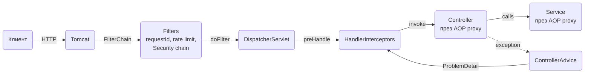

# Middleware: Filters, Interceptors, AOP

В Spring MVC "middleware" не е едно нещо, а четири различни hook-а, които се изпълняват на различни места в пътя на request-а: servlet filter-ите, `HandlerInterceptor`, AOP aspect-ите и `@ControllerAdvice`. Всеки от тях вижда различна информация и може различни неща, затова изборът на грешния хук е най-честата причина за "работи, ама не където трябва". Този документ показва къде точно се изпълнява всеки хук, кога кой да ползваш и дава готови примери за correlation id, timing, audit, CORS, rate limiting, логване на body и custom argument resolver. Ако идваш от Node и Express, последната секция превежда менталния модел `(req, res, next)` към Spring.

| Какво | Кога | Инструмент |
|---|---|---|
| Нещо за всеки HTTP request, преди Spring изобщо да знае за controller-а | correlation id, rate limit, логване на body, CORS, security | `OncePerRequestFilter` |
| Нещо, което зависи от кой controller метод ще се извика | audit по endpoint, timing по handler, проверка на анотации на метода | `HandlerInterceptor` |
| Нещо около произволен bean метод, не само web | timing на service методи, retry, audit на бизнес операции | `@Aspect` |
| Превръщане на exception в HTTP отговор | всички грешки от controller надолу | `@RestControllerAdvice` |
| Инжектиране на custom параметър в controller метод | `@CurrentUser`, `@TenantId` | `HandlerMethodArgumentResolver` |
| Глобална настройка на MVC | interceptors, CORS, converters, resource handlers | `WebMvcConfigurer` |

## 1. Зависимости и настройка

Filter-ите и interceptor-ите идват със `spring-boot-starter-web`. За AOP трябва `spring-boot-starter-aop`, а за rate limiting ползваме Bucket4j.

```xml
<dependency>
    <groupId>org.springframework.boot</groupId>
    <artifactId>spring-boot-starter-web</artifactId>
</dependency>
<dependency>
    <groupId>org.springframework.boot</groupId>
    <artifactId>spring-boot-starter-aop</artifactId>
</dependency>
<dependency>
    <groupId>com.bucket4j</groupId>
    <artifactId>bucket4j-core</artifactId>
    <version>8.10.1</version> <!-- виж последната версия в Maven Central -->
</dependency>
```

```yaml
spring:
  threads:
    virtual:
      enabled: true
  mvc:
    problemdetails:
      enabled: true

logging:
  pattern:
    level: "%5p [%X{requestId:-}]"
```

Нищо от AOP не изисква допълнителна конфигурация: Boot включва `@EnableAspectJAutoProxy` автоматично, щом види starter-а в classpath-а.

## 2. Request pipeline в Spring MVC

Request-ът минава през servlet container-а (Tomcat по подразбиране), после през filter chain-а, стига до `DispatcherServlet`, който намира handler-а и пуска interceptor-ите около него. AOP aspect-ите не са част от web слоя: те обвиват bean методите (controller или service) чрез proxy.



Ключовите точки:

- Filter-ите виждат само `HttpServletRequest` и `HttpServletResponse`. Те не знаят кой controller ще обработи request-а и се изпълняват дори за `/error`, статични ресурси и 404.
- `DispatcherServlet` избира handler-а (`HandlerMethod`) и чак тогава пуска `preHandle` на interceptor-ите. Затова interceptor-ът има достъп до метода и неговите анотации.
- `@ControllerAdvice` живее вътре в `DispatcherServlet`. Exception, хвърлен от filter, никога не стига до него.
- AOP aspect-ът се изпълнява при извикване на метод на proxy-то, независимо дали извикването идва от HTTP, scheduler, Kafka listener или тест.

## 3. Кой инструмент кога

| | Filter | HandlerInterceptor | @Aspect | @ControllerAdvice |
|---|---|---|---|---|
| Какво вижда | `HttpServletRequest` / `Response`, raw | request, response и `HandlerMethod` | `JoinPoint`: метод, аргументи, резултат | exception, `WebRequest`, `HandlerMethod` |
| Кога се изпълнява | преди и след целия DispatcherServlet | преди handler-а, след него, след рендиране | около произволен bean метод | само при exception |
| Може ли да прекъсне | да, като не извика `chain.doFilter` | да, `preHandle` връща `false` | да, като не извика `proceed()` | не е приложимо |
| Достъп до handler | не | да | до метода, не до HTTP | да |
| Работи извън HTTP | не | не | да | не |
| Вижда ли body на request-а | да, но като stream (чете се веднъж) | не без wrapper | вижда десериализирания DTO като аргумент | не |
| Типична употреба | correlation id, rate limit, CORS, security, компресия | audit, timing по endpoint, проверка на header спрямо анотация | timing на service, custom retry, audit на бизнес операция | mapping на грешки към ProblemDetail |

Простото правило: ако нещо трябва да е "преди всичко" или трябва да е 100% сигурно, че се изпълнява за всеки request, е filter. Ако зависи от controller метода, е interceptor. Ако е около бизнес логика, е aspect.

## 4. Минимален работещ пример: filter

`OncePerRequestFilter` гарантира едно изпълнение на request, дори при forward към `/error` или async dispatch. Регистрацията като `@Component` го слага в chain-а за всички URL-и.

```java
package com.example.orders.web.filter;

import jakarta.servlet.FilterChain;
import jakarta.servlet.ServletException;
import jakarta.servlet.http.HttpServletRequest;
import jakarta.servlet.http.HttpServletResponse;
import org.springframework.core.Ordered;
import org.springframework.core.annotation.Order;
import org.springframework.stereotype.Component;
import org.springframework.web.filter.OncePerRequestFilter;

import java.io.IOException;

@Component
@Order(Ordered.HIGHEST_PRECEDENCE + 10)
public class ServerHeaderFilter extends OncePerRequestFilter {

    @Override
    protected void doFilterInternal(HttpServletRequest request,
                                    HttpServletResponse response,
                                    FilterChain chain) throws ServletException, IOException {
        response.setHeader("X-Service", "orders");
        chain.doFilter(request, response);
    }

    @Override
    protected boolean shouldNotFilter(HttpServletRequest request) {
        return request.getRequestURI().startsWith("/actuator");
    }
}
```

`@Order` с по-малка стойност означава по-рано в chain-а. `shouldNotFilter` е правилното място за изключване на пътища, а не `if` вътре в `doFilterInternal`.

## 5. FilterRegistrationBean: URL patterns и ред

Когато filter-ът трябва да важи само за определени пътища, или искаш пълен контрол върху реда, го регистрираш през `FilterRegistrationBean` вместо с `@Component`.

```java
package com.example.orders.config;

import com.example.orders.web.filter.RateLimitFilter;
import org.springframework.boot.web.servlet.FilterRegistrationBean;
import org.springframework.context.annotation.Bean;
import org.springframework.context.annotation.Configuration;

@Configuration
public class FilterConfig {

    @Bean
    public FilterRegistrationBean<RateLimitFilter> rateLimitFilter(RateLimitFilter filter) {
        var registration = new FilterRegistrationBean<>(filter);
        registration.addUrlPatterns("/api/*");
        registration.setOrder(-50);
        registration.setName("rateLimitFilter");
        return registration;
    }
}
```

Ако `RateLimitFilter` е и `@Component`, Boot го регистрира и сам, за всички URL-и, и той се изпълнява два пъти. Или махни `@Component`, или добави втори `FilterRegistrationBean` за същия filter с `registration.setEnabled(false)`, което изключва автоматичната регистрация, без да маха bean-а. Същото важи за filter-и, които подаваш на Spring Security с `addFilterBefore`: те трябва да живеят само в security chain-а, не и в servlet chain-а.

## 6. Correlation id: MDC и response header

Всеки request трябва да има id, който се появява във всеки лог ред и се връща на клиента, за да може support да намери точно този request. Ако upstream (gateway, друг сървис) вече е пратил `X-Request-Id`, го преизползваме.

```java
package com.example.orders.web.filter;

import jakarta.servlet.FilterChain;
import jakarta.servlet.ServletException;
import jakarta.servlet.http.HttpServletRequest;
import jakarta.servlet.http.HttpServletResponse;
import org.slf4j.MDC;
import org.springframework.core.Ordered;
import org.springframework.core.annotation.Order;
import org.springframework.stereotype.Component;
import org.springframework.web.filter.OncePerRequestFilter;

import java.io.IOException;
import java.util.UUID;

@Component
@Order(Ordered.HIGHEST_PRECEDENCE)
public class RequestIdFilter extends OncePerRequestFilter {

    public static final String HEADER = "X-Request-Id";
    public static final String MDC_KEY = "requestId";

    @Override
    protected void doFilterInternal(HttpServletRequest request,
                                    HttpServletResponse response,
                                    FilterChain chain) throws ServletException, IOException {
        String requestId = sanitize(request.getHeader(HEADER));
        if (requestId == null) {
            requestId = UUID.randomUUID().toString();
        }
        MDC.put(MDC_KEY, requestId);
        response.setHeader(HEADER, requestId);
        request.setAttribute(MDC_KEY, requestId);
        try {
            chain.doFilter(request, response);
        } finally {
            MDC.remove(MDC_KEY);
        }
    }

    // не допускаме клиентът да инжектира произволен текст в логовете
    private static String sanitize(String value) {
        if (value == null || value.isBlank() || value.length() > 64) {
            return null;
        }
        return value.matches("[A-Za-z0-9\\-_.]+") ? value : null;
    }
}
```

`finally` с `MDC.remove` е задължително: Tomcat преизползва platform thread-овете, а с virtual threads MDC пак е thread-local и ще протече в следващия request без него. С `logging.pattern.level` от секция 1 всеки ред ще изглежда така: `INFO [3f9c...] c.e.o.OrderService : Created order 42`. Как MDC стига до JSON логовете и как се пренася към `@Async` и Kafka е описано в [Logging](Logging.md).

## 7. HandlerInterceptor: timing и audit

Interceptor-ът знае кой метод ще се изпълни. Това го прави правилното място за audit по endpoint, защото можеш да прочетеш custom анотация от `HandlerMethod`.

```java
package com.example.orders.web.audit;

import java.lang.annotation.*;

@Target(ElementType.METHOD)
@Retention(RetentionPolicy.RUNTIME)
public @interface Audited {
    String action();
}
```

```java
package com.example.orders.web.audit;

import jakarta.servlet.http.HttpServletRequest;
import jakarta.servlet.http.HttpServletResponse;
import org.slf4j.Logger;
import org.slf4j.LoggerFactory;
import org.springframework.stereotype.Component;
import org.springframework.web.method.HandlerMethod;
import org.springframework.web.servlet.HandlerInterceptor;

@Component
public class AuditInterceptor implements HandlerInterceptor {

    private static final Logger log = LoggerFactory.getLogger(AuditInterceptor.class);
    private static final String START_ATTR = "audit.start";

    @Override
    public boolean preHandle(HttpServletRequest request, HttpServletResponse response, Object handler) {
        request.setAttribute(START_ATTR, System.nanoTime());
        return true;
    }

    @Override
    public void afterCompletion(HttpServletRequest request, HttpServletResponse response,
                                Object handler, Exception ex) {
        if (!(handler instanceof HandlerMethod method)) {
            return;
        }
        Audited audited = method.getMethodAnnotation(Audited.class);
        if (audited == null) {
            return;
        }
        long start = (long) request.getAttribute(START_ATTR);
        long millis = (System.nanoTime() - start) / 1_000_000;
        String user = request.getUserPrincipal() != null ? request.getUserPrincipal().getName() : "anonymous";
        log.info("audit action={} user={} status={} durationMs={} path={}",
                audited.action(), user, response.getStatus(), millis, request.getRequestURI());
    }
}
```

```java
package com.example.orders.config;

import com.example.orders.web.audit.AuditInterceptor;
import org.springframework.context.annotation.Configuration;
import org.springframework.web.servlet.config.annotation.InterceptorRegistry;
import org.springframework.web.servlet.config.annotation.WebMvcConfigurer;

@Configuration
public class WebConfig implements WebMvcConfigurer {

    private final AuditInterceptor auditInterceptor;

    public WebConfig(AuditInterceptor auditInterceptor) {
        this.auditInterceptor = auditInterceptor;
    }

    @Override
    public void addInterceptors(InterceptorRegistry registry) {
        registry.addInterceptor(auditInterceptor)
                .addPathPatterns("/api/**")
                .excludePathPatterns("/api/health", "/api/docs/**");
    }
}
```

В controller-а остава само `@Audited(action = "ORDER_CREATE")` над метода. Трите метода на interceptor-а:

- `preHandle`: преди handler-а. Връщане на `false` спира обработката; тогава ти трябва сам да напишеш отговора.
- `postHandle`: след handler-а, но преди view рендиране. При REST с `@ResponseBody` тялото вече е записано, така че не можеш да го промениш оттук.
- `afterCompletion`: винаги се изпълнява, включително при exception. Това е мястото за timing и cleanup.

## 8. AOP: аспекти около bean методи

### Pointcut изрази

| Израз | Какво хваща |
|---|---|
| `execution(* com.example.orders.service.*.*(..))` | всеки public метод във всеки клас в пакета |
| `execution(public * com.example..*Service.*(..))` | всеки метод на клас с име, завършващо на `Service`, във всеки подпакет |
| `@annotation(com.example.orders.aop.Timed)` | методи с анотация `@Timed` |
| `within(com.example.orders.web..*)` | всички методи в класове от пакета и подпакетите |
| `@within(org.springframework.stereotype.Service)` | всички методи на класове, анотирани със `@Service` |

### Custom анотация и @Around

```java
package com.example.orders.aop;

import java.lang.annotation.*;

@Target({ElementType.METHOD, ElementType.TYPE})
@Retention(RetentionPolicy.RUNTIME)
public @interface Timed {
    String value() default "";
    long warnAboveMs() default 500;
}
```

```java
package com.example.orders.aop;

import org.aspectj.lang.ProceedingJoinPoint;
import org.aspectj.lang.annotation.Around;
import org.aspectj.lang.annotation.Aspect;
import org.slf4j.Logger;
import org.slf4j.LoggerFactory;
import org.springframework.core.annotation.Order;
import org.springframework.stereotype.Component;

@Aspect
@Component
@Order(10)
public class TimedAspect {

    private static final Logger log = LoggerFactory.getLogger(TimedAspect.class);

    @Around("@annotation(timed)")
    public Object timeMethod(ProceedingJoinPoint pjp, Timed timed) throws Throwable {
        long start = System.nanoTime();
        try {
            return pjp.proceed();
        } finally {
            long millis = (System.nanoTime() - start) / 1_000_000;
            String name = timed.value().isEmpty() ? pjp.getSignature().toShortString() : timed.value();
            if (millis > timed.warnAboveMs()) {
                log.warn("slow method={} durationMs={}", name, millis);
            } else {
                log.debug("method={} durationMs={}", name, millis);
            }
        }
    }
}
```

`@annotation(timed)` свързва анотацията директно като параметър, така че не ти трябва reflection. Употреба:

```java
@Service
public class OrderService {

    @Timed(value = "order.create", warnAboveMs = 300)
    @Transactional
    public Order create(CreateOrderCommand command) {
        ...
    }
}
```

Същата `@Audited` анотация от секция 7 може да се обработи и от aspect с `@AfterReturning(pointcut = "@annotation(audited)", returning = "result")`, когато audit-ът трябва да работи и за извиквания извън HTTP (scheduler, listener). Interceptor-ът е по-прост, когато ти трябва само за endpoint-и.

### Proxies и ограничението при self-invocation

Spring AOP работи през proxy: контейнерът инжектира не твоя `OrderService`, а proxy обект, който обвива всяко извикване и вътре в него вика истинския метод. Това означава, че aspect-ът се изпълнява само когато извикването мине през proxy-то, тоест когато идва отвън.

```java
@Service
public class OrderService {

    public void importBatch(List<CreateOrderCommand> commands) {
        for (var c : commands) {
            create(c);   // self-invocation: @Timed и @Transactional НЕ се прилагат
        }
    }

    @Timed
    @Transactional
    public Order create(CreateOrderCommand command) { ... }
}
```

Същото ограничение важи за `@Transactional`, `@Cacheable`, `@Async`, `@Retryable`, защото всички са AOP. Решения, по предпочитание:

1. Извади метода в отделен bean (`OrderCreator`) и го инжектирай. Най-чистото.
2. Инжектирай proxy-то на самия себе си през `ObjectProvider<OrderService>` и викай `self.getObject().create(c)`. Работи, но е грозно.
3. AspectJ compile-time weaving. Почти никога не си заслужава.

Друго последствие от proxy модела: `private` и `final` методи не се прихващат, защото CGLIB proxy-то е подклас и не може да ги override-не.

### Ред на аспектите

`@Order` на aspect класа определя кой е по-отвън. По-малката стойност е по-отвън, тоест се изпълнява първа при влизане и последна при излизане. Транзакционният interceptor има `Ordered.LOWEST_PRECEDENCE` по подразбиране, което означава, че твоите aspect-и са около транзакцията: `TimedAspect` измерва и времето за commit. Ако искаш aspect вътре в транзакцията (например да вижда `TransactionSynchronizationManager.isActualTransactionActive()`), вдигни транзакцията по-навън с `@EnableTransactionManagement(order = 0)` на конфигурационен клас и дай на aspect-а стойност над 0.

## 9. CORS

CORS не е security механизъм за API-то, а правило на браузъра. Трябва ти само когато JavaScript от друг origin вика API-то. Три нива:

| Ниво | Инструмент | Кога |
|---|---|---|
| Един endpoint или controller | `@CrossOrigin` | почти никога, трудно се поддържа |
| Глобално за MVC | `WebMvcConfigurer.addCorsMappings` | без Spring Security |
| Глобално със Security | `CorsConfigurationSource` bean + `http.cors(...)` | винаги, когато има Security |

Защо `@CrossOrigin` не стига: preflight `OPTIONS` request-ът се обработва от `CorsFilter` в security chain-а, преди DispatcherServlet-а. Ако Security не знае конфигурацията, preflight-ът получава 401 и браузърът никога не стига до анотацията.

`CorsProperties` по-долу е `@ConfigurationProperties(prefix = "app.cors")` record с `List<String> allowedOrigins`, за да са origin-ите различни по profile, виж [Конфигурация и профили](Configuration_Profiles.md).

```java
package com.example.orders.config;

import org.springframework.context.annotation.Bean;
import org.springframework.context.annotation.Configuration;
import org.springframework.web.cors.CorsConfiguration;
import org.springframework.web.cors.CorsConfigurationSource;
import org.springframework.web.cors.UrlBasedCorsConfigurationSource;

import java.util.List;

@Configuration
public class CorsConfig {

    @Bean
    public CorsConfigurationSource corsConfigurationSource(CorsProperties props) {
        var config = new CorsConfiguration();
        config.setAllowedOrigins(props.allowedOrigins());
        config.setAllowedMethods(List.of("GET", "POST", "PUT", "PATCH", "DELETE", "OPTIONS"));
        config.setAllowedHeaders(List.of("Authorization", "Content-Type", "X-Request-Id"));
        config.setExposedHeaders(List.of("X-Request-Id", "Location"));
        config.setAllowCredentials(true);
        config.setMaxAge(3600L);

        var source = new UrlBasedCorsConfigurationSource();
        source.registerCorsConfiguration("/api/**", config);
        return source;
    }
}
```

```java
@Bean
SecurityFilterChain api(HttpSecurity http) throws Exception {
    http
        .cors(Customizer.withDefaults())
        .csrf(csrf -> csrf.disable())
        .authorizeHttpRequests(a -> a
            .requestMatchers("/api/public/**").permitAll()
            .anyRequest().authenticated())
        .oauth2ResourceServer(o -> o.jwt(Customizer.withDefaults()));
    return http.build();
}
```

`http.cors(Customizer.withDefaults())` намира bean-а `CorsConfigurationSource` по тип. Ако нямаш Security, същата конфигурация се прави през `WebMvcConfigurer`:

```java
@Override
public void addCorsMappings(CorsRegistry registry) {
    registry.addMapping("/api/**")
            .allowedOrigins("https://app.example.com")
            .allowedMethods("GET", "POST", "PUT", "PATCH", "DELETE")
            .allowCredentials(true)
            .maxAge(3600);
}
```

`allowCredentials(true)` със `allowedOrigins("*")` е забранено от спецификацията и Spring хвърля грешка при старт. Ако ти трябва wildcard с credentials, ползвай `setAllowedOriginPatterns`.

## 10. Rate limiting с Bucket4j

Token bucket: всеки ключ (IP или API key) има кофа с капацитет N, която се пълни с N токена на период. Всеки request консумира един. In-memory вариантът е достатъчен за един инстанс и за защита срещу груба злоупотреба.

```java
package com.example.orders.web.filter;

import io.github.bucket4j.Bandwidth;
import io.github.bucket4j.Bucket;
import io.github.bucket4j.ConsumptionProbe;
import jakarta.servlet.FilterChain;
import jakarta.servlet.ServletException;
import jakarta.servlet.http.HttpServletRequest;
import jakarta.servlet.http.HttpServletResponse;
import org.springframework.http.HttpStatus;
import org.springframework.http.MediaType;
import org.springframework.http.ProblemDetail;
import org.springframework.web.filter.OncePerRequestFilter;
import com.fasterxml.jackson.databind.ObjectMapper;

import java.io.IOException;
import java.time.Duration;
import java.util.Map;
import java.util.concurrent.ConcurrentHashMap;

public class RateLimitFilter extends OncePerRequestFilter {

    private final Map<String, Bucket> buckets = new ConcurrentHashMap<>();
    private final ObjectMapper objectMapper;
    private final int capacity;

    public RateLimitFilter(ObjectMapper objectMapper, int capacityPerMinute) {
        this.objectMapper = objectMapper;
        this.capacity = capacityPerMinute;
    }

    @Override
    protected void doFilterInternal(HttpServletRequest request,
                                    HttpServletResponse response,
                                    FilterChain chain) throws ServletException, IOException {
        String key = resolveKey(request);
        Bucket bucket = buckets.computeIfAbsent(key, k -> newBucket());
        ConsumptionProbe probe = bucket.tryConsumeAndReturnRemaining(1);

        response.setHeader("X-RateLimit-Limit", String.valueOf(capacity));
        response.setHeader("X-RateLimit-Remaining", String.valueOf(probe.getRemainingTokens()));

        if (probe.isConsumed()) {
            chain.doFilter(request, response);
            return;
        }

        long retryAfterSeconds = Math.max(1, probe.getNanosToWaitForRefill() / 1_000_000_000);
        response.setHeader("Retry-After", String.valueOf(retryAfterSeconds));
        ProblemDetail problem = ProblemDetail.forStatusAndDetail(HttpStatus.TOO_MANY_REQUESTS,
                "Rate limit exceeded, retry after " + retryAfterSeconds + " seconds");
        problem.setTitle("Too Many Requests");
        problem.setProperty("code", "RATE_LIMITED");
        response.setStatus(HttpStatus.TOO_MANY_REQUESTS.value());
        response.setContentType(MediaType.APPLICATION_PROBLEM_JSON_VALUE);
        objectMapper.writeValue(response.getOutputStream(), problem);
    }

    private Bucket newBucket() {
        Bandwidth limit = Bandwidth.builder()
                .capacity(capacity)
                .refillGreedy(capacity, Duration.ofMinutes(1))
                .build();
        return Bucket.builder().addLimit(limit).build();
    }

    // API key, ако има, иначе IP зад reverse proxy
    private static String resolveKey(HttpServletRequest request) {
        String apiKey = request.getHeader("X-Api-Key");
        if (apiKey != null && !apiKey.isBlank()) {
            return "key:" + apiKey;
        }
        return "ip:" + request.getRemoteAddr();
    }
}
```

Регистрацията е `FilterRegistrationBean` като в секция 5, с `new RateLimitFilter(objectMapper, 120)`, `/api/*` и order `Ordered.HIGHEST_PRECEDENCE + 20`, тоест преди Security, за да не се харчи CPU за JWT проверка на request, който така или иначе ще бъде отхвърлен.

```http
HTTP/1.1 429 Too Many Requests
Content-Type: application/problem+json
Retry-After: 37
X-RateLimit-Limit: 120
X-RateLimit-Remaining: 0

{
  "type": "about:blank",
  "title": "Too Many Requests",
  "status": 429,
  "detail": "Rate limit exceeded, retry after 37 seconds",
  "code": "RATE_LIMITED"
}
```

Две неща, които трябва да знаеш:

- `request.getRemoteAddr()` зад load balancer е IP-то на балансера. Включи `server.forward-headers-strategy: native` (или `framework`), за да се чете `X-Forwarded-For`, и то само ако балансерът е единственият, който може да го сложи.
- `ConcurrentHashMap` расте безкрайно. За продукция сложи Caffeine cache с `expireAfterAccess`, или минавай на разпределен вариант.

Разпределен вариант: с няколко инстанси ползваш `bucket4j-redis` (Lettuce или Redisson) и `ProxyManager`, който държи кофите в Redis с атомарни операции, така че лимитът е общ за всички pod-ове. Конфигурацията е същата `Bandwidth`, само `Bucket` се взима с `proxyManager.builder().build(key, configuration)`. Ако вече имаш API gateway (Kong, Spring Cloud Gateway, nginx), rate limiting обикновено е по-добре там, а във всяка услуга оставяш само защитен лимит.

## 11. Логване на request и response body

Body-то на request-а е stream и може да се прочете веднъж. Ако filter-ът го прочете, controller-ът получава празно тяло. `ContentCachingRequestWrapper` буферира каквото се чете надолу по веригата, а `ContentCachingResponseWrapper` буферира отговора и трябва изрично да го копираш обратно.

```java
package com.example.orders.web.filter;

import jakarta.servlet.FilterChain;
import jakarta.servlet.ServletException;
import jakarta.servlet.http.HttpServletRequest;
import jakarta.servlet.http.HttpServletResponse;
import org.slf4j.Logger;
import org.slf4j.LoggerFactory;
import org.springframework.web.filter.OncePerRequestFilter;
import org.springframework.web.util.ContentCachingRequestWrapper;
import org.springframework.web.util.ContentCachingResponseWrapper;

import java.io.IOException;
import java.nio.charset.StandardCharsets;

public class BodyLoggingFilter extends OncePerRequestFilter {

    private static final Logger log = LoggerFactory.getLogger(BodyLoggingFilter.class);
    private static final int MAX_LOGGED_BYTES = 4096;

    @Override
    protected void doFilterInternal(HttpServletRequest request,
                                    HttpServletResponse response,
                                    FilterChain chain) throws ServletException, IOException {
        var wrappedRequest = new ContentCachingRequestWrapper(request, MAX_LOGGED_BYTES);
        var wrappedResponse = new ContentCachingResponseWrapper(response);
        try {
            chain.doFilter(wrappedRequest, wrappedResponse);
        } finally {
            if (log.isDebugEnabled()) {
                log.debug("{} {} status={} request={} response={}",
                        request.getMethod(), request.getRequestURI(), wrappedResponse.getStatus(),
                        truncate(wrappedRequest.getContentAsByteArray()),
                        truncate(wrappedResponse.getContentAsByteArray()));
            }
            // без това клиентът получава празен отговор
            wrappedResponse.copyBodyToResponse();
        }
    }

    @Override
    protected boolean shouldNotFilter(HttpServletRequest request) {
        String contentType = request.getContentType();
        return contentType != null && contentType.startsWith("multipart/");
    }

    private static String truncate(byte[] bytes) {
        int length = Math.min(bytes.length, MAX_LOGGED_BYTES);
        String text = new String(bytes, 0, length, StandardCharsets.UTF_8);
        return bytes.length > MAX_LOGGED_BYTES ? text + "...[truncated]" : text;
    }
}
```

Уловки:

- Request body-то е налично в `getContentAsByteArray()` чак след като някой го е прочел надолу по веригата. Преди `chain.doFilter` масивът е празен.
- Никога не логвай body в продукция на `INFO`: пароли, токени, лични данни. Ако го правиш, маскирай полетата или логвай само за определени пътища.
- Отговорът на streaming endpoints (SSE, големи файлове) се буферира целият в паметта. Изключи такива пътища в `shouldNotFilter`.
- `copyBodyToResponse()` в `finally` е задължително, иначе клиентът получава `Content-Length: 0`.

## 12. Подредба спрямо Spring Security

Spring Security се регистрира като един servlet filter (`FilterChainProxy`, bean с име `springSecurityFilterChain`) с order `-100` (`spring.security.filter.order`). Вътре в него е собствената security верига. Два вида позициониране:

| Искаш | Как |
|---|---|
| Filter преди Security (correlation id, rate limit по IP) | `@Order` по-малък от `-100`, например `Ordered.HIGHEST_PRECEDENCE` |
| Filter след Security, с `SecurityContext` (audit по потребител, tenant) | `@Order` по-голям от `-100` |
| Filter вътре в security chain-а (custom token, API key) | `http.addFilterBefore(filter, BearerTokenAuthenticationFilter.class)` |

```java
@Bean
SecurityFilterChain api(HttpSecurity http, ApiKeyAuthFilter apiKeyFilter) throws Exception {
    http
        .securityMatcher("/api/**")
        .addFilterBefore(apiKeyFilter, BearerTokenAuthenticationFilter.class)
        .authorizeHttpRequests(a -> a.anyRequest().authenticated())
        .sessionManagement(s -> s.sessionCreationPolicy(SessionCreationPolicy.STATELESS))
        .oauth2ResourceServer(o -> o.jwt(Customizer.withDefaults()));
    return http.build();
}
```

Filter-ът `ApiKeyAuthFilter` тук не трябва да е `@Component`, или трябва да е с `FilterRegistrationBean.setEnabled(false)`, иначе се изпълнява два пъти: веднъж в servlet chain-а и веднъж в security chain-а. Как се пише такъв filter и как се поставя `Authentication` в контекста е описано в [Authentication](Authentication.md).

## 13. Грешки във filters

`@RestControllerAdvice` не вижда exception от filter. Ако filter хвърли, Tomcat прави forward към `/error`, който връща стандартния Boot error отговор, не твоя ProblemDetail. Две правила:

1. Filter никога не хвърля за очаквани ситуации. Пише отговора сам и спира chain-а.
2. Форматът на отговора е същият `application/problem+json` като от advice-а, за да не вижда клиентът два различни формата.

Малък helper, който се преизползва от всички filter-и:

```java
package com.example.orders.web.filter;

import com.fasterxml.jackson.databind.ObjectMapper;
import jakarta.servlet.http.HttpServletRequest;
import jakarta.servlet.http.HttpServletResponse;
import org.springframework.http.HttpStatus;
import org.springframework.http.MediaType;
import org.springframework.http.ProblemDetail;
import org.springframework.stereotype.Component;

import java.io.IOException;
import java.net.URI;

@Component
public class ProblemWriter {

    private final ObjectMapper objectMapper;

    public ProblemWriter(ObjectMapper objectMapper) {
        this.objectMapper = objectMapper;
    }

    public void write(HttpServletRequest request, HttpServletResponse response,
                      HttpStatus status, String code, String detail) throws IOException {
        ProblemDetail problem = ProblemDetail.forStatusAndDetail(status, detail);
        problem.setTitle(status.getReasonPhrase());
        problem.setInstance(URI.create(request.getRequestURI()));
        problem.setProperty("code", code);
        Object requestId = request.getAttribute(RequestIdFilter.MDC_KEY);
        if (requestId != null) {
            problem.setProperty("traceId", requestId);
        }
        response.setStatus(status.value());
        response.setContentType(MediaType.APPLICATION_PROBLEM_JSON_VALUE);
        objectMapper.writeValue(response.getOutputStream(), problem);
    }
}
```

Употреба във filter: `problemWriter.write(request, response, HttpStatus.BAD_REQUEST, "TENANT_MISSING", "Header X-Tenant-Id is required"); return;` вместо `throw`. `RateLimitFilter` от секция 10 прави същото инлайн.

За неочаквани exception-и (бъг във filter-а) остави Boot да ги прати към `/error`, но настрой `server.error.include-stacktrace: never` и `include-message: never`. Общият модел на грешките и как `@RestControllerAdvice` произвежда същия формат е в [Грешки и ProblemDetail](Exception_Handling.md).

## 14. WebMvcConfigurer преглед

`WebMvcConfigurer` е централната точка за настройка на MVC без да губиш auto-configuration. Имплементираш само методите, които ти трябват.

```java
@Configuration
public class WebConfig implements WebMvcConfigurer {

    private final CurrentUserArgumentResolver currentUserResolver;

    public WebConfig(CurrentUserArgumentResolver currentUserResolver) {
        this.currentUserResolver = currentUserResolver;
    }

    @Override
    public void addArgumentResolvers(List<HandlerMethodArgumentResolver> resolvers) {
        resolvers.add(currentUserResolver);
    }

    @Override
    public void addFormatters(FormatterRegistry registry) {
        // String -> OrderStatus за @RequestParam, case insensitive
        registry.addConverter(String.class, OrderStatus.class,
                s -> OrderStatus.valueOf(s.trim().toUpperCase()));
    }

    @Override
    public void addResourceHandlers(ResourceHandlerRegistry registry) {
        registry.addResourceHandler("/static/**")
                .addResourceLocations("classpath:/static/")
                .setCacheControl(CacheControl.maxAge(Duration.ofDays(30)));
    }
}
```

`addInterceptors` и `addCorsMappings` са показани в секции 7 и 9 и живеят в същия клас.

| Метод | За какво |
|---|---|
| `addInterceptors` | interceptor-и с path patterns |
| `addCorsMappings` | CORS без Security |
| `addArgumentResolvers` | custom параметри в controller методи |
| `addFormatters` | конвертиране на `@RequestParam` / `@PathVariable` към твои типове |
| `addResourceHandlers` | статични файлове, cache headers |
| `configurePathMatch` | общ prefix за всички controller-и, trailing slash |
| `configureMessageConverters` / `extendMessageConverters` | допълнителни формати (CSV, Protobuf) |
| `configureContentNegotiation` | кога се връща JSON, кога XML |

Никога не слагай `@EnableWebMvc`: това изключва цялата auto-configuration на Boot (Jackson, статични ресурси, ProblemDetail) и трябва да я правиш сам.

## 15. Custom HandlerMethodArgumentResolver

Вместо във всеки controller да четеш `SecurityContextHolder` или header, дефинираш анотация и resolver, който я попълва.

`@CurrentUser` е празна анотация с `@Target(ElementType.PARAMETER)` и `@Retention(RetentionPolicy.RUNTIME)`.

```java
package com.example.orders.web.resolver;

import com.example.orders.user.UserAccount;
import com.example.orders.user.UserAccountRepository;
import org.springframework.core.MethodParameter;
import org.springframework.security.core.Authentication;
import org.springframework.security.core.context.SecurityContextHolder;
import org.springframework.stereotype.Component;
import org.springframework.web.bind.support.WebDataBinderFactory;
import org.springframework.web.context.request.NativeWebRequest;
import org.springframework.web.method.support.HandlerMethodArgumentResolver;
import org.springframework.web.method.support.ModelAndViewContainer;

@Component
public class CurrentUserArgumentResolver implements HandlerMethodArgumentResolver {

    private final UserAccountRepository users;

    public CurrentUserArgumentResolver(UserAccountRepository users) {
        this.users = users;
    }

    @Override
    public boolean supportsParameter(MethodParameter parameter) {
        return parameter.hasParameterAnnotation(CurrentUser.class)
                && UserAccount.class.isAssignableFrom(parameter.getParameterType());
    }

    @Override
    public Object resolveArgument(MethodParameter parameter, ModelAndViewContainer mavContainer,
                                  NativeWebRequest webRequest, WebDataBinderFactory binderFactory) {
        Authentication auth = SecurityContextHolder.getContext().getAuthentication();
        if (auth == null || !auth.isAuthenticated()) {
            return null;
        }
        return users.findByEmail(auth.getName()).orElse(null);
    }
}
```

```java
@GetMapping("/api/orders/mine")
public List<OrderSummary> myOrders(@CurrentUser UserAccount user) {
    return orderService.findByCustomer(user.getId());
}
```

Същият модел за `@TenantId`: resolver-ът чете `X-Tenant-Id` header или claim от JWT-то и връща `TenantId` record. Ако параметърът не може да се резолвира и е задължителен, по-добре хвърли `ResponseStatusException(HttpStatus.UNAUTHORIZED)`, която advice-ът ще превърне в ProblemDetail, отколкото да върнеш `null`.

За security principal Spring вече има `@AuthenticationPrincipal`, която работи за `UserDetails`, `Jwt` и `OidcUser`. Custom resolver ти трябва когато искаш твой domain обект (`UserAccount` от базата) вместо security обект.

## 16. За Node разработчици: Express middleware

| Express | Spring MVC | Разлика |
|---|---|---|
| `app.use((req, res, next) => {...})` | `OncePerRequestFilter` | `next()` е `chain.doFilter(request, response)`; кодът след него се изпълнява на връщане, не е нужен `res.on('finish')` |
| `app.use('/api', mw)` | `FilterRegistrationBean.addUrlPatterns("/api/*")` или interceptor с `addPathPatterns` | Spring има два механизма според нуждата от handler |
| `router.get('/x', auth, handler)` | interceptor с path pattern, или `@PreAuthorize` на метода | per-route middleware най-често е авторизация и отива в Security |
| `res.status(429).json({...}); return;` | пишеш в `response` и не викаш `chain.doFilter` | същото: без `next` веригата спира |
| `app.use((err, req, res, next) => {...})` | `@RestControllerAdvice` | advice-ът хваща само грешки от DispatcherServlet надолу, не от filter-и |
| `req.user = ...` | `request.setAttribute(...)` или `SecurityContextHolder` | за достъп в controller: `@CurrentUser` resolver вместо `req.user` |
| `cors()` пакет | `CorsConfigurationSource` bean | трябва да е в Security chain-а заради preflight |
| `express-rate-limit` | Bucket4j filter | същата идея, няма вграден |
| декоратор / wrapper около функция | `@Aspect` | Spring прави wrapper-а през proxy, не чрез higher-order функция |

Основната разлика в менталния модел: в Express редът на `app.use` е редът на изпълнение и всичко е една плоска верига. В Spring има три вложени слоя (servlet filters, Security chain, MVC interceptors), всеки със свой ред, и трябва да знаеш в кой слой е нещото, за да му сложиш правилния `@Order`.

## 17. Капани

- Filter с `@Component` и в `addFilterBefore` се изпълнява два пъти. Регистрирай го само на едно място или добави `FilterRegistrationBean` със `setEnabled(false)`.
- Exception от filter не стига до `@RestControllerAdvice`. Пиши ProblemDetail директно в response-а и спирай chain-а, без да хвърляш.
- Self-invocation в същия клас заобикаля proxy-то: `@Timed`, `@Transactional`, `@Cacheable`, `@Async` не се прилагат. Извади метода в отделен bean.
- `MDC.put` без `MDC.remove` във `finally` замърсява следващия request на същия thread.
- Четене на `request.getInputStream()` във filter без `ContentCachingRequestWrapper` оставя празно body за controller-а и получаваш `HttpMessageNotReadableException`.
- `ContentCachingResponseWrapper` без `copyBodyToResponse()` връща празен отговор с правилен статус. Трудно за дебъгване.
- `@CrossOrigin` със Spring Security: preflight-ът умира с 401 преди анотацията. Трябва `CorsConfigurationSource` bean и `http.cors(...)`.
- `@EnableWebMvc` изключва Boot auto-configuration за MVC. Ползвай само `WebMvcConfigurer`.
- `@Order` на filter и `@Order` на aspect са различни светове. Order на filter е спрямо servlet chain-а (Security е на `-100`), order на aspect е спрямо другите aspect-и на същия bean.
- Rate limiting по `getRemoteAddr()` зад load balancer лимитира целия трафик като един клиент. Настрой `server.forward-headers-strategy`.
- `postHandle` при `@ResponseBody` не може да промени тялото, защото вече е записано. За промяна на отговора ползвай `ResponseBodyAdvice`.

## 18. Чеклист

- [ ] `RequestIdFilter` с `HIGHEST_PRECEDENCE`, MDC и `X-Request-Id` в отговора, pattern-ът на логовете включва `%X{requestId}`
- [ ] Всеки filter или е `@Component`, или е `FilterRegistrationBean`, никога и двете без `setEnabled(false)`
- [ ] Filter-ите не хвърлят за очаквани грешки, а пишат `application/problem+json` през общ `ProblemWriter`
- [ ] CORS е конфигуриран през `CorsConfigurationSource` bean и `http.cors(...)`, origin-ите идват от `@ConfigurationProperties`
- [ ] Rate limiting на публичните endpoint-и, с `Retry-After` и `X-RateLimit-*` headers, и правилен `forward-headers-strategy`
- [ ] Body logging само на `DEBUG`, с лимит на размера, без multipart и streaming пътища
- [ ] Interceptor-ите са регистрирани с `addPathPatterns("/api/**")` и изключват health и docs
- [ ] Aspect-ите имат `@Order` и custom анотацията се свързва с `@annotation(name)` вместо reflection
- [ ] Няма self-invocation на анотирани методи в сервисите
- [ ] Custom resolver за `@CurrentUser` / `@TenantId` вместо `SecurityContextHolder` във всеки controller
- [ ] Няма `@EnableWebMvc`
- [ ] `server.error.include-stacktrace: never` за неочаквани грешки от filter-и

## 19. Свързани документи

- [Routing](Routing.md): как DispatcherServlet избира handler и защо path pattern-ите на interceptor-ите следват същия синтаксис.
- [Controllers](Controllers.md): какво се случва след interceptor-ите, argument resolvers и message converters в дълбочина.
- [Грешки и ProblemDetail](Exception_Handling.md): пълният модел на грешките, който filter-ите трябва да имитират.
- [Authentication](Authentication.md): Security filter chain, custom auth filter с `addFilterBefore`, `AuthenticationEntryPoint`.
- [Logging](Logging.md): MDC в JSON логове и пренасяне на request id към async и messaging.
- [Транзакции и locking](Transactions.md): `@Transactional` е AOP и има същото self-invocation ограничение.
- [Кеширане](Caching.md): `@Cacheable` през proxy, същият модел.
- [Spring Framework reference, Web MVC](https://docs.spring.io/spring-framework/reference/web/webmvc.html)
