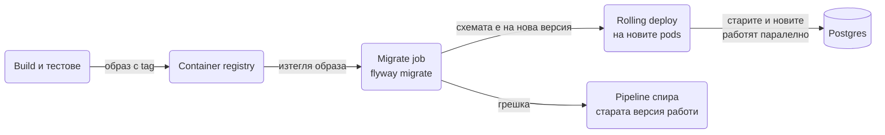

# Миграции

Схемата на базата е код: версионира се, минава през code review и се прилага по един и същ начин локално, в CI и в production. В Spring Boot това се прави с Flyway (или Liquibase), а Hibernate само проверява, че entity класовете съвпадат с резултата. Този документ показва как се настройва Flyway за PostgreSQL, как се именуват и пишат миграциите, какво става в `flyway_schema_history` и защо никога не редактираш приложена миграция, как се правят промени без downtime по метода expand/contract, кога Liquibase е по-добрият избор, и как миграциите участват в тестовете. В края има пълен набор миграции за Order домейна от [Релации](Relations.md), които може да ползваш като шаблон.

| Какво | Кога | Инструмент |
|---|---|---|
| Създаване и промяна на таблици | Всеки нов entity или колона | Flyway `V__` миграция |
| Views, функции, тригери | Обекти, които се преписват целите | Flyway `R__` миграция |
| Трансформация на данни с логика | Преизчисляване, парсване, слепване | Java миграция |
| Голям backfill на милиони редове | Промяна, която трае минути | Batch job извън Flyway |
| Rollback на схема | Регламентиран процес с одобрение | Liquibase `rollback` блок |
| Проверка, че схемата съвпада с кода | Винаги | `spring.jpa.hibernate.ddl-auto=validate` |
| Начални данни за dev и тестове | Справочници, демо потребители | Виж [Seeding](Seeding.md) |

## 1. Зависимости и настройка

### Защо не ddl-auto=update

`spring.jpa.hibernate.ddl-auto=update` кара Hibernate да сравни entity класовете със схемата при старт и да добави каквото липсва. Проблемите:

- Добавя, но никога не трие и не преименува. Преименуваш `name` на `full_name` и получаваш две колони.
- Не знае за индекси (освен тези в `@Table`), constraints, partial индекси, `check`, defaults на ниво база.
- Схемата в production е резултат от историята на всички стартирания на всички версии, а не от нещо, което можеш да прочетеш в git.
- Две инстанции стартират едновременно и двете опитват `alter table`.
- Няма как да направиш `update orders set status = 'PAID' where ...` като част от промяната.

Миграциите са поредица от SQL файлове с версия. Flyway ги прилага в ред, записва кои са минали, и отказва да стартира, ако някой е променил приложен файл. Hibernate остава с `ddl-auto=validate`, който хваща разминаване между миграцията и entity-то при старт.

### Maven

```xml
<dependency>
    <groupId>org.flywaydb</groupId>
    <artifactId>flyway-core</artifactId>
</dependency>
<dependency>
    <groupId>org.flywaydb</groupId>
    <artifactId>flyway-database-postgresql</artifactId>
</dependency>
```

От Flyway 10 поддръжката на всяка база е отделен модул, без `flyway-database-postgresql` стартирането гърми с `Unsupported Database: PostgreSQL`. Версиите са управлявани от `spring-boot-starter-parent`.

### application.yml

```yaml
spring:
  flyway:
    enabled: true
    locations: classpath:db/migration
    baseline-on-migrate: false
    validate-on-migrate: true
    out-of-order: false
    clean-disabled: true
  jpa:
    hibernate:
      ddl-auto: validate
```

- `locations`: къде са файловете. По подразбиране `classpath:db/migration`, тоест `src/main/resources/db/migration`. Може няколко, разделени със запетая.
- `baseline-on-migrate`: ако базата вече има таблици, но няма `flyway_schema_history`, Flyway отказва да работи. С `true` създава history таблицата и маркира текущото състояние като версия `baseline-version` (по подразбиране 1). Нужно е само когато вкарваш Flyway в съществуваща база, след това го върни на `false`.
- `validate-on-migrate`: преди да приложи нови миграции, Flyway сравнява checksums на вече приложените с файловете на classpath-а. При разминаване стартирането спира. Дръж го `true`.
- `out-of-order`: по подразбиране Flyway отказва да приложи миграция с версия, по-малка от последната приложена. Това се случва, когато два branch-а добавят миграции и вторият merge-не след първия, но с по-ранен timestamp. С `true` я прилага. Виж раздел 3 за кога е безопасно.
- `clean-disabled`: `flyway.clean()` трие всичко в схемата. От Flyway 9 е изключено по подразбиране, и така трябва да остане извън тестове.

Flyway се изпълнява при старт на контекста, преди `EntityManagerFactory`, така че Hibernate валидира вече мигрираната схема.

## 2. Минимален работещ пример

`src/main/resources/db/migration/V20250107_1000__create_products.sql`:

```sql
create table products (
    id         bigint generated by default as identity primary key,
    sku        varchar(64)    not null,
    name       varchar(255)   not null,
    price      numeric(12, 2) not null check (price >= 0),
    status     varchar(32)    not null default 'ACTIVE',
    version    integer        not null default 0,
    created_at timestamptz    not null default now(),
    updated_at timestamptz    not null default now(),
    constraint uq_products_sku unique (sku)
);
```

Стартираш приложението и в лога:

```
Flyway Community Edition 11.x by Redgate
Database: jdbc:postgresql://localhost:5432/shop (PostgreSQL 16.4)
Successfully validated 1 migration (execution time 00:00.012s)
Creating Schema History table "public"."flyway_schema_history" ...
Current version of schema "public": << Empty Schema >>
Migrating schema "public" to version "20250107.1000 - create products"
Successfully applied 1 migration to schema "public", now at version v20250107.1000
```

Следващата промяна е нов файл, никога редакция на този:

`V20250109_1415__add_products_category.sql`:

```sql
alter table products add column category varchar(64);
create index idx_products_category on products (category);
```

## 3. Именуване и видове миграции

### Формат на името

```
V20250107_1030__create_orders.sql
^ ^              ^ ^
| |              | описание, думи с подчертавка
| |              две подчертавки
| версия: timestamp yyyyMMdd_HHmm
префикс V за versioned
```

Flyway чете `20250107_1030` като версия `20250107.1030` и сортира числово. Описанието влиза в history таблицата, затова го прави смислено: `create_orders`, `add_orders_shipping_address`, `backfill_order_totals`.

### Timestamp срещу последователни номера

С `V1__`, `V2__`, `V3__` два разработчика в два branch-а правят `V4__` едновременно и единият трябва да преименува след merge, което при вече приложена локално миграция значи `flyway repair` или ръчно чистене на history таблицата. С timestamp версии колизията е практически невъзможна. Остава проблемът с реда: branch A създава `V20250107_1000`, branch B създава `V20250108_0900`, B се merge-ва пръв и минава в staging, после A се merge-ва с по-малка версия. Flyway отказва с `Detected resolved migration not applied to database: 20250107.1000`.

Два изхода: `out-of-order: true` (Flyway я прилага, въпреки че е "в миналото") или правило в екипа, че при merge на по-стар branch timestamp-ът се обновява. Второто е по-чисто, защото редът в git съвпада с реда в базата. `out-of-order: true` е приемливо само ако миграциите са независими една от друга, което не можеш да гарантираш в общия случай.

### Repeatable миграции

`R__order_summary_view.sql`:

```sql
create or replace view order_summary as
select o.id,
       o.number,
       o.status,
       o.total,
       c.email as customer_email,
       count(i.id) as item_count
from orders o
join customers c on c.id = o.customer_id
left join order_items i on i.order_id = o.id
group by o.id, c.email;
```

`R__` миграциите нямат версия. Flyway ги прилага след всички versioned, при всяко стартиране, в което checksum-ът на файла е различен от последния приложен. Това значи, че view-то се редактира на място, в същия файл, и git diff показва реалната промяна. Използвай ги за views, функции, тригери и всичко, което се дефинира с `create or replace`. Не ги ползвай за данни или таблици.

Ако view-то зависи от колона, която нова `V__` миграция трие, редът е: versioned миграцията премахва колоната, после repeatable-ът пресъздава view-то. Flyway го прави правилно, защото `R__` минават последни. Но ако view-то блокира `alter table` (Postgres отказва да премахне колона, от която view зависи), трябва `drop view` във versioned миграцията.

### Undo миграции

`U__` файлове съществуват само в платените издания на Flyway. В community edition няма rollback: ако миграция е грешна, пишеш нова миграция, която я поправя (`V20250110_1200__fix_orders_status_default.sql`). Това е и по-честната практика: в production rollback на схема с данни рядко е наистина обратим.

### Java миграции

За трансформации, които се описват трудно в SQL (парсване на JSON, викане на библиотека, batch с логика):

```java
package db.migration;

import org.flywaydb.core.api.migration.BaseJavaMigration;
import org.flywaydb.core.api.migration.Context;

import java.sql.PreparedStatement;
import java.sql.ResultSet;
import java.sql.Statement;

public class V20250112_0900__Normalize_customer_emails extends BaseJavaMigration {

    @Override
    public void migrate(Context context) throws Exception {
        try (Statement select = context.getConnection().createStatement();
             PreparedStatement update = context.getConnection()
                     .prepareStatement("update customers set email = ? where id = ?")) {
            ResultSet rs = select.executeQuery("select id, email from customers");
            int batch = 0;
            while (rs.next()) {
                update.setString(1, rs.getString("email").trim().toLowerCase());
                update.setLong(2, rs.getLong("id"));
                update.addBatch();
                if (++batch % 500 == 0) {
                    update.executeBatch();
                }
            }
            update.executeBatch();
        }
    }
}
```

Класът е в пакет `db.migration` (съвпада с `locations`, Flyway сканира същия път и за класове) и името следва същия формат. Използва чист JDBC, не Spring bean-ове и не entity класове: entity-то може да се промени следващия месец, а миграцията трябва да работи по същия начин завинаги. Spring Boot регистрира и `JavaMigration` bean-ове от контекста, но зависимост от Spring контекста в миграция е лоша идея по същата причина.

## 4. Как работи Flyway отвътре

### flyway_schema_history

| Колона | Какво |
|---|---|
| `installed_rank` | Пореден номер на прилагане |
| `version` | `20250107.1000`, `null` за repeatable |
| `description` | От името на файла |
| `type` | `SQL`, `JDBC` (Java), `BASELINE` |
| `script` | Името на файла |
| `checksum` | CRC32 на съдържанието |
| `installed_by` | DB потребител |
| `installed_on` | Кога |
| `execution_time` | Милисекунди |
| `success` | `true`/`false` |

При старт Flyway заключва history таблицата (така две инстанции не мигрират едновременно), чете приложените, сравнява с файловете, валидира checksums, и прилага новите по ред. Всяка SQL миграция по подразбиране е в собствена транзакция: ако третият statement гърми, първите два се rollback-ват и редът в history не се записва (Postgres поддържа транзакционен DDL, което е голямо предимство пред MySQL).

### Никога не редактирай приложена миграция

Checksum-ът се сравнява при всеки старт. Промениш ли `V20250107_1000__create_products.sql` след като е минал в staging, staging отказва да стартира с `Migration checksum mismatch for migration version 20250107.1000`. Локалната ти база, където си преправял файла, не е доказателство за нищо. Правилото: файлът е immutable в момента, в който е merge-нат в main. Поправката е нова миграция. Единственото изключение е миграция, която още не е напуснала твоя branch.

Ако все пак се наложи (някой е променил whitespace в 20 файла за форматиране): `flyway repair` преизчислява checksums по текущите файлове и чисти failed редове. Това е ръчна операция от оператор, не нещо, което приложението прави при старт.

### Maven plugin

За `info`, `validate` и `repair` без да стартираш приложението:

```xml
<plugin>
    <groupId>org.flywaydb</groupId>
    <artifactId>flyway-maven-plugin</artifactId>
    <configuration>
        <url>${env.DB_URL}</url>
        <user>${env.DB_USER}</user>
        <password>${env.DB_PASSWORD}</password>
        <locations>
            <location>filesystem:src/main/resources/db/migration</location>
        </locations>
    </configuration>
    <dependencies>
        <dependency>
            <groupId>org.flywaydb</groupId>
            <artifactId>flyway-database-postgresql</artifactId>
            <version>${flyway.version}</version>
        </dependency>
        <dependency>
            <groupId>org.postgresql</groupId>
            <artifactId>postgresql</artifactId>
            <version>${postgresql.version}</version>
        </dependency>
    </dependencies>
</plugin>
```

```bash
mvn flyway:info       # таблица: версия, описание, състояние Pending/Success/Failed
mvn flyway:validate   # проверява checksums без да прилага
mvn flyway:migrate    # прилага, същото като при старт на приложението
mvn flyway:repair     # преизчислява checksums, маха failed редове
```

`${flyway.version}` и `${postgresql.version}` са property-та, които `spring-boot-starter-parent` дефинира, затова не пишеш версии на ръка.

## 5. Кога се изпълняват миграциите

Flyway при старт на приложението е default-ът и работи добре за малки екипи и единични инстанции. При няколко инстанции и Kubernetes има алтернатива: отделна стъпка в pipeline-а преди deploy.



| Критерий | При старт на приложението | Отделна стъпка в pipeline |
|---|---|---|
| Простота | Няма допълнителна инфраструктура | Job в CI или Kubernetes `initContainer`/`Job` |
| Няколко инстанции | Flyway заключва history таблицата, другите чакат. Работи, но стартът на 5 pods се сериализира | Една миграция, после всички pods стартират чисти |
| Грешка в миграцията | Pod-ът крашва и рестартира в цикъл, докато някой не види | Pipeline-ът спира преди deploy, старата версия продължава |
| DB права на приложението | Нужни са DDL права | Приложението може да е с DML права само, миграцията с отделен потребител |
| Дълга миграция | Readiness probe изтича, Kubernetes убива pod-а по средата | Job без timeout на readiness |
| Локална разработка | Стартираш и всичко е актуално | Трябва и локално да я пускаш, обикновено пак през старт с профил |

Препоръка: при старт за dev и за сървиси с 1 до 2 инстанции, отделна стъпка за всичко с rolling deploy. Комбинацията е проста: `spring.flyway.enabled: true` в `local` профил, `false` в `prod`, а в pipeline-а същият образ се пуска с `java -jar app.jar --spring.main.web-application-type=none --app.migrate-only=true` или директно `mvn flyway:migrate` / Flyway CLI с папката с миграции. Виж [Docker и деплой](Docker_Deploy.md) за Kubernetes Job примера.

## 6. Схеми и placeholders

Няколко схеми в една база (например `shop` и `audit`):

```yaml
spring:
  flyway:
    schemas: shop,audit
    default-schema: shop
    create-schemas: true
```

Flyway създава схемите, ако липсват, слага history таблицата в `default-schema` и изпълнява миграциите със `search_path` към нея. В SQL пиши `audit.events` явно за втората схема.

Placeholders за стойности, които се различават по среда:

```yaml
spring:
  flyway:
    placeholders:
      app_user: shop_app
      reporting_user: shop_reporting
```

```sql
grant select, insert, update, delete on all tables in schema shop to ${app_user};
grant select on all tables in schema shop to ${reporting_user};
```

Внимавай: `${...}` в SQL се замества и в string литерали. Ако ти трябва буквално `${`, изключи `placeholder-replacement: false` за този файл чрез `.conf` файл до него или смени `placeholder-prefix`.

## 7. Liquibase като алтернатива

```xml
<dependency>
    <groupId>org.liquibase</groupId>
    <artifactId>liquibase-core</artifactId>
</dependency>
```

```yaml
spring:
  liquibase:
    change-log: classpath:db/changelog/db.changelog-master.yaml
```

`db.changelog-master.yaml`:

```yaml
databaseChangeLog:
  - include:
      file: db/changelog/2025/01-07-create-orders.yaml
  - include:
      file: db/changelog/2025/01-15-add-shipping-address.yaml
```

`01-15-add-shipping-address.yaml`:

```yaml
databaseChangeLog:
  - changeSet:
      id: add-shipping-address-columns
      author: dobril
      preConditions:
        - onFail: MARK_RAN
        - not:
            - columnExists:
                tableName: orders
                columnName: shipping_street
      changes:
        - addColumn:
            tableName: orders
            columns:
              - column:
                  name: shipping_street
                  type: varchar(255)
              - column:
                  name: shipping_city
                  type: varchar(100)
      rollback:
        - dropColumn:
            tableName: orders
            columnName: shipping_street
        - dropColumn:
            tableName: orders
            columnName: shipping_city

  - changeSet:
      id: add-orders-status-index
      author: dobril
      changes:
        - sql:
            sql: create index idx_orders_status_created_at on orders (status, created_at)
      rollback:
        - sql:
            sql: drop index idx_orders_status_created_at
```

Всеки `changeSet` се идентифицира по `id` + `author` + път на файла и се записва в `databasechangelog`. `preConditions` с `onFail: MARK_RAN` прави changeSet-а идемпотентен спрямо вече съществуваща колона. `rollback` блокът се изпълнява с `mvn liquibase:rollback -Dliquibase.rollbackCount=1` или по tag.

| Критерий | Flyway | Liquibase |
|---|---|---|
| Формат | Чист SQL, Java | YAML/XML/JSON абстракции, или `sql` блок |
| Четимост в review | Виждаш точния SQL | Абстракцията крие какво точно се изпълнява |
| Rollback | Платено издание или нова forward миграция | Вграден, с `rollback` блок на всеки changeSet |
| Няколко бази (Postgres и Oracle в един продукт) | Отделни папки с миграции | Един changelog, Liquibase превежда типовете |
| Условно изпълнение | Няма в community | `preConditions`, `context`, `labels` |
| Крива на учене | Нулева, ако знаеш SQL | Трябва да научиш DSL-а |
| Generate diff от entity | Не | `liquibase:diff` срещу Hibernate |

Избери Liquibase, когато: имаш регламентирано изискване за rollback скриптове, продуктът ти се инсталира при клиенти с различни бази, или екипът вече го ползва. За един Postgres и един екип Flyway е по-прост и SQL-ът в review е безценен.

## 8. Zero-downtime промени

При rolling deploy старата и новата версия на приложението работят едновременно срещу една схема. Всяка миграция трябва да е съвместима и с двете. Методът е expand/contract: разшири схемата така, че и старият, и новият код да работят, deploy-ни новия код, после свий схемата.


### Добавяне на колона с NOT NULL

Директно `alter table orders add column channel varchar(32) not null` гърми на съществуващите редове. С default `not null default 'WEB'` минава, и в Postgres 11+ е бързо (default-ът се пази в каталога, редовете не се пренаписват). Но ако стойността зависи от данните:

1. `V1`: `alter table orders add column channel varchar(32);`
2. Deploy код, който пише `channel` при всеки insert/update и чете го с fallback.
3. Backfill на batch-ове (раздел 9).
4. `V2`: `alter table orders alter column channel set not null;` Postgres трябва да сканира таблицата, за да провери, което е бързо при индекс и бавно при 100 милиона реда. За големи таблици: `add constraint chk_channel check (channel is not null) not valid`, после `validate constraint` (без пълен lock), после `set not null` (Postgres 12+ ползва constraint-а и не сканира).

### Преименуване на колона в три deploy-а

`alter table rename column` е мигновен, но старият код гърми веднага след него. Преименуване без downtime:

1. Deploy 1: миграция добавя `full_name`, код пише в `name` и `full_name`, чете от `full_name` с fallback към `name`. Backfill копира `name` в `full_name`.
2. Deploy 2: код пише и чете само `full_name`.
3. Deploy 3: миграция трие `name`.

Ако преименуването не си струва три deploy-а, не го прави. Entity полето може да се казва `fullName` с `@Column(name = "name")`.

### Индекс CONCURRENTLY

`create index` заключва таблицата за писане, докато трае. На таблица с милиони редове това са минути downtime за всеки insert. `create index concurrently` не заключва, но не може да се изпълни в транзакция, а Flyway по подразбиране увива всяка миграция в транзакция. Postgres отговаря с `CREATE INDEX CONCURRENTLY cannot run inside a transaction block`.

Сигурният начин в community edition е Java миграция, която казва на Flyway да не отваря транзакция:

```java
package db.migration;

import org.flywaydb.core.api.migration.BaseJavaMigration;
import org.flywaydb.core.api.migration.Context;

import java.sql.Statement;

public class V20250120_1100__Index_orders_customer_concurrently extends BaseJavaMigration {

    @Override
    public boolean canExecuteInTransaction() {
        return false;
    }

    @Override
    public void migrate(Context context) throws Exception {
        try (Statement st = context.getConnection().createStatement()) {
            st.execute("create index concurrently if not exists idx_orders_customer_id on orders (customer_id)");
        }
    }
}
```

Flyway поддържа и script config файлове (`V20250120_1100__index.sql.conf` със съдържание `executeInTransaction=false`) до SQL миграцията, но проверете в документацията на Flyway за вашата версия дали тази настройка е налична извън платените издания, преди да разчитате на нея. Глобалното `execute-in-transaction=false` изключва транзакциите за всички миграции, което губи rollback при грешка и не е добра идея.

`if not exists` е важно: `concurrently` при грешка оставя невалиден индекс, който трябва да се `drop` преди повторен опит, и Flyway ще е записал миграцията като failed. Ако миграцията се провали, оператор пуска `drop index if exists`, `flyway repair`, и повтаря.

Същата логика важи за `alter table ... add constraint ... not valid` + `validate constraint` и за `drop index concurrently`.

### Какво никога не прави в rolling deploy

- Премахване или преименуване на колона, която текущият код чете.
- `alter column type`, който пренаписва таблицата (`varchar` към `text` е ок, `integer` към `bigint` пренаписва).
- `add column ... default <volatile>` като `now()` на голяма таблица преди Postgres 11.
- Промяна на enum стойност, която старият код записва.

## 9. Големи data миграции

Миграция, която `update`-ва 50 милиона реда, държи lock и транзакция с часове, пълни WAL-а и блокира deploy-а. Flyway не е инструмент за това. Структурата е:

1. `V__` миграция добавя колоната (nullable) и евентуално индекс върху "непопълнено" условие.
2. Backfill като application job (`@Scheduled` или ръчно пуснат endpoint за админ), който обработва на batch-ове с отделни транзакции:

```java
@Component
public class OrderChannelBackfill {

    private final JdbcClient jdbc;
    private final TransactionTemplate tx;

    public OrderChannelBackfill(JdbcClient jdbc, PlatformTransactionManager txm) {
        this.jdbc = jdbc;
        this.tx = new TransactionTemplate(txm);
    }

    public long run() {
        long total = 0;
        int updated;
        do {
            updated = tx.execute(status -> jdbc.sql("""
                    with batch as (
                        select id from orders
                        where channel is null
                        order by id
                        limit 5000
                        for update skip locked
                    )
                    update orders o
                    set channel = case when o.source_app = 'ios' or o.source_app = 'android' then 'MOBILE' else 'WEB' end
                    from batch
                    where o.id = batch.id
                    """).update());
            total += updated;
        } while (updated > 0);
        return total;
    }
}
```

3. Когато `select count(*) from orders where channel is null` е 0, следваща `V__` миграция слага `not null` и трие помощния индекс.

Същият подход за преместване на данни между таблици, за пресмятане на денормализирани полета и за всичко над няколкостотин хиляди реда. Виж [Cron, @Async и опашки](Scheduling_Queues.md) за пускането като job.

## 10. Миграции и тестове

С Testcontainers Postgres Flyway прилага миграциите при всеки старт на тестов контекст, върху празна база. Това е най-добрият тест за миграциите: ако не минават, нито един интеграционен тест не минава.

```java
@SpringBootTest
@Testcontainers
class OrderFlowTest {

    @Container
    @ServiceConnection
    static PostgreSQLContainer<?> postgres = new PostgreSQLContainer<>("postgres:16-alpine");
}
```

`src/test/resources/application-test.yml`:

```yaml
spring:
  flyway:
    locations: classpath:db/migration,classpath:db/testdata
    clean-disabled: false
  jpa:
    hibernate:
      ddl-auto: validate
```

- `db/testdata` съдържа миграции само за тестове (`V99999999_0001__test_fixtures.sql` с голяма версия, за да е винаги последна, или `R__test_fixtures.sql`). Те не са на classpath-а на production. Seed данните за dev са отделна тема, виж [Seeding](Seeding.md).
- `clean-disabled: false` позволява `flyway.clean()` в тестове, ако искаш да нулираш схемата между тестови класове. Повечето setup-и не го ползват, а чистят таблиците с `truncate ... cascade` в `@BeforeEach`.
- `ddl-auto: validate` и в тестовете: това е мястото, където забравена колона в миграцията се хваща преди CI да е зелен.

Ако тестът е `@DataJpaTest`, Flyway също се включва (auto-configuration-ът го зарежда), стига да изключиш замяната на datasource-а, виж [Testing](Testing.md).

Отделен smoke тест, който проверява, че `R__` view-тата и функциите се компилират, не ти трябва: Flyway ги прилага при старт и грешка в тях чупи контекста.

## 11. Чеклист за review на миграция

При PR с миграция reviewer-ът проверява:

- Името е с timestamp от днес, описанието казва какво прави, файлът е нов, а не редактиран стар.
- Миграцията е съвместима с текущата production версия на кода (expand, не contract) или PR-ът явно казва, че е contract стъпка след вече deploy-нат код.
- Всяка нова FK колона има индекс.
- Всяка нова `not null` колона има default или таблицата е празна, или има план за backfill.
- `create index` на таблица над 100 000 реда е `concurrently` чрез Java миграция.
- Няма `update` или `delete` над голяма таблица без batching.
- Няма hardcoded данни, които са seed, а не схема.
- Entity класовете са променени в същия PR и `ddl-auto=validate` минава в CI.
- Миграцията е пусната локално върху копие на production схема (или поне върху база с реалистичен обем), ако пипа голяма таблица.
- Repeatable миграция не зависи от обект, който бъдеща versioned миграция ще промени несъвместимо.

## 12. Пълен пример: миграции за Order домейна

`V20250107_1000__create_customers_and_products.sql`:

```sql
create table customers (
    id                   bigint generated by default as identity primary key,
    email                varchar(255) not null,
    full_name            varchar(255) not null,
    default_street       varchar(255),
    default_city         varchar(100),
    default_postal_code  varchar(20),
    default_country      varchar(2),
    deleted_at           timestamptz,
    created_at           timestamptz  not null default now(),
    updated_at           timestamptz  not null default now()
);

create unique index uq_customers_email_active on customers (email) where deleted_at is null;

create table products (
    id         bigint generated by default as identity primary key,
    sku        varchar(64)    not null,
    name       varchar(255)   not null,
    price      numeric(12, 2) not null check (price >= 0),
    status     varchar(32)    not null default 'ACTIVE',
    version    integer        not null default 0,
    created_at timestamptz    not null default now(),
    updated_at timestamptz    not null default now(),
    constraint uq_products_sku unique (sku)
);

create index idx_products_status on products (status);
```

`V20250107_1030__create_orders.sql`:

```sql
create table orders (
    id                   bigint generated by default as identity primary key,
    number               varchar(32)    not null,
    customer_id          bigint         not null references customers (id),
    status               varchar(32)    not null default 'DRAFT',
    total                numeric(12, 2) not null default 0 check (total >= 0),
    shipping_street      varchar(255)   not null,
    shipping_city        varchar(100)   not null,
    shipping_postal_code varchar(20)    not null,
    shipping_country     varchar(2)     not null,
    version              integer        not null default 0,
    created_at           timestamptz    not null default now(),
    constraint uq_orders_number unique (number)
);

create index idx_orders_customer_id on orders (customer_id);
create index idx_orders_status_created_at on orders (status, created_at desc);

create table order_items (
    id         bigint         generated by default as identity primary key,
    order_id   bigint         not null references orders (id) on delete cascade,
    product_id bigint         not null references products (id),
    quantity   integer        not null check (quantity > 0),
    unit_price numeric(12, 2) not null check (unit_price >= 0)
);

create index idx_order_items_order_id on order_items (order_id);
create index idx_order_items_product_id on order_items (product_id);
```

`on delete cascade` на `order_items.order_id` е застраховка за ръчни операции в базата; в приложението изтриването минава през `cascade = ALL` на entity-то и Hibernate трие редовете сам.

`V20250110_0900__create_shipments_and_tags.sql`:

```sql
create table order_shipments (
    order_id    bigint       primary key references orders (id),
    carrier     varchar(64)  not null,
    tracking_no varchar(128) not null,
    shipped_at  timestamptz  not null default now()
);

create table tags (
    id   bigint      generated by default as identity primary key,
    name varchar(64) not null,
    constraint uq_tags_name unique (name)
);

create table order_tags (
    order_id bigint       not null references orders (id) on delete cascade,
    tag_id   bigint       not null references tags (id),
    added_by varchar(100) not null,
    added_at timestamptz  not null default now(),
    primary key (order_id, tag_id)
);

create index idx_order_tags_tag_id on order_tags (tag_id);
```

`V20250115_1200__add_orders_channel.sql` (expand стъпка):

```sql
alter table orders add column channel varchar(32);

comment on column orders.channel is 'WEB или MOBILE. Nullable до приключване на backfill, после V__ миграция слага not null';
```

`V20250122_1000__orders_channel_not_null.sql` (contract стъпка, след backfill и deploy):

```sql
alter table orders add constraint chk_orders_channel_present check (channel is not null) not valid;
alter table orders validate constraint chk_orders_channel_present;
alter table orders alter column channel set not null;
alter table orders drop constraint chk_orders_channel_present;
```

`R__order_summary_view.sql`:

```sql
create or replace view order_summary as
select o.id,
       o.number,
       o.status,
       o.channel,
       o.total,
       o.created_at,
       c.email      as customer_email,
       c.full_name  as customer_name,
       (select count(*) from order_items i where i.order_id = o.id) as item_count
from orders o
join customers c on c.id = o.customer_id;
```

Entity класовете за тези таблици са в [Релации](Relations.md), а repository и `JdbcClient` заявките върху тях в [База данни и ORM](Database_ORM.md).

## 13. Капани

- `ddl-auto=update` "само локално": локалната схема се разминава с миграциите, и миграцията, която гърми в staging, е работила при теб. `validate` навсякъде.
- Редактиране на приложена миграция: checksum mismatch и сървисът не стартира в staging. Нова миграция винаги.
- Последователни номера `V1`, `V2`: конфликт при всеки паралелен branch. Timestamp версии.
- `out-of-order: true` като постоянна настройка: миграции се прилагат в различен ред в различни среди и зависимости между тях се чупят тихо. Обновявай timestamp-а при merge.
- Липсваща `flyway-database-postgresql` зависимост след ъпгрейд на Flyway 10+: `Unsupported Database`. Добави модула.
- `create index` без `concurrently` на голяма таблица в production: таблицата е заключена за писане минути наред.
- `create index concurrently` в обикновена SQL миграция: Postgres отказва, защото е в транзакция. Java миграция с `canExecuteInTransaction() = false`.
- Миграция, която `update`-ва милиони редове: lock, WAL, timeout на deploy-а. Batch job извън Flyway.
- Contract стъпка (drop column) в същия deploy като кода, който спира да я ползва: при rolling deploy старите pods гърмят. Отделен deploy, след като всички pods са нови.
- Seed данни в `db/migration`: production получава демо потребители. Отделна locations папка само за тестове и dev.
- `baseline-on-migrate: true` оставен включен: при грешно конфигуриран URL към празна база Flyway прави baseline и после нищо не стартира, защото таблиците липсват. Включвай го само за еднократното въвеждане.
- Flyway при старт с readiness probe от 10 секунди и миграция, която трае 2 минути: Kubernetes убива pod-а, миграцията остава failed в history, следващият pod отказва да стартира. Отделна migrate стъпка.

## 14. Чеклист

- [ ] `flyway-core` + `flyway-database-postgresql` в pom.xml, `ddl-auto: validate` във всички профили
- [ ] `src/main/resources/db/migration` с timestamp именуване `VyyyyMMdd_HHmm__description.sql`
- [ ] `validate-on-migrate: true`, `out-of-order: false`, `clean-disabled: true` извън тестове
- [ ] Views и функции са в `R__` миграции
- [ ] Всяка FK колона има индекс в същата миграция
- [ ] Реши къде се изпълняват миграциите (старт или pipeline стъпка) и го документирай в README на сървиса
- [ ] `flyway-maven-plugin` е конфигуриран за `info` и `repair`
- [ ] Промените по схемата следват expand/contract и са в отделни deploy-и
- [ ] Индекси върху големи таблици са `concurrently` чрез Java миграция
- [ ] Backfill над големи таблици е batch job, не миграция
- [ ] Тестовете минават миграциите върху Testcontainers Postgres, тестовите fixtures са в отделна locations папка
- [ ] Чеклистът за review на миграция е в PR template-а

## 15. Свързани документи

- [База данни и ORM](Database_ORM.md): `ddl-auto=validate`, datasource конфигурация и как Hibernate валидира схемата.
- [Релации](Relations.md): entity класовете, които съответстват на миграциите от раздел 12.
- [Seeding](Seeding.md): начални и демо данни отделно от схемата.
- [Testing](Testing.md): Testcontainers, `@ServiceConnection`, споделен контейнер между тестови класове.
- [Docker и деплой](Docker_Deploy.md): migrate стъпка като Kubernetes Job преди rolling deploy.
- [Cron, @Async и опашки](Scheduling_Queues.md): пускане на backfill job-ове.
- [Flyway documentation](https://documentation.red-gate.com/flyway)
