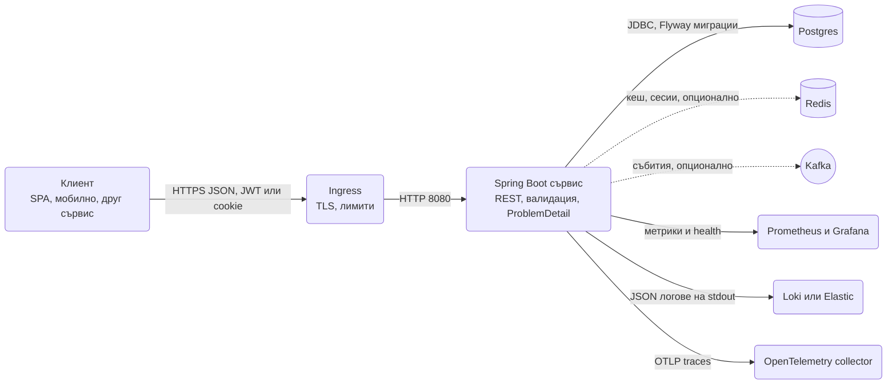

# Нов сървис: чеклист

Първият ден на нов Spring Boot сървис решава колко болезнени ще са следващите шест месеца: кое е "по подразбиране" в проекта става почти невъзможно за смяна, след като има десет контролера и три екипа отгоре. Този документ е входната точка на наръчника: единадесет фази от решенията преди първия ред код до production, всяка като списък с конкретни действия и линк към документа, който обяснява защо и как. Тук са минималният `pom.xml`, минималният `application.yml` с настройките, които наръчникът препоръчва, препоръчаната структура на пакетите, кое може да чака и кое не, и какво е различно между уебсайт и микросървис. Мини през списъка отгоре надолу и отмятай.

| Фаза | Резултат в края | Време при опит |
|---|---|---|
| 1. Преди първия ред код | Пет взети решения, записани в README | 1 час |
| 2. Скелет | Проект, който стартира с празен контекст | 30 минути |
| 3. Конфигурация | Профили, `@ConfigurationProperties`, secrets отвън | 1 час |
| 4. База данни | Postgres в Testcontainers, първа Flyway миграция, първо entity | 2 часа |
| 5. HTTP слой | Първи endpoint с валидация и `ProblemDetail` | 1 час |
| 6. Сигурност | `SecurityFilterChain`, login или JWT, тест за 401 и 403 | 2 часа |
| 7. Интеграции | Само това, което е нужно за първата функционалност | по нужда |
| 8. Observability и логове | JSON логове, request id, health, Prometheus | 1 час |
| 9. Тестове | Пирамида с slice и integration тестове, CI зелен | 1 час |
| 10. Docker и CI | Image с git sha, pipeline, compose за dev | 2 часа |
| 11. Преди production | Graceful shutdown, probes, миграции, чеклист за деплой | 1 час |

## 1. Преди първия ред код

Тези решения се вземат с екипа, преди Initializr. Всяко от тях променя скелета.

- [ ] Решено е дали това е модулен монолит или микросървис: ако е първият сървис на продукта, или екипът е под шест души, започни с модулен монолит с пакети по feature, който по-късно се реже, виж [Структура на проекта](Project_Setup.md).
- [ ] Решено е дали комуникацията с другите системи е синхронна през HTTP или асинхронна през broker: синхронна по подразбиране, broker само когато има реална нужда от decoupling или replay, виж [Message brokers](Message_Brokers.md) и [HTTP клиенти](HTTP_Clients.md).
- [ ] Решено е дали автентикацията е session cookie или JWT: сайт с Thymeleaf и един backend значи session, API за SPA или мобилно приложение и няколко сървиса значи JWT или OAuth2 resource server, виж [Authentication](Authentication.md) и [Sessions](Sessions.md).
- [ ] Postgres е базата по подразбиране, освен ако няма много конкретна причина за друго; една база на сървис, без споделени схеми между сървиси, виж [База данни и ORM](Database_ORM.md).
- [ ] Записано е какво може да чака (кеш, Kafka, WebSockets, i18n) и какво не може (миграции, error contract, логове, probes, тестова инфраструктура), виж раздел 12 по-долу.
- [ ] Избран е формат на идентификаторите (UUID v7 или `bigint` sequence) и той е еднакъв за всички таблици, виж [База данни и ORM](Database_ORM.md).
- [ ] Избрана е стратегия за версии на API още преди първия endpoint, най-често `/api/v1` в path-а, виж [Routing](Routing.md).
- [ ] Знаеш къде ще се деплойва: Kubernetes, една VM със systemd, или PaaS, защото това определя как се подават secrets и health probes, виж [Docker и деплой](Docker_Deploy.md).

Препоръчаната архитектура по подразбиране за нов сървис изглежда така. Broker-ът и Redis са опционални и се добавят, когато има нужда.



## 2. Скелет на проекта

- [ ] Проектът е генериран от Spring Initializr с Java 21, Maven, Spring Boot 3.5.x и starters от минималния `pom.xml` по-долу, нищо повече, виж [Структура на проекта](Project_Setup.md).
- [ ] Пакетите са по feature (`orders`, `customers`, `billing`), не по слой (`controllers`, `services`, `repositories`), виж [Структура на проекта](Project_Setup.md).
- [ ] Основният клас е в root пакета, за да работи component scan без изрични `scanBasePackages`, виж [Структура на проекта](Project_Setup.md).
- [ ] Инжектирането е през конструктор навсякъде, без `@Autowired` на полета, с `final` полета, виж [Структура на проекта](Project_Setup.md).
- [ ] DTO-тата са `record`, entity-тата са класове, и двете никога не се смесват в един тип, виж [DTO и mapping](DTO_Mapping.md).
- [ ] `mvnw` и `.mvn/wrapper` са commit-нати, за да е еднаква версията на Maven в CI и локално, виж [Структура на проекта](Project_Setup.md).
- [ ] `.editorconfig` и formatter (Spotless или IDE настройки в репото) са добавени преди първия PR, за да няма diff-ове от форматиране, виж [Структура на проекта](Project_Setup.md).
- [ ] `README.md` съдържа как се стартира локално с една команда и линк към този чеклист.

### Минимален pom.xml за API сървис

```xml pom.xml
<?xml version="1.0" encoding="UTF-8"?>
<project xmlns="http://maven.apache.org/POM/4.0.0"
         xmlns:xsi="http://www.w3.org/2001/XMLSchema-instance"
         xsi:schemaLocation="http://maven.apache.org/POM/4.0.0 https://maven.apache.org/xsd/maven-4.0.0.xsd">
    <modelVersion>4.0.0</modelVersion>

    <parent>
        <groupId>org.springframework.boot</groupId>
        <artifactId>spring-boot-starter-parent</artifactId>
        <version>3.5.6</version> <!-- виж последната 3.5.x -->
        <relativePath/>
    </parent>

    <groupId>com.acme</groupId>
    <artifactId>shop</artifactId>
    <version>0.1.0-SNAPSHOT</version>

    <properties>
        <java.version>21</java.version>
    </properties>

    <dependencies>
        <dependency>
            <groupId>org.springframework.boot</groupId>
            <artifactId>spring-boot-starter-web</artifactId>
        </dependency>
        <dependency>
            <groupId>org.springframework.boot</groupId>
            <artifactId>spring-boot-starter-validation</artifactId>
        </dependency>
        <dependency>
            <groupId>org.springframework.boot</groupId>
            <artifactId>spring-boot-starter-data-jpa</artifactId>
        </dependency>
        <dependency>
            <groupId>org.springframework.boot</groupId>
            <artifactId>spring-boot-starter-security</artifactId>
        </dependency>
        <dependency>
            <groupId>org.springframework.boot</groupId>
            <artifactId>spring-boot-starter-actuator</artifactId>
        </dependency>
        <dependency>
            <groupId>org.postgresql</groupId>
            <artifactId>postgresql</artifactId>
            <scope>runtime</scope>
        </dependency>
        <dependency>
            <groupId>org.flywaydb</groupId>
            <artifactId>flyway-core</artifactId>
        </dependency>
        <dependency>
            <groupId>org.flywaydb</groupId>
            <artifactId>flyway-database-postgresql</artifactId>
        </dependency>
        <dependency>
            <groupId>io.micrometer</groupId>
            <artifactId>micrometer-registry-prometheus</artifactId>
            <scope>runtime</scope>
        </dependency>
        <dependency>
            <groupId>org.springframework.boot</groupId>
            <artifactId>spring-boot-docker-compose</artifactId>
            <scope>runtime</scope>
            <optional>true</optional>
        </dependency>

        <dependency>
            <groupId>org.springframework.boot</groupId>
            <artifactId>spring-boot-starter-test</artifactId>
            <scope>test</scope>
        </dependency>
        <dependency>
            <groupId>org.springframework.security</groupId>
            <artifactId>spring-security-test</artifactId>
            <scope>test</scope>
        </dependency>
        <dependency>
            <groupId>org.springframework.boot</groupId>
            <artifactId>spring-boot-testcontainers</artifactId>
            <scope>test</scope>
        </dependency>
        <dependency>
            <groupId>org.testcontainers</groupId>
            <artifactId>postgresql</artifactId>
            <scope>test</scope>
        </dependency>
        <dependency>
            <groupId>org.testcontainers</groupId>
            <artifactId>junit-jupiter</artifactId>
            <scope>test</scope>
        </dependency>
    </dependencies>

    <build>
        <plugins>
            <plugin>
                <groupId>org.springframework.boot</groupId>
                <artifactId>spring-boot-maven-plugin</artifactId>
                <executions>
                    <execution>
                        <goals>
                            <goal>build-info</goal>
                        </goals>
                    </execution>
                </executions>
            </plugin>
        </plugins>
    </build>
</project>
```

Всички версии освен parent-а са управлявани от `spring-boot-starter-parent`. `flyway-database-postgresql` е задължителен от Flyway 10 нататък, без него Flyway не разпознава Postgres.

### Препоръчана структура на пакетите

```text
src/main/java/com/acme/shop
├── ShopApplication.java
├── common/
│   ├── config/                 SecurityConfig, JacksonConfig, OpenApiConfig, AppProperties
│   ├── error/                  GlobalExceptionHandler, NotFoundException, ConflictException
│   ├── web/                    RequestIdFilter, PageResponse
│   └── security/               JwtService, CurrentUserProvider
├── order/
│   ├── Order.java              entity
│   ├── OrderItem.java
│   ├── OrderStatus.java
│   ├── OrderRepository.java
│   ├── OrderService.java
│   ├── OrderController.java
│   ├── OrderMapper.java
│   ├── OrderPlacedEvent.java
│   └── dto/                    CreateOrderRequest, OrderResponse
├── customer/
│   └── ...
└── payment/
    ├── PaymentService.java
    └── PaymentGatewayClient.java   @HttpExchange клиент към Stripe

src/main/resources
├── application.yml
├── application-dev.yml
├── application-prod.yml
└── db/migration/               V20250107_1030__create_orders.sql

src/test/java/com/acme/shop
├── AbstractIntegrationTest.java
└── order/                      OrderControllerTest, OrderServiceTest, OrderMother
```

Всеки feature пакет е самостоятелен и говори с другите само през service интерфейси или events, никога през repository на друг feature. Това е линията, по която по-късно се реже микросървис.

## 3. Конфигурация

- [ ] `application.yml` съдържа само настройки, еднакви за всички среди; разликите са в `application-dev.yml`, `application-prod.yml` и env променливи, виж [Конфигурация и профили](Configuration_Profiles.md).
- [ ] Всички настройки на приложението са в `@ConfigurationProperties` record с `@Validated`, не в разпръснати `@Value`, виж [Конфигурация и профили](Configuration_Profiles.md).
- [ ] Secrets никога не са в git: локално през `.env` в `.gitignore` или compose, в production през env или `spring.config.import=optional:configtree:/run/secrets/`, виж [Конфигурация и профили](Configuration_Profiles.md).
- [ ] Профилът `dev` е активен по подразбиране само локално чрез IDE или `SPRING_PROFILES_ACTIVE`, никога hardcoded в `application.yml`, виж [Конфигурация и профили](Configuration_Profiles.md).
- [ ] `spring.jpa.open-in-view=false` и `spring.jpa.hibernate.ddl-auto=validate` са зададени от първия ден, виж [База данни и ORM](Database_ORM.md).
- [ ] Jackson е настроен: `write-dates-as-timestamps=false`, `FAIL_ON_UNKNOWN_PROPERTIES=false`, `NON_NULL` или изрично решение за `null` полета, виж [DTO и mapping](DTO_Mapping.md).
- [ ] Time zone на JVM и на базата е UTC, датите в API са `Instant` или `OffsetDateTime` в ISO 8601, виж [DTO и mapping](DTO_Mapping.md).

### Минимален application.yml

```yaml src/main/resources/application.yml
spring:
  application:
    name: orders
  threads:
    virtual:
      enabled: true
  jpa:
    open-in-view: false
    hibernate:
      ddl-auto: validate
    properties:
      hibernate:
        jdbc:
          time_zone: UTC
  jackson:
    serialization:
      write-dates-as-timestamps: false
    deserialization:
      fail-on-unknown-properties: false
    default-property-inclusion: non_null
  mvc:
    problemdetails:
      enabled: true
  flyway:
    locations: classpath:db/migration
  lifecycle:
    timeout-per-shutdown-phase: 30s
  config:
    import: optional:configtree:/run/secrets/

server:
  shutdown: graceful
  forward-headers-strategy: framework
  error:
    include-stacktrace: never
    include-message: never

management:
  endpoints:
    web:
      exposure:
        include: health,info,prometheus
  endpoint:
    health:
      probes:
        enabled: true
      group:
        readiness:
          include: readinessState,db
  info:
    git:
      mode: simple

logging:
  level:
    root: info
    com.acme.shop: debug

---
spring:
  config:
    activate:
      on-profile: dev
  docker:
    compose:
      file: compose.yaml
      lifecycle-management: start-only
      skip:
        in-tests: true
  jpa:
    show-sql: false

---
spring:
  config:
    activate:
      on-profile: prod
logging:
  structured:
    format:
      console: ecs
  level:
    com.acme.shop: info
```

Защо тези ключове: `open-in-view=false` спира lazy loading в контролера и скрити N+1 заявки; `ddl-auto=validate` гарантира, че Flyway и entity-тата съвпадат и Hibernate никога не пипа схемата; `virtual.enabled=true` дава виртуални нишки за всяка заявка, което прави blocking JDBC и HTTP извиквания евтини; `problemdetails.enabled=true` дава RFC 9457 грешки от самия Spring, върху които стъпва твоят `@RestControllerAdvice`; `shutdown=graceful` довършва заявките при деплой; `structured.format.console=ecs` само в `prod`, защото JSON в терминала локално е нечетим.

## 4. База данни

- [ ] Postgres върти локално от `compose.yaml` и в тестовете от Testcontainers с `@ServiceConnection`, същата major версия като production, виж [Testing](Testing.md).
- [ ] Първата Flyway миграция `V1__init.sql` е написана на ръка, преди първото entity, с имена на таблици в `snake_case` и множествено число, виж [Миграции](Migrations.md).
- [ ] Всяко entity има `@Version` за optimistic locking и `createdAt`/`updatedAt` с JPA auditing през общ `BaseEntity`, виж [База данни и ORM](Database_ORM.md).
- [ ] Релациите са `LAZY` по подразбиране, `@ManyToOne(fetch = LAZY)` е написано изрично, двупосочни връзки само когато са нужни, виж [Релации](Relations.md).
- [ ] `equals` и `hashCode` на entity са по id с проверка за `null`, не по всички полета и не генерирани от Lombok, виж [Релации](Relations.md).
- [ ] `@Transactional` стои на service метода, не на контролера и не на repository-то, с `readOnly = true` за четения, виж [Транзакции и locking](Transactions.md).
- [ ] Repository методите, които връщат списъци, приемат `Pageable` и сортирането минава през whitelist, виж [Pagination](Pagination.md).
- [ ] Seed данни за dev са в отделен Flyway location, активен само с профил `dev`, и са идемпотентни, виж [Seeding](Seeding.md).
- [ ] Hibernate статистиката или `p6spy` е включена в dev, за да видиш N+1 в първата седмица, а не след шест месеца, виж [База данни и ORM](Database_ORM.md).

## 5. HTTP слой

- [ ] Всички endpoint-и са под `/api/v1`, контролерите са `@RestController` с `@RequestMapping` на класа, виж [Routing](Routing.md).
- [ ] Контролерът е тънък: парсва вход, вика един service метод, връща `ResponseEntity` или record; никаква бизнес логика и никакво repository в него, виж [Controllers](Controllers.md).
- [ ] Входът е `record` с Bean Validation анотации и `@Valid` на параметъра, изходът е отделен `record`, entity никога не се връща директно, виж [Валидации](Validation.md) и [DTO и mapping](DTO_Mapping.md).
- [ ] Има един `@RestControllerAdvice`, който връща `ProblemDetail` за валидация, not found, conflict и неочаквани грешки, със стабилен `type` URI и без stack trace навън, виж [Грешки и ProblemDetail](Exception_Handling.md).
- [ ] Домейн изключенията (`OrderNotFoundException`, `InsufficientStockException`) са дефинирани и map-нати на 404 и 422 от първия ден, виж [Грешки и ProblemDetail](Exception_Handling.md).
- [ ] Има `RequestIdFilter`, който чете или генерира `X-Request-Id`, слага го в MDC и го връща в отговора, виж [Middleware](Middleware.md).
- [ ] CORS е настроен в `SecurityFilterChain` с изричен списък от origins, не `*`, ако има browser клиент на друг домейн, виж [Middleware](Middleware.md).
- [ ] Списъците връщат `PageResponse` record с `items`, `page`, `size`, `totalElements`, никога `Page` директно, виж [Pagination](Pagination.md).
- [ ] POST, който създава ресурс, връща 201 с `Location` header; DELETE връща 204, виж [Controllers](Controllers.md).
- [ ] `springdoc-openapi` е добавен и `/swagger-ui.html` показва първия endpoint с `@Tag` и `@Operation`, виж [API документация](API_Docs.md).

## 6. Сигурност

- [ ] Има един `SecurityFilterChain` bean с lambda DSL, `anyRequest().authenticated()` в края и изричен `permitAll` само за health, login и публичните endpoint-и, виж [Authentication](Authentication.md).
- [ ] За API сървис: stateless, `csrf.disable()`, JWT resource server с `oauth2ResourceServer(o -> o.jwt(...))` или собствени access и refresh токени, виж [Authentication](Authentication.md).
- [ ] За уебсайт: session cookie, CSRF включен, `SameSite=Lax`, `HttpOnly`, `Secure` в prod, Spring Session с Redis при повече от една инстанция, виж [Sessions](Sessions.md).
- [ ] Паролите са с `BCryptPasswordEncoder` или `Argon2`, през `PasswordEncoder` bean, никога plain или MD5, виж [Authentication](Authentication.md).
- [ ] Authorization е по authorities, не само по URL: `@EnableMethodSecurity` и `@PreAuthorize` на service методите, които променят данни, виж [Authorization](Authorization.md).
- [ ] Проверката за собственост (потребителят вижда само своите поръчки) е в service слоя или в заявката, не само в контролера, виж [Authorization](Authorization.md).
- [ ] Actuator endpoint-ите извън `health` са зад авторизация или на отделен management порт, виж [Observability](Observability.md).
- [ ] Има тест, който проверява 401 без token и 403 с грешна роля за поне един endpoint, с `spring-security-test`, виж [Testing](Testing.md).
- [ ] Rate limiting на login и на публичните endpoint-и е поне планиран, с Bucket4j или на ingress-а, виж [Middleware](Middleware.md).

## 7. Интеграции

Добавяй само това, което първата функционалност изисква. Всяка интеграция носи зависимост, конфигурация, тест с контейнер и една повече точка на отказ.

- [ ] Външни HTTP API-та се викат през `RestClient` или `@HttpExchange` интерфейс с connect и read timeout, зададени изрично, никога с default-ите, виж [HTTP клиенти](HTTP_Clients.md).
- [ ] Повтаряемите извиквания имат retry с backoff и circuit breaker от Resilience4j, а в тестовете се mock-ват с WireMock, виж [HTTP клиенти](HTTP_Clients.md).
- [ ] Вътрешна комуникация между модулите става през `ApplicationEventPublisher` и `@TransactionalEventListener(AFTER_COMMIT)`, не през директни извиквания между feature пакети, виж [Events](Events.md).
- [ ] Ако имейли са нужни: `JavaMailSender` с Thymeleaf шаблон, изпращане през `@Async` с retry, Mailpit локално, виж [Имейли и HTML шаблони](Emails_Templates.md).
- [ ] Ако качване на файлове е нужно: валидация на тип и размер, съхранение в S3 или MinIO с presigned URL, никога на локалния диск на контейнера, виж [Файлове](Files.md).
- [ ] Ако фонови задачи са нужни: `@Scheduled` с ShedLock при повече от една инстанция, или опашка в Postgres със `SKIP LOCKED`, преди да посягаш към broker, виж [Cron, @Async и опашки](Scheduling_Queues.md).
- [ ] Ако broker е нужен: Kafka с идемпотентен consumer, DLT, и outbox таблица за публикуване в същата транзакция като записа, виж [Message brokers](Message_Brokers.md).
- [ ] Ако real-time е нужен: SSE преди WebSocket, STOMP само ако има двупосочна комуникация, виж [WebSockets и SSE](WebSockets.md).
- [ ] Кеширането е отложено, докато метриките не покажат конкретен бавен endpoint; когато дойде, Caffeine локално, Redis при няколко инстанции, виж [Кеширане](Caching.md).

## 8. Observability и логове

- [ ] Логовете са през SLF4J с параметри (`log.info("Order {} created", id)`), не със string concatenation, и нивата по пакет са в `application.yml`, виж [Logging](Logging.md).
- [ ] В `prod` логовете са JSON (`logging.structured.format.console=ecs`) на stdout, без файлове, виж [Logging](Logging.md).
- [ ] MDC съдържа `requestId`, `userId` и `traceId` на всяка заявка, слагани от filter-а, виж [Logging](Logging.md) и [Middleware](Middleware.md).
- [ ] Чувствителни данни (пароли, токени, карти, лични данни) никога не стигат до лога, с `toString` на DTO-тата, който ги маскира, виж [Logging](Logging.md).
- [ ] `/actuator/health/liveness` и `/actuator/health/readiness` са включени, readiness проверява базата, liveness не, виж [Observability](Observability.md).
- [ ] `/actuator/prometheus` се експортира и има поне една бизнес метрика (`orders.created` counter) от първия ден, виж [Observability](Observability.md).
- [ ] Tracing с OpenTelemetry е включен към collector или Tempo, `traceId` се вижда в логовете, виж [Observability](Observability.md).
- [ ] `/actuator/info` показва версия, git commit и build време от `build-info` и `git-commit-id` плъгините, виж [Observability](Observability.md).
- [ ] Има базов Grafana dashboard с RPS, латентност p95, грешки 5xx и JVM памет, преди да има трафик, виж [Observability](Observability.md).

## 9. Тестове

- [ ] Има един `AbstractIntegrationTest` с `@SpringBootTest`, `@Testcontainers` и `@ServiceConnection` Postgres контейнер, от който наследяват всички integration тестове, виж [Testing](Testing.md).
- [ ] Контролерите се тестват с `@WebMvcTest` и `MockMvc` или `MockMvcTester`, със security контекст през `@WithMockUser` или JWT `jwt()` post processor, виж [Testing](Testing.md).
- [ ] Repository заявките с JPQL или native SQL се тестват с `@DataJpaTest` срещу Postgres, не срещу H2, виж [Testing](Testing.md).
- [ ] Service логиката се тества с plain JUnit и Mockito, без Spring контекст, виж [Testing](Testing.md).
- [ ] Миграциите се проверяват в CI: integration тестовете стартират Flyway върху празна база и `ddl-auto=validate` хваща разминаване с entity-тата, виж [Миграции](Migrations.md).
- [ ] Външни HTTP зависимости се mock-ват с WireMock, никога с реалния API в тестовете, виж [HTTP клиенти](HTTP_Clients.md).
- [ ] Има поне един тест за `ProblemDetail` формата на валидационна грешка, защото frontend-ът ще зависи от него, виж [Грешки и ProblemDetail](Exception_Handling.md).
- [ ] Тестовите данни се строят с builder или Datafaker, не с копирани JSON файлове, виж [Seeding](Seeding.md).
- [ ] `mvn verify` минава локално и в CI за под пет минути; ако не, контекстът се кешира и slice тестовете се предпочитат пред `@SpringBootTest`, виж [Testing](Testing.md).

## 10. Docker и CI

- [ ] `compose.yaml` вдига Postgres, Redis и Mailpit с healthchecks, а `spring-boot-docker-compose` ги wire-ва при локален старт, виж [Docker и деплой](Docker_Deploy.md).
- [ ] Има multi-stage `Dockerfile` с layered jar, non-root потребител, exec форма на `ENTRYPOINT` и `JAVA_TOOL_OPTIONS` с `MaxRAMPercentage`, или `spring-boot:build-image`, виж [Docker и деплой](Docker_Deploy.md).
- [ ] `.dockerignore` изключва `.git`, `.env`, IDE файлове и `target/` без jar-а, виж [Docker и деплой](Docker_Deploy.md).
- [ ] CI pipeline-ът пуска `mvn verify` с Testcontainers на всеки PR и строи image с git sha таг при merge в `main`, виж [Docker и деплой](Docker_Deploy.md).
- [ ] Image-ът се сканира с Trivy и базовият image е pinned по digest с Renovate или Dependabot, виж [Docker и деплой](Docker_Deploy.md).
- [ ] OpenAPI спецификацията се експортира в CI и `oasdiff` блокира breaking changes в PR, виж [API документация](API_Docs.md).
- [ ] Деплоят на staging е автоматичен от `main`, production е с ръчно одобрение или GitOps, и pipeline-ът чака `rollout status`, виж [Docker и деплой](Docker_Deploy.md).
- [ ] Branch protection изисква зелен CI и един review преди merge.

## 11. Преди production

- [ ] `server.shutdown=graceful`, `preStop` sleep и `terminationGracePeriodSeconds` по-голям от сумата на timeout-ите, виж [Docker и деплой](Docker_Deploy.md).
- [ ] `startupProbe`, `livenessProbe` и `readinessProbe` сочат към Actuator, `maxUnavailable: 0`, поне две реплики, виж [Docker и деплой](Docker_Deploy.md).
- [ ] Memory request е равен на limit, `MaxRAMPercentage=75`, `ExitOnOutOfMemoryError`, и има load test, който е показал реалната консумация, виж [Docker и деплой](Docker_Deploy.md).
- [ ] Миграциите се пускат от Job или init container и са backward compatible с предишната версия на кода, виж [Миграции](Migrations.md).
- [ ] Swagger UI и `/actuator/**` извън health са изключени или зад авторизация в `prod`, виж [API документация](API_Docs.md) и [Observability](Observability.md).
- [ ] Cookie флаговете са `Secure`, `HttpOnly`, `SameSite`, а `forward-headers-strategy=framework` е зададено, за да работят redirect-ите зад ingress, виж [Sessions](Sessions.md) и [Docker и деплой](Docker_Deploy.md).
- [ ] Error contract-ът е документиран и frontend-ът го ползва; `include-stacktrace=never` и `include-message=never` в prod, виж [Грешки и ProblemDetail](Exception_Handling.md).
- [ ] Алерти има поне за: 5xx rate над праг, p95 латентност, readiness fail, OOM рестарт, Flyway грешка при старт, виж [Observability](Observability.md).
- [ ] Backup на базата е настроен и restore е пробван веднъж, преди да има реални данни, виж [База данни и ORM](Database_ORM.md).
- [ ] Rollback е пробван на staging: деплой на предишния sha, миграциите не пречат, виж [Docker и деплой](Docker_Deploy.md).

## 12. Какво може да чака и какво не

| Може да чака | Защо | Кога да го добавиш |
|---|---|---|
| Кеширане | Без метрики не знаеш какво да кешираш; преждевременният кеш крие N+1 и носи бъгове с инвалидация | Когато Prometheus покаже конкретен бавен endpoint, виж [Кеширане](Caching.md) |
| Kafka или друг broker | Контейнер, конфигурация, consumer groups, DLT, outbox: седмица работа; Postgres опашка със `SKIP LOCKED` покрива първите месеци | Когато има втори консуматор на събитията или нужда от replay, виж [Message brokers](Message_Brokers.md) |
| WebSockets | Инфраструктурно скъпо: sticky sessions или Redis relay, handshake auth; SSE или polling стигат за повечето UI | Когато има реална двупосочна комуникация, виж [WebSockets и SSE](WebSockets.md) |
| i18n на съобщенията | Докато има един език, `MessageSource` е само бюрокрация; но ключовете за грешки да са кодове от началото | При първия втори език, виж [Грешки и ProblemDetail](Exception_Handling.md) |
| Design-first OpenAPI | Code-first със springdoc е достатъчен за един екип | При втори екип или външни консуматори, виж [API документация](API_Docs.md) |
| Multi-tenant изолация | Ако не е в изискванията от ден едно, не я проектирай "за всеки случай" | Когато има втори tenant, виж [Authorization](Authorization.md) |
| GraalVM native | Build 10 минути и съвместимост с библиотеки срещу старт под секунда, който рядко е нужен | Serverless или много малки сървиси, виж [Docker и деплой](Docker_Deploy.md) |

| Не може да чака | Защо | Документ |
|---|---|---|
| Flyway миграции и `ddl-auto=validate` | `ddl-auto=update` в първата седмица дава схема, която никой не може да възпроизведе; връщането към миграции после е седмица работа | [Миграции](Migrations.md) |
| Error contract с `ProblemDetail` | Frontend-ът пише обработка на грешки по първия формат, който види; смяната после е промяна във всеки екран | [Грешки и ProblemDetail](Exception_Handling.md) |
| Структурирани логове с request id | Първият production инцидент без request id е ден в grep; добавянето после изисква пипане на всеки лог ред | [Logging](Logging.md) |
| Health probes | Без readiness първият rolling deploy губи заявки; без startup probe първият бавен старт е CrashLoopBackOff | [Observability](Observability.md) |
| Тестова инфраструктура с Testcontainers | Ако първите тестове са с H2 или mock-нато repository, всички следващи ги копират и базата никога не се тества | [Testing](Testing.md) |
| `open-in-view=false` | Включването му по-късно чупи всеки контролер, който разчита на lazy loading | [База данни и ORM](Database_ORM.md) |
| Пакети по feature | Пренареждането на 50 класа от слоеве във feature-и е PR, който никой не иска да review-ва | [Структура на проекта](Project_Setup.md) |
| Secrets извън git | Веднъж commit-ната парола е в историята завинаги и трябва rotation | [Конфигурация и профили](Configuration_Profiles.md) |

## 13. Microservice vs website

Един и същ скелет, различни избори в три фази.

| Какво | Уебсайт с Thymeleaf | API микросървис |
|---|---|---|
| Starters | `spring-boot-starter-thymeleaf`, `thymeleaf-extras-springsecurity6` | `springdoc-openapi-starter-webmvc-ui`, `spring-boot-starter-oauth2-resource-server` |
| Автентикация | Form login, session cookie, remember-me | JWT bearer от identity provider или собствени токени |
| Сесии | `HttpSession`, Spring Session с Redis при няколко инстанции | Stateless, `SessionCreationPolicy.STATELESS` |
| CSRF | Включен, token в Thymeleaf формите | Изключен, няма cookie автентикация |
| Грешки | Error страници с `@ControllerAdvice` и `ModelAndView`, плюс `ProblemDetail` за fetch заявките | Само `ProblemDetail` |
| Документация | Не е нужна за HTML, само за API частта | OpenAPI с групи и security схеми, задължителна |
| Интеграции | Имейли с Thymeleaf шаблони, файлове | Broker, `@HttpExchange` клиенти към други сървиси, outbox |
| Observability | Същото | Същото, плюс tracing през сървисите е задължителен |
| Деплой | Sticky sessions или Redis сесии, иначе login се губи при rolling update | Stateless, скалира свободно |

За сайт тръгни от [Имейли и HTML шаблони](Emails_Templates.md) за Thymeleaf настройката и [Sessions](Sessions.md) за cookie, CSRF и Spring Session. За микросървис тръгни от [Authentication](Authentication.md) за resource server, [API документация](API_Docs.md) за договора и [Message brokers](Message_Brokers.md) за асинхронната комуникация. Хибрид (сайт с login и JSON API за същия frontend) е нормален и работи с два `SecurityFilterChain` bean-а с различен `securityMatcher`, описано в [Authentication](Authentication.md).

## 14. Капани

- `ddl-auto=update` "само в началото, докато схемата се утресе". След две седмици има таблици, за които няма миграция, и първият staging деплой пада. Flyway от първия `V1__init.sql`.
- Пакети `controller`, `service`, `repository` от Initializr шаблоните. На петия feature всеки пакет е с 40 класа и никой не знае кое с кое е свързано. Feature пакети от ден едно.
- `@Autowired` на полета, защото "така е по-кратко". Тестовете без Spring контекст стават невъзможни, а цикличните зависимости се откриват в runtime.
- Entity, върнато директно от контролера. Работи до първата lazy релация с `open-in-view=false`, или до момента, в който Jackson сериализира цялата база през двупосочна връзка.
- Тестове с H2 "за бързина". Postgres функции, `jsonb`, `ON CONFLICT` и типовете на колоните се държат различно; тестът е зелен, production пада. Testcontainers с `@ServiceConnection` е същата скорост след първото теглене на image-а.
- Грешки като `{"error": "something"}` в първия endpoint, после `{"message": ...}` във втория. Frontend-ът пише три различни handler-а. `ProblemDetail` и един `@RestControllerAdvice` преди първия endpoint.
- Security "ще я добавим после". `permitAll` на всичко остава до production, защото всеки тест е написан без автентикация и включването чупи 80 теста. `SecurityFilterChain` със `authenticated()` от началото и `@WithMockUser` в тестовете.
- Timeouts по подразбиране на `RestClient` (безкрайни). Един бавен външен API и всички нишки висят. Connect и read timeout на всеки клиент, изрично.
- Логове със `System.out.println` или със string concatenation на цели обекти. Паролата от request body-то влиза в лога на третия ден.
- Kafka в първата седмица, защото "ще ни трябва". Три месеца по-късно има един producer, нула consumers извън сървиса и един контейнер, който се чупи в CI. Events в процеса и Postgres опашка, broker при реална нужда.
- Secrets в `application-dev.yml` с реална парола за shared dev база. След месец файлът е в git историята на fork-а на напуснал колега.
- Деплой без readiness probe и graceful shutdown "защото е само staging". Същият Deployment yaml отива в production с copy-paste.

## 15. Чеклист

Десетте неща, без които не минаваш към втората седмица:

- [ ] Пакети по feature, constructor injection, record DTO-та, entity-та само в domain пакета.
- [ ] `application.yml` с `open-in-view=false`, `ddl-auto=validate`, `virtual.enabled=true`, `problemdetails.enabled=true`, `shutdown=graceful`.
- [ ] Flyway с `V1__init.sql`, Postgres в Testcontainers с `@ServiceConnection`, същата major версия като production.
- [ ] Един `@RestControllerAdvice` с `ProblemDetail` за валидация, not found, conflict и 500.
- [ ] `SecurityFilterChain` с `anyRequest().authenticated()`, JWT или session според решението от фаза 1, тест за 401 и 403.
- [ ] `RequestIdFilter` с MDC, JSON логове в prod, без чувствителни данни в лога.
- [ ] Actuator с liveness, readiness с `db`, Prometheus, `info` с версия и git sha.
- [ ] `AbstractIntegrationTest`, `@WebMvcTest` за контролери, `mvn verify` зелен в CI под пет минути.
- [ ] Multi-stage Dockerfile или Buildpacks, image с git sha таг, Trivy, `compose.yaml` за dev.
- [ ] Deployment с probes, `maxUnavailable: 0`, memory request равен на limit, миграции от Job, rollback пробван на staging.

## 16. Свързани документи

Основи:

- [Структура на проекта](Project_Setup.md): Initializr, starters, пакети по feature, DI и lifecycle.
- [Конфигурация и профили](Configuration_Profiles.md): профили, env, secrets, `@ConfigurationProperties`.
- [Routing](Routing.md): mapping, параметри, версии на API, content negotiation.
- [Controllers](Controllers.md): тънък контролер, `ResponseEntity`, статус кодове, multipart.
- [Middleware](Middleware.md): filters, interceptors, AOP, request id, CORS, rate limiting.
- [DTO и mapping](DTO_Mapping.md): records, MapStruct, Jackson, дати и пари.
- [Валидации](Validation.md): Bean Validation, групи, custom constraints, формат на грешките.
- [Грешки и ProblemDetail](Exception_Handling.md): `@RestControllerAdvice`, RFC 9457, домейн изключения.

Данни:

- [База данни и ORM](Database_ORM.md): JPA и Hibernate, заявки, N+1, open-in-view, auditing, `JdbcClient`.
- [Релации](Relations.md): fetch стратегии, cascade, `EntityGraph`, equals и hashCode.
- [Транзакции и locking](Transactions.md): `@Transactional`, propagation, optimistic и pessimistic locking.
- [Миграции](Migrations.md): Flyway и Liquibase, миграции без downtime, проверка в CI.
- [Seeding](Seeding.md): начални данни по среда, идемпотентни seeds, тестови данни.
- [Pagination](Pagination.md): `Pageable`, whitelist на сортиране, keyset, формат на отговора.
- [Кеширане](Caching.md): Caffeine и Redis, TTL, инвалидация, HTTP кеш с ETag.

Сигурност:

- [Authentication](Authentication.md): `SecurityFilterChain`, login, JWT, OAuth2, resource server.
- [Authorization](Authorization.md): roles и authorities, `@PreAuthorize`, собственост, multi-tenant.
- [Sessions](Sessions.md): `HttpSession`, Spring Session с Redis, cookies, CSRF, logout.

Интеграции:

- [Имейли и HTML шаблони](Emails_Templates.md): `JavaMailSender`, Thymeleaf, async изпращане, Mailpit.
- [Файлове](Files.md): upload и download, валидация, S3 и MinIO, presigned URLs.
- [Events](Events.md): `ApplicationEventPublisher`, `@TransactionalEventListener`, кога към broker.
- [WebSockets и SSE](WebSockets.md): raw WebSocket, STOMP, SSE като по-лека алтернатива.
- [Cron, @Async и опашки](Scheduling_Queues.md): `@Scheduled`, ShedLock, `@Async`, Postgres опашка, JobRunr.
- [Message brokers](Message_Brokers.md): Kafka, Redis streams, NATS, идемпотентен consumer, DLT.
- [HTTP клиенти](HTTP_Clients.md): `RestClient`, `@HttpExchange`, timeouts, retry, circuit breaker, WireMock.
- [Logging](Logging.md): SLF4J и Logback, MDC, JSON логове, чувствителни данни.
- [Observability](Observability.md): Actuator, health и readiness, Micrometer, Prometheus, tracing.

Качество и доставка:

- [Testing](Testing.md): JUnit 5, slice тестове, Testcontainers, WireMock, security в тестовете.
- [API документация](API_Docs.md): springdoc, Swagger UI, групи, security схеми, клиенти от спецификацията.
- [Docker и деплой](Docker_Deploy.md): Dockerfile, Buildpacks, compose, JVM в контейнер, probes, CI/CD.
- [Spring Boot reference](https://docs.spring.io/spring-boot/reference/)
