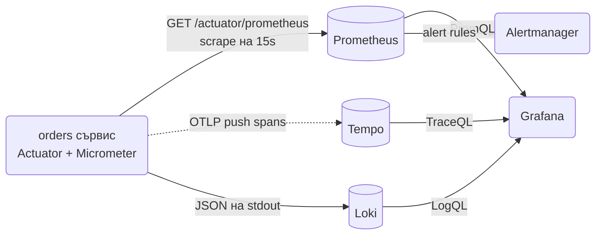
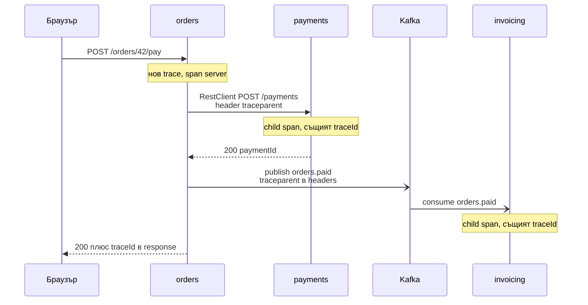

# Observability

Observability е способността да разбереш какво прави сървисът ти в production, без да добавяш код и да правиш нов deploy: кои endpoint-и са бавни, колко заявки падат, защо една конкретна поръчка е висяла 4 секунди и през кои сървиси е минала. В Spring Boot това се гради от три стълба, които Actuator и Micrometer свързват почти без код: метрики (числа във времето, за dashboard-и и alert-и), traces (пътят на една заявка през сървисите) и логове (събитията с контекст). Този документ показва как да включиш Actuator безопасно, как да изложиш health probes за Kubernetes, как да добавиш бизнес метрики и custom spans, как да вдигнеш локален stack с Prometheus, Grafana, Tempo и Loki, и на какво да алармираш.

| Какво | Кога | Инструмент |
|---|---|---|
| Health, info, loggers endpoint-и | Всеки сървис | `spring-boot-starter-actuator` |
| Liveness и readiness за Kubernetes | Всеки deploy в k8s | `/actuator/health/liveness`, `/readiness` |
| Метрики за Prometheus | Всеки сървис | `micrometer-registry-prometheus` |
| Бизнес метрики | Поръчки, плащания, откази | `MeterRegistry`, `Counter`, `Timer` |
| Distributed tracing | Повече от един сървис, Kafka | `micrometer-tracing-bridge-otel` + OTLP |
| Custom spans | Бавна бизнес операция, която искаш да видиш в trace-а | `Observation` API, `@Observed` |
| Dashboard и alert-и | Production | Grafana, PromQL |

## 1. Зависимости и настройка

```xml
<dependency>
    <groupId>org.springframework.boot</groupId>
    <artifactId>spring-boot-starter-actuator</artifactId>
</dependency>

<!-- Метрики за Prometheus -->
<dependency>
    <groupId>io.micrometer</groupId>
    <artifactId>micrometer-registry-prometheus</artifactId>
</dependency>

<!-- Tracing: Micrometer Tracing през OpenTelemetry, експорт по OTLP -->
<dependency>
    <groupId>io.micrometer</groupId>
    <artifactId>micrometer-tracing-bridge-otel</artifactId>
</dependency>
<dependency>
    <groupId>io.opentelemetry</groupId>
    <artifactId>opentelemetry-exporter-otlp</artifactId>
</dependency>

<!-- Spans за JDBC заявки -->
<dependency>
    <groupId>net.ttddyy.observation</groupId>
    <artifactId>datasource-micrometer-spring-boot</artifactId>
    <version>1.1.1</version> <!-- виж последната версия в Maven Central -->
</dependency>

<!-- Нужен за @Timed, @Counted и @Observed -->
<dependency>
    <groupId>org.springframework.boot</groupId>
    <artifactId>spring-boot-starter-aop</artifactId>
</dependency>
```

Всички Micrometer и OpenTelemetry версии се управляват от `spring-boot-starter-parent`, не им пиши `<version>`. Минимална конфигурация:

```yaml
spring:
  application:
    name: orders

management:
  endpoints:
    web:
      exposure:
        include: health,info,metrics,prometheus,loggers
  endpoint:
    health:
      probes:
        enabled: true
      show-details: when-authorized
  metrics:
    tags:
      application: ${spring.application.name}
  tracing:
    sampling:
      probability: 1.0        # 1.0 в dev, 0.1 или по-малко в prod
  otlp:
    tracing:
      endpoint: http://localhost:4318/v1/traces
```

## 2. Как Boot свързва трите стълба



Общата нишка е `ObservationRegistry` от Micrometer. Всеки инструментиран компонент (MVC, `RestClient`, Kafka, JDBC) създава `Observation` около операцията. Един `ObservationHandler` го превръща в `Timer` метрика, друг в span за tracing, а trace id-то отива в MDC и оттам в лога. Затова една анотация `@Observed` ти дава и метрика, и span, и корелация в логовете. Логовете са описани в [Logging](Logging.md), тук са метриките и traces.

## 3. Минимален работещ пример: Actuator

Със зависимостта и yaml-а от раздел 1 вече имаш:

```http
GET /actuator/health
200 OK
{"status":"UP","groups":["liveness","readiness"]}

GET /actuator/health/readiness
200 OK
{"status":"UP"}

GET /actuator/prometheus
200 OK
# HELP http_server_requests_seconds
# TYPE http_server_requests_seconds summary
http_server_requests_seconds_count{application="orders",method="GET",status="200",uri="/orders/{id}",...} 1532
```

### Ключови endpoint-и

| Endpoint | Какво дава | В production |
|---|---|---|
| `health` | UP или DOWN, с компоненти при `show-details` | публичен без детайли, probes за k8s |
| `info` | git commit, build version, custom info | вътрешна мрежа |
| `metrics` | списък и стойност на отделна метрика | вътрешна мрежа |
| `prometheus` | всички метрики в Prometheus формат | само за scraper-а |
| `loggers` | четене и смяна на ниво по време на работа | админска роля |
| `env` | всички properties и environment променливи | изключен или админ, крие secrets частично |
| `beans`, `conditions` | кои bean-ове и защо (autoconfig report) | само в dev |
| `mappings` | всички HTTP mapping-и | dev |
| `threaddump`, `heapdump` | диагностика на забивания и memory leaks | админ, heapdump съдържа данни |
| `caches` | списък и изчистване на кешове | админ |
| `scheduledtasks` | регистрирани `@Scheduled` задачи | dev, админ |
| `sbom` | Software Bill of Materials, от Boot 3.3 с CycloneDX plugin | security екип |

Излагай само това, което ти трябва. `include: "*"` в production е грешка: `env` и `heapdump` изнасят данни.

### Отделен management порт

```yaml
management:
  server:
    port: 9090
server:
  port: 8080
```

Actuator вече е на друг порт, който не се експонира през ingress-а. Prometheus и Kubernetes го достигат вътре в cluster-а, външният свят не. Това е най-простата защита и обикновено е достатъчна, но Security филтрите пак важат, ако имаш Spring Security.

### Security за Actuator

```java
import org.springframework.boot.actuate.autoconfigure.security.servlet.EndpointRequest;

@Bean
@Order(1)
SecurityFilterChain actuatorChain(HttpSecurity http) throws Exception {
    http
        .securityMatcher(EndpointRequest.toAnyEndpoint())
        .authorizeHttpRequests(a -> a
            .requestMatchers(EndpointRequest.to(HealthEndpoint.class, InfoEndpoint.class)).permitAll()
            .requestMatchers(EndpointRequest.to(PrometheusScrapeEndpoint.class)).hasRole("METRICS")
            .anyRequest().hasRole("ADMIN"))
        .httpBasic(Customizer.withDefaults())
        .csrf(c -> c.disable());
    return http.build();
}
```

`EndpointRequest` matcher-ите следват `management.endpoints.web.base-path` и порта автоматично. Prometheus се конфигурира с basic auth за `METRICS` ролята. Как се подреждат няколко `SecurityFilterChain`-а: [Authentication](Authentication.md).

## 4. Health и probes

### Liveness срещу readiness

Kubernetes задава два въпроса. Liveness: "процесът жив ли е, или да го рестартирам?". Readiness: "да му пращам ли трафик?". Boot ги отделя като health groups:

| Probe | Какво включва | Кога е DOWN | Какво прави k8s |
|---|---|---|---|
| `/actuator/health/liveness` | само `livenessState` | application context е счупен | рестартира pod-а |
| `/actuator/health/readiness` | `readinessState` + каквото добавиш | стартира, спира, DB недостъпна | спира трафика към pod-а |

```yaml
management:
  endpoint:
    health:
      probes:
        enabled: true
      group:
        readiness:
          include: readinessState,db,redis
        liveness:
          include: livenessState
```

В readiness слагаш само зависимости, без които сървисът не може да отговори на нито една заявка: базата, Redis за сесии. Външни API и Kafka не: ако платежният gateway падне, по-добре 20 pod-а да връщат 503 за плащания и да работят за всичко друго, отколкото всички да излязат от ротация. Liveness никога не включва външни зависимости, иначе паднала база води до безкрайни рестарти.

Вградени индикатори, които се включват автоматично при наличие на зависимостта: `db` (JDBC), `redis`, `kafka`, `mail`, `diskSpace`, `ping`, `rabbit`, `mongo`. Изключваш с `management.health.kafka.enabled=false`.

### Custom HealthIndicator с кеш

Health се вика на всеки 10 секунди от Kubernetes и на всеки scrape от Prometheus. Индикатор, който прави HTTP call към външен сървис при всяко викане, превръща health-а в DDoS срещу партньора. Кеширай резултата:

```java
package com.example.orders.health;

import org.springframework.boot.actuate.health.Health;
import org.springframework.boot.actuate.health.HealthIndicator;
import org.springframework.scheduling.annotation.Scheduled;
import org.springframework.stereotype.Component;

import java.time.Instant;
import java.util.concurrent.atomic.AtomicReference;

@Component("paymentGateway")
public class PaymentGatewayHealthIndicator implements HealthIndicator {

    private final PaymentGatewayClient client;
    private final AtomicReference<Health> last = new AtomicReference<>(Health.unknown().build());

    public PaymentGatewayHealthIndicator(PaymentGatewayClient client) {
        this.client = client;
    }

    @Scheduled(fixedDelay = 30_000)
    void refresh() {
        try {
            client.ping();
            last.set(Health.up().withDetail("checkedAt", Instant.now()).build());
        } catch (Exception e) {
            last.set(Health.down().withDetail("error", e.getClass().getSimpleName()).build());
        }
    }

    @Override
    public Health health() {
        return last.get();
    }
}
```

Името на bean-а (`paymentGateway`) е името на компонента в `/actuator/health`. Този индикатор остава извън readiness групата, вижда се в общия `health` и може да се ползва за alert. `show-details: when-authorized` показва компонентите само на authenticated потребител; за k8s probe-ите статусът без детайли е достатъчен.

### Kubernetes

```yaml
livenessProbe:
  httpGet:
    path: /actuator/health/liveness
    port: 9090
  initialDelaySeconds: 20
  periodSeconds: 10
readinessProbe:
  httpGet:
    path: /actuator/health/readiness
    port: 9090
  periodSeconds: 5
  failureThreshold: 3
```

При `SIGTERM` Boot първо обявява readiness `DOWN`, после чака `server.shutdown=graceful` да довърши активните заявки. Пълната конфигурация на deploy-а: [Docker и деплой](Docker_Deploy.md).

## 5. Info endpoint

`/actuator/info` отговаря на въпроса "коя версия върти този pod". Build info идва от Maven plugin-а, git info от `git-commit-id-maven-plugin`:

```xml
<plugin>
    <groupId>org.springframework.boot</groupId>
    <artifactId>spring-boot-maven-plugin</artifactId>
    <executions>
        <execution>
            <goals>
                <goal>build-info</goal>
            </goals>
        </execution>
    </executions>
</plugin>
<plugin>
    <groupId>io.github.git-commit-id</groupId>
    <artifactId>git-commit-id-maven-plugin</artifactId>
    <!-- виж последната версия в Maven Central -->
</plugin>
```

```yaml
management:
  info:
    git:
      mode: full
    env:
      enabled: true
info:
  team: orders
  docs: https://wiki.example.com/orders
```

Резултатът включва `build.version`, `build.time`, `git.commit.id`, `git.branch` и твоите `info.*` ключове. Същата версия сложи и като метрика tag или в `logging.structured.ecs.service.version`, за да можеш в Grafana да видиш "p99 скочи след deploy на 1.42.0".

## 6. Метрики с Micrometer

### Какво получаваш безплатно

| Метрика | Откъде | За какво |
|---|---|---|
| `http.server.requests` | Spring MVC | rate, errors, duration по `uri`, `method`, `status`, `outcome` |
| `http.client.requests` | `RestClient` от Boot builder | същото за изходящи calls, виж [HTTP клиенти](HTTP_Clients.md) |
| `jvm.memory.used`, `jvm.gc.pause`, `jvm.threads.live` | JVM | памет, GC паузи, threads |
| `hikaricp.connections.active`, `.pending`, `.timeout` | HikariCP | изчерпване на pool-а |
| `kafka.consumer.*`, `spring.kafka.listener` | Kafka client, Spring Kafka | lag, грешки в listener-и |
| `cache.gets`, `cache.puts` | Spring Cache | hit ratio |
| `executor.active`, `executor.queued` | `ThreadPoolTaskExecutor` | претоварени `@Async` pool-ове |
| `process.cpu.usage`, `system.cpu.usage` | OS | CPU |
| `tomcat.threads.busy` | Tomcat (с `server.tomcat.mbeanregistry.enabled=true`) | изчерпани threads |

Tag-овете са измеренията, по които групираш в PromQL. `uri` е шаблонът (`/orders/{id}`), не реалният път, точно за да остане броят на time series малък.

### Cardinality

Всяка уникална комбинация от tag стойности е отделна time series в Prometheus. `uri` с 50 шаблона по 5 статуса по 4 метода са 1000 series, което е нормално. `userId` като tag при 100 000 потребители са 100 000 series на метрика, което убива Prometheus. Правило: tag-ове само за стойности с краен, малък брой (статус, тип, валута, тенант, ако са десетки). Id-та на потребители, поръчки и заявки отиват в trace-а и лога, никога в метрика.

### Бизнес метрики

```java
package com.example.orders.service;

import io.micrometer.core.instrument.Counter;
import io.micrometer.core.instrument.MeterRegistry;
import io.micrometer.core.instrument.Timer;

@Service
public class OrderService {

    private final OrderRepository orders;
    private final PaymentGatewayClient payments;
    private final MeterRegistry registry;
    private final Counter ordersPlaced;
    private final Timer paymentTimer;

    public OrderService(OrderRepository orders, PaymentGatewayClient payments, MeterRegistry registry) {
        this.orders = orders;
        this.payments = payments;
        this.registry = registry;
        this.ordersPlaced = Counter.builder("orders.placed")
                .description("Orders successfully placed")
                .register(registry);
        this.paymentTimer = Timer.builder("orders.payment.duration")
                .description("Time spent in payment gateway")
                .publishPercentileHistogram()
                .register(registry);
    }

    public Order place(PlaceOrderCommand command) {
        var order = orders.save(Order.from(command));
        ordersPlaced.increment();
        return order;
    }

    public Order pay(long orderId) {
        var order = orders.findById(orderId).orElseThrow();
        try {
            var payment = paymentTimer.recordCallable(() -> payments.charge(order));
            order.markPaid(payment.id());
            return order;
        } catch (PaymentDeclinedException e) {
            // tag-ът reason има краен брой стойности, безопасен е
            registry.counter("orders.payment.failures", "reason", "declined").increment();
            throw e;
        } catch (Exception e) {
            registry.counter("orders.payment.failures", "reason", "gateway_error").increment();
            throw e;
        }
    }
}
```

`Gauge` е за моментна стойност, която се чете при scrape, не се инкрементира. Класическият пример е размер на опашка:

```java
Gauge.builder("orders.pending", orders, repo -> repo.countByStatus(OrderStatus.PENDING))
        .description("Orders waiting for payment")
        .register(registry);
```

Lambda-та се изпълнява при всеки scrape, затова трябва да е евтина; `count` по индексирана колона е ок, пълно сканиране не е. `DistributionSummary` е като `Timer`, но за не-времеви величини (размер на поръчка в EUR, брой артикули).

### @Timed и @Counted

```java
@Bean
TimedAspect timedAspect(MeterRegistry registry) {
    return new TimedAspect(registry);
}

@Bean
CountedAspect countedAspect(MeterRegistry registry) {
    return new CountedAspect(registry);
}
```

```java
@Timed(value = "invoices.generate", percentiles = {0.5, 0.95, 0.99})
public Invoice generate(Order order) { ... }

@Counted(value = "invoices.emailed")
public void email(Invoice invoice) { ... }
```

Без `TimedAspect` bean анотацията е без ефект върху обикновени методи (Spring MVC controller-и са изключение, там `@Timed` работи през `http.server.requests`). Нужен е `spring-boot-starter-aop` и важат ограниченията на proxy-тата: не работи при self-invocation, виж [Middleware](Middleware.md).

### Percentiles и histograms

```yaml
management:
  metrics:
    distribution:
      percentiles-histogram:
        http.server.requests: true
        http.client.requests: true
      slo:
        http.server.requests: 50ms,100ms,250ms,500ms,1s
```

`percentiles-histogram` публикува bucket-и, от които Prometheus смята `histogram_quantile` през всички pod-ове. Percentiles, сметнати в приложението (`percentiles: 0.99`), не могат да се агрегират между instance-и, затова в Prometheus setup ползвай histogram. `slo` добавя точни bucket-и на границите, по които ще мериш SLO.

## 7. Prometheus, Grafana и alert-и

### Scrape

```yaml
# prometheus.yml
scrape_configs:
  - job_name: orders
    metrics_path: /actuator/prometheus
    scrape_interval: 15s
    basic_auth:
      username: prometheus
      password: ${PROMETHEUS_PASSWORD}
    static_configs:
      - targets: ["orders:9090"]
```

В Kubernetes вместо `static_configs` се ползва service discovery по annotation на pod-а (`prometheus.io/scrape: "true"`, `prometheus.io/port: "9090"`, `prometheus.io/path: "/actuator/prometheus"`) или `ServiceMonitor` при Prometheus Operator.

### Dashboard по RED

Един dashboard на сървис, с три реда за всеки endpoint група: Rate, Errors, Duration.

```promql
# Rate: заявки в секунда по uri
sum by (uri) (rate(http_server_requests_seconds_count{application="orders"}[5m]))

# Errors: дял на 5xx
sum(rate(http_server_requests_seconds_count{application="orders",status=~"5.."}[5m]))
  / sum(rate(http_server_requests_seconds_count{application="orders"}[5m]))

# Duration: p99 по uri
histogram_quantile(0.99,
  sum by (le, uri) (rate(http_server_requests_seconds_bucket{application="orders"}[5m])))
```

Втори ред с JVM и pool: `jvm_memory_used_bytes{area="heap"}`, `rate(jvm_gc_pause_seconds_sum[5m])`, `hikaricp_connections_active`, `hikaricp_connections_pending`. Трети ред с бизнес: `rate(orders_placed_total[5m])`, `rate(orders_payment_failures_total[5m]) by (reason)`. Grafana има готов dashboard за Boot (id 19004 в grafana.com/dashboards е добра основа), но бизнес панелите пишеш сам.

### Alert-и

```yaml
groups:
  - name: orders
    rules:
      - alert: OrdersHighErrorRate
        expr: |
          sum(rate(http_server_requests_seconds_count{application="orders",status=~"5.."}[5m]))
            / sum(rate(http_server_requests_seconds_count{application="orders"}[5m])) > 0.02
        for: 5m
        labels: { severity: page }
        annotations: { summary: "orders: над 2% 5xx за 5 минути" }

      - alert: OrdersSlowP99
        expr: |
          histogram_quantile(0.99,
            sum by (le) (rate(http_server_requests_seconds_bucket{application="orders",uri!~"/actuator.*"}[5m]))) > 1
        for: 10m
        labels: { severity: ticket }

      - alert: OrdersDbPoolExhausted
        expr: hikaricp_connections_pending{application="orders"} > 0
        for: 2m
        labels: { severity: page }

      - alert: OrdersPaymentFailures
        expr: sum(rate(orders_payment_failures_total{application="orders",reason="gateway_error"}[10m])) > 0.1
        for: 5m
        labels: { severity: page }
```

Какво си струва alert: симптоми, които потребителят усеща (error rate, latency, недостъпност), и ресурси, които водят до тях след минути (pool, heap, disk). Не си струва alert на всяка метрика, която "изглежда странно". Всеки alert трябва да има действие: ако никой не знае какво да направи при него, той е dashboard панел, не alert.

### SLO

Дефинирай един или два SLO на сървис, например "99.5% от заявките към `/orders/**` за 30 дни са успешни и под 500ms". Alert-ът после е на error budget burn rate (колко бързо изразходваш 0.5%), което е по-стабилно от праг на моментна стойност. `slo` bucket-ите от раздел 6 дават точната метрика: `http_server_requests_seconds_bucket{le="0.5"}` срещу `_count`.

## 8. Tracing

### Какво се случва



Всеки сървис добавя spans към същия trace. В Tempo или Jaeger виждаш водопад: 4 секунди общо, от които 3.8 в `POST /payments`, което веднага казва къде е проблемът. Без tracing същото е час ровене в логовете на три сървиса.

### Конфигурация

```yaml
management:
  tracing:
    enabled: true
    sampling:
      probability: 0.1
    propagation:
      type: w3c            # traceparent header, default; b3 за стари Zipkin системи
  otlp:
    tracing:
      endpoint: http://tempo:4318/v1/traces
      compression: gzip
```

Със зависимостите от раздел 1 автоматично получаваш spans за: входящи MVC заявки, `RestClient` и `WebClient` calls от Boot builder-ите, Kafka (`spring.kafka.template.observation-enabled=true` и `spring.kafka.listener.observation-enabled=true`), JDBC заявки през `datasource-micrometer-spring-boot`, `@Scheduled` задачи и `@Async` методи. Zipkin вместо OTLP: `micrometer-tracing-bridge-brave` плюс `io.zipkin.reporter2:zipkin-reporter-brave` и `management.zipkin.tracing.endpoint`.

Sampling: при 1.0 всеки trace се пази, което в production с хиляди заявки в секунда е скъпо за storage. 0.1 означава 10%, но решението се взима в първия сървис и се пренася в `traceparent`, така че trace-ът е или цял, или никакъв. Грешките не се sample-ват приоритетно по подразбиране; ако това ти трябва, виж tail-based sampling в OpenTelemetry Collector.

### Custom spans с Observation API

Span за бизнес операция, която не е HTTP или DB, например пресмятане на цени:

```java
package com.example.orders.pricing;

import io.micrometer.observation.Observation;
import io.micrometer.observation.ObservationRegistry;

@Service
public class PricingService {

    private final ObservationRegistry observations;
    private final DiscountRules rules;

    public PricingService(ObservationRegistry observations, DiscountRules rules) {
        this.observations = observations;
        this.rules = rules;
    }

    public Money price(Order order) {
        return Observation.createNotStarted("orders.pricing", observations)
                .lowCardinalityKeyValue("currency", order.currency())
                .highCardinalityKeyValue("orderId", String.valueOf(order.id()))
                .observe(() -> rules.apply(order));
    }
}
```

`lowCardinalityKeyValue` става tag и на метриката `orders.pricing` (Timer), и на span-а. `highCardinalityKeyValue` отива само в span-а, точно заради cardinality правилото от раздел 6. Същото с анотация:

```java
@Bean
ObservedAspect observedAspect(ObservationRegistry registry) {
    return new ObservedAspect(registry);
}

@Observed(name = "orders.pricing", lowCardinalityKeyValues = {"type", "standard"})
public Money price(Order order) { ... }
```

### Baggage: tenant id през целия trace

Baggage е стойност, която пътува с trace-а през всички сървиси, за разлика от span tag, който е локален:

```yaml
management:
  tracing:
    baggage:
      remote-fields: tenantId
      correlation:
        fields: tenantId
```

`remote-fields` я праща в header (`baggage: tenantId=acme`) и я чете от входящи заявки; `correlation.fields` я слага в MDC, така че всеки лог ред във всеки сървис има `tenantId`. Задаваш я веднъж в първия сървис с `Tracer.createBaggageInScope("tenantId", value)` в filter.

### traceId в логове и отговори

С tracing в classpath Boot добавя `traceId` и `spanId` в MDC и в default console pattern-а ([Logging](Logging.md)). В `@RestControllerAdvice` го слагаш в `ProblemDetail`, така че screenshot от потребителя води до точния trace ([Грешки и ProblemDetail](Exception_Handling.md)). В Grafana data source-ът на Loki има "derived field" от `traceId` към Tempo, което прави клик от лог ред към trace-а.

## 9. Локален stack с docker compose

```yaml
# observability/compose.yml
services:
  prometheus:
    image: prom/prometheus:v2.54.1
    volumes: ["./prometheus.yml:/etc/prometheus/prometheus.yml"]
    ports: ["9091:9090"]

  tempo:
    image: grafana/tempo:2.6.1
    command: ["-config.file=/etc/tempo.yml"]
    volumes: ["./tempo.yml:/etc/tempo.yml"]
    ports: ["4318:4318"]       # OTLP HTTP

  loki:
    image: grafana/loki:3.2.1
    ports: ["3100:3100"]

  promtail:
    image: grafana/promtail:3.2.1
    volumes:
      - /var/run/docker.sock:/var/run/docker.sock
      - ./promtail.yml:/etc/promtail/config.yml
    command: ["-config.file=/etc/promtail/config.yml"]

  grafana:
    image: grafana/grafana:11.3.0
    ports: ["3000:3000"]
    environment:
      GF_AUTH_ANONYMOUS_ENABLED: "true"
      GF_AUTH_ANONYMOUS_ORG_ROLE: Admin
    volumes: ["./grafana-datasources.yml:/etc/grafana/provisioning/datasources/ds.yml"]
```

```yaml
# grafana-datasources.yml
apiVersion: 1
datasources:
  - name: Prometheus
    type: prometheus
    url: http://prometheus:9090
  - name: Tempo
    type: tempo
    url: http://tempo:3200
  - name: Loki
    type: loki
    url: http://loki:3100
    jsonData:
      derivedFields:
        - name: TraceID
          matcherRegex: '"trace\.id":"(\w+)"'
          url: "$${__value.raw}"
          datasourceUid: tempo
```

Приложението на хоста сочи `management.otlp.tracing.endpoint=http://localhost:4318/v1/traces`, а Prometheus scrape-ва `host.docker.internal:9090`. `tempo.yml` е минималният от документацията на Tempo с `otlp` receiver на `0.0.0.0:4318`. Jaeger all-in-one (`jaegertracing/all-in-one`) с OTLP на същия порт е алтернатива с по-прост UI, когато не ти трябва Grafana. Docker детайлите: [Docker и деплой](Docker_Deploy.md).

## 10. Overhead и тестване

### Цена

- Метриките са почти безплатни: атомарни броячи в памет, scrape на 15 секунди. Единственият риск е cardinality.
- Tracing при 100% sampling добавя няколко микросекунди на span и мрежов трафик към collector-а. При 1000 заявки в секунда с по 10 span-а това са 10 000 span-а в секунда към Tempo. Затова 0.05 до 0.2 в prod, 1.0 в dev и staging.
- `@Observed` и `@Timed` минават през AOP proxy, което за методи, викани милиони пъти, е измеримо. Не ги слагай на getter-и и в tight loop-ове.
- JDBC spans удвояват броя span-ове в DB-heavy сървис. Включвай ги, но следи обема.

### Метрики в тестове

```java
import io.micrometer.core.instrument.simple.SimpleMeterRegistry;

class OrderServiceMetricsTest {

    SimpleMeterRegistry registry = new SimpleMeterRegistry();
    OrderRepository orders = mock(OrderRepository.class);
    PaymentGatewayClient payments = mock(PaymentGatewayClient.class);
    OrderService service = new OrderService(orders, payments, registry);

    @Test
    void countsPlacedOrders() {
        given(orders.save(any())).willAnswer(inv -> inv.getArgument(0));

        service.place(new PlaceOrderCommand(7L, List.of()));
        service.place(new PlaceOrderCommand(8L, List.of()));

        assertThat(registry.counter("orders.placed").count()).isEqualTo(2.0);
    }

    @Test
    void tagsDeclinedPayments() {
        given(orders.findById(42L)).willReturn(Optional.of(Order.pending(42L)));
        given(payments.charge(any())).willThrow(new PaymentDeclinedException(42L));

        assertThatThrownBy(() -> service.pay(42L)).isInstanceOf(PaymentDeclinedException.class);

        assertThat(registry.get("orders.payment.failures").tag("reason", "declined").counter().count())
                .isEqualTo(1.0);
    }
}
```

В `@SpringBootTest` автоконфигурираният registry е `SimpleMeterRegistry` (Boot подменя Prometheus registry в тестове, освен ако не поискаш `@AutoConfigureObservability`), така че `@Autowired MeterRegistry` работи по същия начин. За проверка, че endpoint-ът отговаря: `@SpringBootTest(webEnvironment = RANDOM_PORT)` плюс `GET /actuator/health/readiness` с `TestRestTemplate`. Организацията на тестовете: [Testing](Testing.md).

## 11. Капани

- `management.endpoints.web.exposure.include: "*"` на публичен порт. `env` показва properties, `heapdump` съдържа паролите от паметта. Излагай списък и слагай Actuator на отделен порт.
- Външни зависимости в readiness. Паднал платежен gateway вади всички pod-ове от ротация и сървисът ти е 100% недостъпен вместо частично деградирал.
- База в liveness. Kubernetes рестартира pod-овете в цикъл, докато базата е недостъпна, и ги намираш със стотици рестарти сутринта.
- Health indicator без кеш. Всяко викане на `/actuator/health` прави реален call към партньора; при 20 pod-а и 10-секунден probe това са 2 заявки в секунда само за health.
- `userId`, `orderId` или пълен URL като метричен tag. Cardinality explosion, Prometheus изяжда паметта и спира да отговаря.
- `@Timed` без `TimedAspect` bean. Анотацията е там, метрика няма, и никой не забелязва до инцидента.
- `RestClient.create()` вместо `RestClient.Builder` от Boot: няма `http.client.requests`, няма `traceparent`, trace-ът свършва на границата на сървиса.
- Percentiles вместо histogram при няколко instance-а. `p99` от pod A и `p99` от pod B не могат да се осреднят; с histogram bucket-и Prometheus смята коректен общ p99.
- 100% sampling в production. Storage сметката на Tempo расте с трафика, а полезната информация не.
- `spring.application.name` липсва. Всички сървиси в Grafana са `application` без име и trace-овете не казват кой сървис е кой.
- Alert без действие. Ако при alert никой не знае какво да направи, той се заглушава след седмица и когато стане важен, никой не го гледа.

## 12. Чеклист

- [ ] `spring-boot-starter-actuator`, `micrometer-registry-prometheus`, `micrometer-tracing-bridge-otel`, `opentelemetry-exporter-otlp` в pom-а.
- [ ] `spring.application.name` зададено и в `management.metrics.tags.application`.
- [ ] Actuator на отделен `management.server.port`, изложени само `health,info,metrics,prometheus,loggers`.
- [ ] `SecurityFilterChain` за Actuator: health и info публични, останалото с роля.
- [ ] `probes.enabled: true`, readiness с `db` (и Redis, ако е критичен), liveness само `livenessState`.
- [ ] Custom `HealthIndicator` за външни зависимости с кеш и извън readiness.
- [ ] `build-info` и git plugin за `/actuator/info`.
- [ ] `percentiles-histogram` за `http.server.requests` и `http.client.requests`; `slo` bucket-и на SLO границите.
- [ ] Бизнес метрики: поне брой успешни операции и брой откази по `reason`.
- [ ] `TimedAspect` и `ObservedAspect` bean-ове, ако ползваш анотациите.
- [ ] Sampling 1.0 в dev, 0.05 до 0.2 в prod; OTLP endpoint по profile.
- [ ] Grafana dashboard по RED плюс JVM и pool; alert-и за error rate, p99, pool exhaustion, бизнес откази.

## 13. Свързани документи

- [Logging](Logging.md): JSON логове с `traceId`, MDC и корелация между лог и trace.
- [HTTP клиенти](HTTP_Clients.md): `http.client.requests` и trace propagation през `RestClient`, Resilience4j метрики.
- [Docker и деплой](Docker_Deploy.md): Kubernetes probes, graceful shutdown, Prometheus annotations.
- [Authentication](Authentication.md): отделен `SecurityFilterChain` за Actuator endpoint-ите.
- [Грешки и ProblemDetail](Exception_Handling.md): `traceId` в отговорите за грешки.
- [Message brokers](Message_Brokers.md): observation за Kafka producer и consumer, consumer lag метрики.
- [Testing](Testing.md): `SimpleMeterRegistry` и тестове на Actuator endpoint-и.
- [Spring Boot reference: Actuator](https://docs.spring.io/spring-boot/reference/actuator/index.html)
- [Micrometer Observation docs](https://docs.micrometer.io/micrometer/reference/observation.html)
