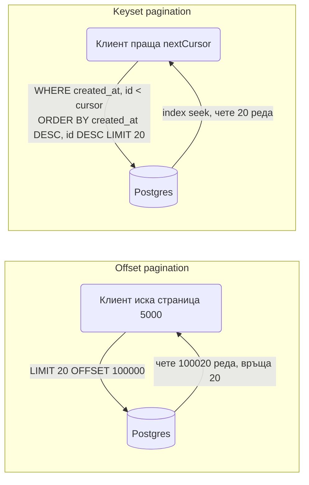

# Pagination

Pagination е начинът всеки списък в API-то (поръчки, продукти, потребители) да се връща на части, с предвидим размер и ред, без да вдигаш цялата таблица в паметта. В Spring Boot това минава през `Pageable` и `Page` на Spring Data, които работят "от кутията" за прости случаи, но крият няколко сериозни проблема: нестабилен JSON формат на `Page`, скъпа `count` заявка на всяка страница, SQL injection през sort параметъра и offset, който става все по-бавен колкото по-назад листиш. Този документ показва как се приема `Pageable` в controller, как се whitelist-ват полетата за сортиране, какъв стабилен response формат да дефинираш, как се комбинира с филтри и `JOIN FETCH`, и кога да минеш на keyset (cursor) pagination с ръчна заявка или с Scroll API на Spring Data 3.1+. Базата е PostgreSQL, домейнът е поръчки и продукти.

| Какво | Кога | Инструмент |
|---|---|---|
| Offset pagination с общ брой | admin таблици, малки и средни списъци, UI с номера на страници | `Pageable` + `Page<T>` |
| Offset без общ брой | списъци, където "има ли още" е достатъчно | `Slice<T>` |
| Keyset (cursor) pagination | infinite scroll, feed-ове, таблици с милиони редове | `@Query` с `WHERE (created_at, id) < (?, ?)` или `ScrollPosition.keyset()` |
| Филтри + pagination | търсене с много незадължителни критерии | `Specification` + `Pageable` |
| Pagination с колекции | списък с `JOIN FETCH` на редове на поръчката | двустъпкова заявка по id |
| Native и отчетни заявки | сложен SQL, агрегации | `JdbcClient` с `LIMIT` и `OFFSET` или keyset |

## 1. Зависимости и настройка

Pagination идва със Spring Data JPA, нищо допълнително не е нужно. Настройките долу определят параметрите по подразбиране и ограничават максималния размер на страницата, което е единствената защита срещу `?size=1000000`.

```xml
<dependency>
    <groupId>org.springframework.boot</groupId>
    <artifactId>spring-boot-starter-data-jpa</artifactId>
</dependency>
<dependency>
    <groupId>org.springframework.boot</groupId>
    <artifactId>spring-boot-starter-web</artifactId>
</dependency>
```

```yaml
spring:
  data:
    web:
      pageable:
        default-page-size: 20
        max-page-size: 100
        one-indexed-parameters: false
        page-parameter: page
        size-parameter: size
        serialization-mode: via_dto
      sort:
        sort-parameter: sort
```

`one-indexed-parameters: true` прави `page=1` първа страница в HTTP, но вътрешно `Pageable.getPageNumber()` остава 0-базиран. Това обърква хората, които дебъгват, затова препоръката е да останеш на 0-базирани параметри и да го документираш в API-то. `serialization-mode: via_dto` е обяснен в секция 4.

## 2. Минимален работещ пример

Repository методът приема `Pageable` и връща `Page<Order>`. Spring Data генерира две заявки: `SELECT ... LIMIT 20 OFFSET 40` и `SELECT count(*) ...`.

```java
public interface OrderRepository extends JpaRepository<Order, UUID> {

    Page<Order> findByCustomerId(UUID customerId, Pageable pageable);
}
```

Controller-ът получава `Pageable` автоматично от query параметрите, защото Spring Boot регистрира `PageableHandlerMethodArgumentResolver`. `@PageableDefault` задава стойностите, когато клиентът не подаде нищо.

```java
package com.example.shop.order.web;

import org.springframework.data.domain.Page;
import org.springframework.data.domain.Pageable;
import org.springframework.data.domain.Sort;
import org.springframework.data.web.PageableDefault;
import org.springframework.web.bind.annotation.*;

@RestController
@RequestMapping("/api/orders")
public class OrderController {

    private final OrderQueryService orderQueryService;

    public OrderController(OrderQueryService orderQueryService) {
        this.orderQueryService = orderQueryService;
    }

    @GetMapping
    public PageResponse<OrderSummary> list(
            @RequestParam(required = false) UUID customerId,
            @PageableDefault(size = 20, sort = "createdAt", direction = Sort.Direction.DESC) Pageable pageable) {
        return orderQueryService.list(customerId, pageable);
    }
}
```

```java
package com.example.shop.order;

import org.springframework.data.domain.Page;
import org.springframework.data.domain.Pageable;
import org.springframework.stereotype.Service;
import org.springframework.transaction.annotation.Transactional;

@Service
@Transactional(readOnly = true)
public class OrderQueryService {

    private final OrderRepository orders;
    private final OrderMapper mapper;

    public OrderQueryService(OrderRepository orders, OrderMapper mapper) {
        this.orders = orders;
        this.mapper = mapper;
    }

    public PageResponse<OrderSummary> list(UUID customerId, Pageable pageable) {
        Page<Order> page = customerId == null
                ? orders.findAll(pageable)
                : orders.findByCustomerId(customerId, pageable);
        return PageResponse.from(page.map(mapper::toSummary));
    }
}
```

```http
GET /api/orders?page=1&size=20&sort=createdAt,desc HTTP/1.1
Accept: application/json
```

```json
{
  "content": [
    { "id": "7a2f...", "status": "PAID", "total": 149.90, "createdAt": "2026-10-01T09:12:00Z" }
  ],
  "page": 1,
  "size": 20,
  "totalElements": 1342,
  "totalPages": 68
}
```

`PageResponse` е дефиниран в секция 4. `page.map(...)` превръща `Page<Order>` в `Page<OrderSummary>`, като пази метаданните. За mapping-а на entity към DTO виж [DTO и mapping](DTO_Mapping.md).

## 3. Pageable, Page, Slice и List

`PageRequest.of(page, size, sort)` е ръчният начин да създадеш `Pageable`, полезен в сървиси и тестове:

```java
Pageable first = PageRequest.of(0, 50, Sort.by(Sort.Direction.DESC, "createdAt").and(Sort.by("id")));
Pageable next = first.next();
```

| Връщан тип | Заявки | Какво знаеш | Кога |
|---|---|---|---|
| `Page<T>` | select + count | общ брой, брой страници, има ли следваща | UI с номера на страници, admin |
| `Slice<T>` | select с `size + 1` реда | има ли следваща (`hasNext`), без общ брой | "Load more" бутон, mobile |
| `List<T>` с `Pageable` | само select | нищо за "има ли още" | когато клиентът сам решава, или `Limit` |
| `Window<T>` | select по keyset | позиция за следващата порция | Scroll API, секция 7 |

`count(*)` върху таблица с милиони редове и WHERE по не-индексирана колона е най-бавната част от страницата. Spring Data е умен в един случай: ако първата страница съдържа по-малко от `size` елемента, не прави count заявка. Във всеки друг случай тя се изпълнява. Ако потребителят никога не вижда "страница 68 от 68", не плащай за това: върни `Slice`.

```java
Slice<Order> findByStatus(OrderStatus status, Pageable pageable);
```

## 4. Стабилен response формат

### Защо не се връща Page директно

`Page` (всъщност `PageImpl`) се сериализира от Jackson според публичните си getter-и: `content`, `pageable` (с вложен `sort`, `offset`, `paged`, `unpaged`), `totalPages`, `last`, `first`, `numberOfElements`, `empty`... Това е вътрешна структура на Spring Data, не API контракт, и се е променяла между версии. От Spring Boot 3.3 при сериализация на `PageImpl` се логва warning, който ти казва точно това. Опциите:

1. `spring.data.web.pageable.serialization-mode: via_dto` (Boot 3.3+): Spring Data сериализира `Page` през `PagedModel` с плосък формат `{content, page: {size, number, totalElements, totalPages}}`. Бързо решение, но форматът пак не е твой.
2. Собствен `PageResponse<T>` record: ти определяш контракта и той не се променя при upgrade. Това е препоръката.

```java
package com.example.shop.common.web;

import org.springframework.data.domain.Page;
import org.springframework.data.domain.Slice;

import java.util.List;

public record PageResponse<T>(
        List<T> content,
        int page,
        int size,
        long totalElements,
        int totalPages) {

    public static <T> PageResponse<T> from(Page<T> page) {
        return new PageResponse<>(
                page.getContent(),
                page.getNumber(),
                page.getSize(),
                page.getTotalElements(),
                page.getTotalPages());
    }
}

public record SliceResponse<T>(List<T> content, int page, int size, boolean hasNext) {

    public static <T> SliceResponse<T> from(Slice<T> slice) {
        return new SliceResponse<>(slice.getContent(), slice.getNumber(), slice.getSize(), slice.hasNext());
    }
}
```

За OpenAPI документацията generic record-ът се показва като `PageResponseOrderSummary`, което е приемливо; виж [API документация](API_Docs.md).

## 5. Сортиране и защита

### Как Spring Data парсва sort

`?sort=createdAt,desc&sort=id,asc` става `Sort.by(desc("createdAt"), asc("id"))`. Стойността отива директно в JPQL `ORDER BY o.createdAt DESC`. Hibernate валидира, че `createdAt` е property на entity, така че класически SQL injection не минава. Но остават три реални проблема:

- Клиентът може да сортира по всяко property, включително `passwordHash`, `customer.email` или колона без индекс, което води до full table sort на милиони редове.
- Невалидно property хвърля `PropertyReferenceException`, която без handler е 500, а трябва да е 400.
- API имената (`createdAt`, `total`) не винаги съвпадат с entity property (`createdAt`, `totalAmount`), а ти не искаш да излагаш вътрешната структура.

### Whitelist с enum и mapping към entity property

```java
package com.example.shop.order.web;

import org.springframework.data.domain.Sort;

import java.util.Arrays;

public enum OrderSortField {
    CREATED_AT("createdAt", "createdAt"),
    TOTAL("total", "totalAmount"),
    STATUS("status", "status");

    private final String apiName;
    private final String property;

    OrderSortField(String apiName, String property) {
        this.apiName = apiName;
        this.property = property;
    }

    public String property() {
        return property;
    }

    public static OrderSortField fromApiName(String name) {
        return Arrays.stream(values())
                .filter(f -> f.apiName.equals(name))
                .findFirst()
                .orElseThrow(() -> new InvalidSortException(name));
    }
}
```

```java
package com.example.shop.common.web;

import org.springframework.data.domain.PageRequest;
import org.springframework.data.domain.Pageable;
import org.springframework.data.domain.Sort;

import java.util.function.Function;

public final class SafePageable {

    private SafePageable() {}

    /** Превежда всяко API име към entity property и добавя id за стабилен ред. */
    public static Pageable of(Pageable incoming, Function<String, String> propertyMapper) {
        Sort mapped = Sort.by(incoming.getSort().stream()
                .map(o -> new Sort.Order(o.getDirection(), propertyMapper.apply(o.getProperty())))
                .toList());
        Sort stable = mapped.isSorted() ? mapped.and(Sort.by("id")) : Sort.by(Sort.Direction.DESC, "createdAt", "id");
        return PageRequest.of(incoming.getPageNumber(), incoming.getPageSize(), stable);
    }
}
```

В сървиса:

```java
public PageResponse<OrderSummary> list(UUID customerId, Pageable incoming) {
    Pageable pageable = SafePageable.of(incoming, name -> OrderSortField.fromApiName(name).property());
    ...
}
```

`InvalidSortException` се превръща в `ProblemDetail` с 400 в `@RestControllerAdvice`, виж [Грешки и ProblemDetail](Exception_Handling.md). Ако предпочиташ `Set<String>` вместо enum, принципът е същият: `if (!ALLOWED.contains(order.getProperty())) throw ...`.

### Защо винаги добавяме id в сортирането

`ORDER BY created_at DESC` при две поръчки с еднакъв `created_at` няма гарантиран ред в PostgreSQL. Между страница 2 и страница 3 същите два реда може да си сменят местата, и един се показва два пъти, а друг никога. Добавянето на уникална колона като последен ключ (`created_at DESC, id DESC`) прави реда детерминистичен. Това е и условието за keyset pagination по-долу.

## 6. Филтри, Specification и JOIN FETCH

### Specification с Pageable

Когато търсенето има много незадължителни критерии (статус, период, клиент, минимална сума), `Specification` е най-четимият начин да ги композираш, а `JpaSpecificationExecutor.findAll(spec, pageable)` връща `Page` с автоматичен count. Подробности за Specification има в [База данни и ORM](Database_ORM.md).

```java
public interface OrderRepository extends JpaRepository<Order, UUID>, JpaSpecificationExecutor<Order> {}
```

```java
package com.example.shop.order;

import org.springframework.data.jpa.domain.Specification;

import java.math.BigDecimal;
import java.time.Instant;
import java.util.UUID;

public final class OrderSpecs {

    private OrderSpecs() {}

    public static Specification<Order> hasStatus(OrderStatus status) {
        return (root, query, cb) -> status == null ? null : cb.equal(root.get("status"), status);
    }

    public static Specification<Order> customer(UUID customerId) {
        return (root, query, cb) -> customerId == null ? null : cb.equal(root.get("customer").get("id"), customerId);
    }

    public static Specification<Order> createdBetween(Instant from, Instant to) {
        return (root, query, cb) -> {
            if (from == null && to == null) return null;
            if (from == null) return cb.lessThan(root.get("createdAt"), to);
            if (to == null) return cb.greaterThanOrEqualTo(root.get("createdAt"), from);
            return cb.between(root.get("createdAt"), from, to);
        };
    }

    public static Specification<Order> totalAtLeast(BigDecimal min) {
        return (root, query, cb) -> min == null ? null : cb.greaterThanOrEqualTo(root.get("totalAmount"), min);
    }
}
```

```java
public record OrderFilter(OrderStatus status, UUID customerId, Instant from, Instant to, BigDecimal minTotal) {}

public PageResponse<OrderSummary> search(OrderFilter f, Pageable pageable) {
    Specification<Order> spec = Specification.allOf(
            OrderSpecs.hasStatus(f.status()),
            OrderSpecs.customer(f.customerId()),
            OrderSpecs.createdBetween(f.from(), f.to()),
            OrderSpecs.totalAtLeast(f.minTotal()));
    return PageResponse.from(orders.findAll(spec, pageable).map(mapper::toSummary));
}
```

Specification, която връща `null`, се пропуска от `allOf`, затова незададените филтри просто не участват в `WHERE`.

### Проблемът с JOIN FETCH на колекция

Ако списъкът показва и редовете на поръчката, инстинктът е `@Query("SELECT o FROM Order o JOIN FETCH o.lines")` с `Pageable`. Hibernate не може да приложи `LIMIT` към такава заявка, защото един `Order` е няколко SQL реда (по един на line). Затова зарежда цялата таблица в паметта и реже там, с warning `HHH90003004: firstResult/maxResults specified with collection fetch; applying in memory`. На 100 000 поръчки това е OOM.

Решението е двустъпково: първо страница само от id-та (евтино, с count), после `JOIN FETCH` по тези id-та, като редът се възстановява в Java, защото `IN (...)` не пази реда.

```java
public interface OrderRepository extends JpaRepository<Order, UUID>, JpaSpecificationExecutor<Order> {

    @Query(value = "SELECT o.id FROM Order o WHERE o.customer.id = :customerId",
           countQuery = "SELECT count(o) FROM Order o WHERE o.customer.id = :customerId")
    Page<UUID> findIdsByCustomer(@Param("customerId") UUID customerId, Pageable pageable);

    @Query("SELECT DISTINCT o FROM Order o JOIN FETCH o.lines l JOIN FETCH l.product WHERE o.id IN :ids")
    List<Order> findWithLinesByIdIn(@Param("ids") Collection<UUID> ids);
}
```

```java
public PageResponse<OrderDetails> listWithLines(UUID customerId, Pageable pageable) {
    Page<UUID> idPage = orders.findIdsByCustomer(customerId, pageable);
    Map<UUID, Order> byId = orders.findWithLinesByIdIn(idPage.getContent()).stream()
            .collect(Collectors.toMap(Order::getId, Function.identity()));
    List<OrderDetails> content = idPage.getContent().stream()
            .map(byId::get)
            .map(mapper::toDetails)
            .toList();
    return new PageResponse<>(content, idPage.getNumber(), idPage.getSize(),
            idPage.getTotalElements(), idPage.getTotalPages());
}
```

Алтернативата е `@EntityGraph` със `@BatchSize` на колекцията, при което Hibernate зарежда редовете с втора заявка `WHERE order_id IN (...)` за цялата страница. Това е по-малко код и работи добре за една колекция. За две и повече колекции на едно entity двустъпковият подход е единственият без cartesian product. Виж [Релации](Relations.md).

## 7. Keyset pagination

### Защо offset е бавен

`LIMIT 20 OFFSET 100000` кара PostgreSQL да прочете и изхвърли 100 000 реда преди да върне 20. Времето расте линейно с номера на страницата. Освен това, ако между две заявки някой вмъкне ред в началото, цялата следваща страница се измества с един и клиентът вижда дубликат. Keyset pagination вместо "прескочи N реда" казва "дай ми редовете след последния, който видях", с `WHERE` по сортираните колони. С индекс това е O(размер на страницата), независимо колко назад листиш.



Цената: няма "страница 68 от 68", няма скок на произволна страница, сортирането е фиксирано към колоните в cursor-а. За infinite scroll, feed-ове, експорт и синхронизация това е точно каквото трябва.

### Заявката и индексът

Сортираме по `(created_at DESC, id DESC)` и използваме row comparison на PostgreSQL, който сравнява tuple-а лексикографски и използва composite индекса:

```sql
CREATE INDEX idx_orders_created_id ON orders (created_at DESC, id DESC);

SELECT * FROM orders
WHERE (created_at, id) < (:lastCreatedAt, :lastId)
ORDER BY created_at DESC, id DESC
LIMIT :limit;
```

Първата страница е същата заявка без `WHERE`. Ако има и филтър (например `customer_id = ?`), индексът става `(customer_id, created_at DESC, id DESC)`.

### Cursor като base64 на tuple-а

Клиентът не трябва да знае какво има в cursor-а, затова го кодираме в непрозрачен string. Base64 върху `createdAt|id` е достатъчно; ако искаш да не може да се подправя, добави HMAC, но за списък от поръчки, който и без това е филтриран по текущия потребител, не е нужно.

```java
package com.example.shop.common.web;

import java.nio.charset.StandardCharsets;
import java.time.Instant;
import java.util.Base64;
import java.util.UUID;

public record OrderCursor(Instant createdAt, UUID id) {

    public String encode() {
        String raw = createdAt.toString() + "|" + id;
        return Base64.getUrlEncoder().withoutPadding().encodeToString(raw.getBytes(StandardCharsets.UTF_8));
    }

    public static OrderCursor decode(String cursor) {
        try {
            String raw = new String(Base64.getUrlDecoder().decode(cursor), StandardCharsets.UTF_8);
            int sep = raw.indexOf('|');
            return new OrderCursor(Instant.parse(raw.substring(0, sep)), UUID.fromString(raw.substring(sep + 1)));
        } catch (RuntimeException e) {
            throw new InvalidCursorException(cursor);
        }
    }
}
```

### Repository с @Query

JPQL не поддържа row comparison, затова го разписваме като еквивалентния `OR` израз или ползваме native query. Native е по-четим и използва индекса по-предвидимо:

```java
public interface OrderRepository extends JpaRepository<Order, UUID> {

    @Query(value = """
            SELECT * FROM orders
            WHERE customer_id = :customerId
              AND (created_at, id) < (:createdAt, :id)
            ORDER BY created_at DESC, id DESC
            LIMIT :limit
            """, nativeQuery = true)
    List<Order> findPageAfter(@Param("customerId") UUID customerId,
                              @Param("createdAt") Instant createdAt,
                              @Param("id") UUID id,
                              @Param("limit") int limit);

    @Query(value = """
            SELECT * FROM orders
            WHERE customer_id = :customerId
            ORDER BY created_at DESC, id DESC
            LIMIT :limit
            """, nativeQuery = true)
    List<Order> findFirstPage(@Param("customerId") UUID customerId, @Param("limit") int limit);
}
```

Сървисът иска `limit + 1` реда, за да знае дали има следваща страница без count:

```java
public record CursorResponse<T>(List<T> items, String nextCursor) {}

public CursorResponse<OrderSummary> feed(UUID customerId, String cursor, int size) {
    int limit = Math.min(size, 100);
    List<Order> rows = cursor == null
            ? orders.findFirstPage(customerId, limit + 1)
            : decodeAndQuery(customerId, cursor, limit + 1);

    boolean hasMore = rows.size() > limit;
    List<Order> page = hasMore ? rows.subList(0, limit) : rows;
    String next = hasMore
            ? new OrderCursor(page.getLast().getCreatedAt(), page.getLast().getId()).encode()
            : null;
    return new CursorResponse<>(page.stream().map(mapper::toSummary).toList(), next);
}

private List<Order> decodeAndQuery(UUID customerId, String cursor, int limit) {
    OrderCursor c = OrderCursor.decode(cursor);
    return orders.findPageAfter(customerId, c.createdAt(), c.id(), limit);
}
```

```http
GET /api/orders/feed?size=20 HTTP/1.1

GET /api/orders/feed?size=20&cursor=MjAyNi0xMC0wMVQwOToxMjowMFp8N2EyZi4uLg HTTP/1.1
```

```json
{
  "items": [ { "id": "7a2f...", "status": "PAID", "total": 149.90, "createdAt": "2026-10-01T09:12:00Z" } ],
  "nextCursor": "MjAyNi0wOS0yOFQxNDowMDowMFp8M2M5MS4uLg"
}
```

### Същото с JdbcClient

За отчетни заявки или проекции без entity `JdbcClient` е по-прост и по-бърз:

```java
@Repository
public class OrderFeedDao {

    private final JdbcClient jdbc;

    public OrderFeedDao(JdbcClient jdbc) {
        this.jdbc = jdbc;
    }

    public List<OrderSummary> after(UUID customerId, OrderCursor cursor, int limit) {
        return jdbc.sql("""
                SELECT id, status, total_amount, created_at
                FROM orders
                WHERE customer_id = :customerId
                  AND (:createdAt::timestamptz IS NULL OR (created_at, id) < (:createdAt, :id))
                ORDER BY created_at DESC, id DESC
                LIMIT :limit
                """)
                .param("customerId", customerId)
                .param("createdAt", cursor == null ? null : Timestamp.from(cursor.createdAt()))
                .param("id", cursor == null ? null : cursor.id())
                .param("limit", limit)
                .query((rs, i) -> new OrderSummary(
                        rs.getObject("id", UUID.class),
                        OrderStatus.valueOf(rs.getString("status")),
                        rs.getBigDecimal("total_amount"),
                        rs.getTimestamp("created_at").toInstant()))
                .list();
    }
}
```

Трикът с `:createdAt IS NULL OR ...` обединява първата и следващите страници в една заявка. PostgreSQL planner-ът се справя с него добре, но ако видиш seq scan в `EXPLAIN`, раздели на две заявки.

### Scroll API на Spring Data 3.1+

Spring Data JPA 3.1 добави `ScrollPosition`, `Window<T>` и `WindowIterator`, които правят keyset pagination без ръчен SQL. Repository методът приема `ScrollPosition` и `Limit`, а сортирането идва от името на метода или от `Sort`. Spring Data сам добавя id към сортирането за стабилност и генерира `WHERE` по keyset-а.

```java
public interface OrderRepository extends JpaRepository<Order, UUID> {

    Window<Order> findByCustomerIdOrderByCreatedAtDescIdDesc(UUID customerId, ScrollPosition position, Limit limit);
}
```

```java
import org.springframework.data.domain.Limit;
import org.springframework.data.domain.ScrollPosition;
import org.springframework.data.domain.Window;

public CursorResponse<OrderSummary> feed(UUID customerId, String cursor, int size) {
    ScrollPosition position = cursor == null
            ? ScrollPosition.keyset()
            : KeysetCursorCodec.decode(cursor);
    Window<Order> window = orders.findByCustomerIdOrderByCreatedAtDescIdDesc(customerId, position, Limit.of(size));

    String next = window.hasNext()
            ? KeysetCursorCodec.encode(window.positionAt(window.size() - 1))
            : null;
    return new CursorResponse<>(window.map(mapper::toSummary).getContent(), next);
}
```

`window.positionAt(index)` връща `KeysetScrollPosition` с map от сортираните property към стойности (`{createdAt: ..., id: ...}`). Кодирането към string е твоя работа (`KeysetScrollPosition.getKeys()` дава `Map<String, Object>`, който сериализираш в base64 JSON, а декодираш с `ScrollPosition.forward(map)`). За обхождане на цялата таблица в batch job без HTTP има `WindowIterator`:

```java
WindowIterator<Order> it = WindowIterator
        .of(pos -> orders.findByCustomerIdOrderByCreatedAtDescIdDesc(customerId, pos, Limit.of(500)))
        .startingAt(ScrollPosition.keyset());
while (it.hasNext()) {
    exporter.write(it.next());
}
```

Scroll API-то с `ScrollPosition.offset()` прави и offset pagination със същия интерфейс, но тогава е обикновен `OFFSET` с всичките му недостатъци.

## 8. Count заявки

### Собствен countQuery

За `@Query` с JOIN-ове Spring Data генерира count чрез пренаписване на select-а, което често е грешно или бавно (брои редове от JOIN-а, не поръчки). Винаги задавай `countQuery` явно за нетривиални заявки:

```java
@Query(value = """
        SELECT o FROM Order o
        JOIN o.customer c
        WHERE c.country.iso2 = :country AND o.status = :status
        """,
       countQuery = """
        SELECT count(o) FROM Order o
        JOIN o.customer c
        WHERE c.country.iso2 = :country AND o.status = :status
        """)
Page<Order> findByCountryAndStatus(@Param("country") String country,
                                   @Param("status") OrderStatus status,
                                   Pageable pageable);
```

### Приблизителен count за огромни таблици

Когато таблицата е 50 милиона реда и UI-ят показва само "около 48 млн. резултата", точният count е загуба. PostgreSQL пази статистика в `pg_class.reltuples`, обновявана от `ANALYZE`:

```java
public long estimatedRowCount(String table) {
    return jdbc.sql("SELECT reltuples::bigint FROM pg_class WHERE relname = :table")
            .param("table", table)
            .query(Long.class)
            .single();
}
```

За филтрирани заявки можеш да парсваш `EXPLAIN (FORMAT JSON)` и да вземеш `Plan Rows`, но това е хак за много специфични екрани. По-честото решение е да върнеш `Slice` или да ограничиш count с `SELECT count(*) FROM (SELECT 1 FROM orders WHERE ... LIMIT 10001) t` и да покажеш "10000+".

## 9. HTTP конвенции и лимити

| Параметър | Стойност по подразбиране | Лимит | Бележка |
|---|---|---|---|
| `page` | 0 | няма | 0-базиран, документирай го |
| `size` | 20 | 100 (`max-page-size`) | над лимита Spring тихо го намалява до 100, не връща грешка |
| `sort` | зависи от endpoint-а | само whitelist-нати полета | формат `field,asc` или `field,desc`, многократен параметър за няколко ключа |
| `cursor` | липсва | непрозрачен | keyset endpoint-и, невалиден cursor е 400 |

Пример за многоключово сортиране: `?sort=status,asc&sort=createdAt,desc`. Ако клиентът подаде `?sort=createdAt` без посока, Spring приема `asc`.

`Link` header (RFC 8288) с `rel="next"` и `rel="prev"` е опционален и се използва рядко в JSON API-та, защото клиентите предпочитат метаданните в body-то. Ако го правиш, `UriComponentsBuilder.fromCurrentRequest().replaceQueryParam("page", n)` строи URL-а.

Правилото за лимитите: `max-page-size` в конфигурацията плюс явна проверка в keyset endpoint-ите (там `Pageable` не се използва и глобалният лимит не важи). Размер над лимита в keyset endpoint е по-добре да е 400 с `ProblemDetail`, отколкото тихо орязване, но и двете са приемливи, стига да са документирани.

## 10. Индекси за сортирането

Всяка колона, по която позволяваш сортиране, трябва да е покрита от индекс в комбинация с най-честия филтър, иначе PostgreSQL сортира в паметта или на диск. За offset pagination с филтър по клиент и сортиране по дата:

```sql
CREATE INDEX idx_orders_customer_created ON orders (customer_id, created_at DESC, id DESC);
CREATE INDEX idx_orders_status_created ON orders (status, created_at DESC, id DESC);
```

Проверявай с `EXPLAIN (ANALYZE, BUFFERS)` на реалната заявка: търсиш `Index Scan` без `Sort` възел отгоре. Ако sort полетата са 5 и филтрите 3, не прави 15 индекса; избери двете най-чести комбинации и остави останалите да са по-бавни, но измерени. Индексите се добавят с Flyway миграция, виж [Миграции](Migrations.md).

## 11. Тестване на pagination

### Controller тест с MockMvc

`@WebMvcTest` зарежда `PageableHandlerMethodArgumentResolver`, така че параметрите се парсват както в production. Сервизът се mock-ва и се проверява какъв `Pageable` е получил.

```java
@WebMvcTest(OrderController.class)
class OrderControllerPaginationTest {

    @Autowired MockMvc mvc;
    @MockitoBean OrderQueryService service;

    @Test
    void passesPageSizeAndSortToService() throws Exception {
        when(service.list(any(), any())).thenReturn(new PageResponse<>(List.of(), 2, 10, 0, 0));

        mvc.perform(get("/api/orders").param("page", "2").param("size", "10").param("sort", "createdAt,desc"))
                .andExpect(status().isOk())
                .andExpect(jsonPath("$.page").value(2))
                .andExpect(jsonPath("$.size").value(10));

        ArgumentCaptor<Pageable> captor = ArgumentCaptor.forClass(Pageable.class);
        verify(service).list(isNull(), captor.capture());
        assertThat(captor.getValue().getPageNumber()).isEqualTo(2);
        assertThat(captor.getValue().getSort().getOrderFor("createdAt").getDirection())
                .isEqualTo(Sort.Direction.DESC);
    }

    @Test
    void rejectsUnknownSortField() throws Exception {
        when(service.list(any(), any())).thenThrow(new InvalidSortException("passwordHash"));

        mvc.perform(get("/api/orders").param("sort", "passwordHash,asc"))
                .andExpect(status().isBadRequest())
                .andExpect(jsonPath("$.title").value("Invalid sort field"));
    }
}
```

### Repository тест за keyset

Keyset логиката се тества срещу реален PostgreSQL с Testcontainers, защото row comparison и `LIMIT` в H2 се държат различно. Създаваш 25 поръчки с различни `created_at`, листиш по 10 и проверяваш, че трите страници покриват всичките 25 без дубликат и в правилния ред. Два реда с еднакъв `created_at` са задължителен случай в теста, защото точно там offset и неправилен keyset се чупят. Виж [Testing](Testing.md) за настройката на контейнера.

```java
@Test
void keysetPagesCoverAllRowsWithoutDuplicates() {
    Set<UUID> seen = new HashSet<>();
    String cursor = null;
    do {
        CursorResponse<OrderSummary> page = service.feed(customerId, cursor, 10);
        page.items().forEach(o -> assertThat(seen.add(o.id())).as("duplicate %s", o.id()).isTrue());
        cursor = page.nextCursor();
    } while (cursor != null);
    assertThat(seen).hasSize(25);
}
```

## 12. Капани

- Връщане на `Page` директно от controller: JSON форматът е вътрешност на Spring Data, променя се между версии и от Boot 3.3 логва warning. Увий го в `PageResponse` или поне включи `serialization-mode: via_dto`.
- Сортиране без уникална последна колона: редове с еднакъв `created_at` си сменят местата между страници и клиентът вижда дубликати или пропуска записи. Винаги `and(Sort.by("id"))`.
- Непроверен `sort` параметър: клиентът сортира по `passwordHash` или по колона без индекс и всяка заявка е full table sort. Whitelist с enum.
- `PropertyReferenceException` като 500: невалидно sort поле трябва да е 400 с `ProblemDetail`, не stack trace.
- `JOIN FETCH` на колекция с `Pageable`: Hibernate реже в паметта и логва `HHH90003004`. Двустъпкова заявка по id или `@BatchSize`.
- Автоматичен count за `@Query` с JOIN: Spring Data пренаписва select-а и получаваш грешен или бавен count. Задай `countQuery`.
- `Page` там, където никой не показва общ брой: плащаш `count(*)` за нищо. `Slice` или keyset.
- `size=100000` без `max-page-size`: един request вдига цялата таблица. Задай лимита в конфигурацията и провери keyset endpoint-ите ръчно.
- Cursor, който съдържа само `created_at`: при два реда с еднаква стойност единият се губи. Cursor-ът е целият sort tuple, включително id.
- Keyset без composite индекс в същия ред като `ORDER BY`: заявката е коректна, но е seq scan. Индексът трябва да е `(filter_cols, created_at DESC, id DESC)`.
- `one-indexed-parameters: true` и после `PageRequest.of(1, 20)` в сървиса с мисълта, че е първа страница: вътрешно винаги е 0-базирано. По-просто е да не включваш опцията.
- Pagination в `@Transactional` service без `readOnly = true`: Hibernate прави dirty check на цялата страница при commit. За заявки винаги `readOnly`.

## 13. Чеклист

- [ ] `spring.data.web.pageable.max-page-size` е зададен (обикновено 100) и `default-page-size` е документиран.
- [ ] Controller-ите връщат `PageResponse<T>`, `SliceResponse<T>` или `CursorResponse<T>`, никога `Page` директно.
- [ ] Всеки list endpoint има `@PageableDefault` със смислено сортиране по подразбиране.
- [ ] Sort полетата са whitelist-нати с enum, mapping-ът API име към entity property е на едно място, невалидно поле дава 400.
- [ ] Всяко сортиране завършва с уникална колона (`id`).
- [ ] Composite индекси покриват най-честите комбинации филтър + сортиране, проверени с `EXPLAIN ANALYZE`.
- [ ] `@Query` с JOIN има явен `countQuery`.
- [ ] Списъци с колекции използват двустъпкова заявка или `@BatchSize`, не `JOIN FETCH` с `Pageable`.
- [ ] Feed-ове и големи таблици са на keyset pagination с непрозрачен cursor и `limit + 1` трик или Scroll API.
- [ ] Query сървисите са `@Transactional(readOnly = true)`.
- [ ] Има тест за парсване на параметрите в controller-а и тест за keyset без дубликати срещу реален PostgreSQL.
- [ ] OpenAPI документацията описва `page`, `size`, `sort` и формата на cursor-а.

## 14. Свързани документи

- [База данни и ORM](Database_ORM.md): `Specification`, `JdbcClient`, проекции и настройка на Hibernate.
- [Релации](Relations.md): `@BatchSize`, `@EntityGraph` и защо `JOIN FETCH` на колекция не се комбинира с `LIMIT`.
- [DTO и mapping](DTO_Mapping.md): mapper-ите, които превръщат `Page<Order>` в `Page<OrderSummary>`.
- [Грешки и ProblemDetail](Exception_Handling.md): `InvalidSortException` и `InvalidCursorException` като 400.
- [Миграции](Migrations.md): добавяне на composite индекси за sort колоните.
- [Testing](Testing.md): `@WebMvcTest` за параметрите и Testcontainers за keyset заявките.
- [API документация](API_Docs.md): как generic `PageResponse<T>` се показва в OpenAPI.
- [Spring Data JPA reference: Scrolling](https://docs.spring.io/spring-data/jpa/reference/repositories/scrolling.html)
