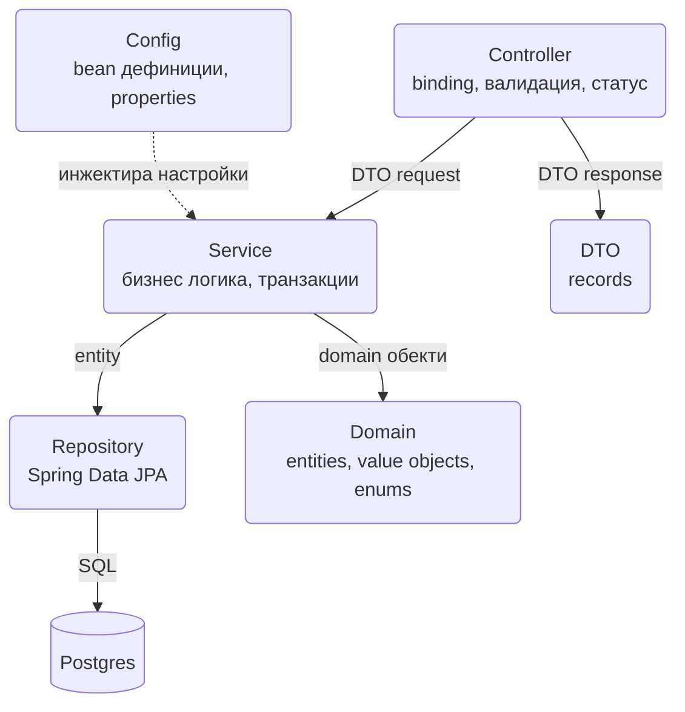
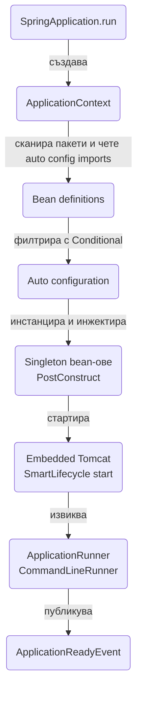

# Структура на проекта

Всеки нов Spring Boot сървис започва по един и същи начин: генерираш скелет, избираш starters, подреждаш пакетите и решаваш как ще се подреждат bean-овете. Решенията, които вземеш през първия час, определят колко лесно ще се поддържа проектът след година. Този документ показва как се създава проектът, какво точно прави `@SpringBootApplication`, как да подредиш пакетите по feature, как работят dependency injection, scope-овете и lifecycle-ът на bean-овете, и как Spring Boot решава какво да автоконфигурира. Накрая има кратка бележка за Spring Boot 4, за да знаеш къде се разминава с версията, която този наръчник описва.

| Какво | Кога | Инструмент |
|---|---|---|
| Генериране на проект | Ден 1 | Spring Initializr, `curl start.spring.io` |
| Управление на версии | Винаги | `spring-boot-starter-parent`, starters |
| Подредба на кода | Ден 1, преди първия feature | Пакети по feature, слоеве вътре в пакета |
| Свързване на компоненти | Постоянно | Constructor injection, `@Bean`, `ObjectProvider` |
| Инициализация при старт | Seed данни, warm-up, проверки | `ApplicationRunner`, `ApplicationReadyEvent` |
| Разбиране какво е включено | При странно поведение | `--debug`, actuator `conditions` |
| Бърз цикъл на разработка | Локално | `spring-boot-devtools`, `mvn spring-boot:run` |

## 1. Създаване на проекта

### Spring Initializr през браузъра

Отвори `https://start.spring.io`, избери Maven, Java 21, Spring Boot 3.5.x и добави зависимостите: Spring Web, Validation, Spring Data JPA, Spring Security, Actuator, PostgreSQL Driver. Генерираният zip съдържа `pom.xml`, Maven wrapper (`mvnw`), `src/main/java/.../ShopApplication.java`, празен `application.properties` и един тест.

### Spring Initializr от командния ред

Същото нещо, но възпроизводимо и подходящо за скрипт:

```bash
curl https://start.spring.io/starter.zip \
  -d type=maven-project \
  -d language=java \
  -d bootVersion=3.5.6 \
  -d javaVersion=21 \
  -d groupId=com.acme \
  -d artifactId=shop \
  -d name=shop \
  -d packageName=com.acme.shop \
  -d baseDir=shop \
  -d dependencies=web,validation,data-jpa,security,actuator,postgresql,devtools \
  -o shop.zip

unzip shop.zip && cd shop
./mvnw spring-boot:run
```

Списъкът с валидни идентификатори на зависимости се вижда с `curl https://start.spring.io` (връща текстова таблица). Преименувай `application.properties` на `application.yml` веднага, преди да има какво да се губи.

### Какво е spring-boot-starter-parent

`spring-boot-starter-parent` е родителски POM, който дава три неща: управлявани версии на стотици библиотеки (BOM), сензитивни настройки на Maven плъгините (Java 21, UTF-8, `spring-boot-maven-plugin` с `repackage`) и филтриране на ресурси (`@project.version@` в `application.yml`). Затова в `pom.xml` не пишеш `<version>` за нищо, което Boot управлява. Ако не можеш да ползваш parent (вече имаш корпоративен parent), импортираш `spring-boot-dependencies` като BOM в `<dependencyManagement>` и добавяш плъгина ръчно.

### Какво е starter

Starter е празен артефакт, чиято единствена стойност е списъкът от транзитивни зависимости. `spring-boot-starter-web` дърпа Spring MVC, Tomcat, Jackson и `spring-boot-starter`, който от своя страна дърпа logging и auto-configuration. Starter-ите не съдържат код: автоконфигурацията живее в `spring-boot-autoconfigure` и се активира според това какво има в classpath.

### Maven pom.xml

```xml
<?xml version="1.0" encoding="UTF-8"?>
<project xmlns="http://maven.apache.org/POM/4.0.0"
         xmlns:xsi="http://www.w3.org/2001/XMLSchema-instance"
         xsi:schemaLocation="http://maven.apache.org/POM/4.0.0 https://maven.apache.org/xsd/maven-4.0.0.xsd">
    <modelVersion>4.0.0</modelVersion>

    <parent>
        <groupId>org.springframework.boot</groupId>
        <artifactId>spring-boot-starter-parent</artifactId>
        <version>3.5.6</version>
        <relativePath/>
    </parent>

    <groupId>com.acme</groupId>
    <artifactId>shop</artifactId>
    <version>0.0.1-SNAPSHOT</version>
    <name>shop</name>

    <properties>
        <java.version>21</java.version>
    </properties>

    <dependencies>
        <dependency>
            <groupId>org.springframework.boot</groupId>
            <artifactId>spring-boot-starter-web</artifactId>
        </dependency>
        <dependency>
            <groupId>org.springframework.boot</groupId>
            <artifactId>spring-boot-starter-validation</artifactId>
        </dependency>
        <dependency>
            <groupId>org.springframework.boot</groupId>
            <artifactId>spring-boot-starter-data-jpa</artifactId>
        </dependency>
        <dependency>
            <groupId>org.springframework.boot</groupId>
            <artifactId>spring-boot-starter-security</artifactId>
        </dependency>
        <dependency>
            <groupId>org.springframework.boot</groupId>
            <artifactId>spring-boot-starter-actuator</artifactId>
        </dependency>

        <dependency>
            <groupId>org.postgresql</groupId>
            <artifactId>postgresql</artifactId>
            <scope>runtime</scope>
        </dependency>

        <dependency>
            <groupId>org.springframework.boot</groupId>
            <artifactId>spring-boot-devtools</artifactId>
            <scope>runtime</scope>
            <optional>true</optional>
        </dependency>
        <dependency>
            <groupId>org.springframework.boot</groupId>
            <artifactId>spring-boot-configuration-processor</artifactId>
            <optional>true</optional>
        </dependency>

        <dependency>
            <groupId>org.springframework.boot</groupId>
            <artifactId>spring-boot-starter-test</artifactId>
            <scope>test</scope>
        </dependency>
        <dependency>
            <groupId>org.springframework.security</groupId>
            <artifactId>spring-security-test</artifactId>
            <scope>test</scope>
        </dependency>
        <dependency>
            <groupId>org.springframework.boot</groupId>
            <artifactId>spring-boot-testcontainers</artifactId>
            <scope>test</scope>
        </dependency>
        <dependency>
            <groupId>org.testcontainers</groupId>
            <artifactId>postgresql</artifactId>
            <scope>test</scope>
        </dependency>
    </dependencies>

    <build>
        <plugins>
            <plugin>
                <groupId>org.springframework.boot</groupId>
                <artifactId>spring-boot-maven-plugin</artifactId>
            </plugin>
        </plugins>
    </build>
</project>
```

`spring-boot-starter-test` включва JUnit 5, AssertJ, Mockito, Hamcrest, JSONassert и Spring Test. Не добавяй JUnit отделно.

### Gradle Kotlin DSL

Същият проект в `build.gradle.kts`. Разликата е, че версиите се управляват от плъгина `io.spring.dependency-management`, а не от parent:

```kotlin
plugins {
    java
    id("org.springframework.boot") version "3.5.6"
    id("io.spring.dependency-management") version "1.1.7"
}

group = "com.acme"
version = "0.0.1-SNAPSHOT"

java {
    toolchain { languageVersion = JavaLanguageVersion.of(21) }
}

repositories { mavenCentral() }

dependencies {
    implementation("org.springframework.boot:spring-boot-starter-web")
    implementation("org.springframework.boot:spring-boot-starter-validation")
    implementation("org.springframework.boot:spring-boot-starter-data-jpa")
    implementation("org.springframework.boot:spring-boot-starter-security")
    implementation("org.springframework.boot:spring-boot-starter-actuator")
    runtimeOnly("org.postgresql:postgresql")
    developmentOnly("org.springframework.boot:spring-boot-devtools")
    annotationProcessor("org.springframework.boot:spring-boot-configuration-processor")
    testImplementation("org.springframework.boot:spring-boot-starter-test")
    testImplementation("org.springframework.security:spring-security-test")
    testImplementation("org.springframework.boot:spring-boot-testcontainers")
    testImplementation("org.testcontainers:postgresql")
}

tasks.withType<Test> { useJUnitPlatform() }
```

## 2. Минимален работещ пример

```java
package com.acme.shop;

import org.springframework.boot.SpringApplication;
import org.springframework.boot.autoconfigure.SpringBootApplication;

@SpringBootApplication
public class ShopApplication {

    public static void main(String[] args) {
        SpringApplication.run(ShopApplication.class, args);
    }
}
```

```java
package com.acme.shop.product;

import org.springframework.web.bind.annotation.GetMapping;
import org.springframework.web.bind.annotation.RequestMapping;
import org.springframework.web.bind.annotation.RestController;

@RestController
@RequestMapping("/api/products")
class ProductController {

    private final ProductService productService;

    ProductController(ProductService productService) {
        this.productService = productService;
    }

    @GetMapping
    List<ProductResponse> list() {
        return productService.findAll();
    }
}
```

```yaml
spring:
  application:
    name: shop
  datasource:
    url: jdbc:postgresql://localhost:5432/shop
    username: shop
    password: shop
  jpa:
    open-in-view: false
server:
  port: 8080
```

```bash
./mvnw spring-boot:run
curl http://localhost:8080/api/products
```

### Какво прави @SpringBootApplication

Това е композитна анотация от три части:

| Анотация | Ефект |
|---|---|
| `@SpringBootConfiguration` | Класът е `@Configuration`: може да декларира `@Bean` методи и тестовете го намират като корен на контекста |
| `@EnableAutoConfiguration` | Включва механизма, който чете `spring-boot-autoconfigure` и регистрира bean-ове според classpath и properties |
| `@ComponentScan` | Сканира пакета на класа и всички подпакети за `@Component`, `@Service`, `@Repository`, `@Controller`, `@Configuration` |

Следствие от третата точка: главният клас трябва да е в коренния пакет (`com.acme.shop`), а не в `com.acme.shop.config`. Ако е по-навътре, класовете в съседни пакети няма да бъдат сканирани и ще получиш `NoSuchBeanDefinitionException` без видима причина.

## 3. Подредба на пакетите

### По feature, не по слой

Двата модела, които ще срещнеш:

```
# По слой (не препоръчваме)
com.acme.shop
├── controller
│   ├── OrderController.java
│   ├── ProductController.java
│   └── UserController.java
├── service
│   ├── OrderService.java
│   ├── ProductService.java
│   └── UserService.java
├── repository
├── model
└── dto
```

```
# По feature (препоръчваме)
com.acme.shop
├── ShopApplication.java
├── common
│   ├── config
│   │   ├── SecurityConfig.java
│   │   ├── JacksonConfig.java
│   │   └── AppProperties.java
│   ├── error
│   │   ├── GlobalExceptionHandler.java
│   │   └── NotFoundException.java
│   └── web
│       └── PageResponse.java
├── order
│   ├── Order.java
│   ├── OrderLine.java
│   ├── OrderStatus.java
│   ├── OrderRepository.java
│   ├── OrderService.java
│   ├── OrderController.java
│   ├── OrderMapper.java
│   └── dto
│       ├── CreateOrderRequest.java
│       └── OrderResponse.java
├── product
│   ├── Product.java
│   ├── ProductRepository.java
│   ├── ProductService.java
│   ├── ProductController.java
│   └── dto
└── user
    ├── UserAccount.java
    ├── UserAccountRepository.java
    ├── UserService.java
    └── UserController.java
```

Защо по feature:

- Всичко за поръчките е на едно място. Промяна в `Order` засяга един пакет, а не пет.
- Package-private видимост работи като граница. `OrderRepository` може да е без `public` и тогава `ProductService` физически не може да го инжектира. Това е най-евтиният начин да спреш спагети между модулите.
- Когато сървисът порасне, пакетът `order` се изнася в отделен модул или микросървис почти механично.
- Подредбата по слой изглежда подредена в проект с три класа, а при тридесет `controller` пакетът става списък без връзка между файловете.

Правило за междумодулни връзки: `order` може да вика `product` само през публичния му сервиз (`ProductService`) или през публично API (интерфейс в `product`). Никога през чужд repository или entity, защото тогава транзакциите и инвариантите на другия модул са извън контрол.

### Слоевете вътре в един feature



| Слой | Какво съдържа | Какво не трябва да прави |
|---|---|---|
| controller | `@RestController`, binding, `@Valid`, `ResponseEntity` | Бизнес логика, директен достъп до repository |
| service | `@Service`, `@Transactional`, оркестрация, правила | Да знае за HTTP (`HttpServletRequest`, статус кодове) |
| repository | `JpaRepository`, `JdbcClient`, custom заявки | Логика извън заявки, mapping към DTO |
| domain | Entities, enums, value objects, domain exceptions | Да зависи от Spring Web или Jackson |
| dto | Records за request и response | Да се ползва като entity или да се връща от repository |
| config | `@Configuration`, `@ConfigurationProperties`, `@Bean` | Да държи състояние на приложението |

Правилата между тях са прости: зависимостите сочат само надолу (controller знае за service, service за repository, никой не знае за controller), а DTO не се подават под service слоя като параметри на repository. Детайлите за mapping между entity и DTO са в [DTO и mapping](DTO_Mapping.md).

## 4. Bean-ове и dependency injection

### Стереотипните анотации

`@Component` е базовата. `@Service`, `@Repository` и `@Controller` са нейни специализации, които добавят семантика и в два случая реално поведение:

- `@Repository` включва exception translation: `SQLException` и Hibernate грешки стават `DataAccessException` подкласове. При Spring Data repository интерфейси това става автоматично.
- `@Controller` и `@RestController` се разпознават от `DispatcherServlet` като handler-и.
- `@Service` не добавя нищо, освен четливост, което само по себе си е достатъчно.

### Constructor injection

Единствената форма на инжектиране, която ползваме. Полетата са `final`, зависимостите са явни, класът се тества с `new`, а цикличните зависимости гърмят при старт, вместо да се крият:

```java
package com.acme.shop.order;

import org.springframework.stereotype.Service;
import org.springframework.transaction.annotation.Transactional;

@Service
public class OrderService {

    private final OrderRepository orderRepository;
    private final ProductService productService;
    private final OrderMapper orderMapper;

    public OrderService(OrderRepository orderRepository,
                        ProductService productService,
                        OrderMapper orderMapper) {
        this.orderRepository = orderRepository;
        this.productService = productService;
        this.orderMapper = orderMapper;
    }

    @Transactional
    public OrderResponse create(CreateOrderRequest request) {
        var product = productService.requireAvailable(request.productId());
        var order = Order.create(product, request.quantity());
        return orderMapper.toResponse(orderRepository.save(order));
    }
}
```

Когато класът има един конструктор, `@Autowired` не е нужен. Ако имаш Lombok, `@RequiredArgsConstructor` генерира същото.

### @Configuration и @Bean

За класове, които не са твои (библиотечни клиенти, `Clock`, `RestClient`), или за bean-ове, чието създаване изисква логика:

```java
package com.acme.shop.common.config;

import java.time.Clock;
import org.springframework.context.annotation.Bean;
import org.springframework.context.annotation.Configuration;
import org.springframework.web.client.RestClient;

@Configuration
public class AppConfig {

    @Bean
    Clock clock() {
        return Clock.systemUTC();
    }

    @Bean
    RestClient paymentsClient(RestClient.Builder builder, AppProperties props) {
        return builder.baseUrl(props.payments().baseUrl()).build();
    }
}
```

`@Configuration` класовете се проксират с CGLIB, така че ако `@Bean` метод извика друг `@Bean` метод, получаваш същия singleton, а не нов обект. `@Configuration(proxyBeanMethods = false)` изключва това за по-бърз старт, но тогава междубийновите зависимости се подават като параметри на метода (както в примера горе), което така или иначе е по-чистият стил.

### Няколко кандидата: @Qualifier и @Primary

Когато два bean-а реализират един интерфейс, Spring не знае кой да инжектира и спира с `NoUniqueBeanDefinitionException`:

```java
public interface PaymentGateway {
    PaymentResult charge(Order order);
}

@Component("stripeGateway")
class StripeGateway implements PaymentGateway { ... }

@Component("paypalGateway")
@Primary
class PaypalGateway implements PaymentGateway { ... }
```

```java
@Service
public class CheckoutService {

    private final PaymentGateway defaultGateway;
    private final PaymentGateway stripe;

    public CheckoutService(PaymentGateway defaultGateway,
                           @Qualifier("stripeGateway") PaymentGateway stripe) {
        this.defaultGateway = defaultGateway;   // PaypalGateway заради @Primary
        this.stripe = stripe;
    }
}
```

`@Primary` отговаря на въпроса "кой по подразбиране", `@Qualifier` на "точно този". Името на параметъра също работи като fallback qualifier, ако компилираш с `-parameters` (Boot parent го включва), но не разчитай на това, защото едно преименуване го чупи тихо.

### List, Map, Optional и ObjectProvider

```java
@Service
public class NotificationService {

    private final List<NotificationChannel> channels;
    private final Map<String, NotificationChannel> channelsByName;
    private final Optional<AuditSink> auditSink;
    private final ObjectProvider<SmsSender> smsSender;

    public NotificationService(List<NotificationChannel> channels,
                               Map<String, NotificationChannel> channelsByName,
                               Optional<AuditSink> auditSink,
                               ObjectProvider<SmsSender> smsSender) {
        this.channels = channels;
        this.channelsByName = channelsByName;
        this.auditSink = auditSink;
        this.smsSender = smsSender;
    }

    public void notify(Order order) {
        channels.forEach(c -> c.send(order));
        auditSink.ifPresent(a -> a.record(order));
        // SmsSender е bean само когато има конфигуриран доставчик
        smsSender.ifAvailable(s -> s.send(order.customerPhone(), "Поръчка " + order.id()));
    }
}
```

- `List<T>` получава всички bean-ове от типа, подредени по `@Order` или `Ordered`. Празен списък е валиден, няма грешка.
- `Map<String, T>` е същото, но с ключ името на bean-а.
- `Optional<T>` за единичен bean, който може да липсва.
- `ObjectProvider<T>` е по-гъвкав: `getIfAvailable()`, `getIfUnique()`, `getObject()` (lazy, на всяко извикване), `orderedStream()`. Полезен и за prototype bean-ове, защото всяко `getObject()` дава нов инстанс.

### Scope-ове

| Scope | Анотация | Кога |
|---|---|---|
| singleton | по подразбиране | 99% от bean-овете: services, repositories, clients |
| prototype | `@Scope("prototype")` | Обект със състояние на извикване, например builder |
| request | `@RequestScope` | Данни за текущия HTTP request, например request id или текущ потребител |
| session | `@SessionScope` | Състояние на HTTP сесия, рядко при REST |
| application | `@ApplicationScope` | Еквивалент на singleton, но в `ServletContext` |

Singleton bean трябва да е stateless или thread-safe, защото всички request-и го споделят. Инжектирането на request-scoped bean в singleton работи, защото Spring слага proxy, който при всяко извикване търси реалния обект за текущата нишка:

```java
@Component
@RequestScope
public class RequestContext {
    private final String requestId = UUID.randomUUID().toString();
    public String requestId() { return requestId; }
}
```

С виртуални нишки (`spring.threads.virtual.enabled=true`) request scope продължава да работи, защото е вързан към `RequestContextHolder`, а не към pool-а.

## 5. Lifecycle на bean и на приложението



### Инициализация на един bean

```java
import jakarta.annotation.PostConstruct;
import jakarta.annotation.PreDestroy;

@Component
public class ExchangeRateCache {

    private final RestClient ratesClient;
    private volatile Map<String, BigDecimal> rates = Map.of();

    public ExchangeRateCache(RestClient ratesClient) {
        this.ratesClient = ratesClient;
    }

    @PostConstruct
    void warmUp() {
        // тук всички зависимости вече са инжектирани, за разлика от конструктора
        rates = ratesClient.get().uri("/rates").retrieve().body(RatesResponse.class).rates();
    }

    @PreDestroy
    void shutdown() {
        rates = Map.of();
    }
}
```

Редът за един bean: конструктор, инжектиране на setter-и (ако има), `@PostConstruct`, `InitializingBean.afterPropertiesSet()`, `@Bean(initMethod)`. При спиране: `@PreDestroy`, `DisposableBean.destroy()`, `@Bean(destroyMethod)`. Ползвай `@PostConstruct` и `@PreDestroy`; интерфейсите са по-стари и обвързват класа със Spring.

Внимавай: в `@PostConstruct` не прави мрежови извиквания, които могат да провалят старта, освен ако това е умишлено (fail fast). Ако искаш warm-up, който не блокира, виж `ApplicationReadyEvent` долу.

### Код след пълен старт

| Механизъм | Кога се изпълнява | За какво |
|---|---|---|
| `ApplicationRunner` | След създаване на контекста, преди `ApplicationReadyEvent` | Seed данни, миграции извън Flyway, проверки на конфигурацията |
| `CommandLineRunner` | Същото, но получава `String[] args` | CLI стил приложения |
| `@EventListener(ApplicationReadyEvent.class)` | След всички runners, HTTP портът вече приема заявки | Warm-up, регистрация в service discovery, нотификация |
| `SmartLifecycle` | Start и stop в контролиран ред с `getPhase()` | Consumer-и, scheduler-и, всичко, което трябва да спре преди другото |

```java
@Component
public class StartupChecks implements ApplicationRunner {

    private final DataSource dataSource;
    private final AppProperties props;

    public StartupChecks(DataSource dataSource, AppProperties props) {
        this.dataSource = dataSource;
        this.props = props;
    }

    @Override
    public void run(ApplicationArguments args) throws Exception {
        try (var conn = dataSource.getConnection()) {
            if (!conn.isValid(2)) {
                throw new IllegalStateException("База данни не отговаря");
            }
        }
        if (props.payments().baseUrl() == null) {
            throw new IllegalStateException("app.payments.base-url липсва");
        }
    }
}
```

```java
@Component
public class ReadyListener {

    private static final Logger log = LoggerFactory.getLogger(ReadyListener.class);

    @EventListener(ApplicationReadyEvent.class)
    public void onReady() {
        log.info("Сървисът приема заявки");
    }
}
```

```java
@Component
public class OutboxPoller implements SmartLifecycle {

    private volatile boolean running;

    @Override
    public void start() {
        running = true;
        // стартирай polling нишката
    }

    @Override
    public void stop() {
        running = false;
        // изчакай текущата итерация да приключи
    }

    @Override
    public boolean isRunning() { return running; }

    @Override
    public int getPhase() {
        // по-ниска фаза стартира по-рано и спира по-късно; web сървърът е на Integer.MAX_VALUE - 1
        return 0;
    }
}
```

Няколко runner-а се подреждат с `@Order`. Изключение в runner спира приложението с exit code 1, което е желаното поведение за проверки.

## 6. Как работи auto-configuration

### Механизмът

`spring-boot-autoconfigure` съдържа стотици `@AutoConfiguration` класове. Списъкът им е във файла `META-INF/spring/org.springframework.boot.autoconfigure.AutoConfiguration.imports`. `@EnableAutoConfiguration` ги зарежда след твоите компоненти, за да могат условията да видят какво вече си дефинирал. Всяка от тях е ограничена с условия:

| Условие | Значение |
|---|---|
| `@ConditionalOnClass(DataSource.class)` | Само ако класът е в classpath, тоест starter-ът е добавен |
| `@ConditionalOnMissingBean(DataSource.class)` | Само ако ти не си дефинирал такъв bean. Това е вратата за override |
| `@ConditionalOnProperty(name = "app.feature.x", havingValue = "true")` | Само при конкретна property |
| `@ConditionalOnWebApplication(type = SERVLET)` | Само в servlet приложение |
| `@ConditionalOnBean` | Само ако друг bean вече съществува |

Ето защо твоят `@Bean DataSource` печели: автоконфигурацията на `DataSource` вижда, че такъв bean вече има, и не прави нищо. Същата идея важи за `ObjectMapper`, `RestClient.Builder`, `SecurityFilterChain`, `CacheManager` и всичко останало.

### Собствена автоконфигурация в библиотека

Ако изнасяш общ код в споделена библиотека за няколко сървиса, пишеш същия механизъм:

```java
package com.acme.platform.audit;

import org.springframework.boot.autoconfigure.AutoConfiguration;
import org.springframework.boot.autoconfigure.condition.ConditionalOnClass;
import org.springframework.boot.autoconfigure.condition.ConditionalOnMissingBean;
import org.springframework.boot.context.properties.EnableConfigurationProperties;
import org.springframework.context.annotation.Bean;

@AutoConfiguration
@ConditionalOnClass(AuditPublisher.class)
@EnableConfigurationProperties(AuditProperties.class)
public class AuditAutoConfiguration {

    @Bean
    @ConditionalOnMissingBean
    AuditPublisher auditPublisher(AuditProperties props) {
        return new AuditPublisher(props.topic());
    }
}
```

```
src/main/resources/META-INF/spring/org.springframework.boot.autoconfigure.AutoConfiguration.imports
```

```
com.acme.platform.audit.AuditAutoConfiguration
```

Автоконфигурационните класове не трябва да са в пакет, който сървисите сканират с `@ComponentScan`, иначе се зареждат преди потребителските bean-ове и `@ConditionalOnMissingBean` губи смисъл.

### Какво беше включено и защо

Два начина да видиш отчета:

```bash
./mvnw spring-boot:run -Dspring-boot.run.arguments=--debug
# или
java -jar target/shop-0.0.1-SNAPSHOT.jar --debug
```

Логът съдържа `CONDITIONS EVALUATION REPORT` с три секции: `Positive matches` (какво се включи и кое условие мина), `Negative matches` (какво не се включи и защо) и `Exclusions`. Най-честият въпрос "защо няма bean X" се отговаря в `Negative matches`.

Същото през actuator, без рестарт:

```yaml
management:
  endpoints:
    web:
      exposure:
        include: health,info,conditions,beans
```

```http
GET /actuator/conditions
GET /actuator/beans
```

`conditions` и `beans` разкриват вътрешността на приложението, затова в production ги оставяш зад authentication или не ги излагаш по HTTP. Подробности в [Observability](Observability.md).

### Изключване на автоконфигурация

```java
@SpringBootApplication(exclude = UserDetailsServiceAutoConfiguration.class)
public class ShopApplication { ... }
```

```yaml
spring:
  autoconfigure:
    exclude:
      - org.springframework.boot.autoconfigure.security.servlet.UserDetailsServiceAutoConfiguration
```

Изключвай само когато знаеш точно защо. В повечето случаи правилният ход е да дефинираш собствен bean и да оставиш `@ConditionalOnMissingBean` да свърши работата.

## 7. Ресурси, devtools и build

### src/main/resources

```
src/main/resources
├── application.yml
├── application-local.yml
├── application-prod.yml
├── banner.txt
├── db/migration
│   ├── V1__init.sql
│   └── V2__orders.sql
├── static
│   └── favicon.ico
├── templates
│   └── emails
│       └── order-confirmed.html
├── i18n
│   └── messages_bg.properties
└── META-INF
    └── additional-spring-configuration-metadata.json
```

| Папка или файл | Кой го чете |
|---|---|
| `application*.yml` | `SpringApplication`, виж [Конфигурация и профили](Configuration_Profiles.md) |
| `db/migration` | Flyway, виж [Миграции](Migrations.md) |
| `static`, `public` | Spring MVC сервира файловете като статични ресурси, виж [Routing](Routing.md) |
| `templates` | Thymeleaf, виж [Имейли и HTML шаблони](Emails_Templates.md) |
| `i18n` или `messages*.properties` | `MessageSource`, ако е конфигуриран `spring.messages.basename` |
| `banner.txt` | Текстът при стартиране. Изтрий го или го смени, за да не е Spring логото |

### spring-boot-devtools

С `spring-boot-devtools` в classpath получаваш автоматичен рестарт при промяна на класовете (две classloader-а: един за библиотеки, един за твоя код, рестартира се само вторият), LiveReload сървър, кеширането на шаблони е изключено, а `spring.jpa.show-sql` и подобни "dev" стойности са включени по подразбиране. Devtools се самоизключва, когато приложението е пуснато с `java -jar`, така че няма риск да се озове в production, стига да го държиш `optional`.

```yaml
spring:
  devtools:
    restart:
      additional-exclude: static/**
    livereload:
      enabled: false
```

В IntelliJ рестартът се задейства след "Build Project" (Ctrl+F9), не при всяко запазване, освен ако не включиш "Build project automatically".

### Пускане и build

```bash
./mvnw spring-boot:run                                  # с devtools и локален профил
./mvnw spring-boot:run -Dspring-boot.run.profiles=local  # явно избран профил
./mvnw clean verify                                     # тестове плюс jar
./mvnw clean package -DskipTests                        # само jar
java -jar target/shop-0.0.1-SNAPSHOT.jar --spring.profiles.active=prod
```

`spring-boot-maven-plugin` с `repackage` цел прави "fat jar": твоите класове плюс всички зависимости в `BOOT-INF/lib`, с launcher, който ги зарежда. Оригиналният тънък jar остава като `shop-0.0.1-SNAPSHOT.jar.original`. За Docker образи със слоеве и `jarmode=tools` виж [Docker и деплой](Docker_Deploy.md).

Полезни флагове на плъгина:

```xml
<plugin>
    <groupId>org.springframework.boot</groupId>
    <artifactId>spring-boot-maven-plugin</artifactId>
    <configuration>
        <excludes>
            <exclude>
                <groupId>org.projectlombok</groupId>
                <artifactId>lombok</artifactId>
            </exclude>
        </excludes>
    </configuration>
</plugin>
```

`./mvnw spring-boot:build-image` прави OCI образ с Buildpacks без Dockerfile, което е добър старт, преди да имаш нужда от собствен Dockerfile.

## 8. Spring Boot 4

Spring Boot 4.0 излезе през ноември 2025 върху Spring Framework 7, Jakarta EE 11 и Jackson 3. Този наръчник е написан за Spring Boot 3.5, защото към момента повечето проекти, които ще наследиш или разширяваш, са на 3.x, а 3.5 е последната линия с дълга поддръжка преди 4.

Ако започваш нов проект директно на 4.x, разчитай на официалния migration guide, а не на този документ, за следните неща:

- Част от starter-ите са преименувани или разделени на по-малки модули (например web starter-ът за Spring MVC има ново име). Initializr генерира правилните имена, но при копиране от 3.x `pom.xml` ще получиш грешки за липсващи артефакти.
- Jackson 3 е в нов пакет (`tools.jackson` вместо `com.fasterxml.jackson` за databind и core). Анотациите като `@JsonProperty` остават в стария пакет. Всеки `ObjectMapper` custom код и всеки `@JsonComponent` трябва да се провери.
- Тестовите slice анотации и някои `spring.*` properties са преместени или преименувани.
- Минималните версии са Java 17 и Jakarta EE 11, така че по-стари библиотеки за `jakarta.servlet` 6.0 може да не работят.

Всичко друго в този документ (структура на пакетите, DI, lifecycle, автоконфигурация) е същото в 4.x, защото механизмите не са променени.

## 9. Капани

- Главният клас е сложен в подпакет (`com.acme.shop.app`), затова `@ComponentScan` не вижда `com.acme.shop.order`. Симптом: `NoSuchBeanDefinitionException` за bean, който ясно има `@Service`. Главният клас стои в коренния пакет.
- Field injection с `@Autowired` крие цикличните зависимости и прави тестовете зависими от reflection. При constructor injection цикълът гърми при старт с ясно съобщение и го разбиваш с интерфейс или с `ObjectProvider`.
- Два bean-а от един тип без `@Primary` или `@Qualifier`: приложението не стартира. Още по-лошо е да разчиташ на името на параметъра като qualifier, защото refactor го чупи тихо.
- `@Transactional` или `@Cacheable` върху метод, извикан от същия клас, не работи, защото proxy-то се заобикаля. Изнеси метода в друг bean. Виж [Транзакции и locking](Transactions.md).
- Мрежово извикване в `@PostConstruct` към сървис, който още не е стартирал в docker-compose, прави старта да зависи от реда на контейнерите. Или fail fast умишлено с retry, или премести в `ApplicationReadyEvent` с graceful обработка.
- `spring-boot-devtools` без `<optional>true</optional>` попада в зависимите модули и в някои build pipeline-и. Винаги `optional` и `runtime`.
- Автоконфигурационен клас, сложен в сканиран пакет, се обработва преди потребителските bean-ове и `@ConditionalOnMissingBean` спира да работи. Библиотечният код се регистрира само през `AutoConfiguration.imports`.
- Singleton bean с mutable поле (`List` без синхронизация, `SimpleDateFormat`) под натоварване дава случайни грешки. Или го прави stateless, или го слагай в `@RequestScope`.
- Копиране на `pom.xml` между проекти с различна версия на parent носи несъвместими transitive версии. Използвай Initializr за всеки нов проект и после сравни.
- Изключване на автоконфигурация с `exclude` вместо дефиниране на собствен bean води до загуба на свързани функционалности (health indicator, metrics), които са зависели от нея.

## 10. Чеклист

- [ ] Проектът е генериран от Initializr с Java 21, Boot 3.5.x и точно нужните starters
- [ ] `application.properties` е сменен с `application.yml`, `spring.application.name` е зададен
- [ ] Главният клас е в коренния пакет, пакетите са по feature, `common` съдържа config и error handling
- [ ] Всички зависимости са constructor injection, полетата са `final`, няма `@Autowired` на полета
- [ ] Repository и entity класовете са package-private, където е възможно
- [ ] `spring.jpa.open-in-view=false` е зададено от първия ден
- [ ] `spring-boot-devtools` е `optional` и `runtime`, `spring-boot-configuration-processor` е `optional`
- [ ] Стартовите проверки (връзка с база, задължителни properties) са в `ApplicationRunner`
- [ ] Actuator `conditions` и `beans` не са публично достъпни в production
- [ ] `./mvnw clean verify` минава и `java -jar` стартира с `--spring.profiles.active=prod`
- [ ] `banner.txt` е сменен или премахнат

## 11. Свързани документи

- [Конфигурация и профили](Configuration_Profiles.md): как `application.yml`, профилите и `@ConfigurationProperties` подават настройки на bean-овете от този документ.
- [Routing](Routing.md): какво се случва с request-а, след като контролерът от слоя по-горе бъде намерен.
- [Controllers](Controllers.md): пълният пример за controller, service и DTO в един feature пакет.
- [DTO и mapping](DTO_Mapping.md): защо DTO слоят е отделен от entities и как се прави mapping без болка.
- [Testing](Testing.md): как структурата по feature и constructor injection правят тестовете прости.
- [Docker и деплой](Docker_Deploy.md): какво се случва с jar-а след `./mvnw package`.
- [Нов сървис: чеклист](New_Service_Checklist.md): пълният списък за първия ден на нов сървис.
- [Spring Boot reference](https://docs.spring.io/spring-boot/reference/)
