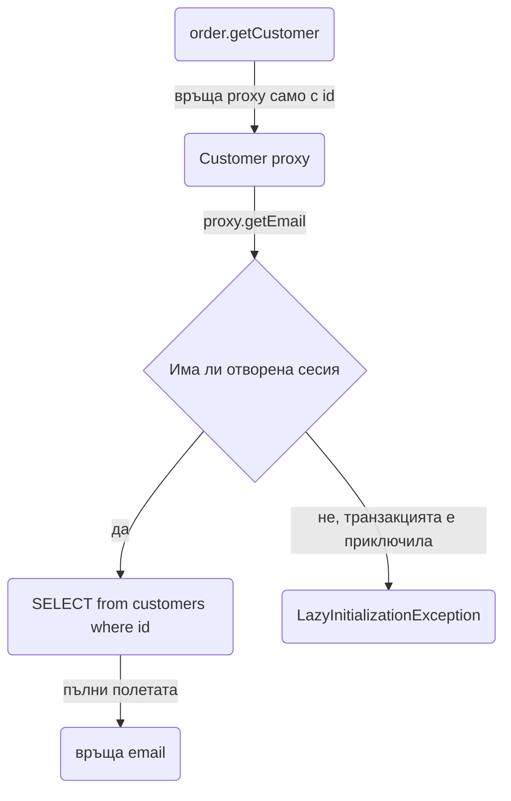
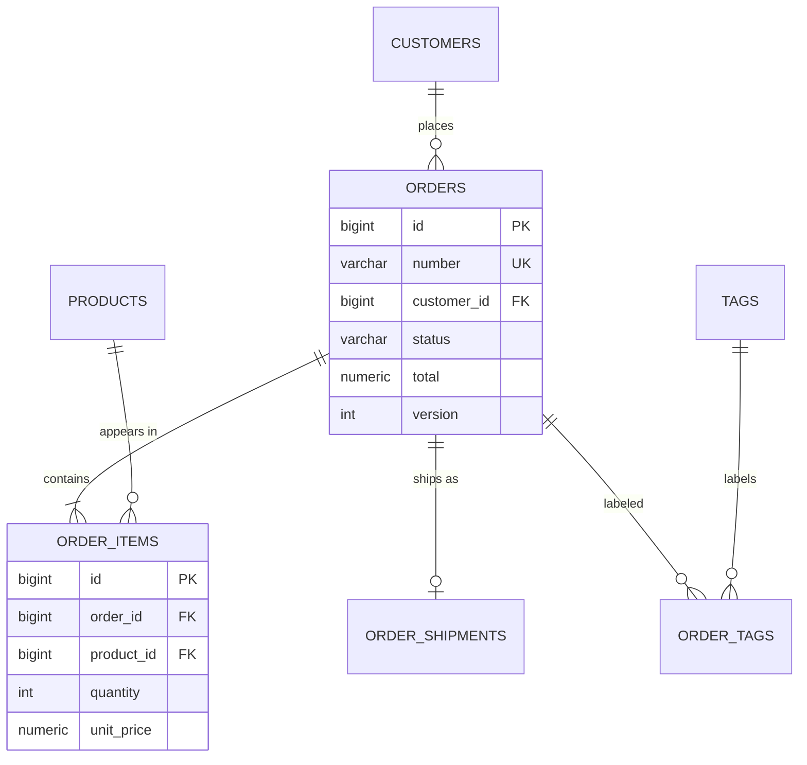

# Релации

Релациите между entity класовете са мястото, където JPA най-често изненадва: lazy proxy, който гърми извън транзакция, N+1 заявки на един екран, cascade, който трие повече отколкото трябва, и `@ManyToMany`, който не позволява да добавиш една колона. Този документ показва четирите типа релации с Postgres DDL и Java код, обяснява как Hibernate ги зарежда отвътре, кога да избягваш двупосочните mapping-и, как се чете граф от обекти ефективно с fetch join и `@EntityGraph`, и как се пишат equals/hashCode и value objects без да си навлечеш проблеми. В края има пълен пример с Order, OrderItem, Product и Customer, който може да копираш като шаблон.

| Какво | Кога | Инструмент |
|---|---|---|
| Детето сочи родител | OrderItem към Order, Order към Customer | `@ManyToOne(fetch = LAZY)` + `@JoinColumn` |
| Родителят управлява децата си | Order и неговите OrderItem | `@OneToMany(mappedBy, cascade = ALL, orphanRemoval = true)` |
| Едно към едно с общ ключ | Order и OrderShipment | `@OneToOne` + `@MapsId` |
| Много към много | Order и Tag | Явен join entity `OrderTag`, не `@ManyToMany` |
| Стойност без идентичност | Address, Money | `@Embeddable` |
| Списък от прости стойности | Tags като низове | `@ElementCollection` (с уговорки) |
| Зареждане на граф за екран | Детайли на поръчка | `JOIN FETCH` или `@EntityGraph` |

## 1. Зависимости и настройка

Нищо извън `spring-boot-starter-data-jpa` и Postgres драйвера от [База данни и ORM](Database_ORM.md). Две настройки обаче са задължителни, преди да пишеш каквато и да е релация:

```yaml src/main/resources/application.yml
spring:
  jpa:
    open-in-view: false
    properties:
      hibernate:
        default_batch_fetch_size: 50
```

`open-in-view: false` прави lazy loading-а извън транзакция да гърми веднага, вместо тихо да издава заявки от controller-а. `default_batch_fetch_size` превръща N+1 в N/50+1 за всички lazy релации, които си забравил да fetch-неш. И двете са обяснени в [База данни и ORM](Database_ORM.md).

## 2. Минимален работещ пример

Поръчка с редове. Postgres:

```sql src/main/resources/db/migration/V20250107_1030__create_orders.sql
create table orders (
    id          bigint generated by default as identity primary key,
    number      varchar(32)    not null unique,
    status      varchar(32)    not null,
    total       numeric(12, 2) not null default 0,
    version     integer        not null default 0,
    created_at  timestamptz    not null default now()
);

create table order_items (
    id          bigint generated by default as identity primary key,
    order_id    bigint         not null references orders (id),
    product_id  bigint         not null references products (id),
    quantity    integer        not null check (quantity > 0),
    unit_price  numeric(12, 2) not null
);

create index idx_order_items_order_id on order_items (order_id);
create index idx_order_items_product_id on order_items (product_id);
```

Entity класовете:

```java src/main/java/com/acme/shop/order/Order.java
package com.acme.shop.order;

@Entity
@Table(name = "orders")
public class Order {

    @Id
    @GeneratedValue(strategy = GenerationType.IDENTITY)
    private Long id;

    @Column(nullable = false, unique = true, length = 32)
    private String number;

    @Enumerated(EnumType.STRING)
    @Column(nullable = false, length = 32)
    private OrderStatus status = OrderStatus.DRAFT;

    @Column(nullable = false, precision = 12, scale = 2)
    private BigDecimal total = BigDecimal.ZERO;

    @OneToMany(mappedBy = "order", cascade = CascadeType.ALL, orphanRemoval = true)
    private List<OrderItem> items = new ArrayList<>();

    @Version
    private int version;

    protected Order() {
    }

    public Order(String number) {
        this.number = number;
    }

    public void addItem(Product product, int quantity) {
        OrderItem item = new OrderItem(this, product, quantity);
        items.add(item);
        recalculateTotal();
    }

    public void removeItem(OrderItem item) {
        items.remove(item);
        recalculateTotal();
    }

    private void recalculateTotal() {
        total = items.stream()
                .map(OrderItem::lineTotal)
                .reduce(BigDecimal.ZERO, BigDecimal::add);
    }

    public List<OrderItem> getItems() {
        return Collections.unmodifiableList(items);
    }

    public Long getId() { return id; }
    public String getNumber() { return number; }
    public OrderStatus getStatus() { return status; }
    public BigDecimal getTotal() { return total; }
}
```

```java src/main/java/com/acme/shop/order/OrderItem.java
package com.acme.shop.order;

@Entity
@Table(name = "order_items")
public class OrderItem {

    @Id
    @GeneratedValue(strategy = GenerationType.IDENTITY)
    private Long id;

    @ManyToOne(fetch = FetchType.LAZY, optional = false)
    @JoinColumn(name = "order_id", nullable = false)
    private Order order;

    @ManyToOne(fetch = FetchType.LAZY, optional = false)
    @JoinColumn(name = "product_id", nullable = false)
    private Product product;

    @Column(nullable = false)
    private int quantity;

    @Column(nullable = false, precision = 12, scale = 2)
    private BigDecimal unitPrice;

    protected OrderItem() {
    }

    OrderItem(Order order, Product product, int quantity) {
        this.order = order;
        this.product = product;
        this.quantity = quantity;
        this.unitPrice = product.getPrice();
    }

    public BigDecimal lineTotal() {
        return unitPrice.multiply(BigDecimal.valueOf(quantity));
    }

    public Long getId() { return id; }
    public Order getOrder() { return order; }
    public Product getProduct() { return product; }
    public int getQuantity() { return quantity; }
    public BigDecimal getUnitPrice() { return unitPrice; }
}
```

Service метод:

```java src/main/java/com/acme/shop/order/OrderService.java
@Transactional
public void addItem(Long orderId, Long productId, int quantity) {
    Order order = orders.findById(orderId).orElseThrow(() -> new OrderNotFoundException(orderId));
    Product product = products.findById(productId).orElseThrow(() -> new ProductNotFoundException(productId));
    order.addItem(product, quantity);
    // cascade = ALL записва новия OrderItem при commit, без items.save()
}
```

`addItem` и `removeItem` са единственият път към колекцията. `addItem` поддържа двете страни синхронизирани (`item.order` и `order.items`), което е нужно, защото Hibernate записва FK-то от owning страната (`OrderItem.order`), а колекцията `Order.items` е само огледало. `removeItem` разчита на `orphanRemoval`: премахнатият от колекцията ред се трие при flush, без да нулираш `item.order` ръчно.

## 3. Четирите типа релации

### ManyToOne

Owning страната на почти всяка релация. FK колоната е в таблицата на entity-то с `@ManyToOne`.

```java src/main/java/com/acme/shop/order/Order.java
@ManyToOne(fetch = FetchType.LAZY, optional = false)
@JoinColumn(name = "customer_id", nullable = false)
private Customer customer;
```

- `fetch = LAZY` винаги. Default-ът е `EAGER`, което значи, че всяко зареждане на `Order` зарежда и `Customer`, дори да не ти трябва, и при `findAll` това става с N допълнителни заявки или с join, който не си искал.
- `optional = false` казва на Hibernate, че FK-то не може да е null, което му позволява да ползва inner join и да не проверява за null при proxy.
- `@JoinColumn(name = ...)` съвпада с колоната в миграцията. Без него Hibernate измисля `customer_id` по конвенция, което обикновено е същото, но го пиши явно.

### OneToMany

Обратната страна. Не притежава нищо в базата, само казва на Hibernate "колекцията от OrderItem, чието поле `order` сочи към мен":

```java src/main/java/com/acme/shop/order/Order.java
@OneToMany(mappedBy = "order", cascade = CascadeType.ALL, orphanRemoval = true)
private List<OrderItem> items = new ArrayList<>();
```

- `mappedBy` е името на полето в `OrderItem`, не колоната. Без `mappedBy` Hibernate създава join таблица `orders_order_items`, която не искаш.
- `cascade = ALL` значи, че `persist`, `merge`, `remove` на `Order` се пренасят към `items`. Правилно е за композиция: редът няма смисъл без поръчка.
- `orphanRemoval = true` трие `OrderItem`, който е премахнат от колекцията. Без него `removeItem` само нулира FK, което гърми на `not null`.
- Инициализирай колекцията (`new ArrayList<>()`), иначе `addItem` на нов `Order` хвърля NPE.

`@OneToMany` без `mappedBy` (еднопосочна) е възможна с `@JoinColumn(name = "order_id")` върху колекцията, но Hibernate тогава издава INSERT без FK и после UPDATE, за да го сложи. Избягвай я.

### OneToOne

Поръчка и нейната пратка, която се създава по-късно:

```sql src/main/resources/db/migration/V20250110_0900__create_shipments_and_tags.sql
create table order_shipments (
    order_id     bigint primary key references orders (id),
    carrier      varchar(64)  not null,
    tracking_no  varchar(128) not null,
    shipped_at   timestamptz  not null
);
```

```java src/main/java/com/acme/shop/order/OrderShipment.java
package com.acme.shop.order;

@Entity
@Table(name = "order_shipments")
public class OrderShipment {

    @Id
    private Long id;

    @OneToOne(fetch = FetchType.LAZY)
    @MapsId
    @JoinColumn(name = "order_id")
    private Order order;

    private String carrier;
    private String trackingNo;
    private Instant shippedAt;

    protected OrderShipment() {
    }

    public OrderShipment(Order order, String carrier, String trackingNo) {
        this.order = order;
        this.carrier = carrier;
        this.trackingNo = trackingNo;
        this.shippedAt = Instant.now();
    }
}
```

`@MapsId` казва, че PK на `OrderShipment` е същият като PK на `Order`. Няма отделна sequence, няма дублирана колона, и `findById(orderId)` работи за пратката без join.

Капанът на `@OneToOne` е обратната страна. Ако сложиш в `Order` поле `@OneToOne(mappedBy = "order") OrderShipment shipment`, Hibernate не може да го направи lazy: за да реши дали да ти даде proxy или `null`, трябва да провери дали има ред в `order_shipments`, а това е заявка. Резултатът е допълнителен SELECT при всяко зареждане на `Order`. Решението е да не слагаш обратната страна, а да четеш `shipmentRepository.findById(orderId)` когато ти трябва, или да държиш FK-то в `orders` (`shipment_id`), ако е по-естествено `Order` да е owning страна.

### ManyToMany и защо join entity е по-добър

Поръчки и етикети. Стандартният вариант:

```java src/main/java/com/acme/shop/order/Order.java
@ManyToMany
@JoinTable(name = "order_tags",
        joinColumns = @JoinColumn(name = "order_id"),
        inverseJoinColumns = @JoinColumn(name = "tag_id"))
private Set<Tag> tags = new HashSet<>();
```

Работи, докато някой не поиска "кой и кога е сложил етикета". Join таблицата няма entity, няма къде да сложиш `added_by` и `added_at`. Освен това премахване на един елемент от `List` в `@ManyToMany` кара Hibernate да изтрие всички редове за поръчката и да ги вмъкне наново. Вместо това от самото начало прави явен entity:

```sql src/main/resources/db/migration/V20250110_0900__create_shipments_and_tags.sql
create table order_tags (
    order_id  bigint      not null references orders (id),
    tag_id    bigint      not null references tags (id),
    added_by  varchar(100) not null,
    added_at  timestamptz not null default now(),
    primary key (order_id, tag_id)
);
create index idx_order_tags_tag_id on order_tags (tag_id);
```

```java src/main/java/com/acme/shop/order/
@Embeddable
public record OrderTagId(Long orderId, Long tagId) implements Serializable {
}

@Entity
@Table(name = "order_tags")
public class OrderTag {

    @EmbeddedId
    private OrderTagId id;

    @ManyToOne(fetch = FetchType.LAZY)
    @MapsId("orderId")
    @JoinColumn(name = "order_id")
    private Order order;

    @ManyToOne(fetch = FetchType.LAZY)
    @MapsId("tagId")
    @JoinColumn(name = "tag_id")
    private Tag tag;

    @Column(nullable = false, length = 100)
    private String addedBy;

    @Column(nullable = false)
    private Instant addedAt;

    protected OrderTag() {
    }

    public OrderTag(Order order, Tag tag, String addedBy) {
        this.order = order;
        this.tag = tag;
        this.id = new OrderTagId(order.getId(), tag.getId());
        this.addedBy = addedBy;
        this.addedAt = Instant.now();
    }
}
```

Hibernate 6 приема `record` като `@Embeddable` id, което спестява boilerplate. `OrderTag` е обикновен entity с два `@ManyToOne` и свои колони, и `Order` може да има `@OneToMany(mappedBy = "order") List<OrderTag> tags` ако ти трябва, или изобщо да няма колекция, виж следващия раздел.

## 4. Еднопосочни или двупосочни

Всяка `@OneToMany` колекция е обещание: "когато зареждаш `Order`, можеш да стигнеш до всичките му редове". За `OrderItem` това е вярно и полезно, редовете са част от поръчката. За `Customer.orders` не е: клиент с 10 000 поръчки не трябва да ги има в паметта, никой не ги обхожда през `customer.getOrders()`, и `cascade` там е опасен.

Правило: двупосочна релация само при композиция (родителят притежава децата, трие ги заедно със себе си, и броят им е малък). Във всички други случаи само `@ManyToOne` от детето и заявка по FK:

```java src/main/java/com/acme/shop/order/OrderRepository.java
Page<Order> findByCustomerId(Long customerId, Pageable pageable);
```

Предимства: няма колекция за синхронизиране, няма изкушение за `cascade = ALL` върху нещо, което не е композиция, и пагинацията работи естествено.

## 5. Fetch стратегии

| Анотация | Default fetch | Какво да сложиш |
|---|---|---|
| `@ManyToOne` | `EAGER` | `LAZY` |
| `@OneToOne` | `EAGER` | `LAZY` на owning страната, без обратна страна |
| `@OneToMany` | `LAZY` | `LAZY` (остави default) |
| `@ManyToMany` | `LAZY` | не ползвай, виж раздел 3 |
| `@ElementCollection` | `LAZY` | `LAZY` |

Правилото е "LAZY навсякъде, зареждай изрично". `EAGER` в mapping-а е глобално решение: всяка заявка, която докосва entity-то, зарежда релацията, независимо дали екранът я ползва. `LAZY` плюс `JOIN FETCH` или `@EntityGraph` в конкретната repository заявка е локално решение, което виждаш в кода до самата заявка. Единственото място, където `EAGER` не вреди, е `@ManyToOne` към малка справочна таблица (`Currency`), и дори там batch fetching върши същата работа.

## 6. LazyInitializationException

Lazy релацията е proxy: `order.getCustomer()` връща обект от клас `Customer$HibernateProxy`, който знае само id-то. При първия достъп до поле proxy-то пита текущата Hibernate сесия (persistence context) да го зареди.



Със `spring.jpa.open-in-view=true` сесията е отворена за целия request, затова proxy-то "работи" в controller-а и дори в Jackson. С `false` сесията се затваря при края на `@Transactional` метода, и достъп от controller-а хвърля `LazyInitializationException: could not initialize proxy - no Session`. Това не е проблем за решаване с `open-in-view=true`, а симптом, че service-ът е върнал entity с незаредени данни навън.

Правилните решения, по ред на предпочитание:

1. **DTO projection**: ако endpoint-ът само чете, не зареждай entity, а `record` директно от JPQL, виж [База данни и ORM](Database_ORM.md). Няма proxy, няма проблем.
2. **Fetch join или EntityGraph** в repository заявката, така че релацията да е заредена преди края на транзакцията. Service-ът мапва към DTO вътре в транзакцията.
3. **Транзакционен service метод**, който прави мапването към DTO. Service-ът не връща entity на controller-а никога, и lazy loading-ът се случва вътре в `@Transactional`.

Неправилните решения: `Hibernate.initialize()` в controller, `@Transactional` на controller, `open-in-view=true`, `FetchType.EAGER`. Всички те местят проблема, не го решават.

## 7. Изрично зареждане

### EntityGraph

Ad hoc, върху derived query или `findById`:

```java src/main/java/com/acme/shop/order/OrderRepository.java
@EntityGraph(attributePaths = {"customer", "items", "items.product"})
Optional<Order> findWithDetailsById(Long id);

@EntityGraph(attributePaths = "customer")
Page<Order> findByStatus(OrderStatus status, Pageable pageable);
```

Named, когато същият граф се ползва на няколко места:

```java src/main/java/com/acme/shop/order/Order.java
@Entity
@NamedEntityGraph(
        name = "Order.details",
        attributeNodes = {
                @NamedAttributeNode("customer"),
                @NamedAttributeNode(value = "items", subgraph = "items")
        },
        subgraphs = @NamedSubgraph(name = "items", attributeNodes = @NamedAttributeNode("product")))
public class Order { /* ... */ }
```

```java src/main/java/com/acme/shop/order/OrderRepository.java
@EntityGraph("Order.details")
Optional<Order> findWithDetailsById(Long id);
```

`@EntityGraph` генерира LEFT JOIN за всеки път. За `@ManyToOne` това е безопасно и евтино. За колекции важи същото ограничение като при fetch join по-долу.

### JOIN FETCH

```java src/main/java/com/acme/shop/order/OrderRepository.java
@Query("""
        select o from Order o
        join fetch o.customer
        left join fetch o.items i
        left join fetch i.product
        where o.id = :id
        """)
Optional<Order> findWithDetails(@Param("id") Long id);
```

`join fetch` за `customer` (задължителен), `left join fetch` за `items` (поръчка без редове трябва да се върне). Една заявка, всичко заредено, нулев риск от `LazyInitializationException` за тези три пътя.

### Fetch join и пагинация

```java src/main/java/com/acme/shop/order/OrderRepository.java
@Query("select o from Order o left join fetch o.items where o.status = :status")
Page<Order> findWithItems(@Param("status") OrderStatus status, Pageable pageable);
```

Това компилира, работи и е грешно. Join с колекция връща по един ред за всеки `OrderItem`, така че `limit 20` в SQL би върнал 20 реда, не 20 поръчки. Hibernate знае това и вместо да сложи `limit` в SQL-а, зарежда всички редове и пагинира в паметта, с предупреждение `HHH90003004: firstResult/maxResults specified with collection fetch; applying in memory`. При 100 000 поръчки това е OutOfMemory.

Решението е две заявки:

```java src/main/java/com/acme/shop/order/OrderRepository.java
@Query("select o.id from Order o where o.status = :status")
Page<Long> findIdsByStatus(@Param("status") OrderStatus status, Pageable pageable);

@Query("""
        select distinct o from Order o
        join fetch o.customer
        left join fetch o.items i
        left join fetch i.product
        where o.id in :ids
        """)
List<Order> findWithItemsByIdIn(@Param("ids") Collection<Long> ids);
```

```java src/main/java/com/acme/shop/order/OrderService.java
@Transactional(readOnly = true)
public Page<OrderResponse> listWithItems(OrderStatus status, Pageable pageable) {
    Page<Long> ids = orders.findIdsByStatus(status, pageable);
    Map<Long, Order> byId = orders.findWithItemsByIdIn(ids.getContent()).stream()
            .collect(Collectors.toMap(Order::getId, Function.identity()));
    return ids.map(id -> OrderResponse.from(byId.get(id)));
}
```

Първата заявка пагинира правилно в SQL и дава и `count`. Втората зарежда графа само за 20 id-та. Редът от първата се пази чрез `ids.map`. Алтернатива без втора заявка: fetch join само за `customer` (`@ManyToOne`, не умножава редове), а `items` да дойдат чрез `default_batch_fetch_size` с една `in (...)` заявка. За 20 поръчки на страница това са 2 заявки общо и е по-просто.

### MultipleBagFetchException

```java src/main/java/com/acme/shop/order/OrderRepository.java
@Query("select o from Order o left join fetch o.items left join fetch o.tags")
```

Ако и `items`, и `tags` са `List`, Hibernate хвърля `MultipleBagFetchException: cannot simultaneously fetch multiple bags`. "Bag" е `List` без `@OrderColumn`: Hibernate не може да различи дублираните редове от декартовото произведение на двете колекции. Решения: едната или двете колекции да са `Set` (тогава Hibernate ги дедуплицира), или две отделни заявки за двата графа (втората ще намери `Order` в persistence context-а и само ще допълни колекцията). Декартовото произведение е реален проблем и със `Set`: 50 items по 10 tags са 500 реда за една поръчка. Батчингът често е по-добър от fetch join на две колекции.

## 8. Cascade и orphanRemoval

| Cascade | Какво прави | Кога |
|---|---|---|
| `PERSIST` | `persist(order)` persist-ва и новите items | Композиция |
| `MERGE` | `merge(order)` merge-ва и items | Композиция |
| `REMOVE` | `remove(order)` трие и items | Композиция, с внимание |
| `REFRESH`, `DETACH` | Пренася операцията | Рядко |
| `ALL` | Всичките | Само `@OneToMany` към деца, които съществуват заради родителя |

Правила:

- `cascade = ALL` само на `@OneToMany` при композиция: `Order.items`, `Invoice.lines`. Детето няма смисъл без родителя и се създава и трие само чрез него.
- Никога cascade на `@ManyToOne`. `cascade = REMOVE` на `OrderItem.product` ще изтрие продукта при изтриване на ред от поръчка. `cascade = PERSIST` на `Order.customer` прави нов клиент при всяка поръчка с detached customer.
- `cascade` на `@ManyToMany` или на join entity: не, по същата причина.

`orphanRemoval = true` и `CascadeType.REMOVE` не са едно и също:

- `REMOVE`: когато родителят се трие, децата се трият.
- `orphanRemoval`: когато дете се премахне от колекцията (или полето `@OneToOne` се занули), детето се трие, дори родителят да живее. Това ти трябва за `removeItem`.

За композиция сложи и двете, тоест `cascade = ALL, orphanRemoval = true`. Внимавай при `orphanRemoval`: `order.setItems(newList)` вместо промяна на съществуващата колекция хвърля `A collection with cascade="all-delete-orphan" was no longer referenced`. Затова колекцията е `final` по дух: само `add`, `remove`, `clear`, никога замяна на референцията.

## 9. equals и hashCode

Default-ният `equals` по референция е грешен веднага щом в една транзакция имаш две инстанции на един и същ ред (например `findById` и после `merge` на detached копие) или смесваш proxy и реален обект. Генерираният по всички полета (Lombok `@Data`, `@EqualsAndHashCode`) е по-лош:

- `hashCode` се променя, когато се промени поле. Обект в `HashSet` става ненамираем.
- `equals` обхожда lazy колекции и релации: `LazyInitializationException` от `toString` в лог ред, или N+1 заявки от `order.equals(other)`.
- Две различни поръчки с еднакви полета са "равни".

Два правилни варианта.

**По business key**, когато има естествен уникален и неизменяем ключ:

```java src/main/java/com/acme/shop/product/Product.java
@Override
public boolean equals(Object o) {
    if (this == o) return true;
    if (!(o instanceof Product other)) return false;
    return sku.equals(other.getSku());
}

@Override
public int hashCode() {
    return sku.hashCode();
}
```

`instanceof` вместо `getClass() ==`, защото proxy-то е подклас. `other.getSku()` вместо `other.sku`, защото при proxy полето е празно, а getter-ът инициализира.

**По id с константен hashCode**, когато няма business key:

```java src/main/java/com/acme/shop/order/Order.java
@Override
public boolean equals(Object o) {
    if (this == o) return true;
    if (!(o instanceof Order other)) return false;
    return id != null && id.equals(other.getId());
}

@Override
public int hashCode() {
    return Order.class.hashCode();
}
```

Два нови обекта с `id == null` не са равни (правилно: различни поръчки). `hashCode` е константа, затова обектът остава намираем в `HashSet` след като получи id при persist. Цената е, че `HashSet` от 10 000 поръчки се държи като списък, но entity обекти рядко се слагат в толкова големи set-ове. Използваме `Order.class.hashCode()` а не `getClass().hashCode()`, защото proxy класът е различен от `Order.class`.

Ако държиш на Lombok: `@Getter` е добре, `@Data`, `@EqualsAndHashCode` и `@ToString` без `exclude` на релациите са забранени за entity.

## 10. Value objects

### Embeddable

Адрес няма идентичност, той е стойност в поръчката:

```java src/main/java/com/acme/shop/customer/Address.java
package com.acme.shop.customer;

@Embeddable
public record Address(
        @Column(name = "street", nullable = false, length = 255) String street,
        @Column(name = "city", nullable = false, length = 100) String city,
        @Column(name = "postal_code", nullable = false, length = 20) String postalCode,
        @Column(name = "country", nullable = false, length = 2) String country) {
}
```

```java src/main/java/com/acme/shop/order/Order.java
@Embedded
@AttributeOverrides({
        @AttributeOverride(name = "street", column = @Column(name = "shipping_street")),
        @AttributeOverride(name = "city", column = @Column(name = "shipping_city")),
        @AttributeOverride(name = "postalCode", column = @Column(name = "shipping_postal_code")),
        @AttributeOverride(name = "country", column = @Column(name = "shipping_country"))
})
private Address shippingAddress;

```

Втори адрес (`billingAddress`) се мапва по същия начин с префикс `billing_`. Колоните са в `orders`, няма отделна таблица, няма join. Hibernate 6 поддържа `record` като `@Embeddable`, което дава immutable value object без усилие. За смяна на адреса: `order.changeShippingAddress(new Address(...))`, никога мутация на място. `Money` като `record Money(BigDecimal amount, String currency)` е същият pattern.

Ако всички колони на embeddable-а са `null`, Hibernate връща `null` вместо празен обект. Това има значение за незадължителен `billingAddress`.

### ElementCollection

Списък от прости стойности без собствен entity:

```java src/main/java/com/acme/shop/order/Order.java
@ElementCollection(fetch = FetchType.LAZY)
@CollectionTable(name = "order_notes", joinColumns = @JoinColumn(name = "order_id"))
@Column(name = "note", nullable = false, length = 500)
private List<String> notes = new ArrayList<>();
```

Таблицата `order_notes` има само `order_id` (FK с индекс) и `note`, без собствен id. Удобно за 2 до 10 стойности, които се четат и пишат заедно с родителя. Поведението при промяна е важно: за `List` без `@OrderColumn` Hibernate при всяка промяна на колекцията трие всички редове за поръчката и ги вмъква наново. Три бележки, добавяш четвърта: 1 DELETE и 4 INSERT-а. При `Set` или `@OrderColumn` Hibernate прави точкови промени. Колекцията не може да се пагинира, да се търси самостоятелно или да има FK от другаде, защото редовете нямат id. Ако някога ти трябва нещо такова, прави отделен entity.

## 11. Наследяване

Плащане, което е карта или банков превод, с различни полета:

```java src/main/java/com/acme/shop/payment/
@Entity
@Table(name = "payments")
@Inheritance(strategy = InheritanceType.SINGLE_TABLE)
@DiscriminatorColumn(name = "type", length = 32)
public abstract class Payment {
    @Id @GeneratedValue(strategy = GenerationType.IDENTITY)
    private Long id;

    @ManyToOne(fetch = FetchType.LAZY, optional = false)
    @JoinColumn(name = "order_id")
    private Order order;

    @Column(nullable = false, precision = 12, scale = 2)
    private BigDecimal amount;
}

@Entity
@DiscriminatorValue("CARD")
public class CardPayment extends Payment {
    private String last4;
    private String authCode;
}
```

`BankTransferPayment` с `@DiscriminatorValue("BANK")` и полета `iban`, `reference` е по същия образец.

| Стратегия | Таблици | Плюсове | Минуси |
|---|---|---|---|
| `SINGLE_TABLE` | Една, с `type` колона | Най-бързо, без join, полиморфни заявки са прости | Полетата на подкласовете са nullable, таблицата расте на ширина |
| `JOINED` | Една за базата, по една за подклас | Нормализирано, `not null` работи | Join при всяко четене, по-бавни полиморфни заявки |
| `TABLE_PER_CLASS` | По една пълна на подклас | Без join за конкретен тип | `UNION` за полиморфни заявки, не ползвай `IDENTITY` |

Препоръка: `SINGLE_TABLE` за 2 до 4 подкласа с по няколко различни полета. `JOINED` ако подкласовете са с много собствени колони и `not null` ограниченията са важни. Но първо помисли дали изобщо ти трябва наследяване: enum `type` плюс `jsonb details` колона често е по-просто и не фиксира йерархията в Java. Виж JSONB в [База данни и ORM](Database_ORM.md).

## 12. Индекси върху FK колони

Postgres създава индекс за primary key и unique constraint, но не за foreign key. Това значи, че `order_items.order_id` без индекс прави `select * from order_items where order_id = ?` sequential scan, а `delete from orders where id = ?` принуждава Postgres да сканира цялата `order_items`, за да провери FK-то. Всяка FK колона получава индекс в миграцията:

```sql src/main/resources/db/migration/V20250107_1030__create_orders.sql
create index idx_order_items_order_id on order_items (order_id);
create index idx_orders_customer_id on orders (customer_id);
```

`@Index` в `@Table` не създава нищо при `ddl-auto=validate` (и Hibernate не валидира индекси). Слагай го само като документация до mapping-а, ако екипът го чете там:

```java src/main/java/com/acme/shop/order/Order.java
@Table(name = "orders", indexes = {
        @Index(name = "idx_orders_customer_id", columnList = "customer_id"),
        @Index(name = "idx_orders_status_created_at", columnList = "status, created_at")
})
```

Източникът на истината е миграцията, виж [Миграции](Migrations.md).

## 13. Пълен пример: Order домейн



Миграцията с всички таблици е в [Миграции](Migrations.md). `OrderItem` е от раздел 2, `Product` е от [База данни и ORM](Database_ORM.md). `Customer` е обикновен entity с `id`, `email` (unique), `fullName` и `@Embedded Address defaultAddress`, без `List<Order> orders`: поръчките на клиент се четат с `findByCustomerId`. Тук е пълният `Order` с всички релации и поведение.

```java src/main/java/com/acme/shop/order/Order.java
package com.acme.shop.order;

@Entity
@Table(name = "orders")
public class Order {

    @Id
    @GeneratedValue(strategy = GenerationType.IDENTITY)
    private Long id;

    @Column(nullable = false, unique = true, length = 32)
    private String number;

    @ManyToOne(fetch = FetchType.LAZY, optional = false)
    @JoinColumn(name = "customer_id", nullable = false)
    private Customer customer;

    @Enumerated(EnumType.STRING)
    @Column(nullable = false, length = 32)
    private OrderStatus status = OrderStatus.DRAFT;

    @Column(nullable = false, precision = 12, scale = 2)
    private BigDecimal total = BigDecimal.ZERO;

    @Embedded
    private Address shippingAddress;

    @OneToMany(mappedBy = "order", cascade = CascadeType.ALL, orphanRemoval = true)
    private List<OrderItem> items = new ArrayList<>();

    @Version
    private int version;

    @CreationTimestamp
    @Column(nullable = false, updatable = false)
    private Instant createdAt;

    protected Order() {
    }

    public Order(String number, Customer customer, Address shippingAddress) {
        this.number = number;
        this.customer = customer;
        this.shippingAddress = shippingAddress;
    }

    public void addItem(Product product, int quantity) {
        if (status != OrderStatus.DRAFT) {
            throw new OrderNotEditableException(number);
        }
        items.stream()
                .filter(i -> i.getProduct().equals(product))
                .findFirst()
                .ifPresentOrElse(
                        existing -> existing.increase(quantity),
                        () -> items.add(new OrderItem(this, product, quantity)));
        recalculateTotal();
    }

    public void removeItem(Long itemId) {
        boolean removed = items.removeIf(i -> itemId.equals(i.getId()));
        if (!removed) {
            throw new OrderItemNotFoundException(itemId);
        }
        recalculateTotal();
    }

    public void submit() {
        if (items.isEmpty()) {
            throw new EmptyOrderException(number);
        }
        status = OrderStatus.PENDING;
    }

    private void recalculateTotal() {
        total = items.stream().map(OrderItem::lineTotal).reduce(BigDecimal.ZERO, BigDecimal::add);
    }

    public Long getId() { return id; }
    public String getNumber() { return number; }
    public Customer getCustomer() { return customer; }
    public OrderStatus getStatus() { return status; }
    public BigDecimal getTotal() { return total; }
    public Address getShippingAddress() { return shippingAddress; }
    public List<OrderItem> getItems() { return Collections.unmodifiableList(items); }
    public Instant getCreatedAt() { return createdAt; }

    @Override
    public boolean equals(Object o) {
        if (this == o) return true;
        if (!(o instanceof Order other)) return false;
        return number.equals(other.getNumber());
    }

    @Override
    public int hashCode() {
        return number.hashCode();
    }
}
```

Repository с двата начина за зареждане:

```java src/main/java/com/acme/shop/order/OrderRepository.java
package com.acme.shop.order;

public interface OrderRepository extends JpaRepository<Order, Long> {

    @Query("""
            select o from Order o
            join fetch o.customer
            left join fetch o.items i
            left join fetch i.product
            where o.id = :id
            """)
    Optional<Order> findWithDetails(@Param("id") Long id);

    @EntityGraph(attributePaths = "customer")
    Page<Order> findByCustomerId(Long customerId, Pageable pageable);
}
```

За пагиниран списък с items добави двойката `findIdsByStatus` и `findWithItemsByIdIn` от раздел 7.

Service и DTO:

```java src/main/java/com/acme/shop/order/dto/OrderResponse.java
package com.acme.shop.order.dto;

public record OrderResponse(
        Long id,
        String number,
        OrderStatus status,
        BigDecimal total,
        CustomerSummary customer,
        Address shippingAddress,
        List<OrderItemResponse> items) {

    public record CustomerSummary(Long id, String email, String fullName) {
    }

    public record OrderItemResponse(Long id, Long productId, String productName, int quantity,
                                    BigDecimal unitPrice, BigDecimal lineTotal) {
    }

    public static OrderResponse from(Order o) {
        Customer c = o.getCustomer();
        return new OrderResponse(
                o.getId(), o.getNumber(), o.getStatus(), o.getTotal(),
                new CustomerSummary(c.getId(), c.getEmail(), c.getFullName()),
                o.getShippingAddress(),
                o.getItems().stream()
                        .map(i -> new OrderItemResponse(i.getId(), i.getProduct().getId(), i.getProduct().getName(),
                                i.getQuantity(), i.getUnitPrice(), i.lineTotal()))
                        .toList());
    }
}
```

```java src/main/java/com/acme/shop/order/OrderService.java
package com.acme.shop.order;

@Service
public class OrderService {

    private final OrderRepository orders;
    private final ProductRepository products;
    private final CustomerRepository customers;

    public OrderService(OrderRepository orders, ProductRepository products, CustomerRepository customers) {
        this.orders = orders;
        this.products = products;
        this.customers = customers;
    }

    @Transactional
    public Long create(CreateOrderRequest req) {
        Customer customer = customers.findById(req.customerId())
                .orElseThrow(() -> new CustomerNotFoundException(req.customerId()));
        Order order = new Order(OrderNumber.next(), customer, req.shippingAddress());
        for (CreateOrderRequest.Line line : req.lines()) {
            Product product = products.findById(line.productId())
                    .orElseThrow(() -> new ProductNotFoundException(line.productId()));
            order.addItem(product, line.quantity());
        }
        return orders.save(order).getId();
    }

    @Transactional(readOnly = true)
    public OrderResponse get(Long id) {
        return orders.findWithDetails(id)
                .map(OrderResponse::from)
                .orElseThrow(() -> new OrderNotFoundException(id));
    }

}
```

`OrderResponse.from` се извиква вътре в транзакцията и всичко, което докосва (`customer`, `items`, `items.product`), е fetch-нато от `findWithDetails`. Нищо lazy не изтича към controller-а. При по-сложни DTO графи с много вложени нива виж [DTO и mapping](DTO_Mapping.md) за MapStruct и къде да спреш с вложеността.

## 14. Капани

- `@ManyToOne` без `fetch = LAZY`: всеки `findAll` на `OrderItem` зарежда и `Order`, и `Product`, и всичко `EAGER` под тях. Поправи го в деня, в който забележиш, по-късно боли повече.
- Обратната страна на `@OneToOne` (`mappedBy`) не може да е lazy и издава допълнителен SELECT при всяко зареждане. Не я слагай, чети от другата страна по id.
- `@ManyToMany` с `List`: премахване на един елемент трие всички редове в join таблицата и ги вмъква наново. И никъде не можеш да сложиш `added_at`. Явен join entity от началото.
- `cascade = CascadeType.ALL` върху `@ManyToOne`: изтриването на ред от поръчка трие продукта. Cascade само надолу по композицията.
- `order.setItems(new ArrayList<>())` при `orphanRemoval = true`: `HibernateException: A collection with cascade all-delete-orphan was no longer referenced`. Ползвай `items.clear()` и `addAll`.
- `Page` с `join fetch` на колекция: `HHH90003004` и пагинация в паметта. Две заявки или batch fetching.
- Две `List` колекции в един fetch join: `MultipleBagFetchException`. `Set` или отделни заявки.
- Lombok `@Data` на entity: `hashCode` по mutable полета, `toString` през lazy релации, `equals` който сравнява колекции. Пиши equals/hashCode ръчно.
- Двупосочна релация без helper методи: добавяш item в `order.getItems()`, но `item.order` е null, и INSERT гърми на `not null` или записва ред без поръчка.
- FK колона без индекс: бавни `where order_id = ?` и бавно `delete from orders`, което заключва повече отколкото трябва. Индекс при всяка FK в миграцията.
- `@ElementCollection` с `List` за 500 елемента: всяка промяна е DELETE на всичко плюс 500 INSERT-а. Прави entity.
- Сравнение `order.getCustomer() == customer` или `getClass()` в `equals`: proxy класът е различен. Сравнявай по id или business key с `instanceof`.

## 15. Чеклист

- [ ] Всички `@ManyToOne` и `@OneToOne` са `fetch = LAZY`
- [ ] `@OneToMany` само при композиция, с `mappedBy`, `cascade = ALL`, `orphanRemoval = true` и инициализирана колекция
- [ ] Helper методи `addX`/`removeX` синхронизират двете страни, колекцията не се излага mutable
- [ ] Няма `@ManyToMany`: за всяка такава връзка има join entity със свой клас
- [ ] Няма обратна страна на `@OneToOne`, или е документирано защо
- [ ] Всяка repository заявка за детайлен екран има `join fetch` или `@EntityGraph` за релациите, които DTO-то докосва
- [ ] Пагинирани списъци не fetch-ват колекции, а ползват две заявки или batch size
- [ ] `equals`/`hashCode` са по business key или по id с константен hashCode, няма `@Data`
- [ ] Адреси и пари са `@Embeddable` record-и
- [ ] Всяка FK колона има индекс в миграцията
- [ ] Service методите връщат DTO, не entity, и мапването е вътре в `@Transactional`

## 16. Свързани документи

- [База данни и ORM](Database_ORM.md): настройки на Hibernate, persistence context, projections, N+1 с batch fetching.
- [Транзакции и locking](Transactions.md): защо service методът е транзакционен и какво става с `@Version` при конкурентна промяна.
- [DTO и mapping](DTO_Mapping.md): мапване на entity графи към response record-и, MapStruct.
- [Миграции](Migrations.md): DDL за таблиците, FK и индексите от този документ.
- [Pagination](Pagination.md): `Page` срещу `Slice` и keyset пагинация, която също не обича fetch join на колекции.
- [Testing](Testing.md): `@DataJpaTest` с Testcontainers за проверка на броя заявки.
- [Hibernate ORM user guide](https://docs.jboss.org/hibernate/orm/6.6/userguide/html_single/Hibernate_User_Guide.html)
