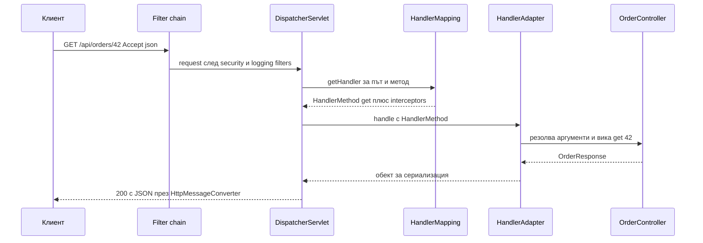
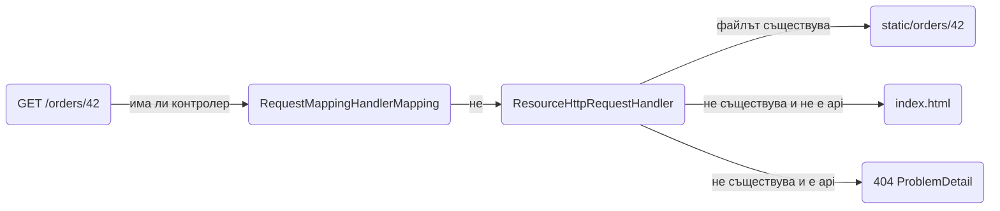

# Routing

Routing е отговорът на въпроса "кой метод обработва този URL с този HTTP метод, тези headers и този `Content-Type`". В Spring MVC това решение взема `DispatcherServlet` с помощта на `HandlerMapping`, а ти го описваш с анотации върху контролерите. Този документ показва как се обработва request-ът отвътре, всички начини да извлечеш данни от URL, query string, headers и cookies, как се прави content negotiation и API versioning, какво стана с trailing slash в Boot 3, как се сервират статични файлове и SPA, и как се строят `Location` URL-и. Накрая има функционална алтернатива с `RouterFunction` и начини да видиш и отстраниш конфликти между routes.

| Какво | Кога | Инструмент |
|---|---|---|
| Път и HTTP метод | Всеки endpoint | `@GetMapping`, `@PostMapping`, `@RequestMapping` |
| Части от URL | `/orders/42` | `@PathVariable` |
| Query string | Филтри, pagination | `@RequestParam`, record binding |
| Headers и cookies | Tenant, език, tracing | `@RequestHeader`, `@CookieValue` |
| Избор по формат | JSON срещу CSV, версии | `produces`, `consumes`, `Accept` |
| Версии на API | Публично API | URL prefix `/api/v1` |
| Статични файлове и SPA | Frontend в същия jar | `static/`, resource handler с fallback |
| Преглед на всички routes | Debug, документация | Actuator `mappings` |

## 1. Зависимости и настройка

```xml pom.xml
<dependency>
    <groupId>org.springframework.boot</groupId>
    <artifactId>spring-boot-starter-web</artifactId>
</dependency>
<dependency>
    <groupId>org.springframework.boot</groupId>
    <artifactId>spring-boot-starter-actuator</artifactId>
</dependency>
```

```yaml src/main/resources/application.yml
server:
  servlet:
    context-path: /
spring:
  mvc:
    servlet:
      path: /
    problemdetails:
      enabled: true
management:
  endpoints:
    web:
      exposure:
        include: health,info,mappings
```

`spring.mvc.problemdetails.enabled: true` кара грешките при routing (404, 405, 415, 400 от binding) да се връщат като `ProblemDetail` JSON, вместо като празни отговори. Виж [Грешки и ProblemDetail](Exception_Handling.md).

## 2. Как DispatcherServlet намира метода



Стъпките:

1. Tomcat подава request-а на filter chain (security, CORS, logging), после на `DispatcherServlet`. Виж [Middleware: Filters, Interceptors, AOP](Middleware.md).
2. `DispatcherServlet` пита всеки регистриран `HandlerMapping`. Основният е `RequestMappingHandlerMapping`, който при старт е сканирал всички `@RequestMapping` методи и ги е индексирал по път. Други са за статични ресурси и за функционални endpoints.
3. Mapping-ът връща `HandlerExecutionChain`: метода плюс interceptor-ите, които трябва да минат преди и след него.
4. `RequestMappingHandlerAdapter` резолва аргументите на метода (`@PathVariable`, `@RequestBody`, `Principal`), вика го и обработва резултата.
5. Връщаната стойност минава през `HttpMessageConverter` (Jackson за JSON) или през `ViewResolver` при view name, и се записва в response.

Условията за избор се оценяват в определен ред: път, HTTP метод, `params`, `headers`, `consumes`, `produces`. Най-специфичният mapping печели, затова `/api/orders/latest` се избира пред `/api/orders/{id}`, независимо от реда на декларация.

## 3. Минимален работещ пример

```java src/main/java/com/acme/shop/order/OrderController.java
package com.acme.shop.order;

import org.springframework.http.ResponseEntity;
import org.springframework.web.bind.annotation.*;
import java.net.URI;

@RestController
@RequestMapping("/api/orders")
class OrderController {

    private final OrderService orderService;

    OrderController(OrderService orderService) {
        this.orderService = orderService;
    }

    @GetMapping
    PageResponse<OrderSummary> list(@RequestParam(defaultValue = "0") int page,
                                    @RequestParam(defaultValue = "20") int size) {
        return orderService.list(page, size);
    }

    @GetMapping("/{id}")
    OrderResponse get(@PathVariable Long id) {
        return orderService.get(id);
    }

    @PostMapping
    ResponseEntity<OrderResponse> create(@RequestBody @Valid CreateOrderRequest request) {
        var created = orderService.create(request);
        return ResponseEntity.created(URI.create("/api/orders/" + created.id())).body(created);
    }

    @PutMapping("/{id}")
    OrderResponse replace(@PathVariable Long id, @RequestBody @Valid UpdateOrderRequest request) {
        return orderService.replace(id, request);
    }

    @PatchMapping("/{id}/status")
    OrderResponse changeStatus(@PathVariable Long id, @RequestBody @Valid ChangeStatusRequest request) {
        return orderService.changeStatus(id, request.status());
    }

    @DeleteMapping("/{id}")
    ResponseEntity<Void> delete(@PathVariable Long id) {
        orderService.delete(id);
        return ResponseEntity.noContent().build();
    }
}
```

```http
GET /api/orders/42 HTTP/1.1
Accept: application/json

HTTP/1.1 200 OK
Content-Type: application/json

{"id":42,"status":"PAID","total":129.90,"lines":[...]}
```

`@RequestMapping("/api/orders")` на класа е префикс за всички методи. `@GetMapping` е съкращение на `@RequestMapping(method = GET)`; същото важи за `@PostMapping`, `@PutMapping`, `@PatchMapping` и `@DeleteMapping`. Пълният `@RequestMapping` на метод се ползва само когато трябват няколко метода наведнъж: `@RequestMapping(value = "/ping", method = {GET, HEAD})`.

## 4. Извличане на данни от request-а

### PathVariable

```java src/main/java/com/acme/shop/order/OrderController.java
@GetMapping("/{id}")
OrderResponse get(@PathVariable Long id) { ... }

// Друго име в URL и в кода
@GetMapping("/{orderId}/lines/{lineId}")
OrderLineResponse line(@PathVariable("orderId") Long orderId, @PathVariable("lineId") Long lineId) { ... }

// Regex: само цифри, иначе 404 вместо 400
@GetMapping("/{id:\\d+}")
OrderResponse getNumeric(@PathVariable Long id) { ... }

// Коегзистира с горния, защото regex-ът ги разграничава
@GetMapping("/{number:[A-Z]{2}-\\d{6}}")
OrderResponse getByNumber(@PathVariable String number) { ... }

// Всички променливи наведнъж
@GetMapping("/{orderId}/lines/{lineId}")
OrderLineResponse line(@PathVariable Map<String, String> vars) { ... }

// Catch-all за остатъка от пътя
@GetMapping("/files/{*path}")
ResponseEntity<Resource> file(@PathVariable String path) { ... }
```

Конверсията от `String` към `Long`, `UUID`, `LocalDate`, enum се прави от `ConversionService`. При невалидна стойност (`/api/orders/abc` за `Long`) се връща 400 с `MethodArgumentTypeMismatchException`. За собствени типове (например `OrderId` value object) се регистрира `Converter<String, OrderId>`, виж [Controllers](Controllers.md).

### RequestParam

```java src/main/java/com/acme/shop/order/OrderController.java
@GetMapping
List<OrderSummary> search(
        @RequestParam String status,                                       // задължителен, 400 ако липсва
        @RequestParam(required = false) String customerEmail,              // null ако липсва
        @RequestParam(defaultValue = "20") int size,                       // default, implicitно required = false
        @RequestParam Optional<LocalDate> from,                            // Optional.empty ако липсва
        @RequestParam(name = "tag") List<String> tags,                     // ?tag=a&tag=b или ?tag=a,b
        @RequestParam Map<String, String> all,                             // всички параметри, първа стойност
        @RequestParam MultiValueMap<String, String> allMulti) { ... }      // всички параметри, всички стойности
```

Правила:

- `required = true` е default. Липсващ задължителен параметър дава 400 `MissingServletRequestParameterException`.
- Празна стойност (`?status=`) не е липса: `status` е `""`. Ако искаш празното да е `null`, виж `@InitBinder` с `StringTrimmerEditor` в [Controllers](Controllers.md).
- `List<String>` приема и повторен параметър, и запетая-разделен низ.
- `LocalDate` се парсва по ISO (`2025-03-01`). За друг формат слагаш `@DateTimeFormat(pattern = "dd.MM.yyyy")` на параметъра или глобално `spring.mvc.format.date: dd.MM.yyyy`.

### Query параметри в record

За филтри с повече от три параметъра, записът на всеки като `@RequestParam` става нечетим. Spring свързва непримитивен параметър без анотация като `@ModelAttribute`, което за record означава constructor binding от query параметри:

```java src/main/java/com/acme/shop/order/dto/OrderFilter.java
package com.acme.shop.order.dto;

public record OrderFilter(
        OrderStatus status,
        String customerEmail,
        @DateTimeFormat(iso = DateTimeFormat.ISO.DATE) LocalDate from,
        @DateTimeFormat(iso = DateTimeFormat.ISO.DATE) LocalDate to,
        @BindParam("min_total") BigDecimal minTotal) {

    public OrderFilter {
        if (from != null && to != null && from.isAfter(to)) {
            throw new IllegalArgumentException("from е след to");
        }
    }
}
```

```java src/main/java/com/acme/shop/order/OrderController.java
@GetMapping
PageResponse<OrderSummary> list(@Valid OrderFilter filter, Pageable pageable) {
    return orderService.list(filter, pageable);
}
```

```http
GET /api/orders?status=PAID&from=2025-01-01&min_total=100&page=0&size=20&sort=createdAt,desc
```

`@BindParam` (Spring Framework 6.1+) позволява различно име в URL и в record-а. Валидацията с `@Valid` работи и тук, но грешките са `MethodArgumentNotValidException` с `BindingResult`, както при `@RequestBody`. `Pageable` се резолва от `page`, `size`, `sort`, виж [Pagination](Pagination.md).

### RequestHeader, CookieValue, MatrixVariable

```java src/main/java/com/acme/shop/order/OrderController.java
@GetMapping("/{id}")
OrderResponse get(@PathVariable Long id,
                  @RequestHeader("X-Tenant-Id") String tenantId,
                  @RequestHeader(value = "Accept-Language", defaultValue = "bg") String language,
                  @RequestHeader HttpHeaders allHeaders,
                  @CookieValue(value = "cart_id", required = false) String cartId) { ... }
```

`@RequestHeader HttpHeaders` дава всички headers. `@RequestHeader Map<String, String>` е същото, но без multi-value.

`@MatrixVariable` чете `;key=value` сегменти (`/api/products;category=books;sort=price/42`). Изключено е по подразбиране, защото `UrlPathHelper` маха `;`-съдържанието. Включва се с `configurePathMatch` и `UrlPathHelper.setRemoveSemicolonContent(false)`. Почти никой не го ползва; query параметрите вършат същата работа без изненади за proxy сървърите.

### Условия params и headers

```java src/main/java/com/acme/shop/order/OrderController.java
// Само ако има ?export=csv
@GetMapping(params = "export=csv", produces = "text/csv")
ResponseEntity<Resource> exportCsv(OrderFilter filter) { ... }

// Само ако параметърът archived липсва
@GetMapping(params = "!archived")
List<OrderSummary> active() { ... }

// Само при header
@GetMapping(headers = "X-Admin=true")
List<OrderSummary> adminList() { ... }
```

Mapping с `params` е по-специфичен от същия без `params`, затова `exportCsv` печели пред `list` при `?export=csv`. Използвай пестеливо, защото прави списъка с routes труден за четене.

## 5. Content negotiation

### consumes и produces

```java src/main/java/com/acme/shop/order/OrderController.java
@PostMapping(consumes = MediaType.APPLICATION_JSON_VALUE, produces = MediaType.APPLICATION_JSON_VALUE)
ResponseEntity<OrderResponse> create(@RequestBody @Valid CreateOrderRequest request) { ... }

@PostMapping(consumes = MediaType.MULTIPART_FORM_DATA_VALUE)
ResponseEntity<Void> importOrders(@RequestPart MultipartFile file) { ... }

@GetMapping(value = "/{id}", produces = MediaType.APPLICATION_JSON_VALUE)
OrderResponse getJson(@PathVariable Long id) { ... }

@GetMapping(value = "/{id}", produces = MediaType.APPLICATION_PDF_VALUE)
ResponseEntity<Resource> getPdf(@PathVariable Long id) { ... }
```

| Условие | Сравнява с | При несъответствие |
|---|---|---|
| `consumes` | `Content-Type` на request-а | 415 Unsupported Media Type |
| `produces` | `Accept` на request-а | 406 Not Acceptable |

Двата `GET /{id}` метода коегзистират, защото `produces` ги разграничава: `Accept: application/pdf` отива в `getPdf`, всичко друго в `getJson`. Без `Accept` header (или `*/*`) се избира първият по ред на `produces`.

На `@RestController` без `produces` Spring избира конвертор според `Accept` и наличните `HttpMessageConverter`. С `spring-boot-starter-web` е само JSON (Jackson). За XML добавяш `jackson-dataformat-xml` и `Accept: application/xml` започва да работи без промяна в кода.

### Негоциране през параметър

Ако клиентът не може да задава `Accept` (линк в браузър):

```yaml src/main/resources/application.yml
spring:
  mvc:
    contentnegotiation:
      favor-parameter: true
      parameter-name: format
      media-types:
        csv: text/csv
```

`GET /api/orders?format=csv` се третира като `Accept: text/csv`.

## 6. Trailing slash и path matching

### Trailing slash в Boot 3

До Spring Framework 5 `GET /api/orders/` съвпадаше с `@GetMapping("/api/orders")`. От Spring Framework 6 (Boot 3) това е изключено: `/api/orders/` връща 404. Решението не е да върнеш старото поведение (методът е deprecated), а едно от:

1. Да приемеш, че URL-ите са точни, и да поправиш клиентите. Това е правилният вариант за ново API.
2. За наследени клиенти: filter или `UrlHandlerFilter` (Spring Framework 6.2), който пренасочва или пренаписва:

```java src/main/java/com/acme/shop/common/config/WebConfig.java
@Bean
UrlHandlerFilter urlHandlerFilter() {
    return UrlHandlerFilter
            .trailingSlashHandler("/api/**").redirect(HttpStatus.PERMANENT_REDIRECT)
            .build();
}
```

Редиректът е по-добър от rewrite, защото клиентите виждат каноничния URL и го кешират.

### PathPatternParser

От Boot 2.6 стратегията по подразбиране е `path_pattern_parser` (преди беше `ant_path_matcher`). Разликите, които имат значение:

| Шаблон | Значение |
|---|---|
| `/orders/{id}` | Един сегмент |
| `/orders/{id:\\d+}` | Сегмент с regex |
| `/files/{*path}` | Всичко до края, включително `/`, в променлива `path` |
| `/files/**` | Всичко до края, без променлива, само в края на шаблона |
| `/orders/*` | Един сегмент, без да го свързваш |
| `/orders/*/lines` | Един произволен сегмент по средата |

`**` по средата на шаблона (`/a/**/b`) вече е невалиден. Ако имаш такъв, стартът спира с `PatternParseException`. Старото поведение се връща с `spring.mvc.pathmatch.matching-strategy: ant_path_matcher`, но PathPatternParser е по-бърз и единственият, който WebFlux поддържа, затова не го прави.

## 7. API versioning

### Стратегии

| Стратегия | Пример | Плюсове | Минуси |
|---|---|---|---|
| URL prefix | `/api/v1/orders` | Видимо в логове, кешируемо, лесно за gateway и документация | "Чупи" REST пуризма, дублира routes |
| Header | `X-Api-Version: 2` | Чист URL | Невидимо в браузър и логове, cache ключът трябва да включва header |
| Media type | `Accept: application/vnd.acme.v2+json` | Най-REST-ски, версия на представянето | Най-труден за тестване с curl и за документиране |
| Query параметър | `?version=2` | Лесно | Смесва се с филтри, лесно се забравя |

Препоръка: URL prefix с major версия. Всичко останало създава повече объркване, отколкото стойност, а major версия се сменя рядко (две или три пъти в живота на един сървис). Minor промени са backward compatible и не искат нова версия: добавяш полета, не махаш и не преименуваш.

### URL prefix

```java src/main/java/com/acme/shop/order/
@RestController
@RequestMapping("/api/v1/orders")
class OrderControllerV1 { ... }

@RestController
@RequestMapping("/api/v2/orders")
class OrderControllerV2 { ... }
```

Общата логика остава в един `OrderService`; версиите се различават само в DTO и mapping. За да не дублираш целия контролер при една променена операция, v2 контролерът наследява v1 и override-ва само нея (анотациите на класа не се наследяват, затова `@RequestMapping` се повтаря на наследника).

### Header и media type

```java src/main/java/com/acme/shop/order/OrderController.java
@GetMapping(value = "/{id}", headers = "X-Api-Version=2")
OrderResponseV2 getV2(@PathVariable Long id) { ... }

@GetMapping(value = "/{id}", produces = "application/vnd.acme.v2+json")
OrderResponseV2 getV2ByMediaType(@PathVariable Long id) { ... }
```

Spring Framework 7 добавя вградена поддръжка за versioning (`version` атрибут на mapping анотациите). В 6.2 се прави с горните условия.

## 8. Context path, servlet path и статични ресурси

### Префикси на ниво приложение

```yaml src/main/resources/application.yml
server:
  servlet:
    context-path: /shop        # цялото приложение, включително actuator
spring:
  mvc:
    servlet:
      path: /api               # само DispatcherServlet
```

| Настройка | Ефект | Кога |
|---|---|---|
| `server.servlet.context-path: /shop` | Всеки URL започва с `/shop`, включително `/shop/actuator/health` | Няколко приложения на един host без reverse proxy |
| `spring.mvc.servlet.path: /api` | Контролерите са под `/api`, actuator остава на `/actuator` | Искаш ясен split между API и останалото |

В повечето микросървиси и двете са `/`, а префиксите се правят от gateway или ingress. Ако все пак ползваш context path, никога не го hardcode-вай в контролерите: `@RequestMapping("/api/orders")` остава същото, а `/shop` се добавя отвън.

### Статични файлове

Spring Boot сервира всичко от `classpath:/static/`, `classpath:/public/`, `classpath:/resources/` и `classpath:/META-INF/resources/` на `/**` с най-нисък приоритет: първо се опитват контролерите, после ресурсите. `src/main/resources/static/css/app.css` е достъпен на `/css/app.css`.

```yaml src/main/resources/application.yml
spring:
  web:
    resources:
      static-locations: classpath:/static/,file:/var/shop/public/
      cache:
        cachecontrol:
          max-age: 1h
      chain:
        strategy:
          content:
            enabled: true
            paths: /**
```

`chain.strategy.content` добавя hash във файловото име (`app-d41d8cd9.css`) за cache busting; в Thymeleaf шаблони линковете през `@{/css/app.css}` се пренаписват автоматично.

### SPA fallback към index.html

Когато React или Vue frontend е в същия jar и ползва client-side routing, `GET /orders/42` в браузъра (refresh) трябва да върне `index.html`, а не 404, докато `GET /api/orders/42` трябва да стигне до контролера.

```java src/main/java/com/acme/shop/common/web/SpaConfig.java
package com.acme.shop.common.web;

import org.springframework.context.annotation.Configuration;
import org.springframework.core.io.ClassPathResource;
import org.springframework.core.io.Resource;
import org.springframework.web.servlet.config.annotation.ResourceHandlerRegistry;
import org.springframework.web.servlet.config.annotation.WebMvcConfigurer;
import org.springframework.web.servlet.resource.PathResourceResolver;

@Configuration
public class SpaConfig implements WebMvcConfigurer {

    @Override
    public void addResourceHandlers(ResourceHandlerRegistry registry) {
        registry.addResourceHandler("/**")
                .addResourceLocations("classpath:/static/")
                .resourceChain(true)
                .addResolver(new PathResourceResolver() {
                    @Override
                    protected Resource getResource(String resourcePath, Resource location) throws java.io.IOException {
                        var requested = location.createRelative(resourcePath);
                        if (requested.exists() && requested.isReadable()) {
                            return requested;
                        }
                        // API пътищата не се пренасочват към index.html, за да получават 404 от контролерите
                        if (resourcePath.startsWith("api/") || resourcePath.startsWith("actuator/")) {
                            return null;
                        }
                        return new ClassPathResource("/static/index.html");
                    }
                });
    }
}
```



Redirect-и и forward-и в MVC контролер:

```java src/main/java/com/acme/shop/order/web/OrderPageController.java
package com.acme.shop.order.web;

@Controller
@RequestMapping("/orders")
class OrderPageController {

    @PostMapping
    String create(@Valid OrderForm form, BindingResult result, RedirectAttributes redirect) {
        if (result.hasErrors()) {
            return "orders/new";                       // forward към view, URL остава /orders
        }
        var id = orderService.create(form.toRequest()).id();
        redirect.addFlashAttribute("message", "Поръчката е създадена");
        return "redirect:/orders/" + id;               // 302 към GET /orders/{id}
    }

    @GetMapping("/legacy/{id}")
    String legacy(@PathVariable Long id) {
        return "forward:/orders/" + id;                // вътрешно, без нов request от браузъра
    }
}
```

В REST контролер redirect е `ResponseEntity.status(HttpStatus.FOUND).location(uri).build()`. Формите и flash атрибутите са описани в [Controllers](Controllers.md).

## 9. Функционални endpoints с RouterFunction

Алтернатива на анотациите, в която routes са код. Полезна за много малки сървиси, за динамично генерирани routes и за хора, идващи от WebFlux:

```java src/main/java/com/acme/shop/product/ProductRoutes.java
package com.acme.shop.product;

import org.springframework.context.annotation.Bean;
import org.springframework.context.annotation.Configuration;
import org.springframework.web.servlet.function.RouterFunction;
import org.springframework.web.servlet.function.ServerResponse;

import static org.springframework.web.servlet.function.RequestPredicates.accept;
import static org.springframework.web.servlet.function.RouterFunctions.route;
import static org.springframework.http.MediaType.APPLICATION_JSON;

@Configuration
public class ProductRoutes {

    @Bean
    RouterFunction<ServerResponse> productRouter(ProductHandler handler) {
        return route()
                .path("/api/products", b -> b
                        .GET("", accept(APPLICATION_JSON), handler::list)
                        .GET("/{id}", handler::get)
                        .POST("", handler::create)
                        .DELETE("/{id}", handler::delete))
                .build();
    }
}
```

```java src/main/java/com/acme/shop/product/ProductHandler.java
package com.acme.shop.product;

import org.springframework.stereotype.Component;
import org.springframework.web.servlet.function.ServerRequest;
import org.springframework.web.servlet.function.ServerResponse;
import java.net.URI;

@Component
class ProductHandler {

    private final ProductService productService;

    ProductHandler(ProductService productService) {
        this.productService = productService;
    }

    ServerResponse list(ServerRequest request) {
        var category = request.param("category").orElse(null);
        return ServerResponse.ok().body(productService.list(category));
    }

    ServerResponse get(ServerRequest request) {
        var id = Long.parseLong(request.pathVariable("id"));
        return ServerResponse.ok().body(productService.get(id));
    }

    ServerResponse create(ServerRequest request) throws Exception {
        var body = request.body(CreateProductRequest.class);
        var created = productService.create(body);
        return ServerResponse.created(URI.create("/api/products/" + created.id())).body(created);
    }

    ServerResponse delete(ServerRequest request) {
        productService.delete(Long.parseLong(request.pathVariable("id")));
        return ServerResponse.noContent().build();
    }
}
```

Разлики спрямо анотации: няма автоматична валидация с `@Valid` (викаш `Validator` ръчно), няма `@ExceptionHandler` на ниво handler (ползваш `.onError()` или глобалния `@RestControllerAdvice`, който работи и тук), а routes са явно подредени: първото съвпадение печели. Двата стила коегзистират в едно приложение, но смесването в един модул е объркващо; избери един.

## 10. Return типове, преглед на routes и конфликти

### Какво може да връща метод на RestController

| Return тип | Резултат |
|---|---|
| `OrderResponse` (POJO или record) | 200 с тяло през `HttpMessageConverter` |
| `List<T>`, `Map<K,V>` | 200 с JSON масив или обект |
| `ResponseEntity<T>` | Пълен контрол: статус, headers, тяло |
| `void` | 200 с празно тяло (или `@ResponseStatus` за друг код) |
| `String` (в `@RestController`) | Тялото е самият низ, `text/plain` |
| `String` (в `@Controller`) | Име на view |
| `ProblemDetail` | Статусът от `ProblemDetail`, `application/problem+json` |
| `Resource`, `StreamingResponseBody` | Файлове и streams |
| `CompletableFuture<T>`, `DeferredResult<T>` | Асинхронен отговор, нишката се освобождава |
| `SseEmitter`, `ResponseBodyEmitter` | Server-sent events |
| `HttpHeaders` | Само headers, без тяло |

Подробности за всеки в [Controllers](Controllers.md).

### Списък на всички routes

```http
GET /actuator/mappings
```

Отговорът съдържа за всеки `DispatcherServlet` всички handler методи с условията им (`patterns`, `methods`, `consumes`, `produces`, `params`, `headers`) и методa, който ги обслужва. Това е по-надеждно от търсене в кода, защото показва и routes от библиотеки (actuator, swagger, error page).

При старт в DEBUG ниво `RequestMappingHandlerMapping` логва броя на mapping-ите; при TRACE изписва всеки:

```yaml src/main/resources/application.yml
logging:
  level:
    org.springframework.web.servlet.mvc.method.annotation.RequestMappingHandlerMapping: TRACE
```

### Конфликти

Два вида грешки:

1. При старт, когато два метода имат идентични условия:

```
IllegalStateException: Ambiguous mapping. Cannot map 'orderControllerV2' method
OrderControllerV2#get(Long) to {GET [/api/orders/{id}]}: There is already 'orderController' bean method
OrderController#get(Long) mapped.
```

Решение: различни пътища, или `params`, `headers`, `produces` условия, които ги разграничават.

2. В runtime, когато два шаблона съвпадат с равна специфичност (`/{category}/{id}` и `/{id}/{detail}` за `/a/b`):

```
IllegalStateException: Ambiguous handler methods mapped for '/api/orders/a/b'
```

Връща се 500. Решение: regex в променливите (`{id:\\d+}`) или фиксиран сегмент, който ги различава. Правило при проектиране: статичните сегменти преди променливите (`/orders/latest` преди `/orders/{id}`) и не повече от една променлива на ниво, когато е възможно.

## 11. Строене на URL-и

### Location header за 201

```java src/main/java/com/acme/shop/order/OrderController.java
@PostMapping
ResponseEntity<OrderResponse> create(@RequestBody @Valid CreateOrderRequest request,
                                     UriComponentsBuilder uriBuilder) {
    var created = orderService.create(request);
    var location = uriBuilder.path("/api/orders/{id}").buildAndExpand(created.id()).toUri();
    return ResponseEntity.created(location).body(created);
}
```

`UriComponentsBuilder` като параметър на метода е предварително настроен със схема, host, порт и context path на текущия request. Това е по-добре от `URI.create("/api/orders/" + id)`, защото дава абсолютен URL и уважава context path.

`ServletUriComponentsBuilder` прави същото от статичен контекст, удобно в helper класове:

```java
var location = ServletUriComponentsBuilder.fromCurrentRequest()
        .path("/{id}")
        .buildAndExpand(created.id())
        .toUri();
```

`fromCurrentRequest()` взема пътя на текущия request (`/api/orders`) и добавя `/{id}`; `fromCurrentContextPath()` започва от корена.

### Зад reverse proxy

Абсолютните URL-и зад nginx или ingress ще съдържат вътрешния host и `http`, освен ако не кажеш на Spring да чете `X-Forwarded-*` headers:

```yaml src/main/resources/application.yml
server:
  forward-headers-strategy: framework
```

`framework` включва `ForwardedHeaderFilter`. `native` оставя Tomcat да го прави (`RemoteIpValve`), което е по-ограничено. Без тази настройка `Location: http://shop-7f9c:8080/api/orders/42` ще стигне до клиента.

### Encoding и query

```java
var uri = UriComponentsBuilder.fromUriString("https://api.acme.com/search")
        .queryParam("q", "кафе & чай")
        .queryParam("tags", List.of("a", "b"))
        .build()                 // encode по подразбиране
        .toUri();
// https://api.acme.com/search?q=%D0%BA%D0%B0%D1%84%D0%B5%20%26%20%D1%87%D0%B0%D0%B9&tags=a&tags=b
```

Същият builder се ползва в `RestClient` при извикване на други сървиси, виж [HTTP клиенти](HTTP_Clients.md).

## 12. WebFlux

Всички анотации от този документ (`@GetMapping`, `@PathVariable`, `@RequestParam`, `produces`, `consumes`) работят идентично в Spring WebFlux. Разликите са в return типовете (`Mono<T>`, `Flux<T>`), в това, че `HttpServletRequest` не съществува (има `ServerWebExchange`), и че функционалните endpoints са в пакет `org.springframework.web.reactive.function.server`. Този наръчник е за Spring MVC, защото с виртуални нишки (`spring.threads.virtual.enabled: true`) блокиращият модел дава сходна пропускливост при много по-прост код.

## 13. Капани

- `GET /api/orders/` връща 404 в Boot 3, а клиентите на старото API го викаха така. Или поправи клиентите, или `UrlHandlerFilter` с permanent redirect; не връщай `setUseTrailingSlashMatch`.
- `@RequestMapping` на класа не се наследява от подкласове. При v2 контролер, наследяващ v1, повтори анотацията на класа, иначе методите се mapping-ват на корена.
- `/orders/{id}` и `/orders/{number}` без regex са идентични за Spring и стартът спира. Regex в променливите (`\\d+` и `[A-Z]{2}-\\d{6}`) ги разделя.
- `@RequestParam List<String> tags` с `?tags=` дава списък с един празен низ, не празен списък. Филтрирай празните или ползвай `required = false` и проверка за `null`.
- `produces` на `@PostMapping` без `Accept` в request-а работи, но клиент с `Accept: text/html` (стар браузър, някои прокси) получава 406. Ако endpoint-ът се вика от форми, не слагай `produces`.
- Контролер, който хваща `/**` за SPA fallback, "изяжда" 404-ките на API-то и връща `index.html` със статус 200 на `GET /api/orders/999`. Fallback-ът трябва да изключва `/api/**` и `/actuator/**`.
- `UriComponentsBuilder` зад reverse proxy без `server.forward-headers-strategy` генерира `Location` с вътрешен host. Задай `framework` още в първия deploy.
- `@PathVariable` с `Optional<Long>` на задължителен сегмент няма смисъл; ако сегментът е незадължителен, направи два mapping-а: `@GetMapping({"", "/{id}"})`.
- Versioning чрез header, при който cache (CDN, nginx) не включва header-а в ключа, връща v1 отговор на v2 клиент. Или URL prefix, или `Vary: X-Api-Version`.
- `spring.mvc.servlet.path: /api` премества и error page и всичко друго на `DispatcherServlet`, а static resources остават на `/api/**`. Проверявай с `/actuator/mappings` след смяна.
- Два `HandlerMapping` стила (анотации и `RouterFunction`) за един и същ път: функционалният се оценява по реда на bean регистрация и може да "засенчи" анотирания без грешка при старт. Не дублирай пътища.

## 14. Чеклист

- [ ] Всеки контролер има `@RequestMapping` на класа с префикс `/api/v1/...`
- [ ] Методите ползват `@GetMapping`, `@PostMapping`, `@PutMapping`, `@PatchMapping`, `@DeleteMapping`, а не общия `@RequestMapping`
- [ ] Числовите path variables имат regex `{id:\\d+}` там, където съжителстват с текстови
- [ ] Филтри с повече от три параметъра са record с `@Valid`, не списък от `@RequestParam`
- [ ] `spring.mvc.problemdetails.enabled: true`, за да са 404, 405, 415 в `ProblemDetail` формат
- [ ] Trailing slash политиката е решена: точни URL-и или `UrlHandlerFilter` с redirect
- [ ] `server.forward-headers-strategy: framework` е зададено за deploy зад proxy
- [ ] `Location` header при 201 се строи с `UriComponentsBuilder`, не с конкатенация
- [ ] SPA fallback изключва `/api/**` и `/actuator/**`
- [ ] Статичните ресурси имат cache control и content hash при frontend в jar-а
- [ ] `/actuator/mappings` е прегледан след всяко добавяне на контролер за дубликати
- [ ] Няма `**` по средата на шаблон и не е включен `ant_path_matcher`

## 15. Свързани документи

- [Controllers](Controllers.md): какво се случва след като route-ът е избран: binding, `ResponseEntity`, статуси, файлове, async.
- [Middleware: Filters, Interceptors, AOP](Middleware.md): filter chain преди `DispatcherServlet`, interceptors около handler-а, CORS.
- [Грешки и ProblemDetail](Exception_Handling.md): как 404, 405, 415 и binding грешки стават `ProblemDetail`.
- [Валидации](Validation.md): `@Valid` на query records и body.
- [Pagination](Pagination.md): `Pageable` от query параметри и как се връща страница.
- [API документация](API_Docs.md): springdoc чете същите mapping анотации и генерира OpenAPI.
- [HTTP клиенти](HTTP_Clients.md): `UriComponentsBuilder` от страната на клиента с `RestClient`.
- [Spring MVC reference](https://docs.spring.io/spring-framework/reference/web/webmvc.html)
