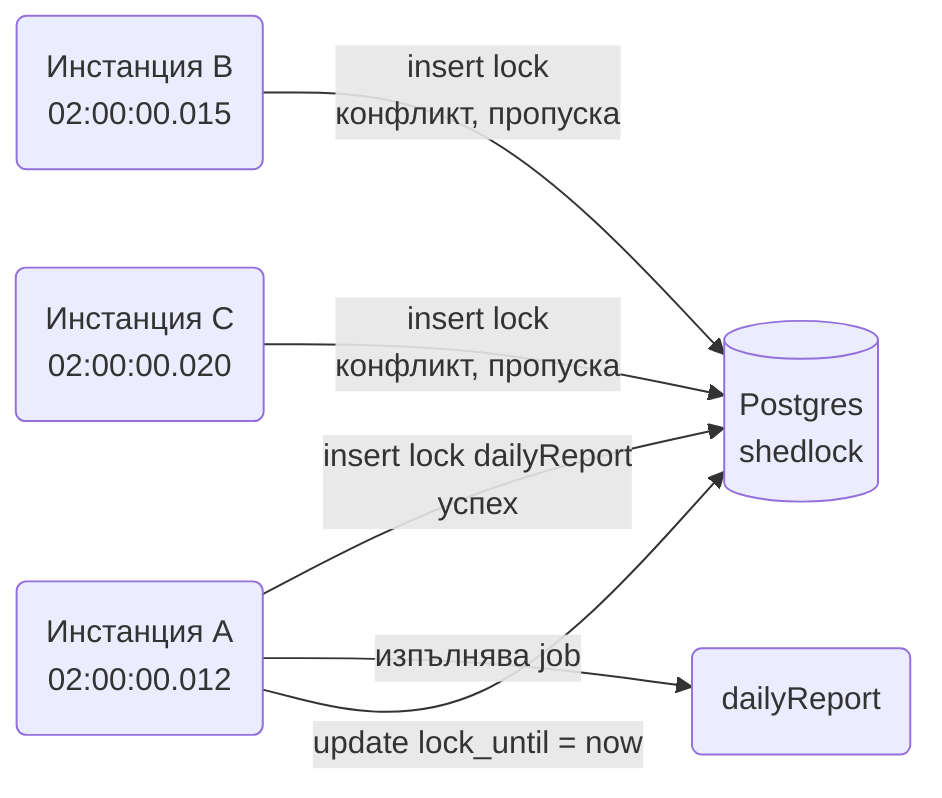
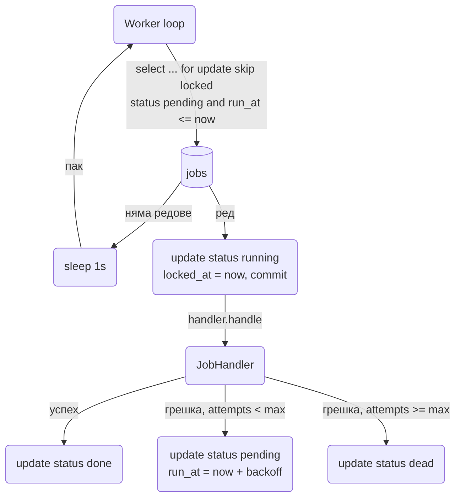

# Cron, @Async и опашки

Всеки сървис рано или късно трябва да прави нещо извън HTTP заявка: нощен отчет в 02:00, изчистване на изтекли token-и на всеки час, пращане на имейл без да бави отговора, обработка на качен файл, който отнема минути. Spring дава `@Scheduled` за cron и интервали, `@Async` за "пусни го в друга нишка" и `TaskExecutor` bean-ове, с които контролираш колко нишки и колко опашка позволяваш. Това, което Spring не дава наготово, е durability: ако процесът умре по средата на async задача, тя изчезва, а `@Scheduled` на три инстанции се изпълнява три пъти. Този документ покрива scheduling, async, retry, ShedLock за няколко инстанции, Quartz и JobRunr, и пълна имплементация на durable job queue върху Postgres с `SKIP LOCKED`.

| Какво | Кога | Инструмент |
|---|---|---|
| Периодична задача в един процес | Cleanup, cache refresh, relay | `@Scheduled` |
| Периодична задача на няколко инстанции | Production с 2+ pod-а | `@Scheduled` + ShedLock |
| Динамични, персистентни job-ове с cluster | Планиране от UI, много различни графици | Quartz |
| Бърза работа извън заявката, загуба е приемлива | Статистика, cache warm-up | `@Async` |
| Работа, която не трябва да се губи | Имейл, фактура, export, външно API | Job queue в Postgres или JobRunr |
| Повторение при временна грешка | HTTP към външна система, deadlock | Spring Retry |
| Обработка на милиони редове с restart | Миграция на данни, нощен import | Spring Batch |

## 1. Зависимости и настройка

`@Scheduled` и `@Async` са в `spring-context`, идват с всеки starter. Останалите са по избор:

```xml
<!-- ShedLock, секция 4 -->
<dependency>
    <groupId>net.javacrumbs.shedlock</groupId>
    <artifactId>shedlock-spring</artifactId>
    <version>6.3.0</version> <!-- виж последната версия в Maven Central -->
</dependency>
<dependency>
    <groupId>net.javacrumbs.shedlock</groupId>
    <artifactId>shedlock-provider-jdbc-template</artifactId>
    <version>6.3.0</version>
</dependency>

<!-- Quartz, секция 5 -->
<dependency>
    <groupId>org.springframework.boot</groupId>
    <artifactId>spring-boot-starter-quartz</artifactId>
</dependency>

<!-- Spring Retry, секция 7 -->
<dependency>
    <groupId>org.springframework.retry</groupId>
    <artifactId>spring-retry</artifactId>
    <version>2.0.11</version> <!-- виж последната версия в Maven Central -->
</dependency>
<dependency>
    <groupId>org.springframework.boot</groupId>
    <artifactId>spring-boot-starter-aop</artifactId>
</dependency>

<!-- JobRunr, секция 9 -->
<dependency>
    <groupId>org.jobrunr</groupId>
    <artifactId>jobrunr-spring-boot-3-starter</artifactId>
    <version>7.5.0</version> <!-- виж последната версия в Maven Central -->
</dependency>
```

```yaml
spring:
  task:
    scheduling:
      thread-name-prefix: "sched-"
      pool:
        size: 4
      shutdown:
        await-termination: true
        await-termination-period: 30s
    execution:
      thread-name-prefix: "async-"
      pool:
        core-size: 4
        max-size: 16
        queue-capacity: 500
      shutdown:
        await-termination: true
        await-termination-period: 30s
  lifecycle:
    timeout-per-shutdown-phase: 45s
server:
  shutdown: graceful
```

## 2. Минимален работещ пример

```java
package com.example.shop.config;

import org.springframework.context.annotation.Configuration;
import org.springframework.scheduling.annotation.EnableAsync;
import org.springframework.scheduling.annotation.EnableScheduling;

@Configuration
@EnableScheduling
@EnableAsync
public class TaskConfig {
}
```

```java
package com.example.shop.maintenance;

import org.springframework.scheduling.annotation.Scheduled;
import org.springframework.stereotype.Component;

@Component
public class TokenCleanupJob {

    private final RefreshTokenRepository tokens;

    public TokenCleanupJob(RefreshTokenRepository tokens) {
        this.tokens = tokens;
    }

    @Scheduled(cron = "0 15 * * * *", zone = "Europe/Sofia")
    public void deleteExpired() {
        int deleted = tokens.deleteAllByExpiresAtBefore(Instant.now());
        log.info("deleted {} expired refresh tokens", deleted);
    }
}
```

Spring при старт намира всички `@Scheduled` методи в bean-овете, регистрира ги в `TaskScheduler` и той ги изпълнява в своя pool. Методът трябва да е `void` и без параметри. Той се вика през proxy на bean-а, така че `@Transactional` върху него работи.

## 3. @Scheduled в детайли

### Cron формат

Spring използва 6 полета, за разлика от Unix cron с 5: `секунда минута час ден-от-месеца месец ден-от-седмицата`. Секундите са 0-59, месецът е 1-12 или `JAN-DEC`, денят от седмицата е 0-7 или `MON-SUN` (0 и 7 са неделя).

| Израз | Значение |
|---|---|
| `0 0 2 * * *` | всеки ден в 02:00:00 |
| `0 */15 * * * *` | на всеки 15 минути, на кръгла минута |
| `0 0 9-17 * * MON-FRI` | всеки час от 9 до 17 в работни дни |
| `0 30 6 1 * *` | първо число на месеца в 06:30 |
| `0 0 0 * * SUN` | неделя в полунощ |
| `0 0 8 L * *` | последен ден на месеца в 08:00 |
| `0 0 10 * * 1#1` | първи понеделник от месеца в 10:00 |
| `@daily` или `@midnight` | `0 0 0 * * *` |
| `@hourly` | `0 0 * * * *` |
| `@weekly` | `0 0 0 * * 0` |
| `@monthly` | `0 0 0 1 * *` |

Копиране на Unix cron израз с 5 полета ще хвърли `IllegalArgumentException` при старт. `zone` е задължително за всичко, което е "в 02:00 за хората": без него се ползва часовата зона на JVM, която в контейнер е UTC.

### fixedRate, fixedDelay, initialDelay

```java
// на всеки 30 секунди от началото на предишното изпълнение, независимо колко е траяло
@Scheduled(fixedRate = 30, timeUnit = TimeUnit.SECONDS)
public void pollExternalStatus() { ... }

// 30 секунди след края на предишното, изпълненията никога не се застъпват
@Scheduled(fixedDelay = 30, timeUnit = TimeUnit.SECONDS, initialDelay = 10)
public void relayOutbox() { ... }

// от конфигурация, с Duration формат
@Scheduled(fixedDelayString = "${app.outbox.relay-interval:PT5S}")
public void relayOutboxConfigurable() { ... }
```

`fixedRate` при бавен метод и един scheduler thread се натрупва: ако методът трае 45 секунди при rate 30, следващото изпълнение тръгва веднага след края. За всичко, което чете от база или вика външна система, ползвай `fixedDelay`.

### Pool size

`spring.task.scheduling.pool.size` по подразбиране е 1. Всички `@Scheduled` методи споделят една нишка. Ако нощният отчет трае 20 минути, cleanup-ът на всеки час ще чака. Увеличи pool-а до броя задачи, които могат да се застъпят, обикновено 2 до 8. Няма смисъл от 50, защото задачите са дълги и малко.

С `spring.threads.virtual.enabled=true` Boot сменя `ThreadPoolTaskScheduler` със `SimpleAsyncTaskScheduler` върху виртуални нишки: всяко изпълнение си има нишка, няма pool size и няма чакане. За IO задачи това е най-простата настройка.

### Грешки в scheduled методи

Изключение в `@Scheduled` метод не спира следващите изпълнения. Spring го хваща, подава го на `ErrorHandler` на scheduler-а (по подразбиране логва на ERROR) и планира следващото. Проблемът е, че никой не гледа логовете. Сложи метрика:

```java
package com.example.shop.config;

import io.micrometer.core.instrument.MeterRegistry;
import org.springframework.boot.task.ThreadPoolTaskSchedulerCustomizer;

@Configuration
public class SchedulerErrorConfig {

    @Bean
    ThreadPoolTaskSchedulerCustomizer schedulerErrorHandler(MeterRegistry meters) {
        return scheduler -> scheduler.setErrorHandler(ex -> {
            log.error("scheduled task failed", ex);
            meters.counter("scheduled.task.errors").increment();
        });
    }
}
```

За да знаеш кой job е паднал, по-добре всеки job сам да се увива в `Timer.Sample` с tag-ове `job` и `result` (`ok` или `error`) и да логва грешката с името си. При повече от 3 до 4 job-а изнеси това в един `JobRunner.run("dailyReport", () -> ...)` helper (секция 8 показва същия модел в `JobWorker.run`). Alerts върху `job.duration{result="error"}` и върху "няма изпълнение от X време" са в [Observability](Observability.md).

## 4. Няколко инстанции и ShedLock

Проблемът: `@Scheduled` работи на всяка JVM. При три pod-а нощният имейл "Вашият месечен отчет" тръгва три пъти. Три варианта:

| Вариант | Как | Плюс | Минус |
|---|---|---|---|
| ShedLock | lock ред в базата, който само една инстанция взема | 2 анотации, без инфраструктура | Lock-ът е по време, не по heartbeat |
| Отделна "scheduler" инстанция | `app.scheduling.enabled=true` само на един pod | Просто | Single point of failure, отделен deployment |
| Leader election | Kubernetes lease или Spring Integration `LockRegistryLeaderInitiator` | Истински failover | Повече код и инфраструктура |

ShedLock е правилният default за 90% от случаите.



### Таблица и конфигурация

```sql
create table shedlock (
    name       varchar(64)  not null primary key,
    lock_until timestamp    not null,
    locked_at  timestamp    not null,
    locked_by  varchar(255) not null
);
```

```java
package com.example.shop.config;

import net.javacrumbs.shedlock.core.LockProvider;
import net.javacrumbs.shedlock.provider.jdbctemplate.JdbcTemplateLockProvider;
import net.javacrumbs.shedlock.spring.annotation.EnableSchedulerLock;
import org.springframework.jdbc.core.JdbcTemplate;

import javax.sql.DataSource;

@Configuration
@EnableScheduling
@EnableSchedulerLock(defaultLockAtMostFor = "10m")
public class SchedulingConfig {

    @Bean
    LockProvider lockProvider(DataSource dataSource) {
        return new JdbcTemplateLockProvider(
            JdbcTemplateLockProvider.Configuration.builder()
                .withJdbcTemplate(new JdbcTemplate(dataSource))
                // времето идва от базата, за да не зависим от часовниците на pod-овете
                .usingDbTime()
                .build());
    }
}
```

```java
import net.javacrumbs.shedlock.spring.annotation.SchedulerLock;

@Scheduled(cron = "0 0 2 * * *", zone = "Europe/Sofia")
@SchedulerLock(name = "dailyReport", lockAtMostFor = "30m", lockAtLeastFor = "1m")
public void dailyReport() {
    reportService.generateDaily(LocalDate.now(ZONE).minusDays(1));
}
```

Как работи: при изпълнение ShedLock прави `INSERT` в `shedlock` с `name`. Ако редът съществува и `lock_until` е в бъдещето, някой друг го държи и методът не се изпълнява. Ако е в миналото, прави `UPDATE ... WHERE lock_until <= now()`, което само една инстанция печели. След края на метода `lock_until` се сетва на `now()` или на `locked_at + lockAtLeastFor`, което е по-късно.

- `lockAtMostFor`: защита срещу умряла инстанция. Ако pod-ът умре по средата, lock-ът се освобождава след това време. Сложи го по-дълго от най-дългото нормално изпълнение, иначе втора инстанция ще стартира, докато първата още работи.
- `lockAtLeastFor`: защита срещу разминати часовници. Ако job-ът трае 50 ms, а pod B има часовник с 2 секунди напред, без `lockAtLeastFor` B ще го изпълни втори път. Една минута е добър default за cron, който се изпълнява на интервал от часове.

ShedLock не прави retry и не следи дали job-ът е успял. Той гарантира само "най-много една инстанция едновременно".

## 5. Quartz

Quartz е нужен, когато графиците са динамични (потребителят от UI казва "всеки вторник в 9"), трябва да оцелеят рестарт (persistent job store) и трябва cluster с failover. За статичен cron в кода ShedLock е по-прост.

```yaml
spring:
  quartz:
    job-store-type: jdbc
    jdbc:
      initialize-schema: never  # таблиците са в миграция, виж Migrations.md
    properties:
      org.quartz.scheduler.instanceId: AUTO
      org.quartz.jobStore.isClustered: true
      org.quartz.jobStore.clusterCheckinInterval: 10000
      org.quartz.jobStore.driverDelegateClass: org.quartz.impl.jdbcjobstore.PostgreSQLDelegate
      org.quartz.threadPool.threadCount: 5
```

Схемата на таблиците (`qrtz_*`) е в jar-а на Quartz под `org/quartz/impl/jdbcjobstore/tables_postgres.sql`. Копирай я в Flyway миграция.

```java
package com.example.shop.reports;

import org.quartz.JobExecutionContext;
import org.springframework.scheduling.quartz.QuartzJobBean;

public class CustomerReportJob extends QuartzJobBean {

    private final ReportService reports;

    // Boot конфигурира SpringBeanJobFactory, затова constructor injection работи
    public CustomerReportJob(ReportService reports) {
        this.reports = reports;
    }

    @Override
    protected void executeInternal(JobExecutionContext context) {
        UUID customerId = UUID.fromString(context.getMergedJobDataMap().getString("customerId"));
        reports.generateFor(customerId);
    }
}
```

Динамично планиране от service с инжектиран `Scheduler`:

```java
import org.quartz.*;

public void schedule(UUID customerId, String quartzCron) throws SchedulerException {
    JobDetail job = JobBuilder.newJob(CustomerReportJob.class)
        .withIdentity("report-" + customerId, "reports")
        .usingJobData("customerId", customerId.toString())
        .storeDurably()
        .build();
    Trigger trigger = TriggerBuilder.newTrigger()
        .withIdentity("report-trigger-" + customerId, "reports")
        .forJob(job)
        .withSchedule(CronScheduleBuilder.cronSchedule(quartzCron)
            .inTimeZone(TimeZone.getTimeZone("Europe/Sofia"))
            .withMisfireHandlingInstructionFireAndProceed())
        .build();

    scheduler.addJob(job, true);
    if (scheduler.checkExists(trigger.getKey())) {
        scheduler.rescheduleJob(trigger.getKey(), trigger);
    } else {
        scheduler.scheduleJob(trigger);
    }
}
```

`scheduler.deleteJob(JobKey.jobKey("report-" + customerId, "reports"))` маха job-а и trigger-ите му.

Quartz cron е с 6 или 7 полета и изисква `?` в едно от "ден от месеца" и "ден от седмицата": `0 0 9 ? * TUE`. Не е същият парсер като на Spring.

В cluster режим всяка инстанция взема trigger-и от базата с row lock, така че един job се изпълнява на точно една инстанция. Инстанция, която не се е check-in-нала за `clusterCheckinInterval`, се счита за умряла и нейните job-ове се преразпределят.

## 6. @Async

### Executor bean-ове

Default `applicationTaskExecutor` се конфигурира от `spring.task.execution.*`. За различни по характер задачи направи отделни executor-и, за да не блокира pool-ът за имейли pool-а за PDF:

```java
package com.example.shop.config;

import org.springframework.scheduling.concurrent.ThreadPoolTaskExecutor;

import java.util.concurrent.ThreadPoolExecutor;

@Configuration
@EnableAsync
public class ExecutorConfig {

    @Bean("mailExecutor")
    ThreadPoolTaskExecutor mailExecutor(ContextPropagatingTaskDecorator decorator) {
        var ex = new ThreadPoolTaskExecutor();
        ex.setThreadNamePrefix("mail-");
        ex.setCorePoolSize(2);
        ex.setMaxPoolSize(4);
        ex.setQueueCapacity(1000);
        ex.setRejectedExecutionHandler(new ThreadPoolExecutor.CallerRunsPolicy());
        ex.setTaskDecorator(decorator);
        ex.setWaitForTasksToCompleteOnShutdown(true);
        ex.setAwaitTerminationSeconds(30);
        return ex;
    }

    // reportExecutor по същия модел: core 1, max 2, queue 50, AbortPolicy
}
```

Как работи `ThreadPoolTaskExecutor` (и `ThreadPoolExecutor` под него), което изненадва всички: при нова задача, ако нишките са под `corePoolSize`, създава нишка. Иначе слага в опашката. Нова нишка до `maxPoolSize` се създава само когато опашката е пълна. При `queueCapacity = 1000` и `core = 2` ще видиш трета нишка чак когато чакат 1000 задачи. Ако искаш "нишки първо", дръж опашката малка.

Rejection policy при пълна опашка и `maxPoolSize` нишки:

| Policy | Поведение | Кога |
|---|---|---|
| `AbortPolicy` (default) | хвърля `TaskRejectedException` към извикващия | когато е по-добре да откажеш, отколкото да забавиш |
| `CallerRunsPolicy` | извикващата нишка изпълнява задачата сама | естествен backpressure, HTTP заявката се забавя |
| `DiscardPolicy` | тихо изхвърля | почти никога |
| `DiscardOldestPolicy` | изхвърля най-старата от опашката | real-time данни, където старото е безполезно |

### TaskDecorator за MDC и SecurityContext

Новата нишка не знае нищо за заявката: MDC с `traceId` е празен, `SecurityContextHolder` е празен. `TaskDecorator` копира контекста при подаване и го възстановява при изпълнение:

```java
package com.example.shop.config;

import org.slf4j.MDC;
import org.springframework.core.task.TaskDecorator;
import org.springframework.security.core.context.SecurityContext;
import org.springframework.security.core.context.SecurityContextHolder;

import java.util.Map;

@Component
public class ContextPropagatingTaskDecorator implements TaskDecorator {

    @Override
    public Runnable decorate(Runnable task) {
        Map<String, String> mdc = MDC.getCopyOfContextMap();
        SecurityContext security = SecurityContextHolder.getContext();
        return () -> {
            if (mdc != null) MDC.setContextMap(mdc);
            SecurityContextHolder.setContext(security);
            try {
                task.run();
            } finally {
                MDC.clear();
                SecurityContextHolder.clearContext();
            }
        };
    }
}
```

С Micrometer Tracing trace контекстът се пренася автоматично, ако executor-ът е увит в `ContextExecutorService` или ползваш `TaskDecorator` от `micrometer-context-propagation`. Детайли в [Logging](Logging.md).

### Използване

```java
@Async("reportExecutor")
public CompletableFuture<Path> renderPdf(UUID invoiceId) {
    return CompletableFuture.completedFuture(pdfRenderer.render(invoices.findById(invoiceId).orElseThrow()));
}

@Async("mailExecutor")
public void sendReminder(UUID invoiceId) {
    mail.sendReminder(invoiceId);
}
```

Поддържани return типове: `void` и `CompletableFuture<T>`. Ако върнеш `CompletableFuture`, извикващият може да чака резултата или да комбинира няколко. Изключение в `void` метод отива в `AsyncUncaughtExceptionHandler` (виж [Events](Events.md) за пример), а в `CompletableFuture` метод отива във future-а като `completeExceptionally`.

Self-invocation: `this.sendReminder(id)` от друг метод в същия клас минава покрай proxy-то и се изпълнява синхронно. Същото за `@Transactional` и `@Retryable`. Решение: извикай през друг bean или инжектирай `ObjectProvider<InvoiceService>` и вземи proxy-то.

## 7. Spring Retry

За временни грешки: външно API върна 503, Postgres хвърли deadlock, DNS мигна. Retry с backoff решава повечето такива, без да ги показва на потребителя.

```java
@Configuration
@EnableRetry
public class RetryConfig {
}
```

```java
import org.springframework.retry.annotation.Backoff;
import org.springframework.retry.annotation.Recover;
import org.springframework.retry.annotation.Retryable;

@Service
public class PaymentGatewayClient {

    private final RestClient http;

    public PaymentGatewayClient(RestClient.Builder builder) {
        this.http = builder.baseUrl("https://pay.example.com").build();
    }

    @Retryable(
        retryFor = {HttpServerErrorException.class, ResourceAccessException.class},
        noRetryFor = {HttpClientErrorException.class},
        maxAttempts = 4,
        backoff = @Backoff(delay = 500, multiplier = 2.0, maxDelay = 5_000, random = true))
    public CaptureResult capture(UUID paymentId, long amountCents) {
        return http.post()
            .uri("/captures")
            .header("Idempotency-Key", paymentId.toString())
            .body(new CaptureRequest(paymentId, amountCents))
            .retrieve()
            .body(CaptureResult.class);
    }

    @Recover
    public CaptureResult recoverCapture(HttpServerErrorException ex, UUID paymentId, long amountCents) {
        throw new PaymentUnavailableException(paymentId, ex);
    }
}
```

`random = true` е jitter: при 100 едновременни грешки без jitter всичките 100 ще повторят в един и същи милисекунд. `@Recover` методът трябва да има същия return тип и сигнатура с изключението отпред.

Правилото за retry: операцията трябва да е идемпотентна. Capture без `Idempotency-Key` при retry след timeout може да вземе парите два пъти. 4xx не се повтаря никога, защото заявката е грешна. Повече за `RestClient` в [HTTP клиенти](HTTP_Clients.md).

`RetryTemplate` за програмно ползване, когато не искаш AOP:

```java
@Bean
RetryTemplate dbRetry() {
    return RetryTemplate.builder()
        .maxAttempts(3)
        .exponentialBackoff(200, 2.0, 2_000)
        .retryOn(DeadlockLoserDataAccessException.class)
        .build();
}
// използване: dbRetry.execute(ctx -> stockService.reserve(orderId));
```

Retry върху `@Transactional` метод трябва да е отвън (retry proxy-то обвива transaction proxy-то), за да се отвори нова транзакция при всеки опит. Ако `@Retryable` и `@Transactional` са на един метод, редът на advice-ите е по `@Order` и обикновено е наред, но по-ясно е retry-то да е в извикващия.

## 8. Durable job queue в Postgres

`@Async` губи задачата при рестарт. Broker е тежка инфраструктура за "прати 200 имейла на ден". Postgres таблица с `SKIP LOCKED` е златната среда: задачата се записва в същата транзакция като бизнес операцията, worker-ите я вземат състезателно, грешките се повтарят с backoff, а провалените отиват в dead letter статус.



### Таблица

```sql
create table jobs (
    id          uuid primary key,
    type        text        not null,
    payload     jsonb       not null,
    status      text        not null default 'pending',
    run_at      timestamptz not null default now(),
    attempts    int         not null default 0,
    max_attempts int        not null default 5,
    locked_at   timestamptz,
    last_error  text,
    created_at  timestamptz not null default now(),
    updated_at  timestamptz not null default now()
);

create index jobs_pending_idx on jobs (run_at) where status = 'pending';
create index jobs_running_idx on jobs (locked_at) where status = 'running';
```

Статусите: `pending` (чака), `running` (взет от worker), `done`, `dead` (изчерпани опити). `locked_at` служи за visibility timeout: `running` job с `locked_at` преди повече от X минути значи worker-ът е умрял.

### Handler и registry

```java
package com.example.shop.jobs;

public interface JobHandler<P> {
    String type();
    Class<P> payloadType();
    void handle(P payload);
}

@Component
public class SendInvoiceEmailHandler implements JobHandler<SendInvoiceEmailHandler.Payload> {

    public record Payload(UUID invoiceId) {}

    private final MailService mail;

    public SendInvoiceEmailHandler(MailService mail) {
        this.mail = mail;
    }

    @Override public String type() { return "send-invoice-email"; }
    @Override public Class<Payload> payloadType() { return Payload.class; }

    @Override
    public void handle(Payload payload) {
        mail.sendInvoice(payload.invoiceId());
    }
}
```

```java
package com.example.shop.jobs;

@Component
public class JobHandlerRegistry {

    private final Map<String, JobHandler<?>> byType;

    public JobHandlerRegistry(List<JobHandler<?>> handlers) {
        this.byType = handlers.stream().collect(Collectors.toMap(JobHandler::type, h -> h));
    }

    public JobHandler<?> require(String type) {
        return Optional.ofNullable(byType.get(type))
            .orElseThrow(() -> new IllegalArgumentException("no handler for job type " + type));
    }
}
```

### Enqueue

```java
package com.example.shop.jobs;

import org.springframework.jdbc.core.simple.JdbcClient;

@Component
public class JobQueue {

    private final JdbcClient jdbc;
    private final ObjectMapper json;

    public JobQueue(JdbcClient jdbc, ObjectMapper json) {
        this.jdbc = jdbc;
        this.json = json;
    }

    // вика се вътре в бизнес транзакцията, за да е атомарно с данните
    public UUID enqueue(String type, Object payload, Instant runAt) {
        UUID id = UUID.randomUUID();
        try {
            jdbc.sql("""
                    insert into jobs (id, type, payload, run_at)
                    values (:id, :type, :payload::jsonb, :runAt)
                    """)
                .param("id", id)
                .param("type", type)
                .param("payload", json.writeValueAsString(payload))
                .param("runAt", Timestamp.from(runAt))
                .update();
        } catch (JsonProcessingException ex) {
            throw new IllegalArgumentException("payload is not serializable", ex);
        }
        return id;
    }
}
```

```java
@Service
public class InvoiceService {

    @Transactional
    public Invoice issue(UUID orderId) {
        Invoice invoice = invoices.save(Invoice.forOrder(orders.findById(orderId).orElseThrow()));
        jobs.enqueue("send-invoice-email", new SendInvoiceEmailHandler.Payload(invoice.getId()), Instant.now());
        return invoice;
    }
}
```

Ако `issue` се rollback-не, job-ът също изчезва. Ако commit-не, job-ът е там, каквото и да стане с процеса.

### Worker

```java
package com.example.shop.jobs;

import org.springframework.transaction.support.TransactionTemplate;

@Component
public class JobWorker {

    private static final Duration VISIBILITY_TIMEOUT = Duration.ofMinutes(10);

    private final JdbcClient jdbc;
    private final TransactionTemplate tx;
    private final JobHandlerRegistry handlers;
    private final ObjectMapper json;
    private final MeterRegistry meters;

    public JobWorker(JdbcClient jdbc, TransactionTemplate tx, JobHandlerRegistry handlers,
                     ObjectMapper json, MeterRegistry meters) {
        this.jdbc = jdbc;
        this.tx = tx;
        this.handlers = handlers;
        this.json = json;
        this.meters = meters;
    }

    @Scheduled(fixedDelay = 1, timeUnit = TimeUnit.SECONDS)
    public void drain() {
        // обработваме до 50 на тик, за да не държим нишката на scheduler-а завинаги
        for (int i = 0; i < 50; i++) {
            Optional<JobRow> job = claimNext();
            if (job.isEmpty()) return;
            run(job.get());
        }
    }

    // кратка транзакция: взимаме ред и го маркираме running, после пускаме lock-а
    private Optional<JobRow> claimNext() {
        return tx.execute(status -> jdbc.sql("""
                select id, type, payload::text as payload, attempts, max_attempts
                from jobs
                where status = 'pending' and run_at <= now()
                order by run_at
                limit 1
                for update skip locked
                """)
            .query(JobRow.class)
            .optional()
            .map(row -> {
                jdbc.sql("update jobs set status = 'running', locked_at = now(), updated_at = now() where id = :id")
                    .param("id", row.id()).update();
                return row;
            }));
    }

    @SuppressWarnings("unchecked")
    private void run(JobRow job) {
        Timer.Sample sample = Timer.start(meters);
        try {
            JobHandler<Object> handler = (JobHandler<Object>) handlers.require(job.type());
            Object payload = json.readValue(job.payload(), handler.payloadType());
            handler.handle(payload);
            jdbc.sql("update jobs set status = 'done', updated_at = now() where id = :id")
                .param("id", job.id()).update();
            sample.stop(meters.timer("jobs.duration", "type", job.type(), "result", "ok"));
        } catch (Exception ex) {
            sample.stop(meters.timer("jobs.duration", "type", job.type(), "result", "error"));
            fail(job, ex);
        }
    }

    private void fail(JobRow job, Exception ex) {
        int attempts = job.attempts() + 1;
        String error = ex.getClass().getSimpleName() + ": " + ex.getMessage();
        if (attempts >= job.maxAttempts()) {
            jdbc.sql("update jobs set status = 'dead', attempts = :attempts, last_error = :error, updated_at = now() where id = :id")
                .param("attempts", attempts).param("error", error).param("id", job.id()).update();
            meters.counter("jobs.dead", "type", job.type()).increment();
            log.error("job {} of type {} is dead after {} attempts", job.id(), job.type(), attempts, ex);
            return;
        }
        // 2^attempts секунди с таван 10 минути, плюс jitter
        long backoffSeconds = Math.min(600, (long) Math.pow(2, attempts)) + ThreadLocalRandom.current().nextInt(5);
        jdbc.sql("""
                update jobs set status = 'pending', attempts = :attempts, last_error = :error,
                                run_at = now() + make_interval(secs => :backoff), updated_at = now()
                where id = :id
                """)
            .param("attempts", attempts).param("error", error)
            .param("backoff", backoffSeconds).param("id", job.id()).update();
        log.warn("job {} of type {} failed, attempt {}, retry in {}s", job.id(), job.type(), attempts, backoffSeconds);
    }

    // worker, който е умрял по средата, оставя running редове, връщаме ги в pending
    @Scheduled(fixedDelay = 1, timeUnit = TimeUnit.MINUTES)
    public void reclaimStuck() {
        int reclaimed = jdbc.sql("""
                update jobs set status = 'pending', locked_at = null, updated_at = now()
                where status = 'running' and locked_at < now() - make_interval(secs => :timeout)
                """)
            .param("timeout", VISIBILITY_TIMEOUT.toSeconds())
            .update();
        if (reclaimed > 0) log.warn("reclaimed {} stuck jobs", reclaimed);
    }

    record JobRow(UUID id, String type, String payload, int attempts, int maxAttempts) {}
}
```

Защо claim е в отделна къса транзакция, а handler-ът е отвън: ако handler-ът трае 2 минути, не искаме да държим row lock и connection от pool-а 2 минути. Цената е, че при crash job-ът стои `running` до visibility timeout-а. `reclaimStuck` го връща. Следствие: handler-ът може да се изпълни два пъти (веднъж преди crash-а, веднъж след reclaim), затова трябва да е идемпотентен. Semantics на `SKIP LOCKED` и защо не ползваме обикновен `FOR UPDATE` са в [Транзакции и locking](Transactions.md).

Полингът на всяка секунда с `limit 1` е достатъчен до няколкостотин job-а в минута. За повече: `limit 20` на claim, няколко worker нишки или `LISTEN/NOTIFY`, за да се събуди worker-ът веднага след enqueue.

## 9. JobRunr

JobRunr прави същото като секция 8, готово, с dashboard, retry, recurring jobs и поддръжка на няколко инстанции. Ако не искаш да поддържаш собствен worker, това е изборът.

```yaml
org:
  jobrunr:
    background-job-server:
      enabled: true
      worker-count: 4
    dashboard:
      enabled: true
    database:
      skip-create: false  # за dev, в prod таблиците са в миграция
```

```java
import org.jobrunr.jobs.annotations.Job;
import org.jobrunr.jobs.annotations.Recurring;
import org.jobrunr.scheduling.JobScheduler;

// в InvoiceService.issue, вътре в @Transactional, с инжектиран JobScheduler jobs:
jobs.enqueue(() -> mailJobs.sendInvoice(invoice.getId()));

@Component
public class MailJobs {

    @Job(name = "Send invoice %0", retries = 5)
    public void sendInvoice(UUID invoiceId) {
        mail.sendInvoice(invoiceId);
    }

    @Recurring(id = "daily-digest", cron = "0 7 * * *", zoneId = "Europe/Sofia")
    @Job(name = "Daily digest")
    public void dailyDigest() {
        digest.sendToAll();
    }
}
```

JobRunr сериализира lambda-та като "кой bean, кой метод, какви аргументи" в своята таблица и worker-ите на всички инстанции я четат. `@Recurring` замества `@Scheduled` + ShedLock. Enqueue в същата транзакция като бизнес данните работи, когато JobRunr ползва същия `DataSource` (default).

## 10. Кога нещо друго

- Broker (Kafka, NATS, RabbitMQ): когато consumer-ът е друг сървис, когато ти трябва replay или когато обемът е хиляди съобщения в секунда. Postgres опашката тогава става bottleneck. Виж [Message brokers: Kafka, Redis, NATS](Message_Brokers.md).
- Spring Batch: когато обработваш милиони редове на chunk-ове с restart от последния chunk, skip на лоши редове и отчет колко е минало. `spring-boot-starter-batch` с `Job`, `Step`, `ItemReader/Processor/Writer`. Не го ползвай за "прати 50 имейла".

## 11. Graceful shutdown

При deploy Kubernetes праща SIGTERM. Без настройки Spring спира контекста, executor-ите получават `shutdownNow()` и задачите по средата умират. Настройките от секция 1 (`server.shutdown: graceful`, `spring.lifecycle.timeout-per-shutdown-phase`, `spring.task.*.shutdown.await-termination`) променят това. За собствените executor bean-ове `setWaitForTasksToCompleteOnShutdown(true)` и `setAwaitTerminationSeconds(...)`. Tomcat спира да приема нови заявки, чака текущите, после Spring спира `SmartLifecycle` bean-овете (scheduler-ите) и чака executor-ите. `terminationGracePeriodSeconds` в Kubernetes трябва да е по-голям от сумата, иначе SIGKILL идва преди края. Виж [Docker и деплой](Docker_Deploy.md).

Job worker-ът от секция 8 е безопасен при shutdown: `drain()` е `@Scheduled`, scheduler-ът чака текущото изпълнение, а недовършен job се връща от `reclaimStuck` на друга инстанция.

## 12. Тестване

Най-добрият тест на scheduled метод е да го извикаш директно. Не тествай cron израза, тествай логиката:

```java
@SpringBootTest(properties = "app.scheduling.enabled=false")
class TokenCleanupJobTest {

    @Autowired TokenCleanupJob job;
    @Autowired RefreshTokenRepository tokens;

    @Test
    void deletesOnlyExpired() {
        tokens.save(expiredToken());
        tokens.save(validToken());

        job.deleteExpired();

        assertThat(tokens.count()).isEqualTo(1);
    }
}
```

За да не стартират scheduler-ите в тестовете (и да не се бият за ShedLock, да не бутат outbox в Kafka), сложи условие на конфигурацията:

```java
@Configuration
@EnableScheduling
@ConditionalOnProperty(name = "app.scheduling.enabled", havingValue = "true", matchIfMissing = true)
public class SchedulingConfig {
}
```

Job queue-то се тества с Testcontainers Postgres: enqueue, извикай `worker.drain()` ръчно, провери статуса в таблицата. За handler с грешка провери, че `attempts` е 1, `status` е `pending` и `run_at` е в бъдещето. Async методи се тестват със `SyncTaskExecutor` в test профил или с Awaitility. Повече в [Testing](Testing.md).

## 13. Капани

- Unix cron с 5 полета в `@Scheduled` хвърля при старт, а без `zone` в контейнер "02:00" става 02:00 UTC. Шест полета и винаги `zone = "Europe/Sofia"`.
- `pool.size` остава 1 и дълъг job блокира всички останали `@Scheduled` методи. Вдигни го или мини на виртуални нишки.
- `fixedRate` с метод, по-бавен от интервала: изпълненията се нареждат на опашка и никога не наваксват. Използвай `fixedDelay`.
- `@Scheduled` на три инстанции без ShedLock: три нощни имейла, три relay-а, които се бият за едни и същи редове. ShedLock от първия ден, в който имаш replicas > 1.
- `lockAtMostFor` по-кратък от реалното изпълнение: втора инстанция стартира същия job, докато първият още работи. Сложи 2 до 3 пъти нормалната продължителност.
- `@Async` executor с неограничена опашка: при пик натрупва памет и процесът умира с OOM, а задачите се губят. `queueCapacity` и `CallerRunsPolicy`.
- `@Async` или `@Retryable` на метод, извикан от същия клас: не минава през proxy и не прави нищо. Извикай през друг bean.
- Retry на неидемпотентна операция: двойно плащане, двоен имейл. Idempotency key или не прави retry.
- Job handler, който взема lock и го държи цялата обработка: pool-ът от connection-и свършва при 10 паралелни job-а. Claim в къса транзакция, обработка отвън.
- Няма `reclaimStuck` или visibility timeout: job-овете, които са били `running` при crash, стоят така завинаги.
- Shutdown без `await-termination`: deploy по средата на изпращане на 200 имейла ги губи. Включи го и вдигни `terminationGracePeriodSeconds`.

## 14. Чеклист

- [ ] `@EnableScheduling` и `@EnableAsync` са в една конфигурация с `@ConditionalOnProperty`, за да се изключват в тестове.
- [ ] Всеки cron има `zone` и е проверен с 6 полета.
- [ ] `spring.task.scheduling.pool.size` е по-голям от 1 или са включени виртуални нишки.
- [ ] Всеки `@Scheduled` job логва и записва метрика за успех, грешка и продължителност.
- [ ] При повече от една инстанция всеки `@Scheduled` има `@SchedulerLock` с разумни `lockAtMostFor` и `lockAtLeastFor`, и има `shedlock` таблица в миграция.
- [ ] Отделни именувани executor-и за различните типове async работа, с ограничени pool и queue и избрана rejection policy.
- [ ] `TaskDecorator` пренася MDC и `SecurityContext`.
- [ ] `@Retryable` е само върху идемпотентни операции, с backoff и jitter, без retry на 4xx.
- [ ] Работа, която не трябва да се губи, минава през job queue (Postgres или JobRunr), а не през `@Async`.
- [ ] Job handler-ите са идемпотентни, има dead letter статус и alert върху него.
- [ ] Graceful shutdown е включен и Kubernetes grace period е по-дълъг от него.

## 15. Свързани документи

- [Транзакции и locking](Transactions.md): `FOR UPDATE SKIP LOCKED`, `TransactionTemplate` и защо claim-ът е в отделна транзакция.
- [Events](Events.md): `@Async` listener-и, `AsyncUncaughtExceptionHandler` и outbox relay като `@Scheduled` задача.
- [Message brokers: Kafka, Redis, NATS](Message_Brokers.md): кога Postgres опашката не стига и как се минава на broker.
- [Logging](Logging.md): MDC и trace propagation в async нишки.
- [Observability](Observability.md): метрики за job-ове и alert "не се е изпълнил от X часа".
- [Testing](Testing.md): Testcontainers за job queue тестове, Awaitility, изключване на scheduling.
- [Docker и деплой](Docker_Deploy.md): `terminationGracePeriodSeconds` и graceful shutdown в Kubernetes.
- [Spring Framework reference, Task execution and scheduling](https://docs.spring.io/spring-framework/reference/integration/scheduling.html)
