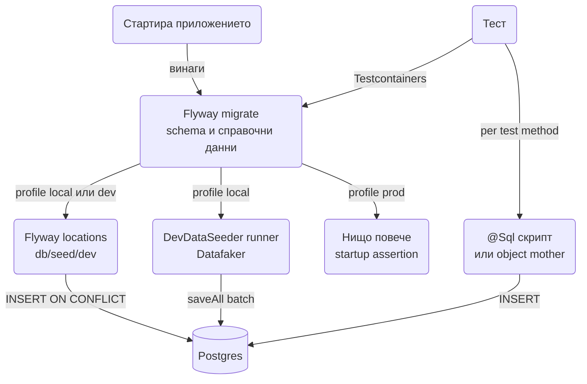

# Seeding

Seeding е зареждането на начални данни в базата: справочници без които приложението не работи (роли, държави, статуси), примерни данни за локална разработка (фалшиви потребители, продукти, поръчки) и фикстури за тестове. Трите вида имат различен живот, различен собственик и различен механизъм, а най-честата грешка е да се смесят в един `data.sql`, който после тръгва и към production. Този документ показва кой механизъм за кой вид данни да ползваш в Spring Boot 3.5 с PostgreSQL и Flyway, как да направиш seed-овете идемпотентни, как да генерираш реалистични dev данни бързо с Datafaker и batch inserts, и как да държиш тестовите фикстури извън всичко това. Накрая има пълен пример: миграция със справочни данни, `DevDataSeeder` клас и object mother за тестовете.

| Вид данни | Пример | Къде живее | Среда |
|---|---|---|---|
| Справочни данни | роли, статуси, валути, държави | Flyway миграция (`V__` или `R__`) | всички, включително prod |
| Първи admin потребител | `admin@example.com` с парола от env | Flyway миграция или runner с `PasswordEncoder` | всички |
| Dev примерни данни | 1000 фалшиви потребители, 5000 поръчки | `CommandLineRunner` с `@Profile("local")` или `db/seed/dev` | само local и dev |
| Тестови фикстури | "платена поръчка с два реда" | `@Sql` скрипт или object mother в теста | само тестове |
| Големи обеми | милиони редове за performance тест | `COPY` от CSV | по нужда |

## 1. Зависимости и настройка

За справочните данни ти трябва само Flyway. За dev seeding добави Datafaker. Нищо от това не влиза в production артефакта по различен начин, затова guard-ът е през профили, не през dependency scope.

```xml
<dependency>
    <groupId>org.flywaydb</groupId>
    <artifactId>flyway-core</artifactId>
</dependency>
<dependency>
    <groupId>org.flywaydb</groupId>
    <artifactId>flyway-database-postgresql</artifactId>
</dependency>
<dependency>
    <groupId>net.datafaker</groupId>
    <artifactId>datafaker</artifactId>
    <version>2.4.2</version> <!-- виж последната версия в Maven Central -->
</dependency>
```

Минималната конфигурация изключва вградения SQL init на Spring Boot (той се бие с Flyway) и включва batch inserts на Hibernate, защото без тях seeding на хиляди редове е десетки пъти по-бавен.

```yaml
spring:
  sql:
    init:
      mode: never
  flyway:
    locations: classpath:db/migration
  jpa:
    open-in-view: false
    properties:
      hibernate:
        jdbc:
          batch_size: 100
        order_inserts: true
        order_updates: true
  datasource:
    url: jdbc:postgresql://localhost:5432/shop?reWriteBatchedInserts=true
```

Параметърът `reWriteBatchedInserts=true` на PostgreSQL драйвера превръща batch от 100 отделни `INSERT` в един multi-row `INSERT`, което е най-голямата единична печалба за скорост.

Структура на ресурсите, която ще използваме нататък:

```
src/main/resources/db/
  migration/
    V1__schema.sql
    V2__reference_roles_and_statuses.sql
    R__countries.sql
  seed/
    dev/
      V900__dev_sample_users.sql
```

## 2. Кой механизъм за кои данни

Преди да пишеш код, реши коя от трите категории са данните. Справочните данни са част от схемата: ако кодът има `OrderStatus.PAID`, таблицата `order_statuses` трябва да има ред `PAID` във всяка среда, иначе приложението е счупено. Dev данните са удобство за човека пред лаптопа. Тестовите фикстури са част от конкретния тест и не трябва да зависят от нищо, което съществува "по подразбиране".



### Таблица с опциите

| Механизъм | За какво | Плюсове | Минуси |
|---|---|---|---|
| Flyway versioned (`V2__roles.sql`) | справочни данни, първи admin | версионирано, в git, идемпотентно по дефиниция (изпълнява се веднъж) | промяна изисква нова миграция |
| Flyway repeatable (`R__countries.sql`) | справочници, които се обновяват (държави, валути) | изпълнява се пак при промяна на checksum | трябва да е идемпотентен (`ON CONFLICT`) |
| `data.sql` + `spring.sql.init.mode` | нищо в проект с Flyway | нула код | бие се с Flyway, ред на изпълнение спрямо Hibernate, не е версионирано |
| `CommandLineRunner` с `@Profile("local")` | dev примерни данни, генерирани с код | пълна гъвкавост, Datafaker, релации | Java код, трябва guard срещу prod |
| Flyway locations по профил (`db/seed/dev`) | dev данни като SQL | същият механизъм като миграциите | SQL е труден за 10000 реда реалистични данни |
| `--seed` CLI аргумент | еднократно seed-ване на staging | явно действие, не се случва случайно | трябва отделен процес или job |
| Admin endpoint `POST /admin/seed` | не | удобно | опасно: HTTP достъп до генериране на данни в жива система |
| `COPY` от CSV | милиони редове | най-бързото възможно | не минава през JPA, няма валидации |

### Защо data.sql е лоша идея с JPA и Flyway

`spring.sql.init.mode=always` кара Spring Boot да изпълни `schema.sql` и `data.sql` веднага след създаване на `DataSource`, преди Hibernate да е създал схемата (при `ddl-auto`) и в неопределен ред спрямо Flyway. Затова съществува `spring.jpa.defer-datasource-initialization=true`, който отлага `data.sql` след инициализацията на JPA. Но това е кръпка за учебни проекти с `ddl-auto=create`. В реален проект схемата идва от Flyway, справочните данни са миграция, а `data.sql` няма място. Остави `spring.sql.init.mode: never` (стойността по подразбиране за не-embedded бази е `embedded`, което означава "само за H2", така че с PostgreSQL то и без това не се изпълнява, но го пиши явно, за да не изненада никого).

## 3. Минимален работещ пример: справочни данни с Flyway

Справочните данни са част от миграциите, както схемата. Ключовото правило: стабилни ключове. Ако кодът реферира роля по име, името е primary key или има unique constraint, а ако по UUID, UUID-то е фиксирано в миграцията, не генерирано.

```sql
-- V2__reference_roles_and_statuses.sql
CREATE TABLE roles (
    id   UUID PRIMARY KEY,
    name VARCHAR(50) NOT NULL UNIQUE
);

INSERT INTO roles (id, name) VALUES
    ('00000000-0000-0000-0000-000000000001', 'ADMIN'),
    ('00000000-0000-0000-0000-000000000002', 'MANAGER'),
    ('00000000-0000-0000-0000-000000000003', 'CUSTOMER')
ON CONFLICT (name) DO NOTHING;

CREATE TABLE order_statuses (
    code        VARCHAR(30) PRIMARY KEY,
    description VARCHAR(200) NOT NULL,
    sort_order  INT NOT NULL
);

INSERT INTO order_statuses (code, description, sort_order) VALUES
    ('NEW',       'Нова поръчка',        10),
    ('PAID',      'Платена',             20),
    ('SHIPPED',   'Изпратена',           30),
    ('DELIVERED', 'Доставена',           40),
    ('CANCELLED', 'Отказана',            90)
ON CONFLICT (code) DO NOTHING;
```

Държавите са типичен repeatable случай: списъкът се променя рядко, но се променя, и не искаш нова versioned миграция за всяка корекция. Repeatable миграцията се изпълнява отново всеки път, когато checksum-ът на файла се промени, затова трябва да е идемпотентна и да обновява, не само да вмъква.

```sql
-- R__countries.sql
CREATE TABLE IF NOT EXISTS countries (
    iso2       CHAR(2) PRIMARY KEY,
    name       VARCHAR(100) NOT NULL,
    eu_member  BOOLEAN NOT NULL DEFAULT FALSE
);

INSERT INTO countries (iso2, name, eu_member) VALUES
    ('BG', 'Bulgaria', TRUE),
    ('DE', 'Germany',  TRUE),
    ('GB', 'United Kingdom', FALSE),
    ('US', 'United States', FALSE)
ON CONFLICT (iso2) DO UPDATE
    SET name = EXCLUDED.name,
        eu_member = EXCLUDED.eu_member;
```

Flyway изпълнява repeatable миграциите след всички versioned в рамките на един `migrate`, затова `R__countries.sql` може спокойно да разчита на таблици от `V1__schema.sql`. Подробности за именуване и ред на миграциите има в [Миграции](Migrations.md).

## 4. Идемпотентни seed-ове

Seed трябва да може да се изпълни два пъти без да се счупи и без да дублира данни. Това важи за repeatable миграции, за runner-и (които се изпълняват при всеки старт) и за `--seed` команди, които някой ще пусне два пъти по невнимание.

### Четири техники

| Техника | Кога | Пример |
|---|---|---|
| `INSERT ... ON CONFLICT DO NOTHING` | има unique ключ, не искаш да обновяваш | справочници с фиксирани стойности |
| `INSERT ... ON CONFLICT DO UPDATE` (upsert) | има unique ключ, искаш последната версия | държави, валути, конфигурационни редове |
| `MERGE` (PostgreSQL 15+) | сложна логика: insert, update и delete в едно | синхронизация на справочник от външен файл |
| Проверка преди insert (`existsBy...`) | в Java runner, когато няма подходящ unique ключ | "ако има поне един потребител, пропусни" |

`MERGE` е по-четим от `ON CONFLICT` когато има три клона:

```sql
MERGE INTO countries AS c
USING (VALUES ('BG', 'Bulgaria', TRUE), ('RO', 'Romania', TRUE)) AS src(iso2, name, eu_member)
ON c.iso2 = src.iso2
WHEN MATCHED THEN UPDATE SET name = src.name, eu_member = src.eu_member
WHEN NOT MATCHED THEN INSERT (iso2, name, eu_member) VALUES (src.iso2, src.name, src.eu_member);
```

### Стабилни UUID за seed-нати редове

Ако seed-натите редове имат UUID primary key, не го генерирай с `gen_random_uuid()` или `UUID.randomUUID()`. При повторно изпълнение ще получиш различни id и `ON CONFLICT (id)` няма да хване дубликата. Или фиксираш UUID литерали в SQL (както в `roles` горе), или в Java ги извличаш детерминистично от естествения ключ:

```java
public final class SeedIds {
    private SeedIds() {}

    public static UUID of(String namespace, String naturalKey) {
        return UUID.nameUUIDFromBytes((namespace + ":" + naturalKey).getBytes(StandardCharsets.UTF_8));
    }
}

// SeedIds.of("role", "ADMIN") винаги връща един и същ UUID
```

Така тестовете и фронтендът могат да реферират "ролята ADMIN" по id и то да е еднакво във всяка среда.

### Проверка преди insert в runner

Най-простият guard за dev seeder: ако базата не е празна, не прави нищо. Това го прави безопасен за всяко рестартиране.

```java
if (userRepository.count() > 0) {
    log.info("DB already seeded, skipping");
    return;
}
```

## 5. Първи admin потребител

Приложение с login има нужда от първи admin още при първия deploy, иначе няма кой да създаде останалите. Паролата никога не е в git: нито в SQL миграция, нито в Java константа, нито в `application.yml`. Тя идва от environment променлива, а в базата влиза само хеш.

Понеже хеширането с bcrypt или argon2 не може да стане в чист SQL, admin потребителят се създава от `ApplicationRunner`, който работи във всички профили, но е идемпотентен и се пропуска, ако admin вече съществува. За `PasswordEncoder` и `UserAccount` виж [Authentication](Authentication.md).

```java
package com.example.shop.seed;

import org.springframework.boot.context.properties.ConfigurationProperties;

@ConfigurationProperties(prefix = "app.seed.admin")
public record AdminSeedProperties(String email, String password) {}
```

```yaml
app:
  seed:
    admin:
      email: ${SEED_ADMIN_EMAIL:admin@example.com}
      password: ${SEED_ADMIN_PASSWORD:}
```

```java
package com.example.shop.seed;

import org.springframework.boot.ApplicationArguments;
import org.springframework.boot.ApplicationRunner;
import org.springframework.core.annotation.Order;
import org.springframework.security.crypto.password.PasswordEncoder;
import org.springframework.stereotype.Component;
import org.springframework.transaction.annotation.Transactional;

@Component
@Order(1)
public class AdminUserSeeder implements ApplicationRunner {

    private static final Logger log = LoggerFactory.getLogger(AdminUserSeeder.class);

    private final UserAccountRepository users;
    private final RoleRepository roles;
    private final PasswordEncoder passwordEncoder;
    private final AdminSeedProperties props;

    public AdminUserSeeder(UserAccountRepository users, RoleRepository roles,
                           PasswordEncoder passwordEncoder, AdminSeedProperties props) {
        this.users = users;
        this.roles = roles;
        this.passwordEncoder = passwordEncoder;
        this.props = props;
    }

    @Override
    @Transactional
    public void run(ApplicationArguments args) {
        if (users.existsByEmail(props.email())) {
            return;
        }
        if (props.password() == null || props.password().isBlank()) {
            // Без парола не създаваме admin с нещо случайно: по-добре явна грешка при първия deploy
            throw new IllegalStateException("SEED_ADMIN_PASSWORD is not set and no admin user exists");
        }
        Role admin = roles.findByName("ADMIN").orElseThrow();
        UserAccount account = new UserAccount(props.email(), passwordEncoder.encode(props.password()));
        account.getRoles().add(admin);
        users.save(account);
        log.info("Created initial admin user {}", props.email());
    }
}
```

Алтернатива, ако не искаш runner: предварително изчислен bcrypt хеш в env (`SEED_ADMIN_PASSWORD_HASH`) и Flyway placeholder `${admin_password_hash}` в SQL миграция, подаден през `spring.flyway.placeholders.admin_password_hash=${SEED_ADMIN_PASSWORD_HASH}`. Работи, но хешът в env е по-неудобен за ротация и за хора, затова runner-ът е предпочитаният вариант.

## 6. Dev примерни данни

Тук идват фалшивите потребители, продукти и поръчки, с които разработчикът вижда реалистичен UI и списъци с pagination. Два подхода: SQL файлове в отделна Flyway локация, включена само локално, или Java runner с Datafaker. SQL-ът е добър за 20 реда; за хиляди реда с релации Java печели.

### Flyway локация по профил

```yaml
# application-local.yml
spring:
  flyway:
    locations: classpath:db/migration,classpath:db/seed/dev
```

```sql
-- db/seed/dev/V900__dev_sample_users.sql
INSERT INTO user_accounts (id, email, password_hash, created_at) VALUES
    ('10000000-0000-0000-0000-000000000001', 'ivan@dev.local',  '{noop}dev', now()),
    ('10000000-0000-0000-0000-000000000002', 'maria@dev.local', '{noop}dev', now())
ON CONFLICT (email) DO NOTHING;
```

Версията `V900` е умишлено висока, за да върви винаги след реалните миграции. Важно: веднъж приложена, Flyway записва `V900` в `flyway_schema_history` на локалната база. Ако после пуснеш същата база с профил без `db/seed/dev`, Flyway ще се оплаче за липсваща приложена миграция, освен ако не зададеш `spring.flyway.ignore-migration-patterns=*:missing`. Това е основната причина за хиляди редове да предпочитаме runner.

### DevDataSeeder с Datafaker

Runner-ът генерира данни по ред на зависимостите: първо родителите (потребители, продукти), после децата (поръчки, редове на поръчки), като пази референциите в паметта. Записва на batch-ове със `saveAll` в отделна транзакция на batch, за да не държи една гигантска транзакция и да не расте persistence context-ът до стотици мегабайти.

```java
package com.example.shop.seed;

import net.datafaker.Faker;
import org.springframework.boot.ApplicationArguments;
import org.springframework.boot.ApplicationRunner;
import org.springframework.context.annotation.Profile;
import org.springframework.core.annotation.Order;
import org.springframework.security.crypto.password.PasswordEncoder;
import org.springframework.stereotype.Component;

import java.math.BigDecimal;
import java.time.Instant;
import java.time.temporal.ChronoUnit;
import java.util.ArrayList;
import java.util.List;
import java.util.Locale;
import java.util.Random;

@Component
@Profile("local")
@Order(10)
public class DevDataSeeder implements ApplicationRunner {

    private static final Logger log = LoggerFactory.getLogger(DevDataSeeder.class);
    private static final int USERS = 500;
    private static final int PRODUCTS = 200;
    private static final int ORDERS = 5_000;
    private static final int BATCH = 100;

    private final UserAccountRepository users;
    private final ProductRepository products;
    private final RoleRepository roles;
    private final SeedBatchWriter batchWriter;
    private final PasswordEncoder passwordEncoder;

    public DevDataSeeder(UserAccountRepository users, ProductRepository products, RoleRepository roles,
                         SeedBatchWriter batchWriter, PasswordEncoder passwordEncoder) {
        this.users = users;
        this.products = products;
        this.roles = roles;
        this.batchWriter = batchWriter;
        this.passwordEncoder = passwordEncoder;
    }

    @Override
    public void run(ApplicationArguments args) {
        if (products.count() > 0) {
            log.info("Dev data already present, skipping");
            return;
        }
        // Фиксиран seed на Random: всеки разработчик вижда едни и същи данни
        Faker faker = new Faker(Locale.ENGLISH, new Random(42));
        // Хешираме веднъж: bcrypt за 500 потребителя би отнел секунди
        String devPasswordHash = passwordEncoder.encode("dev");
        Role customerRole = roles.findByName("CUSTOMER").orElseThrow();

        List<UserAccount> savedUsers = seedUsers(faker, devPasswordHash, customerRole);
        List<Product> savedProducts = seedProducts(faker);
        seedOrders(faker, savedUsers, savedProducts);
        log.info("Seeded {} users, {} products, {} orders", USERS, PRODUCTS, ORDERS);
    }

    private List<UserAccount> seedUsers(Faker faker, String passwordHash, Role role) {
        List<UserAccount> all = new ArrayList<>(USERS);
        List<UserAccount> batch = new ArrayList<>(BATCH);
        for (int i = 0; i < USERS; i++) {
            String email = "user%04d@dev.local".formatted(i);
            UserAccount u = new UserAccount(email, passwordHash);
            u.setFullName(faker.name().fullName());
            u.getRoles().add(role);
            batch.add(u);
            if (batch.size() == BATCH) {
                all.addAll(batchWriter.writeUsers(batch));
                batch = new ArrayList<>(BATCH);
            }
        }
        all.addAll(batchWriter.writeUsers(batch));
        return all;
    }

    private List<Product> seedProducts(Faker faker) {
        List<Product> batch = new ArrayList<>(PRODUCTS);
        for (int i = 0; i < PRODUCTS; i++) {
            Product p = new Product(
                    faker.commerce().productName() + " " + i,
                    new BigDecimal(faker.commerce().price(5, 500)));
            p.setSku("SKU-%05d".formatted(i));
            batch.add(p);
        }
        return batchWriter.writeProducts(batch);
    }

    private void seedOrders(Faker faker, List<UserAccount> customers, List<Product> catalog) {
        List<Order> batch = new ArrayList<>(BATCH);
        for (int i = 0; i < ORDERS; i++) {
            UserAccount customer = customers.get(faker.random().nextInt(customers.size()));
            Order order = new Order(customer);
            order.setCreatedAt(Instant.now().minus(faker.random().nextInt(365), ChronoUnit.DAYS));
            int lines = faker.random().nextInt(1, 5);
            for (int l = 0; l < lines; l++) {
                Product product = catalog.get(faker.random().nextInt(catalog.size()));
                order.addLine(product, faker.random().nextInt(1, 4));
            }
            order.setStatus(faker.options().option(OrderStatus.class));
            batch.add(order);
            if (batch.size() == BATCH) {
                batchWriter.writeOrders(batch);
                batch = new ArrayList<>(BATCH);
            }
        }
        batchWriter.writeOrders(batch);
    }
}
```

Записът е изнесен в отделен bean, защото `@Transactional` на `private` метод в същия клас не работи (proxy-то не го вижда; виж [Транзакции](Transactions.md)). Всеки batch е своя транзакция, а след `saveAll` викаме `flush` и `clear`, за да не държим 5000 поръчки в persistence context-а.

```java
package com.example.shop.seed;

import jakarta.persistence.EntityManager;
import org.springframework.context.annotation.Profile;
import org.springframework.stereotype.Component;
import org.springframework.transaction.annotation.Propagation;
import org.springframework.transaction.annotation.Transactional;

@Component
@Profile("local")
public class SeedBatchWriter {

    private final UserAccountRepository users;
    private final ProductRepository products;
    private final OrderRepository orders;
    private final EntityManager em;

    public SeedBatchWriter(UserAccountRepository users, ProductRepository products,
                           OrderRepository orders, EntityManager em) {
        this.users = users;
        this.products = products;
        this.orders = orders;
        this.em = em;
    }

    @Transactional(propagation = Propagation.REQUIRES_NEW)
    public List<UserAccount> writeUsers(List<UserAccount> batch) {
        List<UserAccount> saved = users.saveAll(batch);
        em.flush();
        em.clear();
        return saved;
    }

    @Transactional(propagation = Propagation.REQUIRES_NEW)
    public List<Product> writeProducts(List<Product> batch) {
        List<Product> saved = products.saveAll(batch);
        em.flush();
        em.clear();
        return saved;
    }

    @Transactional(propagation = Propagation.REQUIRES_NEW)
    public void writeOrders(List<Order> batch) {
        orders.saveAll(batch);
        em.flush();
        em.clear();
    }
}
```

### Релации в seed-овете

След `em.clear()` върнатите entity обекти са detached. Това е нормално за родители: `Order` има нужда само от id на `UserAccount` и `Product`, а Hibernate записва foreign key от detached референция без да я зарежда. Ако обаче модифицираш detached родител (например добавиш поръчка в `customer.getOrders()`), промяната няма да стигне до базата. Правилото: родителите се създават и записват първи, пазиш ги в списък, децата сочат към тях, и никога не променяш родителя през детето.

Ако `Order` има `@ManyToOne(fetch = LAZY) UserAccount customer`, по-евтино е да подадеш proxy вместо целия обект: `em.getReference(UserAccount.class, id)`. За картината на релациите виж [Релации](Relations.md).

### Защо batch_size има значение и кога не работи

Без `hibernate.jdbc.batch_size` всеки `saveAll` от 100 поръчки прави 100 отделни round trip-а до базата. С batch и `reWriteBatchedInserts` стават един или два. Но има условие, което хората пропускат: Hibernate не може да batch-ва entity с `@GeneratedValue(strategy = IDENTITY)`, защото трябва да получи id от базата след всеки insert. Използвай `SEQUENCE` с `allocationSize` (например 50) или UUID, генериран в приложението. `order_inserts=true` подрежда insert-ите по entity тип, така че 100 поръчки и 300 реда стават два batch-а, а не 400 преплетени statement-а.

### Repository срещу JdbcClient за скорост

| Подход | 5000 поръчки с 3 реда | Кога |
|---|---|---|
| `saveAll` без batch config | десетки секунди | никога за seeding |
| `saveAll` с batch_size и `reWriteBatchedInserts` | 2 до 5 секунди | по подразбиране: минава през entity валидации и `@PrePersist` |
| `JdbcTemplate.batchUpdate` | под секунда | 100 000+ реда, когато entity логиката не е нужна |
| `COPY` от CSV | милиони редове за секунди | performance тестове, импорт на реални dump-ове |

Пример с `JdbcTemplate.batchUpdate` (Spring 6.2 `JdbcClient` няма batch API, затова за batch използваме `JdbcTemplate`, а `JdbcClient` за единични statement-и):

```java
@Component
@Profile("local")
public class FastOrderLineSeeder {

    private final JdbcTemplate jdbc;

    public FastOrderLineSeeder(JdbcTemplate jdbc) {
        this.jdbc = jdbc;
    }

    @Transactional
    public void insertLines(List<OrderLineRow> rows) {
        jdbc.batchUpdate(
                "INSERT INTO order_lines (id, order_id, product_id, quantity, unit_price) VALUES (?, ?, ?, ?, ?)",
                rows,
                500,
                (ps, r) -> {
                    ps.setObject(1, r.id());
                    ps.setObject(2, r.orderId());
                    ps.setObject(3, r.productId());
                    ps.setInt(4, r.quantity());
                    ps.setBigDecimal(5, r.unitPrice());
                });
    }

    public record OrderLineRow(UUID id, UUID orderId, UUID productId, int quantity, BigDecimal unitPrice) {}
}
```

### Ред на няколко runner-а

Когато имаш `AdminUserSeeder`, `DevDataSeeder` и примерно `DevWarehouseSeeder`, редът се задава с `@Order` (по-ниско число = по-рано). Spring изпълнява всички `ApplicationRunner` и `CommandLineRunner` bean-ове след като контекстът е готов и Flyway е минал (Flyway се изпълнява при инициализацията на `DataSource`, тоест много преди runner-ите). Ако един runner хвърли exception, приложението не стартира, което за seeding е желаното поведение.

## 7. Seed през CLI аргумент

За staging среда понякога искаш "еднократно seed-ване при поискване", а не при всеки старт. Вместо admin endpoint (който е HTTP врата към генериране на данни и винаги завършва като инцидент), използвай аргумент: `java -jar shop.jar --seed=demo`. Runner-ът проверява `ApplicationArguments` и излиза след като свърши.

```java
@Component
@Profile("!prod")
public class CliSeedRunner implements ApplicationRunner {

    private final DemoDataSeeder demoSeeder;
    private final ConfigurableApplicationContext context;

    public CliSeedRunner(DemoDataSeeder demoSeeder, ConfigurableApplicationContext context) {
        this.demoSeeder = demoSeeder;
        this.context = context;
    }

    @Override
    public void run(ApplicationArguments args) {
        if (!args.containsOption("seed")) {
            return;
        }
        String profile = args.getOptionValues("seed").getFirst();
        demoSeeder.seed(profile);
        // Seed режимът е еднократна команда, не оставяме web сървъра да работи
        System.exit(SpringApplication.exit(context, () -> 0));
    }
}
```

В Kubernetes това е `Job` със същия image и аргумент `--seed=demo`, виж [Docker и деплой](Docker_Deploy.md).

## 8. Защита на production

Три нива на защита, защото всяко от тях само по себе си някой ден ще бъде заобиколено:

1. `@Profile("local")` или `@Profile("!prod")` на всеки dev seeder bean. Bean-ът изобщо не съществува в контекста в prod.
2. Отделен package `com.example.shop.seed.dev`, който е лесен за преглед при code review и може да се изключи с `@ComponentScan` филтър, ако някой ден реши да го изнесе в отделен модул.
3. Startup assertion: ако профилът е `prod`, а в контекста има какъвто и да е dev seeder, приложението спира.

```java
package com.example.shop.seed;

import org.springframework.beans.factory.ObjectProvider;
import org.springframework.core.env.Environment;
import org.springframework.core.env.Profiles;
import org.springframework.stereotype.Component;

@Component
public class SeedSafetyCheck {

    public SeedSafetyCheck(Environment env, ObjectProvider<DevSeeder> devSeeders) {
        boolean prod = env.acceptsProfiles(Profiles.of("prod"));
        boolean hasDevSeeder = devSeeders.stream().findAny().isPresent();
        if (prod && hasDevSeeder) {
            throw new IllegalStateException("Dev seeder beans must not exist in prod profile");
        }
    }
}
```

`DevSeeder` е marker интерфейс, който всеки dev runner имплементира. Проверката е в конструктора, тоест при създаване на контекста, преди какъвто и да е runner да е пуснат.

Какво никога не влиза в production seed: примерни потребители с известни пароли, фалшиви поръчки и фактури, тестови платежни данни, `{noop}` пароли, email адреси на реални хора. Ако production има нужда от "демо акаунт", той се създава ръчно през admin UI, с реална парола, и се документира.

## 9. Големи обеми с COPY

За милиони редове (performance тест, миграция от стара система) нищо не се доближава до `COPY`. PostgreSQL JDBC драйверът дава `CopyManager`, който стриймва CSV директно в таблицата. Няма JPA, няма валидации, само constraint-и на базата.

```java
package com.example.shop.seed;

import org.postgresql.PGConnection;
import org.postgresql.copy.CopyManager;
import org.springframework.jdbc.datasource.DataSourceUtils;

import javax.sql.DataSource;
import java.io.Reader;
import java.sql.Connection;

@Component
@Profile("!prod")
public class CsvBulkLoader {

    private final DataSource dataSource;

    public CsvBulkLoader(DataSource dataSource) {
        this.dataSource = dataSource;
    }

    public long loadProducts(Reader csv) throws Exception {
        Connection conn = DataSourceUtils.getConnection(dataSource);
        try {
            CopyManager copy = conn.unwrap(PGConnection.class).getCopyAPI();
            return copy.copyIn(
                    "COPY products (id, sku, name, price) FROM STDIN WITH (FORMAT csv, HEADER true)",
                    csv);
        } finally {
            DataSourceUtils.releaseConnection(conn, dataSource);
        }
    }
}
```

`DataSourceUtils.getConnection` взема връзката от текущата Spring транзакция, ако има такава, така че `COPY` може да е част от по-голям `@Transactional` метод. Ако файлът е вече на сървъра на базата, `COPY ... FROM '/path/file.csv'` през `JdbcClient` е още по-просто, но изисква superuser права или `pg_read_server_files`, което в managed PostgreSQL обикновено липсва.

## 10. Тестови фикстури

Тестовете не разчитат на dev seed-а. Всеки тест създава точно данните, от които има нужда, и нищо повече, иначе тестовете стават крехки и зависими от ред на изпълнение. Справочните данни от Flyway са налични (Testcontainers пуска реалните миграции), всичко останало е фикстура на теста.

### @Sql скриптове

За integration тестове на repository или на HTTP слой, когато данните са табличка от 5 реда:

```java
import org.springframework.test.context.jdbc.Sql;
import org.springframework.test.context.jdbc.SqlConfig;

@SpringBootTest
@Testcontainers
class OrderQueryIT {

    @Container
    @ServiceConnection
    static PostgreSQLContainer<?> postgres = new PostgreSQLContainer<>("postgres:17-alpine")
            .withReuse(true);

    @Autowired OrderRepository orders;

    @Test
    @Sql(scripts = "/fixtures/orders-paid.sql")
    @Sql(scripts = "/fixtures/cleanup.sql", executionPhase = Sql.ExecutionPhase.AFTER_TEST_METHOD)
    void findsPaidOrdersForCustomer() {
        var result = orders.findByCustomerIdAndStatus(
                UUID.fromString("10000000-0000-0000-0000-000000000001"), OrderStatus.PAID);
        assertThat(result).hasSize(2);
    }
}
```

```sql
-- src/test/resources/fixtures/orders-paid.sql
INSERT INTO user_accounts (id, email, password_hash, created_at)
VALUES ('10000000-0000-0000-0000-000000000001', 'fixture@test.local', '{noop}x', now());

INSERT INTO orders (id, customer_id, status, created_at) VALUES
    ('20000000-0000-0000-0000-000000000001', '10000000-0000-0000-0000-000000000001', 'PAID', now()),
    ('20000000-0000-0000-0000-000000000002', '10000000-0000-0000-0000-000000000001', 'PAID', now()),
    ('20000000-0000-0000-0000-000000000003', '10000000-0000-0000-0000-000000000001', 'NEW',  now());
```

Ако тестовият клас е `@Transactional`, cleanup скриптът не е нужен, защото всичко се rollback-ва. За HTTP тестове през `MockMvc` или `RestClient` към реален порт транзакцията на теста не покрива заявката, затова cleanup скриптът (или `TRUNCATE ... CASCADE` в `@AfterEach`) е задължителен. Testcontainers с `withReuse(true)` и `testcontainers.reuse.enable=true` в `~/.testcontainers.properties` пази контейнера между стартове; подробности в [Testing](Testing.md).

### Object mother и builder

За unit тестове и за service тестове SQL е неудобен: искаш "платена поръчка с два реда" на един ред код, без да мислиш за колони. Object mother е клас със статични фабрики за типични състояния на домейна, а builder-ът позволява да промениш едно поле.

```java
package com.example.shop.testsupport;

import java.math.BigDecimal;
import java.time.Instant;
import java.util.UUID;

public final class OrderMother {

    private OrderMother() {}

    public static Order newOrder() {
        return builder().build();
    }

    public static Order paidOrder() {
        return builder().status(OrderStatus.PAID).paidAt(Instant.now()).build();
    }

    public static Order shippedOrder() {
        return builder().status(OrderStatus.SHIPPED).paidAt(Instant.now().minusSeconds(3600)).build();
    }

    public static OrderBuilder builder() {
        return new OrderBuilder();
    }

    public static final class OrderBuilder {
        private UUID id = UUID.randomUUID();
        private UserAccount customer = UserMother.customer();
        private OrderStatus status = OrderStatus.NEW;
        private Instant paidAt;
        private int lines = 2;

        public OrderBuilder id(UUID id) { this.id = id; return this; }
        public OrderBuilder customer(UserAccount c) { this.customer = c; return this; }
        public OrderBuilder status(OrderStatus s) { this.status = s; return this; }
        public OrderBuilder paidAt(Instant t) { this.paidAt = t; return this; }
        public OrderBuilder lines(int n) { this.lines = n; return this; }

        public Order build() {
            Order order = new Order(customer);
            order.setId(id);
            order.setStatus(status);
            order.setPaidAt(paidAt);
            for (int i = 0; i < lines; i++) {
                order.addLine(ProductMother.product("P-" + i, new BigDecimal("19.90")), 1);
            }
            return order;
        }
    }
}
```

Използване в тест:

```java
@Test
void cannotShipUnpaidOrder() {
    Order order = OrderMother.newOrder();
    assertThatThrownBy(() -> shippingService.ship(order))
            .isInstanceOf(OrderNotPaidException.class);
}

@Test
void shipsPaidOrder() {
    Order order = orders.save(OrderMother.builder().status(OrderStatus.PAID).lines(3).build());
    shippingService.ship(order.getId());
    assertThat(orders.findById(order.getId())).get()
            .extracting(Order::getStatus).isEqualTo(OrderStatus.SHIPPED);
}
```

Mother класовете живеят в `src/test/java/.../testsupport` и може да ползват същия Datafaker за имена и адреси, но с фиксиран `Random(1)`, за да са тестовете възпроизводими.

## 11. Нулиране на dev базата

Два начина, според това колко радикално искаш да зачистиш.

### Flyway clean и migrate

Flyway 9+ забранява `clean` по подразбиране, защото някой го е пускал в production. За локална работа го разрешаваш явно и само в local профила:

```yaml
# application-local.yml
spring:
  flyway:
    clean-disabled: false
```

```bash
# scripts/db-reset.sh
set -euo pipefail
./mvnw -q flyway:clean flyway:migrate \
  -Dflyway.url=jdbc:postgresql://localhost:5432/shop \
  -Dflyway.user=shop -Dflyway.password=shop \
  -Dflyway.cleanDisabled=false \
  -Dflyway.locations=classpath:db/migration,classpath:db/seed/dev
./mvnw -q spring-boot:run -Dspring-boot.run.profiles=local
```

Това изисква `flyway-maven-plugin` в `pom.xml` (без `<version>`, управлява се от Boot). Алтернативата е `Flyway` bean-ът директно от Java в CLI runner: `flyway.clean(); flyway.migrate();`.

### Docker compose volume

Най-чистото: махни volume-а и Flyway ще създаде всичко от нулата при следващия старт, включително dev seed-овете.

```yaml
# compose.yaml
services:
  postgres:
    image: postgres:17-alpine
    environment:
      POSTGRES_DB: shop
      POSTGRES_USER: shop
      POSTGRES_PASSWORD: shop
    ports:
      - "5432:5432"
    volumes:
      - pgdata:/var/lib/postgresql/data
volumes:
  pgdata:
```

```bash
docker compose down -v && docker compose up -d postgres
```

Spring Boot Docker Compose support (`spring-boot-docker-compose` dependency) вдига този `compose.yaml` автоматично при `spring-boot:run` и свързва `DataSource` през `@ServiceConnection` логиката, така че локалната настройка е нула ръчни стъпки. Виж [Docker и деплой](Docker_Deploy.md).

## 12. Капани

- `data.sql` работи "случайно" в проект с Flyway, докато някой не промени `spring.jpa.hibernate.ddl-auto` или реда на инициализация, и тогава седмици по-късно не се разбира защо `data.sql` се изпълнява преди таблиците да съществуват. Дръж `spring.sql.init.mode: never` и слагай данните в миграции.
- Repeatable миграция, която не е идемпотентна: `R__countries.sql` с чист `INSERT` без `ON CONFLICT` минава първия път и гърми с duplicate key при първата промяна на файла. Винаги upsert.
- Dev seed със `UUID.randomUUID()` вместо стабилни id: при всяко нулиране фронтендът, Postman колекциите и bookmark-ите на колегите сочат към несъществуващи записи.
- Hibernate batch inserts тихо не работят с `GenerationType.IDENTITY`. Логът изглежда нормално, просто seeding-ът е 20 пъти по-бавен. Използвай `SEQUENCE` или UUID.
- Една транзакция за целия seed: 50 000 entity в persistence context означава гигабайти heap и минути за flush. Една транзакция на batch и `em.clear()` след всеки.
- `@Transactional` на private метод в самия runner не прави нищо, защото Spring proxy-то вижда само публичните извиквания отвън. Изнеси записа в отделен bean.
- Dev seeder без `@Profile`: някой го пуска на staging с реални клиенти и в базата се появяват 500 потребителя `user0001@dev.local`. Guard-вай с профил и със startup assertion.
- Admin парола в миграция или в `application.yml`: тя е в git завинаги, дори след като я "смениш". Само env и само хеш в базата.
- `flyway clean` с включен `clean-disabled: false` в общия `application.yml` вместо в `application-local.yml`: рано или късно някой го изпълнява срещу грешен URL.
- Тестове, които разчитат на dev seed-а: минават локално, падат в CI, където dev профилът не е активен. Тестът създава своите данни.
- Flyway локация `db/seed/dev`, приложена върху база, която после се пуска без тази локация: Flyway докладва missing migration. Или всички среди виждат една и съща история, или dev данните са runner.
- `COPY` с реален production dump на локална машина: лични данни на клиенти върху лаптоп. Анонимизирай dump-а или генерирай данни с Datafaker.

## 13. Чеклист

- [ ] `spring.sql.init.mode: never`, няма `data.sql` и `schema.sql` в проекта.
- [ ] Справочните данни (роли, статуси, валути) са във Flyway миграции със стабилни ключове и `ON CONFLICT`.
- [ ] Държави и други обновяеми справочници са `R__` миграции с upsert.
- [ ] Първият admin се създава от идемпотентен runner, паролата идва от `SEED_ADMIN_PASSWORD`, приложението отказва да стартира без нея при празна база.
- [ ] Dev seeder-ите са с `@Profile("local")`, имплементират `DevSeeder` marker и `SeedSafetyCheck` ги блокира в prod.
- [ ] `hibernate.jdbc.batch_size`, `order_inserts` и `reWriteBatchedInserts=true` са включени, entity-тата не ползват `IDENTITY`.
- [ ] Seed записва на batch-ове по 100 до 500, всеки в своя транзакция, с `flush` и `clear`.
- [ ] Родителите се seed-ват преди децата, id-тата се пазят в списък, стабилни UUID за всичко, което някой ще реферира.
- [ ] Тестовете ползват `@Sql` или object mother, никога dev seed-а.
- [ ] `scripts/db-reset.sh` или `docker compose down -v` връща локалната база в чисто състояние за под минута.
- [ ] `flyway.clean-disabled: false` е само в `application-local.yml`.
- [ ] Няма реални лични данни в никой seed файл или CSV в repo-то.

## 14. Свързани документи

- [Миграции](Migrations.md): именуване, ред и checksum на Flyway миграциите, в които живеят справочните данни.
- [База данни и ORM](Database_ORM.md): настройка на `DataSource`, Hibernate batch параметри и `JdbcClient`.
- [Релации](Relations.md): как се записват родители и деца и защо detached entity не пази промени.
- [Транзакции и locking](Transactions.md): защо `@Transactional` на private метод не работи и какво прави `REQUIRES_NEW`.
- [Authentication](Authentication.md): `PasswordEncoder` и `UserAccount`, които seeder-ът на admin използва.
- [Testing](Testing.md): Testcontainers с `@ServiceConnection`, reuse и `@Sql`.
- [Конфигурация и профили](Configuration_Profiles.md): профили `local`, `dev`, `prod` и как се подават env променливи.
- [Docker и деплой](Docker_Deploy.md): compose файл за локален PostgreSQL и Kubernetes Job за `--seed`.
- [Flyway documentation](https://documentation.red-gate.com/flyway)
