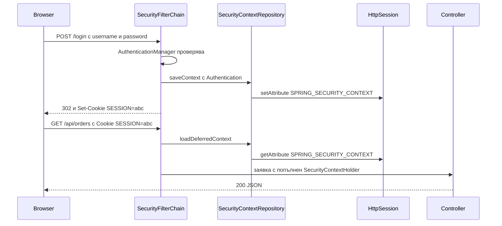
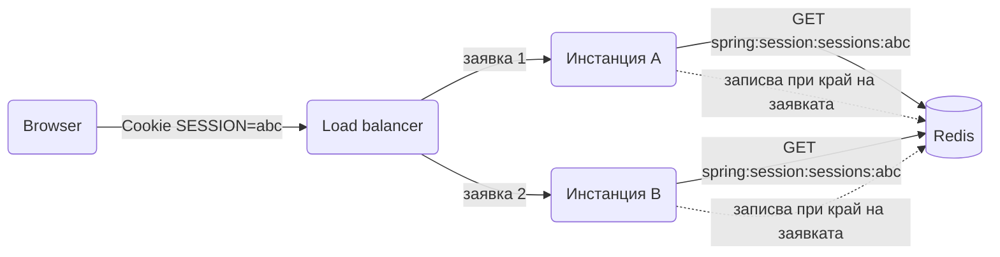

# Sessions и cookies

Сесията е състояние на сървъра, закачено за клиента чрез cookie с идентификатор. В Spring Boot тя се появява по две линии: Servlet `HttpSession` за данни на приложението и Spring Security, която пази `SecurityContext` в същата сесия след login. Този документ показва кога ти трябва сесия и кога е по-добре stateless API, как се настройват cookie-тата, какво прави Spring Security със сесията, как се споделя сесия между няколко инстанции със Spring Session и Redis, и как се работи с cookies отвъд сесията: CSRF, remember-me, предпочитания и refresh token за SPA. Примерите продължават домейна с поръчки от [Authentication](Authentication.md).

| Какво | Кога | Инструмент |
|---|---|---|
| Сървърна сесия | Server-rendered страници, OAuth2 login, количка преди login | `HttpSession`, `JSESSIONID` cookie |
| Stateless API | SPA или мобилно приложение с Bearer token | `SessionCreationPolicy.STATELESS`, JWT |
| Сесия на няколко инстанции | Повече от един pod зад load balancer | Spring Session с Redis или JDBC |
| Защита от CSRF | Всяко приложение с cookie автентикация | `CsrfFilter`, `XSRF-TOKEN` cookie |
| Запомни ме | Дълъг login без да държиш сесията жива | `rememberMe()` с JDBC token repository |
| Предпочитания на клиента | Език, тема, без да ги пазиш в базата | `ResponseCookie`, `@CookieValue`, `CookieLocaleResolver` |
| Refresh token за SPA | Browser клиент без да пази token в JavaScript | httpOnly cookie, SameSite=Strict, path `/auth/refresh` |

## 1. Зависимости и настройка

За `HttpSession` не трябва нищо извън web starter-а. Spring Security идва с `spring-boot-starter-security`. Spring Session се добавя само когато имаш повече от една инстанция или искаш да управляваш сесии централно.

```xml
<dependency>
    <groupId>org.springframework.boot</groupId>
    <artifactId>spring-boot-starter-web</artifactId>
</dependency>
<dependency>
    <groupId>org.springframework.boot</groupId>
    <artifactId>spring-boot-starter-security</artifactId>
</dependency>
<!-- споделена сесия в Redis -->
<dependency>
    <groupId>org.springframework.boot</groupId>
    <artifactId>spring-boot-starter-data-redis</artifactId>
</dependency>
<dependency>
    <groupId>org.springframework.session</groupId>
    <artifactId>spring-session-data-redis</artifactId>
</dependency>
<dependency>
    <groupId>org.springframework.security</groupId>
    <artifactId>spring-security-test</artifactId>
    <scope>test</scope>
</dependency>
```

```yaml
server:
  servlet:
    session:
      timeout: 30m
      cookie:
        name: SESSION
        http-only: true
        secure: true
        same-site: lax
        path: /
        # domain: .example.com  само ако поддомейни трябва да споделят сесията
  forward-headers-strategy: framework
```

`forward-headers-strategy: framework` кара Spring да чете `X-Forwarded-Proto` и `X-Forwarded-For` от reverse proxy, така че `secure` cookie и редиректите към `https` работят, когато TLS се терминира на load balancer. Без него приложението вижда `http` и Tomcat отказва да сложи `Secure` флага.

### Кога сесия и кога stateless

| Критерий | Сървърна сесия | Stateless с JWT |
|---|---|---|
| Клиент | Browser с server-rendered HTML, OAuth2 login flow | SPA, мобилно приложение, друг сървис |
| Logout | Незабавен: сесията се трие | Чака token-ът да изтече или blacklist |
| Смяна на роли | Веднага при презареждане на контекста | При следващ token |
| Хоризонтално мащабиране | Нужен е Spring Session или sticky sessions | Няма състояние, всяка инстанция върши работа |
| CSRF | Задължителна защита | Не е нужна, ако token-ът не е в cookie |
| Размер на заявката | Малко cookie | Token от 500 байта до няколко KB на всяка заявка |
| Количка преди login | Естествено в сесията | Нужна е отделна таблица или local storage |

Правилото: ако приложението рендерира HTML на сървъра или ползва `oauth2Login()`, работиш със сесии. Ако е чист JSON API за SPA, работиш stateless с token и refresh cookie, както е описано в раздел 10. Хибридът "JWT в сесия" е най-лошият вариант, защото плаща и двете цени.

## 2. Минимален работещ пример

Количка, която живее в сесията преди потребителят да е логнат. Три начина да стигнеш до нея: инжектиран `HttpSession`, `@SessionAttribute` и session-scoped bean.

```java
package com.example.orders.cart;

import jakarta.servlet.http.HttpSession;
import org.springframework.http.ResponseEntity;
import org.springframework.web.bind.annotation.*;

@RestController
@RequestMapping("/api/cart")
public class CartController {

    private static final String CART = "cart";

    @PostMapping("/items")
    public ResponseEntity<Cart> add(@RequestBody AddItemRequest req, HttpSession session) {
        var cart = (Cart) session.getAttribute(CART);
        if (cart == null) {
            cart = new Cart();
        }
        cart.add(req.productId(), req.quantity());
        // setAttribute е задължителен и при вече съществуващ обект,
        // за да го види Spring Session като променен и да го запише
        session.setAttribute(CART, cart);
        return ResponseEntity.ok(cart);
    }

    @GetMapping
    public Cart get(@SessionAttribute(name = CART, required = false) Cart cart) {
        return cart == null ? new Cart() : cart;
    }

    @DeleteMapping
    public ResponseEntity<Void> clear(HttpSession session) {
        session.removeAttribute(CART);
        return ResponseEntity.noContent().build();
    }
}
```

```java
package com.example.orders.cart;

import java.io.Serializable;
import java.util.LinkedHashMap;
import java.util.Map;

public class Cart implements Serializable {
    private final Map<Long, Integer> lines = new LinkedHashMap<>();

    public void add(Long productId, int quantity) {
        lines.merge(productId, quantity, Integer::sum);
    }

    public Map<Long, Integer> lines() {
        return Map.copyOf(lines);
    }
}
```

`Serializable` е нужен, за да може сесията да се запише в Redis, JDBC или дори на диск при рестарт на Tomcat. Дръж в сесията само идентификатори и малки стойности, не entity-та с lazy асоциации.

```http
POST /api/cart/items HTTP/1.1
Content-Type: application/json

{"productId": 7, "quantity": 2}

HTTP/1.1 200 OK
Set-Cookie: SESSION=4a1c...; Path=/; Secure; HttpOnly; SameSite=Lax
Content-Type: application/json

{"lines": {"7": 2}}
```

При следващата заявка browser-ът праща `Cookie: SESSION=4a1c...` и Tomcat, или Spring Session, намира същата сесия.

### Session-scoped bean

Когато няколко controller-а работят с една и съща структура, `@SessionScope` bean е по-чист от ръчни `getAttribute`. Spring създава proxy, така че bean-ът може да се инжектира в singleton controller.

```java
@Component
@SessionScope
public class SessionCart implements Serializable {
    private final Map<Long, Integer> lines = new LinkedHashMap<>();
    public void add(Long productId, int qty) { lines.merge(productId, qty, Integer::sum); }
    public Map<Long, Integer> lines() { return Map.copyOf(lines); }
}
```

`@SessionScope` включва `proxyMode = TARGET_CLASS` по подразбиране; при всяко извикване proxy-то намира текущата сесия през `RequestContextHolder`. Това означава, че bean-ът е недостъпен от `@Async` и `@Scheduled` методи, където няма текуща заявка.

## 3. Как Spring Security ползва сесията

### Login и последваща заявка



`HttpSessionSecurityContextRepository` е имплементацията по подразбиране на `SecurityContextRepository`. В Security 6 контекстът се зарежда лениво от `SecurityContextHolderFilter` и се записва изрично от компонента, който го е променил. Ако сам сменяш `Authentication` (например след програмен login), трябва и ти да го запишеш:

```java
public void loginProgrammatically(HttpServletRequest req, HttpServletResponse res, Authentication auth) {
    var context = SecurityContextHolder.createEmptyContext();
    context.setAuthentication(auth);
    SecurityContextHolder.setContext(context);
    securityContextRepository.saveContext(context, req, res);
}
```

### SessionCreationPolicy

| Политика | Поведение |
|---|---|
| `ALWAYS` | Създава сесия на всяка заявка, ако няма такава. Рядко нужно. |
| `IF_REQUIRED` | По подразбиране. Създава сесия само когато има какво да запише, обикновено след login. |
| `NEVER` | Не създава сесия, но ползва вече съществуваща, ако browser-ът я прати. |
| `STATELESS` | Не създава и не чете сесия. `SecurityContext` живее само за една заявка. За JWT API. |

```java
@Bean
SecurityFilterChain api(HttpSecurity http) throws Exception {
    http
        .securityMatcher("/api/**")
        .sessionManagement(s -> s.sessionCreationPolicy(SessionCreationPolicy.STATELESS))
        .csrf(c -> c.disable())
        .authorizeHttpRequests(a -> a.anyRequest().authenticated())
        .oauth2ResourceServer(o -> o.jwt(j -> {}));
    return http.build();
}
```

`STATELESS` сменя и `SecurityContextRepository` с `RequestAttributeSecurityContextRepository`, така че нищо не стига до `HttpSession` дори ако някой controller я поиска. CSRF може да се изключи само защото token-ът не е в cookie; виж раздел 8.

### Session fixation

Атаката: нападателят дава на жертвата предварително известен session id, жертвата се логва, нападателят ползва същия id. Защитата е да смениш id-то при login. Spring Security го прави по подразбиране с `changeSessionId()`, който пази атрибутите и сменя само идентификатора. Не го изключвай; ако имаш нужда от нова чиста сесия при login, ползвай `newSession()`.

```java
.sessionManagement(s -> s.sessionFixation(f -> f.changeSessionId()))
```

### Контрол на паралелните сесии

Ограничаването до една активна сесия на потребител изисква Security да знае кои сесии са живи. `HttpSessionEventPublisher` препраща Servlet събитията за създаване и унищожаване към `SessionRegistry`.

```java
@Bean
SecurityFilterChain web(HttpSecurity http) throws Exception {
    http
        .formLogin(f -> f.loginPage("/login").permitAll())
        .sessionManagement(s -> s
            .sessionFixation(f -> f.changeSessionId())
            .maximumSessions(1)
            .maxSessionsPreventsLogin(false)
            .expiredUrl("/login?expired"))
        .authorizeHttpRequests(a -> a.anyRequest().authenticated());
    return http.build();
}

@Bean
HttpSessionEventPublisher httpSessionEventPublisher() {
    return new HttpSessionEventPublisher();
}
```

`maxSessionsPreventsLogin(false)` означава, че новият login изгонва стария; `true` отказва новия login, докато старата сесия е жива, което е неприятно за потребител, който е затворил browser-а без logout. При Spring Session регистърът се замества със `SpringSessionBackedSessionRegistry`, за да вижда сесиите от всички инстанции:

```java
@Bean
SpringSessionBackedSessionRegistry<? extends Session> sessionRegistry(
        FindByIndexNameSessionRepository<? extends Session> sessions) {
    return new SpringSessionBackedSessionRegistry<>(sessions);
}
```

и в конфигурацията `.maximumSessions(1).sessionRegistry(sessionRegistry)`.

### Logout

```java
.logout(l -> l
    .logoutUrl("/logout")
    .invalidateHttpSession(true)
    .clearAuthentication(true)
    .deleteCookies("SESSION", "remember-me")
    .logoutSuccessHandler((req, res, auth) -> res.setStatus(HttpStatus.NO_CONTENT.value())))
```

По подразбиране logout изисква POST с CSRF token, за да не може чужд сайт да те разлогва с ``. `invalidateHttpSession(true)` е default и трие цялата сесия, включително количката; ако искаш да я запазиш, копирай я в нова сесия в `LogoutHandler`. Logout от всички устройства е операция върху session store, показана в раздел 6.

## 4. Spring Session с Redis

### Защо ти трябва

С една инстанция Tomcat държи сесиите в паметта и всичко работи. С две инстанции зад load balancer втората заявка попада на другата инстанция, която не знае за сесията, и потребителят е "разлогнат". Двата изхода са sticky sessions на балансьора (всеки клиент винаги към същата инстанция) или споделен store. Sticky sessions губят сесиите при деплой и рестарт и разпределят товара неравномерно; споделеният store е стандартният отговор.



### Настройка

В Boot 3 `spring.session.store-type` вече не съществува; наличието на `spring-session-data-redis` в classpath е достатъчно, а `@EnableRedisHttpSession` е нужна само ако искаш да override-неш автоконфигурацията.

```yaml
spring:
  data:
    redis:
      host: ${REDIS_HOST:localhost}
      port: 6379
  session:
    timeout: 30m
    redis:
      namespace: orders:session
      repository-type: indexed
      flush-mode: on-save
```

`timeout` тук замества `server.servlet.session.timeout`. `namespace` разделя ключовете, ако няколко приложения споделят един Redis. `repository-type: indexed` включва `RedisIndexedSessionRepository`, който поддържа търсене по principal и събития за изтичане; default-ът `default` е по-лек, но не може да намери сесиите на даден потребител. `flush-mode: on-save` записва в края на заявката, което е единственият разумен вариант за web.

Spring Session подменя `HttpSession` със своя имплементация през `SessionRepositoryFilter`, който стои преди Security. Cookie-то се управлява от `DefaultCookieSerializer`; настройките `server.servlet.session.cookie.*` се прилагат автоматично в Boot 3.5.

### Сериализация на атрибутите

По подразбиране атрибутите се сериализират с JDK сериализация. Тя работи с всичко `Serializable`, но е крехка: промяна на клас в нов деплой прави старите сесии нечетими и потребителите се разлогват. JSON е по-стабилен за собствените ти класове, но `SecurityContext` съдържа Security класове, за които Jackson трябва да има регистрирани модули.

```java
@Configuration
public class SessionSerializationConfig {

    @Bean
    RedisSerializer<Object> springSessionDefaultRedisSerializer() {
        var mapper = new ObjectMapper();
        mapper.registerModules(SecurityJackson2Modules.getModules(getClass().getClassLoader()));
        return new GenericJackson2JsonRedisSerializer(mapper);
    }
}
```

Името на bean-а `springSessionDefaultRedisSerializer` е конвенция, която Spring Session търси. Собствените ти класове в сесията трябва да са Jackson-приятелски (публичен конструктор без аргументи или `@JsonCreator`) и е добре да са в allow list на `ObjectMapper`-а, защото Security модулите ползват default typing. Независимо от формата: сесията е за няколко идентификатора и малки обекти. Количка с 20 реда е добре; списък с 500 поръчки не е.

### Spring Session JDBC

Когато нямаш Redis, Postgres върши същата работа с малко по-висока латентност.

```xml
<dependency>
    <groupId>org.springframework.session</groupId>
    <artifactId>spring-session-jdbc</artifactId>
</dependency>
```

```yaml
spring:
  session:
    timeout: 30m
    jdbc:
      initialize-schema: never
      table-name: SPRING_SESSION
```

Схемата е в jar-а като `org/springframework/session/jdbc/schema-postgresql.sql`. Копирай я във Flyway миграция, вместо да разчиташ на `initialize-schema: always`, за да е под контрол като всяка друга таблица, виж [Миграции](Migrations.md). Таблиците са две: `SPRING_SESSION` с id, времена и principal name, и `SPRING_SESSION_ATTRIBUTES` с байтовете на всеки атрибут. Изтеклите сесии се чистят от вграден scheduled job (`spring.session.jdbc.cleanup-cron`).

## 5. Управление на сесиите

### Списък на активните сесии и прекъсване

Функция "активни устройства" в профила и "излез от всички устройства" са директни операции върху `FindByIndexNameSessionRepository`.

```java
package com.example.orders.account;

import org.springframework.session.FindByIndexNameSessionRepository;
import org.springframework.session.Session;
import org.springframework.stereotype.Service;

@Service
public class ActiveSessionService {

    private final FindByIndexNameSessionRepository<? extends Session> sessions;

    public ActiveSessionService(FindByIndexNameSessionRepository<? extends Session> sessions) {
        this.sessions = sessions;
    }

    public List<ActiveSession> list(String username) {
        return sessions.findByPrincipalName(username).values().stream()
            .map(s -> new ActiveSession(s.getId(), s.getCreationTime(), s.getLastAccessedTime()))
            .toList();
    }

    public void terminateAll(String username, String exceptSessionId) {
        sessions.findByPrincipalName(username).keySet().stream()
            .filter(id -> !id.equals(exceptSessionId))
            .forEach(sessions::deleteById);
    }

    public record ActiveSession(String id, java.time.Instant createdAt, java.time.Instant lastAccess) {}
}
```

```java
@RestController
@RequestMapping("/api/account/sessions")
public class ActiveSessionController {

    private final ActiveSessionService service;

    public ActiveSessionController(ActiveSessionService service) {
        this.service = service;
    }

    @GetMapping
    public List<ActiveSessionService.ActiveSession> list(Authentication auth) {
        return service.list(auth.getName());
    }

    @DeleteMapping
    public ResponseEntity<Void> logoutEverywhereElse(Authentication auth, HttpSession current) {
        service.terminateAll(auth.getName(), current.getId());
        return ResponseEntity.noContent().build();
    }
}
```

Не показвай пълния session id в отговора към клиента; върни хеш или само последните 4 символа. Admin вариантът на същото, "изгони потребител X", е същият метод без `exceptSessionId`, защитен с `hasRole('ADMIN')`, виж [Authorization](Authorization.md).

### Смяна на парола и роли

При смяна на парола прекрати всички други сесии на потребителя. При промяна на роли от admin или презареди `SecurityContext` в активните сесии, или по-просто ги изтрий, за да се логне потребителят наново с новите права.

## 6. CSRF със сесии

### Защо и как работи

Browser-ът праща cookie-то автоматично към всеки домейн, включително от форма на чужд сайт. Без CSRF защита `POST /api/orders` от злонамерена страница се изпълнява от името на логнатия потребител. `CsrfFilter` изисква при всяка променяща заявка (POST, PUT, PATCH, DELETE) token, който чуждият сайт не може да прочете. При server-rendered Thymeleaf форми token-ът се слага автоматично като скрито поле, виж [Имейли и HTML шаблони](Emails_Templates.md).

### SPA с cookie сесия

SPA не рендерира форми на сървъра, затова token-ът се подава като cookie `XSRF-TOKEN`, която JavaScript чете и праща обратно в header `X-XSRF-TOKEN`. Cookie-то трябва да е без `HttpOnly`, за да е четимо от JavaScript; това е безопасно, защото стойността ѝ сама по себе си не дава достъп, а само доказва, че кодът работи на нашия origin.

```java
@Bean
SecurityFilterChain web(HttpSecurity http) throws Exception {
    http
        .csrf(c -> c
            .csrfTokenRepository(CookieCsrfTokenRepository.withHttpOnlyFalse())
            .csrfTokenRequestHandler(new SpaCsrfTokenRequestHandler()))
        .addFilterAfter(new CsrfCookieFilter(), BasicAuthenticationFilter.class)
        .authorizeHttpRequests(a -> a.anyRequest().authenticated())
        .formLogin(f -> f.permitAll());
    return http.build();
}
```

Security 6 въведе две тънкости. Първо, token-ът се зарежда лениво: `CsrfToken` е атрибут на заявката, но cookie-то се записва само когато някой извика `getToken()`. Затова е нужен малък filter, който го "докосва" на всяка заявка:

```java
final class CsrfCookieFilter extends OncePerRequestFilter {
    @Override
    protected void doFilterInternal(HttpServletRequest req, HttpServletResponse res, FilterChain chain)
            throws ServletException, IOException {
        var token = (CsrfToken) req.getAttribute(CsrfToken.class.getName());
        token.getToken();
        chain.doFilter(req, res);
    }
}
```

Второ, default handler-ът е `XorCsrfTokenRequestAttributeHandler`, който връща различна, маскирана стойност при всяко четене (защита срещу BREACH). Маскираната стойност в cookie-то не може да се сравни директно, когато SPA я праща обратно в header. Препоръчаният от документацията handler маскира при рендериране и приема немаскирана стойност от header:

```java
final class SpaCsrfTokenRequestHandler implements CsrfTokenRequestHandler {
    private final CsrfTokenRequestHandler plain = new CsrfTokenRequestAttributeHandler();
    private final CsrfTokenRequestHandler xor = new XorCsrfTokenRequestAttributeHandler();

    @Override
    public void handle(HttpServletRequest req, HttpServletResponse res, Supplier<CsrfToken> token) {
        xor.handle(req, res, token);
    }

    @Override
    public String resolveCsrfTokenValue(HttpServletRequest req, CsrfToken token) {
        String header = req.getHeader(token.getHeaderName());
        // header идва от cookie-то и е немаскиран, параметър от форма е маскиран
        return StringUtils.hasText(header)
            ? plain.resolveCsrfTokenValue(req, token)
            : xor.resolveCsrfTokenValue(req, token);
    }
}
```

Axios и Angular четат `XSRF-TOKEN` и пращат `X-XSRF-TOKEN` автоматично за same-origin заявки; fetch изисква ръчно четене на cookie-то.

### Кога се изключва

CSRF се изключва само когато нищо в автентикацията не се праща автоматично от browser-а: `STATELESS` API с `Authorization: Bearer` header. Ако ползваш cookie за refresh token (раздел 10), endpoint-ът `/auth/refresh` трябва да остане с CSRF защита или `SameSite=Strict`, иначе чужд сайт може да го извика.

## 7. Remember-me

Remember-me дава дълъг login без да държиш сесия 30 дни. Persistent вариантът пази серия и token в база и ги ротира при всяка употреба, което позволява да се засече откраднат token.

```java
.rememberMe(r -> r
    .rememberMeParameter("remember-me")
    .tokenRepository(persistentTokenRepository)
    .tokenValiditySeconds((int) Duration.ofDays(30).toSeconds())
    .key("${REMEMBER_ME_KEY}")
    .userDetailsService(userDetailsService))
```

```java
@Bean
PersistentTokenRepository persistentTokenRepository(DataSource dataSource) {
    var repo = new JdbcTokenRepositoryImpl();
    repo.setDataSource(dataSource);
    return repo;
}
```

```sql
create table persistent_logins (
    username  varchar(64) not null,
    series    varchar(64) primary key,
    token     varchar(64) not null,
    last_used timestamp   not null
);
```

Схемата е тази, която `JdbcTokenRepositoryImpl` очаква; сложи я във Flyway миграция. При смяна на парола изтрий редовете на потребителя от `persistent_logins`, иначе старото cookie продължава да го логва. Remember-me cookie-то трябва да е `Secure` и `HttpOnly`; и двете са default при `secure` cookie настройка на сървъра.

## 8. Cookies отвъд сесията

### Записване и четене

`ResponseCookie` е builder за коректно форматиран `Set-Cookie` header, включително `SameSite`, който `jakarta.servlet.http.Cookie` не поддържа директно.

```java
@PutMapping("/api/preferences/theme")
public ResponseEntity<Void> setTheme(@RequestBody ThemeRequest req) {
    var cookie = ResponseCookie.from("theme", req.theme())
        .httpOnly(false)
        .secure(true)
        .sameSite("Lax")
        .path("/")
        .maxAge(Duration.ofDays(365))
        .build();
    return ResponseEntity.noContent()
        .header(HttpHeaders.SET_COOKIE, cookie.toString())
        .build();
}

@GetMapping("/api/preferences/theme")
public ThemeResponse theme(@CookieValue(name = "theme", defaultValue = "light") String theme) {
    return new ThemeResponse(theme);
}
```

Изтриване е същото cookie с `maxAge(0)` и същите `path` и `domain`; ако някое от тях се различава, browser-ът го третира като друго cookie и старото остава.

### Locale от cookie

`CookieLocaleResolver` чете езика от cookie и го дава на `LocaleContextHolder`, откъдето `MessageSource` и Thymeleaf го ползват. `LocaleChangeInterceptor` го сменя при параметър `?lang=bg`.

```java
@Configuration
public class LocaleConfig implements WebMvcConfigurer {

    @Bean
    LocaleResolver localeResolver() {
        var resolver = new CookieLocaleResolver("LOCALE");
        resolver.setDefaultLocale(Locale.of("bg"));
        resolver.setCookieMaxAge(Duration.ofDays(365));
        return resolver;
    }

    @Override
    public void addInterceptors(InterceptorRegistry registry) {
        var interceptor = new LocaleChangeInterceptor();
        interceptor.setParamName("lang");
        registry.addInterceptor(interceptor);
    }
}
```

За API с Bearer token вместо cookie се ползва `AcceptHeaderLocaleResolver`, който е default в Boot; тогава клиентът праща `Accept-Language`.

## 9. Refresh token в cookie за SPA

SPA с JWT има проблем къде да пази refresh token-а: `localStorage` е четим от всеки XSS, а памет се губи при презареждане. Решението е access token в паметта на SPA-то (кратък, 5 до 15 минути) и refresh token в httpOnly cookie, ограничено до единствения path, който го ползва.

```java
@PostMapping("/auth/login")
public ResponseEntity<TokenResponse> login(@RequestBody LoginRequest req) {
    var tokens = authService.login(req.email(), req.password());
    var refresh = ResponseCookie.from("refresh_token", tokens.refreshToken())
        .httpOnly(true)
        .secure(true)
        .sameSite("Strict")
        .path("/auth/refresh")
        .maxAge(Duration.ofDays(14))
        .build();
    return ResponseEntity.ok()
        .header(HttpHeaders.SET_COOKIE, refresh.toString())
        .body(new TokenResponse(tokens.accessToken(), tokens.expiresIn()));
}

@PostMapping("/auth/refresh")
public ResponseEntity<TokenResponse> refresh(
        @CookieValue(name = "refresh_token", required = false) String refreshToken) {
    if (refreshToken == null) {
        return ResponseEntity.status(HttpStatus.UNAUTHORIZED).build();
    }
    var tokens = authService.refresh(refreshToken);
    var rotated = ResponseCookie.from("refresh_token", tokens.refreshToken())
        .httpOnly(true).secure(true).sameSite("Strict").path("/auth/refresh")
        .maxAge(Duration.ofDays(14)).build();
    return ResponseEntity.ok()
        .header(HttpHeaders.SET_COOKIE, rotated.toString())
        .body(new TokenResponse(tokens.accessToken(), tokens.expiresIn()));
}
```

`path("/auth/refresh")` гарантира, че cookie-то не пътува с всяка API заявка и не може да бъде откраднато от friendly endpoint, който го логва. `SameSite=Strict` спира чужди сайтове да извикват refresh. Refresh token-ът се ротира при всяка употреба и старият се инвалидира; повторна употреба на стар token означава кражба и изисква инвалидиране на цялото семейство token-и. Издаването и валидирането са в [Authentication](Authentication.md).

## 10. Load balancer, proxy и чеклист по сигурност

### Зад reverse proxy

Nginx, Traefik или cloud load balancer терминира TLS и праща `http` към приложението. Три неща трябва да са наред:

```yaml
server:
  forward-headers-strategy: framework
  servlet:
    session:
      cookie:
        secure: true
        same-site: lax
```

Proxy-то трябва да праща `X-Forwarded-Proto: https` и `X-Forwarded-For`. С `framework` стратегията Spring регистрира `ForwardedHeaderFilter`, който пренаписва `request.isSecure()` и `getRemoteAddr()`. Ако proxy-то е под твой контрол, `native` стратегия кара Tomcat да го прави сам. Никога не включвай обработката на forwarded headers, ако приложението е достъпно директно отвън, защото клиентът ще може да подправи `X-Forwarded-For`.

За sticky sessions без Spring Session: повечето балансьори могат да закачат клиента към инстанция по cookie, но при деплой с rolling restart всички сесии от спряната инстанция се губят. Това е приемливо за вътрешни инструменти и неприемливо за магазин с количка.

### Чеклист по сигурност на cookie-тата

| Настройка | Стойност | Защо |
|---|---|---|
| `HttpOnly` | да, освен `XSRF-TOKEN` и UI предпочитания | XSS не може да прочете сесията |
| `Secure` | да в production | cookie-то не тръгва по `http` |
| `SameSite` | `Lax` за сесия, `Strict` за refresh token | ограничава cross-site заявки |
| `Path` | `/` за сесия, точен път за refresh | cookie-то пътува само където трябва |
| `Domain` | без, освен при поддомейни | без `Domain` cookie-то е само за точния host |
| Име | `SESSION` или нещо неутрално | `JSESSIONID` издава стека, не е критично |
| Timeout | 30 минути неактивност за web | кратък прозорец за откраднато cookie |

## 11. Тестване

`MockMvc` поддържа сесия през `MockHttpSession`, която пренасяш между заявките. `spring-security-test` дава `formLogin()` и `user()` за автентикация без истински login.

```java
@SpringBootTest
@AutoConfigureMockMvc
class CartSessionTest {

    @Autowired MockMvc mvc;

    @Test
    void cartSurvivesBetweenRequests() throws Exception {
        var session = (MockHttpSession) mvc.perform(post("/api/cart/items")
                .with(user("ivan@example.com"))
                .with(csrf())
                .contentType(MediaType.APPLICATION_JSON)
                .content("{\"productId\":7,\"quantity\":2}"))
            .andExpect(status().isOk())
            .andReturn().getRequest().getSession();

        mvc.perform(get("/api/cart").session(session).with(user("ivan@example.com")))
            .andExpect(status().isOk())
            .andExpect(jsonPath("$.lines.7").value(2));
    }

    @Test
    void logoutInvalidatesSession() throws Exception {
        var session = (MockHttpSession) mvc.perform(formLogin().user("ivan@example.com").password("secret"))
            .andExpect(authenticated())
            .andReturn().getRequest().getSession();

        mvc.perform(logout().session(session)).andExpect(unauthenticated());
        assertThat(session.isInvalid()).isTrue();
    }
}
```

`csrf()` post processor добавя валиден token към заявката; без него всеки POST в тест връща 403 и това е първото, което проверяваш при "необяснимо" 403. За Spring Session Redis тестовете вдигат Redis с Testcontainers и `@ServiceConnection`, както е показано в [Testing](Testing.md), и проверяват, че сесията се вижда от втори `MockMvc` контекст или директно през `SessionRepository.findById`.

## 12. Капани

- `JWT в сесия`: API, което изисква Bearer token, но и създава `HttpSession` при всяка заявка, защото никой не е сложил `STATELESS`. Хиляди празни сесии в Redis и загуба на памет. Проверявай с `redis-cli KEYS 'orders:session:*'` в dev.
- Промяна на обект в сесията без `setAttribute`: с Tomcat работи, защото е същата референция; със Spring Session промяната не се записва, защото repository-то следи само `setAttribute`. Винаги извиквай `setAttribute` след промяна.
- Несериализируем атрибут: `HttpSession` в Tomcat го приема, а първият деплой със Spring Session хвърля `NotSerializableException` при края на заявката. Всичко в сесията е `Serializable` или JSON-приятелско от първия ден.
- `Secure` cookie без `forward-headers-strategy` зад proxy: Tomcat вижда `http`, не слага `Secure`, или с `secure: true` в конфигурацията browser-ът отказва да върне cookie по `http` и потребителят се логва безкрайно.
- Изключен CSRF, "защото пречи на SPA-то": при cookie автентикация това е директна уязвимост. Правилният отговор е `CookieCsrfTokenRepository` и header от клиента.
- `XorCsrfTokenRequestAttributeHandler` със SPA без адаптиращ handler: всеки POST връща 403, въпреки че cookie и header съвпадат, защото стойността в cookie-то е маскирана по различен начин от очакваното.
- `maximumSessions(1)` без `HttpSessionEventPublisher`: регистърът никога не научава за изтекли сесии и потребителят не може да се логне след затворен browser при `maxSessionsPreventsLogin(true)`.
- `@SessionScope` bean, извикан от `@Async` или `@Scheduled` метод: `ScopeNotActiveException`, защото няма текуща заявка. Подай данните като аргументи.
- JDK сериализация на сесията при деплой с променен клас: `InvalidClassException` и масов logout. Или JSON, или `serialVersionUID` и дисциплина при промени.
- Изтриване на cookie с различен `path` от оригиналния: browser-ът добавя второ cookie вместо да изтрие първото. Същият `path` и `domain` при `maxAge(0)`.
- Remember-me без изтриване на `persistent_logins` при смяна на парола: старото устройство продължава да се логва със старото cookie.
- Session timeout от 8 часа "за удобство": откраднато cookie работи 8 часа. 30 минути неактивност плюс remember-me покрива удобството без този риск.

## 13. Чеклист

- [ ] Решено е дали сървисът е със сесии или stateless, и `SessionCreationPolicy` съответства на решението.
- [ ] Cookie настройките в `application.yml`: `http-only`, `secure`, `same-site`, timeout 30 минути, неутрално име.
- [ ] `server.forward-headers-strategy` е зададена, когато приложението е зад proxy, и proxy-то праща `X-Forwarded-Proto`.
- [ ] При повече от една инстанция има Spring Session с Redis или JDBC и схемата е във Flyway миграция.
- [ ] Всичко, което влиза в сесията, е малко и `Serializable`, а промените минават през `setAttribute`.
- [ ] CSRF е включен за cookie автентикация, с `XSRF-TOKEN` cookie и SPA handler, ако клиентът е SPA.
- [ ] Logout е POST, инвалидира сесията и трие cookie-тата; има "излез от всички устройства".
- [ ] `HttpSessionEventPublisher` и `SessionRegistry` са регистрирани, ако има лимит на паралелни сесии.
- [ ] Refresh token за SPA е в httpOnly cookie с `SameSite=Strict` и path само за refresh endpoint-а.
- [ ] Смяната на парола прекратява другите сесии и remember-me token-ите.
- [ ] Тестове с `MockHttpSession` за state между заявки и с `csrf()` за всеки POST.

## 14. Свързани документи

- [Authentication](Authentication.md): login механизмите, които създават сесията, и издаването на JWT и refresh token.
- [Authorization](Authorization.md): какво се случва с правата в сесията при смяна на роли и admin операциите върху чужди сесии.
- [Имейли и HTML шаблони](Emails_Templates.md): server-rendered страници с Thymeleaf, където CSRF token-ът влиза автоматично във формите.
- [Кеширане](Caching.md): споделеният Redis и неговата конфигурация, която Spring Session преизползва.
- [Миграции](Migrations.md): схемите за Spring Session JDBC и `persistent_logins` под Flyway.
- [Docker и деплой](Docker_Deploy.md): reverse proxy, forwarded headers и rolling restart без загуба на сесии.
- [Testing](Testing.md): Testcontainers Redis и `spring-security-test` helper-ите.
- [Spring Session reference](https://docs.spring.io/spring-session/reference/)
