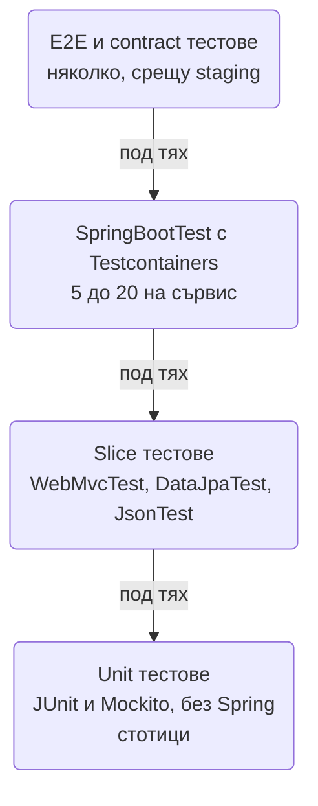
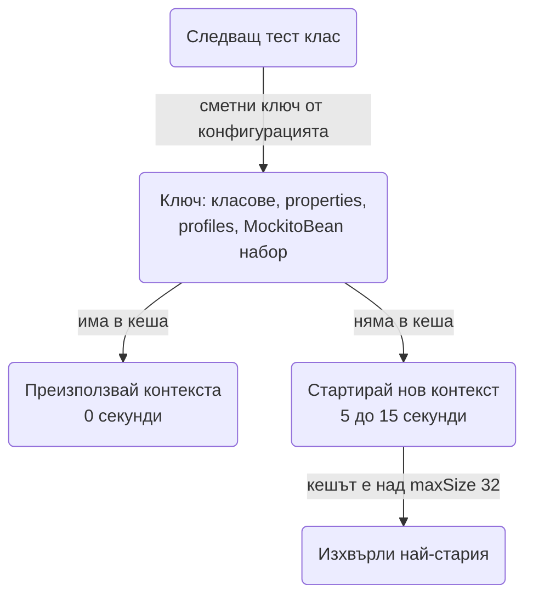

# Testing

Тестовете в Spring Boot сървис не са един вид: имаш бързи unit тестове без Spring, slice тестове, които вдигат само web или само JPA слоя, и малко на брой integration тестове с реална база и Kafka в Testcontainers. Разликата в цена е огромна (милисекунди срещу секунди), затова изборът на правилното ниво за всеки тест определя дали suite-ът ти върви 30 секунди или 15 минути. Този документ показва кой annotation на кой слой, как да тестваш controller-и с `MockMvc`, repository-та с Postgres в контейнер, целия сървис с `@SpringBootTest`, как да не губиш време от context caching, и как да подредиш всичко в Maven и CI. Примерите са върху домейн с поръчки и плащания и могат да се копират директно.

| Какво тестваш | Annotation | Какво се вдига | Време за старт |
|---|---|---|---|
| Сървис, domain логика | нищо, `@ExtendWith(MockitoExtension.class)` | нищо | милисекунди |
| Controller, validation, security | `@WebMvcTest` | MVC, Jackson, Security, advice | 1 до 2 секунди |
| Repository, заявки, mapping | `@DataJpaTest` + Testcontainers | JPA, DataSource, Flyway | 3 до 6 секунди с контейнер |
| JSON сериализация | `@JsonTest` | Jackson | под секунда |
| HTTP клиент към външно API | `@RestClientTest` | `RestClient.Builder`, Jackson | под секунда |
| Целият сървис през HTTP | `@SpringBootTest(webEnvironment = RANDOM_PORT)` | всичко | 5 до 15 секунди |
| Архитектурни правила | ArchUnit | нищо | секунда |

## 1. Зависимости и настройка

```xml pom.xml
<dependency>
    <groupId>org.springframework.boot</groupId>
    <artifactId>spring-boot-starter-test</artifactId>
    <scope>test</scope>
</dependency>
<dependency>
    <groupId>org.springframework.boot</groupId>
    <artifactId>spring-boot-testcontainers</artifactId>
    <scope>test</scope>
</dependency>
<dependency>
    <groupId>org.testcontainers</groupId>
    <artifactId>junit-jupiter</artifactId>
    <scope>test</scope>
</dependency>
<dependency>
    <groupId>org.testcontainers</groupId>
    <artifactId>postgresql</artifactId>
    <scope>test</scope>
</dependency>
<dependency>
    <groupId>org.testcontainers</groupId>
    <artifactId>kafka</artifactId>
    <scope>test</scope>
</dependency>
<dependency>
    <groupId>org.springframework.security</groupId>
    <artifactId>spring-security-test</artifactId>
    <scope>test</scope>
</dependency>
<dependency>
    <groupId>com.tngtech.archunit</groupId>
    <artifactId>archunit-junit5</artifactId>
    <version>1.3.0</version> <!-- виж последната версия в Maven Central -->
    <scope>test</scope>
</dependency>
```

`spring-boot-starter-test` съдържа JUnit 5 (Jupiter), AssertJ, Mockito, Hamcrest, JSONassert, JsonPath, Awaitility и Spring Test с Spring Boot Test. Версиите на Testcontainers се управляват от Boot. Тестов профил:

```yaml src/test/resources/application-test.yml
# src/test/resources/application-test.yml
spring:
  jpa:
    open-in-view: false
  kafka:
    consumer:
      auto-offset-reset: earliest
logging:
  level:
    root: warn
    com.acme.shop: info
    org.testcontainers: info
```

Активира се с `@ActiveProfiles("test")` върху тест класа или базовия клас. Повече за профилите: [Конфигурация и профили](Configuration_Profiles.md).

## 2. Пирамидата за Spring сървис



Правилото: тествай на най-ниското ниво, което може да хване грешката. Бизнес правило "поръчка над 1000 EUR изисква одобрение" е unit тест на `OrderService` с mock repository, не `@SpringBootTest`. "GET /orders/42 връща 404 с ProblemDetail" е `@WebMvcTest`. "Заявката с JOIN FETCH не прави N+1" е `@DataJpaTest` с Postgres. "Платена поръчка публикува Kafka събитие и invoicing го консумира" е един `@SpringBootTest` с контейнери. Ако всичко е `@SpringBootTest`, suite-ът става бавен и крехък и хората спират да го пускат локално.

## 3. Минимален работещ пример: unit тест

```java src/test/java/com/acme/shop/order/OrderServiceTest.java
package com.acme.shop.order;

import org.junit.jupiter.api.Test;
import org.junit.jupiter.api.extension.ExtendWith;
import org.mockito.ArgumentCaptor;
import org.mockito.InjectMocks;
import org.mockito.Mock;
import org.mockito.junit.jupiter.MockitoExtension;

import static org.assertj.core.api.Assertions.assertThat;
import static org.assertj.core.api.Assertions.assertThatThrownBy;
import static org.mockito.ArgumentMatchers.any;
import static org.mockito.BDDMockito.given;
import static org.mockito.BDDMockito.then;

@ExtendWith(MockitoExtension.class)
class OrderServiceTest {

    @Mock OrderRepository orders;
    @Mock PaymentGatewayClient payments;
    @Mock ApplicationEventPublisher events;
    @InjectMocks OrderService service;

    @Test
    void payMarksOrderPaidAndPublishesEvent() {
        var order = OrderMother.pending(42L);
        given(orders.findById(42L)).willReturn(Optional.of(order));
        given(payments.charge(order)).willReturn(new PaymentDto("pay_1", 42L, 1999L, "EUR", "PAID"));

        var result = service.pay(42L);

        assertThat(result.status()).isEqualTo(OrderStatus.PAID);
        assertThat(result.paymentId()).isEqualTo("pay_1");

        var captor = ArgumentCaptor.forClass(OrderPaidEvent.class);
        then(events).should().publishEvent(captor.capture());
        assertThat(captor.getValue().orderId()).isEqualTo(42L);
    }

    @Test
    void payUnknownOrderThrows() {
        given(orders.findById(99L)).willReturn(Optional.empty());

        assertThatThrownBy(() -> service.pay(99L))
                .isInstanceOf(OrderNotFoundException.class)
                .hasMessageContaining("99");

        then(payments).shouldHaveNoInteractions();
    }

    @ParameterizedTest
    @CsvSource({"999_99, false", "1000_00, true", "5000_00, true"})
    void ordersAboveThresholdNeedApproval(long totalMinor, boolean needsApproval) {
        var order = OrderMother.pendingWithTotal(1L, totalMinor);
        assertThat(order.needsApproval()).isEqualTo(needsApproval);
    }
}
```

`MockitoExtension` е strict: неизползван stub е грешка, което те пази от мъртви `given`-и. `@InjectMocks` работи с constructor injection, точно както Spring. AssertJ идиоми, които си струва да знаеш: `extracting("id", "status")`, `containsExactlyInAnyOrder`, `usingRecursiveComparison().ignoringFields("createdAt")` за DTO-та, `isInstanceOfSatisfying(ProblemDetail.class, p -> ...)`.

Object mother за тестови данни, вместо 10 реда setup във всеки тест:

```java src/test/java/com/acme/shop/order/OrderMother.java
package com.acme.shop.order;

public final class OrderMother {

    public static Order pending(long id) {
        return pendingWithTotal(id, 1999L);
    }

    public static Order pendingWithTotal(long id, long totalMinor) {
        return new Order(id, 7L, totalMinor, "EUR", OrderStatus.PENDING, null, Instant.parse("2025-01-01T10:00:00Z"));
    }
}
```

За случайни, но реалистични данни (имена, адреси, IBAN) има Datafaker, виж [Seeding](Seeding.md).

## 4. Controller тестове с @WebMvcTest

`@WebMvcTest(OrderController.class)` вдига само MVC слоя: controller-а, `@RestControllerAdvice`, Jackson, validation, Security filter chain, без сървиси и база. Сървисите се подменят с `@MockitoBean` (Boot 3.4+, заменя `@MockBean`).

```java src/test/java/com/acme/shop/order/OrderControllerTest.java
package com.acme.shop.order;

import org.springframework.boot.test.autoconfigure.web.servlet.WebMvcTest;
import org.springframework.test.context.bean.override.mockito.MockitoBean;
import org.springframework.test.web.servlet.MockMvc;

import static org.springframework.security.test.web.servlet.request.SecurityMockMvcRequestPostProcessors.csrf;
import static org.springframework.security.test.web.servlet.request.SecurityMockMvcRequestPostProcessors.jwt;
import static org.springframework.test.web.servlet.request.MockMvcRequestBuilders.get;
import static org.springframework.test.web.servlet.request.MockMvcRequestBuilders.post;
import static org.springframework.test.web.servlet.result.MockMvcResultMatchers.*;

@WebMvcTest(OrderController.class)
@Import(SecurityConfig.class)
class OrderControllerTest {

    @Autowired MockMvc mvc;
    @MockitoBean OrderService service;

    @Test
    @WithMockUser(roles = "CUSTOMER")
    void getReturnsOrder() throws Exception {
        given(service.get(42L)).willReturn(OrderMother.pending(42L));

        mvc.perform(get("/orders/{id}", 42))
                .andExpect(status().isOk())
                .andExpect(jsonPath("$.id").value(42))
                .andExpect(jsonPath("$.status").value("PENDING"))
                .andExpect(content().json("""
                        {"id":42,"status":"PENDING","currency":"EUR"}
                        """));   // lenient: допълнителните полета не пречат
    }

    @Test
    @WithMockUser(roles = "CUSTOMER")
    void getUnknownReturnsProblemDetail() throws Exception {
        given(service.get(99L)).willThrow(new OrderNotFoundException(99L));

        mvc.perform(get("/orders/{id}", 99))
                .andExpect(status().isNotFound())
                .andExpect(content().contentType("application/problem+json"))
                .andExpect(jsonPath("$.title").value("Not Found"))
                .andExpect(jsonPath("$.detail").value("Order 99 not found"));
    }

    @Test
    void postWithInvalidBodyReturns400() throws Exception {
        mvc.perform(post("/orders")
                        .with(jwt().authorities(new SimpleGrantedAuthority("ROLE_CUSTOMER")))
                        .with(csrf())
                        .contentType(MediaType.APPLICATION_JSON)
                        .content("""
                                {"customerId":null,"lines":[]}
                                """))
                .andExpect(status().isBadRequest())
                .andExpect(jsonPath("$.errors[?(@.field=='customerId')]").exists())
                .andExpect(jsonPath("$.errors[?(@.field=='lines')]").exists());

        then(service).shouldHaveNoInteractions();
    }

    @Test
    void anonymousIsRejected() throws Exception {
        mvc.perform(get("/orders/{id}", 42)).andExpect(status().isUnauthorized());
    }
}
```

Какво става тук:

- `@Import(SecurityConfig.class)` е нужен, защото `@WebMvcTest` не сканира `@Configuration` класове извън MVC слоя. Без него получаваш default security (всичко изисква basic auth).
- `@WithMockUser` слага `Authentication` в контекста. `jwt()` симулира resource server с JWT и ти позволява да зададеш claims и authorities. `csrf()` е нужен за POST, ако CSRF не е изключен за API-то, виж [Authentication](Authentication.md).
- Validation грешките и `ProblemDetail` форматът идват от твоя `@RestControllerAdvice`, който `@WebMvcTest` включва автоматично. Структурата на `errors` зависи от handler-а ти: [Валидации](Validation.md), [Грешки и ProblemDetail](Exception_Handling.md).

### MockMvcTester

От Boot 3.4 има `MockMvcTester`, AssertJ стил без checked exceptions и без static imports:

```java src/test/java/com/acme/shop/order/OrderControllerTest.java
@Autowired MockMvcTester mvc;

@Test
@WithMockUser(roles = "CUSTOMER")
void getReturnsOrder() {
    given(service.get(42L)).willReturn(OrderMother.pending(42L));

    assertThat(mvc.get().uri("/orders/{id}", 42))
            .hasStatusOk()
            .bodyJson()
            .extractingPath("$.status").isEqualTo("PENDING");
}
```

Двата API-та работят в един и същ тест клас. За нов код `MockMvcTester` е по-четим, за съществуващ не мигрирай заради мигрирането.

## 5. Repository тестове с @DataJpaTest и Testcontainers

`@DataJpaTest` вдига JPA, `DataSource`, Flyway и repository-тата, без web слоя. По подразбиране подменя базата с embedded H2, което е грешно: H2 не е Postgres, и заявка, която минава в H2, може да падне в prod. `@AutoConfigureTestDatabase(replace = NONE)` плюс `@ServiceConnection` върху контейнера дават реалния Postgres.

```java src/test/java/com/acme/shop/order/OrderRepositoryTest.java
package com.acme.shop.order;

import org.springframework.boot.test.autoconfigure.jdbc.AutoConfigureTestDatabase;
import org.springframework.boot.test.autoconfigure.orm.jpa.DataJpaTest;
import org.springframework.boot.test.autoconfigure.orm.jpa.TestEntityManager;
import org.springframework.boot.testcontainers.service.connection.ServiceConnection;
import org.testcontainers.containers.PostgreSQLContainer;
import org.testcontainers.junit.jupiter.Container;
import org.testcontainers.junit.jupiter.Testcontainers;

import static org.springframework.boot.test.autoconfigure.jdbc.AutoConfigureTestDatabase.Replace.NONE;

@DataJpaTest
@AutoConfigureTestDatabase(replace = NONE)
@Testcontainers
class OrderRepositoryTest {

    @Container
    @ServiceConnection
    static PostgreSQLContainer<?> postgres = new PostgreSQLContainer<>("postgres:16-alpine");

    @Autowired OrderRepository orders;
    @Autowired TestEntityManager em;

    @Test
    void findsPaidOrdersForCustomerWithLines() {
        var customer = em.persist(new Customer("ivan@example.com"));
        var paid = em.persist(OrderMother.paidFor(customer));
        paid.addLine(em.persist(new Product("SKU-1", 999L)), 2);
        em.persist(OrderMother.pendingFor(customer));
        em.flush();
        em.clear();   // иначе четеш от first-level cache и не тестваш заявката

        var result = orders.findPaidWithLinesByCustomerId(customer.getId());

        assertThat(result).hasSize(1);
        assertThat(result.getFirst().getLines()).hasSize(1);   // без LazyInitializationException: JOIN FETCH
    }
}
```

`static` контейнерът се стартира веднъж за класа. `@ServiceConnection` чете host, port, user и password от контейнера и ги подава на `DataSource`-а, без `@DynamicPropertySource`. Flyway миграциите се прилагат при старт на контекста, така че тестваш и тях ([Миграции](Migrations.md)). `em.flush()` и `em.clear()` преди заявката са задължителни, иначе Hibernate ти връща обектите от паметта и `JOIN FETCH` не се проверява.

### Проверка за N+1 със статистики

```java src/test/java/com/acme/shop/order/OrderQueryCountTest.java
package com.acme.shop.order;

@DataJpaTest(properties = "spring.jpa.properties.hibernate.generate_statistics=true")
@AutoConfigureTestDatabase(replace = NONE)
@Testcontainers
class OrderQueryCountTest {

    @Container @ServiceConnection
    static PostgreSQLContainer<?> postgres = new PostgreSQLContainer<>("postgres:16-alpine");

    @Autowired OrderRepository orders;
    @Autowired EntityManager em;

    @Test
    void listingOrdersWithLinesIsOneQuery() {
        var stats = em.getEntityManagerFactory().unwrap(SessionFactory.class).getStatistics();
        stats.clear();

        var result = orders.findAllWithLines();
        result.forEach(o -> o.getLines().size());   // форсира достъп до релацията

        assertThat(stats.getPrepareStatementCount()).isEqualTo(1);
    }
}
```

Този тест хваща регресии, когато някой махне `@EntityGraph` или `JOIN FETCH`. Повече за lazy loading и N+1: [База данни и ORM](Database_ORM.md), [Релации](Relations.md).

## 6. Пълни integration тестове със @SpringBootTest

### Споделен базов клас с контейнери

Контейнерите се вдигат веднъж за цялата JVM, а не за всеки тест клас. Най-простият начин е `static` полета в абстрактен базов клас без `@Container` (Testcontainers ги спира при край на JVM през Ryuk):

```java src/test/java/com/acme/shop/AbstractIntegrationTest.java
package com.acme.shop;

import org.springframework.boot.test.context.SpringBootTest;
import org.springframework.boot.testcontainers.service.connection.ServiceConnection;
import org.springframework.test.context.ActiveProfiles;
import org.testcontainers.containers.GenericContainer;
import org.testcontainers.containers.PostgreSQLContainer;
import org.testcontainers.kafka.KafkaContainer;

@SpringBootTest(webEnvironment = SpringBootTest.WebEnvironment.RANDOM_PORT)
@ActiveProfiles("test")
public abstract class AbstractIntegrationTest {

    @ServiceConnection
    static final PostgreSQLContainer<?> postgres =
            new PostgreSQLContainer<>("postgres:16-alpine").withReuse(true);

    @ServiceConnection
    static final KafkaContainer kafka =
            new KafkaContainer("apache/kafka-native:3.8.0").withReuse(true);

    @ServiceConnection(name = "redis")
    static final GenericContainer<?> redis =
            new GenericContainer<>("redis:7-alpine").withExposedPorts(6379).withReuse(true);

    static {
        postgres.start();
        kafka.start();
        redis.start();
    }
}
```

`withReuse(true)` оставя контейнера жив след края на JVM и следващият `mvn test` го намира по hash на конфигурацията, което спестява 5 до 10 секунди на всяко пускане локално. Изисква `testcontainers.reuse.enable=true` в `~/.testcontainers.properties` на машината на разработчика; в CI без този файл reuse се игнорира и контейнерите се спират нормално. `@ServiceConnection(name = "redis")` казва на Boot кой `ConnectionDetails` да създаде за generic контейнер.

`@ServiceConnection` срещу `@DynamicPropertySource`: първото е декларативно и Boot знае кои properties да зададе за Postgres, Kafka, Redis, RabbitMQ, Mongo и т.н. Второто е за всичко останало: WireMock URL, custom property, контейнер без поддръжка.

```java src/test/java/com/acme/shop/AbstractIntegrationTest.java
@DynamicPropertySource
static void props(DynamicPropertyRegistry registry) {
    registry.add("payments.base-url", wiremock::baseUrl);
}
```

### Тест през HTTP

```java src/test/java/com/acme/shop/order/OrderPaymentFlowIT.java
package com.acme.shop.order;

class OrderPaymentFlowIT extends AbstractIntegrationTest {

    @LocalServerPort int port;
    @Autowired RestClient.Builder restClientBuilder;
    @Autowired JdbcClient jdbc;
    @Autowired KafkaTemplate<String, Object> kafka;

    @MockitoBean PaymentGatewayClient payments;

    RestClient client;

    @BeforeEach
    void setUp() {
        client = restClientBuilder.baseUrl("http://localhost:" + port).build();
        jdbc.sql("TRUNCATE TABLE order_line, orders RESTART IDENTITY CASCADE").update();
    }

    @Test
    void payingAnOrderPersistsAndPublishesEvent() {
        jdbc.sql("INSERT INTO orders (id, customer_id, total_minor, currency, status) VALUES (42, 7, 1999, 'EUR', 'PENDING')").update();
        given(payments.charge(any())).willReturn(new PaymentDto("pay_1", 42L, 1999L, "EUR", "PAID"));

        var response = client.post()
                .uri("/orders/{id}/pay", 42)
                .header("Authorization", "Bearer " + TestTokens.customer(7L))
                .retrieve()
                .toEntity(OrderDto.class);

        assertThat(response.getStatusCode()).isEqualTo(HttpStatus.OK);
        assertThat(response.getBody().status()).isEqualTo("PAID");

        var status = jdbc.sql("SELECT status FROM orders WHERE id = 42").query(String.class).single();
        assertThat(status).isEqualTo("PAID");

        await().atMost(Duration.ofSeconds(5)).untilAsserted(() ->
                assertThat(jdbc.sql("SELECT count(*) FROM invoice WHERE order_id = 42").query(Long.class).single())
                        .isEqualTo(1L));
    }
}
```

Външният платежен gateway е `@MockitoBean`, защото в integration тест не искаш мрежа към трети страни; за реалистичен HTTP слой ползвай WireMock ([HTTP клиенти](HTTP_Clients.md)). `TestRestTemplate` върши същата работа като `RestClient` тук и не хвърля на 4xx, което е удобно за тестове на грешки; `RestClient` се ползва, когато искаш същия API като в production кода. Awaitility (`await().atMost(...).untilAsserted(...)`) е единственият правилен начин да чакаш async резултат, `Thread.sleep` прави тестовете бавни и flaky. Kafka тестове: [Message brokers](Message_Brokers.md).

## 7. Други slice тестове

### @JsonTest

```java src/test/java/com/acme/shop/order/OrderDtoJsonTest.java
package com.acme.shop.order;

@JsonTest
class OrderDtoJsonTest {

    @Autowired JacksonTester<OrderDto> json;

    @Test
    void serializesMoneyAsMinorUnitsAndIsoDates() throws Exception {
        var dto = new OrderDto(42L, "PAID", 1999L, "EUR", Instant.parse("2025-01-01T10:00:00Z"));

        assertThat(json.write(dto)).extractingJsonPathNumberValue("$.totalMinor").isEqualTo(1999);
        assertThat(json.write(dto)).extractingJsonPathStringValue("$.createdAt").isEqualTo("2025-01-01T10:00:00Z");
    }

    @Test
    void ignoresUnknownFields() throws Exception {
        var parsed = json.parseObject("""
                {"id":42,"status":"PAID","totalMinor":1999,"currency":"EUR","createdAt":"2025-01-01T10:00:00Z","extra":1}
                """);
        assertThat(parsed.id()).isEqualTo(42L);
    }
}
```

Ползва същия `ObjectMapper` с твоите `spring.jackson.*` настройки и `@JsonComponent` модули, затова хваща разлики между production и тест сериализация. DTO правилата: [DTO и mapping](DTO_Mapping.md).

### @RestClientTest

```java src/test/java/com/acme/shop/payment/PaymentsClientTest.java
package com.acme.shop.payment;

@RestClientTest(PaymentsClient.class)
@Import(PaymentsClientConfig.class)
class PaymentsClientTest {

    @Autowired PaymentsClient client;
    @Autowired MockRestServiceServer server;

    @Test
    void mapsResponse() {
        server.expect(requestTo("https://payments.test/payments/pay_1"))
                .andRespond(withSuccess("{\"id\":\"pay_1\",\"status\":\"PAID\"}", MediaType.APPLICATION_JSON));

        assertThat(client.get("pay_1").status()).isEqualTo("PAID");
    }
}
```

`MockRestServiceServer` се закача за `RestClient.Builder`, затова клиентът трябва да е построен от инжектирания builder. За timeouts, retry и circuit breaker ти трябва WireMock, който е реален сървър: подробно в [HTTP клиенти](HTTP_Clients.md).

## 8. Транзакции в тестове

`@Transactional` върху тест клас отваря транзакция преди всеки тест и прави rollback след него. Удобно (чиста база без truncate), но крие bugs:

| | `@Transactional` на теста | Без, с truncate между тестовете |
|---|---|---|
| Чиста база | автоматично с rollback | ръчно, `@Sql` или `JdbcClient` |
| Lazy loading | работи навсякъде, защото сесията е отворена | както в production: `LazyInitializationException` се вижда |
| `@Transactional(propagation = REQUIRES_NEW)` в кода | не се тества реално | тества се |
| Constraint грешки при commit | не се виждат, няма commit | виждат се |
| `@TransactionalEventListener(AFTER_COMMIT)` | не се задейства | задейства се |
| Скорост | бързо | малко по-бавно |

Правило: `@Transactional` е ок за `@DataJpaTest` (там тестваш заявки, не транзакционни граници; `@DataJpaTest` го включва по подразбиране). За `@SpringBootTest`, който тества сървис с `@Transactional` методи, events или `REQUIRES_NEW`, не слагай `@Transactional` на теста и чисти таблиците:

```java src/test/java/com/acme/shop/order/OrderServiceIT.java
@Sql(scripts = "/sql/clean.sql", executionPhase = Sql.ExecutionPhase.AFTER_TEST_METHOD)
class OrderServiceIT extends AbstractIntegrationTest { ... }
```

```sql src/test/resources/sql/clean.sql
-- src/test/resources/sql/clean.sql
TRUNCATE TABLE order_line, orders, invoice RESTART IDENTITY CASCADE;
```

Ако все пак тестът е `@Transactional` и ти трябва commit за една проверка: `TestTransaction.flagForCommit(); TestTransaction.end();` и после `TestTransaction.start()` за нова. Транзакционните граници и капаните около тях: [Транзакции и locking](Transactions.md).

## 9. Events, async, scheduled и security правила

### Events

```java src/test/java/com/acme/shop/order/OrderEventsTest.java
package com.acme.shop.order;

@SpringBootTest
@RecordApplicationEvents
class OrderEventsTest {

    @Autowired OrderService service;
    @Autowired ApplicationEvents events;
    @MockitoBean PaymentGatewayClient payments;

    @Test
    void payPublishesOrderPaid() {
        given(payments.charge(any())).willReturn(new PaymentDto("pay_1", 42L, 1999L, "EUR", "PAID"));
        // ... поръчка 42 съществува

        service.pay(42L);

        assertThat(events.stream(OrderPaidEvent.class)).hasSize(1);
    }
}
```

`@RecordApplicationEvents` записва всички събития от теста. Listener-ите с `@Async` или `@TransactionalEventListener` се тестват в integration тест с Awaitility, както в раздел 6. Подробно: [Events](Events.md).

### Scheduled задачи

Не чакай cron-а. Тествай метода директно (`invoiceReminderJob.run()`) и в отделен тест провери, че `@Scheduled` е регистриран (`ScheduledTaskHolder` bean или `/actuator/scheduledtasks`). Изключи scheduling в тестовия профил, за да не се стартират задачи по средата на тест: `spring.task.scheduling.enabled` няма такъв ключ, затова условно `@EnableScheduling` с `@ConditionalOnProperty(name = "app.scheduling.enabled", matchIfMissing = true)` и `app.scheduling.enabled=false` в `application-test.yml`. Виж [Cron, @Async и опашки](Scheduling_Queues.md).

### Authorization правила

Method security (`@PreAuthorize`) се тества най-евтино с `@SpringBootTest` без web environment и `@WithMockUser`:

```java src/test/java/com/acme/shop/order/OrderServiceAuthorizationTest.java
package com.acme.shop.order;

@SpringBootTest(webEnvironment = SpringBootTest.WebEnvironment.NONE)
class OrderServiceAuthorizationTest {

    @Autowired OrderService service;
    @MockitoBean OrderRepository orders;

    @Test
    @WithMockUser(username = "ivan", roles = "CUSTOMER")
    void customerCannotCancelOthersOrder() {
        given(orders.findById(42L)).willReturn(Optional.of(OrderMother.pendingOwnedBy("maria")));

        assertThatThrownBy(() -> service.cancel(42L)).isInstanceOf(AccessDeniedException.class);
    }
}
```

URL правилата се тестват в `@WebMvcTest` (раздел 4). Моделът на правата: [Authorization](Authorization.md).

## 10. Context caching

Spring Test кешира `ApplicationContext` между тест класовете с еднаква конфигурация. Два `@SpringBootTest` класа с еднакви properties, profiles и `@MockitoBean` набор споделят един контекст и вторият стартира за 0 секунди. Всяка разлика създава нов контекст.



Какво прави нов контекст: различен `@MockitoBean` набор (всеки mock е част от ключа), `@TestPropertySource` с различни стойности, `@ActiveProfiles`, `@DynamicPropertySource` с различни стойности, `@DirtiesContext`, `@Import` на различни конфигурации. Какво не: различни тест методи, `@Sql`, `@WithMockUser`.

Практика:

- Един `AbstractIntegrationTest` с фиксиран набор от контейнери и properties. Всички IT класове го наследяват без допълнителни анотации.
- Mock-овете за външни системи (`PaymentGatewayClient`) са в базовия клас, не в отделните тестове, за да не менят ключа.
- `@DirtiesContext` почти никога. Ако тестът цапа контекста (статично състояние, кеш), оправи теста.
- `spring.main.lazy-initialization=true` в тестовия профил ускорява старта, когато контекстът има много bean-ове, но крие грешки в конфигурацията на bean-ове, които тестът не докосва. Ползвай го само ако стартът е реален проблем.
- Логвай `Spring test ApplicationContext cache statistics` с `logging.level.org.springframework.test.context.cache=debug`, за да видиш колко контекста реално се вдигат.

## 11. Testcontainers при разработка

От Boot 3.1 можеш да стартираш приложението локално с контейнери вместо инсталиран Postgres и Kafka. Конфигурацията живее в `src/test/java`:

```java src/test/java/com/acme/shop/TestcontainersConfiguration.java
package com.acme.shop;

import org.springframework.boot.test.context.TestConfiguration;
import org.springframework.boot.testcontainers.service.connection.ServiceConnection;
import org.springframework.context.annotation.Bean;

@TestConfiguration(proxyBeanMethods = false)
public class TestcontainersConfiguration {

    @Bean
    @ServiceConnection
    PostgreSQLContainer<?> postgres() {
        return new PostgreSQLContainer<>("postgres:16-alpine").withReuse(true);
    }

    @Bean
    @ServiceConnection
    KafkaContainer kafka() {
        return new KafkaContainer("apache/kafka-native:3.8.0").withReuse(true);
    }
}
```

```java src/test/java/com/acme/shop/TestShopApplication.java
package com.acme.shop;

public class TestShopApplication {

    public static void main(String[] args) {
        SpringApplication.from(ShopApplication::main)
                .with(TestcontainersConfiguration.class)
                .run(args);
    }
}
```

Пускаш `TestShopApplication` от IDE-то или с `mvn spring-boot:test-run` и получаваш работещ сървис с чисти контейнери, без локална инсталация. Същата `TestcontainersConfiguration` се ползва и в тестове с `@Import(TestcontainersConfiguration.class)` вместо static полетата от раздел 6; двата подхода са еквивалентни, избери един за проекта. Spring Boot DevTools с `spring.devtools.restart` рестартира приложението без да рестартира контейнерите.

## 12. Архитектурни тестове и mutation testing

ArchUnit проверява правила, които code review пропуска: controller не вика repository, domain не зависи от Spring Web, нищо не ползва `java.util.Date`.

```java src/test/java/com/acme/shop/ArchitectureTest.java
package com.acme.shop;

import com.tngtech.archunit.junit.AnalyzeClasses;
import com.tngtech.archunit.junit.ArchTest;
import com.tngtech.archunit.lang.ArchRule;

import static com.tngtech.archunit.lang.syntax.ArchRuleDefinition.noClasses;
import static com.tngtech.archunit.library.Architectures.layeredArchitecture;

@AnalyzeClasses(packages = "com.acme.shop")
class ArchitectureTest {

    @ArchTest
    static final ArchRule layers = layeredArchitecture().consideringAllDependencies()
            .layer("Web").definedBy("..web..")
            .layer("Service").definedBy("..service..")
            .layer("Repository").definedBy("..repository..")
            .whereLayer("Web").mayNotBeAccessedByAnyLayer()
            .whereLayer("Service").mayOnlyBeAccessedByLayers("Web")
            .whereLayer("Repository").mayOnlyBeAccessedByLayers("Service");

    @ArchTest
    static final ArchRule noFieldInjection = noClasses()
            .should().dependOnClassesThat().haveFullyQualifiedName("org.springframework.beans.factory.annotation.Autowired");

    @ArchTest
    static final ArchRule controllersDoNotUseEntities = noClasses().that().resideInAPackage("..web..")
            .should().dependOnClassesThat().areAnnotatedWith(jakarta.persistence.Entity.class);
}
```

Mutation testing с PIT (`org.pitest:pitest-maven` плюс `pitest-junit5-plugin`) променя кода (обръща условия, маха извиквания) и проверява дали тестовете падат. Coverage казва, че редът е изпълнен; mutation score казва, че е проверен. Струва си за domain и service пакетите, не за controller-и и конфигурация, и се пуска nightly, не на всеки commit, защото е бавно.

## 13. Maven, CI и покритие

### Surefire и Failsafe

Unit и slice тестове в Surefire (`mvn test`), integration тестовете с контейнери в Failsafe (`mvn verify`), по naming convention `*IT.java`:

```xml pom.xml
<plugin>
    <groupId>org.apache.maven.plugins</groupId>
    <artifactId>maven-surefire-plugin</artifactId>
    <configuration>
        <excludes>
            <exclude>**/*IT.java</exclude>
        </excludes>
    </configuration>
</plugin>
<plugin>
    <groupId>org.apache.maven.plugins</groupId>
    <artifactId>maven-failsafe-plugin</artifactId>
    <executions>
        <execution>
            <goals>
                <goal>integration-test</goal>
                <goal>verify</goal>
            </goals>
        </execution>
    </executions>
</plugin>
<plugin>
    <groupId>org.jacoco</groupId>
    <artifactId>jacoco-maven-plugin</artifactId>
    <version>0.8.12</version> <!-- виж последната версия в Maven Central -->
    <executions>
        <execution>
            <goals><goal>prepare-agent</goal></goals>
        </execution>
        <execution>
            <id>report</id>
            <phase>verify</phase>
            <goals><goal>report</goal></goals>
        </execution>
        <execution>
            <id>check</id>
            <goals><goal>check</goal></goals>
            <configuration>
                <rules>
                    <rule>
                        <element>BUNDLE</element>
                        <limits>
                            <limit>
                                <counter>LINE</counter>
                                <value>COVEREDRATIO</value>
                                <minimum>0.70</minimum>
                            </limit>
                        </limits>
                    </rule>
                </rules>
            </configuration>
        </execution>
    </executions>
</plugin>
```

Разделението дава бърз локален цикъл (`mvn test` за 30 секунди) и пълна проверка в CI (`mvn verify`). Failsafe не спира build-а при `integration-test`, а при `verify`, така че `post-integration-test` фазата (спиране на контейнери, ако ги управляваш оттам) винаги се изпълнява.

### Паралелни тестове

```properties src/test/resources/junit-platform.properties
# src/test/resources/junit-platform.properties
junit.jupiter.execution.parallel.enabled=true
junit.jupiter.execution.parallel.mode.default=same_thread
junit.jupiter.execution.parallel.mode.classes.default=concurrent
```

Unit и slice тестове вървят паралелно по класове без проблем. Integration тестовете със споделена база не: два теста, които пишат в `orders` едновременно, се виждат взаимно. Или ги маркираш с `@Execution(SAME_THREAD)` и `@ResourceLock("db")`, или ги оставяш в Failsafe с `forkCount=1`. Surefire `forkCount` и `reuseForks` са алтернатива на JUnit паралелизма с по-груба, но по-безопасна изолация.

### GitHub Actions

```yaml .github/workflows/ci.yml
name: ci
on: [push, pull_request]
jobs:
  build:
    runs-on: ubuntu-latest
    steps:
      - uses: actions/checkout@v4
      - uses: actions/setup-java@v4
        with:
          distribution: temurin
          java-version: '21'
          cache: maven
      - run: ./mvnw -B verify
      - uses: actions/upload-artifact@v4
        if: always()
        with:
          name: reports
          path: |
            target/surefire-reports
            target/failsafe-reports
            target/site/jacoco
```

`ubuntu-latest` има Docker и Testcontainers работи без настройка. В GitLab CI или Jenkins с Docker-in-Docker трябва `DOCKER_HOST` и `TESTCONTAINERS_HOST_OVERRIDE`. Pull-ът на образите е най-бавната част: фиксирай tag-ове (`postgres:16-alpine`, не `latest`) и помисли за registry mirror.

### Flaky тестове

Flaky тест (понякога минава, понякога не) е по-лош от липсващ тест, защото учи екипа да игнорира червен build. Причините почти винаги са: `Thread.sleep` вместо Awaitility, споделено състояние между тестове (статични полета, незачистена база, кеш), зависимост от ред на изпълнение, реално време (`Instant.now()` вместо инжектиран `Clock`), и портове, зададени твърдо. Политиката: flaky тест се оправя или се трие същия ден, не се слага `@RepeatedTest` или retry в CI.

### Какво покритие е смислено

70% line coverage като долна граница за целия модул, с очакване за 85 до 90% в `service` и `domain` пакетите и без изискване за `config`, DTO-та и генериран код. 100% е сигнал, че хората пишат тестове за coverage, а не за поведение. JaCoCo `check` с `BUNDLE` правило пази от спад; `excludes` за `**/config/**` и `**/*Dto.class` държат числото честно.

## 14. Капани

- Всичко `@SpringBootTest`. Suite-ът минава 15 минути, никой не го пуска локално, грешките се откриват в CI два часа по-късно. Unit за логика, slice за слоеве, integration само за реалните интеграции.
- H2 вместо Postgres в `@DataJpaTest`. Заявка с `ON CONFLICT`, `jsonb` или `ILIKE` минава в H2 с режим на съвместимост и пада в production. `@AutoConfigureTestDatabase(replace = NONE)` плюс Testcontainers.
- `@Transactional` на integration тест, който тества транзакционно поведение. Rollback-ът крие constraint грешки при commit, `AFTER_COMMIT` listeners не се задействат, lazy loading работи там, където в production хвърля.
- Различен `@MockitoBean` набор във всеки тест клас. Всеки клас вдига нов контекст и suite-ът се забавя линейно с броя класове. Дръж mock-овете в общия базов клас.
- `@Container` на нестатично поле. Нов контейнер за всеки тест метод, по 5 секунди старт на всеки.
- `Thread.sleep` за async проверки. Или е твърде кратко (flaky), или е твърде дълго (бавно). Awaitility с `untilAsserted`.
- Тестове, зависещи от ред. JUnit 5 не гарантира ред без `@TestMethodOrder`; тест, който разчита на данни от предишния, пада при паралелизъм или сам.
- `em.flush()` и `em.clear()` липсват в `@DataJpaTest`. Четеш от first-level cache и заявката, която "тестваш", никога не се изпълнява.
- `@WebMvcTest` без `@Import(SecurityConfig.class)`. Тестът минава с default security, а production правилата не са проверени, или обратното: всичко е 401 и хората слагат `@AutoConfigureMockMvc(addFilters = false)`, което изключва security изцяло.
- `latest` tag на контейнерен образ. Тестовете започват да падат в сряда без промяна в кода, защото Postgres 17 е излязъл.
- Проверка на имплементация вместо поведение. `verify(repository).save(any())` с 15 аргумента на `ArgumentCaptor` се чупи при всеки refactoring; проверявай резултата и страничните ефекти, които имат значение.

## 15. Чеклист

- [ ] `spring-boot-starter-test`, `spring-boot-testcontainers`, `testcontainers:junit-jupiter`, `postgresql`, `spring-security-test` в pom-а с `test` scope.
- [ ] `application-test.yml` с тихи логове и `@ActiveProfiles("test")` в базовия клас.
- [ ] Unit тестове с `MockitoExtension` за service и domain, с object mothers за данни.
- [ ] `@WebMvcTest` за всеки controller с `@Import(SecurityConfig.class)`, покриващ 200, 404 с `ProblemDetail`, 400 с validation и 401/403.
- [ ] `@DataJpaTest` с `replace = NONE` и Postgres контейнер за всяка custom заявка; статистики за N+1 на критичните listing-и.
- [ ] `AbstractIntegrationTest` със static контейнери, `@ServiceConnection`, `withReuse(true)` и общия `@MockitoBean` набор.
- [ ] Integration тестове без `@Transactional`, с `@Sql` clean script след всеки тест.
- [ ] Awaitility за всичко async; `Clock` инжектиран в код, който зависи от време.
- [ ] `TestcontainersConfiguration` и `TestShopApplication` за локално пускане с контейнери.
- [ ] ArchUnit тест за слоевете и забрана на field injection.
- [ ] Surefire за `*Test`, Failsafe за `*IT`, JaCoCo `check` с 70% праг, CI с `mvn verify`.
- [ ] Фиксирани image tag-ове, без `latest`.

## 16. Свързани документи

- [HTTP клиенти](HTTP_Clients.md): `@RestClientTest`, `MockRestServiceServer` и WireMock за външни API.
- [База данни и ORM](Database_ORM.md): N+1, lazy loading и защо H2 не замества Postgres.
- [Транзакции и locking](Transactions.md): какво крие `@Transactional` на тест и как се тестват `REQUIRES_NEW` и `AFTER_COMMIT`.
- [Миграции](Migrations.md): Flyway в тестове и защо схемата идва от миграциите, не от `ddl-auto`.
- [Message brokers](Message_Brokers.md): Kafka контейнер, consumer тестове и `EmbeddedKafka` алтернатива.
- [Events](Events.md): `@RecordApplicationEvents` и тестване на `@TransactionalEventListener`.
- [Authentication](Authentication.md) и [Authorization](Authorization.md): `@WithMockUser`, `jwt()` и тестове на правила.
- [Seeding](Seeding.md): Datafaker и фикстури за тестови данни.
- [Spring Boot reference: Testing](https://docs.spring.io/spring-boot/reference/testing/index.html)
- [Testcontainers for Java](https://java.testcontainers.org/)
