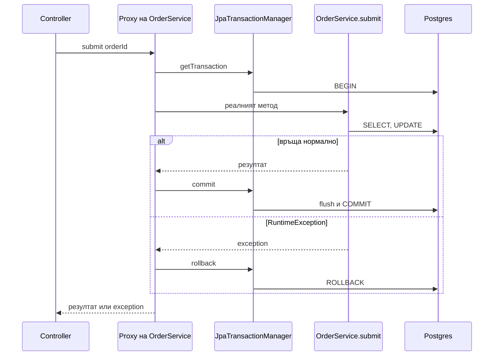

# Транзакции и locking

Транзакцията е границата, в която няколко операции към базата са атомарни: или всички, или нито една. В Spring Boot това е `@Transactional`, който изглежда прост, но зад него стоят proxy, thread-bound връзка, propagation правила и rollback логика, които при неразбиране водят до тихо загубени данни, `UnexpectedRollbackException` в production и deadlock-ове под натоварване. Този документ обяснява как `@Transactional` работи отвътре, къде да го слагаш, какво значи всяка propagation и isolation стойност в контекста на PostgreSQL, как се прави optimistic и pessimistic locking, и как се тества всичко това без тестът да скрие бъга. Завършва с два работещи примера: прехвърляне на наличност между складове с optimistic lock и retry, и резервация с pessimistic lock.

| Какво | Кога | Инструмент |
|---|---|---|
| Атомарна бизнес операция | Всеки service метод, който пише | `@Transactional` на service |
| Четене на няколко неща консистентно | Read endpoints | `@Transactional(readOnly = true)` |
| Запис, който трябва да оцелее при rollback | Audit log, failed attempts | `REQUIRES_NEW` |
| Конкурентна редакция на един ред | Два потребителя сменят една поръчка | `@Version` + retry |
| Резервация на ограничен ресурс | Наличност, билети, номера | `@Lock(PESSIMISTIC_WRITE)` |
| Опашка от задачи в таблица | Workers вземат редове | `FOR UPDATE SKIP LOCKED` |
| Еднократно изпълнение на нещо глобално | Scheduler на няколко инстанции | Advisory lock |
| Съобщение след успешен commit | Kafka, имейл | `@TransactionalEventListener` или outbox |

## 1. Зависимости и настройка

`spring-boot-starter-data-jpa` носи всичко: `spring-tx`, `JpaTransactionManager` и AOP proxy-тата. Spring Boot конфигурира `PlatformTransactionManager` bean от типа `JpaTransactionManager` автоматично и включва `@EnableTransactionManagement`.

```yaml
spring:
  jpa:
    open-in-view: false
  transaction:
    default-timeout: 30s
```

За retry при optimistic lock:

```xml
<dependency>
    <groupId>org.springframework.retry</groupId>
    <artifactId>spring-retry</artifactId>
</dependency>
<dependency>
    <groupId>org.springframework.boot</groupId>
    <artifactId>spring-boot-starter-aop</artifactId>
</dependency>
```

Важно: анотацията е `org.springframework.transaction.annotation.Transactional`, не `jakarta.transaction.Transactional`. Втората също работи в Spring, но няма `readOnly`, `timeout`, `propagation` и `noRollbackFor`.

## 2. Минимален работещ пример

```java
@Service
public class OrderService {

    private final OrderRepository orders;
    private final StockService stock;

    public OrderService(OrderRepository orders, StockService stock) {
        this.orders = orders;
        this.stock = stock;
    }

    @Transactional
    public Long submit(Long orderId) {
        Order order = orders.findWithDetails(orderId).orElseThrow(() -> new OrderNotFoundException(orderId));
        for (OrderItem item : order.getItems()) {
            stock.reserve(item.getProduct().getId(), item.getQuantity());
        }
        order.submit();
        return order.getId();
    }

    @Transactional(readOnly = true)
    public OrderResponse get(Long id) {
        return orders.findWithDetails(id).map(OrderResponse::from).orElseThrow(() -> new OrderNotFoundException(id));
    }
}
```

Ако `stock.reserve` хвърли `InsufficientStockException` на третия ред, резервациите за първите два се rollback-ват и поръчката остава в предишното си състояние. Без `@Transactional` всяко repository извикване би било отделна транзакция и щеше да останеш с частично резервирана наличност.

### Какво прави @Transactional отвътре

Spring създава proxy около bean-а (CGLIB подклас). Извикването от controller-а минава през proxy-то, което пита `PlatformTransactionManager` за транзакция, свързва JDBC връзката и `EntityManager`-а с текущата нишка (`TransactionSynchronizationManager`), извиква реалния метод, и при връщане прави commit, а при exception rollback.



Две следствия, които обясняват повечето изненади:

- Транзакцията е вързана за нишката. Всичко, което извикаш от същата нишка вътре в метода (repository, `JdbcClient`, друг service), ползва същата връзка и същия persistence context. Нова нишка (`@Async`, `CompletableFuture.supplyAsync`, виртуална нишка от executor) не участва в транзакцията.
- Proxy-то вижда само извиквания отвън. Метод, който се вика от друг метод в същия клас, не минава през proxy и неговият `@Transactional` не прави нищо (раздел 6).

## 3. Къде се слага

На service слоя, на метод с бизнес смисъл. Не на controller: там мапваш HTTP, а и транзакция, която обхваща сериализация на JSON, държи връзка по-дълго от нужното. Не на repository: Spring Data repository методите вече са транзакционни поотделно, но границата трябва да обхваща цялата бизнес операция, не всяко извикване към базата.

`@Transactional` на ниво клас с `readOnly = true` и override на пишещите методи е удобна конвенция:

```java
@Service
@Transactional(readOnly = true)
public class InvoiceService {

    public InvoiceResponse get(Long id) { /* ... */ }

    public Page<InvoiceSummary> list(Pageable p) { /* ... */ }

    @Transactional
    public Long issue(Long orderId) { /* ... */ }
}
```

Методите трябва да са `public`. Spring 6 поддържа `@Transactional` и на `protected` и package-private методи при CGLIB proxy, но за яснота дръж ги публични. `private` никога не работи.

## 4. Propagation

| Propagation | Има външна транзакция | Няма външна транзакция | Кога |
|---|---|---|---|
| `REQUIRED` (default) | Участва в нея | Създава нова | Почти винаги |
| `REQUIRES_NEW` | Спира външната, създава нова независима | Създава нова | Audit log, запис на неуспешен опит, който трябва да оцелее при rollback |
| `NESTED` | Savepoint в същата транзакция | Създава нова | Частичен rollback в рамките на batch обработка, само с JDBC/JPA |
| `MANDATORY` | Участва | Хвърля `IllegalTransactionStateException` | Метод, който не трябва да се вика извън транзакция |
| `SUPPORTS` | Участва | Работи без транзакция | Четене, което е ок и в двата случая |
| `NOT_SUPPORTED` | Спира външната, работи без | Работи без | Дълга операция, която не трябва да държи транзакцията (външен HTTP) |
| `NEVER` | Хвърля exception | Работи без | Защита срещу извикване в транзакция |

### REQUIRES_NEW за audit log

```java
@Service
public class PaymentAuditService {

    private final PaymentAttemptRepository attempts;

    public PaymentAuditService(PaymentAttemptRepository attempts) {
        this.attempts = attempts;
    }

    @Transactional(propagation = Propagation.REQUIRES_NEW)
    public void recordAttempt(Long orderId, String provider, String outcome) {
        attempts.save(new PaymentAttempt(orderId, provider, outcome, Instant.now()));
    }
}
```

```java
@Transactional
public void pay(Long orderId) {
    Order order = orders.findById(orderId).orElseThrow();
    try {
        gateway.charge(order);
        audit.recordAttempt(orderId, "stripe", "OK");
        order.markPaid();
    } catch (PaymentDeclinedException e) {
        audit.recordAttempt(orderId, "stripe", "DECLINED: " + e.getCode());
        throw e;
    }
}
```

`recordAttempt` се commit-ва веднага в собствена транзакция. Когато `pay` хвърли и външната транзакция се rollback-не, записът за неуспешния опит остава. Цената: `REQUIRES_NEW` взема втора връзка от pool-а, докато първата е спряна. С pool от 10 връзки и 10 едновременни `pay` извиквания, единайсетото `recordAttempt` чака за връзка, а всички `pay` държат своите. Това е класически self-deadlock на pool-а. Пази `REQUIRES_NEW` за кратки операции и дръж `maximum-pool-size` с резерв.

`NESTED` използва JDBC savepoint: при exception в nested метода се връщаш до savepoint-а, а външната транзакция продължава. Работи с `JpaTransactionManager` върху Postgres, но persistence context-ът не се връща назад, само базата, така че managed обекти могат да останат с променени стойности. Използвай го рядко и с `entityManager.clear()` след rollback до savepoint.

## 5. Isolation и аномалии

Postgres поддържа три реални нива (`READ_UNCOMMITTED` се държи като `READ_COMMITTED`):

| Ниво | Dirty read | Non-repeatable read | Phantom read | Serialization anomaly |
|---|---|---|---|---|
| `READ_COMMITTED` (default) | не | да | да | да |
| `REPEATABLE_READ` | не | не | не (в Postgres) | да |
| `SERIALIZABLE` | не | не | не | не |

- `READ_COMMITTED`: всяка заявка вижда данните, commit-нати към момента на нейното начало. Два `SELECT` в една транзакция могат да върнат различни резултати. Това е default-ът и е правилен за 95% от операциите.
- `REPEATABLE_READ`: цялата транзакция вижда snapshot от началото си. Postgres го имплементира като snapshot isolation и за разлика от стандарта предотвратява и phantom reads. Ако опиташ да UPDATE-неш ред, който друга транзакция е променила след твоя snapshot, получаваш `could not serialize access due to concurrent update` и трябва да повториш.
- `SERIALIZABLE`: Postgres следи зависимости между транзакциите и прекъсва тези, които биха нарушили сериализуемостта, с грешка `40001`. Spring я мапва на `CannotSerializeTransactionException`. Трябва retry логика, иначе няма смисъл.

```java
@Transactional(isolation = Isolation.SERIALIZABLE)
public void closeAccountingPeriod(YearMonth period) { /* ... */ }
```

Повишаването на isolation-а не е безплатно и не замества locking. За "прочети наличност, провери, намали" `READ_COMMITTED` плюс `@Version` или `FOR UPDATE` е по-предсказуемо от `SERIALIZABLE`. Isolation-ът се задава при `BEGIN`, така че `@Transactional(isolation = ...)` на вътрешен `REQUIRED` метод не променя нищо, ако външната транзакция вече е започнала (Spring хвърля, ако `validateExistingTransaction` е включен, иначе тихо игнорира).

## 6. Rollback правила и капани

### Кое прави rollback

По подразбиране: `RuntimeException` и `Error` правят rollback, checked exceptions правят commit. Това е историческо решение и често е грешно: `IOException` от файл по средата на операцията ще commit-не половината. Правилата се променят с атрибути:

```java
@Transactional(rollbackFor = Exception.class)
public void importOrders(Path file) throws IOException { /* ... */ }

@Transactional(noRollbackFor = NotificationFailedException.class)
public void submit(Long orderId) { /* ... */ }
```

Бизнес exceptions в този handbook са `RuntimeException`, затова не ти трябва `rollbackFor` за тях. Сложи го, когато методът декларира checked exception.

### Rollback-only и UnexpectedRollbackException

```java
@Transactional
public void processOrder(Long id) {
    try {
        stockService.reserve(id);
    } catch (InsufficientStockException e) {
        log.warn("Няма наличност, продължаваме без резервация");
    }
    orders.markProcessed(id);
}
```

`stockService.reserve` е `@Transactional` (`REQUIRED`), тоест участва в същата транзакция. Когато хвърли, неговото proxy маркира транзакцията като rollback-only, защото от негова гледна точка операцията е провалена. Ти хващаш exception-а и продължаваш, `markProcessed` минава, и при края на `processOrder` Spring се опитва да commit-не, вижда флага, прави rollback и хвърля `UnexpectedRollbackException: Transaction silently rolled back because it has been marked as rollback-only`. Нищо от метода не е записано, а ти четеш стек трейс, който сочи на commit-а, не на причината.

Решения:

- Не хващай exceptions от вътрешни `@Transactional` методи, ако смяташ да продължиш. Пренареди логиката така, че проверката да е преди.
- Ако наистина трябва да продължиш, вътрешният метод да е `REQUIRES_NEW`, така че неговият rollback да е само негов.
- Или вътрешният метод да не хвърля, а да връща резултат.

### Self-invocation

```java
@Service
public class ReportService {

    public void generateAll() {
        for (Long id : ids) {
            generateOne(id);   // @Transactional тук НЕ работи
        }
    }

    @Transactional
    public void generateOne(Long id) { /* ... */ }
}
```

`generateAll` вика `generateOne` през `this`, не през proxy-то. Няма транзакция, няма rollback, и ако `generateOne` ползва lazy релации, ще получиш `LazyInitializationException`. Поправки:

1. Премести `generateOne` в отделен bean (`ReportGenerator`) и го инжектирай. Най-чистото решение, и обикновено подобрява дизайна.
2. Използвай `TransactionTemplate` вътре в `generateAll` (раздел 8).
3. Инжектирай `ObjectProvider<ReportService> self` и викай `self.getObject().generateOne(id)`. Работи, но е миризливо.

Същото важи за `@Async`, `@Cacheable`, `@Retryable` и всяка друга proxy-базирана анотация.

## 7. readOnly, timeout и дълги транзакции

### readOnly = true

```java
@Transactional(readOnly = true)
public Page<OrderSummary> search(OrderFilter f, Pageable p) { /* ... */ }
```

- Hibernate поставя сесията във `FlushMode.MANUAL`: няма dirty checking и flush при commit, което при 500 заредени entity спестява реално време.
- Spring извиква `Connection.setReadOnly(true)`, при което Postgres драйверът стартира транзакцията като `READ ONLY`. UPDATE в нея гърми с `cannot execute UPDATE in a read-only transaction`, което е добра защита.
- При setup с read replica `readOnly` е сигналът, по който routing datasource (`AbstractRoutingDataSource` или `LazyConnectionDataSourceProxy`) избира репликата.

Не е оптимизация, която да пропускаш: сложи го на всеки метод, който не пише.

### Timeout

```java
@Transactional(timeout = 5)
public void quickUpdate(Long id) { /* ... */ }
```

Секунди. Spring го предава на Hibernate като query timeout за заявките в транзакцията, но не прекъсва Java код, който не пипа базата. Глобално `spring.transaction.default-timeout: 30s` е разумна защита срещу забравени дълги транзакции. Postgres от своя страна има `idle_in_transaction_session_timeout`, който убива сесии, които държат транзакция отворена без да правят нищо, виж по-долу.

### Не дръж транзакция по време на HTTP

```java
@Transactional
public void pay(Long orderId) {
    Order order = orders.findById(orderId).orElseThrow();
    PaymentResult result = stripe.charge(order);   // 2 до 30 секунди, връзката е заета
    order.markPaid(result.id());
}
```

През цялото време на HTTP извикването транзакцията е отворена, връзката е заета, а в Postgres сесията е `idle in transaction`. При 10 връзки в pool-а и бавен Stripe сървисът спира след десетата заявка. Правилно:

```java
public void pay(Long orderId) {
    PaymentRequest req = tx.execute(status -> paymentPreparer.prepare(orderId));
    PaymentResult result = stripe.charge(req);
    tx.executeWithoutResult(status -> paymentFinisher.apply(orderId, result));
}
```

Две кратки транзакции и HTTP между тях. Ако втората се провали, имаш платена, но неотбелязана поръчка, което е проблем за идемпотентност и reconciliation (раздел 12), не за транзакции.

## 8. TransactionTemplate

За програмен контрол, когато анотацията не стига: self-invocation, транзакция в цикъл с commit на всеки N реда, или код в lambda.

```java
@Service
public class OrderImportService {

    private final TransactionTemplate tx;
    private final OrderRepository orders;

    public OrderImportService(PlatformTransactionManager txManager, OrderRepository orders) {
        this.tx = new TransactionTemplate(txManager);
        this.tx.setTimeout(60);
        this.orders = orders;
    }

    public ImportResult importAll(List<OrderCsvRow> rows) {
        int ok = 0, failed = 0;
        for (List<OrderCsvRow> chunk : Lists.partition(rows, 100)) {
            try {
                tx.executeWithoutResult(status -> chunk.forEach(this::importOne));
                ok += chunk.size();
            } catch (DataIntegrityViolationException e) {
                failed += chunk.size();
            }
        }
        return new ImportResult(ok, failed);
    }
}
```

Всеки chunk е собствена транзакция, грешка в един chunk не унищожава останалите. `status.setRollbackOnly()` вътре в lambda-та прави rollback без exception. Spring Boot дава и готов `TransactionTemplate` bean, но собствена инстанция с настройки за метода е по-ясна.

## 9. Действия след commit

Изпращане на Kafka съобщение или имейл вътре в транзакцията е грешно по два начина: ако транзакцията се rollback-не, съобщението вече е изпратено; и ако consumer-ът го получи преди commit-а и прочете от базата, не вижда реда.

```java
@Service
public class OrderService {

    private final ApplicationEventPublisher events;

    @Transactional
    public Long submit(Long orderId) {
        Order order = /* ... */;
        order.submit();
        events.publishEvent(new OrderSubmitted(order.getId(), order.getCustomer().getEmail()));
        return order.getId();
    }
}

@Component
public class OrderSubmittedNotifier {

    @TransactionalEventListener(phase = TransactionPhase.AFTER_COMMIT)
    public void on(OrderSubmitted event) {
        mailer.sendConfirmation(event.customerEmail(), event.orderId());
    }
}
```

Listener-ът се изпълнява след успешен commit, в същата нишка. Ако транзакцията се rollback-не, не се изпълнява. Вътре в listener-а няма транзакция (commit-ът е минал), затова ако там пишеш в базата, трябва `@Transactional(propagation = REQUIRES_NEW)`. Ако сървисът умре между commit-а и изпращането, съобщението е загубено: за гаранции използвай outbox таблица, виж [Message brokers](Message_Brokers.md). Подробности за events в [Events](Events.md).

Същото може и ръчно:

```java
TransactionSynchronizationManager.registerSynchronization(new TransactionSynchronization() {
    @Override
    public void afterCommit() {
        cache.evict(orderId);
    }
});
```

## 10. Optimistic locking

Два оператора редактират една поръчка. Без locking вторият запис тихо презаписва първия. С `@Version`:

```java
@Version
private int version;
```

Hibernate издава `update orders set ..., version = 3 where id = ? and version = 2`. Ако засегнатите редове са 0, някой е записал версия 3 преди теб, и Hibernate хвърля `OptimisticLockException`, която Spring превежда на `ObjectOptimisticLockingFailureException`. Това става при flush, тоест при commit, не при `setStatus`.

Какво да правиш с нея:

- За потребителска редакция (форма): върни 409 Conflict с `ProblemDetail` и накарай клиента да презареди. Клиентът изпраща `version` в request-а и service-ът проверява `if (req.version() != order.getVersion()) throw new StaleObjectException()` преди да пипне нещо, за да хванеш конфликта рано. Виж [Грешки и ProblemDetail](Exception_Handling.md).
- За автоматични операции (намаляване на наличност, броячи): retry. Конфликтът е очакван и временен.

### Retry с ръчен цикъл

Retry-ът трябва да е извън транзакцията, защото exception-ът идва при commit, и повторението трябва да започне нова транзакция с прясно прочетени данни:

```java
@Component
public class StockTransferFacade {

    private static final int MAX_ATTEMPTS = 3;
    private final StockTransferService service;

    public StockTransferFacade(StockTransferService service) {
        this.service = service;
    }

    public void transfer(Long productId, Long fromWarehouse, Long toWarehouse, int qty) {
        for (int attempt = 1; ; attempt++) {
            try {
                service.transfer(productId, fromWarehouse, toWarehouse, qty);
                return;
            } catch (ObjectOptimisticLockingFailureException e) {
                if (attempt >= MAX_ATTEMPTS) {
                    throw new ConcurrentStockUpdateException(productId, e);
                }
            }
        }
    }
}
```

### Retry с @Retryable

```java
@Configuration
@EnableRetry
public class RetryConfig {
}
```

```java
@Component
public class StockTransferFacade {

    private final StockTransferService service;

    public StockTransferFacade(StockTransferService service) {
        this.service = service;
    }

    @Retryable(retryFor = ObjectOptimisticLockingFailureException.class,
               maxAttempts = 3,
               backoff = @Backoff(delay = 50, multiplier = 2))
    public void transfer(Long productId, Long fromWarehouse, Long toWarehouse, int qty) {
        service.transfer(productId, fromWarehouse, toWarehouse, qty);
    }

    @Recover
    public void recover(ObjectOptimisticLockingFailureException e, Long productId, Long from, Long to, int qty) {
        throw new ConcurrentStockUpdateException(productId, e);
    }
}
```

`@Retryable` и `@Transactional` на един и същ метод е капан: редът на proxy-тата не е гарантиран и ако транзакционният proxy е отвън, retry-ът става в същата (вече провалена) транзакция. Затова facade-ът с `@Retryable` и service-ът с `@Transactional` са различни bean-ове.

## 11. Pessimistic locking

Когато конфликтът не е изключение, а норма (всички поръчки се борят за същите 5 продукта на промоция), optimistic locking генерира retry буря. Тогава заключи реда при четене:

```java
public interface StockLevelRepository extends JpaRepository<StockLevel, Long> {

    @Lock(LockModeType.PESSIMISTIC_WRITE)
    @QueryHints(@QueryHint(name = "jakarta.persistence.lock.timeout", value = "0"))
    @Query("select s from StockLevel s where s.productId = :productId and s.warehouseId = :warehouseId")
    Optional<StockLevel> findForUpdate(@Param("productId") Long productId, @Param("warehouseId") Long warehouseId);
}
```

`PESSIMISTIC_WRITE` става `SELECT ... FOR UPDATE`. Другите транзакции, които опитат `FOR UPDATE` или UPDATE на същия ред, чакат до твоя commit. `PESSIMISTIC_READ` е `FOR SHARE`: позволява други четения с `FOR SHARE`, но блокира писане.

За `jakarta.persistence.lock.timeout` Postgres няма per-statement timeout. Hibernate превежда само две стойности: `0` става `FOR UPDATE NOWAIT` (веднага хвърля `PessimisticLockException`, която Spring превежда на `CannotAcquireLockException`), а `-2` става `FOR UPDATE SKIP LOCKED`. Положителна стойност се игнорира от Postgres диалекта. Ако искаш "изчакай най-много 3 секунди", сложи `SET LOCAL lock_timeout = '3s'` в началото на транзакцията през `JdbcClient` или глобално на ролята в Postgres.

Правила за pessimistic locking:

- Заключвай в последователен ред (винаги по-малкото id първо), иначе два `transfer` в противоположни посоки правят deadlock. Postgres го открива и убива единия с `deadlock detected`, което Spring мапва на `CannotAcquireLockException`, и трябва да повториш.
- Заключвай възможно най-късно и commit-вай възможно най-рано. Lock, държан по време на HTTP извикване, спира всички.
- Lock върху ред, който не съществува, не заключва нищо. За "първа резервация създава реда" ти трябва advisory lock или unique constraint.

### SKIP LOCKED за опашки в таблица

Няколко инстанции взимат задачи от `outbox` или `jobs` таблица без да си пречат:

```java
@Repository
public class JobQueueRepository {

    private final JdbcClient jdbc;

    public JobQueueRepository(JdbcClient jdbc) {
        this.jdbc = jdbc;
    }

    public List<Job> claimBatch(int limit) {
        return jdbc.sql("""
                with next as (
                    select id from jobs
                    where status = 'PENDING' and run_at <= now()
                    order by run_at
                    limit :limit
                    for update skip locked
                )
                update jobs j
                set status = 'RUNNING', claimed_at = now()
                from next
                where j.id = next.id
                returning j.id, j.type, j.payload
                """)
                .param("limit", limit)
                .query(Job.class)
                .list();
    }
}
```

Всеки worker в собствена транзакция взима до `limit` незаключени реда. Заключените от друг worker се прескачат, без чакане. Подробно в [Cron, @Async и опашки](Scheduling_Queues.md).

### Advisory locks

Когато трябва да заключиш "концепция", не ред: "само една инстанция да пуска нощното приключване", "една транзакция наведнъж за клиент X". Postgres advisory lock е mutex по 64-битов ключ, който не е свързан с таблица:

```java
@Repository
public class AdvisoryLocks {

    private final JdbcClient jdbc;

    public AdvisoryLocks(JdbcClient jdbc) {
        this.jdbc = jdbc;
    }

    public void lockForTransaction(String key) {
        jdbc.sql("select pg_advisory_xact_lock(hashtext(:key))")
                .param("key", key)
                .query()
                .singleRow();
    }

    public boolean tryLockForTransaction(String key) {
        return jdbc.sql("select pg_try_advisory_xact_lock(hashtext(:key))")
                .param("key", key)
                .query(Boolean.class)
                .single();
    }
}
```

```java
@Transactional
public void closeDay(LocalDate day) {
    if (!locks.tryLockForTransaction("close-day:" + day)) {
        log.info("Друга инстанция вече приключва {}", day);
        return;
    }
    // работа
}
```

`_xact_` вариантите се освобождават автоматично при края на транзакцията, което е единственият безопасен вариант в pool среда. Session advisory locks (`pg_advisory_lock`) остават вързани за връзката, която се връща в pool-а заключена.

## 12. Идемпотентност и уникални ограничения

Повторен request (retry от клиента, двойно натискане, redelivery от Kafka) не трябва да създава втори запис. Транзакцията не те спасява от това: два паралелни `existsByNumber` виждат `false` и двата вмъкват. Решението е unique constraint в базата и обработка на нарушението:

```sql
create table payments (
    id              bigint generated by default as identity primary key,
    order_id        bigint not null references orders (id),
    idempotency_key varchar(64) not null unique,
    amount          numeric(12, 2) not null,
    created_at      timestamptz not null default now()
);
```

```java
@Transactional
public PaymentResponse create(String idempotencyKey, Long orderId, BigDecimal amount) {
    Optional<Payment> existing = payments.findByIdempotencyKey(idempotencyKey);
    if (existing.isPresent()) {
        return PaymentResponse.from(existing.get());
    }
    try {
        Payment p = payments.saveAndFlush(new Payment(orderId, idempotencyKey, amount));
        return PaymentResponse.from(p);
    } catch (DataIntegrityViolationException e) {
        throw new DuplicatePaymentException(idempotencyKey);
    }
}
```

`saveAndFlush` е важен: без него INSERT-ът се изпълнява при commit, извън `try`. Но внимавай: след `DataIntegrityViolationException` транзакцията е rollback-only и не можеш да "прочетеш съществуващия" в същата транзакция. Ако искаш да върнеш 200 с вече съществуващия запис вместо 409, направи го в две стъпки отвън с `TransactionTemplate`, или ползвай Postgres `ON CONFLICT`:

```java
public Optional<Long> insertIfAbsent(String key, Long orderId, BigDecimal amount) {
    return jdbc.sql("""
            insert into payments (order_id, idempotency_key, amount)
            values (:orderId, :key, :amount)
            on conflict (idempotency_key) do nothing
            returning id
            """)
            .param("orderId", orderId).param("key", key).param("amount", amount)
            .query(Long.class)
            .optional();
}
```

Празен `Optional` значи, че записът вече е съществувал. Няма exception, няма rollback-only.

## 13. Няколко ресурса в една операция

База плюс Kafka, база плюс S3, две бази: нито една от тези комбинации не е атомарна с `@Transactional`. XA (две-фазов commit) съществува, но е бавен, крехък и Kafka не го поддържа. Правилото:

- База плюс съобщение: outbox таблица в същата транзакция, отделен процес публикува. Виж [Message brokers](Message_Brokers.md).
- База плюс външен API: първо запиши намерение (`PENDING`), извикай API-то извън транзакция, после запиши резултата. При crash по средата reconciliation job изчиства `PENDING` записите по-стари от N минути.
- База плюс файл: качи файла първо, после запиши реда с ключа. При rollback остава сирак в storage, който се чисти периодично, което е по-добро от ред без файл.

Ако имаш две бази, виж [База данни и ORM](Database_ORM.md) за втория `PlatformTransactionManager`. `ChainedTransactionManager` е deprecated и не дава атомарност, само последователен commit.

## 14. Тестване на транзакционно поведение

`@Transactional` върху тест клас или метод обвива теста в транзакция, която се rollback-ва в края. Удобно за изолация между тестове, но:

- Нищо не се commit-ва, затова `@TransactionalEventListener(AFTER_COMMIT)` никога не се изпълнява и тестът "минава" без да е тествал listener-а.
- Lazy релации работят навсякъде в теста, защото persistence context-ът е отворен, и `LazyInitializationException` от production не се възпроизвежда.
- `REQUIRES_NEW` в тествания код взема втора връзка и не вижда данните от тестовата транзакция.
- Unique constraint нарушения се появяват едва при flush, който не се случва без `saveAndFlush`.

За тестове на service слоя предпочитай `@SpringBootTest` без `@Transactional` на теста, Testcontainers Postgres, и изчистване на таблиците в `@BeforeEach` (или `@Sql` скрипт с `truncate`). Тогава `submit()` commit-ва наистина, listener-ите се изпълняват и lazy грешките излизат.

Когато ти трябва контрол в транзакционен тест:

```java
@Test
@Transactional
void submit_publishesEventAfterCommit() {
    Long id = service.create(request());
    TestTransaction.flagForCommit();
    TestTransaction.end();

    TestTransaction.start();
    assertThat(sentEmails).hasSize(1);
}
```

За проверка на optimistic lock: два `TransactionTemplate` блока в един тест, вторият с данни, прочетени преди първия commit, трябва да хвърли `ObjectOptimisticLockingFailureException`. За pessimistic lock: два thread-а с `CountDownLatch`, вторият трябва да чака или да получи `CannotAcquireLockException` при `NOWAIT`. Повече за setup-а в [Testing](Testing.md).

## 15. Пълен пример: наличност в складове

```sql
create table stock_levels (
    id           bigint generated by default as identity primary key,
    product_id   bigint  not null references products (id),
    warehouse_id bigint  not null references warehouses (id),
    quantity     integer not null check (quantity >= 0),
    reserved     integer not null default 0 check (reserved >= 0),
    version      integer not null default 0,
    unique (product_id, warehouse_id)
);
```

```java
@Entity
@Table(name = "stock_levels")
public class StockLevel {

    @Id
    @GeneratedValue(strategy = GenerationType.IDENTITY)
    private Long id;

    @Column(nullable = false)
    private Long productId;

    @Column(nullable = false)
    private Long warehouseId;

    @Column(nullable = false)
    private int quantity;

    @Column(nullable = false)
    private int reserved;

    @Version
    private int version;

    protected StockLevel() {
    }

    public int available() {
        return quantity - reserved;
    }

    public void remove(int qty) {
        if (qty > available()) {
            throw new InsufficientStockException(productId, warehouseId, qty, available());
        }
        quantity -= qty;
    }

    public void add(int qty) {
        quantity += qty;
    }

    public void reserve(int qty) {
        if (qty > available()) {
            throw new InsufficientStockException(productId, warehouseId, qty, available());
        }
        reserved += qty;
    }

    public Long getId() { return id; }
    public Long getProductId() { return productId; }
    public Long getWarehouseId() { return warehouseId; }
    public int getQuantity() { return quantity; }
    public int getReserved() { return reserved; }
}
```

```java
public interface StockLevelRepository extends JpaRepository<StockLevel, Long> {

    Optional<StockLevel> findByProductIdAndWarehouseId(Long productId, Long warehouseId);

    @Lock(LockModeType.PESSIMISTIC_WRITE)
    @Query("select s from StockLevel s where s.productId = :productId and s.warehouseId = :warehouseId")
    Optional<StockLevel> findForUpdate(@Param("productId") Long productId, @Param("warehouseId") Long warehouseId);
}
```

### Прехвърляне с optimistic lock

Прехвърлянето между складове е рядка операция, конфликтите са изключение, затова `@Version` плюс retry от facade-а в раздел 10:

```java
@Service
public class StockTransferService {

    private final StockLevelRepository stock;
    private final StockMovementRepository movements;

    public StockTransferService(StockLevelRepository stock, StockMovementRepository movements) {
        this.stock = stock;
        this.movements = movements;
    }

    @Transactional
    public void transfer(Long productId, Long fromWarehouse, Long toWarehouse, int qty) {
        if (fromWarehouse.equals(toWarehouse)) {
            throw new IllegalArgumentException("Складовете трябва да са различни");
        }
        StockLevel from = stock.findByProductIdAndWarehouseId(productId, fromWarehouse)
                .orElseThrow(() -> new StockLevelNotFoundException(productId, fromWarehouse));
        StockLevel to = stock.findByProductIdAndWarehouseId(productId, toWarehouse)
                .orElseThrow(() -> new StockLevelNotFoundException(productId, toWarehouse));

        from.remove(qty);
        to.add(qty);
        movements.save(new StockMovement(productId, fromWarehouse, toWarehouse, qty, Instant.now()));
        // при commit: два UPDATE с where version = ?, един INSERT
    }
}
```

Ако някой е променил `from` или `to` междувременно, commit-ът хвърля `ObjectOptimisticLockingFailureException`, движението не се записва, и facade-ът повтаря с прясно четене. След три неуспеха `ConcurrentStockUpdateException` се мапва на 409 в `@RestControllerAdvice`.

### Резервация с pessimistic lock

Резервацията се прави при всяка поръчка, за популярни продукти стотици пъти в минута. Тук `FOR UPDATE`:

```java
@Service
public class StockReservationService {

    private final StockLevelRepository stock;

    public StockReservationService(StockLevelRepository stock) {
        this.stock = stock;
    }

    @Transactional(propagation = Propagation.MANDATORY)
    public void reserve(Long productId, Long warehouseId, int qty) {
        StockLevel level = stock.findForUpdate(productId, warehouseId)
                .orElseThrow(() -> new StockLevelNotFoundException(productId, warehouseId));
        level.reserve(qty);
    }

    @Transactional(propagation = Propagation.MANDATORY)
    public void reserveAll(List<ReservationLine> lines) {
        // сортираме по ключ, за да заключваме винаги в един ред и да няма deadlock
        lines.stream()
                .sorted(Comparator.comparing(ReservationLine::productId).thenComparing(ReservationLine::warehouseId))
                .forEach(l -> reserve(l.productId(), l.warehouseId(), l.quantity()));
    }
}
```

`MANDATORY`, защото резервацията има смисъл само като част от транзакцията на поръчката: ако `OrderService.submit` се провали след резервацията, редът се отключва и `reserved` се връща автоматично чрез rollback. Извикване извън транзакция е грешка в кода и Spring я хваща веднага. `reserveAll` вика `reserve` през `this`, което тук е ок, защото и двата са `MANDATORY` и транзакцията вече съществува отвън.

## 16. Капани

- `@Transactional` на метод, извикан от същия клас: не минава през proxy и няма транзакция. Отделен bean или `TransactionTemplate`.
- Хващане на exception от вътрешен `REQUIRED` метод и продължаване: `UnexpectedRollbackException` при commit, нищо не е записано. Не хващай, или `REQUIRES_NEW`.
- Checked exception в `@Transactional` метод прави commit по подразбиране. `rollbackFor = Exception.class` при методи, които ги хвърлят.
- Външен HTTP, изпращане на имейл или дълго изчисление вътре в транзакция: връзката е заета, pool-ът се изчерпва, Postgres пълни `idle in transaction`. Раздели в две транзакции.
- `REQUIRES_NEW` в метод, който вече държи връзка, при малък pool: self-deadlock на pool-а, всички чакат за връзка, която никой не освобождава. Следи `hikari.pending` метриката.
- `jakarta.transaction.Transactional` вместо Spring-ската: работи, но без `readOnly`, `timeout` и `noRollbackFor`, и колегите се чудят защо атрибутите липсват.
- Retry на `ObjectOptimisticLockingFailureException` вътре в същата транзакция: persistence context-ът е невалиден след exception, повторението чете старите стойности. Retry отвън, нова транзакция.
- `@Retryable` и `@Transactional` на един метод: редът на proxy-тата не е гарантиран. Два bean-а.
- `FOR UPDATE` в различен ред в два метода: deadlock. Сортирай ключовете преди заключване.
- Session advisory lock (`pg_advisory_lock`) вместо `_xact_` вариант: връзката се връща в pool-а заключена и следващият request я получава със заключен ключ.
- `@Transactional` на тест: `AFTER_COMMIT` listener-ите не се изпълняват, lazy релациите работят навсякъде, и тестът минава, а production не. Тествай service слоя с реален commit.
- Isolation на вътрешен `REQUIRED` метод: транзакцията вече е започнала, isolation-ът се игнорира. Задай го на най-външния метод.

## 17. Чеклист

- [ ] `@Transactional` е на service методи с бизнес смисъл, не на controller, не на repository
- [ ] Четящите методи са `readOnly = true`
- [ ] `spring.transaction.default-timeout` е зададен
- [ ] Няма HTTP извиквания, имейли или дълги изчисления вътре в транзакция
- [ ] Няма self-invocation на `@Transactional` методи
- [ ] Exceptions от вътрешни транзакционни методи не се хващат и игнорират
- [ ] Всеки entity, който се редактира конкурентно, има `@Version`, и `ObjectOptimisticLockingFailureException` се мапва на 409
- [ ] Retry логиката е извън транзакцията, в отделен bean
- [ ] Pessimistic locks се взимат в детерминиран ред и се държат кратко
- [ ] Идемпотентни операции разчитат на unique constraint, не на `exists` проверка
- [ ] Съобщения към брокери се изпращат след commit или през outbox
- [ ] Service тестовете commit-ват наистина (без `@Transactional` на теста) и покриват конкурентен сценарий

## 18. Свързани документи

- [База данни и ORM](Database_ORM.md): persistence context, flush, `JdbcClient`, което е основата за всичко тук.
- [Релации](Relations.md): защо service методът трябва да е транзакционен, за да работят lazy релациите.
- [Грешки и ProblemDetail](Exception_Handling.md): мапване на `ObjectOptimisticLockingFailureException` и `CannotAcquireLockException` към 409.
- [Events](Events.md): `@TransactionalEventListener` в дълбочина.
- [Message brokers](Message_Brokers.md): outbox pattern за база плюс Kafka.
- [Cron, @Async и опашки](Scheduling_Queues.md): job таблици със `SKIP LOCKED` и защо `@Async` не наследява транзакцията.
- [Testing](Testing.md): Testcontainers, `TestTransaction`, тестове за конкурентност.
- [Spring Framework transaction management](https://docs.spring.io/spring-framework/reference/data-access/transaction.html)
