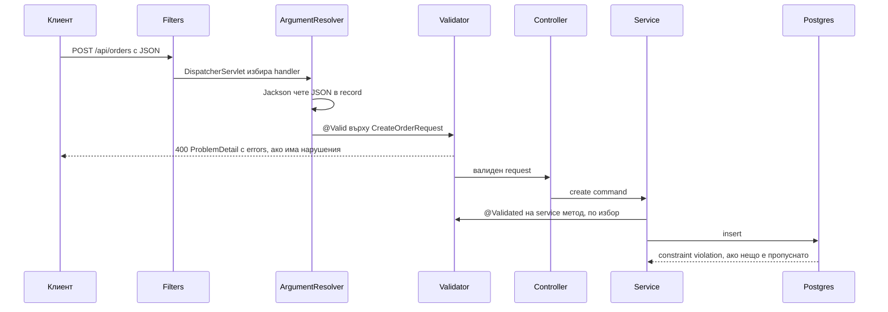

# Валидации

Валидацията е границата, на която лошият вход се спира преди да стигне до бизнес логиката и базата. В Spring Boot това е Bean Validation (Jakarta Validation 3.0 с Hibernate Validator като имплементация), включена с една анотация на request DTO-то и една `@Valid` в controller-а. Трудната част не е да сложиш `@NotBlank`, а да знаеш коя анотация къде какво exception хвърля, как да направиш custom constraint с достъп до repository, как да върнеш грешките в един и същ ProblemDetail формат с полета и как да ги преведеш. Този документ покрива всичко това с работещи примери и завършва с тестове, които доказват, че валидацията наистина се изпълнява.

| Какво | Кога | Инструмент |
|---|---|---|
| Тяло на request | `POST`, `PUT`, `PATCH` | `@Valid @RequestBody` + анотации на record компонентите |
| Query и path параметри | `GET /orders?size=500` | constraint директно на параметъра, без `@Validated` на класа |
| Различни правила за create и update | `id` задължителен само при update | validation groups |
| Проверка, която изисква база | уникален email, съществуващ продукт | custom `ConstraintValidator` с инжектиран repository |
| Зависимост между две полета | `startDate < endDate` | class-level constraint или `@AssertTrue` |
| Валидация извън controller | service, batch import, listener | инжектиран `Validator` или `@Validated` на service |
| Конфигурация | `app.payment.timeout` да е положително | `@Validated` на `@ConfigurationProperties` |

## 1. Зависимости и настройка

`spring-boot-starter-web` не включва валидация от Boot 2.3 нататък. Трябва изрично:

```xml
<dependency>
    <groupId>org.springframework.boot</groupId>
    <artifactId>spring-boot-starter-validation</artifactId>
</dependency>
```

Това носи `hibernate-validator` и `jakarta.validation-api`. Boot създава `LocalValidatorFactoryBean`, свързва го със Spring `MessageSource` за съобщенията и позволява инжектиране на bean-ове в `ConstraintValidator`-ите.

```yaml
spring:
  mvc:
    problemdetails:
      enabled: true
  messages:
    basename: messages,validation
    fallback-to-system-locale: false
  web:
    locale: bg
    locale-resolver: accept_header
```

`spring.messages.basename` включва и `validation.properties`, така че ключовете за съобщения живеят в един `MessageSource` с останалите текстове на приложението.

## 2. Минимален работещ пример

```java
package com.example.orders.web.dto;

import jakarta.validation.Valid;
import jakarta.validation.constraints.Max;
import jakarta.validation.constraints.NotEmpty;
import jakarta.validation.constraints.NotNull;
import jakarta.validation.constraints.Positive;
import jakarta.validation.constraints.Size;
import java.util.List;
import java.util.UUID;

public record CreateOrderRequest(
        @NotNull UUID customerId,
        @NotEmpty @Size(max = 100) List<@Valid Item> items,
        @Size(max = 500) String note
) {
    public record Item(@NotNull UUID productId, @Positive @Max(1000) int quantity) {}
}
```

```java
package com.example.orders.web;

import jakarta.validation.Valid;
import jakarta.validation.constraints.Max;
import jakarta.validation.constraints.Min;
import org.springframework.http.ResponseEntity;
import org.springframework.web.bind.annotation.*;

@RestController
@RequestMapping("/api/orders")
public class OrderController {

    private final OrderService orderService;

    public OrderController(OrderService orderService) {
        this.orderService = orderService;
    }

    @PostMapping
    public ResponseEntity<OrderResponse> create(@Valid @RequestBody CreateOrderRequest request) {
        var order = orderService.create(request);
        return ResponseEntity.status(201).body(OrderResponse.from(order));
    }

    @GetMapping
    public Page<OrderSummary> list(@RequestParam(defaultValue = "0") @Min(0) int page,
                                   @RequestParam(defaultValue = "20") @Min(1) @Max(100) int size) {
        return orderService.list(PageRequest.of(page, size));
    }
}
```

```http
POST /api/orders HTTP/1.1
Content-Type: application/json

{ "customerId": null, "items": [ { "productId": "0a3b9c7d-1111-4e8f-9a2b-3c4d5e6f7a8b", "quantity": 0 } ] }
```

```http
HTTP/1.1 400 Bad Request
Content-Type: application/problem+json

{
  "type": "https://api.example.com/problems/validation",
  "title": "Validation failed",
  "status": 400,
  "detail": "2 fields are invalid",
  "instance": "/api/orders",
  "code": "VALIDATION_FAILED",
  "errors": [
    { "field": "customerId", "message": "must not be null", "rejectedValue": null },
    { "field": "items[0].quantity", "message": "must be greater than 0", "rejectedValue": 0 }
  ]
}
```

Този формат на отговора идва от advice-а в секция 9. Без него Boot връща ProblemDetail със status 400 и `detail: "Invalid request content."`, без списък на полетата, което е безполезно за клиента.

## 3. Къде се случва валидацията



Валидацията на тялото става в `RequestResponseBodyMethodProcessor` след десериализацията и преди controller методът да се извика. Това има две последствия: невалиден JSON (синтаксис, грешен тип) е друга грешка (`HttpMessageNotReadableException`) и се случва преди валидацията; и controller-ът никога не вижда невалиден обект.

### Кое exception откъде идва

| Случай | Анотация | Exception | Default статус |
|---|---|---|---|
| `@RequestBody` DTO | `@Valid` на параметъра | `MethodArgumentNotValidException` | 400 |
| `@ModelAttribute` (form binding) | `@Valid` на параметъра | `MethodArgumentNotValidException` | 400 |
| `@RequestParam`, `@PathVariable`, `@RequestHeader` | constraint на параметъра, без `@Validated` на класа | `HandlerMethodValidationException` | 400 |
| Същото, но с `@Validated` на controller класа | `@Validated` на класа | `ConstraintViolationException` | 500, ако не го мапнеш |
| Service метод | `@Validated` на класа + constraint на параметър | `ConstraintViolationException` | 500, ако не го мапнеш |
| Програмно | `validator.validate(obj)` | няма, връща `Set<ConstraintViolation>` | ти решаваш |
| JPA pre-persist | constraint на entity поле | `ConstraintViolationException` при flush | 500, ако не го мапнеш |

От Spring Framework 6.1 нататък controller методите се валидират вградено: ако някой параметър има constraint анотация или `@Valid` с групи, `RequestMappingHandlerAdapter` сам пуска method validation и хвърля `HandlerMethodValidationException`. Не слагай `@Validated` на controller класове. Ако го сложиш, Spring прави AOP proxy и хвърля `ConstraintViolationException`, което заобикаля `ResponseEntityExceptionHandler` и дава 500.

## 4. Стандартни constraints

| Анотация | Валидно за | Какво проверява | Бележка |
|---|---|---|---|
| `@NotNull` | всичко | не е `null` | празен string минава |
| `@NotEmpty` | string, колекция, масив | не е `null` и има дължина > 0 | `"   "` минава |
| `@NotBlank` | string | не е `null` и има поне един non-whitespace символ | това искаш за текстови полета |
| `@Size(min, max)` | string, колекция, масив, map | дължина в интервала | `null` минава, комбинирай с `@NotNull` |
| `@Min` / `@Max` | числа | включително | за `int` примитив `null` не е възможен |
| `@Positive` / `@PositiveOrZero` | числа | > 0 или >= 0 | по-четимо от `@Min(1)` |
| `@DecimalMin("0.01")` / `@DecimalMax` | `BigDecimal`, string | с `inclusive = false` за строго | за пари |
| `@Digits(integer, fraction)` | `BigDecimal` | брой цифри преди и след запетаята | `@Digits(integer = 10, fraction = 2)` за суми |
| `@Email` | string | синтаксис на email | приема `a@b`, добави `@Pattern` или custom, ако ти трябва домейн |
| `@Pattern(regexp)` | string | regex | `null` минава |
| `@Past` / `@PastOrPresent` / `@Future` / `@FutureOrPresent` | `java.time` типове | спрямо текущия момент | `ClockProvider` за тестове |
| `@AssertTrue` / `@AssertFalse` | boolean | стойност | за cross-field трикове |
| `@Null` | всичко | трябва да е `null` | за `id` при create с групи |

Важното правило: почти всички constraints пропускат `null`. Това е умишлено, за да можеш да ги комбинираш: `@NotNull @Size(min = 3)` означава "задължително и поне 3 символа", а само `@Size(min = 3)` означава "ако е подадено, поне 3 символа".

### На records

Анотацията на record компонент се прилага върху полето и върху accessor-а. Hibernate Validator разбира records от версия 6.2 и валидира полетата. Нищо специално не трябва:

```java
public record UpdateCustomerRequest(
        @NotBlank @Size(max = 100) String displayName,
        @Email @Size(max = 254) String email,
        @Pattern(regexp = "\\+?[0-9 ]{6,20}") String phone,
        @PastOrPresent LocalDate birthDate
) {}
```

### Nested обекти и колекции

`@Valid` каскадира валидацията в обекта или в елементите. Без него nested record-ът се приема какъвто е.

```java
public record CreateInvoiceRequest(
        @NotNull @Valid Party issuer,
        @NotNull @Valid Party recipient,
        @NotEmpty List<@Valid @NotNull Line> lines,
        Map<@NotBlank String, @Size(max = 200) String> metadata
) {
    public record Party(@NotBlank String name, @Pattern(regexp = "[A-Z]{2}[0-9A-Z]{2,13}") String vatNumber) {}
    public record Line(@NotBlank String description, @Positive int quantity,
                       @NotNull @DecimalMin("0.00") @Digits(integer = 12, fraction = 2) BigDecimal unitPrice) {}
}
```

Container element constraints (`List<@Valid Line>`, `Map<@NotBlank String, ...>`) са част от Bean Validation 2.0 и работят на records. Пътят на грешката става `lines[2].unitPrice` или `metadata[key]`, което клиентът може да покаже до правилното поле.

## 5. Validation groups

Един DTO за create и update, но различни правила: при create `id` трябва да е `null`, при update е задължителен.

```java
package com.example.orders.web.validation;

public interface OnCreate {}
public interface OnUpdate {}
```

```java
public record ProductRequest(
        @Null(groups = OnCreate.class) @NotNull(groups = OnUpdate.class) UUID id,
        @NotBlank(groups = {OnCreate.class, OnUpdate.class}) String name,
        @NotNull @DecimalMin("0.01") BigDecimal price
) {}
```

```java
@PostMapping
public ResponseEntity<ProductResponse> create(@Validated(OnCreate.class) @RequestBody ProductRequest request) { ... }

@PutMapping("/{id}")
public ProductResponse update(@PathVariable UUID id,
                              @Validated(OnUpdate.class) @RequestBody ProductRequest request) { ... }
```

Правила за групите:

- `@Validated(Group.class)` на параметъра замества `@Valid`, защото `@Valid` не поддържа групи.
- Constraint без `groups` принадлежи на `Default` групата. При `@Validated(OnCreate.class)` `Default` не се валидира, затова `price` по-горе няма да бъде проверено. Или сложи `groups = {OnCreate.class, OnUpdate.class}` на всичко, или валидирай `@Validated({OnCreate.class, Default.class})`.
- `@GroupSequence` задава ред: първо `Default`, после `Expensive`, и спира при първия провал. Полезно, когато втората група бие базата.

Групите бързо стават нечетими. Ако разликата между create и update е повече от две полета, направи две DTO-та (`CreateProductRequest`, `UpdateProductRequest`), виж [DTO и mapping](DTO_Mapping.md).

## 6. Custom constraints

### Constraint с достъп до repository

```java
package com.example.orders.web.validation;

import jakarta.validation.Constraint;
import jakarta.validation.Payload;
import java.lang.annotation.*;

@Documented
@Constraint(validatedBy = UniqueEmailValidator.class)
@Target({ElementType.FIELD, ElementType.PARAMETER, ElementType.RECORD_COMPONENT})
@Retention(RetentionPolicy.RUNTIME)
public @interface UniqueEmail {
    String message() default "{app.validation.email.taken}";
    Class<?>[] groups() default {};
    Class<? extends Payload>[] payload() default {};
}
```

```java
package com.example.orders.web.validation;

import com.example.orders.user.UserAccountRepository;
import jakarta.validation.ConstraintValidator;
import jakarta.validation.ConstraintValidatorContext;

public class UniqueEmailValidator implements ConstraintValidator<UniqueEmail, String> {

    private final UserAccountRepository users;

    public UniqueEmailValidator(UserAccountRepository users) {
        this.users = users;
    }

    @Override
    public boolean isValid(String email, ConstraintValidatorContext context) {
        // null се оставя на @NotNull, иначе не можеш да комбинираш
        if (email == null || email.isBlank()) {
            return true;
        }
        return !users.existsByEmailIgnoreCase(email.trim());
    }
}
```

Boot конфигурира `SpringConstraintValidatorFactory`, така че validator-ът е Spring bean с constructor injection. Не трябва `@Component`. Проверката за уникалност в validator е удобна, но не е гаранция: два паралелни request-а минават проверката и единият пада на unique индекса в базата. Затова unique индексът остава и `DataIntegrityViolationException` се мапва към 409, виж [Грешки и ProblemDetail](Exception_Handling.md).

### Чиста проверка без зависимости: IBAN

```java
@Documented
@Constraint(validatedBy = IbanValidator.class)
@Target({ElementType.FIELD, ElementType.PARAMETER, ElementType.RECORD_COMPONENT, ElementType.TYPE_USE})
@Retention(RetentionPolicy.RUNTIME)
public @interface ValidIban {
    String message() default "{app.validation.iban.invalid}";
    Class<?>[] groups() default {};
    Class<? extends Payload>[] payload() default {};
}
```

```java
public class IbanValidator implements ConstraintValidator<ValidIban, String> {

    @Override
    public boolean isValid(String value, ConstraintValidatorContext context) {
        if (value == null) {
            return true;
        }
        String iban = value.replace(" ", "").toUpperCase();
        if (!iban.matches("[A-Z]{2}[0-9]{2}[A-Z0-9]{11,30}")) {
            return false;
        }
        String rearranged = iban.substring(4) + iban.substring(0, 4);
        StringBuilder digits = new StringBuilder();
        for (char c : rearranged.toCharArray()) {
            digits.append(Character.isLetter(c) ? String.valueOf(c - 'A' + 10) : String.valueOf(c));
        }
        return new java.math.BigInteger(digits.toString()).mod(java.math.BigInteger.valueOf(97)).intValue() == 1;
    }
}
```

`ElementType.TYPE_USE` позволява `List<@ValidIban String> accounts`.

### Class-level constraint: две полета заедно

```java
@Documented
@Constraint(validatedBy = DateRangeValidator.class)
@Target(ElementType.TYPE)
@Retention(RetentionPolicy.RUNTIME)
public @interface DateRange {
    String message() default "{app.validation.dateRange}";
    String start();
    String end();
    Class<?>[] groups() default {};
    Class<? extends Payload>[] payload() default {};
}
```

```java
package com.example.orders.web.validation;

import jakarta.validation.ConstraintValidator;
import jakarta.validation.ConstraintValidatorContext;
import org.springframework.beans.BeanWrapperImpl;

import java.time.LocalDate;

public class DateRangeValidator implements ConstraintValidator<DateRange, Object> {

    private String startField;
    private String endField;

    @Override
    public void initialize(DateRange annotation) {
        this.startField = annotation.start();
        this.endField = annotation.end();
    }

    @Override
    public boolean isValid(Object target, ConstraintValidatorContext context) {
        var wrapper = new BeanWrapperImpl(target);
        var start = (LocalDate) wrapper.getPropertyValue(startField);
        var end = (LocalDate) wrapper.getPropertyValue(endField);
        if (start == null || end == null || start.isBefore(end)) {
            return true;
        }
        // грешката да е закачена за end полето, не за целия обект
        context.disableDefaultConstraintViolation();
        context.buildConstraintViolationWithTemplate(context.getDefaultConstraintMessageTemplate())
                .addPropertyNode(endField)
                .addConstraintViolation();
        return false;
    }
}
```

```java
@DateRange(start = "validFrom", end = "validTo")
public record CreatePromotionRequest(
        @NotBlank String code,
        @NotNull LocalDate validFrom,
        @NotNull LocalDate validTo,
        @Positive int percentOff
) {}
```

`BeanWrapperImpl` чете record accessor-ите (`validFrom()`) като property-та, така че validator-ът е преизползваем за всеки record. `addPropertyNode` премества грешката от `""` (целия обект) към `validTo`, което е много по-полезно за UI.

### @AssertTrue трик за еднократна проверка

Когато правилото е специфично за един DTO и не си струва анотация:

```java
public record TransferRequest(@NotBlank String fromIban, @NotBlank String toIban,
                              @NotNull @DecimalMin("0.01") BigDecimal amount) {

    @AssertTrue(message = "{app.validation.transfer.sameAccount}")
    public boolean isDifferentAccounts() {
        return fromIban == null || !fromIban.equals(toIban);
    }
}
```

Методът трябва да започва с `is` или `get`, за да го види validator-ът като property. Името на полето в грешката става `differentAccounts`. Ако ти трябва смислено име на поле, class-level constraint с `addPropertyNode` е по-добър.

## 7. Програмна валидация

В service, batch import или listener нямаш `@Valid` магията. Инжектираш `Validator`:

```java
package com.example.orders.service;

import jakarta.validation.ConstraintViolation;
import jakarta.validation.ConstraintViolationException;
import jakarta.validation.Validator;
import org.springframework.stereotype.Service;

import java.util.Set;

@Service
public class OrderImportService {

    private final Validator validator;
    private final OrderService orderService;

    public OrderImportService(Validator validator, OrderService orderService) {
        this.validator = validator;
        this.orderService = orderService;
    }

    public ImportResult importAll(List<CreateOrderRequest> rows) {
        var result = new ImportResult();
        for (int i = 0; i < rows.size(); i++) {
            Set<ConstraintViolation<CreateOrderRequest>> violations = validator.validate(rows.get(i));
            if (!violations.isEmpty()) {
                result.reject(i, violations);
                continue;
            }
            result.accept(i, orderService.create(rows.get(i)));
        }
        return result;
    }
}
```

`Validator` тук е `jakarta.validation.Validator`, Boot го предоставя като bean. `validator.validate(obj, OnCreate.class)` приема групи. Ако искаш да хвърлиш и да оставиш advice-а да отговори, `throw new ConstraintViolationException(violations)`.

## 8. Съобщения и i18n

Съобщенията в `message` атрибута са шаблони. `{...}` е ключ, който се интерполира от `ValidationMessages.properties` в classpath root, или от Spring `MessageSource` (Boot свързва двете). `${validatedValue}` и атрибутите на анотацията (`{min}`, `{max}`) са достъпни в шаблона.

```properties
# src/main/resources/validation.properties
app.validation.email.taken=Email адресът вече е регистриран
app.validation.iban.invalid=Невалиден IBAN
app.validation.dateRange=Крайната дата трябва да е след началната
app.validation.transfer.sameAccount=Сметките трябва да са различни
app.order.quantity.max=Максимум {value} броя на ред
jakarta.validation.constraints.NotBlank.message=Полето е задължително
jakarta.validation.constraints.Size.message=Дължината трябва да е между {min} и {max}
```

```properties
# src/main/resources/validation_en.properties
app.validation.email.taken=Email address is already registered
app.validation.iban.invalid=Invalid IBAN
jakarta.validation.constraints.NotBlank.message=Field is required
```

```java
public record CreateOrderRequest(
        @NotEmpty List<@Valid Item> items
) {
    public record Item(@NotNull UUID productId,
                       @Positive @Max(value = 1000, message = "{app.order.quantity.max}") int quantity) {}
}
```

Локалът идва от `Accept-Language` header-а през `AcceptHeaderLocaleResolver` (default в Boot) и `LocaleContextHolder`. Hibernate Validator го взима от Spring интерполатора автоматично, така че `Accept-Language: en` връща английските съобщения без допълнителен код. `spring.web.locale: bg` е fallback-ът, когато header-ът липсва. `fallback-to-system-locale: false` е важно: без него на dev машина с английска система и на сървър с `C` locale ще получиш различни резултати.

Презаписването на `jakarta.validation.constraints.*.message` ключовете сменя default съобщенията глобално. Ако го правиш, направи го за всички анотации, които ползваш, иначе получаваш смес от български и английски.

## 9. Mapping към ProblemDetail

Това е advice-ът, който превръща трите вида validation exception в един формат. Разширява `ResponseEntityExceptionHandler`, за да наследи обработката на всички останали Spring MVC грешки.

```java
package com.example.orders.web.error;

import jakarta.validation.ConstraintViolation;
import jakarta.validation.ConstraintViolationException;
import org.springframework.context.MessageSource;
import org.springframework.context.i18n.LocaleContextHolder;
import org.springframework.http.HttpHeaders;
import org.springframework.http.HttpStatus;
import org.springframework.http.HttpStatusCode;
import org.springframework.http.ProblemDetail;
import org.springframework.http.ResponseEntity;
import org.springframework.validation.FieldError;
import org.springframework.web.bind.MethodArgumentNotValidException;
import org.springframework.web.bind.annotation.ExceptionHandler;
import org.springframework.web.bind.annotation.RestControllerAdvice;
import org.springframework.web.context.request.WebRequest;
import org.springframework.web.method.annotation.HandlerMethodValidationException;
import org.springframework.web.servlet.mvc.method.annotation.ResponseEntityExceptionHandler;

import java.net.URI;
import java.util.List;

@RestControllerAdvice
public class ValidationExceptionHandler extends ResponseEntityExceptionHandler {

    private static final URI VALIDATION_TYPE = URI.create("https://api.example.com/problems/validation");

    public record FieldViolation(String field, String message, Object rejectedValue) {}

    private final MessageSource messages;

    public ValidationExceptionHandler(MessageSource messages) {
        this.messages = messages;
    }

    @Override
    protected ResponseEntity<Object> handleMethodArgumentNotValid(MethodArgumentNotValidException ex,
                                                                  HttpHeaders headers,
                                                                  HttpStatusCode status,
                                                                  WebRequest request) {
        List<FieldViolation> errors = ex.getBindingResult().getFieldErrors().stream()
                .map(this::toViolation)
                .toList();
        return ResponseEntity.status(HttpStatus.BAD_REQUEST).body(problem(errors));
    }

    @Override
    protected ResponseEntity<Object> handleHandlerMethodValidationException(HandlerMethodValidationException ex,
                                                                            HttpHeaders headers,
                                                                            HttpStatusCode status,
                                                                            WebRequest request) {
        List<FieldViolation> errors = ex.getParameterValidationResults().stream()
                .flatMap(result -> result.getResolvableErrors().stream()
                        .map(error -> new FieldViolation(
                                result.getMethodParameter().getParameterName(),
                                messages.getMessage(error, LocaleContextHolder.getLocale()),
                                result.getArgument())))
                .toList();
        return ResponseEntity.status(HttpStatus.BAD_REQUEST).body(problem(errors));
    }

    @ExceptionHandler(ConstraintViolationException.class)
    public ResponseEntity<ProblemDetail> handleConstraintViolation(ConstraintViolationException ex) {
        List<FieldViolation> errors = ex.getConstraintViolations().stream()
                .map(this::toViolation)
                .toList();
        return ResponseEntity.status(HttpStatus.BAD_REQUEST).body(problem(errors));
    }

    private FieldViolation toViolation(FieldError error) {
        String message = messages.getMessage(error, LocaleContextHolder.getLocale());
        return new FieldViolation(error.getField(), message, error.getRejectedValue());
    }

    private FieldViolation toViolation(ConstraintViolation<?> violation) {
        // пътят е "create.request.items[0].quantity"; махаме метода и параметъра
        String path = violation.getPropertyPath().toString();
        int firstDot = path.indexOf('.');
        int secondDot = path.indexOf('.', firstDot + 1);
        String field = secondDot > 0 ? path.substring(secondDot + 1) : path;
        return new FieldViolation(field, violation.getMessage(), violation.getInvalidValue());
    }

    private ProblemDetail problem(List<FieldViolation> errors) {
        ProblemDetail problem = ProblemDetail.forStatusAndDetail(HttpStatus.BAD_REQUEST,
                errors.size() + " fields are invalid");
        problem.setType(VALIDATION_TYPE);
        problem.setTitle("Validation failed");
        problem.setProperty("code", "VALIDATION_FAILED");
        problem.setProperty("errors", errors);
        return problem;
    }
}
```

Какво става тук:

- `handleMethodArgumentNotValid` се вика от `ResponseEntityExceptionHandler` за `@RequestBody` грешки. `FieldError` имплементира `MessageSourceResolvable`, затова `messages.getMessage(error, locale)` връща преведеното съобщение.
- `handleHandlerMethodValidationException` покрива `@RequestParam` и `@PathVariable`. Там няма `FieldError`, а `ParameterValidationResult` с `MethodParameter`. Името на параметъра се вижда само ако компилираш с `-parameters`, което `spring-boot-starter-parent` прави по подразбиране.
- `ConstraintViolationException` от service слоя има property path с име на метод и параметър (`create.request.email`), който режем до `email`.
- `instance` се попълва автоматично от `ResponseEntityExceptionHandler` с текущия път. За `@ExceptionHandler` метода го сетваш ръчно, ако ти трябва.

Пълният модел на грешките, включително `traceId`, domain exceptions и 500, е в [Грешки и ProblemDetail](Exception_Handling.md). Validation advice-ът обикновено е част от същия клас.

## 10. Валидация на конфигурация

Грешна конфигурация трябва да спира приложението при старт, не при първия request.

```java
package com.example.orders.config;

import jakarta.validation.Valid;
import jakarta.validation.constraints.Max;
import jakarta.validation.constraints.Min;
import jakarta.validation.constraints.NotBlank;
import jakarta.validation.constraints.NotNull;
import org.springframework.boot.context.properties.ConfigurationProperties;
import org.springframework.validation.annotation.Validated;

import java.time.Duration;

@Validated
@ConfigurationProperties(prefix = "app.payment")
public record PaymentProperties(
        @NotBlank String apiKey,
        @NotNull Duration timeout,
        @Min(1) @Max(10) int maxRetries,
        @Valid @NotNull Webhook webhook
) {
    public record Webhook(@NotBlank String secret, @NotBlank String url) {}
}
```

```
***************************
APPLICATION FAILED TO START
***************************

Description:
Binding to target com.example.orders.config.PaymentProperties failed:

    Property: app.payment.api-key
    Value: ""
    Reason: must not be blank
```

`@Validated` на класа е задължително, иначе анотациите се игнорират. `@Valid` на nested record също. Регистрация и profiles са в [Конфигурация и профили](Configuration_Profiles.md).

## 11. Method validation в services

За service, който се вика от няколко места (controller, scheduler, listener), има смисъл да валидираш на входа на service-а:

```java
package com.example.orders.service;

import jakarta.validation.Valid;
import jakarta.validation.constraints.NotNull;
import jakarta.validation.constraints.Positive;
import org.springframework.stereotype.Service;
import org.springframework.validation.annotation.Validated;

import java.util.UUID;

@Service
@Validated
public class InventoryService {

    public void reserve(@NotNull UUID productId, @Positive int quantity) { ... }

    public void restock(@Valid RestockCommand command) { ... }
}
```

`@Validated` на класа включва `MethodValidationInterceptor` през AOP proxy. Нарушение хвърля `ConstraintViolationException`, което advice-ът от секция 9 превръща в 400. Същите proxy ограничения като при `@Transactional`: self-invocation в същия клас не се валидира, виж [Middleware](Middleware.md).

Не го ползвай за всяко service: това е втора валидация на нещо, което controller-ът вече е проверил. Полезно е за методи, извиквани от не-HTTP входове, и за `@Positive int quantity` стил защита срещу програмни грешки.

## 12. Валидация на JPA слоя

Три нива, всяко със своята роля:

| Ниво | Пример | Кога се проверява | Защо е нужно |
|---|---|---|---|
| Request DTO | `@NotBlank String email` | преди controller-а | ясна грешка за клиента с поле и съобщение |
| Entity (Bean Validation) | `@Column @Email String email` | при `flush`, Hibernate вика validator-а | защита от код, който заобикаля DTO слоя |
| База данни | `not null`, `unique`, `check` | при `insert`/`update` | единствената гаранция при паралелни заявки и други приложения |

```java
@Entity
@Table(name = "user_account", uniqueConstraints = @UniqueConstraint(columnNames = "email"))
public class UserAccount {

    @Id @GeneratedValue
    private Long id;

    @Column(nullable = false, length = 254)
    @NotBlank @Email
    private String email;

    @Column(nullable = false, precision = 19, scale = 4)
    @DecimalMin("0")
    private BigDecimal creditLimit;
}
```

`@Column(nullable = false)` влияе на генерираната схема (DDL) и Hibernate проверява `null` преди да прати insert. `@NotBlank` на entity се проверява от Bean Validation при flush (`jakarta.persistence.validation.mode=auto`). Но нито едно от тях не спира два паралелни `insert` с еднакъв email: това го прави само unique индексът в базата, който трябва да е в миграция, виж [Миграции](Migrations.md). Отказът от базата идва като `DataIntegrityViolationException`, който се мапва към 409.

Не дублирай цялата DTO валидация върху entity-то. Entity-то пази инварианти (not null, диапазони), DTO-то пази API контракта (формат, задължителност в конкретния endpoint).

## 13. Sanitization срещу validation

Валидацията отхвърля, sanitization-ът поправя. Примери за поправка, която е безопасна: trim на whitespace, lowercase на email, нормализиране на телефон. Три места за това:

```java
// 1. Компактен конструктор на record: работи за Jackson и за тестове
public record RegisterRequest(String email, String displayName) {
    public RegisterRequest {
        email = email == null ? null : email.strip().toLowerCase(Locale.ROOT);
        displayName = displayName == null ? null : displayName.strip();
    }
}
```

```java
// 2. Jackson deserializer за едно поле
public record RegisterRequest(
        @JsonDeserialize(using = TrimLowercaseDeserializer.class) @Email String email
) {}

public class TrimLowercaseDeserializer extends StdDeserializer<String> {
    public TrimLowercaseDeserializer() {
        super(String.class);
    }

    @Override
    public String deserialize(JsonParser p, DeserializationContext ctx) throws IOException {
        String value = p.getValueAsString();
        return value == null ? null : value.strip().toLowerCase(Locale.ROOT);
    }
}
```

```java
// 3. Form binding (@ModelAttribute) през WebDataBinder
@InitBinder
public void initBinder(WebDataBinder binder) {
    binder.registerCustomEditor(String.class, new StringTrimmerEditor(true));
}
```

Компактният конструктор е най-простият и се изпълнява преди валидацията, така че `@NotBlank` вижда вече trimmed стойност. Никога не "поправяй" неща, които променят смисъла: не режи дълги string-ове до `max`, не закръгляй суми, не заменяй невалиден enum с default. Това са грешки на клиента и трябва да ги види.

## 14. Тестване

### Чист unit тест на DTO

```java
package com.example.orders.web.dto;

import jakarta.validation.Validation;
import jakarta.validation.Validator;
import org.junit.jupiter.api.Test;

import static org.assertj.core.api.Assertions.assertThat;

class CreateOrderRequestTest {

    private static final Validator validator = Validation.buildDefaultValidatorFactory().getValidator();

    @Test
    void rejectsZeroQuantity() {
        var request = new CreateOrderRequest(UUID.randomUUID(),
                List.of(new CreateOrderRequest.Item(UUID.randomUUID(), 0)), null);

        var violations = validator.validate(request);

        assertThat(violations)
                .extracting(v -> v.getPropertyPath().toString())
                .containsExactly("items[0].quantity");
    }
}
```

Бърз, без Spring context. Не покрива custom validator-и с инжектирани bean-ове (те трябват Spring `Validator`), за тях ползвай `@SpringBootTest` с `@Autowired Validator` или тествай `isValid` директно с mock repository.

### Controller тест с @WebMvcTest

```java
package com.example.orders.web;

import org.junit.jupiter.api.Test;
import org.springframework.beans.factory.annotation.Autowired;
import org.springframework.boot.test.autoconfigure.web.servlet.WebMvcTest;
import org.springframework.http.MediaType;
import org.springframework.test.context.bean.override.mockito.MockitoBean;
import org.springframework.test.web.servlet.MockMvc;

import static org.hamcrest.Matchers.containsInAnyOrder;
import static org.springframework.test.web.servlet.request.MockMvcRequestBuilders.get;
import static org.springframework.test.web.servlet.request.MockMvcRequestBuilders.post;
import static org.springframework.test.web.servlet.result.MockMvcResultMatchers.*;

@WebMvcTest(OrderController.class)
class OrderControllerValidationTest {

    @Autowired
    MockMvc mvc;

    @MockitoBean
    OrderService orderService;

    @Test
    void returnsProblemDetailWithFieldErrors() throws Exception {
        mvc.perform(post("/api/orders")
                        .contentType(MediaType.APPLICATION_JSON)
                        .header("Accept-Language", "en")
                        .content("""
                                { "customerId": null, "items": [] }
                                """))
                .andExpect(status().isBadRequest())
                .andExpect(content().contentType(MediaType.APPLICATION_PROBLEM_JSON))
                .andExpect(jsonPath("$.code").value("VALIDATION_FAILED"))
                .andExpect(jsonPath("$.errors[*].field").value(containsInAnyOrder("customerId", "items")));
    }

    @Test
    void rejectsPageSizeAboveLimit() throws Exception {
        mvc.perform(get("/api/orders").param("size", "500"))
                .andExpect(status().isBadRequest())
                .andExpect(jsonPath("$.errors[0].field").value("size"));
    }
}
```

`@WebMvcTest` зарежда controller-а, advice-ите, `WebMvcConfigurer` и Jackson, но не и services, затова `OrderService` е `@MockitoBean`. Ако имаш Security, тестът трябва и `@WithMockUser` или `.with(jwt())`, виж [Testing](Testing.md).

## 15. Капани

- Липсва `spring-boot-starter-validation`: `@Valid` се игнорира тихо, никаква грешка при старт. Първото нещо за проверка, когато "валидацията не работи".
- `@Validated` на controller клас в Spring 6.1+: получаваш `ConstraintViolationException` и 500 вместо `HandlerMethodValidationException` и 400. Махни го от controller-ите.
- `@Valid` на `List<Item>` параметър без `@Valid` на елементите (`List<@Valid Item>`) не валидира елементите.
- `@NotEmpty` на string пропуска `"   "`. За текст искаш `@NotBlank`.
- `@Size` и `@Pattern` пропускат `null`. Без `@NotNull` полето е по избор.
- `@Validated(OnCreate.class)` изключва `Default` групата: всички constraints без `groups` спират да се проверяват.
- Custom validator с `@Component`: Boot го инстанцира и като bean, и през `ConstraintValidatorFactory`. Работи, но прави объркване. Без `@Component`, Spring injection пак работи.
- Уникалност само в validator: race condition между два request-а. Unique индексът в базата е задължителен.
- `fallback-to-system-locale: true` (default): на сървър с друг системен locale съобщенията изведнъж са на друг език.
- `@AssertTrue` метод без `is`/`get` префикс не се валидира изобщо.
- Валидиране на `@PathVariable` с `@Pattern`, но без `-parameters` при компилация: името на полето в грешката е `arg0`. Boot parent го включва, но custom compiler config може да го махне.
- Entity validation при flush хвърля в средата на транзакцията, със stack trace през Hibernate. Това е последна защита, не основна.

## 16. Чеклист

- [ ] `spring-boot-starter-validation` е в `pom.xml`
- [ ] Всеки `@RequestBody` параметър е с `@Valid` (или `@Validated(Group.class)`)
- [ ] Nested records и колекции имат `@Valid` на правилното място (`List<@Valid Item>`)
- [ ] Текстовите полета са `@NotBlank` + `@Size(max)`, не `@NotNull`
- [ ] `@RequestParam` за pagination имат `@Min` и `@Max`, няма `@Validated` на controller класовете
- [ ] Advice наследява `ResponseEntityExceptionHandler` и покрива `MethodArgumentNotValidException`, `HandlerMethodValidationException`, `ConstraintViolationException`
- [ ] Грешките връщат `errors: [{field, message, rejectedValue}]` с `code: VALIDATION_FAILED`
- [ ] Съобщенията са в `validation.properties` с ключове, преводите в `validation_en.properties`, `fallback-to-system-locale: false`
- [ ] Custom constraints за правила, повторени на две или повече места
- [ ] `@ConfigurationProperties` класовете са `@Validated`
- [ ] Unique и not null constraints съществуват в миграциите, не само в анотации
- [ ] Поне един `@WebMvcTest`, който доказва 400 с правилните полета за всеки основен endpoint

## 17. Свързани документи

- [Грешки и ProblemDetail](Exception_Handling.md): пълният advice, `DataIntegrityViolationException` към 409, `traceId`.
- [DTO и mapping](DTO_Mapping.md): къде живеят request records и защо не валидираме entity-та в controller-а.
- [Конфигурация и профили](Configuration_Profiles.md): `@ConfigurationProperties` регистрация и профили.
- [Controllers](Controllers.md): `@RequestBody`, `@RequestParam`, binding и argument resolution.
- [Middleware](Middleware.md): proxy моделът, който ограничава `@Validated` на services.
- [Миграции](Migrations.md): DB constraints като последна защита.
- [Testing](Testing.md): `@WebMvcTest` със Security и `@MockitoBean`.
- [Hibernate Validator reference](https://docs.jboss.org/hibernate/stable/validator/reference/en-US/html_single/)
