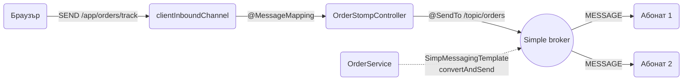
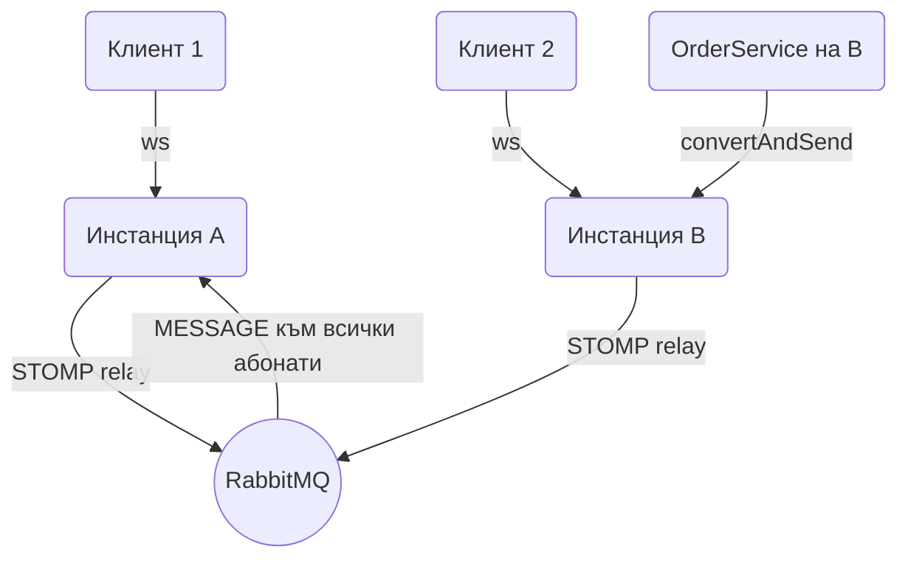

# WebSockets и SSE

HTTP е заявка-отговор: сървърът не може да каже нищо на браузъра, докато браузърът не попита. Когато трябва да бутнеш статус на поръчка, нотификация или прогрес на обработка в момента, в който се случи, имаш три избора: polling, Server-Sent Events (еднопосочен поток от сървъра) и WebSocket (двупосочен канал). Spring поддържа и трите: `SseEmitter` в обикновен controller, суров `WebSocketHandler` и STOMP над WebSocket с broker, destinations и `@MessageMapping`. Този документ показва кога кое е правилният избор, пълната конфигурация, автентикация на socket връзки, мащабиране на повече от една инстанция и тестове.

| Какво | Кога | Инструмент |
|---|---|---|
| Сървърът бута събития, клиентът само чете | Нотификации, прогрес, dashboard | SSE с `SseEmitter` |
| Двупосочен канал с прост протокол | Чат, игра, собствен JSON протокол | Raw WebSocket с `TextWebSocketHandler` |
| Pub/sub с destinations и routing | Много типове съобщения, абонаменти per user | STOMP с `@EnableWebSocketMessageBroker` |
| Повече от една инстанция | Production с 2+ pod-а | `enableStompBrokerRelay` или Redis pub/sub |
| Домейн събитие към браузъра | След commit в service | `@EventListener` + `SimpMessagingTemplate` |

## 1. Зависимости и настройка

```xml pom.xml
<dependency>
    <groupId>org.springframework.boot</groupId>
    <artifactId>spring-boot-starter-websocket</artifactId>
</dependency>

<!-- само за секция 6, STOMP relay към RabbitMQ -->
<dependency>
    <groupId>io.projectreactor.netty</groupId>
    <artifactId>reactor-netty</artifactId>
</dependency>
```

`spring-boot-starter-websocket` носи `spring-websocket`, `spring-messaging` и Tomcat WebSocket имплементацията. SSE няма нужда от нищо извън `spring-boot-starter-web` и няма задължителни properties: timeout-ът се задава на самия `SseEmitter`.

### WebSocket, SSE или polling

| Критерий | Polling | SSE | WebSocket |
|---|---|---|---|
| Посока | клиент пита | сървър към клиент | двупосочно |
| Протокол | HTTP | HTTP, `text/event-stream` | upgrade към `ws://` |
| Прокси и load balancer | работи навсякъде | работи, трябва изключен buffering | трябва upgrade support, обикновено ок |
| Reconnect | няма нужда | вграден в браузъра, `Last-Event-ID` | ръчен, пишеш го в клиента |
| Браузър API | `fetch` | `EventSource` | `WebSocket` |
| Auth | обикновени headers | cookie или query param, `EventSource` не праща custom headers | cookie, query param или първи frame |
| Бинарни данни | да | не, само текст | да |
| Цена на сървъра | заявка на интервал | една отворена връзка | една отворена връзка |
| Използвай за | рядко променящи се данни | нотификации, прогрес, live таблица | чат, колаборация, игри |

Правило: ако клиентът само слуша, SSE. Ако клиентът и праща много и често, WebSocket. Ако данните се сменят веднъж на минута, polling с `Cache-Control` и не усложнявай.

## 2. Минимален работещ пример с SSE

SSE е най-простият път и често е достатъчен. Controller връща `SseEmitter`, държиш го в registry и го ползваш, когато има какво да пратиш.

```java src/main/java/com/acme/shop/notification/NotificationStreamController.java
package com.acme.shop.notification;

import org.springframework.http.MediaType;
import org.springframework.web.bind.annotation.GetMapping;
import org.springframework.web.bind.annotation.RequestHeader;
import org.springframework.web.bind.annotation.RestController;
import org.springframework.web.servlet.mvc.method.annotation.SseEmitter;

import java.security.Principal;

@RestController
public class NotificationStreamController {

    private final SseRegistry registry;

    public NotificationStreamController(SseRegistry registry) {
        this.registry = registry;
    }

    @GetMapping(path = "/api/notifications/stream", produces = MediaType.TEXT_EVENT_STREAM_VALUE)
    public SseEmitter stream(Principal principal,
                             @RequestHeader(value = "Last-Event-ID", required = false) String lastEventId) {
        return registry.register(principal.getName(), lastEventId);
    }
}
```

```java src/main/java/com/acme/shop/notification/SseRegistry.java
package com.acme.shop.notification;

import org.springframework.web.servlet.mvc.method.annotation.SseEmitter;

@Component
public class SseRegistry {

    private static final long TIMEOUT_MS = Duration.ofMinutes(30).toMillis();

    private final Map<String, Set<SseEmitter>> byUser = new ConcurrentHashMap<>();
    private final NotificationRepository notifications;

    public SseRegistry(NotificationRepository notifications) {
        this.notifications = notifications;
    }

    public SseEmitter register(String userId, String lastEventId) {
        var emitter = new SseEmitter(TIMEOUT_MS);
        byUser.computeIfAbsent(userId, k -> new CopyOnWriteArraySet<>()).add(emitter);

        Runnable remove = () -> byUser.getOrDefault(userId, Set.of()).remove(emitter);
        emitter.onCompletion(remove);
        emitter.onTimeout(remove);
        emitter.onError(ex -> remove.run());

        if (lastEventId != null) {
            // браузърът се е reconnect-нал, пращаме пропуснатото
            notifications.findAfter(userId, Long.parseLong(lastEventId)).forEach(n -> send(emitter, n));
        }
        return emitter;
    }

    public void publish(String userId, Notification n) {
        byUser.getOrDefault(userId, Set.of()).forEach(emitter -> send(emitter, n));
    }

    private void send(SseEmitter emitter, Notification n) {
        try {
            emitter.send(SseEmitter.event()
                .id(String.valueOf(n.id()))
                .name("notification")
                .data(n));
        } catch (IOException | IllegalStateException ex) {
            // клиентът е затворил, callback-ът ще го махне от registry-то
            emitter.completeWithError(ex);
        }
    }
}
```

Клиентът е три реда: `const es = new EventSource("/api/notifications/stream"); es.addEventListener("notification", e => showToast(JSON.parse(e.data).title));`. `EventSource` сам прави reconnect при прекъсване и праща `Last-Event-ID` с последния получен `id`. Затова всяко събитие трябва да има монотонно растящ `id` и сървърът трябва да може да върне пропуснатото. Ако пропуснатото не е важно (например live курс), игнорирай header-а.

Какво се случва отвътре: `SseEmitter` е `ResponseBodyEmitter`, който държи HTTP отговора отворен през Servlet async механизма. Нишката на Tomcat се освобождава веднага след `return`, а записите в отговора се правят от нишката, която вика `send()`. `data(obj)` минава през `HttpMessageConverter`, т.е. Jackson, и се сериализира като JSON.

## 3. Raw WebSocket

Когато ти трябва двупосочен канал със собствен JSON протокол и без STOMP слой.

### Конфигурация

```java src/main/java/com/acme/shop/common/config/WebSocketConfig.java
package com.acme.shop.common.config;

import org.springframework.context.annotation.Bean;
import org.springframework.context.annotation.Configuration;
import org.springframework.web.socket.config.annotation.EnableWebSocket;
import org.springframework.web.socket.config.annotation.WebSocketConfigurer;
import org.springframework.web.socket.config.annotation.WebSocketHandlerRegistry;
import org.springframework.web.socket.server.standard.ServletServerContainerFactoryBean;

@Configuration
@EnableWebSocket
public class WebSocketConfig implements WebSocketConfigurer {

    private final OrderSocketHandler orderHandler;
    private final JwtHandshakeInterceptor jwtInterceptor;

    public WebSocketConfig(OrderSocketHandler orderHandler, JwtHandshakeInterceptor jwtInterceptor) {
        this.orderHandler = orderHandler;
        this.jwtInterceptor = jwtInterceptor;
    }

    @Override
    public void registerWebSocketHandlers(WebSocketHandlerRegistry registry) {
        registry.addHandler(orderHandler, "/ws/orders")
            .addInterceptors(jwtInterceptor)
            .setAllowedOriginPatterns("https://*.example.com", "http://localhost:*");
    }

    @Bean
    public ServletServerContainerFactoryBean serverContainer() {
        var container = new ServletServerContainerFactoryBean();
        container.setMaxTextMessageBufferSize(64 * 1024);
        container.setMaxSessionIdleTimeout(Duration.ofMinutes(5).toMillis());
        return container;
    }
}
```

`setAllowedOriginPatterns` е задължително: по подразбиране Spring приема само same-origin, а браузърът праща `Origin` при handshake. `*` работи, но отваря сайта за cross-site WebSocket hijacking, ако ползваш cookie auth.

### Handler и registry на сесии

```java src/main/java/com/acme/shop/common/ws/OrderSocketHandler.java
package com.acme.shop.common.ws;

import org.springframework.web.socket.CloseStatus;
import org.springframework.web.socket.TextMessage;
import org.springframework.web.socket.WebSocketSession;
import org.springframework.web.socket.handler.ConcurrentWebSocketSessionDecorator;
import org.springframework.web.socket.handler.TextWebSocketHandler;

@Component
public class OrderSocketHandler extends TextWebSocketHandler {

    private final Map<UUID, Set<WebSocketSession>> byUser = new ConcurrentHashMap<>();
    private final ObjectMapper json;
    private final OrderQueryService orders;

    public OrderSocketHandler(ObjectMapper json, OrderQueryService orders) {
        this.json = json;
        this.orders = orders;
    }

    @Override
    public void afterConnectionEstablished(WebSocketSession raw) {
        // decorator-ът прави sendMessage thread-safe и ограничава буфера за бавни клиенти
        var session = new ConcurrentWebSocketSessionDecorator(raw, 5_000, 256 * 1024);
        UUID userId = (UUID) session.getAttributes().get("userId");
        byUser.computeIfAbsent(userId, k -> new CopyOnWriteArraySet<>()).add(session);
    }

    @Override
    protected void handleTextMessage(WebSocketSession session, TextMessage message) throws IOException {
        ClientMessage msg = json.readValue(message.getPayload(), ClientMessage.class);
        UUID userId = (UUID) session.getAttributes().get("userId");

        switch (msg) {
            case ClientMessage.Track t -> {
                OrderStatusDto status = orders.statusFor(userId, t.orderId());
                send(session, new ServerMessage.Status(t.orderId(), status.status(), status.eta()));
            }
            case ClientMessage.Ping p -> send(session, new ServerMessage.Pong());
        }
    }

    @Override
    public void afterConnectionClosed(WebSocketSession session, CloseStatus status) {
        byUserRemove(session);
    }

    public void sendToUser(UUID userId, ServerMessage message) {
        byUser.getOrDefault(userId, Set.of()).forEach(s -> send(s, message));
    }

    private void send(WebSocketSession session, ServerMessage message) {
        try {
            session.sendMessage(new TextMessage(json.writeValueAsString(message)));
        } catch (IOException ex) {
            try { session.close(CloseStatus.SESSION_NOT_RELIABLE); } catch (IOException ignored) { }
        }
    }

    private void byUserRemove(WebSocketSession session) {
        UUID userId = (UUID) session.getAttributes().get("userId");
        byUser.computeIfPresent(userId, (k, sessions) -> {
            sessions.removeIf(s -> s.getId().equals(session.getId()));
            return sessions.isEmpty() ? null : sessions;
        });
    }
}
```

Съобщенията като sealed interface с Jackson polymorphism (`ServerMessage` е по същия модел със `Status(orderId, status, eta)` и `Pong()`):

```java src/main/java/com/acme/shop/common/ws/ClientMessage.java
package com.acme.shop.common.ws;

import com.fasterxml.jackson.annotation.JsonSubTypes;
import com.fasterxml.jackson.annotation.JsonTypeInfo;

@JsonTypeInfo(use = JsonTypeInfo.Id.NAME, property = "type")
@JsonSubTypes({
    @JsonSubTypes.Type(value = ClientMessage.Track.class, name = "track"),
    @JsonSubTypes.Type(value = ClientMessage.Ping.class, name = "ping")
})
public sealed interface ClientMessage {
    record Track(UUID orderId) implements ClientMessage {}
    record Ping() implements ClientMessage {}
}
```

Защо `ConcurrentWebSocketSessionDecorator`: стандартната `WebSocketSession` не е thread-safe за `sendMessage`. Ако два listener-а пратят едновременно към един клиент, получаваш `IllegalStateException` от Tomcat. Decorator-ът сериализира изпращанията, а при бавен клиент, който не чете, буферира до лимита (тук 256 KB) или до времето (5 секунди) и после затваря сесията вместо да блокира нишката ти завинаги.

### HandshakeInterceptor за auth

Браузърният `WebSocket` API не позволява custom headers. Остават cookie (ако ползваш session auth, работи автоматично) или token в query параметър.

```java src/main/java/com/acme/shop/common/ws/JwtHandshakeInterceptor.java
package com.acme.shop.common.ws;

import org.springframework.http.server.ServerHttpRequest;
import org.springframework.http.server.ServerHttpResponse;
import org.springframework.http.server.ServletServerHttpRequest;
import org.springframework.stereotype.Component;
import org.springframework.web.socket.WebSocketHandler;
import org.springframework.web.socket.server.HandshakeInterceptor;

import java.util.Map;

@Component
public class JwtHandshakeInterceptor implements HandshakeInterceptor {

    private final JwtDecoderService jwt;

    public JwtHandshakeInterceptor(JwtDecoderService jwt) {
        this.jwt = jwt;
    }

    @Override
    public boolean beforeHandshake(ServerHttpRequest request, ServerHttpResponse response,
                                   WebSocketHandler handler, Map<String, Object> attributes) {
        if (!(request instanceof ServletServerHttpRequest servletRequest)) return false;
        String token = servletRequest.getServletRequest().getParameter("token");
        try {
            attributes.put("userId", jwt.userIdFrom(token));
            return true;
        } catch (JwtException | IllegalArgumentException ex) {
            response.setStatusCode(HttpStatus.UNAUTHORIZED);
            return false;
        }
    }

    @Override
    public void afterHandshake(ServerHttpRequest request, ServerHttpResponse response,
                               WebSocketHandler handler, Exception exception) { }
}
```

Token в URL попада в access логове и в browser history. Използвай краткоживущ token (1 минута), издаден от отделен `POST /api/ws-ticket` endpoint специално за handshake, а не основния access token. Виж [Authentication](Authentication.md).

### Ping/pong и idle timeout

Tomcat не праща ping сам. Прокситата и NAT-овете затварят тиха TCP връзка след 30 до 120 секунди. Прати ping от сървъра на 30 секунди:

```java src/main/java/com/acme/shop/common/ws/OrderSocketHandler.java
@Scheduled(fixedRate = 30_000)
public void ping() {
    byUser.values().stream().flatMap(Set::stream).forEach(s -> {
        try { s.sendMessage(new PingMessage()); } catch (IOException ex) { byUserRemove(s); }
    });
}
```

Клиентът отговаря с pong автоматично на ниво протокол. `setMaxSessionIdleTimeout` затваря сесии без никакъв трафик, което в комбинация с ping означава "клиентът е изчезнал".

## 4. STOMP над WebSocket

STOMP е текстов протокол с frame-ове `CONNECT`, `SUBSCRIBE`, `SEND`, `MESSAGE`. Spring го имплементира с вграден broker (или relay към истински), destinations като `/topic/orders` и controller методи с `@MessageMapping`. Печелиш routing, абонаменти per user, heartbeat и готови клиентски библиотеки. Губиш контрол над wire формата.

### Конфигурация

```java src/main/java/com/acme/shop/common/config/StompConfig.java
package com.acme.shop.common.config;

import org.springframework.context.annotation.Configuration;
import org.springframework.messaging.simp.config.MessageBrokerRegistry;
import org.springframework.web.socket.config.annotation.EnableWebSocketMessageBroker;
import org.springframework.web.socket.config.annotation.StompEndpointRegistry;
import org.springframework.web.socket.config.annotation.WebSocketMessageBrokerConfigurer;

@Configuration
@EnableWebSocketMessageBroker
public class StompConfig implements WebSocketMessageBrokerConfigurer {

    private final TaskScheduler heartbeatScheduler;

    // heartbeat-ът иска scheduler, инжектираме default-ния на Boot
    public StompConfig(TaskScheduler heartbeatScheduler) {
        this.heartbeatScheduler = heartbeatScheduler;
    }

    @Override
    public void configureMessageBroker(MessageBrokerRegistry registry) {
        registry.enableSimpleBroker("/topic", "/queue")
            .setHeartbeatValue(new long[]{10_000, 10_000})
            .setTaskScheduler(heartbeatScheduler);
        registry.setApplicationDestinationPrefixes("/app");
        registry.setUserDestinationPrefix("/user");
    }

    @Override
    public void registerStompEndpoints(StompEndpointRegistry registry) {
        registry.addEndpoint("/ws").setAllowedOriginPatterns("https://*.example.com", "http://localhost:*");
        // вариант със SockJS fallback за стари прокси, клиентът ползва sockjs-client
        registry.addEndpoint("/ws-sockjs").setAllowedOriginPatterns("https://*.example.com").withSockJS();
    }
}
```

Семантика на prefix-ите:

- `/app/**`: съобщения от клиента, които отиват към `@MessageMapping` методи.
- `/topic/**`, `/queue/**`: destinations, за които клиентите се абонират, broker-ът ги разнася.
- `/user/**`: per-user destinations. Клиент се абонира за `/user/queue/orders`, сървърът праща с `convertAndSendToUser("alice", "/queue/orders", ...)`, а Spring превежда до уникална сесийна destination.



### Controller

```java src/main/java/com/acme/shop/order/OrderStompController.java
package com.acme.shop.order;

import org.springframework.messaging.handler.annotation.*;
import org.springframework.messaging.simp.annotation.SendToUser;
import org.springframework.messaging.simp.annotation.SubscribeMapping;
import org.springframework.stereotype.Controller;

import java.security.Principal;

@Controller
public class OrderStompController {

    private final OrderQueryService orders;

    public OrderStompController(OrderQueryService orders) {
        this.orders = orders;
    }

    // клиентът праща към /app/orders/track, отговорът отива само до него
    @MessageMapping("/orders/track")
    @SendToUser("/queue/orders")
    public OrderStatusDto track(TrackRequest request, Principal principal) {
        return orders.statusFor(principal.getName(), request.orderId());
    }

    // при SUBSCRIBE към /app/orders/{id}/snapshot клиентът получава еднократен отговор без broker
    @SubscribeMapping("/orders/{id}/snapshot")
    public OrderStatusDto snapshot(@DestinationVariable UUID id, Principal principal) {
        return orders.statusFor(principal.getName(), id);
    }

    @MessageExceptionHandler(OrderNotFoundException.class)
    @SendToUser("/queue/errors")
    public ErrorMessage onNotFound(OrderNotFoundException ex) {
        return new ErrorMessage("ORDER_NOT_FOUND", ex.getMessage());
    }
}
```

`@SubscribeMapping` е удобен за initial snapshot: клиентът се абонира и веднага получава текущото състояние, а после живите промени идват от `/topic`. За broadcast към всички (чат, support канал) методът връща стойност с `@SendTo("/topic/support")`. `@MessageExceptionHandler` работи като `@ExceptionHandler`, но за съобщения, и обикновено отговаря към `/user/queue/errors`.

### Изпращане от service

```java src/main/java/com/acme/shop/order/OrderStatusPusher.java
package com.acme.shop.order;

import org.springframework.messaging.simp.SimpMessagingTemplate;

@Component
public class OrderStatusPusher {

    private final SimpMessagingTemplate messaging;

    public OrderStatusPusher(SimpMessagingTemplate messaging) {
        this.messaging = messaging;
    }

    @TransactionalEventListener
    public void onStatusChanged(OrderStatusChangedEvent event) {
        var dto = new OrderStatusDto(event.orderId(), event.newStatus(), event.eta());
        messaging.convertAndSendToUser(event.customerId().toString(), "/queue/orders", dto);
        messaging.convertAndSend("/topic/admin/orders", dto);
    }
}
```

Слушаме събитие след commit, за да не пратим статус, който после е rollback-нат. Събитията и фазите са описани в [Events](Events.md). `convertAndSendToUser` взема името на `Principal`, както го е задал auth слоят при CONNECT (секция 5).

### JS клиент

```html
<script type="module">
  import { Client } from "https://cdn.jsdelivr.net/npm/@stomp/stompjs@7/esm6/index.js";

  const client = new Client({
    brokerURL: "wss://api.example.com/ws",
    connectHeaders: { Authorization: "Bearer " + accessToken },
    heartbeatIncoming: 10000,
    heartbeatOutgoing: 10000,
    reconnectDelay: 3000,
    onConnect: () => {
      client.subscribe("/user/queue/orders", msg => render(JSON.parse(msg.body)));
      client.publish({ destination: "/app/orders/track", body: JSON.stringify({ orderId }) });
    }
  });
  client.activate();
</script>
```

`@stomp/stompjs` прави reconnect с `reconnectDelay` и преабонира автоматично, ако абонаментите са в `onConnect`.

## 5. Автентикация и авторизация

### Къде отива token-ът

Два варианта:

| Вариант | Как | Плюс | Минус |
|---|---|---|---|
| Query param при handshake | `wss://host/ws?token=...` + `HandshakeInterceptor` | Работи и за raw WS | Token в логове и history |
| Header в STOMP CONNECT frame | `connectHeaders: { Authorization }` + `ChannelInterceptor` | Нищо в URL | Само за STOMP |
| Session cookie | Spring Security session, нищо допълнително | Нулев код | Трябва CSRF и sticky sessions |

За STOMP предпочитай CONNECT frame. `ChannelInterceptor` на inbound канала хваща CONNECT, валидира token-а и слага `Principal` в сесията:

```java src/main/java/com/acme/shop/common/config/StompAuthConfig.java
package com.acme.shop.common.config;

import org.springframework.messaging.simp.config.ChannelRegistration;
import org.springframework.messaging.simp.stomp.StompCommand;
import org.springframework.messaging.simp.stomp.StompHeaderAccessor;
import org.springframework.messaging.support.ChannelInterceptor;
import org.springframework.messaging.support.MessageHeaderAccessor;

@Configuration
@EnableWebSocketMessageBroker
// трябва да сме преди Spring Security's interceptor, който проверява Principal
@Order(Ordered.HIGHEST_PRECEDENCE + 99)
public class StompAuthConfig implements WebSocketMessageBrokerConfigurer {

    private final JwtAuthenticationService jwtAuth;

    public StompAuthConfig(JwtAuthenticationService jwtAuth) {
        this.jwtAuth = jwtAuth;
    }

    @Override
    public void configureClientInboundChannel(ChannelRegistration registration) {
        registration.interceptors(new ChannelInterceptor() {
            @Override
            public Message<?> preSend(Message<?> message, MessageChannel channel) {
                var accessor = MessageHeaderAccessor.getAccessor(message, StompHeaderAccessor.class);
                if (accessor != null && StompCommand.CONNECT.equals(accessor.getCommand())) {
                    String header = accessor.getFirstNativeHeader("Authorization");
                    if (header == null || !header.startsWith("Bearer ")) {
                        throw new AccessDeniedException("missing token");
                    }
                    Authentication auth = jwtAuth.authenticate(header.substring(7));
                    accessor.setUser(auth);
                }
                return message;
            }
        });
    }
}
```

Изключение в `preSend` на CONNECT връща `ERROR` frame на клиента и затваря връзката. `accessor.setUser(auth)` се помни от Spring за цялата WebSocket сесия, така че `Principal` параметърът в `@MessageMapping` и `convertAndSendToUser` работят.

### Авторизация на съобщения

Spring Security 6 защитава destinations с `AuthorizationManager<Message<?>>`:

```xml pom.xml
<dependency>
    <groupId>org.springframework.security</groupId>
    <artifactId>spring-security-messaging</artifactId>
</dependency>
```

```java src/main/java/com/acme/shop/common/config/WebSocketSecurityConfig.java
package com.acme.shop.common.config;

import org.springframework.messaging.Message;
import org.springframework.security.authorization.AuthorizationManager;
import org.springframework.security.config.annotation.web.socket.EnableWebSocketSecurity;
import org.springframework.security.messaging.access.intercept.MessageMatcherDelegatingAuthorizationManager;

@Configuration
@EnableWebSocketSecurity
public class WebSocketSecurityConfig {

    @Bean
    AuthorizationManager<Message<?>> messageAuthorizationManager(
            MessageMatcherDelegatingAuthorizationManager.Builder messages) {
        return messages
            .nullDestMatcher().authenticated()
            .simpSubscribeDestMatchers("/user/queue/**", "/topic/support").authenticated()
            .simpSubscribeDestMatchers("/topic/admin/**").hasRole("ADMIN")
            .simpDestMatchers("/app/**").authenticated()
            .anyMessage().denyAll()
            .build();
    }
}
```

`nullDestMatcher` покрива CONNECT, DISCONNECT и heartbeat. Без `anyMessage().denyAll()` клиент може да се абонира директно за `/topic/admin/orders` и да получава всичко.

### CSRF

`@EnableWebSocketSecurity` включва CSRF проверка на CONNECT frame-а: клиентът трябва да прати CSRF token в header. Това има смисъл при cookie auth. При JWT в header CSRF атака е невъзможна (атакуващият сайт не знае token-а), затова го изключваш с no-op interceptor под точно това име:

```java src/main/java/com/acme/shop/common/config/WebSocketSecurityConfig.java
@Bean("csrfChannelInterceptor")
ChannelInterceptor csrfChannelInterceptor() {
    return new ChannelInterceptor() { };
}
```

Самият handshake е GET и не минава през CSRF филтъра на HTTP слоя. Повече за ролите и matchers в [Authorization](Authorization.md).

## 6. Повече от една инстанция

Вграденият simple broker живее в паметта на една JVM. Клиент, свързан към pod A, не получава съобщение, публикувано на pod B. При две и повече инстанции трябва общ слой.



### STOMP broker relay

Spring препраща всички `/topic` и `/queue` destinations към външен STOMP broker. RabbitMQ с `rabbitmq_stomp` plugin е стандартният избор.

```java src/main/java/com/acme/shop/common/config/StompConfig.java
@Override
public void configureMessageBroker(MessageBrokerRegistry registry) {
    registry.enableStompBrokerRelay("/topic", "/queue")
        .setRelayHost(relayHost)
        .setRelayPort(61613)
        .setClientLogin("app")
        .setClientPasscode(relayPassword)
        .setSystemLogin("app")
        .setSystemPasscode(relayPassword);
    registry.setApplicationDestinationPrefixes("/app");
    registry.setUserDestinationPrefix("/user");
}
```

Как работи: всяка инстанция държи една "system" TCP връзка към RabbitMQ за изпращане от сървъра и по една връзка per клиентска сесия за абонаменти. `convertAndSend("/topic/orders", ...)` на инстанция B отива в RabbitMQ, който го разнася до абонатите на A и B. Sticky sessions не са нужни: WebSocket връзката остава на инстанцията, която я е приела, а абонаментите живеят в broker-а.

`convertAndSendToUser` работи през relay с уговорка: user destination се резолва до сесия на инстанцията, която я държи. За да стига до правилната инстанция, добави `registry.setUserRegistryBroadcast("/topic/registry")` и `setUserDestinationBroadcast("/topic/unresolved-user")`, които синхронизират `SimpUserRegistry` през broker-а.

### Redis pub/sub за raw handler

Ако не ползваш STOMP, най-лекият fan-out е Redis pub/sub: service-ът публикува в Redis канал, всяка инстанция слуша и праща към своите локални сесии.

```java src/main/java/com/acme/shop/order/OrderStatusBroadcaster.java
package com.acme.shop.order;

@Component
public class OrderStatusBroadcaster {

    private final StringRedisTemplate redis;
    private final ObjectMapper json;

    public OrderStatusBroadcaster(StringRedisTemplate redis, ObjectMapper json) {
        this.redis = redis;
        this.json = json;
    }

    @TransactionalEventListener
    public void onStatusChanged(OrderStatusChangedEvent event) throws JsonProcessingException {
        redis.convertAndSend("order-status", json.writeValueAsString(event));
    }
}

```

На всяка инстанция `OrderStatusSubscriber` (регистриран в `RedisMessageListenerContainer`) десериализира събитието и вика `handler.sendToUser(...)` за своите локални сесии. Пълният subscriber, конфигурацията на container-а и сравнението с Kafka и NATS са в [Message brokers: Kafka, Redis, NATS](Message_Brokers.md). Redis pub/sub е fire-and-forget: ако никоя инстанция не слуша в момента, съобщението изчезва, което за live push е приемливо.

## 7. Backpressure, бавни клиенти и heartbeat

Бавен клиент (мобилен на лоша мрежа, таб на заден план) не чете от socket-а, TCP буферът се пълни и `sendMessage` започва да блокира. Без защита една нишка на executor-а ти увисва, после втора, после всички.

- Raw WS: `ConcurrentWebSocketSessionDecorator` с `sendTimeLimit` и `bufferSizeLimit`. При надвишаване сесията се затваря с `SESSION_NOT_RELIABLE`.
- STOMP: същата защита е вградена, настройва се през `WebSocketTransportRegistration`:

```java src/main/java/com/acme/shop/common/config/StompConfig.java
@Override
public void configureWebSocketTransport(WebSocketTransportRegistration registration) {
    registration.setSendTimeLimit(5_000)
        .setSendBufferSizeLimit(256 * 1024)
        .setMessageSizeLimit(64 * 1024);
}
```

Heartbeat: STOMP heartbeat `[10000, 10000]` означава "сървърът праща на 10 секунди, очаква от клиента на 10 секунди". Ако три интервала минат без нищо, сесията се затваря. Това е единственият надежден начин да разбереш, че клиентът е изчезнал без да затвори връзката. Изисква `TaskScheduler` (в секция 4 го създаваме).

Не прави broadcast на всяка промяна поотделно при високочестотни данни (цена, позиция). Събирай в буфер и пращай на 100 до 250 ms. Клиентът няма да усети разликата, а трафикът и CPU падат десетократно.

## 8. SSE в дълбочина

### Timeout и прокси

`SseEmitter(timeout)`: след това време Spring затваря отговора и вика `onTimeout`. Браузърът ще reconnect-не. Безкраен timeout (`0L`) е лоша идея, защото мъртви връзки, за които TCP не е разбрал, остават завинаги. 30 минути е разумно.

Nginx буферира отговорите по подразбиране и клиентът ще получава събитията на пакети, когато буферът се напълни. Изключи го за SSE пътя с `proxy_buffering off` и `proxy_read_timeout 1h` в `location`, или прати header от приложението, който nginx уважава без конфигурация:

```java src/main/java/com/acme/shop/notification/NotificationStreamController.java
@GetMapping(path = "/stream", produces = MediaType.TEXT_EVENT_STREAM_VALUE)
public ResponseEntity<SseEmitter> stream(Principal principal) {
    return ResponseEntity.ok()
        .header("X-Accel-Buffering", "no")
        .header("Cache-Control", "no-cache")
        .body(registry.register(principal.getName(), null));
}
```

### Keep-alive

Също като при WebSocket, прокситата затварят тиха връзка. Пращай коментар на 20 секунди:

```java src/main/java/com/acme/shop/notification/SseRegistry.java
@Scheduled(fixedRate = 20_000)
public void keepAlive() {
    all().forEach(emitter -> {
        try { emitter.send(SseEmitter.event().comment("keep-alive")); }
        catch (IOException | IllegalStateException ex) { emitter.completeWithError(ex); }
    });
}
```

### Прогрес на дълга операция

Типичен случай: клиентът качва CSV, `POST /api/imports` връща `202 Accepted` с `Location: /api/imports/{jobId}/progress`, а този endpoint е `SseEmitter` в registry по `jobId`. Worker-ът вика `progressRegistry.report(jobId, 42)` на всеки 100 реда и `complete(jobId)` накрая, което вика `emitter.complete()`. Самата обработка върви в job queue, виж [Cron, @Async и опашки](Scheduling_Queues.md). Това е сценарият, в който SSE печели: нищо не се връща към сървъра, а `EventSource` reconnect-ва сам, ако мрежата мигне.

В WebFlux SSE е просто `Flux<ServerSentEvent<T>>` от controller метод, без emitter registry и с вграден backpressure. Ако проектът ти е MVC, не минавай на WebFlux само за SSE, `SseEmitter` е напълно достатъчен.

## 9. Пълен пример: статус на поръчка и admin dashboard

Клиентът вижда статуса на своята поръчка на живо, а admin dashboard-ът вижда всички промени. Събитието идва от service-а след commit.

```java src/main/java/com/acme/shop/order/
package com.acme.shop.order;

public record OrderStatusChangedEvent(UUID orderId, UUID customerId, String newStatus, Instant eta) {}

@Service
public class OrderService {

    private final OrderRepository orders;
    private final ApplicationEventPublisher events;

    public OrderService(OrderRepository orders, ApplicationEventPublisher events) {
        this.orders = orders;
        this.events = events;
    }

    @Transactional
    public void markShipped(UUID orderId, Instant eta) {
        Order order = orders.findById(orderId).orElseThrow(() -> new OrderNotFoundException(orderId));
        order.ship(eta);
        events.publishEvent(new OrderStatusChangedEvent(order.getId(), order.getCustomerId(), "SHIPPED", eta));
    }
}
```

### Клиент през STOMP

Абонира се за `/user/queue/orders` след CONNECT с JWT. Push-ът е `OrderStatusPusher` от секция 4, който вика `convertAndSendToUser(customerId, "/queue/orders", dto)`. `Principal.getName()` трябва да връща същото, с което пращаме, т.е. `customerId` като string. Уверяваш се в `JwtAuthenticationService.authenticate`, че `Authentication.getName()` е customer id, не email.

### Клиент през raw WS

Същото събитие, друг listener: `@TransactionalEventListener` в `OrderStatusRawPusher`, който вика `handler.sendToUser(event.customerId(), new ServerMessage.Status(...))` от секция 3. При няколко инстанции заменяш директното `sendToUser` с Redis publish (секция 6), а `OrderStatusSubscriber` на всяка инстанция прави локалното изпращане.

### Admin dashboard със SSE

Admin-ът само гледа, затова SSE. Защитено с роля, виж [Authorization](Authorization.md).

```java src/main/java/com/acme/shop/order/AdminOrderStreamController.java
package com.acme.shop.order;

@RestController
@RequestMapping("/api/admin/orders")
public class AdminOrderStreamController {

    private final Set<SseEmitter> emitters = new CopyOnWriteArraySet<>();

    @PreAuthorize("hasRole('ADMIN')")
    @GetMapping(path = "/stream", produces = MediaType.TEXT_EVENT_STREAM_VALUE)
    public SseEmitter stream() {
        var emitter = new SseEmitter(Duration.ofMinutes(30).toMillis());
        emitters.add(emitter);
        emitter.onCompletion(() -> emitters.remove(emitter));
        emitter.onTimeout(() -> emitters.remove(emitter));
        return emitter;
    }

    @TransactionalEventListener
    public void onStatusChanged(OrderStatusChangedEvent event) {
        for (SseEmitter emitter : emitters) {
            try { emitter.send(SseEmitter.event().name("order-status").data(event)); }
            catch (IOException | IllegalStateException ex) { emitters.remove(emitter); }
        }
    }
}
```

Controller с `@TransactionalEventListener` е приемливо за малък dashboard. При растеж го изнасяш в отделен registry като в секция 2.

## 10. Тестване

### STOMP с WebSocketStompClient

```java src/test/java/com/acme/shop/order/OrderStompIT.java
package com.acme.shop.order;

import org.springframework.messaging.converter.MappingJackson2MessageConverter;
import org.springframework.messaging.simp.stomp.*;
import org.springframework.web.socket.client.standard.StandardWebSocketClient;
import org.springframework.web.socket.messaging.WebSocketStompClient;

@SpringBootTest(webEnvironment = SpringBootTest.WebEnvironment.RANDOM_PORT)
class OrderStompIT {

    @LocalServerPort int port;
    @Autowired OrderService orderService;
    @Autowired TestJwtFactory jwts;

    @Test
    void customerReceivesStatusUpdate() throws Exception {
        var client = new WebSocketStompClient(new StandardWebSocketClient());
        client.setMessageConverter(new MappingJackson2MessageConverter());

        var connectHeaders = new StompHeaders();
        connectHeaders.add("Authorization", "Bearer " + jwts.forCustomer(customerId));

        StompSession session = client.connectAsync("ws://localhost:" + port + "/ws",
                new WebSocketHttpHeaders(), connectHeaders, new StompSessionHandlerAdapter() { })
            .get(5, TimeUnit.SECONDS);
        var received = new ArrayBlockingQueue<OrderStatusDto>(1);
        session.subscribe("/user/queue/orders", new StompFrameHandler() {
            @Override public Type getPayloadType(StompHeaders headers) { return OrderStatusDto.class; }
            @Override public void handleFrame(StompHeaders headers, Object payload) {
                received.offer((OrderStatusDto) payload);
            }
        });

        orderService.markShipped(orderId, Instant.now().plus(Duration.ofDays(2)));

        OrderStatusDto dto = received.poll(5, TimeUnit.SECONDS);
        assertThat(dto).isNotNull();
        assertThat(dto.status()).isEqualTo("SHIPPED");
        session.disconnect();
    }
}
```

Абонаментът трябва да е направен преди `markShipped`, иначе съобщението минава преди да слушаш. При relay към RabbitMQ пускаш го с Testcontainers, иначе simple broker-ът е достатъчен за теста.

### Raw WS със StandardWebSocketClient

```java src/test/java/com/acme/shop/common/ws/OrderSocketHandlerIT.java
@Test
void trackReturnsStatus() throws Exception {
    var received = new ArrayBlockingQueue<String>(1);
    var handler = new TextWebSocketHandler() {
        @Override
        protected void handleTextMessage(WebSocketSession session, TextMessage message) {
            received.offer(message.getPayload());
        }
    };
    WebSocketSession session = new StandardWebSocketClient()
        .execute(handler, "ws://localhost:" + port + "/ws/orders?token=" + jwts.wsTicket(customerId))
        .get(5, TimeUnit.SECONDS);

    session.sendMessage(new TextMessage("{\"type\":\"track\",\"orderId\":\"" + orderId + "\"}"));

    assertThat(received.poll(5, TimeUnit.SECONDS)).contains("\"type\":\"status\"");
    session.close();
}
```

### SSE

SSE се тества с обикновен HTTP клиент, който чете stream-а. `RestClient` не е подходящ за безкраен поток, затова използвай `WebTestClient` (дори в MVC проект, с `spring-webflux` в test scope) или просто `HttpClient` на JDK с `BodyHandlers.ofLines()` и прочети първите N реда. Как се организират интеграционните тестове е в [Testing](Testing.md).

## 11. Капани

- `setAllowedOrigins("*")` с cookie auth: всеки сайт може да отвори WebSocket към теб от браузъра на логнат потребител. Избройте origin-ите, или ползвайте token auth.
- `sendMessage` от няколко нишки без `ConcurrentWebSocketSessionDecorator`: `IllegalStateException: The remote endpoint was in state [TEXT_FULL_WRITING]`. Винаги увивай сесията.
- Без heartbeat или ping: мъртви сесии, за които никой не е пратил FIN, стоят в registry-то с дни и ядат памет. Ping на 30 секунди плюс idle timeout.
- Simple broker на две инстанции: половината клиенти не получават съобщения и бъгът изглежда случаен. Relay или Redis от деня, в който пуснеш втория pod.
- Пращаш от обикновен `@EventListener` преди commit: клиентът вижда "SHIPPED", транзакцията се rollback-ва, базата казва "PLACED". `@TransactionalEventListener`.
- `SseEmitter` без timeout и без cleanup callback-и: registry-то расте безкрайно. SSE зад nginx с буфериране: събитията пристигат на пакети. `X-Accel-Buffering: no`.
- `EventSource` не праща custom headers, значи Bearer token от localStorage не работи. Cookie auth или краткоживущ token в URL с живот под минута.
- `@EnableWebSocketSecurity` без `anyMessage().denyAll()`: клиентите могат да се абонират за всичко, включително admin topics.

## 12. Чеклист

- [ ] Избрано е SSE за еднопосочен push, WebSocket за двупосочен, polling за бавно променящи се данни.
- [ ] Allowed origins са изброени изрично, без `*`.
- [ ] Auth на socket-а е решена: cookie, краткоживущ ticket в URL или token в CONNECT frame, и `Principal` се сетва при connect.
- [ ] STOMP destinations са защитени с `AuthorizationManager<Message<?>>` и `anyMessage().denyAll()`.
- [ ] Всяка сесия е увита в `ConcurrentWebSocketSessionDecorator` или транспортът има `sendTimeLimit` и `sendBufferSizeLimit`.
- [ ] Има heartbeat или ping и idle timeout.
- [ ] Push-ът към клиенти се прави от `@TransactionalEventListener`, не от service-а преди commit.
- [ ] Registry на сесии и emitters се чисти при close, timeout и error, и за повече от една инстанция има broker relay или Redis fan-out.
- [ ] SSE endpoint-ите имат timeout, keep-alive коментар, `X-Accel-Buffering: no` и растящ `id` за `Last-Event-ID`.
- [ ] Има интеграционен тест с `WebSocketStompClient` или `StandardWebSocketClient` за основния сценарий.

## 13. Свързани документи

- [Events](Events.md): `@TransactionalEventListener`, с който домейн събитията стигат до socket push.
- [Message brokers: Kafka, Redis, NATS](Message_Brokers.md): Redis pub/sub и RabbitMQ за fan-out между инстанции.
- [Authentication](Authentication.md): JWT, краткоживущи ticket-и и как се създава `Authentication` от token.
- [Authorization](Authorization.md): роли, `@PreAuthorize` и matchers, използвани за destinations.
- [Cron, @Async и опашки](Scheduling_Queues.md): worker-ът, който праща прогрес през SSE, и `@Scheduled` за ping.
- [Testing](Testing.md): `@SpringBootTest` с random port и интеграционни тестове.
- [Docker и деплой](Docker_Deploy.md): nginx и ingress настройки за upgrade и buffering.
- [Spring Framework reference, WebSockets](https://docs.spring.io/spring-framework/reference/web/websocket.html)
