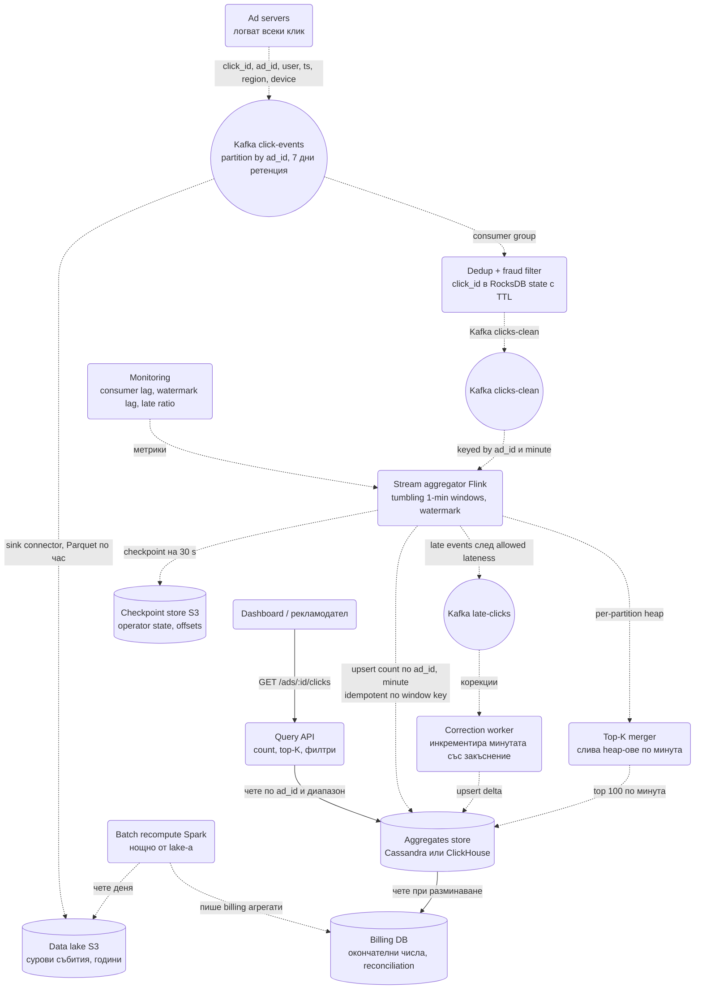
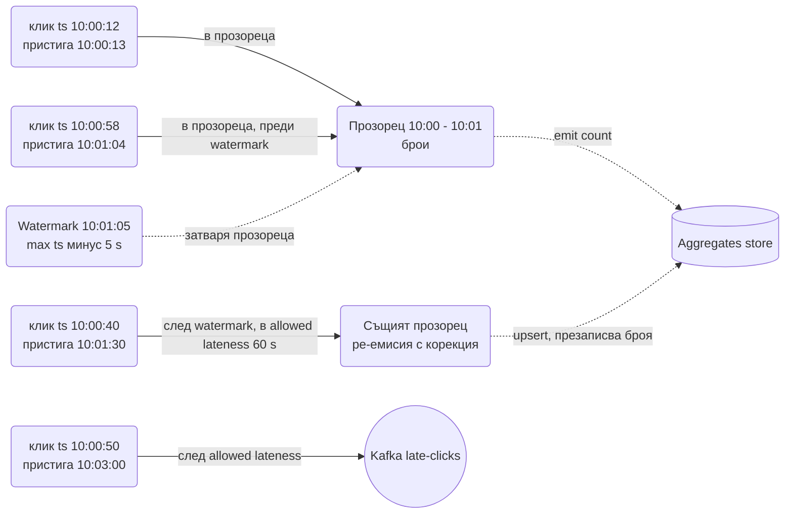
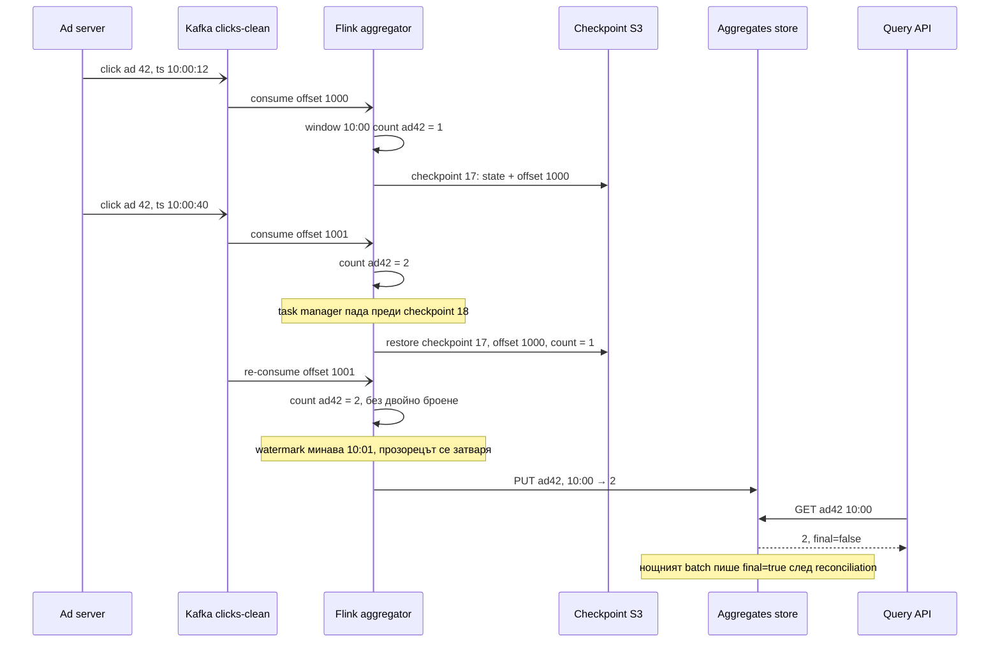

# Агрегация на рекламни кликове в реално време (Ad Click Event Aggregation) - System Design

Рекламодателят плаща за всеки клик, затова броят кликове на реклама за всяка минута е **фактура**,
не статистика. Същевременно търговците искат да виждат кампанията си "на живо" и да спрат бюджет,
който изтича. Двете изисквания се бият: реалното време иска приблизителен отговор веднага,
фактурата иска точен отговор, дори да е утре. Целият дизайн е как да дадеш и двете от един и същ
поток от събития.

Това е каноничната **stream processing** система в интервютата и проверява понятията, които
останалите системи в папката само споменават: прозорци по време, event time срещу processing time,
watermarks, закъснели събития и exactly-once обработка.

## Архитектурна диаграма



**Как да четеш диаграмата:** отгоре е един поток от сурови кликове в Kafka, от който тръгват две
пътеки. Горещата (отляво надолу): дедупликация и фрод филтър, после Flink агрегира по реклама и
минута с watermark, пише готовите броячи в store-а и разпраща закъснелите събития по отделен
коригиращ път. Студената (отдясно): суровите събития отиват непроменени в data lake-а, откъдето
нощен batch преизчислява деня за фактурите и го сравнява с горещите числа. Отдолу Query API-то
обслужва дашбордите само от агрегатите, никога от суровите събития. Всичко е пунктирано, защото
нито един клик не чака нищо: това е система от асинхронни потоци с един синхронен път за четене.

## Системен дизайн накратко

Един поток от сурови кликове и две пътеки от него: гореща (stream, приблизително, веднага) и студена (batch от lake-а, точно, за фактурата). 6 сървиса, почти всичко асинхронно; единственият синхронен път е Query API-то, което чете само готови агрегати.

### Сървиси

| # | Сървис | Какво прави | Как комуникира |
| --- | --- | --- | --- |
| 1 | **Dedup + fraud filter** | `click_id` в RocksDB state с TTL 24 h (Bloom отпред); фрод правила и скор, флаг вместо изхвърляне | Kafka consumer `click-events` (pull, партиция по `ad_id`); локален RocksDB на всеки task; Kafka producer `clicks-clean` |
| 2 | **Stream aggregator** (Flink) | Tumbling 1-min прозорци по `(ad_id, minute)` в event time, watermark 5-10 s, allowed lateness 60 s; излъчва пълния брой на прозореца | Kafka consumer `clicks-clean` (pull); checkpoint на 30 s по S3 API; idempotent upsert по CQL (Cassandra) или HTTP (ClickHouse) към Aggregates store; Kafka producer `late-clicks` |
| 3 | **Correction worker** | Инкрементира минутата за много закъснели събития | Kafka consumer `late-clicks` (pull); CQL `UPDATE count = count + n` |
| 4 | **Top-K merger** | Слива per-partition heap-овете в глобален top 100 на минута | Flink оператор: получава K кандидати от всяка партиция през вътрешния network shuffle на Flink; пише един ред на минута в store-а |
| 5 | **Batch recompute** (Spark) | Нощно преизчислява деня от lake-а със същата библиотека, пише billing агрегати, reconciliation срещу горещите | Чете Parquet от S3 по S3 API; JDBC към Billing DB (Postgres); CQL към Aggregates store за сравнение |
| 6 | **Query API** | Count по реклама и диапазон, top-K, флаг `final` | HTTPS REST от дашборда (синхронно); CQL или HTTP към Aggregates store; никога не чете Kafka или сурови събития |

### Хранилища

| Компонент | Роля |
| --- | --- |
| Kafka | `click-events` (партиция по `ad_id`, 7 дни), `clicks-clean`, `late-clicks` |
| Data lake (S3, Parquet по час) | Сурови събития за години; източник за batch и backfill; пълни се от Kafka sink connector |
| Checkpoint store (S3) | Operator state + offsets атомарно |
| Aggregates store (Cassandra или ClickHouse) | `(ad_id, minute) → count`, top-K редове |
| Billing DB (Postgres) | Окончателни числа, reconciliation |

### Комуникация, backpressure и патерни

- **Асинхронно:** всичко до Query API-то; нито един клик не чака нищо.
- **Синхронно:** само `GET /ads/:id/clicks` от готовите агрегати.
- **Backpressure:** Kafka с 7 дни ретенция поглъща пикове и бъгове (replay); consumer lag и watermark lag са метриките за скалиране; salting на горещ `ad_id` в 16 подключа с two-phase aggregation; партиции 2-3 пъти повече от task-овете.
- **Патерни:** event time + watermark + allowed lateness, exactly-once чрез checkpoint (state + offset) + идемпотентен upsert по ключ на прозореца, дедупликация по `click_id`, lambda архитектура с обща библиотека и reconciliation, per-partition heap + merge за top-K, backfill чрез нов consumer group и `offsetsForTimes`.

### Flow: сценариите стъпка по стъпка

**Клик до дашборда.** Потребител кликва реклама 42 в 10:00:12 на телефона си. Ad server-ът логва събитие `{click_id: uuid, ad_id: 42, ts: 10:00:12.123, region: BG, device: ios}` и го публикува в Kafka `click-events`, в партицията на `ad_id = 42` (всички кликове на една реклама са в една партиция, за да не трябва размесване при броенето). `ts` е моментът на клика (event time), не моментът, в който сме го получили. Kafka sink connector копира същото събитие непроменено в Parquet файлове в S3 по час, за студената пътека. Dedup етапът тегли събитието (pull), проверява `click_id` в своя RocksDB state (с Bloom filter отпред, за да не чете диска за всеки нов ключ): нов е, записва го с TTL 24 часа. Ако същият `click_id` дойде пак (ретрай на клиента, на log shipper-а или на producer-а), се изхвърля, защото всеки ретрай иначе е фалшива фактура. Фрод правилата проверяват дали от този `ip_hash` няма 50 клика в минутата и дали е имало impression преди клика; съмнителното се маркира с флаг, не се изтрива, за да има следа при спор. Събитието отива в `clicks-clean`. Flink агрегаторът го тегли и го добавя в прозореца 10:00-10:01 за реклама 42: броячът става 1, после 2 и така нататък в паметта на задачата. Когато watermark-ът (твърдението "не очаквам повече събития с `ts` под 10:01:05", смятано като най-големия видян ts минус 5 секунди, минимум между партициите) подмине 10:01, прозорецът се затваря и Flink излъчва пълния брой: `PUT (ad 42, 10:00) → 2 341` в Cassandra. Не `+= 2 341`, а пълната стойност, защото повторно излъчване на същия прозорец трябва да презапише същото число, не да го удвои. Query API-то чете този ред за дашборда с `final: false`.

**Закъснял клик и срив на задача.** Клик с `ts = 10:00:40` пристига в 10:01:30, 25 секунди след като прозорецът е затворен, защото телефонът е бил в тунел. Прозорецът 10:00 обаче още е в state-а, защото allowed lateness е 60 секунди: Flink добавя клика, броячът става 2 342 и прозорецът се излъчва повторно с upsert, който презаписва 2 341 с 2 342 в същия ред. Клик с `ts = 10:00:50`, пристигнал в 10:03, е след allowed lateness и прозорецът вече е изхвърлен от паметта. Той отива в `late-clicks`, откъдето Correction worker-ът прави `UPDATE count = count + 1` за минутата 10:00. Делът на такива събития е метрика с аларма: скок означава бавна партиция или твърде агресивен watermark. Междувременно task manager-ът пада в 10:00:45. Flink е правил checkpoint на всеки 30 секунди: атомарна снимка на state-а (частичните броячи) и на Kafka offset-ите заедно в S3. Възстановява се от checkpoint 17 (offset 1000, брояч 1) и преработва от offset 1001; клиците след checkpoint-а се броят отново, но само веднъж, защото state-ът е върнат на същата точка. Това е exactly-once вътре в потока. Към Cassandra гаранцията идва от идемпотентния upsert по `(ad_id, minute)`: sink-ът е външна система, която не участва в checkpoint-а.

**Нощният batch и фактурата.** В 2 през нощта Spark job чете всички Parquet файлове за вчера от S3 и преизчислява броя кликове за всяка реклама и минута, със същата библиотека за нормализация и фрод филтри, която ползва и стриймът (иначе двете логики се разминават с времето). Този job вижда всичко: всички закъснели събития, всички поправки във фрод правилата от деня. Пише резултата в Billing DB като `count_final` и го сравнява с горещите числа от Cassandra; разлика над 0.1% за реклама вдига аларма (reconciliation). Фактурата винаги е от batch-а, дашбордът винаги от стрийма, и Query API-то връща флаг `final: true`, когато batch-ът е минал. Ако фрод правило се окаже бъгнато за 3 дни назад, поправката е нов Flink job с ново consumer group име, който чете `clicks-clean` от offset-а отпреди 3 дни (`offsetsForTimes`) и пише в същия store: идемпотентният upsert презаписва старите стойности, а reconciliation потвърждава. За данни отвъд 7-дневната Kafka ретенция източникът е lake-ът през същия код в batch режим.

## Описание на архитектурата стъпка по стъпка

### 1. Събитието и партиционирането

```text
{ click_id: uuid, ad_id, campaign_id, user_id_hash, ts: 1727690400123, region: "BG", device: "ios", ip_hash }
```

- `click_id` се генерира от ad server-а и е ключът за дедупликация: клиентът ретрайва, log shipper-ът
  ретрайва, Kafka producer-ът ретрайва. Без ключ всеки ретрай е фалшива фактура.
- `ts` е **event time**: моментът на клика на устройството или на ad server-а, не моментът, в който
  събитието е стигнало до нас. Разликата между двете е причината за половината сложност по-долу.
- Kafka е партиционирана по `ad_id`, така че всички кликове на една реклама са в една партиция и
  агрегацията им не изисква размесване (shuffle). Цената: горещата реклама е гореща партиция (виж
  точка 8).
- Ретенция 7 дни в Kafka означава, че всеки бъг в агрегатора се оправя с **replay**, без да се
  пипат суровите данни в lake-а.

### 2. Дедупликация и фрод

Отделен stage преди агрегацията, защото се скалира и се променя независимо:

- **Dedup:** `click_id` се пази в state на процесора (RocksDB в Flink) с TTL 24 h. Видян ключ се
  изхвърля. 1 млрд. ключа × ~40 B = 40 GB state, шардиран по партиции; Bloom filter пред RocksDB
  спестява дисковите четения за новите ключове (виж [Web Crawler](Distributed_Web_Crawler.md)).
- **Фрод:** правила (повече от N клика от един `ip_hash` за минута, известни бот user agent-и, клик
  без предхождащ impression) и ML скор. Флагнатите не се броят за фактурата, но се пазят с флаг за
  спорове.
- Резултатът е втори топик `clicks-clean`, така че агрегаторът, top-K и batch-ът четат едни и същи
  вече изчистени данни.

### 3. Прозорци, event time и watermark

Броенето "кликове на реклама на минута" е **tumbling window** от 60 секунди по event time. Проблемът:
събитията пристигат разбъркани и със закъснение (мобилна мрежа, ретраи, партиция, която изостава).
Кога прозорецът 10:00-10:01 е "готов"?



- **Watermark** е твърдението на системата "не очаквам повече събития с `ts` по-малък от W".
  Изчислява се като `max(видян ts) - допустимо закъснение` (например 5 s) на всяка партиция и се
  взима минимумът между партициите. Прозорецът се затваря и излъчва резултат, когато watermark-ът го
  подмине.
- **Allowed lateness** (например 60 s) държи затворения прозорец още малко в state: закъсняло събитие
  в този интервал обновява броя и прозорецът се излъчва повторно (upsert в store-а).
- **След allowed lateness** прозорецът е изхвърлен от паметта. Събитието отива в `late-clicks`, а
  Correction worker-ът прави `UPDATE count = count + 1` за съответната минута. Малък процент,
  отделен път, видим в метриките.
- Компромисът: голям watermark delay = по-точни числа, но дашбордът изостава; малък = бърз дашборд,
  повече корекции. Типично 5-10 s watermark, 1 min allowed lateness, а фактурата чака batch-а.

### 4. Exactly-once в потока

Kafka дава at-least-once на консуматора. Двойно броене на клик е двойна фактура, така че тук
"idempotent consumer" не стига, защото броенето е агрегация, а не запис по ключ. Два работещи подхода:

1. **Flink checkpointing + транзакционен sink.** Flink периодично (на 30 s) снима operator state
   (частичните броячи) и Kafka offset-ите атомарно в S3. При срив се връща на последния checkpoint
   и преработва от същия offset: state-ът и входът са консистентни. Изходът към Kafka е през
   транзакции, които се commit-ват заедно с checkpoint-а; изходът към външен store трябва да е
   идемпотентен (следващата точка).
2. **Идемпотентен upsert по ключ на прозореца.** Резултатът се пише като `PUT (ad_id, minute) →
   count`, не като `count += n`. Повторното излъчване на прозореца презаписва същата стойност, така
   че дубликат при изход не променя нищо. Затова агрегаторът излъчва **пълния брой** на прозореца, а
   само коригиращият път за много закъснели събития инкрементира.

Изречението за интервю: "exactly-once е checkpoint на state + offset заедно, плюс идемпотентен изход
по ключ на прозореца; отделно всеки клик е дедупликиран по `click_id` преди агрегацията."

### 5. Top-K реклами за минута

"Кои са 100-те най-кликани реклами тази минута" не може да се отговори с `ORDER BY count LIMIT 100`
върху 2 млн. реда всяка минута за всеки дашборд.

- Всяка Flink партиция държи **min-heap с K елемента** за текущата минута: O(log K) на клик.
- В края на прозореца всяка партиция излъчва своите K; merger-ът слива P × K кандидати (примерно
  64 × 100 = 6 400) и взима финалните K. Коректно, защото реклама в глобалния top-K непременно е в
  top-K на своята партиция (всяка реклама е само в една партиция).
- Резултатът се пише като един ред `(minute) → [top 100]`, готов за четене. Top-K за час е сливане
  на 60 минутни списъка, приблизително, но достатъчно за дашборд; точното е batch.
- С филтри (top-K в регион "BG" на iOS) кардиналността на прозорците се умножава; пазят се само
  предварително договорените комбинации, останалото е ad-hoc заявка към OLAP store.

### 6. Хранилище на агрегатите

| Нужда | Избор | Защо |
| --- | --- | --- |
| Точков брой по `ad_id` и минута, много записи | Cassandra: partition `ad_id + day`, clustering `minute` | Upsert е естествен (LWW), запис на всяка минута на всяка реклама, четене на диапазон е една партиция |
| Ad-hoc филтри по регион и устройство, top-K по произволен срез | ClickHouse или Druid | Колонно хранилище, агрегира милиарди редове за секунди, но upsert е скъп |
| Окончателни фактурни числа | Postgres в Billing | Транзакции, одит, малък обем след агрегация |

Реалните системи имат и двете: Cassandra/Redis за "покажи ми кампанията сега", ClickHouse за
анализи. Query API-то крие избора и връща и двете от един endpoint с флаг `final: false/true`.

### 7. Lambda срещу kappa

| | Lambda | Kappa |
| --- | --- | --- |
| Какво | Stream за бързи числа + отделен batch от lake-а за точни | Само stream; за точност се прави replay на същия код от Kafka |
| Плюс | Batch кодът е прост и независимо проверим; двете системи се сверяват | Един код, една логика, няма разминаване между двете |
| Минус | Два кода за една и съща логика, разминават се с времето | Replay на месец при 7-дневна Kafka ретенция изисква lake като Kafka източник; трудно за одит |

Изборът тук е **lambda с обща библиотека за агрегацията**: стриймът и Spark job-ът викат едни и
същи функции за нормализация и филтри, за да не се разминават по правило, а разминаването се търси
активно през **reconciliation** (виж [патерните](System_Design.md) и
[Ticketmaster](Ticketmaster.md)): нощен job сравнява горещите и студените числа по реклама и ден и
вдига аларма над 0.1% разлика. Фактурата винаги е от batch-а.

### 8. Горещи реклами (skew)

Реклама на началната страница може да събере 100× повече кликове от средното и една Kafka партиция
и един Flink task да поемат целия ѝ трафик.

- **Salting на ключа:** горещият `ad_id` се разбива на `ad_id#0..ad_id#15` при записа; агрегаторът
  брои 16 частични суми, а втора стъпка ги събира (two-phase aggregation). Списъкът с горещи ключове
  се открива динамично от броячите на предишната минута.
- **Локална pre-aggregation в producer-а:** ad server-ът може да излъчи `(ad_id, minute, count=37)`
  вместо 37 събития, ако дедупликацията вече е минала при него. Намалява обема, но губи гранулярност
  за фрод.
- Партиции = поне 2-3× броя на task-овете, за да има какво да се преразпредели.

### 9. Backfill и reprocessing

Бъг във фрод правилото е броил ботове 3 дни. Поправката:

1. Деплой на новия код.
2. Нов Flink job с ново consumer group name, който чете `clicks-clean` от offset-а на преди 3 дни
   (Kafka `offsetsForTimes`), и пише в **същия** store с idempotent upsert: старите стойности се
   презаписват.
3. Ако събитията са по-стари от Kafka ретенцията, източникът е lake-ът (Parquet по час) през същия
   код в batch режим.
4. Reconciliation job-ът потвърждава, че горещите и студените числа съвпадат след replay.

Идемпотентният upsert по `(ad_id, minute)` е това, което прави reprocessing безопасен: replay на един
и същ ден два пъти дава същите числа.

### 10. Мониторинг на самата система

| Метрика | Значение | Аларма |
| --- | --- | --- |
| Consumer lag | Колко събития чакат | Расте 5 минути непрекъснато |
| Watermark lag | `now - watermark` на агрегатора | Над 60 s: дашбордът изостава |
| Late event ratio | Дял събития след allowed lateness | Над 1%: watermark-ът е твърде агресивен или има бавна партиция |
| Checkpoint duration / failures | Здраве на exactly-once механизма | Провалени 3 поредни |
| Дедупликирани и флагнати за фрод | Дял от входа | Рязка промяна означава бъг или атака |
| Reconciliation diff | Гореща срещу студена сума по ден | Над 0.1% |

Виж [Метрики и алармиране](Metrics_Monitoring_Alerting.md) за това как се строи веригата от метрика
до събуден човек.

### Пътят от край до край със срив по средата



## Оразмеряване (Back-of-the-envelope)

Допускане: **1 млрд. кликове на ден**, 2 млн. активни реклами, пик 5× средното, събитие ~100 B.

| Метрика | Изчисление | Резултат |
| --- | --- | --- |
| Кликове средно | 1G / 86 400 | ≈ 11 600/сек |
| Кликове в пик | 11 600 × 5 | ≈ 58 000/сек |
| Суров обем в Kafka | 1G × 100 B | ≈ 100 GB/ден, 700 GB за 7 дни ретенция преди репликация |
| Data lake | 100 GB/ден × ~0.3 Parquet компресия × 365 | ≈ 11 TB/година |
| Dedup state | 1G ключа × ~40 B | ≈ 40 GB, шардиран по партиции, TTL 24 h |
| Агрегати, ако всяка реклама е активна всяка минута | 2M × 1 440 | 2.9 млрд. реда/ден; реално ~10× по-малко, ≈ 300 млн. |
| Записи в store-а | 300M / 86 400 | ≈ 3 500 upsert/сек, плюс корекции |
| Flink задачи | 58k/s / ~10k събития/сек на task | 6-8 task-а с 32-64 партиции за резерв при skew |

Изводът: **входът е десетки хиляди събития в секунда, а изходът е хиляди реда в секунда**;
агрегацията свива обема с порядък и точно затова дашбордът никога не чете сурови събития.

## API

```text
GET /api/v1/ads/:ad_id/clicks?from=&to=&granularity=minute        → { points: [{ minute, count, final }] }
GET /api/v1/top?minute=2026-09-30T10:00&k=100&region=BG&device=ios  → { ads: [{ ad_id, count }] }
GET /api/v1/campaigns/:id/clicks?from=&to=                         → сума по кампания от агрегатите
```

| Таблица | Ключ | Съдържание |
| --- | --- | --- |
| `clicks_by_minute` (Cassandra) | partition `(ad_id, day)`, clustering `minute` | `count`, `final`, `updated_at` |
| `top_k_by_minute` | partition `(minute, filter_key)` | Списък `[(ad_id, count)]`, K = 100 |
| `billing_daily` (Postgres) | `(ad_id, day)` | `count_final`, `count_stream`, `diff`, `reconciled_at` |
| Raw lake (S3) | `year/month/day/hour/*.parquet` | Всички полета на събитието, флаг за фрод |

## Ключови въпроси за интервюто

### Как постигате exactly-once?

На три места. Входът се дедупликира по `click_id` в state с TTL. Обработката е exactly-once чрез
Flink checkpoint, който снима state и Kafka offset атомарно: при срив се връща на консистентна
двойка и преработва. Изходът е идемпотентен upsert по `(ad_id, minute)` с пълния брой на
прозореца, така че повторно излъчване презаписва същата стойност. Без третото първите две не
стигат, защото sink-ът е външна система, която не участва в checkpoint-а.

### Какво правите със закъснели събития?

Три зони според закъснението. До watermark delay-а (5-10 s): нормално броене. До allowed lateness
(60 s): прозорецът още е в state, обновява се и се излъчва отново. След това: отделен топик и
коригиращ worker, който инкрементира минутата. Делът на третата зона е метрика с аларма, защото
рязък скок значи бавна партиция или грешен watermark. Фактурата чака нощния batch, който вижда
всичко.

### Защо и stream, и batch? Не е ли двойна работа?

Двете отговарят на разни въпроси: стриймът на "как върви кампанията сега" с точност до процент,
batch-ът на "колко да фактурирам" с точност до клик. Batch-ът вижда всички закъснели събития и
всички поправки във фрод правилата, стриймът не може да чака за тях. Двойната логика се овладява с
обща библиотека за нормализация и филтри и с нощен reconciliation, който сверява двете и алармира
над 0.1% разлика.

### Как правите top-K на 2 млн. реклами всяка минута?

Локален heap с K елемента във всяка партиция, после сливане на P × K кандидати. Коректно е, защото
всяка реклама живее в точно една партиция, така че глобалният top-K е подмножество на обединението
на локалните. Резултатът се материализира като един ред на минута и дашбордът го чете наготово.
Top-K по произволен филтър е OLAP заявка към ClickHouse, не част от стрийма.

### Как преработвате един ден заради бъг?

Нов job с ново consumer group чете Kafka от timestamp-а на бъга и пише в същия store с idempotent
upsert; старите стойности се презаписват. За данни отвъд Kafka ретенцията източникът е lake-ът през
същия агрегационен код. После reconciliation потвърждава. Условието, което прави това безопасно, е
изходът по ключ на прозорец, а не инкременти.

### Реклама получава 100× повече кликове от всички останали. Какво чупи?

Една партиция и един task стават бутилково гърло, lag-ът расте само за нея, а watermark-ът на
цялата система (минимум между партициите) изостава, така че всички прозорци се забавят. Решението е
salting на горещия ключ в 16 подключа с втора стъпка на сумиране, открит динамично от броячите на
предишната минута, плюс достатъчно партиции за преразпределение. Виж и hot partition в
[патерните](System_Design.md).

### Какво пазите и колко дълго заради поверителност?

Суровите събития носят `user_id_hash` и `ip_hash`, никога сурови идентификатори, и се пазят в lake-а
с ретенция по закон (GDPR: минимално необходимото, обикновено 13 месеца за фактурни спорове).
Агрегатите нямат лични данни и могат да се пазят с години. Заявка за изтриване на потребител
засяга само суровите събития и се изпълнява като партиционен rewrite на Parquet файловете, не като
`DELETE` по ред.

### Kafka Streams, Flink или Spark Streaming?

Flink за този случай: истински event time с watermarks, голям state в RocksDB с инкрементални
checkpoint-и и ниска латентност. Kafka Streams е по-просто, ако state-ът е малък и вече живееш в
Kafka екосистемата (библиотека, не клъстер). Spark Structured Streaming печели, когато batch и stream
трябва да са един и същ код (kappa) и латентност от секунди е приемлива. За интервю: избери едно,
кажи защо, и назови какво губиш.
