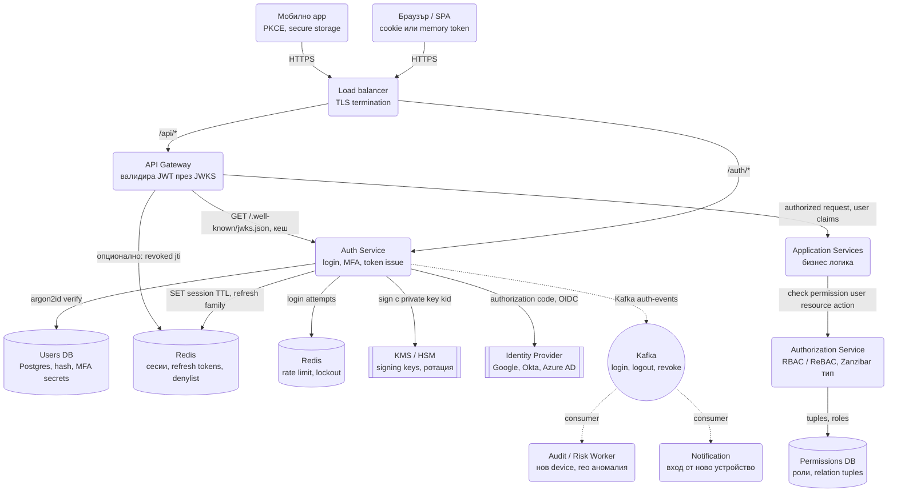
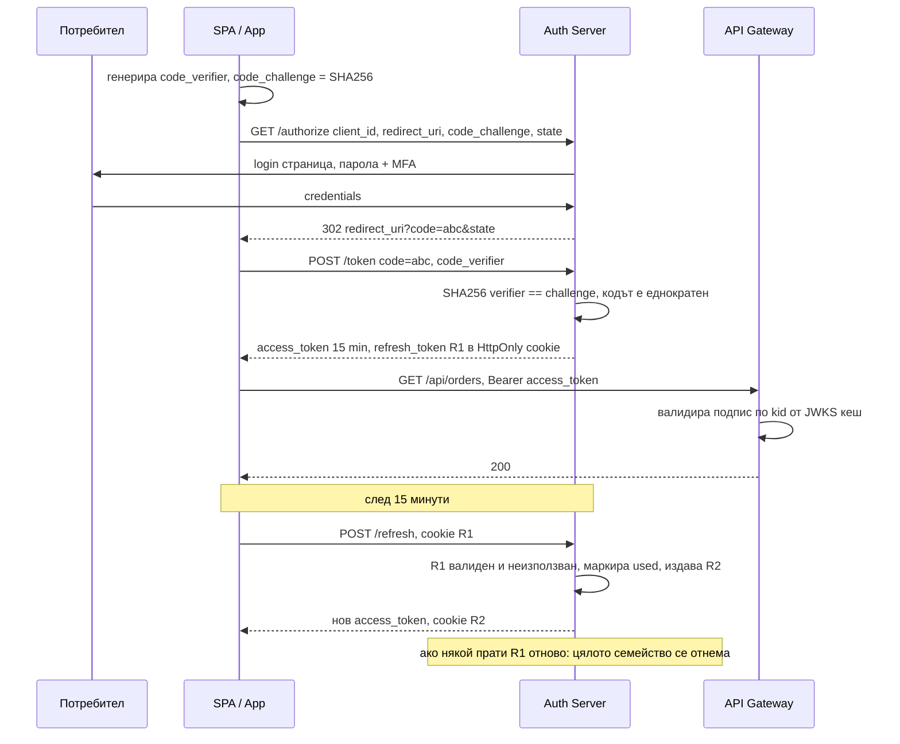
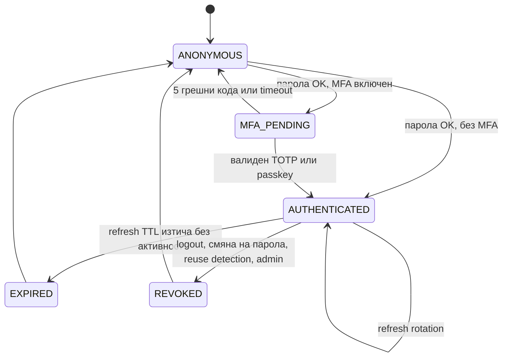

# Автентикация, сесии и SSO (OAuth 2.0 / OIDC / JWT) - System Design

Автентикацията е системата, която всеки е "правил" и почти никой не е проектирал. Интервюто не е за
това как се хешира парола, а за **три компромиса**: сесия в сървъра срещу подписан токен, къде
живее токенът в браузъра, и как се отнема достъп на милиони устройства за секунди. Отгоре идват
OAuth 2.0 и OIDC, които решават друг проблем: как чужд сайт да получи ограничен достъп до данните ти,
без да му даваш паролата.

Тук грешките не са бавен endpoint, а изтекла база с пароли или сесия, която не може да се убие.
Затова всяко решение по-долу е обосновано и с сигурност, и с мащаб.

## Архитектурна диаграма



**Как да четеш диаграмата:** отляво влизат двата типа клиенти през един load balancer. Пътят
`/auth/*` води към Auth Service, който проверява пароли, MFA и издава токени, като държи сесиите и
refresh токените в Redis и подписва с ключ от KMS. Пътят `/api/*` минава през API Gateway, който
валидира JWT **локално** с публичните ключове (JWKS) и само по изключение пита Redis за отнети
токени. Отдясно е външният Identity Provider за SSO, а долу асинхронният поток от auth събития към
одит и известия.

## Сесии срещу JWT

| | Server-side сесия | Stateless JWT |
| --- | --- | --- |
| Какво носи клиентът | Случаен `session_id` (128 бита) в cookie | Подписан токен с claims: `sub`, `exp`, `roles`, `kid` |
| Какво прави сървърът при заявка | Търси сесията в Redis (една мрежова обиколка) | Проверява подписа локално, нула обиколки |
| Отнемане (logout everywhere) | `DEL session:*` за потребителя, моментално | Невъзможно без denylist или изчакване на `exp` |
| Мащаб на проверката | Ограничен от Redis (100k+ ops/s на инстанс, шардируем) | Ограничен само от CPU на gateway-а |
| Между сървиси | Всеки трябва да пита session store | Всеки валидира сам с публичния ключ |
| Размер | 32 байта | 500-1 000 байта на всяка заявка |
| Риск | Redis е критична зависимост | Изтекъл токен е валиден до `exp`; claims остаряват |

Продукционният отговор е **хибрид**: кратък JWT access token (5-15 min) за stateless валидация на
всяка заявка, плюс refresh token, който **е** server-side състояние в Redis и може да се отнеме.
Така отнемането действа до 15 минути навсякъде и моментално там, където се проверява denylist-ът.

## Системен дизайн накратко

Два пътя през един load balancer: `/auth/*` към Auth Service (пароли, MFA, издаване на токени, server-side състояние в Redis) и `/api/*` през API Gateway, който валидира JWT локално с JWKS без мрежова обиколка. 5 сървиса; хибридът кратък JWT + отнемаем refresh token е ядрото.

### Сървиси

| # | Сървис | Какво прави | Как комуникира |
| --- | --- | --- | --- |
| 1 | **Auth Service** | Login с argon2id, rate limit и lockout, MFA (TOTP, WebAuthn), издава access JWT (5-15 min) и refresh token с rotation и reuse detection, OIDC callback към IdP, публикува JWKS | HTTPS REST от браузъра и мобилните приложения; SQL към Users DB; RESP към Redis за сесии, refresh семейства, denylist и login attempts (синхронно); gRPC или HTTPS към KMS за подписване с private key (синхронно); HTTPS redirect и OIDC code exchange към Identity Provider; Kafka producer `auth-events` (асинхронно) |
| 2 | **API Gateway** | Валидира подпис, `exp`, `iss`, `aud` по `kid` от кеширан JWKS; по изключение проверява `revoked_at` в Redis | HTTPS от клиентите; HTTPS GET `/.well-known/jwks.json` от Auth Service на няколко минути (кеш); Redis `GET revoked:<user>` само при критични действия; препраща по HTTP или gRPC към сървисите с user claims в заглавие |
| 3 | **Application Services** | Бизнес логика с готови claims | Получават заявки от Gateway по HTTP или gRPC; gRPC `Check(user, action, resource)` към Authorization Service (синхронно, кеширано); mTLS помежду си |
| 4 | **Authorization Service** | RBAC или ReBAC (Zanzibar тип) с relation tuples и наследяване; кеширана проверка с кратък TTL | gRPC от сървисите; SQL към Permissions DB; Redis или локален кеш на отговорите с TTL и инвалидация при промяна на tuple |
| 5 | **Audit / Risk Worker + Notification** | Нов device, гео аномалия, "вход от ново устройство" | Kafka consumer `auth-events` (pull); SQL за одит лог; HTTPS към email и push доставчици |

### Хранилища

| Компонент | Роля |
| --- | --- |
| Users DB (Postgres) | `password_hash`, MFA секрети (криптирани), `oauth_clients` |
| Redis | `session:*`, `refresh:*` (хеширани, family_id, used), set `user_sessions`, `revoked:*`, `login_attempts:*` |
| KMS / HSM | Signing keys с ротация, pepper, client secrets |
| Permissions DB (Postgres или Spanner) | Relation tuples |
| Kafka | `auth-events` (около 20k/сек) за одит |
| Identity Provider (външен) | SSO през OIDC или SAML |

### Комуникация, backpressure и патерни

- **Синхронно:** login и refresh към Auth Service по HTTPS (Redis запис); всяка API заявка валидира JWT локално в Gateway, нула обиколки за 99% от заявките; gRPC `Check` към Authorization с кеш.
- **Асинхронно:** auth събития към одит и известия през Kafka.
- **Backpressure:** паролното хеширане (50 ms CPU) е в отделен pool (bulkhead), за да не блокира валидациите; rate limit по IP, акаунт и двойка; временен lockout с експоненциално нарастване; CAPTCHA само при съмнение.
- **Патерни:** хибрид JWT + server-side refresh, refresh rotation с reuse detection, JWKS с `kid` за ротация без downtime, HttpOnly cookie за refresh + access в паметта, Authorization Code + PKCE, OIDC върху OAuth 2.0, ReBAC с zookie, mTLS между сървиси, denylist като признание, че stateless е относително.

### Flow: сценариите стъпка по стъпка

**Вход с парола и MFA.** Потребителят въвежда имейл и парола в SPA-то и натиска "Вход". `POST /auth/login` стига през load balancer-а до Auth Service. Първо rate limit в Redis: по IP, по акаунт и по двойката (IP, акаунт) с плъзгащ прозорец; след N грешни опита акаунтът влиза във временен lockout, който расте експоненциално (иначе атакуващ би могъл да заключи чужди акаунти с грешни пароли). После чете `password_hash` от Users DB и го сравнява с argon2id върху паролата плюс pepper от KMS: бавно по дизайн, около 50 ms CPU, в отделен thread pool (bulkhead), за да не блокира останалите заявки; времето на отговор е еднакво за "няма такъв потребител" и "грешна парола", за да не се изброяват акаунти. Паролата е вярна, но акаунтът има TOTP: Auth Service връща "MFA pending" и чака 6-цифрения код, който проверява срещу секрета (криптиран с ключ от KMS) в 30-секунден прозорец. Вход от нова държава би поискал MFA дори при изключен такъв (risk score). При успех издава два токена: access token, JWT подписан с ES256 чрез ключа в KMS, с `kid` в header-а, `sub`, `aud`, `exp` след 15 минути и ролите; и refresh token, непрозрачен случаен низ, пазен хеширан в Redis с `family_id`, `device` и TTL 30 дни. Access token-ът се връща в тялото и SPA-то го държи в паметта; refresh token-ът отива в `HttpOnly; Secure; SameSite` cookie, ограничено по path до `/auth/refresh`, така че JavaScript (и XSS) не може да го прочете. Публикува `login` събитие в Kafka: Audit worker-ът вижда ново устройство и праща имейл "вход от нов телефон".

**Обикновена API заявка и refresh.** SPA-то праща `GET /api/orders` с `Authorization: Bearer <jwt>`. API Gateway не пита никого: взима `kid` от header-а на токена, намира съответния публичен ключ в кеширания JWKS (тегли `/.well-known/jwks.json` от Auth Service на няколко минути), проверява подписа, `exp`, `iss` и `aud` за около 50 µs и препраща заявката към Orders Service с claims в заглавие. Нула мрежови обиколки при 100 000 заявки в секунда; introspection към Auth Service би било 100 000 обиколки. Orders Service вика Authorization Service по gRPC `Check(user, read, order:17)`: при ReBAC това е обхождане на графа `user is owner of order` или `user is member of team, team owns order`, кеширано с кратък TTL. След 15 минути access token-ът изтича. SPA-то праща `POST /auth/refresh`; браузърът автоматично прикача cookie-то R1. Auth Service намира хеша на R1 в Redis, вижда, че е валиден и неизползван, маркира го `used`, издава нов access token и нов refresh token R2 от същото семейство (rotation) и го връща в ново cookie. Ако някога пристигне R1 отново, значи двама го имат, легитимният потребител и крадец, и не се знае кой е кой: цялото семейство се отнема и потребителят трябва да влезе наново (reuse detection). Signing ключът се ротира без downtime: новият ключ се добавя в JWKS с ново `kid`, издаването минава на него, а старият се маха чак след 15 минути, когато всички токени с него са изтекли.

**Logout от всички устройства и SSO.** Потребителят вижда в "активни устройства" непознат лаптоп и натиска "Излез отвсякъде". Auth Service прави `SMEMBERS user_sessions:<user>`, трие всяка сесия и всяко refresh семейство от Redis и записва `revoked:<user> = now` с TTL 15 минути. Непознатият лаптоп не може да получи нов access token, защото refresh token-ът му е изтрит; текущият му access token обаче е валиден още до 15 минути, защото JWT-то е stateless и Gateway-ът не пита никого. За критични действия (смяна на парола, плащане) Gateway-ът прави изключение: проверява `revoked:<user>` в Redis и отхвърля токени с `iat` преди момента на отнемане. Това е признанието, че "stateless" е относително: за моментален logout трябва малко server-side състояние. При SSO през корпоративен Identity Provider потокът е различен: `app1.com` пренасочва браузъра към `idp.com/authorize` с `code_challenge` (PKCE); там има сесийно cookie за `idp.com`, потребителят вече е логнат, IdP връща еднократен код към `app1.com`, което го обменя за `id_token` с `code_verifier` (прихванат код е безполезен без него). Нашият Auth Service прочита `sub` и `email` от `id_token`, създава локална сесия и издава своите токени. При `app2.com` същият redirect минава без екран за вход, защото сесията при IdP е жива. Паролата на потребителя никога не е минавала през нас.

## Описание на архитектурата стъпка по стъпка

### 1. Пароли

- Хешират се с **argon2id** (или bcrypt с cost 12+): бавни по дизайн, с памет, за да са скъпи за
  GPU атаки. Никога SHA-256 без разтягане.
- **Salt** на потребител (вграден в хеша) срещу rainbow таблици. **Pepper** (глобален секрет извън
  базата, в KMS) срещу изтекла база без изтекъл код.
- Cost параметърът се вдига с времето: при login, ако хешът е със стар cost, се прехешира.
- Проверка срещу списъци с изтекли пароли (k-anonymity API на Have I Been Pwned: пращаш първите 5
  символа от SHA-1, получаваш кандидати).

### 2. Login и защита от credential stuffing

Ботове опитват милиони изтекли двойки имейл/парола. Защитите са слоеве (виж
[Rate Limiter](Distributed_Web_Crawler.md)):

- Rate limit по IP, по акаунт и по двойка `(IP, акаунт)` с плъзгащ прозорец в Redis.
- **Lockout** след N неуспешни опита, но временен и с експоненциално нарастване, иначе атакуващият
  заключва чужди акаунти.
- Еднакво време на отговор за "няма такъв потребител" и "грешна парола", за да не се изброяват акаунти.
- Device fingerprint и risk score: вход от нова държава изисква MFA, дори да е включен само
  "при риск".
- CAPTCHA само при съмнение, не винаги.

### 3. MFA

| Метод | Как | Слабост |
| --- | --- | --- |
| SMS код | Изпращаш 6 цифри | SIM swap, прихващане; само като fallback |
| TOTP | Споделен секрет + време, 30 s прозорец (Google Authenticator) | Фишинг: потребителят въвежда кода в фалшив сайт |
| WebAuthn / passkeys | Публичен ключ, подписва challenge, свързан с домейна | Практически неподатлив на фишинг; загуба на устройство изисква recovery |

Секретите за TOTP се пазят криптирани с ключ от KMS, не в чист вид. Recovery кодовете се хешират като
пароли.

### 4. Издаване на токени

- **Access token:** JWT, подписан с асиметричен ключ (RS256 или ES256), `exp` 5-15 минути, `kid` в
  header-а, за да знае валидаторът кой публичен ключ да ползва. Claims: `sub`, `iss`, `aud`, `exp`,
  `iat`, `jti`, роли или scope-ове.
- **Refresh token:** непрозрачен случаен низ (не JWT), пазен хеширан в Redis с TTL дни до седмици,
  свързан със **семейство** (family id) и устройство.
- **Refresh rotation:** при всяко подновяване старият refresh token става невалиден и се издава нов
  от същото семейство. Ако някога се използва **вече ротиран** token, това е сигнал, че е откраднат:
  цялото семейство се отнема и потребителят се логва наново. Това е reuse detection и е
  задължително за SPA и мобилни приложения.

### 5. Валидация в API Gateway

- Gateway-ът тегли публичните ключове от `/.well-known/jwks.json` и ги кешира (минути). Проверява
  подпис, `exp`, `iss`, `aud`. Нула мрежови обиколки за 99% от заявките.
- **Ротация на ключове без downtime:** новият ключ се добавя в JWKS с ново `kid`, известно време и
  двата са там, издаването минава на новия, старият се маха след като всички токени с него са
  изтекли (максимум TTL на access token). Валидаторът избира ключа по `kid`.
- За непрозрачни токени (opaque) gateway-ът прави **introspection** към Auth Service; това връща
  server-side състоянието, но струва обиколка и се кешира за секунди.
- Опционален **denylist**: `jti` на отнети access токени в Redis с TTL до `exp`. Проверява се само
  ако продуктът иска моментален logout за критични действия.

### 6. Къде живее токенът в браузъра

| Място | XSS | CSRF | Бележка |
| --- | --- | --- | --- |
| `localStorage` | Уязвим: всеки XSS чете токена | Не важи | Не за refresh токени |
| Cookie `HttpOnly; Secure; SameSite=Lax` | JS не може да го прочете | `SameSite` спира повечето, за POST от чужд сайт трябва CSRF token или `SameSite=Strict` | Стандартът за уеб |
| Памет на SPA (JS променлива) | Уязвим на XSS докато страницата е отворена | Не важи | Refresh през HttpOnly cookie на `/auth/refresh` |

Препоръчаният модел за SPA: access token в паметта, refresh token в HttpOnly cookie, ограничен по
path до `/auth/refresh`. За мобилни: secure storage на платформата (Keychain, Keystore).

### 7. OAuth 2.0 и OIDC

OAuth 2.0 решава **делегиран достъп**: приложение X иска да чете календара ти в Google, без паролата
ти. Роли: resource owner (ти), client (X), authorization server (Google), resource server (Calendar
API).

| Flow | За кого | Защо |
| --- | --- | --- |
| Authorization Code + **PKCE** | SPA, мобилни, и уеб приложения | Кодът се обменя за токен от клиента с доказателство (code_verifier), така че прихванат код е безполезен |
| Client Credentials | Машина към машина | Няма потребител; client_id + secret или mTLS |
| Implicit | Никой | Мъртъв: токенът идваше в URL fragment, четим от история и Referer |
| Device Code | Телевизори, CLI | Устройството показва код, потребителят го въвежда на телефон |

**OIDC** е тънък слой върху OAuth 2.0, който добавя `id_token` (JWT с идентичност: `sub`, `email`) и
стандартен `/userinfo`. OAuth дава достъп до ресурс, OIDC казва кой е потребителят. **SSO** е OIDC
(или по-старият SAML в корпоративни среди) с външен Identity Provider: приложенията не пазят пароли,
а доверяват на IdP-а и получават потребителя от `id_token`.

### 8. Авторизация: кой какво може

Автентикацията отговаря "кой си", авторизацията "какво можеш". Модели:

| Модел | Идея | Кога |
| --- | --- | --- |
| RBAC | Потребител има роли, роля има права | Малък брой роли (admin, editor, viewer); прост |
| ABAC | Правила върху атрибути (отдел, време, чувствителност) | Регулаторни изисквания, сложни правила |
| ReBAC (Zanzibar) | Релации `user:ana is editor of doc:42`, `doc:42 parent folder:7` | Споделяне на документи и папки с наследяване (Google Drive); проверката е обхождане на графа |

Проверката `check(user, action, resource)` е в критичния път на всяка заявка, затова се кешира с
кратък TTL и се инвалидира при промяна на релация. Zanzibar добавя **zookie** (версия), за да не се
вижда документ с права от преди секунда.

### 9. Сесии и отнемане в мащаб

- Всяка сесия/refresh семейство е ред в Redis: `session:<id> → {user_id, device, ip, created,
  last_seen}` плюс set `user_sessions:<user_id>`. Това дава екрана "активни устройства" и бутон
  "излез от всички".
- **Logout everywhere:** `SMEMBERS user_sessions` → `DEL` на всяка, плюс запис на `user_id →
  revoked_at` в denylist, който gateway-ът проверява само за токени с `iat < revoked_at`. Действа
  моментално за refresh и до 15 минути за издадени access токени, или моментално, ако denylist-ът се
  проверява при всяка заявка.
- Смяна на парола отнема всички сесии освен текущата.

### 10. Service-to-service и секрети

Между сървисите не се ползват потребителски токени. **mTLS** с краткоживущи сертификати (SPIFFE /
service mesh) доказва идентичността на сървиса; за пренасяне на потребителския контекст се предава
access token-ът или подписан вътрешен токен с ограничена аудитория. Ключовете за подпис, pepper-ът
и OAuth client secret-ите живеят в **KMS / secrets manager** с автоматична ротация и одит на всеки
достъп, никога в променливи на средата в git.

## Оразмеряване (Back-of-the-envelope)

Допускане: **100 млн. регистрирани**, 10 млн. едновременно активни сесии, 1.5 устройства на активен
потребител, 500 B на сесия, login 1 000/сек в пик, API 100 000 заявки/сек.

| Метрика | Изчисление | Резултат |
| --- | --- | --- |
| Сесии в Redis | 10M × 1.5 × 500 B | ≈ 7.5 GB, един клъстер с реплика |
| Login | 1 000/сек × argon2id ~50 ms CPU | ≈ 50 ядра само за хеширане, отделен pool |
| Валидации на JWT | 100k/сек × ~50 µs ES256 | ≈ 5 ядра, разпределени по gateway-ите |
| Introspection вместо JWT | 100k/сек към Redis/Auth | Възможно, но 100k мрежови обиколки, които JWT спестява |
| Refresh | 10M сесии / 10 min | ≈ 17 000 refresh/сек, всеки е Redis запис |
| JWKS трафик | Кеш в gateway-а за 5 min | Пренебрежим |
| Auth събития | login + refresh + logout | ≈ 20 000 събития/сек в Kafka за одит |

Изводът: **паролното хеширане е най-скъпата CPU операция в системата** и се изолира в отделен pool
(bulkhead), а валидацията на JWT е толкова евтина, че оправдава stateless модела за API-то.

## API и модел на данните

```text
POST /auth/login             { email, password, device }          → 200 { access_token } + Set-Cookie refresh
POST /auth/mfa/verify        { code }                              → 200 { access_token }
POST /auth/refresh           cookie refresh                        → 200 { access_token } + нов refresh (rotation)
POST /auth/logout            { all_devices? }                      → 204
GET  /auth/sessions                                                → { sessions[] }
GET  /.well-known/jwks.json                                        → { keys[] }
GET  /auth/oidc/authorize?client_id&redirect_uri&code_challenge    → 302 към IdP
GET  /auth/oidc/callback?code&state                                → 302 с сесия
```

| Хранилище | Ключ | Съдържание |
| --- | --- | --- |
| `users` (Postgres) | `user_id` | `email`, `password_hash` (argon2id), `mfa_type`, `mfa_secret_enc`, `password_changed_at` |
| `session:<id>` (Redis) | session id | `user_id`, `device`, `ip`, `created_at`, `last_seen`, TTL |
| `refresh:<hash>` (Redis) | hash на refresh token | `family_id`, `session_id`, `used: bool`, TTL |
| `user_sessions:<user_id>` (Redis set) | user id | Всички session id-та за "активни устройства" |
| `revoked:<user_id>` (Redis) | user id | `revoked_at`, TTL = max access TTL |
| `login_attempts:<key>` (Redis) | IP, акаунт | Плъзгащ прозорец |
| `oauth_clients` (Postgres) | `client_id` | `redirect_uris`, `secret_hash`, `scopes`, тип |
| `relation_tuples` (Postgres/Spanner) | `(object, relation, subject)` | ReBAC граф за авторизация |

## Authorization Code + PKCE и refresh rotation



## Жизнен цикъл на сесията



## Ключови въпроси за интервюто

### JWT или сесия?

Хибрид. JWT за access с кратък живот, защото валидацията е локална и евтина на 100k заявки/сек; сесия
(refresh семейство в Redis) за всичко, което трябва да може да се отнеме. Чист JWT без server-side
състояние означава, че не можеш да изгониш никого до изтичане на токена. Чиста сесия означава Redis
обиколка при всяка заявка към всеки сървис.

### Как правите logout при JWT?

Три нива: изтриваш refresh token-а (потребителят не може да получи нов access token); избираш кратък
`exp` (5-15 min), за да е прозорецът малък; и за критични системи пазиш `revoked_at` на потребител в
Redis, който gateway-ът проверява за токени, издадени преди този момент. Последното е server-side
състояние, което признава, че "stateless" е относително.

### Къде се пази токенът в браузъра?

Refresh token в `HttpOnly; Secure; SameSite` cookie, ограничен по path, за да не го чете XSS. Access
token в паметта на приложението. Никога refresh token в `localStorage`: един XSS и атакуващият има
дългосрочен достъп. CSRF при cookie се спира със `SameSite` плюс CSRF token за state-changing заявки.

### Как ротирате signing ключа без downtime?

Публикувате новия ключ в JWKS с ново `kid`, докато старият още е там. След минути (TTL на JWKS кеша
във валидаторите) започвате да подписвате с новия. Стария махате чак когато всички токени, подписани с
него, са изтекли, тоест след максималния TTL на access token. Валидаторът избира ключа по `kid` от
header-а, така че двата ключа съжителстват без нито една отхвърлена заявка.

### Как работи SSO между различни домейни?

Cookie-тата не пресичат домейни, затова SSO е редирект: `app1.com` праща потребителя към
`idp.com/authorize`; там има сесийно cookie за `idp.com`, потребителят вече е логнат, IdP връща код
към `app1.com`, което го обменя за `id_token`. При `app2.com` същият редирект минава без login екран,
защото сесията при IdP-а е жива. Logout everywhere е обратното: IdP-ът праща back-channel logout към
всяко приложение.

### Как предотвратявате replay на refresh token?

Rotation с reuse detection. Всеки refresh token е еднократен; при употреба се маркира `used` и се
издава нов от същото семейство. Ако пристигне вече използван token, значи двама го имат (легитимният
потребител и крадецът) и не знаеш кой е кой, затова отнемаш цялото семейство и искаш нов login. Плюс
привързване към устройство и кратък TTL.

### RBAC или ReBAC?

RBAC, докато правата се описват с няколко роли за цялото приложение. В момента, в който потребителят
трябва да е editor на **тази** папка и viewer на **онази**, с наследяване надолу, RBAC се превръща в
експлозия от роли и се минава на релации: `user is editor of folder`, `doc parent folder`. Това е
моделът на Google Zanzibar и на всяко споделяне на документи, включително в
[съвместното редактиране](Collaborative_Editing_Google_Docs.md) и [File Sync](File_Sync_Dropbox_Google_Drive.md).

### Защо PKCE, ако имаме HTTPS?

Защото кодът минава през редирект в браузъра или през URL scheme на мобилно приложение, където друго
приложение на същия телефон може да го прихване. PKCE прави кода безполезен без `code_verifier`, който
никога не е напускал клиента. За SPA това замени implicit flow, при който самият токен беше в URL-а.
