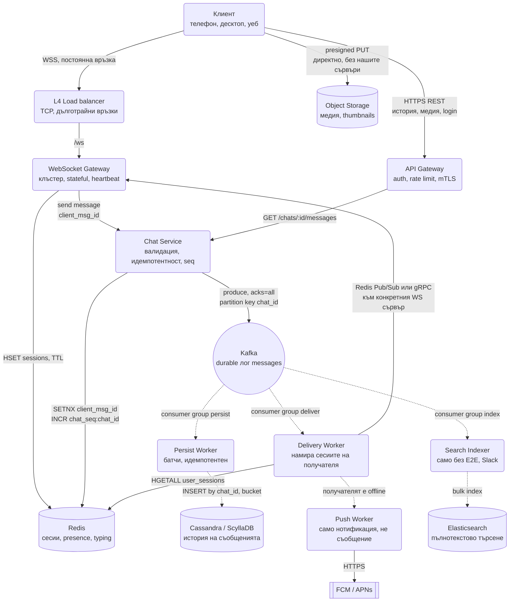
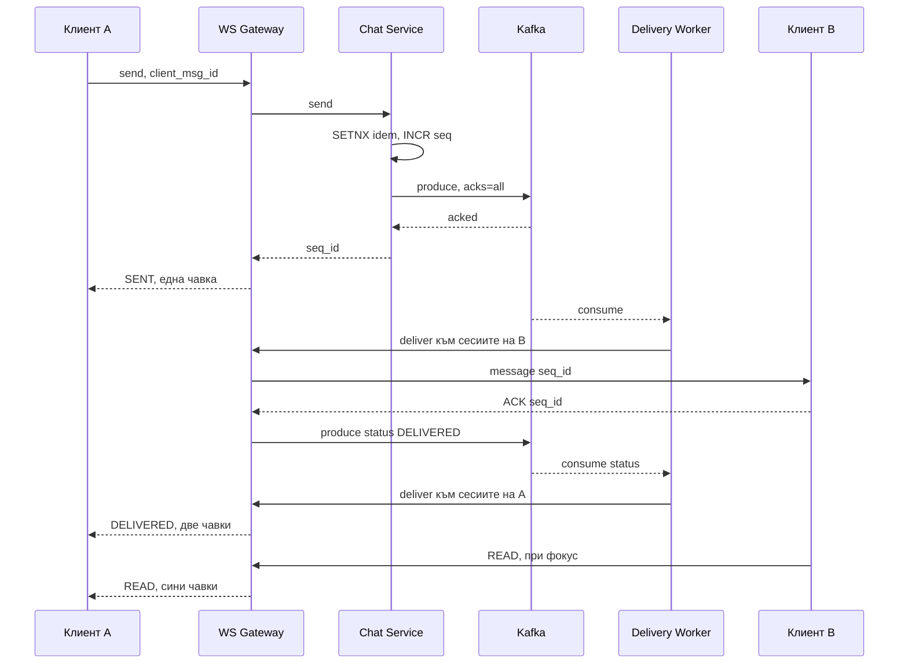

# Чат система (WhatsApp / Slack / Messenger тип) - System Design

Тук основните архитектурни предизвикателства са: поддържане на милиони постоянни връзки в реално
време (WebSockets), подредба на съобщенията (Ordering), идемпотентност при изпращане (Idempotency)
и гарантирана доставка (At-least-once delivery). Дизайнът се върти около едно разделение:
**stateful слой за връзките, durable лог за съобщенията, и worker-и, които правят всичко останало.**

## Архитектурна диаграма

**Как да четеш диаграмата:** Има три пътя. **Изпращане** тръгва от клиента по вече отворената
WebSocket връзка към Chat Service, който проверява идемпотентността, взима `seq_id` и записва в Kafka;
чак когато Kafka потвърди, клиентът получава `SENT`. **Доставка** е асинхронна: Delivery Worker
чете от Kafka, намира на кой WS сървър седи всяко устройство на получателя и препраща там, а ако
няма живи сесии, праща push. **Персистиране и търсене** са отделни consumer group-и върху същия лог,
така че нито едното забавя доставката.

## Системен дизайн накратко

Трислойно разделение: stateful слой за връзките (WS Gateway), durable лог за съобщенията (Kafka) и worker-и, които правят всичко останало. 7 сървиса, от които само WS Gateway държи състояние, и то само отворени сокети.

### Сървиси

| # | Сървис | Какво прави | Как комуникира |
| --- | --- | --- | --- |
| 1 | **WebSocket Gateway** (около 450 инстанции) | Държи до 50k постоянни връзки на процес, heartbeat, регистрира сесиите в Redis, следи `bufferedAmount` | WSS от клиента през L4 (TCP) load balancer; Redis `HSET user_sessions` с TTL; gRPC към Chat Service за всяко изпратено съобщение (синхронно); абониран за Redis Pub/Sub канала `ws:<server_id>`, по който получава съобщения за доставка |
| 2 | **API Gateway** | REST за история, login, медия upload URL | HTTPS REST от клиента; gRPC към Chat Service |
| 3 | **Chat Service** | Валидира, дедупликира по `client_msg_id`, взима `seq_id`, записва в Kafka | gRPC от WS и API Gateway; Redis `SET NX` и `INCR chat_seq:<chat_id>` (синхронно); Kafka producer с `acks=all`, partition key `chat_id` (чака потвърждение от брокерите преди да отговори) |
| 4 | **Persist Worker** | Пише историята в Cassandra на партиди, идемпотентен upsert | Kafka consumer group `persist` (pull); CQL batch INSERT в Cassandra |
| 5 | **Delivery Worker** | Намира сесиите на получателя и препраща към съответните WS сървъри | Kafka consumer group `deliver` (pull); Redis `HGETALL user_sessions:<user>`; Redis `PUBLISH ws:<server_id>` или gRPC към конкретния WS сървър; за офлайн получател публикува в Kafka топик `push` |
| 6 | **Push Worker** | Известие (не съобщението) за офлайн получатели, с coalescing | Kafka consumer `push`; HTTPS към FCM / APNs |
| 7 | **Search Indexer** | Индексира текст в Elasticsearch (само без E2E, Slack модел) | Kafka consumer group `index`; HTTP bulk API към Elasticsearch |

### Хранилища

| Компонент | Роля |
| --- | --- |
| Kafka | Durable лог; `SENT` чак след `acks=all`; партиция по `chat_id` пази реда |
| Redis | Session registry (Hash на устройство), presence и typing с TTL, idempotency ключове, `seq_id` броячи, Pub/Sub към WS сървърите |
| Cassandra / ScyllaDB | История, partition `(chat_id, bucket)`, clustering `seq_id DESC` |
| Elasticsearch | Пълнотекстово търсене |
| Object Storage + CDN | Медия, качена директно с presigned URL |

### Комуникация, backpressure и патерни

- **Синхронно:** изпращането върви по вече отворения WebSocket (не REST), после gRPC до Chat Service; клиентът чака само `acks=all` от Kafka. HTTPS REST за история и `since=<seq>` синхронизация.
- **Асинхронно:** всичко след Kafka: три независими consumer group-а (persist, deliver, index); бавна база не бави доставката.
- **Backpressure:** към бавен клиент по `socket.bufferedAmount` (пауза, после затваряне с "resync"); от Kafka чрез `pause()` на партицията, ако опашката към WS сървърите се напълни; Delivery commit-ва offset след изпращане, не след ACK от телефона.
- **Патерни:** log-first (Kafka преди базата, вместо Outbox), идемпотентност с клиентски ключ, монотонен `seq_id` за ред и gap detection, at-least-once с дедупликация при получателя, хибриден fan-out (write за малки чатове, read за големи канали), heartbeat + reconnect с jitter + graceful drain.

### Flow: сценариите стъпка по стъпка

**Изпращане и доставка на съобщение.** Анна пише "Здравей" на Борис и натиска Enter. Телефонът ѝ вече има отворена WebSocket връзка към WS-Server-12, затова съобщението тръгва по нея, без нов TCP и TLS handshake, с `client_msg_id` (UUID, генериран на телефона преди първия опит). WS-Server-12 го препраща по gRPC към Chat Service. Chat Service прави `SET idem:<chat>:<client_msg_id> NX` в Redis: ако ключът съществува, това е повторен опит и връща същия `seq_id` като преди, без да записва нищо. Ако е нов, прави `INCR chat_seq:<chat_id>` и получава пореден номер, например 1 042 (атомарен, еднонишков брояч, затова никога два съобщения в един чат не получават един и същ номер). Записва съобщението в Kafka с ключ `chat_id` и `acks=all`, тоест чака поне два брокера да го имат на диск. Чак тогава отговаря на WS сървъра, а той на телефона: една чавка, `SENT`. Оттук нататък Анна не чака нищо. Delivery Worker тегли съобщението от Kafka (pull, със собствено темпо), пита Redis `HGETALL user_sessions:Борис` и получава `{телефон: WS-Server-45, лаптоп: WS-Server-7}`. Публикува съобщението в Redis Pub/Sub каналите `ws:WS-Server-45` и `ws:WS-Server-7`; всеки от тези сървъри го записва в сокета на съответното устройство. Паралелно и независимо Persist Worker чете същото съобщение от Kafka (друг consumer group) и го записва в Cassandra. Когато телефонът на Борис го получи, връща ACK със `seq_id`; WS сървърът публикува събитие `DELIVERED` в Kafka и по същия път Анна получава втората чавка.

**Получателят е офлайн.** Ако `HGETALL` върне празен Hash (Борис е в самолетен режим и TTL-ът на сесиите му е изтекъл), Delivery Worker не може да достави и пуска съобщение в топика `push`. Push Worker-ът го чете и праща известие през FCM/APNs, но само "Ново съобщение от Анна", не самия текст (push доставката е best-effort и не е транспортен канал). Ако дойдат 20 съобщения, Push Worker ги събира в едно известие (coalescing). Самото съобщение си стои в Kafka и Cassandra. Delivery Worker commit-ва offset-а веднага след опита за доставка, не след ACK от телефона, иначе един офлайн потребител би блокирал партицията за всички останали в нея.

**Връщане след прекъсване.** Борис каца и телефонът му се свързва към произволен WS сървър, да кажем WS-Server-3 (няма sticky sessions: регистърът в Redis казва къде е всеки, така че всеки сървър става). Сървърът записва `HSET user_sessions:Борис телефон WS-Server-3`. Телефонът помни `last_seen_seq = 1 039` за чата с Анна и праща `GET /chats/:id/messages?since=1039` по REST. Chat Service чете от Cassandra съобщенията 1 040, 1 041, 1 042 и ги връща. Ако по-късно по WebSocket пристигне съобщение със `seq_id` 1 045, а телефонът е видял само до 1 043, той сам разбира, че е изпуснал 1 044 (gap detection по монотонния номер) и дозарежда. Дубликатите от at-least-once доставката се разпознават по `client_msg_id`. При Slack с 200 канала телефонът не пита всеки поотделно, а `GET /sync?since=<cursor>` връща за всеки канал последния `seq_id`. При reconnect клиентът ползва backoff с jitter, за да не се върнат 50 000 клиента в една и съща милисекунда след рестарт на сървър.

## Описание на архитектурните патерни и детайли

### 1. Защо съобщението минава по WebSocket, а не по REST

Клиентът вече държи отворена WSS връзка за получаване. Изпращането по същата връзка спестява TCP и TLS
ръкостискане на всяко съобщение, а при 70 000 съобщения в секунда това е разликата между 450 и
няколко хиляди инстанции. REST остава за нещата, които не са в реалния поток: история
(`GET /chats/:id/messages?before=<seq>`), login, качване на медия, и като fallback за клиенти зад
корпоративен proxy, който убива WebSocket.

### 2. Идемпотентност (Idempotency) при изпращане

- **Проблемът:** Потребител изпраща съобщение в тунел или при лоша мобилна връзка. Съобщението
  стига до сървъра и се записва, но `SENT` потвърждението се губи в мрежата. Клиентът прави retry и
  изпраща същото съобщение втори път.
- **Решението:**
  - Клиентът генерира `client_msg_id` (UUID) **преди** първия опит и го праща при всеки retry.
  - Chat Service прави `SET idem:<chat_id>:<client_msg_id> <seq_id> NX EX 86400` в Redis.
  - Ако ключът съществува, Chat Service връща **същия** `seq_id` като предишния отговор, без ново
    записване в Kafka и без нова доставка.
  - Същият `client_msg_id` пътува със съобщението до получателя и служи за дедупликация и там (виж
    въпроса за at-least-once по-долу). Точно затова ключът е генериран от клиента, а не от сървъра.

### 3. Мащабиране на WebSockets & Session Registry (Redis Presence)

- **Проблемът:** WebSocket връзките са stateful. Потребител А може да е свързан към `WS-Server-1`,
  а Потребител Б към `WS-Server-45`. Delivery Worker-ът трябва да знае къде е Б.
- **Решението:**
  - При свързване WS сървърът записва в Redis запис за **сесията**, не за потребителя:
    `HSET user_sessions:UserB <device_id> WS-Server-45`.
  - **Един потребител = много активни сесии** (телефон, лаптоп, таблет, втори браузър). Затова
    регистърът е Hash, а не единична стойност. Ако се запише само `UserB -> WS-Server-45`,
    съобщението стига до последното свързало се устройство, а останалите мълчат. Това е класически
    бъг, който интервюиращият търси.
  - Всеки запис има TTL (~60 s), подновяван от heartbeat-а на връзката, за да не остават "призрачни"
    сесии след срив на WS сървър.
  - Delivery Worker чете всички сесии и препраща съобщението към всеки от WS сървърите: през Redis
    Pub/Sub канал на сървър (`ws:WS-Server-45`) или директно по gRPC, ако сървърите се откриват
    през service discovery. Pub/Sub е по-просто; gRPC дава обратна връзка дали доставката по сокета
    е успяла.

### 4. Presence и typing indicators: ефемерни данни

"Онлайн", "последно видян", "пише в момента" са **производни и краткотрайни** данни и никога не
минават през Kafka или Cassandra:

- **Presence:** `online:<user_id>` в Redis с TTL 60 s, подновяван от heartbeat-а. "Последно видян"
  се записва веднъж при затваряне на последната сесия, не на всеки heartbeat.
- **Typing:** WS сървърът праща `typing` събитие директно към WS сървърите на другите участници
  през Pub/Sub, с **coalescing** (най-много едно на 3 секунди на потребител на чат) и без ACK. Ако
  се загуби, нищо не се случва.
- **Кой вижда presence-а на кого:** в Slack канал с 50 000 души никой не праща 50 000 presence
  събития. Клиентът се абонира само за потребителите, които са видими на екрана в момента.

### 5. Подредба на съобщенията (Ordering & Sequence ID)

- **Проблемът:** В чат е критично съобщенията да пристигат в правилния ред, дори ако двама души
  пишат едновременно. Разчитането на системното време (timestamp) е пагубно поради clock drift между
  сървърите.
- **Решението:**
  - Всяка чат стая има своя монотонно нарастваща поредица (`seq_id`). Практични варианти:
    **`INCR chat_seq:<chat_id>` в Redis**, което е атомарно и еднонишково, или **Snowflake ID**
    (timestamp + worker + sequence), ако Redis не бива да е в критичния път.
  - **Внимание:** Cassandra Counter колоните **не стават** за това. Те не са идемпотентни при
    повторен опит и не дават гаранция за монотонност при конкурентни писачи. Lightweight Transaction
    (`IF NOT EXISTS`) минава през Paxos и е бавна, затова на практика се предпочита външен генератор.
  - В Kafka се използва `partition key = chat_id`. Всички съобщения за един чат отиват в една
    партиция, което пази реда им при обработка от worker-ите.
  - Ако Redis с броячите падне, Chat Service отказва изпращане за секунди, докато се вдигне
    репликата. Това е приемливо: по-добре кратък отказ, отколкото съобщения с дублиран `seq_id`.

### 6. Kafka като durable лог, не като опашка

Това е мястото, където този дизайн се различава от "запиши в базата и излъчи събитие":

- Chat Service пише в Kafka с `acks=all` и `min.insync.replicas=2`. Съобщението е на диск на поне
  два брокера **преди** клиентът да види `SENT`. Kafka е източникът на истината за първите секунди.
- Persist Worker чете от Kafka и пише в Cassandra на партиди. Ако Cassandra е бавна, лагът на
  consumer group-а расте, но никой не губи съобщения и никой не чака.
- Delivery Worker чете от **същия** топик с отделен consumer group и доставя. Персистирането и
  доставката са независими: бавна база не забавя доставката.
- **Защо не Outbox тук:** Outbox патернът изисква релационна база с транзакции между таблици.
  Cassandra `BATCH` е атомарен само в рамките на една партиция, така че "запиши съобщението и запиши
  в outbox таблица" не е един атомарен акт там. Вместо да заобикаляме, обръщаме реда: логът първо,
  базата после.
- **Кога Postgres + Outbox е верният отговор:** при малък и среден мащаб (до няколко хиляди
  съобщения в секунда) Postgres с таблица `messages` и `outbox` в една транзакция е по-просто,
  дава транзакции и SQL, и е напълно достатъчно. При 70 000 съобщения/сек и 600 GB нови данни на
  ден релационната база започва да иска шардиране и партициониране, а Cassandra прави точно това по
  дизайн. Изборът е функция на мащаба, не на модата.

### 7. Backpressure & Delivery Guarantees (ACKs)

- **Backpressure към бавен клиент:** WS сървърът следи `socket.bufferedAmount`. Ако клиентът е с
  бавен интернет и буферът мине праг (напр. 1 MB), сървърът спира да му подава нови съобщения и при
  надвишаване на горна граница затваря връзката с код "resync". Един бавен клиент не бива да изяде
  паметта на сървър с 50 000 други връзки.
- **Backpressure от Kafka:** consumer-ите теглят на партиди и правят `pause()` на партицията, ако
  вътрешната опашка към WS сървърите се напълни.
- **Delivery Status (at-least-once):**
  - Когато съобщението стигне до устройството на Б, клиентът връща Application ACK с `seq_id`.
  - Едва след този ACK статусът се променя от `SENT` на `DELIVERED` (двете чавки в WhatsApp).
  - Delivery Worker commit-ва Kafka offset-а след като е **изпратил** към WS сървъра, не след ACK от
    телефона. Иначе един офлайн потребител блокира партицията за всички. Пропуснатото се дозарежда
    от клиента (виж gap detection).

### 8. Модел на данните и четене на историята

Чатът е write-heavy и се чете почти винаги "последните N съобщения назад". Затова моделът се
проектира около това:

| Поле | Роля |
| --- | --- |
| `chat_id` + `bucket` | **Partition key.** Bucket-ът (напр. година-месец) пази партицията малка. |
| `seq_id` (DESC) | **Clustering key.** Последните съобщения са физически най-отгоре. |
| `sender_id`, `body`, `media_url`, `client_msg_id`, `created_at` | Данни на съобщението. |

- Без bucket, партицията на активен канал расте безкрайно и Cassandra започва да я чете бавно
  (проблемът с "wide partitions"). Целта е партиция под ~100 MB.
- Пагинацията е **keyset**, не `OFFSET`: `WHERE chat_id = ? AND bucket = ? AND seq_id < ? LIMIT 50`.
  Ако bucket-ът се изчерпи, клиентът минава на предходния.
- Persist Worker е **идемпотентен**: `INSERT` с еднакъв primary key е upsert в Cassandra, така че
  повторна доставка от Kafka не създава дубликат.

### 9. Синхронизация при преизпращане и offline (gap detection)

ACK-ите гарантират доставка само докато връзката е жива. Ако телефонът е бил в самолетен режим,
никой ACK няма да дойде, а Kafka offset-ът отдавна е commit-нат.

- Клиентът пази `last_seen_seq` за всеки чат.
- При reconnect праща `GET /chats/:id/messages?since=<last_seen_seq>` и дърпа пропуснатото.
- Ако получи `seq_id`, който е с повече от 1 над `last_seen_seq`, знае, че е изпуснал съобщения и
  сам инициира дозареждане. Точно затова монотонният `seq_id` е толкова важен: той е механизмът за
  **откриване на дупки**, не просто за подредба.
- При много чатове (Slack с 200 канала) клиентът не пита всеки поотделно, а `GET /sync?since=<cursor>`
  връща за всеки канал последния `seq_id`, и клиентът дозарежда само където има разлика.

### 10. Групови чатове: fan-out on write срещу fan-out on read

| Подход | Как работи | Кога |
| --- | --- | --- |
| **Fan-out on write** | Съобщението се копира в inbox-а на всеки участник при изпращане. | Малки групи (до ~100 души). Четенето е моментално. |
| **Fan-out on read** | Пази се едно копие в чата; всеки чете от общата партиция. | Slack канал с 50 000 души. Иначе едно съобщение поражда 50 000 записа. |

Хибридът е реалният отговор: fan-out on write за лични и малки групови чатове, fan-out on read за
големите канали. Същият компромис като при timeline-а на Twitter. Важно уточнение: в този дизайн
**съхранението** винаги е едно копие на чат (партиция по `chat_id`), а fan-out се отнася за
**доставката** към живите сесии. Delivery Worker за канал с 50 000 души не прави 50 000 lookup-а в
Redis, а публикува веднъж в Pub/Sub канал на чата (`chat:<id>`), за който WS сървърите с поне един
участник са абонирани.

### 11. Медия: снимки, видео, файлове

Байтовете никога не минават през чат сървърите:

- Клиентът иска `POST /media/upload-url` и получава presigned URL към object storage (S3 / GCS).
- Качва директно там, с resumable multipart за големи файлове.
- Отделен pipeline (S3 event -> worker) прави thumbnail, проверява за зловреден файл и при нужда
  транскодира видеото.
- Самото съобщение носи само `media_url` и метаданни (размер, тип, размери на thumbnail-а). То е
  малко и минава по нормалния път през Kafka.
- Четенето е през CDN с подписани URL-и с кратък срок, за да не може линкът да се препраща извън чата.

### 12. Търсене в съобщенията

- **Slack модел:** Search Indexer е още един consumer group върху Kafka. Индексира в Elasticsearch
  по `(workspace_id, channel_id, body)`, с ACL филтър при заявка, за да не се появи резултат от канал,
  в който потребителят не членува.
- **WhatsApp модел:** сървърът вижда само шифрован текст и не може да индексира нищо. Търсенето е
  локално на устройството, в SQLite базата на клиента.
- Това е един от най-ясните примери, че **продуктово решение (E2E или не) определя архитектурата**,
  а не обратното.

### 13. Операционни детайли на WebSocket слоя

Това отличава кандидат, който наистина е държал WS в продукция:

- **Heartbeat (ping/pong)** на 30 s. Мъртва TCP връзка иначе изглежда жива с часове и съобщенията
  отиват в нищото.
- **Reconnect с exponential backoff + jitter.** Без jitter, след рестарт на един WS сървър всички
  негови клиенти се връщат в една и съща милисекунда и събарят следващия (thundering herd).
- **Graceful drain при деплой:** сървърът спира да приема нови връзки, изпраща "reconnect" на
  клиентите на порции и чак тогава излиза. Иначе всеки деплой е малък DDoS върху самия себе си.
- **L4 балансиране** (TCP), не L7 с round-robin по заявка. WebSocket връзката е дълготрайна и трябва
  да остане на един и същ сървър. Няма нужда от sticky sessions по потребител: клиентът може да се
  свърже към **кой да е** WS сървър, защото регистърът в Redis казва къде е.
- **Лимити на ядрото:** `ulimit -n`, ephemeral портове, `net.core.somaxconn`. Един Node.js процес
  държи практично около 50-100k връзки, при условие че се внимава с памет на връзка (~10-20 KB).

### 14. Оразмеряване (Back-of-the-envelope)

Допускане: **50 млн. дневно активни потребители**, по 40 съобщения на ден.

| Метрика | Изчисление | Резултат |
| --- | --- | --- |
| Съобщения на ден | 50M × 40 | 2 млрд. |
| Записи средно | 2G / 86 400 | ≈ 23 000 съобщения/сек |
| Записи в пик (x3) | 23k × 3 | ≈ 70 000/сек |
| Едновременни WS връзки | ~30% от DAU × 1.5 устройства | ≈ 22 млн. връзки |
| Брой WS сървъри | 22M / 50k на процес | ≈ 450 инстанции |
| Съхранение / ден | 2G × ~300 B | ≈ 600 GB/ден |
| Kafka пропускливост в пик | 70k × 300 B | ≈ 21 MB/s, тривиално за клъстер |
| Redis операции в пик | 70k × (SETNX + INCR + HGETALL) | ≈ 200-250k ops/сек, шардиран Redis |
| Доставки в пик | 70k съобщения × ~1.5 сесии на получател | ≈ 100k WS записа/сек през 450 сървъра |

Числата, които носят точки: **22 милиона едновременни връзки** обясняват защо WS слоят е отделен,
stateful и има собствен регистър, вместо да е част от REST API-то. А **600 GB на ден** обяснява защо
базата е Cassandra с партиции по чат и bucket, а не една релационна таблица.

## Текст за представяне пред интервюиращите

> "За да избегна дублирани съобщения при нестабилна мрежа, използвам клиентски генериран
> client_msg_id и атомарна SETNX проверка в Redis, а същият ключ служи за дедупликация и при
> получателя."

> "За поддържане на милиони WebSocket връзки отделям Stateful слоя (WS Gateways) от Stateless слоя
> (REST APIs) и използвам Redis Hash като Distributed Session Registry, с една сесия на устройство."

> "Kafka е durable логът: съобщението е SENT чак когато е записано с acks=all. Персистирането в
> Cassandra и доставката са независими consumer group-и, така че бавна база никога не забавя чата."

> "Гарантирам подредбата, като партиционирам Kafka по chat_id и използвам монотонен seq_id на чат,
> който клиентът ползва и за откриване на пропуснати съобщения."

> "Прилагам Backpressure върху WebSocket връзките, като следя буфера на сокета, за да не препълня
> RAM паметта при клиенти с ниска скорост на интернет."

## Допълнителни въпроси, които се задават

### Sent, Delivered, Read - къде живее всяко състояние?

`SENT` се пише при потвърждение от Kafka; `DELIVERED` при Application ACK от устройството; `READ`
при отделно събитие, когато прозорецът е на фокус. Статусите са отделни събития в Kafka, а не
`UPDATE` върху реда на съобщението, защото при Cassandra update-ите на често променяни колони
създават много tombstone-и. Read receipts за голям канал не се пращат поединично, а се агрегират,
иначе 50 000 души, отварящи канал, генерират 50 000 събития за всяко съобщение.

### Как работи end-to-end криптирането и какво чупи то?

При WhatsApp сървърът вижда само шифрован полезен товар (Signal protocol, X3DH + Double Ratchet).
Цената: сървърът не може да търси в съобщения, да прави server-side history search, нито да генерира
smart reply. Slack умишлено **не** е E2E, защото продава търсене и compliance export. При E2E
съобщенията се пазят на сървъра само докато бъдат доставени на всички устройства, а историята живее
на устройството, което прави и "нов телефон" много по-сложен продуктов проблем.

### Как се доставя съобщение до офлайн потребител?

Push през FCM / APNs, но само като известие. Самото съобщение се дърпа от клиента при отваряне,
защото push доставката е best-effort и не е транспортен канал. Push Worker-ът прави и coalescing:
20 нови съобщения не са 20 push-а, а един "20 нови съобщения от Иван".

### At-least-once доставка означава дубликати. Как ги крие клиентът?

Клиентът дедупликира по `client_msg_id` (същия UUID, който служи и за идемпотентност при изпращане).
Точно затова ключът се генерира от клиента, а не от сървъра.

### Защо Kafka партиционираме по `chat_id`, а не по `user_id`?

Гаранцията за подредба в Kafka е в рамките на една партиция. Подредбата, която потребителят вижда, е
подредбата **вътре в чата**, така че `chat_id` е естественият ключ. Партициониране по `user_id` би
разпръснало съобщенията от един чат в различни партиции и подредбата се губи.

### Един гигантски канал (50 000 души, 100 съобщения/сек) не е ли hot partition в Kafka?

Да, и това е приемливо, защото 100 съобщения/сек са нищо за една партиция (тя понася десетки
хиляди). Проблемът е при **доставката**, не при записа: затова WS сървърите се абонират за канала
веднъж и раздават локално на своите връзки, вместо Delivery Worker да прави 50 000 отделни pub-а.

### Какво става, когато WS сървър падне с 50 000 връзки?

Клиентите се връщат с backoff + jitter към други сървъри (L4 балансьорът ги разпръсква). TTL-ът на
сесиите в Redis изчиства мъртвите записи до минута. Всеки клиент праща `since=<last_seen_seq>` и
дозарежда пропуснатото. Никакво състояние не се губи, защото WS сървърът никога не е пазил истина, а
само връзки.

### Как се гарантира, че съобщението не се губи между WS Gateway и Chat Service?

Клиентът смята съобщението за изпратено **чак при `SENT`**, който идва след `acks=all` от Kafka. До
този момент съобщението е в локалната опашка на клиента и се преизпраща с същия `client_msg_id` при
всяко reconnect. Всичко между клиента и Kafka може да падне безнаказано.

### Как се прави "изтрий за всички" и редактиране?

Ново събитие `message.deleted` / `message.edited` със същия `seq_id` като референция. Минава по
същия път, доставя се на всички, и Persist Worker го прилага върху историята. Клиентът, който е
офлайн, ще го получи при `since=` синхронизацията, защото събитието само получава нов `seq_id`.
