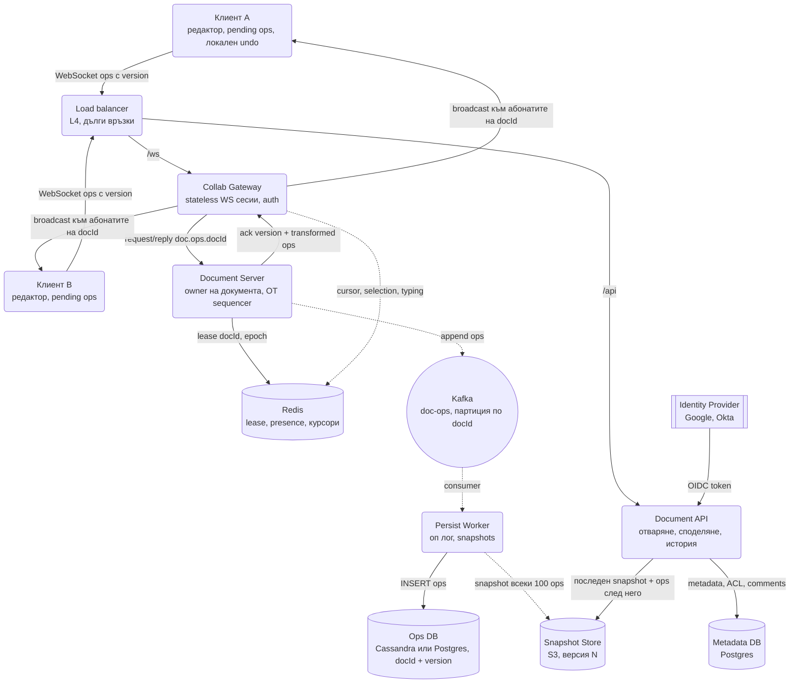
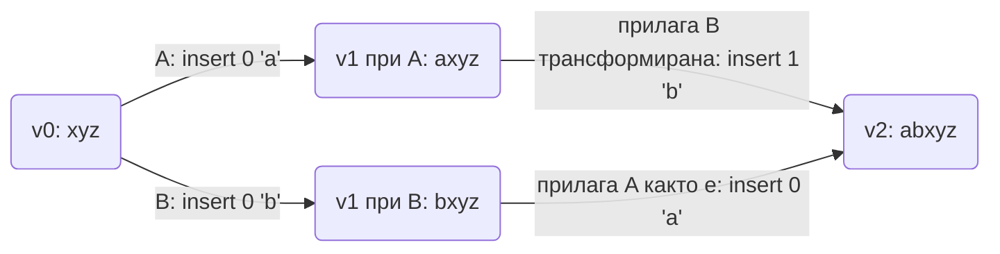
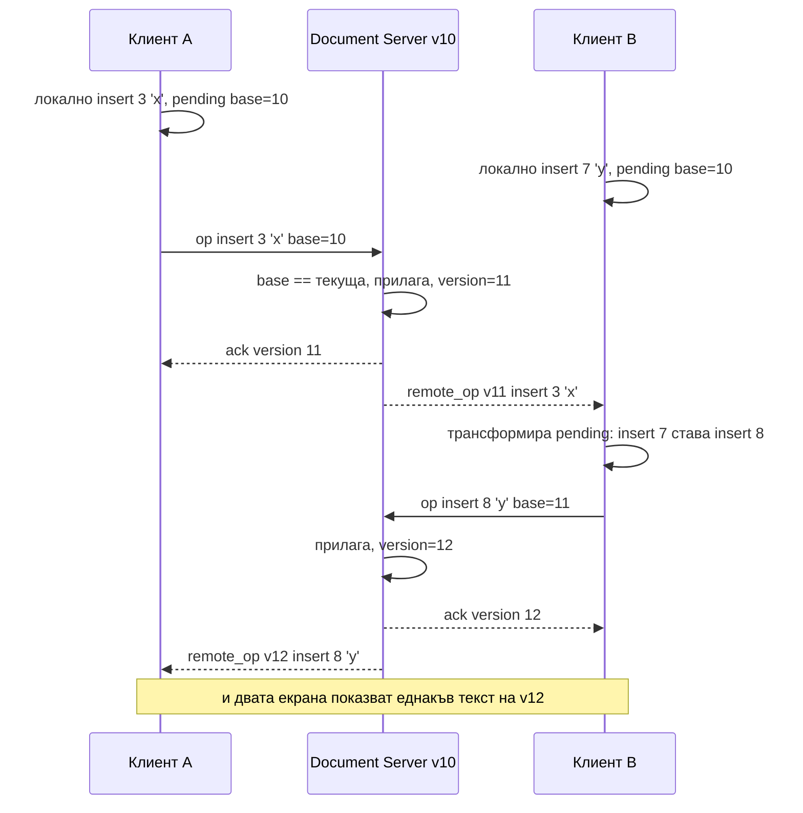

# Съвместно редактиране в реално време (Google Docs / Figma тип) - System Design

Централният проблем е един: двама души пишат в един и същ документ едновременно, на различни
места, с мрежово закъснение помежду им, а накрая **всеки екран трябва да показва абсолютно
същия текст**. Наивното "последният запис печели" изтрива чужди букви. Заключването на документа
убива идеята за съвместна работа. Остават два подхода, Operational Transformation (OT) и CRDT, и
интервюто е точно за това: разбираш ли кой проблем решава всеки от тях и коя инфраструктура върви
с него.

Това не е [File Sync](File_Sync_Dropbox_Google_Drive.md). Dropbox синхронизира цели файлове и при
конфликт създава второ копие. Тук конфликтите са на всяко натискане на клавиш и трябва да се сливат
автоматично, без човек да избира.

## Архитектурна диаграма



**Как да четеш диаграмата:** отляво са двата клиента с по една жива WebSocket връзка към stateless
Collab Gateway. В средата е Document Server, който е **единственият owner** на конкретния документ и
подрежда всички операции за него. Долу е издръжливостта: операциите отиват в Kafka, оттам в оп лог и
периодични snapshot-и. Плътните линии са пътят на една операция от клавиша до другите екрани;
пунктираните са фонова работа, която редакторът не чака.

## Двата подхода: OT и CRDT

| | Operational Transformation | CRDT |
| --- | --- | --- |
| Идея | Централен сървър подрежда операциите; всяка входяща операция се **трансформира** спрямо тези, които клиентът не е видял | Всеки символ носи уникален идентификатор за позиция; операциите се сливат **комутативно**, в произволен ред |
| Кой решава реда | Сървърът (single sequencer per document) | Никой; всяка реплика прилага каквото получи |
| Офлайн и P2P | Възможно, но клиентът трябва да трансформира натрупаните операции при връщане | Естествено: сливането не зависи от реда и от сървър |
| Памет | Текстът плюс оп лог | Текстът плюс идентификатори и tombstone-и за изтритото (2-10x overhead без garbage collection) |
| Сложност | Трансформационните функции са известни като трудни за доказване (много публикувани грешки) | Алгоритъмът е доказано конвергентен, но по-сложен за rich text и таблици |
| Кой го ползва | Google Docs, ShareDB, Etherpad | Yjs, Automerge, Figma (multiplayer с LWW по свойство), Apple Notes |

Изречението за интервю: **OT изисква централен сървър и е стегнат по памет; CRDT премахва
сървъра като необходимост, но плаща с метаданни.** На практика големите продукти с централна
инфраструктура са на OT или на CRDT със сървър като реле, защото сървърът им трябва и без това за
права, история и издръжливост.

### Как изглежда една OT трансформация

Двама клиенти започват от еднакъв документ `"xyz"` и едновременно вмъкват в позиция 0.



Сървърът получава първо операцията на A и я праща на B без промяна. Операцията на B пристига
с `version = 0`, значи е писана без да вижда A. Сървърът я трансформира спрямо A: позиция 0 става
позиция 1. Резултатът и при двамата е `abxyz`. Правилото "при равна позиция печели по-ниското
client id" прави избора детерминистичен, а не случаен.

## Системен дизайн накратко

Един owner на документ подрежда всички операции (OT sequencer), stateless gateway-и държат сокетите, Kafka прави операциите издръжливи след факта. Само 4 сървиса, защото цялата сложност е в алгоритъма, не в броя кутии.

### Сървиси

| # | Сървис | Какво прави | Как комуникира |
| --- | --- | --- | --- |
| 1 | **Collab Gateway** (около 40 процеса) | Stateless WS сесии, auth при отваряне, broadcast към абонатите на `docId`, presence и курсори с coalescing | WebSocket (WSS) от клиентите през L4 LB; NATS request/reply по subject `doc.ops.<docId>` към Document Server (синхронно, чака ack с версия); NATS subscribe на `doc.broadcast.<docId>` за чужди операции; Redis `SET` с TTL и `PUBLISH` за presence и курсори |
| 2 | **Document API** | Отваряне (snapshot + ops след него), споделяне, ACL, история, коментари | HTTPS REST от клиента; SQL към Metadata DB; S3 GET на snapshot; CQL към Ops DB за операциите след snapshot-а; OIDC redirect към Identity Provider |
| 3 | **Document Server** (40-50 процеса, owner на документ) | Държи документа в паметта, трансформира входящите операции (OT), дава версия, ack-ва | NATS subscribe на `doc.ops.<docId>` (единствен абонат = owner); Redis `SET NX PX` lease с epoch; Kafka producer `doc-ops` с ключ `docId` (чака ack преди да потвърди на клиента, или приема малък crash window); NATS publish на трансформираната операция към gateway-ите |
| 4 | **Persist Worker** | Оп лог `(doc_id, version) → op` (идемпотентен), snapshot на всеки около 100 ops | Kafka consumer `doc-ops` (pull); CQL или SQL INSERT в Ops DB; HTTPS PUT на snapshot в S3 |

### Хранилища

| Компонент | Роля |
| --- | --- |
| Redis | Lease + epoch на документ, presence, курсори (TTL 30 s) |
| Kafka | `doc-ops`, партиция по `docId`; лог след факта, не източник на реда |
| Ops DB (Cassandra или Postgres) | Оп лог, историята на документа |
| Snapshot Store (S3) | Пълен документ на версия N |
| Metadata DB (Postgres) | Документи, ACL, коментари |

### Комуникация, backpressure и патерни

- **Синхронно:** клиент → gateway по WebSocket → owner по NATS request/reply → ack с версия; клиентът прилага локално веднага и има най-много една inflight операция.
- **Асинхронно:** owner → Kafka → persist, snapshot, индексиране; presence отделно през Redis.
- **Backpressure:** една inflight операция на клиент и композиране на pending; batching на изхода на 50 ms за документи с много редактори; курсорите се coalesce-ват и се пращат на 100-200 ms; fan-out е на gateway-ите, не на owner-а; лимит на едновременни редактори.
- **Патерни:** single owner per document с lease + fencing epoch, OT (или CRDT със сървър като реле), optimistic local apply + pending queue, event sourcing (оп лог + snapshots), клиентски `client_op_id` за идемпотентност, ефимерни данни извън durable пътя, undo само на собствените операции, блокове за големи документи.

### Flow: сценариите стъпка по стъпка

**Две едновременни операции.** Документът е на версия 10 с текст `xyz`. Анна вмъква `a` на позиция 0, Борис в същата секунда вмъква `b` на позиция 0. И двата редактора показват буквата веднага, локално, без да чакат сървъра (100 ms закъснение при писане се усеща като счупена клавиатура); операцията влиза в `pending` опашка с `base_version = 10`. Операцията на Анна стига първа: по WebSocket до нейния Collab Gateway, оттам като NATS request по subject `doc.ops.<docId>` до Document Server-а, който е единственият абонат за този документ (един owner, затова има тотален ред). Той вижда `base = 10 = текуща`, прилага, версията става 11, записва операцията в Kafka с ключ `docId` и чака ack (операцията е издръжлива преди клиентът да я смята за приета), после отговаря на Анна "ack v11" и публикува `remote_op v11: insert 0 'a'` към всички gateway-и с абонати на документа. Операцията на Борис пристига с `base = 10`, а сървърът вече е на 11: Борис е писал, без да вижда Анна. Document Server-ът трансформира операцията му спрямо v11: `insert 0 'b'` става `insert 1 'b'` (правилото "при равна позиция печели по-ниското client id" прави избора детерминистичен, не случаен). Прилага, версия 12, ack на Борис "v12", broadcast `insert 1 'b'` към Анна. И двата екрана показват `abxyz`. Ако Борис беше получил v11 преди да изпрати, сам щеше да трансформира pending операцията си на клиента и да я прати като `insert 1 'b', base = 11`. Клиентът винаги има най-много една inflight операция; десет бързи букви се композират в един `insert(5, "hello")`.

**Отваряне на документ и падане на owner-а.** Нов редактор отваря документа. Браузърът вика `GET /api/v1/docs/:id` на Document API, който проверява ACL в Metadata DB (viewer, commenter или editor), тегли последния snapshot от S3 (пълният документ на версия 1 200) и операциите 1 201-1 350 от Ops DB и ги връща: клиентът ги прилага и е на 1 350. Без snapshot документ с 2 милиона операции би се възстановявал минути. После отваря WebSocket към произволен gateway, който го абонира за `docId`; оттук нататък получава всяка нова операция и праща своите. Междувременно Document Server-ът на този документ пада. Lease-ът му в Redis (с TTL и epoch 7) изтича. Друг Document Server взима lease-а с epoch 8, зарежда snapshot + операциите след него от Ops DB (точно както клиентът при отваряне), абонира се за `doc.ops.<docId>` и е owner. Клиентите преизпращат pending операциите си с версиите, които имат; дубликатите се разпознават по `client_op_id`. Старият owner, ако се "събуди" от GC пауза и опита да запише операция с epoch 7, бива отхвърлен (fencing). Загубата е най-много операциите, ack-нати в паметта, но още не стигнали до Kafka, затова ack се праща след Kafka потвърждение или се приема малък crash window. Gateway-ите не забелязват нищо: те звънят на същия subject, който сега го вдига друг процес.

**Reconnect след офлайн и presence.** Клиент е бил офлайн 10 минути във влак и има 200 pending операции срещу версия 1 000, а сървърът е на 1 350. При reconnect праща `since = 1000` и получава операциите 1 001-1 350. Трансформира своите 200 срещу тях на клиента (клиентската страна на OT), после ги праща една по една, всяка с актуалната версия. При CRDT тази трансформация би отпаднала, защото операциите се сливат в произволен ред; това е най-силният аргумент за CRDT в продукти с дълъг офлайн режим. Отделно от всичко това вървят курсорите и "кой е в документа": те са ефимерни и никога не минават през Document Server-а, Kafka или оп лога. Gateway-ът пише позицията на курсора в Redis с TTL 30 секунди и я разпраща към другите gateway-и с абонати; ако клиент изостава, старите позиции се заменят с най-новата (coalescing), а при 100 души в документа курсорите се пращат на 100-200 ms, не на всяко движение. Получилият ги клиент ги трансформира спрямо входящите операции, иначе курсорът на колегата "подскача" при всяка буква.

## Описание на архитектурата стъпка по стъпка

### 1. Клиентът: оптимистично прилагане и pending опашка

- Всяко натискане на клавиш се прилага **локално веднага**. Никой не чака сървъра, за да види буквата
  си; 100 ms закъснение при писане се усеща като счупена клавиатура.
- Операцията се записва в `pending` опашка с версията на документа, която клиентът е видял
  последно. Клиентът има най-много **една inflight операция**; останалите чакат в буфер и се
  композират (десет последователни букви стават една операция `insert(5, "hello")`).
- При получаване на чужди операции клиентът ги трансформира спрямо своите pending и ги прилага.
  При ack за собствената операция получава новата версия и праща следващата.

Точно същият модел като в [чат системата](Chat_system_WhatsApp_Slack%20_Messenger.md): клиентски
`client_op_id` за идемпотентност и монотонна версия за откриване на пропуски.

### 2. Document Server: един owner на документ

Операциите за един документ трябва да минат през **един процес**, за да получат тотален ред. Това е
принципът single writer от [патерните](System_Design.md) и същото решение като owner-а на игра в
[Online Trading Game](Online_Trading_Game.md):

- Document Server държи документа в паметта: текущ текст, версия, последните N операции (за
  трансформация на изостанали клиенти), списък с абонирани gateway-и.
- Собствеността е **lease в Redis** с TTL и epoch. Ако сървърът падне, друг взима lease-а,
  възстановява документа от последния snapshot плюс операциите след него и продължава. Стар owner с
  изтекъл epoch не може да пише (fencing).
- Gateway-ите са stateless и не знаят логиката на документа. Те само държат сокетите и препращат
  по `doc.ops.<docId>`, така че скалират с добавяне.

Защо не Redis Lua или база с транзакции? Трансформацията е бизнес логика с много случаи (rich text,
таблици, вложени списъци). В паметта на един процес е обикновен код с обикновени тестове.

### 3. Издръжливост: оп лог и snapshots

Документът в паметта на owner-а е бърз, но не е истина завинаги. Затова:

- Всяка потвърдена операция се публикува в Kafka (партиция по `docId`, за да е подредена) и
  Persist Worker я записва в оп лога: `(doc_id, version) -> op`. Ключът е и естествен idempotency
  key при повторна доставка.
- На всеки ~100 операции (или всеки N секунди) се записва **snapshot**: пълният документ на версия V.
- Отваряне на документ = последен snapshot + операциите след него. Без snapshot документ с 2 млн.
  операции би се възстановявал минути.
- Оп логът е и историята: "виж версията от вторник" е replay до дадена версия. Именно затова
  Google Docs има безкрайна история без да пази копия на документа.

### 4. Presence и курсори

Кой е в документа и къде му е курсорът са **ефимерни** данни: губят стойност след половин секунда.

- Не минават през оп лога и Kafka. Gateway-ът ги пише в Redis с TTL от 30 s и ги разпраща към другите
  абонати на документа.
- **Coalescing:** ако клиент изостава, старите позиции на курсора се заменят с най-новата, а не се
  трупат. Същият механизъм като typing indicator-ите в чата.
- Курсорът се пази като позиция във версия V; при пристигане на чужди операции клиентът го
  трансформира, иначе курсорът на колегата "подскача" при всяка буква.

### 5. Права и споделяне

ACL живее в Metadata DB на ниво документ (и наследяване от папка, като в
[Auth документа](Auth_Session_OAuth_SSO.md)). Проверката е при отваряне на връзката, не при всяка
операция: WebSocket сесията се свързва с `docId` и роля (viewer, commenter, editor). Смяна на правата
праща събитие към gateway-ите и връзките с отнета роля се затварят.

### 6. Коментари и предложения (suggestions)

Коментарите **не са част от текстовия CRDT/OT модел**. Отделна таблица с анкер към диапазон от
документа, който се трансформира при промени, както курсорите. Режимът "предложения" е клон:
операциите се маркират като предложени и се прилагат при приемане. Смесването им с основния текст
прави всяка трансформационна функция два пъти по-сложна.

### 7. Офлайн и reconnect

Клиент, който е бил офлайн 10 минути, има 200 pending операции срещу версия 1 000, а сървърът е на
1 350. При reconnect:

1. Клиентът праща `since = 1000` и получава операциите 1 001-1 350.
2. Трансформира своите 200 срещу тях (клиентската страна на OT).
3. Праща ги една по една, всяка с актуалната версия.

При CRDT стъпка 2 отпада: операциите просто се сливат. Това е най-силният практичен аргумент за CRDT
в продукти с офлайн режим (Apple Notes, Linear).

### 8. Големи документи и горещи документи

- Документ от 500 страници не се държи като един низ. Дели се на **блокове** (параграфи, секции)
  с отделни версии; операцията носи `blockId`. Трансформацията е локална за блока.
- Документ със 100 едновременни редактори (планиране на цяла компания): всяка операция се разпраща
  на 100 клиента. При 100 op/s това са 10 000 съобщения/сек за един документ. Решение:
  **batching** на изхода (всеки 50 ms една партида към всеки клиент) и gateway-ите правят fan-out,
  не owner-ът.

## Оразмеряване (Back-of-the-envelope)

Допускане: **10 млн. дневно активни потребители**, в даден момент 20% са в отворен документ, всеки
активен редактор прави средно 1 операция/сек (буквите се композират), операция ~100 B, snapshot на
всеки 100 операции, среден документ 50 KB.

| Метрика | Изчисление | Резултат |
| --- | --- | --- |
| Едновременни сесии | 10M × 20% | 2 млн. WS връзки |
| Активно пишещи | ~10% от сесиите | 200 000 редактори |
| Операции | 200k × 1 op/s | ≈ 200 000 ops/сек |
| Оп лог на ден | 200k × 100 B × 86 400 | ≈ 1.7 TB/ден |
| Snapshots на ден | 200k / 100 × 50 KB × 86 400 | ≈ 8.6 TB/ден без дедупликация |
| Fan-out | средно 3 абоната на документ | ≈ 600 000 изходящи съобщения/сек |
| WS gateway-и | 2M / 50k на процес | ≈ 40 процеса плюс резерв |
| Document Server-и | 200k ops/s / ~5k ops/s на процес | ≈ 40-50 процеса, шардирани по docId |

Изводите: **оп логът е по-малък от snapshot-ите**, затова snapshot-ите се пазят само последните
няколко на документ, а по-старите версии се възстановяват от лога. Fan-out-ът, не броят операции,
определя размера на gateway слоя.

## Модел на данните

```text
WS   op          { doc_id, client_op_id, base_version, op: [retain 5, insert "hi", delete 2] }
WS   ack         { client_op_id, version }
WS   remote_op   { version, op, author_id }
GET  /api/v1/docs/:id?since=<version>   → { snapshot, snapshot_version, ops[] }
POST /api/v1/docs/:id/share             { user_id, role }         → 204
GET  /api/v1/docs/:id/history?at=<ts>   → { version }
```

| Таблица | Ключ | Съдържание |
| --- | --- | --- |
| `documents` | `doc_id` | Собственик, заглавие, текуща версия, `current_snapshot_version` |
| `ops` | `(doc_id, version)` | Операцията в JSON, `author_id`, `client_op_id`, време. Партиция по `doc_id`, clustering по `version` |
| `snapshots` | `(doc_id, version)` | Указател към S3 обект с пълния документ |
| `acl` | `(doc_id, user_id)` | Роля, наследена ли е от папка |
| `comments` | `comment_id` | `doc_id`, анкер `(version, start, end)`, нишка |

Операцията се описва като списък от `retain / insert / delete` (форматът на ShareDB и Quill Delta).
Той е компактен, композира се (две последователни операции стават една) и има ясно дефинирана
трансформация.

## Пътят на две едновременни операции



Ако B беше изпратил преди да получи v11 (с `base=10`), сървърът сам щеше да трансформира `insert 7`
в `insert 8` спрямо операцията на A, защото пази последните операции точно за това.

## Ключови въпроси за интервюто

### OT или CRDT?

Зависи от това дали имаш централен сървър и без това. Ако продуктът е облачен с права, история и
коментари, сървърът съществува и OT е по-стегнат по памет и по-зрял за rich text. Ако продуктът трябва
да работи офлайн дълго, между устройства без сървър или в P2P, CRDT е естественият избор. Много нови
продукти взимат CRDT библиотека (Yjs) и сървър като реле, за да имат и двете.

### Какво става, ако Document Server-ът падне?

Lease-ът изтича, друг сървър го взима, зарежда последния snapshot от S3 и операциите след него от оп
лога, и се абонира за `doc.ops.<docId>`. Клиентите преизпращат pending операциите си с версиите, които
имат. Загубата е само на операции, които са били ack-нати в паметта, но още не са стигнали до Kafka;
затова ack се праща **след** Kafka потвърждение или се приема малък crash window, както в Online Trading Game.

### Как работи undo в съвместен документ?

Undo е **само на собствените операции**: не бива да отменяш чуждата буква. Клиентът пази обратните
операции на своите; при undo праща обратната операция, трансформирана спрямо всичко, случило се
след оригиналната. Затова undo в Google Docs понякога "връща" нещо на друго място: позицията е
трансформирана.

### С какво Figma е различна?

Figma не е текст, а дърво от обекти със свойства. Конфликтът "двама местят един правоъгълник" се
решава с Last-Write-Wins **по свойство**, не по документ, така че единият печели за `x`, другият за
`fill`, ако са пипали различни свойства. Единствената трудна операция е промяна на родител в дървото
(цикли), която минава през сървъра. Това е CRDT по дух, но със централен сървър, който подрежда.

### Каква консистентност гарантирате?

Eventual convergence: всички реплики, получили едни и същи операции, стигат до еднакъв документ. Плюс
intention preservation: ако си вмъкнал дума в изречение, тя остава в това изречение, каквото и да са
правили другите. Не гарантираме, че междинните състояния при двама клиенти са еднакви във всеки
момент, което е и невъзможно при мрежово закъснение.

### Как показвате "кой пише къде"?

Курсорът е ефимерно събитие през Redis с TTL, coalesce-нато на gateway-а, а не операция в оп лога.
Позицията се трансформира спрямо входящите операции точно както pending операциите, иначе чуждият
курсор скача. При 100 души в документ курсорите се пращат на 100-200 ms, не на всяко движение.

### Защо Kafka, ако owner-ът вече подрежда операциите?

Kafka не подрежда, а прави операциите **издръжливи и достъпни за други консуматори**: persist,
индексиране за търсене в документа, аналитика, известия "X редактира твоя документ". Owner-ът е
източникът на реда, Kafka е логът след факта. Същото разделение като в чат системата.

### Как скалирате един документ с 1 000 едновременни редактори?

Не с един owner за целия документ. Документът се дели на блокове с отделни owner-и (или един owner с
блокови версии), fan-out-ът се прехвърля изцяло на gateway-ите, изходът се batch-ва на 50-100 ms, а
курсорите се показват само за видимия екран. Google Docs реално ограничава до 100 едновременни
редактори точно заради fan-out цената.
