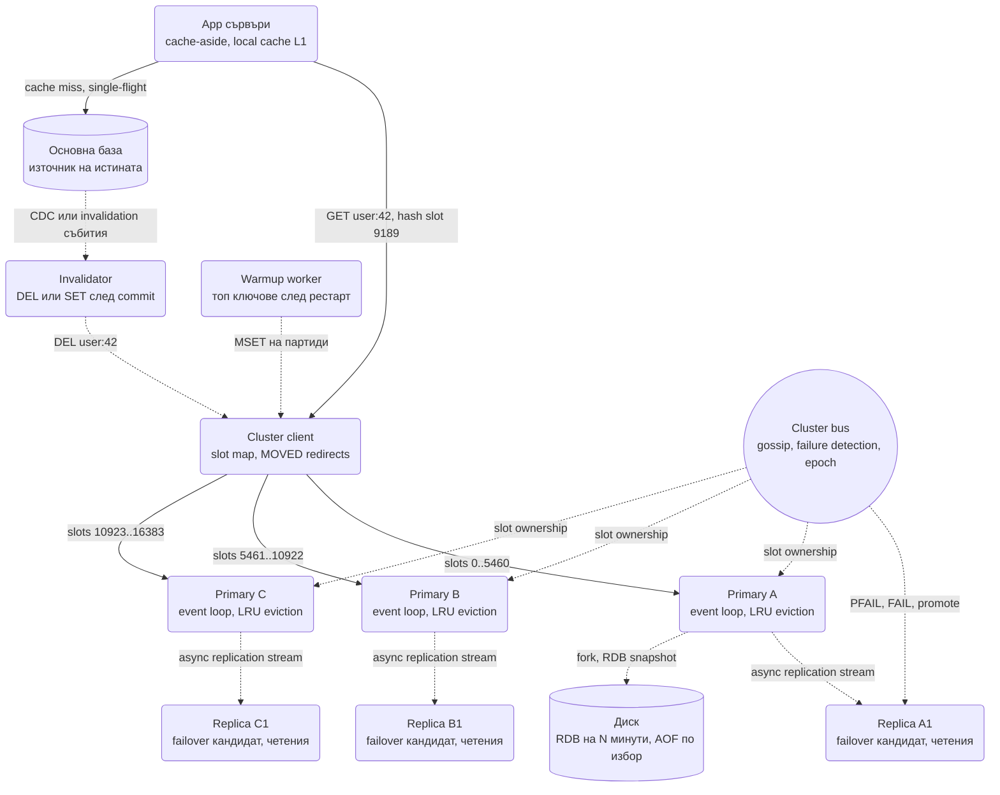
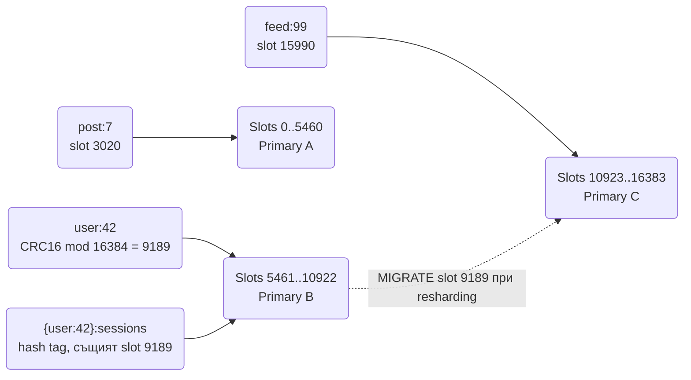
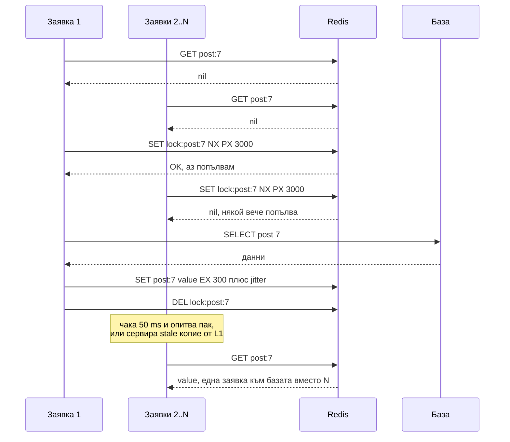

# Разпределен кеш (Redis / Memcached клъстер) - System Design

Кешът е компонентът, който във всяка друга система тук се рисува като една кутийка с надпис "Redis"
и решава проблема с четенето. Този документ пита обратното: **как се строи самата кутийка**, така
че да поеме милион операции в секунда, да преживее отпадане на възел и, най-трудното, да не лъже.
Кешът по определение пази копие на нещо друго, и почти всички бъгове около него са за това копието
да не се разминава с оригинала по начин, който потребителят забелязва.

Двата въпроса, които интервюиращият задава за кеш и които рядко получават добър отговор, са "какво
става, когато възел падне" и "как държиш кеша и базата съгласувани". Всичко останало е инженерна
хигиена.

## Архитектурна диаграма



**Как да четеш диаграмата:** приложението говори с клъстера през клиент, който знае кой hash slot на
кой primary е. Трите primary-та делят 16 384 слота; всеки има реплика, захранвана асинхронно.
Пунктираният cluster bus е gossip между възлите, който открива паднал primary и повишава реплика.
Долу е връзката с истината: при miss приложението чете базата, а промените в базата инвалидират кеша
през отделен процес, не през кода на всяка заявка. Warmup worker-ът пълни кеша след рестарт, за да
няма cold start лавина към базата.

## Системен дизайн накратко

Клъстер от еднонишкови възли, които делят 16 384 hash slot-а, всеки с асинхронна реплика, плюс два малки сървиса около него: Invalidator, който държи кеша верен спрямо базата, и Warmup worker срещу cold start. Кешът е производна структура: трябва да може да се възстанови от истината, не от собствения си диск.

### Компоненти

| # | Компонент | Какво прави | Как комуникира |
| --- | --- | --- | --- |
| 1 | **Cluster client** (в приложението) | Знае картата slot → възел, следва `MOVED` и `ASK`, pipelining; L1 локален кеш за горещи ключове | RESP протокол по TCP директно към правилния primary (синхронно, под 1 ms); при `MOVED` обновява картата си и повтаря |
| 2 | **Primary възли** (8 при 1M ops/s) | Event loop, една команда наведнъж (атомарност безплатно), LRU/LFU eviction при `maxmemory`, TTL | Приемат RESP команди за своите слотове; праща replication stream по TCP към репликата (асинхронно, не чака потвърждение) |
| 3 | **Replica възли** | Failover кандидат; четене с `READONLY` при нужда | Теглят replication stream от primary по TCP; повишават се след гласуване на мажоритета от primary-тата |
| 4 | **Cluster bus** | Gossip, failure detection (`PFAIL` → `FAIL`), configuration epoch, slot ownership | Бинарен протокол между възлите по отделен TCP порт (клиентски порт + 10000); ping/pong на всеки възел към случайни други |
| 5 | **Invalidator** | След commit в базата прави `DEL` на ключа (delayed double delete) | Kafka consumer на CDC събития (Debezium от WAL-а на базата) или на outbox топик; RESP `DEL` към клъстера (асинхронно спрямо заявката) |
| 6 | **Warmup worker** | Пълни топ ключовете след рестарт или failover | SQL `SELECT` на горещите ключове от базата; RESP `MSET` на партиди с pipelining |

### Хранилища

| Компонент | Роля |
| --- | --- |
| Памет на възлите | Данните + 50-100 B overhead на ключ; Hash за групиране на малки стойности |
| RDB / AOF (по избор) | Ускорява рестарт; за чист кеш често е изключен |
| Основна база | Източникът на истината, оразмерен за miss трафика (и за avalanche) |

### Комуникация, backpressure и патерни

- **Синхронно:** cache-aside: `GET` → при miss чети базата → `SET` с TTL и jitter. Една мрежова обиколка, под 1 ms.
- **Асинхронно:** репликация (губи последните ms при failover), инвалидация след commit, warmup.
- **Backpressure:** `min-replicas-to-write` спира запис при split brain; single-flight лок при stampede, за да стигне една заявка до базата вместо N; rate limit към базата и stale отговори при avalanche; L1 кеш и копия на ключа срещу hot key; `UNLINK` вместо `DEL` за big key.
- **Патерни:** server-side шардиране (hash slots) срещу client-side consistent hashing (Memcached), cache-aside / write-through / write-behind / refresh-ahead, "пиши в базата, после DEL" + delayed double delete + кратък TTL, negative caching + Bloom filter срещу penetration, Lua за атомарни проверки, лок като оптимизация, не гаранция.

### Flow: сценариите стъпка по стъпка

**Четене при miss и stampede.** Приложението иска профила `user:42`. Клиентската библиотека смята `CRC16("user:42") mod 16384 = 9189`, гледа в картата си, че слот 9189 е на Primary B, и праща `GET user:42` по TCP право там (не през proxy, не през случаен възел). B изпълнява командата в единствената си нишка, за микросекунди, и връща стойността; при hit това е цялата история, под милисекунда. При miss приложението трябва да чете базата, но ако ключът е горещ и TTL-ът му току-що е изтекъл, 10 000 паралелни заявки правят miss в една и съща милисекунда и всички тръгват към базата с една и съща заявка (stampede). Затова първата заявка прави `SET lock:user:42 NX PX 3000`: взима кратък лок. Останалите 9 999 виждат, че локът е зает, и или чакат 50 ms и опитват `GET` пак, или сервират старото копие от локалния си L1 кеш. Първата чете базата, прави `SET user:42 <value> EX 300` плюс случаен jitter в TTL-а (за да не изтекат всички горещи ключове в една и съща секунда) и трие лока. До базата е стигнала една заявка вместо 10 000. Ако ключът изобщо не съществува в базата (бот сканира `user:999999`), приложението записва кратък "липсва" маркер (negative caching) и Bloom filter пред базата спира следващите.

**Запис и инвалидация.** Потребителят сменя имейла си. Приложението прави `UPDATE users SET email = ... WHERE id = 42` в базата и `COMMIT`. Не пише новата стойност в кеша (`SET`), защото две конкурентни заявки могат да запишат в базата в един ред, а в кеша в обратен, и кешът остава с остаряла стойност до края на TTL-а. Вместо това ключът трябва да се изтрие. Но и изтриването не се прави от кода на заявката: ако транзакцията се върне след `DEL`, или процесът падне след commit, но преди `DEL`, кешът лъже за цял TTL. Затова инвалидацията минава през базата: Debezium чете промяната от WAL-а (или outbox таблица в същата транзакция) и я пуска в Kafka; Invalidator-ът я консумира и прави `DEL user:42`. Половин секунда по-късно прави втори `DEL` (delayed double delete), за да покрие читател, който е прочел старата стойност от базата точно преди commit-а и я е записал в кеша точно след първото изтриване. Следващият читател прави miss и зарежда новия имейл. Като последна защита всеки ключ има кратък TTL: ако всичко друго се провали, лъжата живее минути, не завинаги. Ако продуктът иска потребителят да види новия си имейл веднага (read-your-writes), заявките на този потребител заобикалят кеша за няколко секунди след записа.

**Падане на primary.** Primary B спира да отговаря. Останалите възли му пращат ping по cluster bus-а и не получават pong в рамките на `cluster-node-timeout` (например 10 секунди); всеки го маркира `PFAIL` ("аз мисля, че е паднал") и разменя това мнение с другите по gossip. Когато мажоритетът от primary-тата се съгласи, състоянието става `FAIL`, репликата B1 кандидатства, получава гласовете и се повишава с нов configuration epoch, като поема слотовете 5461-10922. Записите от последните милисекунди, които B е приел, но не е успял да изпрати по асинхронния replication stream, са загубени; за кеш това е приемливо, за лок или idempotency ключ не е и трябва да се каже на глас. Клиентите, които пратят команда към стария B, получават грешка или `MOVED 9189 B1:6379` и обновяват картата си. За тези 10-15 секунди слотовете са недостъпни и приложението трябва да третира това като miss, не като грешка. Warmup worker-ът, ако B1 е стартирал празен, пълни топ ключовете от базата с `MSET` на партиди, за да не удари целият трафик на тези слотове базата наведнъж (avalanche). Ако B е бил откъснат от мрежата, но жив, той е спрял да приема записи сам, защото `min-replicas-to-write 1` му е казал, че няма жива реплика: това е защитата срещу split brain.

## Описание на архитектурата стъпка по стъпка

### 1. Кой решава къде живее ключът: клиент или сървър

| | Memcached стил | Redis Cluster стил |
| --- | --- | --- |
| Кой шардира | Клиентската библиотека с consistent hashing (ketama) | Сървърът: `CRC16(key) mod 16384` → hash slot → възел |
| Възлите знаят ли един за друг | Не, напълно независими | Да, gossip през cluster bus |
| Добавяне на възел | Клиентът мести 1/N ключове; кешът им е загубен (просто miss) | Слотовете се мигрират онлайн с `MIGRATE`, ключовете се запазват |
| Грешен възел | Невъзможен, клиентът е единственият, който решава | Възелът отговаря `MOVED slot host:port`, клиентът обновява картата си |
| Multi-key операции | Само ако клиентът ги групира по възел | Само ключове в един слот, чрез hash tag `{user:42}:profile` |

Memcached подходът е по-прост и е достатъчен за чист кеш, където загубата на ключове при resharding е
приемлива. Redis Cluster е нужен, когато в кеша има структури, които не искаш да губиш (сесии,
броячи, лийдърборд), и когато трябват реплики и failover без външен координатор.

### 2. Репликация и failover

- Репликацията е **асинхронна**: primary отговаря на клиента, преди репликата да е получила записа.
  Следствие: при failover последните милисекунди записи се губят. За кеш това е приемливо; за
  ключове, на които разчиташ (лок, идемпотентен ключ), не е и трябва да го кажеш.
- **Откриване на отказ:** всеки възел пинга останалите. Възел, който не отговаря `cluster-node-timeout`
  (типично 5-15 s), се маркира `PFAIL`; когато мажоритет от primary-тата се съгласят, става `FAIL` и
  реплика му се повишава. Без клъстер същата роля играе **Sentinel** кворум.
- **Split brain:** primary, откъснат от мажоритета, продължава да приема записи, които после ще бъдат
  изхвърлени. Защитата е `min-replicas-to-write 1` + `min-replicas-max-lag 10`: primary без жива
  реплика спира да приема записи. Това е cache-вариантът на [fencing](System_Design.md).
- **Реплики за четене:** възможно (`READONLY`), но с изоставане. За кеш обикновено не си струва:
  cache miss е по-евтин от stale hit, който после трябва да обясняваш.

### 3. Persistence: защо кешът почти не иска такъв

| Режим | Какво прави | За кеш |
| --- | --- | --- |
| Без persistence | Рестарт = празен кеш | Правилно за чист кеш с warmup |
| RDB | Snapshot на диска на N минути чрез `fork` | Ускорява рестарт; `fork` при 64 GB dataset прави латентен пик и удвоява паметта в най-лошия случай |
| AOF | Всяка команда се дописва в лог, `fsync` всяка секунда | Губи до 1 s, дискът става тясното място при 200k ops/s |
| RDB + AOF | Комбинация | За Redis като база, не като кеш |

Кешът трябва да може да се възстанови от **източника на истината**, не от собствения си диск. Ако не
може (стартът срива базата), проблемът е warmup стратегия, не persistence.

### 4. Памет и eviction

- Всеки ключ струва ~50-100 B отгоре над данните (dict entry, robj, SDS header, expire dict). 100 млн.
  малки ключа са 5-10 GB чист overhead. Затова малки стойности се групират в Hash (`HSET user:42
  name Ivan age 30`), който при под 128 полета е компактен listpack.
- **Eviction** при `maxmemory`: `allkeys-lru` за чист кеш; `volatile-lru`/`volatile-ttl` когато в
  инстанса има и данни без TTL, които не бива да се трият; `allkeys-lfu` когато достъпът е силно
  изкривен и малък набор ключове се чете постоянно.
- LRU в Redis е **приблизителен**: взима извадка от 5 ключа и трие най-стария. Точен LRU би струвал
  двойно свързан списък за всеки ключ. Разликата в hit rate е няколко процента.
- **TTL** е задължителен за всеки кеширан ключ. Ключ без TTL е memory leak с отложено действие.
  Изтеклите ключове се чистят мързеливо при достъп плюс активно семплиране 10 пъти в секунда.

### 5. Голям ключ, горещ ключ

Двата ключа, които събарят клъстери, изглеждат безобидно в кода:

- **Big key:** Hash с милион полета, List с милион елемента. `HGETALL` блокира event loop-а със
  секунди, `DEL` също, репликацията се задавя. Решение: разбиване (`followers:42:0..99`), `SCAN`
  варианти, `UNLINK` вместо `DEL`.
- **Hot key:** един ключ (постът на знаменитост, конфигурация, която всички четат) получава 500k
  четения в секунда, а всички те падат на **един** възел, защото шардирането е по ключ. Решения:
  локален кеш в процеса на приложението с TTL от секунди (L1 пред Redis), копия с суфикс
  (`post:1:0..9`, клиентът чете случайно копие), client-side caching с invalidation (`CLIENT TRACKING`).

### 6. Патерни за писане в кеша

| Патерн | Кой пише в кеша | Кога |
| --- | --- | --- |
| **Cache-aside** | Приложението при miss | По подразбиране; кешът пази само това, което се чете |
| **Read-through** | Кеш слоят сам чете базата | Същото, но логиката е в библиотека, не в бизнес кода |
| **Write-through** | Синхронно при всеки запис в базата | Данни, които се четат веднага след запис; цена: латентност на записа |
| **Write-behind** | Асинхронно, на партиди | Броячи, прогрес, presence; загуба на последните секунди е приемлива |
| **Refresh-ahead** | Кешът опреснява горещи ключове преди изтичане | Латентност без miss за малък набор много горещи ключове |

### 7. Кеш и база: кой пише пръв

Това е въпросът, на който се разделят кандидатите. Двойният запис (в базата и в кеша) не е атомарен,
и всеки ред води до различен вид грешка:

| Ред | Проблем |
| --- | --- |
| Пиши в кеша, после в базата | Записът в базата пада; кешът лъже с данни, които не съществуват |
| Пиши в базата, после `SET` в кеша | Две конкурентни заявки: A пише DB v1, B пише DB v2, B сетва кеш v2, A сетва кеш v1. Кешът остава на v1 до TTL |
| Изтрий кеша, после пиши в базата | Между двете стъпки читател прави miss, чете старата стойност и я пълни обратно в кеша |
| **Пиши в базата, после `DEL` в кеша** | Най-малкият прозорец: читател трябва да е прочел старата стойност от базата преди commit-а и да я запише в кеша след `DEL`. Рядко, но възможно при бавен читател |

Практичният отговор:

1. **Пиши в базата, после изтрий** (не `SET`) ключа в кеша. Изтриването е идемпотентно и няма
   версия, която да се обърка.
2. Инвалидацията се пуска **след commit**, от outbox или CDC събитие, а не от кода на заявката.
   Иначе изтриване преди rollback или загубено изтриване при срив връщат стар кеш за цял TTL.
3. **Delayed double delete:** второ `DEL` след 500 ms покрива бавния читател от последния ред.
4. **Кратък TTL** като последна защита. Ако всичко друго се провали, лъжата живее секунди.

Ако бизнесът иска четене на собствения запис веднага (read-your-writes), пътят след запис заобикаля
кеша за няколко секунди или чете primary базата.

### 8. Трите бедствия на кеша

- **Stampede (thundering herd):** горещ ключ изтича, 10 000 паралелни заявки правят miss и удрят
  базата с една и съща заявка. Решение: **single-flight** (първият взима кратък лок `SET lock:key NX
  PX 3000`, останалите чакат или сервират старата стойност), **jitter в TTL**, refresh-ahead.
- **Penetration:** заявки за ключове, които не съществуват в базата, минават кеша всеки път.
  Решение: [negative caching](System_Design.md) с кратък TTL и Bloom filter пред базата.
- **Avalanche:** целият кеш изчезва (рестарт, failover на голям shard) и базата получава 100% от
  трафика. Решение: warmup от списък с горещи ключове, постепенно пускане на трафик, rate limit към
  базата и graceful degradation (сервирай кеширан stale отговор с флаг).

### 9. Event loop, атомарност, Lua

Redis изпълнява командите **една по една, в една нишка** (I/O нишките от 6.0 само парсват и пишат
към сокетите). Следствия, които интервюиращият очаква да кажеш:

- Всяка команда е атомарна: `INCR`, `SETNX`, `HINCRBY` нямат race condition.
- Lua скрипт и `MULTI/EXEC` са атомарни блокове: "прочети, сравни, запиши" се прави без лок. Затова
  rate limiter-ите ([виж Crawler + Rate Limiter](Distributed_Web_Crawler.md)) са Lua.
- Цената: една бавна команда (`KEYS *`, `HGETALL` на big key, `FLUSHALL`) спира **всички** клиенти.
  Оттук латентни пикове и `slowlog` като първата метрика за гледане.
- **Pipelining:** клиентът праща 100 команди без да чака отговор; round trip-ът, не CPU-то, е
  тясното място. Тук идват стойностите от 200k+ ops/s на един възел.
- **Pub/Sub** е fire-and-forget: няма съхранение, абонат, който не е свързан, не получава нищо. За
  гарантирана доставка е Streams или [Kafka](Distributed_Message_Queue_Kafka.md).

### 10. Многорегионен кеш

Кешът е локален за региона. Репликация на кеш между континенти с 100+ ms латентност създава кеш,
който винаги е stale в единия регион. Правилният модел: всеки регион има собствен кеш пред собствена
реплика на базата, а инвалидацията минава през глобалния поток от събития. Ключове с глобална
истина (feature flags, конфигурация) се пълнят активно във всеки регион, а не се репликират.

## Оразмеряване (Back-of-the-envelope)

Допускане: **100 млн. ключа** по ~1 KB стойност, **1 млн. операции/сек**, 90% четения, hit rate цел 95%.

| Метрика | Изчисление | Резултат |
| --- | --- | --- |
| Данни | 100M × 1 KB | 100 GB |
| С overhead на ключ и фрагментация | 100 GB × 1.3 | ≈ 130 GB |
| Primary възли по памет | 130 GB / 64 GB полезни на възел (RAM 96-128 GB заради fork и буфери) | 3 primary-та |
| Primary възли по операции | 1M ops/s / ~150k ops/s на възел (без pipelining) | ≈ 7 primary-та |
| Реален брой | Max от двете сметки, с резерв | 8 primary + 8 реплики = 16 възела |
| Мрежа на възел | 125k ops/s × ~1 KB | ≈ 1 Gbps, 10 Gbps интерфейс е задължителен |
| Miss трафик към базата | 1M × 90% четения × 5% miss | ≈ 45k четения/сек, това е QPS-ът, за който се оразмерява базата |

Изводът: **операциите в секунда, не паметта, определят броя възли.** И числото, което трябва да
произнесеш: при 95% hit rate базата все пак вижда 45 000 заявки в секунда, а при avalanche вижда
900 000. Разликата между двете е причината warmup-ът да е част от дизайна.

## Модел на данните и API

```text
GET  key                      → value | nil                  cache-aside четене
SET  key value EX 300 NX      → OK | nil                     запис с TTL, само ако липсва
DEL  key                      → брой изтрити                 инвалидация след commit
EVALSHA sha 1 key arg...      → резултат                     атомарна логика
HSET user:42 name x age 30    → брой полета                  компактно групиране
ZADD leaderboard 1500 user:42 → 1                            подредени структури
```

| Структура | Типична употреба в тази папка | Памет |
| --- | --- | --- |
| String | Кеширан отговор, идемпотентен ключ, лок, брояч | ~50 B + стойност |
| Hash | Профил, сесия, регистър устройство → сървър ([Chat](Chat_system_WhatsApp_Slack%20_Messenger.md)) | Listpack до 128 полета |
| Sorted set | Feed inbox, лийдърборд, sliding window ([News Feed](News_Feed_Timeline.md)) | ~70 B на елемент |
| Set | Последователи, активни потребители | ~50 B на елемент |
| HyperLogLog | Уникални посетители | 12 KB фиксирано |
| GEO (sorted set) | Позиции на шофьори ([Geo](Geo_Proximity_Uber_Yelp.md)) | ~70 B на елемент |
| Stream | Лог със consumer groups, по-малка алтернатива на Kafka | Radix tree, компактен |



Cache-aside със single-flight при изтекъл горещ ключ:



## Ключови въпроси за интервюто

### Защо Redis е еднонишков и все пак бърз?

Защото не е CPU-bound. Данните са в паметта, операциите са O(1) или O(log N), а тясното място е
мрежовият round trip. Една нишка премахва локовете и прави всяка команда атомарна безплатно. I/O
нишките в новите версии паралелизират четенето и писането по сокетите, но изпълнението остава
последователно. Скалирането е хоризонтално: повече primary-та, не повече нишки.

### Какво става, когато primary падне?

Останалите възли не получават отговор от него, маркират го `PFAIL`, мажоритетът се съгласява на `FAIL`
и репликата му се повишава с нов configuration epoch. Клиентите получават `MOVED` и обновяват картата.
Загубени са записите от последните милисекунди, които не са стигнали до репликата, и за 5-15 секунди
слотовете му са недостъпни. Приложението трябва да третира това като miss, не като грешка.

### Как държиш кеша и базата съгласувани?

Пиши в базата, инвалидирай с `DEL` след commit през outbox или CDC, второ изтриване след кратко
забавяне, кратък TTL като последна защита. Не се стремя към силна консистентност между кеш и база,
защото не е постижима без 2PC; стремя се прозорецът на лъжата да е милисекунди и ограничен от TTL.

### Какво правиш с ключ, който всички четат?

Локален L1 кеш в процеса с TTL от няколко секунди, така че Redis вижда една заявка на инстанс на
секунда вместо хиляди. Ако L1 не е достатъчен, N копия на ключа с суфикс, четени на случаен принцип,
разпределят товара по N възела. Инвалидацията тогава трие N ключа.

### Memcached или Redis?

Memcached: чист кеш, многонишков, по-малко памет на ключ, само string, без репликация и без
структури. Отличен за огромен обем прости кеширани отговори. Redis: структури от данни, атомарни
операции, Lua, репликация, TTL на ключ, Pub/Sub, Streams. Ако кешът е само "отговор по ключ" в
петабайтен мащаб, Memcached печели по цена. Ако някой ключ носи логика, Redis.

### Кога не бива да кешираш?

Когато данните се четат веднъж (кешът само добавя латентност и памет), когато записите са по-чести от
четенията (инвалидацията надвишава ползата), когато stale стойност е недопустима и няма как да се
ограничи (баланс преди теглене, наличност при резервация), и когато hit rate-ът е под ~50%, защото
тогава кешът е втора база данни с по-лоша консистентност.

### Как правиш rate limiting и разпределен лок върху кеша?

Lua скрипт за sliding window counter, за да са проверка и увеличение атомарни. Лок с `SET NX PX` и
уникална стойност, освобождаван със скрипт, който сравнява стойността. И признанието, че при
асинхронна репликация локът може да се загуби при failover, затова е [оптимизация, а не
гаранция](Ticketmaster.md).

### Как се добавя възел без прекъсване?

В Redis Cluster: новият възел влиза празен, слотове се мигрират към него един по един (`MIGRATE`
ключ по ключ), а по време на миграция възлите отговарят с `ASK` за ключове, които вече са се
преместили. Клиентите следват редиректите. При Memcached с consistent hashing просто се добавя в
списъка: 1/N от ключовете стават miss и се попълват отново.
