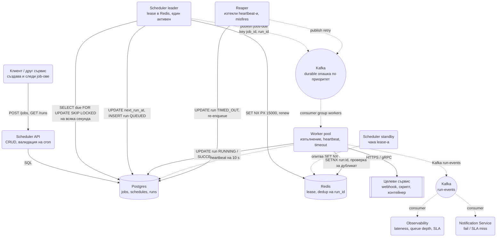
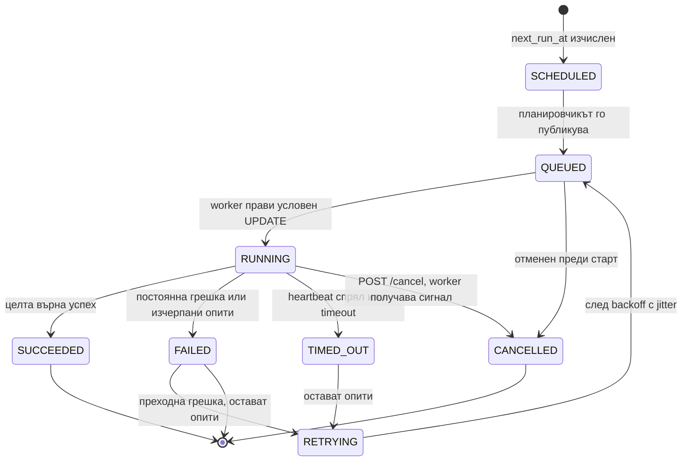
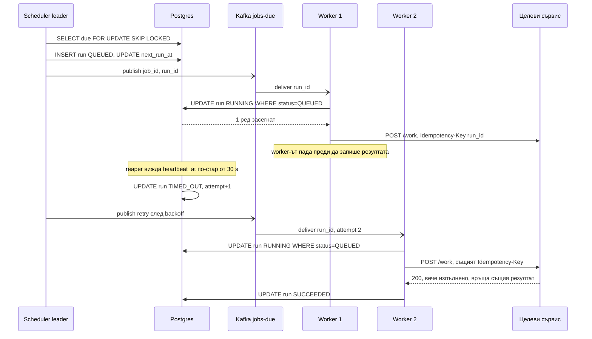

# Разпределен планировчик на задачи (cron / Airflow / Temporal тип) - System Design

Обемът тук е малък и подвеждащ: дори голяма компания има десетки милиони job-а и няколкостотин
изпълнения в секунда, което една база и няколко worker-а поемат без усилие. Трудното е друго: **всяко
изпълнение трябва да се случи точно веднъж и навреме**, при два планировчика, паднал worker,
разминаващи се часовници и задача, която трае по-дълго от интервала си. Планировчикът е системата, с
която интервюиращият проверява дали разбираш разликата между "изпратено веднъж" и "изпълнено веднъж".

Три въпроса определят дизайна: кой решава, че задачата е узряла (scheduling); как узрялата задача
стига до някой, който да я свърши (dispatch); и какво става, когато нещо по пътя падне (delivery и
идемпотентност).

## Архитектурна диаграма



**Как да четеш диаграмата:** отляво е контролният път: клиентите създават job-ове през API-то, а
един-единствен активен планировчик (leader с lease) на всяка секунда пита базата кои са узрели и ги
пуска в durable опашка. В средата е изпълнението: worker-и теглят от опашката, дедупликират по
`run_id`, викат целевия сървис и пишат състоянието обратно в базата с heartbeat. Отдолу reaper-ът
чисти след паднали worker-и, а събитията за всяко изпълнение захранват мониторинга и известията.
Пунктираните стрелки са асинхронна работа, която никой не чака.

## Системен дизайн накратко

Обемът е малък (280 изпълнения/сек), трудното е "точно веднъж и навреме" при два планировчика, паднал worker и разминаващи се часовници. 6 сървиса: контролен път (API + един активен leader), изпълнение (durable опашка + worker-и) и чистене (reaper).

### Сървиси

| # | Сървис | Какво прави | Как комуникира |
| --- | --- | --- | --- |
| 1 | **Scheduler API** | CRUD на job-ове, валидация на cron и timezone, `run-now`, история на runs | HTTPS REST от клиентите и другите сървиси; SQL към Postgres (синхронно) |
| 2 | **Scheduler leader** (един активен) | На всяка секунда `SELECT due ... FOR UPDATE SKIP LOCKED`, създава run `QUEUED`, смята `next_run_at`, публикува | Redis `SET lease NX PX 15000` и подновяване на 5 s (RESP); SQL транзакция в Postgres на всяка секунда; Kafka producer `jobs-due` с ключ `job_id` (асинхронно) |
| 3 | **Scheduler standby** | Чака lease-а; поема при изтичане с нов epoch | Опитва Redis `SET NX` на всеки няколко секунди; нищо друго, докато не стане leader |
| 4 | **Worker pool** | Дедупликира по `run_id`, условен `UPDATE run RUNNING WHERE QUEUED`, вика целта с `Idempotency-Key = run_id`, heartbeat на 10 s, timeout с `AbortController` | Kafka consumer group `jobs-due` (pull); Redis `SET run:<id> NX`; SQL UPDATE за статус и heartbeat; HTTPS webhook или gRPC към целевия сървис (синхронно, с timeout) |
| 5 | **Reaper** | Изтекли heartbeat-и и timeout-и → `TIMED_OUT`, re-enqueue с backoff; misfire политики | Периодичен процес с Redis lease; SQL UPDATE; Kafka producer за retry |
| 6 | **Observability + Notification** | Lateness, дълбочина на опашка, SLA miss, canary job; известие при fail | Kafka consumer `run-events` (pull); Prometheus метрики; HTTPS към Slack или email |

### Хранилища

| Компонент | Роля |
| --- | --- |
| Postgres | `jobs` с индекс `(enabled, next_run_at)`, `runs` партиционирани по месец, `run_events`; системата на истината |
| Redis | Leader lease с epoch, dedup на `run_id`, опционален ZSET за предстоящите 5 минути |
| Kafka (или SQS / JetStream) | `jobs-due` по приоритет (critical, default, bulk), `run-events` |

### Комуникация, backpressure и патерни

- **Синхронно:** HTTPS REST за управление; worker → целеви сървис по HTTPS или gRPC.
- **Асинхронно:** leader → Kafka → worker-и; worker-и → `run-events` → мониторинг. Планировчикът не изпълнява, само публикува.
- **Backpressure:** durable опашката разкача секундното сканиране от минутните изпълнения; worker-ите скалират по consumer lag; квота на тенант в полет; jitter за "1 млн. job-а в 00:00"; `concurrency_policy` (`forbid`, `replace`) срещу натрупване на дълги job-ове.
- **Патерни:** leader с lease + fencing epoch, `FOR UPDATE SKIP LOCKED` като гаранция на ниво ред, идемпотентност на три слоя (Redis → условен UPDATE → идемпотентна цел), heartbeat + reaper, misfire политики, UTC навсякъде с DST-aware библиотека, партиции по време вместо DELETE. Temporal отговаря на "как да стигнем до края", не на "кога".

### Flow: сценариите стъпка по стъпка

**Нормално изпълнение.** Екипът създава job "дневен отчет" с cron `0 9 * * 1-5` в зона `Europe/Sofia`, payload с URL на отчета и timeout 10 минути. Scheduler API го записва в `jobs` с изчислен `next_run_at` в UTC (библиотеката знае за лятното часово време; ръчна аритметика тук е бъг два пъти годишно). В 9:00 Scheduler leader-ът, който държи lease-а в Redis и го подновява на всеки 5 секунди, прави своето секундно сканиране: `SELECT ... FROM jobs WHERE enabled AND next_run_at <= NOW() ORDER BY priority, next_run_at LIMIT 1000 FOR UPDATE SKIP LOCKED`. Заявката чете само върха на индекса, така че 10 милиона job-а и 300 узрели струват едно и също. В същата транзакция вмъква ред в `runs` със статус `QUEUED` и `run_id`, изчислява следващото `next_run_at` за понеделник и го записва. Commit. После публикува `{job_id, run_id, payload, deadline}` в Kafka `jobs-due`. Планировчикът не изпълнява нищо: ако изпълняваше, секундното сканиране щеше да спре за минути. Worker W1 тегли съобщението от Kafka (pull; при 1 милион job-а в 00:00 опашката поглъща пика, а worker-ите го обработват за минути), прави `SET run:<run_id> NX EX 3600` в Redis (дубликат от Kafka при redelivery би спрял тук) и `UPDATE runs SET status = 'RUNNING', worker_id = W1 WHERE id = $run_id AND status = 'QUEUED'`: 1 ред, задачата е негова (това е гаранцията, Redis е оптимизацията). Вика целевия сървис `POST /reports/daily` по HTTPS с `Idempotency-Key: <run_id>` и на всеки 10 секунди обновява `heartbeat_at`. Целта връща 200; W1 записва `SUCCEEDED`, публикува събитие в `run-events` и commit-ва Kafka offset-а. Observability консуматорът измерва lateness: разликата между 9:00:00 и реалния старт, P99 под 5 секунди.

**Паднал worker.** Същият сценарий, но W1 умира точно след като е извикал целта и преди да запише `SUCCEEDED`. Heartbeat-ът спира. След 30 секунди Reaper-ът (също с lease, за да е един) намира `RUNNING` ред с `heartbeat_at` по-стар от 30 s, маркира го `TIMED_OUT`, увеличава `attempt` и публикува retry в Kafka с exponential backoff и jitter. Worker W2 го тегли, прави същия условен UPDATE (минава, защото статусът е върнат в `QUEUED`) и вика целта с **същия** `Idempotency-Key = run_id`. Целевият сървис вижда ключа, разпознава, че отчетът вече е генериран, и връща същия резултат, без да го прави втори път. W2 записва `SUCCEEDED`. Ако целта не беше идемпотентна, отчетът щеше да се направи два пъти и никакъв планировчик не може да го предотврати: планировчикът гарантира "поне веднъж", "точно веднъж" е отговорност на задачата. Това изречение трябва да се каже изрично. Ако потребител поиска отмяна по средата, `POST /runs/:id/cancel` само записва флаг; worker-ът го вижда при следващия heartbeat и прекъсва работата с `AbortController`, защото "CANCELLED" в базата не спира реална работа сам по себе си.

**Планировчикът е бил долу и два планировчика едновременно.** Leader-ът пада в 02:00 и никой не го замества 40 минути (например Redis е бил недостъпен). Standby-ят най-после взима lease-а с epoch 2 и започва да сканира. Job с интервал 5 минути има 8 пропуснати момента (misfire). Какво се прави зависи от политиката на самия job: `fire_once` пуска едно изпълнение веднага и продължава по график (синхронизации, "докъде сме стигнали"), `skip` не пуска нищо (известия, за които закъснялото е по-лошо от липсващото), `fire_all` пуска всичките 8 последователно (отчети по интервали, където всеки прозорец трябва да съществува). Реализацията е в изчисляването на `next_run_at`. Междувременно старият leader се "събужда" от GC пауза и смята, че още е leader. Три защити го спират: не е успял да поднови lease-а, затова спира да сканира сам; записите му носят epoch 1, който базата отхвърля като стар (fencing); и дори ако двамата сканират в една и съща секунда, `FOR UPDATE SKIP LOCKED` прави невъзможно двамата да вземат един и същ ред. Ако все пак един и същ `run_id` стигне до два worker-а по Kafka, условният `UPDATE ... WHERE status = 'QUEUED'` пуска само единия. Отговорът "имам lock" без второто и третото ниво е mid-level отговор.

## Описание на архитектурата стъпка по стъпка

### 1. Какво е един job

| Поле | Значение | Защо е важно |
| --- | --- | --- |
| `schedule` | cron израз (`0 9 * * 1-5`), интервал (`every 5m`) или еднократно `at` | Три различни типа с една абстракция: всеки се свежда до `next_run_at` |
| `timezone` | IANA зона (`Europe/Sofia`) | Cron без зона е bug, който се проявява два пъти годишно при смяна на часа |
| `payload` | JSON, който worker-ът подава на целта | Малък; големите данни се сочат по URL, не се влагат в job-а |
| `timeout` | Максимална продължителност на едно изпълнение | Без него паднал worker държи задачата "RUNNING" завинаги |
| `retry_policy` | Брой опити, backoff, jitter, кои грешки се retry-ват | Преходните грешки се retry-ват, постоянните не |
| `concurrency_policy` | `allow`, `forbid`, `replace` | Какво става, когато предишното изпълнение още върви |
| `misfire_policy` | `fire_once`, `skip`, `fire_all` | Какво става, когато планировчикът е бил долу и е пропуснал момента |
| `priority`, `tenant_id` | Ред и справедливост между клиенти | Един тенант с 1 млн. job-а не бива да блокира останалите |

`concurrency_policy` е полето, което кандидатите забравят. Job на всеки 5 минути, който трае 12
минути, при `allow` натрупва изпълнения, докато не изяде worker pool-а; при `forbid` следващото се
пропуска, докато предишното не свърши; при `replace` старото се отменя. Kubernetes CronJob има точно
тези три стойности.

### 2. Планиране: кой е узрял

Всеки job носи предварително изчислен `next_run_at`. Планирането е тривиална заявка:

```sql
SELECT id, next_run_at FROM jobs
 WHERE enabled AND next_run_at <= NOW()
 ORDER BY priority DESC, next_run_at
 LIMIT 1000
 FOR UPDATE SKIP LOCKED;
```

- **`FOR UPDATE SKIP LOCKED`** прави заявката безопасна дори ако два планировчика я пуснат
  едновременно: заключените от първия редове се пропускат от втория, вместо да се чакат или да се
  вземат два пъти. Това е единственият ред SQL, който трябва да знаеш за тази система.
- В същата транзакция планировчикът записва ред в `runs` със статус `QUEUED`, изчислява новото
  `next_run_at` от cron израза и го обновява. Ако падне по средата, транзакцията се връща и job-ът
  просто ще бъде взет при следващото сканиране.
- Индексът е `(enabled, next_run_at)`. Заявката чете само върха на индекса, така че 10 млн. job-а и 10
  млн. job-а с падеж утре са еднакво евтини.

**Алтернативата с Redis Sorted Set:** `ZADD due <timestamp> <job_id>` и `ZRANGEBYSCORE due -inf
<now>` с атомарен `ZPOPMIN` в Lua. Латентност под милисекунда и без натоварване на базата, но Redis
не е системата на истината: при загуба на инстанса губиш кое е насрочено, така че се използва като
кеш на предстоящите N минути, попълван от базата. За системи под ~1 000 изпълнения/сек базата с
`SKIP LOCKED` стига и е един компонент по-малко.

### 3. Един планировчик или много

Двата модела:

| Модел | Как | Плюс | Минус |
| --- | --- | --- | --- |
| **Leader с lease** | Един активен планировчик държи lease в Redis/etcd с TTL 15 s и го подновява на 5 s; standby копия чакат | Просто, няма дублирани сканирания | Един процес сканира всичко; при 10 млн. job-а и секундно сканиране е достатъчно, при 1 млрд. не е |
| **Шардирани планировчици** | Всеки планировчик отговаря за `hash(job_id) % N` (consistent hashing, виж [KV Store](Distributed_Key_Value_Store.md)) | Хоризонтално скалиране | При смяна на N шардовете се разместват; всеки шард пак трябва да е "точно един" |

И в двата случая гаранцията "точно един планировчик за даден job" идва от **lease + fencing epoch**
(виж [патерните](System_Design.md) и [Online Trading Game](Online_Trading_Game.md)): планировчик, който
не е успял да поднови lease-а, спира да пуска задачи, а записите му носят epoch, който базата
отхвърля, ако е стар. `SKIP LOCKED` пази от дублиране на ниво ред дори ако fencing-ът закъснее.

### 4. Dispatch: durable опашка между планировчик и worker

Планировчикът **не изпълнява** задачи. Публикува `{job_id, run_id, payload, deadline}` в durable
опашка (Kafka, SQS, NATS JetStream) и продължава да сканира. Причините:

- Изпълнението може да трае минути, а сканирането трябва да е на секунда.
- Worker-ите скалират по дълбочина на опашката (consumer lag), планировчикът не.
- Опашката преживява рестарт и на планировчика, и на worker-ите.

Всяка опашка дава **at-least-once**: SQS с visibility timeout, Kafka с commit след обработка,
JetStream с ack. Това означава, че един `run_id` може да пристигне два пъти, и цялата коректност на
системата се крепи на следващата точка.

### 5. Идемпотентност: "изпълнено точно веднъж" не съществува

Три слоя, всеки с различна роля:

1. **`run_id` като идемпотентен ключ.** Worker-ът прави `SET run:<run_id> <worker_id> NX EX 3600` в
   Redis, преди да започне. Ако ключът съществува, съобщението е дубликат и се ack-ва без работа.
2. **Условен `UPDATE` в базата:** `UPDATE runs SET status='RUNNING', worker_id=$1, started_at=NOW()
   WHERE id=$2 AND status='QUEUED'`. Нула засегнати реда означава, че някой друг вече го е взел.
   Това е гаранцията, Redis е оптимизацията (същият принцип като в [Ticketmaster](Ticketmaster.md)).
3. **Идемпотентна цел.** Ако worker-ът падне след като е извикал целевия сървис, но преди да запише
   `SUCCEEDED`, повторното изпълнение ще извика целта втори път. Единствената защита е самата задача
   да е идемпотентна: `run_id` се подава на целта като `Idempotency-Key`, а отчетът за деня се записва
   с `INSERT ... ON CONFLICT DO NOTHING`. Планировчикът може да гарантира "поне веднъж"; "точно
   веднъж" е отговорност на задачата и това трябва да се каже изрично на интервю.

### 6. Heartbeat, timeout и reaper

- Worker-ът обновява `runs.heartbeat_at` на всеки 10 s, докато работи.
- Reaper (периодичен процес, също с lease) търси `RUNNING` редове с `heartbeat_at < NOW() - 30 s`
  или `started_at + timeout < NOW()`, маркира ги `TIMED_OUT` и ако има оставащи опити, публикува
  retry с exponential backoff и jitter.
- Timeout-ът се подава и на worker-а, който убива процеса/заявката (`AbortController`), защото иначе
  "TIMED_OUT" в базата не спира реалната работа.

### 7. Misfire: планировчикът е бил долу

Планировчикът е бил недостъпен 40 минути, а job с интервал 5 минути има 8 пропуснати момента.
Политиката е на job-а, не на системата:

| Политика | Поведение | Кога |
| --- | --- | --- |
| `fire_once` | Едно изпълнение веднага, после нормален график | Синхронизации, агрегации "докъде сме стигнали" (по подразбиране) |
| `skip` | Нищо, следващото по график | Известия, за които закъснялото е по-лошо от липсващото |
| `fire_all` | Всичките 8, последователно | Отчети по интервали, при които всеки прозорец трябва да съществува |

Реализацията е в изчисляването на `next_run_at`: при `fire_once` се взима първият момент **след**
`NOW()`, при `fire_all` се генерират всички моменти между последното изпълнение и сега.

### 8. Часови зони и лятно време

`0 2 * * *` в `Europe/Sofia` в нощта на преминаване към лятно време **не съществува** (часовникът
скача от 02:00 на 03:00), а при връщане към зимно се случва **два пъти**. Планировчикът трябва да
избере поведение (обикновено: несъществуващият час се измества напред, повторният се изпълнява
веднъж) и да го документира. Правилата: `next_run_at` се пази в UTC, изчислява се в зоната на job-а
с библиотека, която знае DST (не с ръчна аритметика), а всички сравнения са в UTC.

### 9. Зависимости: DAG срещу durable workflow

| | Cron планировчик | DAG (Airflow) | Durable workflow (Temporal) |
| --- | --- | --- | --- |
| Единица | Независим job | Граф от задачи с зависимости | Функция, чието изпълнение се пази стъпка по стъпка |
| Състояние | Няма между изпълненията | Статус на всяка задача в DAG run | Event history; при рестарт кодът се **replay-ва** детерминистично |
| Добър за | Периодични независими задачи | Batch pipelines, ETL, "B след A и C" | Дълги бизнес процеси с чакане, retry и компенсации |
| Слабост | Никакви зависимости | Планира се по график, не по събитие; трудни дълги чакания | Кодът трябва да е детерминистичен; по-висока сложност |

Temporal решава друг проблем от cron: не "кога", а "как да преживеем срива по средата на 12-стъпков
процес". Всяка стъпка е записана като събитие; при рестарт worker-ът изпълнява същия код отначало,
а вече записаните стъпки връщат резултата си от историята, без да се повтарят. Затова
[Saga оркестраторът в Ticketmaster](Ticketmaster.md) често е Temporal.

### 10. Приоритети и справедливост

Един тенант, който насрочи 1 млн. job-а за 09:00, не бива да забави OTP job-а на друг тенант.

- **Отделни опашки по приоритет** (`critical`, `default`, `bulk`) с отделни worker pool-ове, същият
  подход както в [Notification System](Notification_system.md).
- **Квота на тенант** в планировчика: максимум N изпълнения в полет; над нея job-овете остават
  `QUEUED` в базата, а не в опашката.
- **Jitter** за масовите моменти: 1 млн. job-а "в 00:00" реално се разстилат в прозорец от няколко
  минути, ако job-ът позволява (`jitter: 300s`).

### 11. Дълги задачи и checkpointing

Job, който обработва 50 млн. реда за 3 часа, не може да започва отначало при всеки рестарт на
worker-а. Задачата пази собствен прогрес (`last_processed_id`) в базата или в `runs.checkpoint` и
при повторно изпълнение продължава от там. Планировчикът дава мястото за checkpoint-а и heartbeat-а;
логиката е на задачата.

## Модел на данните и API

```text
POST   /api/v1/jobs              { name, schedule, timezone, payload, timeout, retry_policy, concurrency_policy } → 201 { job_id }
PATCH  /api/v1/jobs/:id          { enabled: false }                                                         → 200
POST   /api/v1/jobs/:id/run-now                                                                              → 202 { run_id }
GET    /api/v1/jobs/:id/runs?cursor=                                                                         → { runs[], next_cursor }
POST   /api/v1/runs/:id/cancel                                                                               → 202
```

| Таблица | Ключови колони | Бележка |
| --- | --- | --- |
| `jobs` | `id`, `tenant_id`, `schedule`, `timezone`, `next_run_at`, `enabled`, `policies` | Индекс `(enabled, next_run_at)`; това е "горещата" таблица |
| `runs` | `id`, `job_id`, `scheduled_at`, `status`, `worker_id`, `started_at`, `heartbeat_at`, `attempt`, `epoch` | Партиция по месец на `scheduled_at`; старите се архивират или трият |
| `run_events` | `run_id`, `ts`, `type`, `detail` | Append-only одит; в Kafka и в студено хранилище |

`runs` расте с милиони редове на ден, затова е партиционирана по време и се чисти с `DROP PARTITION`,
а не с `DELETE`. `jobs` е малка и се чете по индекс, така че една Postgres инстанция с реплика стига.

### Машина на състоянията на едно изпълнение



### Пътят на един job с паднал worker



Целевият сървис вижда два `POST` с един и същ ключ. Ако той е идемпотентен, резултатът е един. Ако не
е, никакъв планировчик не може да го спаси. Точно това изречение печели точки.

## Оразмеряване (Back-of-the-envelope)

Допускане: **10 млн. активни job-а**, 1 млн. изпълнения в пиков час, средно 50 изпълнения на job на
ден, 30 дни история на изпълненията.

| Метрика | Изчисление | Резултат |
| --- | --- | --- |
| Изпълнения в пик | 1M / 3 600 s | ≈ 280 изпълнения/сек |
| Изпълнения на ден | 10M × 50 | 500 млн. реда в `runs` на ден |
| История за 30 дни | 500M × 30 × ~200 B | ≈ 3 TB, затова партиции по време и архив |
| Сканиране на планировчика | 1 заявка/сек по индекс, ~300 реда | Тривиално за една Postgres инстанция |
| Записи в базата | 280 run/s × ~4 UPDATE + heartbeat на 10 s | ≈ 1 500 записа/сек |
| Worker-и | 280/s × средно 20 s на задача | ≈ 5 600 паралелни изпълнения, 60-100 worker процеса |
| Kafka | 280 msg/s × 1 KB | Под 300 KB/s, незначително |

Изводът: **числата са малки, никъде няма проблем с обема.** Цялата трудност е в коректността
(точно един планировчик, идемпотентни изпълнения) и в оперативните ръбове (misfire, DST, timeout).
Кандидат, който предлага шардирана Cassandra за 280 записа/сек, показва, че не е оразмерил.

## Ключови въпроси за интервюто

### Какво става, ако два планировчика решат да пуснат един и същ job?

Три защити на различни нива. Lease-ът в Redis прави това рядко: активният е един, standby-ите чакат.
`FOR UPDATE SKIP LOCKED` прави дублирането невъзможно на ниво ред, дори ако двамата сканират
едновременно. И ако все пак един и същ `run_id` стигне до два worker-а (Kafka redelivery), условният
`UPDATE ... WHERE status='QUEUED'` пуска само единия. Отговорът "имам lock" без второто и третото
ниво е mid-level отговор.

### Как се справяте с разминаване на часовниците?

Планировчикът сравнява `next_run_at` със **своя** часовник, така че clock skew между планировчици
измества изпълнението с няколко секунди, но не го дублира (виж предния въпрос). Worker-ите не гледат
часовника за решения, само за heartbeat. Всичко се пази в UTC, NTP е задължителен, а гаранцията за
точност е "до няколко секунди", не "до милисекунда". Който иска милисекундна точност, не строи
разпределен cron, а локален таймер.

### Job трае по-дълго от интервала си. Какво става?

Зависи от `concurrency_policy`. `forbid` (по подразбиране за повечето задачи) пропуска новото
изпълнение и записва `SKIPPED` събитие, за да се вижда в мониторинга. `allow` пуска паралелно и
изисква задачата да го понася. `replace` отменя старото. Отделно от политиката трябва аларма:
"продължителност > 80% от интервала" е сигнал, че скоро ще започнат пропуски.

### 1 милион job-а са насрочени за 00:00. Как не сриваме нищо?

Сканирането връща 1 000 наведнъж и публикува в опашката с постоянен дебит; опашката поглъща пика, а
worker-ите го обработват за минути (queue-based load leveling). За job-овете, които го позволяват,
се добавя jitter при създаване, така че "00:00" реално е "00:00 до 00:05". А на ниво продукт: cron
изразът `0 0 * * *` е най-честият на света и системата трябва да го очаква, не да го оптимизира
след първия инцидент.

### С какво Temporal се различава от cron планировчик?

Cron отговаря на "кога да започне"; Temporal отговаря на "как да стигне до края". Temporal пази
историята на всяка стъпка и при срив replay-ва кода детерминистично, така че функция с 12 стъпки,
чакане от 3 дни и компенсации преживява всеки рестарт. Cron планировчикът пуска една задача и
забравя. На практика двата се комбинират: Temporal има собствени cron workflow-и, а сложните
задачи от нашия планировчик могат да стартират Temporal workflow.

### Как се отменя вече стартирало изпълнение?

`POST /runs/:id/cancel` пише `cancel_requested_at` в базата. Worker-ът проверява флага при всеки
heartbeat (на 10 s) и прекъсва работата чрез `AbortController` или сигнал към контейнера. Ако
worker-ът не реагира до timeout-а, reaper-ът маркира `CANCELLED` принудително. Отмяната е
кооперативна: планировчикът не може да убие код, който не го слуша, освен ако не го изпълнява в
контейнер, който може да спре.

### Redis ZSET или Postgres за опашката с падежи?

Postgres с `SKIP LOCKED` е системата на истината, преживява рестарт и стига до около 1 000
изпълнения/сек на инстанция. Redis ZSET е с порядък по-бърз и не натоварва базата, но не е durable
по подразбиране и трябва да се възстановява от базата при загуба. Продукционният компромис: базата
е истината, а Redis държи само предстоящите 5 минути като ускорител. За интервю е достатъчно да
кажеш, че започваш с базата и добавяш Redis, когато сканирането стане бутилково гърло.

### Как разбирате, че планировчикът е спрял да планира?

Не по логове. Метрики: "lateness" (разлика между `scheduled_at` и `started_at`, p99 под 5 s),
дълбочина на опашката, брой `TIMED_OUT` и `RETRYING`, възраст на най-стария `QUEUED` ред. Плюс
canary job на всяка минута, който само пише timestamp в Redis; аларма, ако timestamp-ът е по-стар от
2 минути. Canary-ят хваща и случая, в който всичко изглежда здраво, но нищо не се изпълнява. Виж
[Метрики и алармиране](Metrics_Monitoring_Alerting.md) за това как се строи самата аларма.
