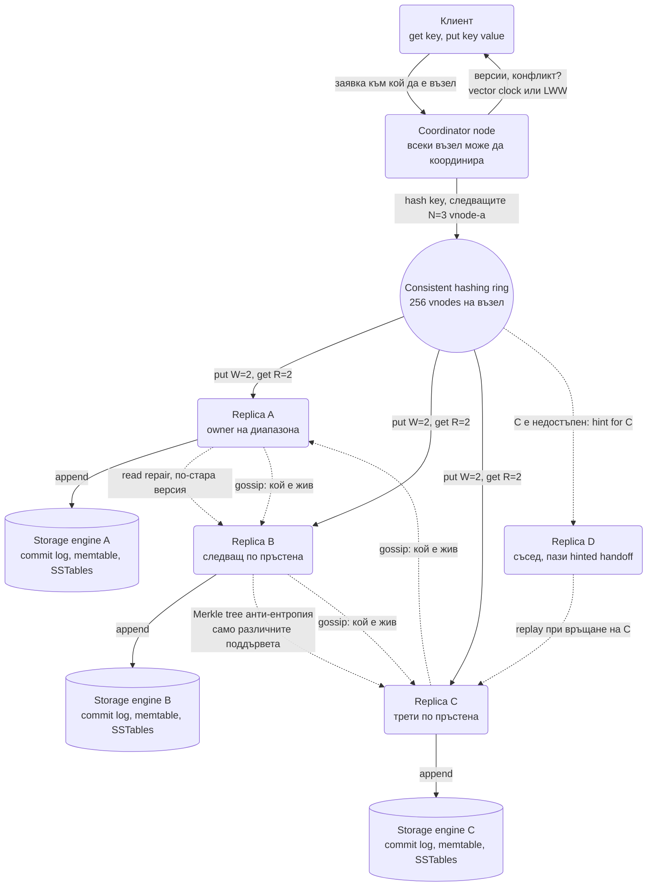
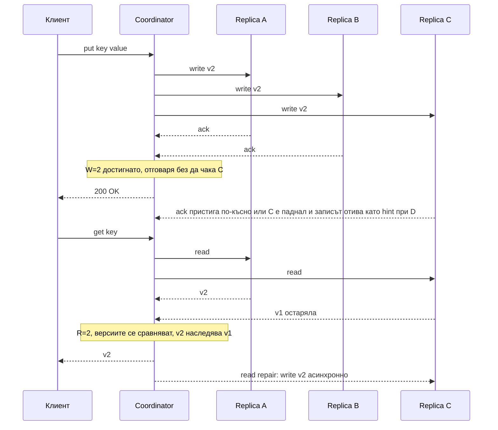
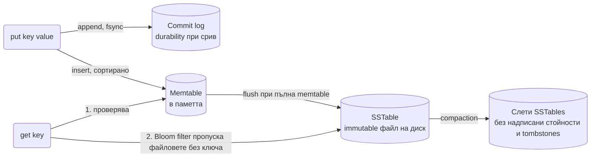

# Разпределено Key-Value хранилище (Dynamo / Cassandra модел) - System Design

Това е системата, която интервюиращите използват, за да проверят дали разбираш **разпределените
основи**, а не дали можеш да наредиш микросървиси. Тук няма Kafka и няма CDN. Има консистентност,
репликация и отказ на възли.

## Архитектурна диаграма

**Как да четеш диаграмата:** Плътните стрелки са пътят на една заявка: клиентът пита произволен
възел, той става координатор, намира трите реплики по пръстена и чака `W` или `R` отговора, преди да
върне резултат. Пунктираните стрелки са фоновите механизми, които държат репликите еднакви без
централен управител: hinted handoff, когато реплика е паднала, read repair при четене, Merkle
анти-ентропия за рядко четените ключове и gossip за членството в клъстера. Цилиндрите са локалният
storage engine на всеки възел, който е append-only LSM дърво.

## Изисквания, които определят целия дизайн

| Изискване | Следствие |
| --- | --- |
| Винаги достъпно за запис (AP система) | Няма master. Всеки възел приема запис, дори при разделяне на мрежата. |
| Хоризонтално скалиране | Consistent hashing, добавяне на възел без препартициониране на всичко. |
| Настройваема консистентност | Кворум `R` и `W` се задават **на заявка**, не веднъж за системата. |
| Прост интерфейс | Само `get(key)` и `put(key, value)`. Няма join-ове, няма транзакции. |

## Системен дизайн накратко

Няма микросървиси, Kafka или CDN: това е една симетрична система от равноправни възли. Всеки възел е и координатор, и реплика, и storage engine. Leaderless дизайн (без master): записът винаги успява, конфликтите се решават после.

### Компоненти

| # | Компонент | Какво прави | Как комуникира |
| --- | --- | --- | --- |
| 1 | **Coordinator** (роля на всеки възел) | Приема `get`/`put` от клиента, хешира ключа, намира N=3 реплики по пръстена, чака W или R отговора, връща резултат | Клиентски бинарен протокол по TCP (напр. CQL или Dynamo API); към репликите паралелни вътрешни RPC по TCP (синхронно, чака кворум); връща версии и конфликти на клиента |
| 2 | **Consistent hashing ring** | Картографира ключ → възли; 256 vnodes на възел за равномерност | Споделена карта в паметта на всеки възел, разпространена с gossip |
| 3 | **Replicas** (N на ключ) | Пазят стойността; при недостъпна реплика записът отива при съсед с hint | Вътрешен RPC от координатора; hinted handoff replay към върналата се реплика (асинхронно) |
| 4 | **Storage engine** (на всеки възел) | Append-only LSM: commit log → memtable → SSTables с Bloom filter, compaction | Локален диск, `fsync` на commit log-а |
| 5 | **Anti-entropy** (фон) | Read repair при четене, Merkle tree сравнение за рядко четените ключове | Възел към възел по TCP, асинхронно, с лимит на пропускливостта |
| 6 | **Gossip** (фон) | Членство и failure detection без централен монитор | Epidemic протокол: всеки възел на секунда разменя състояние с няколко случайни съседа (UDP или TCP) |

### Комуникация, backpressure и патерни

- **Синхронно:** клиент → произволен възел (координатор) → паралелни RPC към N реплики; отговор след кворум (W за запис, R за четене). Консистентността е параметър на заявката: `R + W > N`.
- **Асинхронно:** третият ack, hinted handoff, read repair, Merkle sync, gossip. Нищо от тях не струва латентност на заявката.
- **Backpressure:** възел с дълга опашка отговаря "overloaded" вместо да закъснее за всички (load shedding); hedged requests към допълнителна реплика след p95 за tail latency; snitch / latency-aware routing.
- **Патерни:** consistent hashing с vnodes, кворум, sloppy quorum + hinted handoff (Dynamo), vector clocks / DVV или LWW за конфликти, CRDT броячи, tombstones с `gc_grace_period`, LSM с compaction стратегия (STCS, LCS, TWCS), key splitting и клиентски кеш за горещи ключове. Консенсус (Raft/Paxos) само за метаданни и операции "точно веднъж".

### Flow: сценариите стъпка по стъпка

**Запис на стойност.** Приложението прави `put("cart:42", {...})` към който и да е възел, да кажем възел 7; той става координатор за тази заявка. Хешира ключа, намира мястото му на пръстена и взима следващите три различни физически възела по часовниковата стрелка: A, B и C (прескача vnodes на същата машина и, ако може, на същия rack). Праща записа и на трите паралелно. A и B отговарят за 2 ms, всеки след като е дописал стойността в своя commit log на диска и в memtable-а в паметта (append, без да търси къде да я сложи, затова е бърз). Координаторът иска W=2 и вече ги има: отговаря на клиента "OK", без да чака C. Ack-ът на C пристига 10 ms по-късно или изобщо не пристига. Ако C е недостъпен, координаторът записва копието при следващия здрав възел D с бележка "това е за C" (hinted handoff), така че записът пак е на две машини. Когато C се върне, D му го препредава. Това е sloppy quorum: записът никога не се отказва, докато има W живи възела някъде.

**Четене със стара реплика.** Същият клиент прави `get("cart:42")` с R=2 към възел 3, който сега е координатор. Той праща четене към A и C (избрани по най-ниска латентност). A връща версия v2, C връща v1, защото записът не го е достигнал. Понеже R + W = 4 > N = 3, поне една от двете реплики гарантирано има последния запис. Координаторът сравнява версиите (при vector clock вижда, че v2 наследява v1; при LWW сравнява timestamp-ите), връща v2 на клиента и чак след това, асинхронно, праща v2 към C (read repair: поправката се плаща от трафика на четене, но не струва латентност на заявката). Ако двете версии са конкурентни (два клиента са писали при разделена мрежа), координаторът връща и двете на клиента, който ги слива по бизнес логика (двете кошници се обединяват, а не едната печели). Ако координаторът види, че отговорът от C закъснява над p95, праща hedged request към B и взима първия отговор, за да не следва p99 на цялата система една бавна машина.

**Отпадане на възел и анти-ентропия.** Възел C спира да отговаря на gossip. Съседите му го маркират като подозрителен, слухът се разнася за секунди и всички координатори спират да го броят към кворума, а записите му отиват като hints при съседите. Когато C се върне след 20 минути, hints-овете се replay-ват и горещите ключове се оправят от read repair при първото четене. За хилядите рядко четени ключове обаче никой не чете, значи read repair никога не се задейства. Затова на фон C и B периодично сравняват Merkle дървета на общия си диапазон: хеш на хешовете, при който еднакви поддървета имат еднакъв корен и се пропускат с едно сравнение, а само различните листа се обменят. Изтриванията през това време не са трили нищо, а са записали tombstone маркери, иначе C при връщането си би "възкресил" изтритата стойност. Tombstone-ите се чистят при compaction след `gc_grace_period`, който трябва да е по-дълъг от най-дългото възможно отсъствие на възел.

## Описание на архитектурата стъпка по стъпка

### 1. Consistent Hashing: къде живее ключът

Наивното `hash(key) % N` изисква преместване на почти всички данни при промяна на `N`. Consistent
hashing подрежда и възлите, и ключовете върху пръстен: ключът отива на **първия възел по посока на
часовниковата стрелка**.

- Добавяне или премахване на възел размества само `1/N` от данните.
- **Виртуални възли (vnodes):** всеки физически възел заема стотици позиции на пръстена. Без тях
  разпределението е неравномерно, а при отпадане на възел цялото му натоварване пада върху един
  съсед. С тях натоварването се разпределя между всички.
- Репликация: стойността се пази на **следващите N възела** по пръстена (типично `N = 3`), като се
  прескачат позициите на същия физически възел и по възможност на същата стойка или зона.

### 2. Кворум: `R + W > N`

Всяка заявка избира колко реплики трябва да отговорят:

| Настройка | Поведение |
| --- | --- |
| `W = 1` | Много бърз запис, но може да се загуби при срив на този възел. |
| `W = N` | Максимална издръжливост, но записът пада, ако **един** възел е недостъпен. |
| `R + W > N` | Гарантирано припокриване: четенето задължително вижда поне една реплика с последния запис. |
| `R = W = 2, N = 3` | Стандартният баланс. Понася отпадането на един възел и за четене, и за запис. |
| `R = 1, W = 1` | Максимална скорост, чиста eventual consistency. За кеш-подобни данни. |

Изречението за интервю: **консистентността не е свойство на базата, а параметър на заявката.**

Така изглеждат един запис и едно четене при `N = 3, W = 2, R = 2`:

Обърни внимание на два момента: координаторът отговаря на клиента веднага след втория ack, а
третият запис или пристига по-късно, или изобщо не пристига и се компенсира от hinted handoff.
При четенето остарялата реплика се поправя **след** като клиентът вече е получил отговор, така че
поправката не струва латентност на заявката.

### 3. Sloppy quorum срещу strict quorum

Тук се крие уловката, която отличава кандидат, чел само формулата `R + W > N`, от кандидат, чел
Dynamo paper-а.

- **Strict quorum:** записът трябва да стигне до `W` от **точно** N-те реплики, които са отговорни
  за ключа по пръстена. Ако две от трите са недостъпни, записът се отказва. Гаранцията за
  припокриване между четене и запис е валидна.
- **Sloppy quorum (изборът на Dynamo):** ако отговорна реплика е недостъпна, координаторът записва
  при **следващия здрав възел** по пръстена (виж hinted handoff), докато събере `W` отговора.
  Записът винага успява, докъдето има `W` живи възела в клъстера.

Цената на sloppy quorum-а е, че **`R + W > N` вече не гарантира припокриване по време на разделяне
на мрежата**. Записът може да е при D и E (временни заместници), а четенето да пита A, B и C, които
изобщо не са го видели. Клиентът получава стара стойност, макар формално да е спазил формулата.
Консистентността се възстановява чак когато hint-овете се върнат при истинските собственици.

Изречение за интервю: "Dynamo избира sloppy quorum, защото приоритетът е да не откаже нито един
запис. Ако някой ме пита защо `R + W > N` не е достатъчно, отговорът е точно този компромис." В
Cassandra това поведение е настройка (`CL.QUORUM` е strict; hinted handoff се пише при отказ, но не се
брои към кворума), така че там формулата важи.

### 4. Разрешаване на конфликти

При `R + W > N` четенето може да върне **две различни версии** на ключа (два клиента са писали при
разделена мрежа). Кой печели:

- **Last-Write-Wins (LWW) по timestamp.** Простото решение и това, което Cassandra прави по
  подразбиране. Опасността е clock skew: часовникът на един възел избързва и неговият запис
  "печели" завинаги, а верният запис безшумно изчезва.
- **Vector clocks (подходът на Dynamo).** Всяка реплика носи брояч; системата може да различи
  "тази версия наследява онази" от "тези две версии са конкурентни". Конкурентните се връщат на
  **клиента**, който ги слива по бизнес логика (класическият пример: количката на Amazon, където
  сливането означава обединяване на артикулите, а не избор на едната кошница).
- **CRDT.** Структури, които се сливат детерминистично по конструкция (брояч, set, регистър). Няма
  конфликт по дефиниция, но не всяка структура от данни може да се изрази така.

#### Vector clocks, dotted version vectors и защо Cassandra избра LWW

Vector clock-ът е коректен, но има две практически беди:

- **Сложност при клиента.** Всяко четене може да върне няколко "сестрински" версии (siblings), а
  приложението трябва да знае как да ги слее. За количка е лесно, за произволен JSON документ не е.
  Повечето екипи или пишат сливането грешно, или просто взимат последната, което е LWW с повече код.
- **Sibling explosion.** Ако клиентът пише, без да подаде обратно контекста от последното четене,
  всеки запис създава нова конкурентна версия. Един горещ ключ може да натрупа хиляди siblings и
  четенето му да стане мегабайти. Riak имаше точно този проблем в продукция.
- **Размер.** Векторът расте с броя възли, които са докосвали ключа. Dynamo го подрязва след 10
  записа, което вече е компромис с коректността.

**Dotted version vectors (DVV)** решават sibling explosion-а: всяка версия носи "точка" (възел +
брояч на записа), така че сървърът може да разбере, че нов запис от същия клиент замества стария
sibling, вместо да добавя нов. Riak 2 мина на DVV именно заради това.

Cassandra взе другото решение: **LWW с timestamp на ниво колона**, без версии и без siblings. Цената
е зависимостта от часовниците (NTP е задължителен, а критичните операции използват Lightweight
Transactions вместо LWW). Ползата е, че клиентът никога не вижда конфликт и моделът на данните
остава прост. За интервю: "LWW е избор в полза на простотата на клиента срещу риск от тиха загуба на
запис при clock skew; vector clocks са обратният компромис."

### 5. Отказ на възел

- **Hinted Handoff:** ако реплика C е недостъпна, координаторът записва при съсед D с бележка "това
  е за C". Когато C се върне, D му препредава натрупаното. Така записът успява дори при паднал възел,
  без да нарушава `W`.
- **Read Repair:** при четене координаторът вижда, че една реплика е с по-стара версия, връща
  верния отговор на клиента и **асинхронно** поправя изостаналата реплика. Поправката се плаща от
  трафика на четене, което е евтино за често четените ключове.
- **Merkle Tree анти-ентропия:** за рядко четените ключове read repair никога не се задейства.
  Затова възлите периодично сравняват хеш-дървета на своите диапазони и обменят **само** различаващите
  се поддървета, вместо да си препращат всички данни.
- **Gossip:** състоянието "кой е жив" се разпространява по epidemic протокол между възлите. Няма
  централен монитор, който сам да е single point of failure.

### 6. Как изглежда един възел отвътре

Записът в Dynamo-подобна база е бърз, защото е **append-only**:

Четенето проверява Memtable, после SSTable-ите, като използва **Bloom filter** на всеки файл, за да
не отваря тези, които със сигурност нямат ключа. Точно затова тези бази са write-optimized: записът
никога не търси къде да седне, а само дописва.

Над Bloom филтъра стоят още два кеша, за които интервюиращият може да попита:

- **Key cache:** пази позицията (offset) на ключа в SSTable файла, така че при hit се прескача
  търсенето в индекса на файла и остава едно дисково четене.
- **Row cache:** пази цялата стойност в паметта. Помага само при малък набор много горещи ключове;
  при широки редове изяжда RAM и се инвалидира при всеки запис, така че по подразбиране е изключен.

#### Compaction: size-tiered срещу leveled

Compaction е процесът, който плаща сметката за бързия запис, и изборът на стратегия определя дали
системата е добра за четене или за писане:

| Стратегия | Как работи | Write amplification | Read amplification | Space overhead | Кога |
| --- | --- | --- | --- | --- | --- |
| **Size-tiered (STCS)** | Слива SSTable-и с близък размер, когато се съберат 4 такива. | Ниска (всеки байт се преписва ~log N пъти) | Висока: ключът може да е в много файлове с припокриващи се диапазони | До 2x по време на сливане | Write-heavy, time-series, append-only логове |
| **Leveled (LCS)** | Всяко ниво е 10x по-голямо от предишното и файловете в него не се припокриват; ключът е в най-много един файл на ниво. | Висока (~10x повече преписване) | Ниска: най-много L файла за проверка | ~10% | Read-heavy, много updates на същите ключове |
| **Time-window (TWCS)** | STCS, но само в рамките на времеви прозорец; стари прозорци не се пипат. | Най-ниска | Ниска за заявки по време | Малък | Данни с TTL и времеви ключ (метрики, събития) |

Изречение за интервю: "LSM дървото разменя write amplification за read amplification; compaction
стратегията е копчето, с което избираш кое от двете да платиш."

### 7. Tail latency и hedged requests

При 1 млн. заявки/сек и `R = 2` всяко четене чака **по-бавната** от две реплики. Ако една реплика има
GC пауза или бавен диск, p99 латентността на цялата система следва нея, макар другите две да са
здрави. Решения, които се очакват на senior ниво:

- **Hedged requests:** координаторът праща заявката към `R` реплики, а ако отговорът не е дошъл до
  p95 латентността (напр. 5 ms), праща и към **още една** реплика и взима първия отговор. Струва ~5%
  допълнителен трафик, а сваля p99 в пъти. Cassandra го нарича speculative retry.
- **Snitch / latency-aware routing:** координаторът следи латентността на всяка реплика и праща към
  най-бързите `R`, а не към първите по пръстена.
- **Backpressure и load shedding в самия възел:** възел с дълга опашка отговаря с "overloaded",
  вместо да приема и да закъснее за всички.

### 8. Горещи ключове

Consistent hashing разпределя **ключовете** равномерно, но не разпределя **трафика**. Един celebrity
ключ (профилът на известен акаунт, глобален конфиг) пада винаги на същите N реплики, и те стават
hot spot, докато останалите 72 възела скучаят.

- **Кеш на клиента / в приложението** с кратък TTL за най-горещите ключове. Пада трафикът към
  репликите с порядъци.
- **Key splitting:** ключът се пише с случаен суфикс `key#0..key#15` на 16 места и четенето пита
  едно от тях (за read-heavy) или ги събира (за броячи). Заменя един горещ ключ с 16 хладни.
- **Повече реплики само за този ключ** (Cassandra не го поддържа per-key; DynamoDB го прави
  автоматично с adaptive capacity).
- **Мониторинг:** без метрика "заявки на ключ" горещият ключ се открива чак когато трите реплики
  паднат заедно.

### 9. Кога всъщност трябва консенсус

Dynamo-подобната система е **leaderless**: няма избран лидер, всеки възел приема запис. Това дава
достъпност, но означава, че две реплики могат да приемат противоречиви записи. Има операции, при
които това е недопустимо:

- **Метаданни на клъстера:** кой възел владее кой диапазон, схема на таблиците, конфигурация. Ако два
  възела имат различна представа за пръстена, данните отиват на грешни места.
- **Операции "точно веднъж":** уникално потребителско име, резервация на място, брояч на пари.
- **Lease и leader election** за фонови процеси.

За тях се използва **консенсусен протокол** (Raft или Paxos), при който има лидер и мнозинството
трябва да се съгласи, преди записът да е валиден. Cassandra използва Paxos за Lightweight
Transactions (`IF NOT EXISTS`), etcd и Zookeeper са Raft/ZAB бази изцяло за такива данни, а Spanner
и CockroachDB прилагат Raft на всеки шард.

| | Dynamo-style (leaderless, кворум) | Raft-style (лидер, консенсус) |
| --- | --- | --- |
| Достъпност при разделяне на мрежата | Двете страни приемат записи | Само страната с мнозинството работи; малцинството отказва |
| Латентност на запис | 1 обиколка до W реплики | 1 обиколка до лидера + 1 до мнозинството; лидерът може да е в друг регион |
| Конфликти при запис | Възможни, решават се после (LWW, vector clocks) | Невъзможни, лидерът сериализира |
| Нужда от часовници | LWW зависи от тях | Не (освен при Spanner TrueTime за глобален ред) |
| Пропускливост | Скалира линейно с възлите | Ограничена от лидера на шард |
| Типична употреба | Сесии, кошници, профили, метрики, кеш-подобни данни | Конфигурация, lock-ове, метаданни, пари, уникални ограничения |

Практичният отговор в интервю: "Пътят на данните е leaderless за скалиране и достъпност; малкият
набор от метаданни и координационни операции минава през Raft. Cassandra прави точно това: Paxos
само за LWT, gossip и кворум за всичко останало."

## Оразмеряване (Back-of-the-envelope)

Допускане: **100 TB данни**, 1 млн. заявки/сек, `N = 3`.

| Метрика | Изчисление | Резултат |
| --- | --- | --- |
| Данни с репликация | 100 TB × 3 | 300 TB |
| Брой възли | 300 TB / 4 TB на възел | ≈ 75 възела |
| Заявки на възел | 1M × 3 (реплики) / 75 | ≈ 40 000 операции/сек на възел |
| Vnodes | 75 × 256 | ≈ 19 200 позиции на пръстена |
| Bloom filter памет | ~10 бита на ключ × ключовете на възела | Единици GB, стои в RAM |
| Дисково пространство с compaction overhead | 4 TB × 1.5 (STCS) или × 1.1 (LCS) | 6 TB или 4.4 TB физически диск на възел |
| Данни за преместване при добавяне на възел | 300 TB / 76 | ≈ 4 TB стрийминг, часове при 1 Gbps |

Двата извода за интервюто: **40 000 операции/сек на възел** е причината записът да е append-only
(HDD/SSD не понасят толкова случайни записи на място), а **4 TB за преместване при нов възел** е
причината да се добавят възли предварително, а не в момента на инцидента.

## Ключови въпроси за интервюто

### CAP: какво точно жертвате?

При разделяне на мрежата тази система избира **достъпност** пред консистентността: и двете страни на
разделението приемат записи, а конфликтите се решават после. Ако вместо това трябва строга
консистентност (банков баланс), отговорът не е тази архитектура, а система с консенсус (Raft/Paxos):
Spanner, etcd, CockroachDB. **PACELC** е по-честата рамка: дори без разделяне пак избираш между
латентност и консистентност, като въртиш `R` и `W`.

### Защо виртуални възли?

Три причини: равномерно разпределение без ръчно наместване; при отпадане на възел товарът се
разпределя между **всички** останали, а не пада върху единия съсед; и хетерогенен хардуер (по-мощна
машина получава повече vnodes).

### Какво става при изтриване в append-only система?

Записва се **tombstone** (маркер за изтрито), не се трие нищо. Ако се триеше веднага, изостанала
реплика при следващия анти-ентропиен цикъл щеше да "възкреси" стойността. Tombstone-ите се чистят
при compaction след `gc_grace_period`, който трябва да е по-дълъг от максималното време за
възстановяване на възел.

### Кога този дизайн е грешният отговор?

Когато приложението иска транзакции между ключове, вторични индекси, аналитични заявки или строга
консистентност по подразбиране. Key-value хранилището е бързо, защото е отказало точно тези неща.

### Как се добавя нов възел без прекъсване?

Новият възел заема своите vnode позиции, взима диапазоните си от текущите собственици чрез стрийминг,
и чак след като е наваксал, започва да обслужва заявки. През цялото време старите възли продължават
да отговарят, така че операцията е онлайн.

### Клиентът пише с W=2, после чете с R=2 и получава старата стойност. Как е възможно?

Три възможни причини, и е добре да ги изредиш всички: sloppy quorum (записът е отишъл при временни
заместници, четенето пита истинските собственици); read repair още не е минал, а координаторът при
четенето е избрал две реплики, нито една от които не е сред двете с новия запис (при strict quorum
това е невъзможно, при sloppy е възможно); или LWW с clock skew, при който "новият" запис има по-стар
timestamp и губи. Ако интервюиращият иска гаранция read-your-writes, отговорът е `W = N` или четене
от същия координатор със session consistency.

### Защо не просто повече реплики (N = 5) за по-висока консистентност?

Броят реплики влияе на **издръжливостта**, не на консистентността. Консистентността идва от
припокриването `R + W > N`, а с `N = 5` и `R = W = 3` всяка заявка чака три възела и латентността
расте, докато рискът от конфликт остава същият. Повече реплики се използват за гео-репликация (по
една в различни региони), не за коректност.

### Как бихте направили брояч (likes) в тази система?

Не с `get` + `put`, защото два конкурентни клиента ще загубят единия инкремент. Вариантите са CRDT
G-Counter (всяка реплика пази собствен брояч, стойността е сумата; сливането е max по компонент),
специална counter колона (Cassandra прави точно това, но с известни ограничения при повторен опит),
или изнасяне на броячите в отделна система (Redis `INCR`), ако приблизителната стойност е приемлива.
