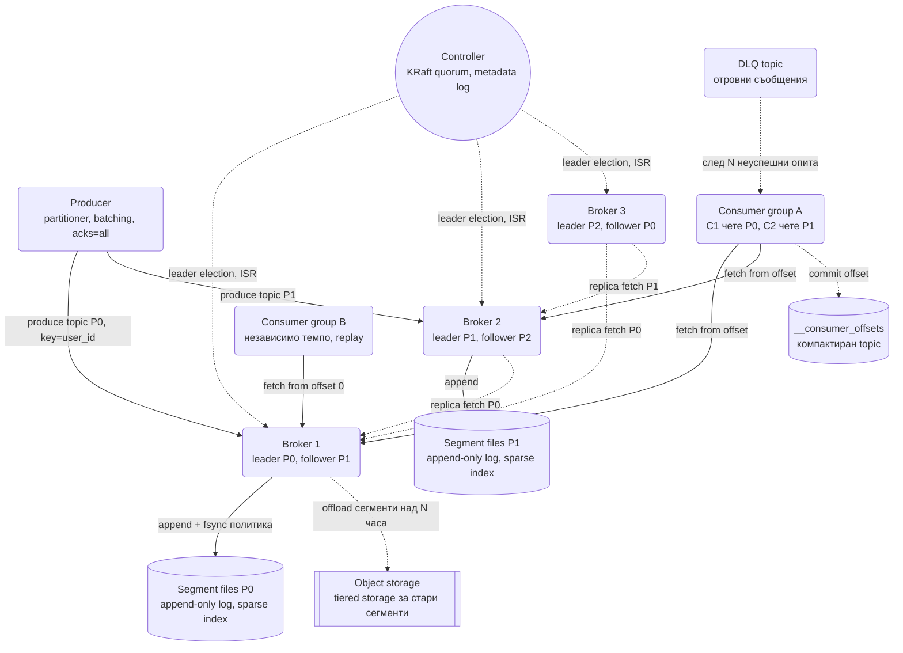
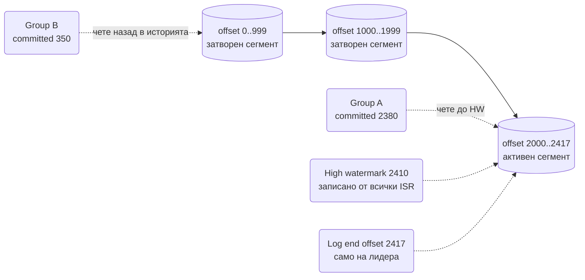
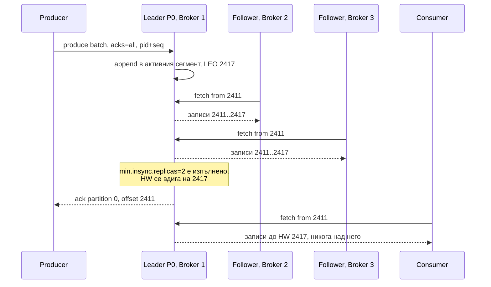

# Разпределена опашка за съобщения (Kafka тип) - System Design

Почти всяка система в тази папка има кутийка с надпис "Kafka" и стрелка към нея. Този документ
отваря кутийката. Централният проблем е прост за формулиране и труден за решаване: **милиони
съобщения в секунда трябва да се приемат с гаранция, че не се губят, да се пазят дни наред и да се
четат от десетки независими консуматори, всеки със собствено темпо, без производителят да чака
никого от тях.**

Ключовото прозрение, което отличава лога от класическата опашка: съобщението не се "изважда" при
четене. То стои на диска, а всеки консуматор помни само **докъде е стигнал** (offset). Това прави
replay безплатен, fan-out към много консуматори безплатен и позволява брокерът да е глупав и бърз.

## Архитектурна диаграма



**Как да четеш диаграмата:** отляво producer-ът избира партиция по ключ и пише към лидера ѝ; всяка
партиция е append-only лог на диска. Пунктираните стрелки между брокерите са репликацията: follower-ите
теглят от лидера, а Controller-ът решава кой е лидер и кой е в ISR. Отдясно две консуматорски групи
четат едни и същи данни независимо, всяка помни своя offset в компактиран системен topic. Долу са
двете неща, които често се пропускат: tiered storage за стари сегменти и DLQ topic за отровни
съобщения.

## Системен дизайн накратко

Не е опашка, а разпределен append-only лог: съобщението не се изважда при четене, всеки консуматор помни само offset. 6 вида компоненти: producer-и, брокери (лидер и follower-и на партиция), controller кворум, consumer group-и и tiered storage.

### Компоненти

| # | Компонент | Какво прави | Как комуникира |
| --- | --- | --- | --- |
| 1 | **Producer** | Избира партиция по `hash(key)`, събира партиди, компресира, `acks=all`, идемпотентен (pid + seq) | Kafka бинарен протокол по TCP към лидера на партицията; чака ack според `acks` (синхронно за partidата, асинхронно спрямо приложението чрез callback) |
| 2 | **Broker** (лидер на партиция) | Append в активния сегмент, разреден индекс, издига high watermark след ISR | Приема produce и fetch заявки по TCP; follower-ите го питат с fetch (pull), той не им праща нищо сам |
| 3 | **Broker** (follower) | Реплицира чрез fetch от лидера; в ISR, ако изостава под `replica.lag.time.max.ms` | Replica fetch по TCP към лидера (pull, постоянен цикъл) |
| 4 | **Controller** (KRaft кворум) | Метаданни с консенсус: кой е лидер, ISR, topics; leader election само от ISR | Raft между 3-5 контролера по TCP; брокерите теглят метаданните от controller-а и получават известие при промяна |
| 5 | **Consumer group** | Всяка партиция към точно един консуматор; pull от offset; commit в `__consumer_offsets`; rebalance при промяна | Fetch заявки по TCP до high watermark (pull, с `max.poll.records`); heartbeat към group coordinator-а; commit offset като запис в системния topic |
| 6 | **Tiered storage** | Затворени сегменти в обектно хранилище, локалният диск пази само горещата опашка | Брокерът качва сегменти по S3 API (асинхронно, по възраст) и ги тегли обратно при fetch на стари offset-и |

### Хранилища

| Компонент | Роля |
| --- | --- |
| Segment files (около 1 GB) | Append-only лог + `.index` + `.timeindex`; retention по време или размер |
| `__consumer_offsets` | Компактиран системен topic с offset-ите |
| Metadata log | KRaft логът на контролерите |
| Object storage | Tiered storage за дълга ретенция |
| DLQ topic | Отровни съобщения след N опита |

### Комуникация, backpressure и патерни

- **Запис:** producer → лидер → follower-и теглят → HW се вдига → ack. Подредба само в партиция.
- **Четене:** pull, не push. Затова бавният консуматор не може да бъде залят: той изостава, а изоставането е consumer lag, основната метрика.
- **Backpressure:** producer-ът никога не чака консуматорите (queue-based load leveling); lag над retention означава загуба, алармата звъни много преди това; `acks=all` + `min.insync.replicas` отказват запис, вместо да го загубят.
- **Патерни:** партиционирана репликация с лидер и ISR, high watermark, идемпотентен producer и транзакции (exactly-once само вътре в Kafka), log compaction като changelog, zero-copy и page cache, cooperative rebalance, DLQ и retry topics, построени отгоре. Външната гаранция винаги е идемпотентен sink.

### Flow: сценариите стъпка по стъпка

**Запис с acks=all.** Chat Service иска да запише съобщение с ключ `chat_id = 77`. Producer-ът в процеса му смята `hash(77) % 240` и получава партиция 12, чийто лидер е Broker 1. Не праща веднага: събира съобщенията от следващите няколко милисекунди (`linger.ms`) в партида, компресира я с lz4 и праща една TCP заявка с producer id и пореден номер (ако заявката се повтори след timeout, брокерът разпознава номера и не записва дубликат). Broker 1 дописва партидата в края на активния сегмент на партиция 12, което е последователен запис на диска, най-бързата операция, която дискът може, и обновява log end offset на 2417. Не отговаря още. Broker 2 и Broker 3 са follower-и на партиция 12 и в постоянен цикъл го питат "дай ми всичко след 2411" (pull); получават записите и ги дописват в своите сегменти. Когато и двата са потвърдили, лидерът вдига high watermark на 2417, защото `min.insync.replicas = 2` е изпълнено, и чак тогава отговаря на producer-а: "партиция 12, offset 2411". Консуматорите виждат само до high watermark: ако лидерът падне преди репликацията и нов лидер никога не е виждал записа, никой консуматор не го е прочел и няма "изчезнало" съобщение.

**Четене и rebalance.** Delivery Worker е част от consumer group `deliver` с 4 инстанса, които делят 240 партиции по 60. Инстанс C1 праща fetch заявка за партиция 12 от offset 2380 с лимит `max.poll.records = 500` (pull: консуматорът решава колко да вземе и кога; ако е бавен, просто тегли по-рядко, а разликата между HW и неговия offset е consumer lag, който се мери и алармира). Брокерът праща байтовете директно от page cache-а на операционната система в сокета (zero-copy, без да ги декодира, защото форматът на диска е форматът по мрежата). C1 обработва 37 съобщения и commit-ва offset 2417 като запис в системния topic `__consumer_offsets` (компактиран: пази само последната стойност за ключа група + топик + партиция). Ако C1 умре, group coordinator-ът не получава heartbeat за `session.timeout.ms` и стартира rebalance: при cooperative протокола само 60-те партиции на C1 се разпределят между C2, C3 и C4, останалите продължават без спиране. Новият собственик на партиция 12 започва от последния commit-нат offset 2417; съобщенията, които C1 е обработил, но не е успял да commit-не, се обработват втори път (at-least-once), затова Delivery Worker е идемпотентен.

**Падане на лидер.** Broker 1 изгаря диск. Controller кворумът (KRaft, Raft между 3 контролера) не получава heartbeat от него и за всяка партиция, на която е бил лидер, избира нов лидер само измежду ISR репликите (тези, които са били в крак). За партиция 12 това е Broker 2. Ако никоя реплика не е в ISR и `unclean.leader.election = false`, партицията остава недостъпна, вместо да загуби данни; при `true` се избира изостанала реплика и записите след нейния offset изчезват. Controller-ът записва новите метаданни в своя Raft лог и брокерите ги теглят. Producer-ите получават грешка "not leader" на следващата заявка, опресняват метаданните и пращат към Broker 2; идемпотентният producer гарантира, че retry-ът не дублира. Консуматорите правят същото за fetch. Когато Broker 1 се върне, става follower, тегли от Broker 2 всичко, което му липсва, и влиза обратно в ISR. Под-репликираните партиции над нула за повече от минута са инцидент, защото точно тогава `acks=all` записите започват да чакат или да се отказват.

## Описание на архитектурата стъпка по стъпка

### 1. Topic, партиция, лог

- **Topic** е логическо име. **Партицията** е физическата единица: подреден, append-only лог на един
  брокер. Подредба се гарантира **само вътре в една партиция**, никога между партиции.
- Партицията се пази като **сегменти** (файлове по ~1 GB). Активният сегмент приема записи; старите
  са неизменяеми и се трият или качват в tiered storage по политика за retention.
- До всеки сегмент стои **разреден индекс** (offset → байтова позиция на всеки ~4 KB). Търсене по
  offset е binary search в индекса плюс кратко линейно четене. Няма B-tree и няма случайни записи.
- **Retention** е по време (7 дни) или размер, независимо дали някой е прочел данните. Логът не е
  опашка: четенето не трие.

### 2. Producer: избор на партиция, партиди, acks

- Партицията се избира по `hash(key) % partitions`. Всички събития с един ключ (един `user_id`, един
  `chat_id`) попадат в една партиция и запазват реда си. Без ключ: round-robin или sticky partitioner.
- Съобщенията се събират в **партиди** (`linger.ms`, `batch.size`) и се компресират заедно (lz4,
  zstd). Една мрежова заявка носи стотици съобщения; това е първата причина за пропускливостта.
- `acks` определя какво значи "записано":

| `acks` | Кога producer-ът получава отговор | Риск |
| --- | --- | --- |
| `0` | Веднага, без потвърждение | Загуба при всеки срив; за метрики |
| `1` | Лидерът е записал | Загуба, ако лидерът падне преди репликация |
| `all` + `min.insync.replicas=2` | Всички реплики в ISR са записали | Няма загуба при отпадане на един брокер; това е настройката за пари и събития |

- **Идемпотентен producer** (`enable.idempotence=true`): всяко съобщение носи producer id и
  пореден номер, брокерът отхвърля дубликатите при retry. Без това retry след таймаут може да
  запише съобщението два пъти.

### 3. Репликация: лидер, follower, ISR, high watermark

- Всяка партиция има един **лидер** и N-1 **follower-а** на други брокери (типично фактор 3).
  Всички записи и четения минават през лидера; follower-ите теглят от него като обикновени консуматори.
- **ISR (in-sync replicas)** е множеството реплики, които са в крак с лидера (изостават под
  `replica.lag.time.max.ms`). Реплика, която изостане, излиза от ISR и не брои за `acks=all`.
- **High watermark (HW)** е най-големият offset, записан от всички реплики в ISR. Консуматорите
  виждат **само до HW**. Иначе консуматор би прочел запис, който след смяна на лидера изчезва, защото
  новият лидер никога не го е получил.
- При падане на лидера Controller-ът избира нов лидер **само от ISR**. `unclean.leader.election=false`
  предпочита недостъпност пред загуба на данни; `true` избира обратното.

### 4. Controller и метаданни

Кой е лидер на коя партиция, кой е в ISR, кои topics съществуват - това са метаданни, които изискват
консенсус. Исторически ги пазеше ZooKeeper; днес го прави **KRaft**: кворум от контролери с Raft
върху вътрешен лог с метаданни. Резултатът е една система по-малко и failover за секунди при
клъстери с милиони партиции. Това е мястото, където се среща [консенсусът](System_Design.md), докато
пътят на данните е без консенсус (лидер + ISR).

### 5. Consumer groups и rebalance

- Всяка партиция се чете от **точно един** консуматор в група. Повече консуматори от партиции значи
  безделни консуматори. Оттук следва: **броят партиции е таванът на паралелизма** на една група.
- Няколко групи четат едни и същи данни независимо. Fan-out към 20 консумиращи системи не струва
  нищо на producer-а.
- **Rebalance** при влизане или излизане на консуматор. Класическият (eager) протокол спира цялата
  група, отнема всички партиции и ги раздава наново - stop-the-world за секунди. **Cooperative
  incremental** мести само засегнатите партиции, докато останалите продължават. Static membership
  (`group.instance.id`) избягва rebalance при рестарт на pod.
- Offset-ите се пазят в системния topic `__consumer_offsets`, компактиран по ключ (група, topic,
  партиция). Консуматорът решава кога да commit-ва, и точно това решение определя гаранциите.

### 6. Гаранции за доставка

| Гаранция | Как | Цена |
| --- | --- | --- |
| **At-most-once** | Commit преди обработка | При срив след commit съобщението е загубено |
| **At-least-once** | Commit след обработка | При срив между обработка и commit съобщението се обработва пак; консуматорът трябва да е [идемпотентен](System_Design.md) |
| **Exactly-once** | Идемпотентен producer + транзакции: consume, process, produce и commit на offset в една атомарна транзакция; консуматорите четат с `read_committed` | Работи **само в рамките на Kafka** (Kafka Streams, topic към topic). Външна база не участва в транзакцията |

Изречението за интервю: "exactly-once end-to-end не съществува. Kafka дава exactly-once между
topics, а към външния свят гаранцията идва от идемпотентен sink: upsert по event_id или дедупликация
в таблица с обработени ID-та."

### 7. Log compaction и tiered storage

- **Compaction** пази за всеки ключ **само последната стойност** вместо да трие по време. Topic-ът
  става changelog: пълното текущо състояние може да се възстанови от него. Използва се за
  `__consumer_offsets`, за CDC потоци и за state store-овете на Kafka Streams. Изтриване е запис с
  `null` стойност (tombstone), който се чисти след `delete.retention.ms`.
- **Tiered storage** качва затворените сегменти в обектно хранилище (виж
  [Object Storage](Object_Storage_S3.md)) и оставя на локалния диск само горещата опашка. Retention от
  месеци спира да струва локални SSD-та, а брокер се възстановява за минути вместо часове, защото
  копира само няколко GB.

### 8. Защо Kafka е бърза

- **Последователен I/O.** Append в края на файл и четене напред са най-бързото, което един диск може.
- **Page cache вместо собствен кеш.** Брокерът не сериализира в JVM heap; данните минават през кеша
  на ОС и консуматор, който чете скорошни данни, изобщо не пипа диска.
- **Zero-copy.** `sendfile` праща байтовете от page cache директно в сокета. Форматът на диска е
  форматът по мрежата, затова брокерът не декодира съобщенията.
- **Партиди навсякъде.** Producer, репликация и consumer fetch работят с партиди, не с отделни
  съобщения.

Следствие: брокерът е I/O-bound и тъп. Цялата "умна" логика (сериализация, филтри, transformации) е в
клиентите.

### 9. Бавни консуматори, lag и backpressure

Консуматорът **тегли** (pull), затова бавният консуматор не може да бъде залят: той просто изостава,
а изоставането е **consumer lag** (разлика между HW и commit-натия offset). Lag-ът е основната
метрика: расте стабилно значи трябва повече консуматори (до броя партиции) или повече партиции.
Producer-ът никога не чака консуматорите, което е точно [queue-based load leveling](System_Design.md).
Ако lag-ът надхвърли retention, данни се губят преди да бъдат прочетени, което е алармата, която
трябва да звънне много преди това.

### 10. Патерни върху лога: DLQ, delay, retry

Kafka няма вградено "провалено съобщение" и няма отложена доставка. Те се строят отгоре:

- **DLQ:** след N неуспешни опита консуматорът публикува съобщението плюс грешката в
  `topic.dlq` и commit-ва offset-а, за да не блокира партицията. Виж
  [Notification System](Notification_system.md) за replay UI.
- **Retry topic:** `topic.retry.1m`, `topic.retry.10m` с консуматор, който спи до времето на
  съобщението. Така retry не блокира главния поток и подредбата в главния topic не страда.
- **Delay:** Kafka не поддържа "доставѝ след 1 час". Вариантите са time-bucketed topics, Redis
  sorted set като планировчик пред Kafka или JetStream/SQS, които го имат вградено.

### 11. Опашка, pub/sub или лог

| | RabbitMQ / SQS (опашка) | Kafka (лог) | NATS JetStream |
| --- | --- | --- | --- |
| Модел на доставка | Push към консуматор, ack на съобщение | Pull, offset на партиция | Push или pull, ack на съобщение, durable consumers |
| Съобщението след четене | Изтрива се | Остава до retention | Остава до retention или до ack по политика |
| Replay | Няма | Безплатен, seek по offset или време | Да, по sequence или време |
| Подредба | Само в една опашка с един консуматор | В рамките на партиция | В рамките на stream/subject |
| Fan-out към N системи | N опашки и exchange, N копия | Една партиция, N групи | Един stream, N consumers |
| Приоритети, отложени съобщения | Вградени | Строят се отгоре | Отложени да, приоритети не |
| Request/reply | Не е предназначение | Не | Да, core NATS |
| Силна страна | Сложно рутиране, работа по задачи | Обем, replay, stream processing | Една система за RPC, pub/sub и опашки при по-малък мащаб |

Online Trading Game ([виж документа](Online_Trading_Game.md)) избира NATS точно защото има нужда и от
request/reply, а обемът не изисква Kafka. Notification System избира Kafka заради replay и fan-out.

## Оразмеряване (Back-of-the-envelope)

Допускане: **1 млн. съобщения/сек**, по ~1 KB, репликация 3, retention 7 дни, 20 консумиращи групи.

| Метрика | Изчисление | Резултат |
| --- | --- | --- |
| Входящ трафик | 1M × 1 KB | ≈ 1 GB/s |
| Записи на диск с репликация | 1 GB/s × 3 | ≈ 3 GB/s в клъстера |
| Изходящ трафик | 1 GB/s × 20 групи + 2 GB/s репликация | ≈ 22 GB/s, мрежата е гърлото, не дискът |
| Съхранение за 7 дни | 1 GB/s × 86 400 × 7 × 3 | ≈ 1.8 PB (≈ 600 TB преди репликация) |
| Партиции по пропускливост | 1 GB/s / ~20 MB/s на партиция | ≈ 50 партиции минимум |
| Партиции по паралелизъм | Най-бавната група иска 200 консуматора | ≥ 200 партиции, взимаме 240 |
| Брокери | 3 GB/s запис / ~300 MB/s на брокер (SSD, мрежа 10 Gbps) | ≈ 10-15 брокера, с резерв 20 |

Изводът: **изходящият трафик, не дискът, определя размера.** Всяка допълнителна консуматорска група
удвоява egress-а на клъстера, докато записът остава един. Оттук идват tiered storage (по-евтин
диск) и стойността на zero-copy.

## Модел на данните и API

```text
produce(topic, key?, value, headers?)           → { partition, offset }        acks=all
fetch(topic, partition, offset, max_bytes)      → [ records ] до high watermark
commit(group, { topic, partition: offset })     → ok                          в __consumer_offsets
seek(group, topic, partition, offset | ts)      → ok                          replay
```

| Елемент | Структура | Бележка |
| --- | --- | --- |
| Запис | `offset`, `timestamp`, `key`, `value`, `headers` | Offset-ът е позиция, не ID; уникален само в партицията |
| Сегмент | `00000000000123456789.log` + `.index` + `.timeindex` | Името е първият offset в сегмента |
| Партиция | Подреден списък сегменти, `log_start_offset`, `high_watermark`, `log_end_offset` | HW ≤ LEO |
| Offset commit | ключ `(group, topic, partition)` → `offset` | Компактиран topic, последната стойност печели |



Пътят на един запис с `acks=all`:



## Ключови въпроси за интервюто

### Как се гарантира подредбата?

Само в рамките на партиция и само при `max.in.flight.requests.per.connection=1` или идемпотентен
producer (който запазва реда и при retry). Ако бизнесът иска подредба по потребител, ключът е
`user_id`. Глобална подредба означава една партиция, тоест един брокер и един консуматор, което е
таван от десетки MB/s. Почти никой не иска глобална подредба, когато разбере цената.

### Какво става, когато консуматор умре?

Group coordinator-ът не получава heartbeat за `session.timeout.ms` и стартира rebalance. Партициите
на умрелия отиват при останалите, които продължават от последния commit-нат offset. Съобщенията след
този offset се обработват повторно, затова консуматорът е идемпотентен. С cooperative rebalance
останалите не спират; с eager всички спират за секунди.

### Защо не таблица в базата вместо опашка?

Работи до няколко хиляди съобщения в секунда и после се чупи по три начина: polling с `SELECT ... FOR
UPDATE SKIP LOCKED` натоварва базата и добавя латентност; изтриването на обработени редове прави
bloat и vacuum; няма replay и няма fan-out без копиране. За малка система с една база таблица (или
Postgres outbox) е напълно приемлив отговор и трябва да го кажеш, преди да предложиш Kafka.

### Колко партиции?

Максимум от две сметки: пропускливост (входящ трафик / реалистични 10-50 MB/s на партиция) и
паралелизъм (най-големият брой консуматори в една група). Плюс резерв, защото добавянето на партиции
после **разбива подредбата по ключ** (`hash % N` се променя). Но не хиляди без нужда: всяка партиция
е файлови дескриптори, памет и по-дълъг failover.

### Как се преработва вчерашният ден?

Нова консуматорска група или `seek` на съществуващата към offset по timestamp (`offsetsForTimes`).
Данните са на диска, нищо не се копира. Точно това е причината да се избере лог вместо опашка при
аналитика, ML и одит.

### Kafka, JetStream или SQS?

SQS: без операционна тежест, at-least-once, без подредба извън FIFO опашките с ограничен дебит, без
replay; за задачи между сървиси в облак. JetStream: една система за RPC, pub/sub и durable опашки,
отлична до средни обеми, без екосистемата за stream processing. Kafka: обем, retention, replay,
Streams/Flink/Connect екосистема, но е отделен клъстер с отделен екип.

### Какво е exactly-once в Kafka и какво не е?

Идемпотентен producer премахва дубликати от retry. Транзакциите правят "прочети от A, запиши в B,
commit-ни offset в A" атомарно, видимо само за `read_committed` консуматори. Това не се простира до
Postgres или до HTTP извикване. Там гаранцията е идемпотентният sink.

### Как се разбира, че клъстерът е болен?

Under-replicated partitions (реплики извън ISR), consumer lag по група, request latency на брокер,
брой rebalance на час, disk usage спрямо retention. Under-replicated над нула за повече от минута е
инцидент, защото `acks=all` записите започват да се отказват или да чакат.
