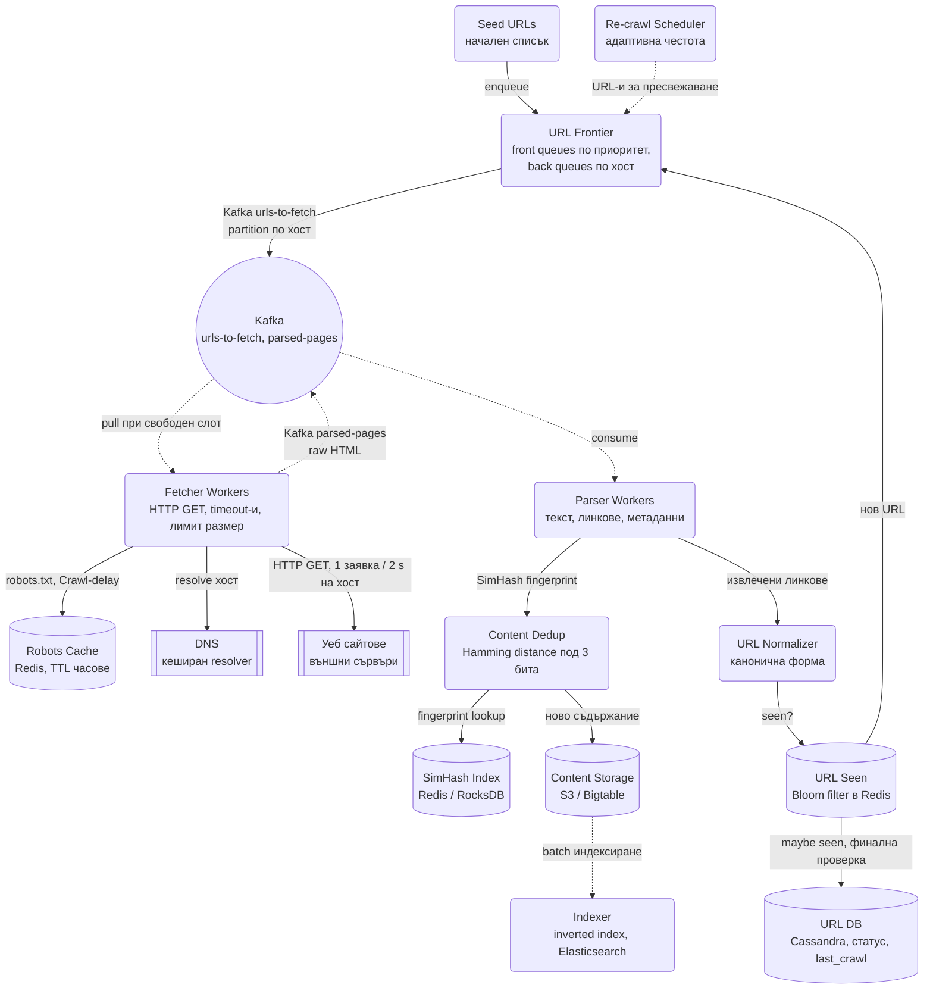
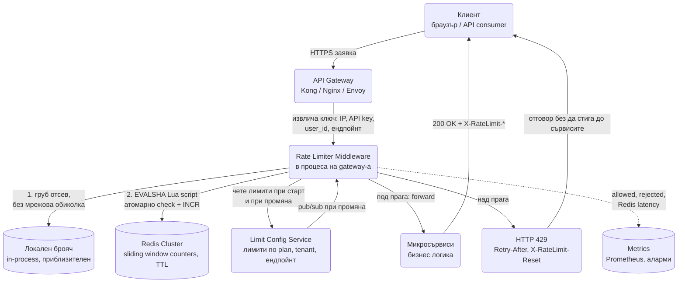
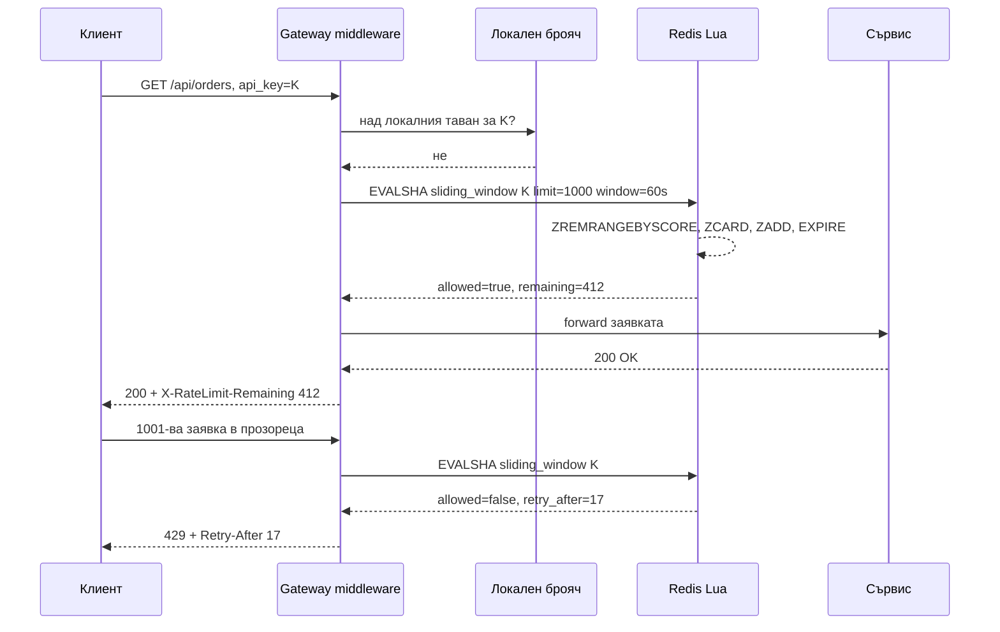

# Distributed Web Crawler & Distributed Rate Limiter - System Design

## Part 1: Distributed Web Crawler (разпределена търсачка / робот)

Основното предизвикателство тук е избягване на безкрайни цикли (дублиране), спазване на politeness
правила (да не съборим чужд сайт) и обработка на милиарди страници с висока производителност.
Трите въпроса, около които се върти целият дизайн: **какво да обходим следващо** (приоритет), **кога
имаме право да го обходим** (politeness) и **виждали ли сме го вече** (дедупликация).

### Архитектурна диаграма



**Как да четеш диаграмата:** Има един голям цикъл. Frontier-ът решава кой URL е следващ, Kafka го
доставя на Fetcher, който тегли страницата от външния свят (учтиво и с кеширани robots.txt и DNS).
Parser-ът разделя резултата на два потока: съдържанието минава през дедупликация и отива в
хранилището и индекса, а извлечените линкове минават през нормализация и Bloom филтъра и се
връщат във Frontier-а. Re-crawl Scheduler-ът е вторият вход в цикъла: той връща вече обходени
страници за пресвежаване според колко често се променят.

### Системен дизайн накратко

Един голям цикъл: Frontier решава кой URL е следващ, Fetcher го тегли, Parser го разделя на съдържание (към дедупликация и индекс) и линкове (обратно във Frontier-а). 7 компонента, свързани през Kafka, всеки шардиран по хост, за да е учтивостта вярна и в клъстер.

**Компоненти**

| # | Компонент | Какво прави | Как комуникира |
| --- | --- | --- | --- |
| 1 | **URL Frontier** | Приоритет (front queues) и учтивост (back queues по хост, heap по `next_allowed_at`) | Публикува в Kafka `urls-to-fetch`, партиция по хост; състояние в Redis/RocksDB |
| 2 | **Re-crawl Scheduler** | Връща вече обходени URL-и за пресвежаване с адаптивна честота | Enqueue във Frontier |
| 3 | **Fetcher Workers** | HTTP GET с timeout-и и лимит на размера, 1 заявка / 2 s на хост, кеширани robots.txt и DNS | Kafka pull при свободен слот; HTTP към външни сайтове; публикува raw HTML в `parsed-pages` |
| 4 | **Parser Workers** | Извлича текст, линкове, метаданни | Kafka consumer; подава към Dedup и Normalizer |
| 5 | **Content Dedup** | SimHash fingerprint, Hamming distance под 3 бита | Lookup в SimHash Index; записва новото съдържание в Storage |
| 6 | **URL Normalizer** | Канонична форма на URL-а, после проверка "виждан ли е" | Bloom filter в Redis → при "може би" финална проверка в URL DB → нов URL към Frontier |
| 7 | **Indexer** | Строи inverted index от съхраненото съдържание | Batch от Content Storage към Elasticsearch |

**Хранилища**

| Компонент | Роля |
| --- | --- |
| Kafka | `urls-to-fetch` и `parsed-pages`, партиция по хост, at-least-once |
| Redis | Robots cache (TTL часове), Bloom filter за видени URL-и (около 12 GB за 10 млрд.) |
| URL DB (Cassandra) | Статус и `last_crawl_at` на всеки URL |
| SimHash Index (Redis / RocksDB) | Fingerprint-и в пермутации за бърз lookup |
| Content Storage (S3 / Bigtable) | Суровото и извлеченото съдържание |

**Комуникация, backpressure и патерни**

- **Асинхронно почти всичко:** Kafka между всеки два етапа; никой етап не вика следващия директно.
- **Backpressure:** Fetcher тегли от Kafka само при свободен слот (pull); politeness delay е вграден rate limit към всеки хост; consumer lag на parser-ите е сигналът за скалиране; лимити на дълбочина, URL-и на домейн и размер пазят от crawler traps.
- **Патерни:** Mercator frontier (две нива опашки), consistent hashing по хост (един хост = един worker), Bloom filter като преден филтър + база за финална проверка, at-least-once с дедупликация, checkpointing на frontier-а в Kafka/Redis, SimHash за near-duplicate.

### Ключови архитектурни патерни и детайли

#### URL Frontier отвътре (Mercator моделът)

Frontier-ът не е една опашка. Ако беше, или щяхме да обхождаме без приоритет, или щяхме да удряме
един хост с всичките си worker-и. Класическият дизайн (Mercator) го разделя на два етажа:

```mermaid
flowchart LR
    inbound("Нови URL-и") -->|"prioritizer: PageRank,<br/>честота на промяна, дълбочина"| front("Front queues<br/>F опашки по приоритет")
    front -->|"biased random pick,<br/>високият приоритет по-често"| router("Back queue router<br/>hash на хоста")
    router -->|"един хост = една опашка"| back("Back queues<br/>B опашки, по една на хост")
    back -->|"heap по next_allowed_at"| heap("Min-heap<br/>кой хост е готов за заявка")
    heap -->|"URL към Fetcher"| out("Fetcher slot")
```



- **Front queues (приоритет):** F опашки, всяка за ниво на приоритет. Приоритетът се смята от
  важността на страницата (PageRank или нещо подобно), от честотата ѝ на промяна и от дълбочината
  на URL-а. Изборът от коя front опашка да вземеш е претеглено случаен, така че високият приоритет
  минава по-често, но ниският не гладува.
- **Back queues (politeness):** B опашки, всяка съдържа URL-и **само от един хост**. Отделна
  таблица `хост → back queue` гарантира, че един хост никога не е в две опашки едновременно.
- **Heap по време:** за всяка back опашка се пази `next_allowed_at` (последна заявка + delay). Fetcher-ът
  взима от heap-а хоста с най-ранно позволено време. Ако е в бъдещето, чака. Така една структура
  дава и приоритет, и учтивост, без worker-ите да координират нещо помежду си.
- **Когато back опашка се изпразни:** router-ът тегли от front опашките, докато намери URL от хост,
  който няма своя back опашка, и я заема за него. Затова B трябва да е около 3x броя на fetcher
  нишките, иначе те стоят и чакат хостове.

#### Разпределяне на Frontier-а между машини

Един процес не може да държи frontier за милиарди URL-и, затова frontier-ът е шардиран:

- **Consistent hashing по хост.** Всеки хост се картографира към точно един frontier/fetcher
  worker. Така правилото "един хост, една back опашка" остава вярно и в клъстер: няма два worker-а,
  които независимо един от друг да "учтиво" чакат 2 секунди и заедно да правят 5 заявки в секунда
  към същия сървър.
- **Kafka партиция по хост** прави същото на транспортния слой: всички URL-и на `example.com`
  отиват в една партиция и един консуматор.
- **При отпадане на worker:** пръстенът преразпределя диапазона му към съседите. URL-ите, които е
  бил взел, но не е потвърдил (offset не е commit-нат), се доставят отново (at-least-once).
  Дубликатите се поглъщат от Bloom филтъра и от `URL DB`, където всеки URL носи статус и
  `last_crawl_at`.
- **Checkpointing:** frontier-ът пази състоянието си в Kafka (опашките) и в Redis/RocksDB
  (таблицата хост → опашка, `next_allowed_at`). Рестарт означава да се прочете последният checkpoint,
  а не да се започне от seed списъка.

#### Bloom Filter (проверка за дублирани URL-и)

- **Проблем:** Не можем да правим SQL/NoSQL заявка за всеки извлечен линк, за да видим дали сме го
  обходили (милиарди записи, стотици хиляди проверки в секунда).
- **Решение:** Bloom Filter - пространствено-ефективна вероятностна структура в RAM. Формулирай
  свойството ѝ точно, защото интервюиращият слуша именно за това:
  - Отговор **"не съществува" е 100% верен** (няма false negatives).
  - Отговор **"съществува" може да е грешен** (false positive) с вероятност, която сам избираш чрез
    размера на филтъра и броя хеш функции.
- **Каква е цената на грешката:** false positive означава, че ще **пропуснем** страница, която
  никога не сме обхождали. За търсачка това е приемливо; за crawler, който трябва да види всичко
  (напр. compliance сканиране), не е - там филтърът се използва само като бърз преден филтър, а при
  "съществува" се прави финална проверка в `URL DB`. Точно това е показано на диаграмата: Bloom
  филтърът отсява 99% от проверките, а базата поема само съмнителния 1%.
- **Оразмеряване:** за 10 млрд. URL-а при 1% false positive rate трябват ~9.6 бита на елемент, т.е.
  около **12 GB RAM**. Същият брой URL-и в hash set биха били стотици гигабайти.
- **Bloom филтърът не поддържа изтриване.** Затова се ползва **Scalable Bloom** (нови сегменти при
  напълване) или периодично преизграждане от `URL DB`. За re-crawl това не е проблем: пресвежаването
  минава през Scheduler-а, а не през проверката "виждан ли е".

#### URL нормализация (стъпката, която повечето кандидати пропускат)

Дедупликацията е безсмислена, ако `example.com/a`, `example.com/a/`, `EXAMPLE.com/a` и
`example.com/a?utm_source=x` се броят за четири различни URL-а. Преди хеширане се прилага канонична
форма: lowercase на схема и хост, махане на порт по подразбиране, сортиране на query параметрите,
изхвърляне на tracking параметри и на fragment-а (`#...`), резолвиране на `..` и `.`, декодиране на
излишни percent-encoding-и. Уважава се и `<link rel="canonical">`, ако страницата го обявява.

#### Politeness & Rate Limiting (учтивост към сървърите)

- За да не направим Denial of Service (DoS) на даден уебсайт, URL Frontier поддържа отделни FIFO
  опашки за всеки отделен хост/домейн (back queues по-горе).
- Използва се Delay / Leaky Bucket алгоритъм, който гарантира пауза от 1-2 секунди между заявките
  към един и същ хост, или толкова, колкото `Crawl-delay` в `robots.txt` поиска.
- **Лимитът е по IP, не само по хост.** Хиляди домейна могат да седят на един shared hosting IP; ако
  ограничаваш само по име, пак поваляш сървъра.
- **Един домейн се обслужва от точно един worker.** Разпределението става с consistent hashing по
  хоста. Иначе десет worker-а всеки "учтиво" чака 2 секунди и заедно правят 5 заявки в секунда.
- **`robots.txt` се кешира** за домейн (TTL часове) и се уважава `Crawl-delay`. Всяка заявка да дърпа
  `robots.txt` наново е и бавно, и невъзпитано. Липсващ или 5xx `robots.txt` се третира
  консервативно (кратка пауза и повторен опит), а не като "разрешено всичко".
- **DNS резолюцията се кешира.** При милиарди заявки DNS е реално бутилково гърло и стандартният
  resolver на Node.js блокира в thread pool-а. Продукционен crawler има собствен кеширащ resolver
  и уважава TTL на записите.
- **Идентифицираме се честно:** `User-Agent` с име и URL за контакт. Администраторите блокират
  анонимни ботове първи.

#### Content Deduplication (SimHash / Fingerprinting)

Множество уебсайтове дублират съдържание (огледала, syndication, print версии). Parser Worker-ът
генерира SimHash от текста, за да открие **почти** идентични страници (за разлика от MD5, който
хваща само побитово еднакви). Две страници с Hamming distance под ~3 бита се третират като
дубликати. Търсенето на близък fingerprint между милиарди 64-битови стойности става с трика на
Google: индексът се пази в няколко пермутации на битовите блокове, така че кандидатите с еднакъв
префикс се намират с обикновен lookup.

#### Капани при обхождане (crawler traps)

Продукционен crawler винаги удря тези, така че споменаването им звучи като опит:

- Безкрайни календари (`/calendar?month=1`, `2`, `3`, ...) и facet навигации, които генерират
  безкрайно много URL-и. Защита: лимит на дълбочината, лимит на URL-и на домейн, лимит на дължината
  на URL-а и на броя query параметри.
- Много бавни отговори: задължителни timeout-и на connect и на четене.
- Огромни файлове: лимит на размера и проверка на `Content-Type` преди сваляне (HEAD или спиране на
  четенето след N MB).
- Redirect вериги: максимум 5 пренасочвания, и всяко пренасочване минава през нормализация и Bloom.
- Soft 404: страница, която връща 200, но казва "не е намерено". Хваща се със SimHash срещу
  известни шаблони за грешка на същия хост.

#### Политика за пресвежаване (re-crawl)

Crawler-ът не е еднократен процес. Честотата на повторно обхождане се определя от това колко често
страницата реално се променя (адаптивна оценка: ако при последните 5 обхождания не е имало промяна,
интервалът се удвоява; при промяна се скъсява) и колко е важна (нещо като PageRank). Новинарска
начална страница се обхожда на минути, архивна страница - веднъж на месеци. `If-Modified-Since` и
`ETag` пестят трафик: сървърът връща 304 и не пращаме тялото през целия pipeline.

#### Какво се наблюдава (observability)

Crawler-ът е система, която "работи" и когато е счупена, защото винаги има какво да обхожда. Затова
метриките са задължителни:

| Метрика | Защо |
| --- | --- |
| Страници/сек и байтове/сек | Основният throughput; спад = проблем в fetcher-ите или DNS |
| Грешки по клас (DNS, timeout, 4xx, 5xx, robots-блок) | Ръст на timeout-ите на един хост означава, че го натоварваме |
| Размер на frontier-а и възраст на най-стария URL | Растящ frontier = не смогваме; стар URL = гладуване на приоритет |
| Дълбочина на back опашка на хост | Хост с 10 млн. чакащи URL-а е капан или е нужен по-нисък приоритет |
| Дял дубликати (URL и съдържание) | Над 30-40% дубликати обикновено е грешка в нормализацията |
| Consumer lag в Kafka | Parser-ите изостават от fetcher-ите |

#### Оразмеряване (Back-of-the-envelope)

Цел: **1 млрд. страници на месец.**

| Метрика | Изчисление | Резултат |
| --- | --- | --- |
| Страници/сек | 1G / (30 × 86 400) | ≈ 400 страници/сек |
| Пропускливост | 400 × ~500 KB на страница | ≈ 200 MB/s ≈ 1.6 Gbps |
| Съхранение (сурово) | 1G × 500 KB | ≈ 500 TB/месец |
| Съхранение (само текст) | 1G × ~10 KB | ≈ 10 TB/месец |
| Bloom filter | 10G URL-а × 9.6 бита | ≈ 12 GB RAM |
| Паралелни връзки | 400/s × 1 s средна латентност, x2 | ≈ 800-1000 отворени сокета |
| Fetcher машини | 1000 връзки / ~200 на процес | ≈ 5-10 машини, лимитът е мрежата, не CPU |

Изводът: **crawler-ът е network-bound и storage-bound, не CPU-bound.** 400 страници в секунда се
изтеглят от няколко машини; трудното е 500 TB на месец съхранение и 12 GB структура, която трябва
да е в паметта и да е споделена.

## Part 2: Distributed Rate Limiter (система за ограничаване на заявките)

Rate Limiter-ът е критичен микросървис/middleware, който стои пред цялата система, за да предпазва
от претоварване (DDoS), спам и злоупотреба с API-та.

### Архитектурна диаграма



**Как да четеш диаграмата:** Заявката влиза през gateway-а, където middleware-ът извлича ключа, по
който се лимитира. Проверката е двустепенна: локалният брояч отсява явните нарушители без мрежа, а
Redis дава точния отговор през атомарен Lua скрипт. Разрешените заявки продължават към сървисите,
отхвърлените получават 429 още на входа. Лимитите идват от отделен конфигурационен сървис, за да не
се деплойва gateway-ът при всяка промяна на plan.



### Системен дизайн накратко

Rate Limiter-ът е middleware в процеса на API Gateway-а, не отделен hop. Два компонента и едно хранилище: middleware-ът решава, Redis пази броячите, Limit Config Service казва какви са лимитите.

| # | Компонент | Какво прави | Как комуникира |
| --- | --- | --- | --- |
| 1 | **Rate Limiter Middleware** | Извлича ключ (IP, API key, user, tenant, ендпойнт), груб отсев в локален брояч, точна проверка в Redis, връща 429 с `Retry-After` | В процеса на gateway-а; `EVALSHA` Lua скрипт към Redis (атомарно check + INCR) |
| 2 | **Limit Config Service** | Лимити по plan, tenant и ендпойнт, без деплой на gateway-а | Чете се при старт; pub/sub при промяна |
| 3 | **Redis Cluster** | Sliding window counters с TTL, hash tag за един слот | Единствената мрежова обиколка, timeout 5-10 ms |

- **Патерни:** sliding window counter (два брояча, претеглени), Lua за атомарност, двустепенна проверка (локално + Redis), многослойни лимити от евтин към скъп, fail open с авариен локален лимит (fail closed за login, OTP и плащания).
- **Backpressure към клиента:** заглавията `X-RateLimit-*` се връщат и при успех, за да се забави добронамереният клиент сам, преди да удари лимита.

### Ключови алгоритми и имплементация за интервю

#### Алгоритми за Rate Limiting (кой да изберем?)

| Алгоритъм | Как работи | Памет на ключ | Bursts | Точност | Кога |
| --- | --- | --- | --- | --- | --- |
| **Token Bucket** | Кофа с капацитет N се пълни с r токена/сек; заявка взима токен | 2 числа (токени, последно попълване) | Позволени до N | Точен | API-та, при които кратък пик е нормален (мобилни клиенти след reconnect) |
| **Leaky Bucket** | Заявките влизат в опашка, изтичат с постоянен дебит | Опашка до N | Изглаждат се | Точен | Когато downstream иска равен поток (изпращане към SMS доставчик) |
| **Fixed Window** | Брояч за минута `12:00-12:01`, ресет на границата | 1 число | До 2N на границата на два прозореца | Груб | Само за евтин груб отсев |
| **Sliding Window Log** | Timestamp на всяка заявка в sorted set | O(брой заявки) | Не | Абсолютен | Ниски лимити (5/мин на login), където паметта не е проблем |
| **Sliding Window Counter** | Текущ + предишен прозорец, претеглени по припокриване | 2 числа | Ограничени | Почти точен (грешка под 1%) | Стандартният избор за високообемни API-та |

- **Token Bucket** е подходящ за системи, които позволяват кратки пикове на натоварване (bursts),
  защото кофата може да е пълна след период на тишина.
- **Sliding Window Counter (най-популярен):** Изчислява заявките в плъзгащ се времеви прозорец
  (напр. последните 60 секунди). Избягва недостатъка на Fixed Window алгоритмите, при които могат да
  се направят двоен брой заявки на границата между две минути.

#### Атомарност с Redis & Lua Scripts (Race Conditions)

- **Проблемът:** При хиляди паралелни заявки може да възникне Race Condition между прочитането на
  текущия брой заявки от Redis и неговото увеличение (`GET` → `INCR`). Две заявки четат 999, двете
  решават "под 1000" и двете минават.
- **Решението:** Цялата проверка и увеличението се записват в Redis Lua Script. Redis изпълнява Lua
  скриптовете атомарно (single-threaded execution context), гарантирайки 100% точност без
  заключване (locking) на базата.

Sliding window counter като Lua (два брояча, претеглени):

```lua
-- KEYS[1] = префикс на ключа, ARGV = now_ms, window_ms, limit
local now, win, limit = tonumber(ARGV[1]), tonumber(ARGV[2]), tonumber(ARGV[3])
local cur_id  = math.floor(now / win)
local cur_key = KEYS[1] .. ':' .. cur_id
local prev_key = KEYS[1] .. ':' .. (cur_id - 1)

local prev = tonumber(redis.call('GET', prev_key) or '0')
local cur  = tonumber(redis.call('GET', cur_key) or '0')
-- каква част от предишния прозорец още попада в плъзгащия се
local weight = 1 - ((now % win) / win)
local estimated = prev * weight + cur

if estimated >= limit then
  local retry_after = math.ceil((win - (now % win)) / 1000)
  return {0, 0, retry_after}
end

redis.call('INCR', cur_key)
redis.call('PEXPIRE', cur_key, win * 2)
return {1, math.floor(limit - estimated - 1), 0}
```

Скриптът се зарежда веднъж (`SCRIPT LOAD`) и се вика по SHA (`EVALSHA`), за да не се праща текстът
при всяка заявка. В Redis Cluster всички ключове в скрипта трябва да са на един слот, затова се
ползва hash tag: `{ratelimit:K}:cur`.

#### Къде живее състоянието на лимита?

- **Чисто Redis:** всяка заявка е една мрежова обиколка (~0.5-1 ms). Точно, но добавя латентност към
  всяка заявка и прави Redis критична зависимост.
- **Локално + периодична синхронизация:** всеки инстанс държи собствен брояч и синхронизира с Redis
  на всеки N ms. По-бързо, но лимитът става приблизителен (при 10 инстанса реалният таван може да е
  до 10% над зададения).
- Продукционният отговор е хибрид: локален брояч за груб отсев + Redis за точния лимит на скъпите
  ендпойнти. Точно това показва диаграмата.

#### Какво става, ако Redis падне? (fail open срещу fail closed)

Това е любим follow-up въпрос и няма универсално правилен отговор:

- **Fail open** (пускаме трафика): системата остава достъпна, но е незащитена точно когато е най-уязвима.
- **Fail closed** (спираме трафика): Redis става single point of failure за целия API.

Практично: fail open с локален авариен лимит (по-строг от нормалния), плюс аларма. За ендпойнти,
където лимитът пази пари или сигурност (OTP, плащания, login), се избира fail closed. Timeout-ът към
Redis трябва да е малък (5-10 ms), иначе "Redis е бавен" става "целият API е бавен".

#### Многослойни лимити

Един глобален лимит не стига. В реална система работят едновременно:

| Слой | Пример | Защитава от |
| --- | --- | --- |
| По IP | 100 req/min | Анонимен скрейпинг |
| По потребител / API key | 1 000 req/min | Злоупотребяващ клиент |
| По tenant / организация | 50 000 req/min | Един клиент да изяде капацитета на всички |
| По ендпойнт | 5 req/min на `/login` | Brute force |
| Глобален | 50 000 req/s | Пълно претоварване (load shedding) |

Проверяват се от най-евтиния към най-скъпия и първият отказ печели.

#### Sliding Window Log срещу Counter

- **Log:** пази времевата марка на всяка заявка в Redis Sorted Set. Абсолютно точен, но паметта расте
  с броя заявки - неприложим при висок обем.
- **Counter (претеглен):** пази само два брояча (текущ и предишен прозорец) и интерполира. Почти
  точен, константна памет. Това е реалният избор.

#### HTTP заглавия (Headers) при превишаване

Когато заявката бъде отхвърлена с `HTTP 429 Too Many Requests`, задължително се връщат заглавия,
които насочват клиента как да приложи Backpressure:

- `X-RateLimit-Limit`: Максимален брой позволени заявки.
- `X-RateLimit-Remaining`: Оставащи заявки в настоящия прозорец.
- `X-RateLimit-Reset`: UTC time, кога се занулява прозорецът.
- `Retry-After`: Брой секунди, които клиентът трябва да изчака преди следващ опит.

Заглавията се връщат и при **успешни** заявки, за да може добронамерен клиент да се забави сам,
преди да удари лимита.

### Допълнителни въпроси, които се задават

**Rate Limiter като middleware или като отделен сервиз?** Middleware в API Gateway-а е с най-ниска
латентност и е стандартът. Отделен сервиз добавя мрежова обиколка и е оправдан само когато лимитът
е споделен между няколко различни gateway-а или езика.

**Как се лимитира по tenant в multi-tenant SaaS?** Ключът става `tenant_id`, а лимитът идва от
plan-а на tenant-а (free: 1 000/мин, enterprise: 100 000/мин) през Limit Config Service, не от
hardcoded стойност. Важното допълнение: tenant лимитът пази **другите tenant-и**, не самата система.
Отделно от него стои глобален лимит за защита на инфраструктурата. Големите tenant-и често получават
и **отделен Redis слот или инстанс**, за да не създадат hot key, който забавя проверките на всички.

**Rate limit, load shedding и backpressure: как се различават?** Rate limit е **договор с клиента**:
"имаш право на N заявки", наложен независимо от текущото натоварване. Load shedding е **защитна
реакция на сървъра**: при претоварване отхвърля част от заявките (обикновено с най-нисък приоритет),
дори те да са в лимита. Backpressure е **сигнал назад по веригата**: консуматорът казва на
производителя да забави, вместо някой да изхвърля работа. Реална система има всичките три, на
различни места.

**Как се справяте с разпределени клиенти, които заобикалят IP лимита?** Лимит по IP е само първи
слой. Следващите са по акаунт, по устройство (device fingerprint), по поведение (скорост на
навигация, липса на JavaScript изпълнение) и captcha при съмнение. Ботнет с 10 000 IP адреса минава
IP лимита, но не минава лимита "5 регистрации на минута от един device fingerprint".

**Как се прави crawler-ът устойчив на рестарт?** Frontier-ът е в Kafka/Redis, не в паметта на
процеса. Worker-ът commit-ва offset чак след успешна обработка, така че при срив URL-ът се обработва
повторно (at-least-once), а Bloom филтърът поглъща дубликата.

**Как се обхождат JavaScript-heavy сайтове?** Отделен пул от headless браузъри (Playwright/Puppeteer),
към който отиват само домейните, за които обикновеният fetch връща празен DOM. Рендерирането е с два
порядъка по-скъпо, затова никога не е пътят по подразбиране.

**Как crawler-ът избягва да обхожда едно и също съдържание под различни URL-и (mirror сайтове)?**
На две нива: URL нормализация и `rel=canonical` хващат синтактичните варианти, а SimHash хваща
семантичните дубликати на различни хостове. Когато две страници са дубликати, се пази само
каноничната, а линковете от дубликата все пак се извличат, защото могат да водят към ново
съдържание.

**Как се приоритизира, ако frontier-ът има 10 млрд. URL-а, а обхождаме 1 млрд. на месец?** Точно
затова front queues са по приоритет: никога няма да обходим всичко, така че въпросът не е "кога ще
стигнем до края", а "кои 10% са най-ценни този месец". Приоритетът се преоценява периодично от
офлайн job върху графа на линковете, а frontier-ът само чете резултата.
