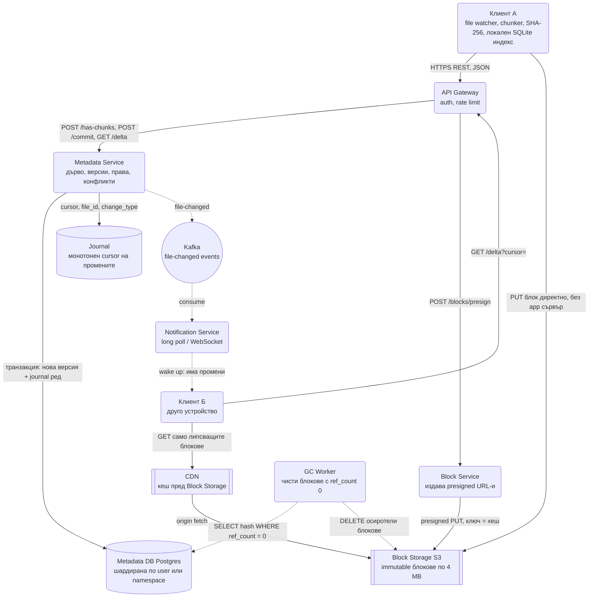
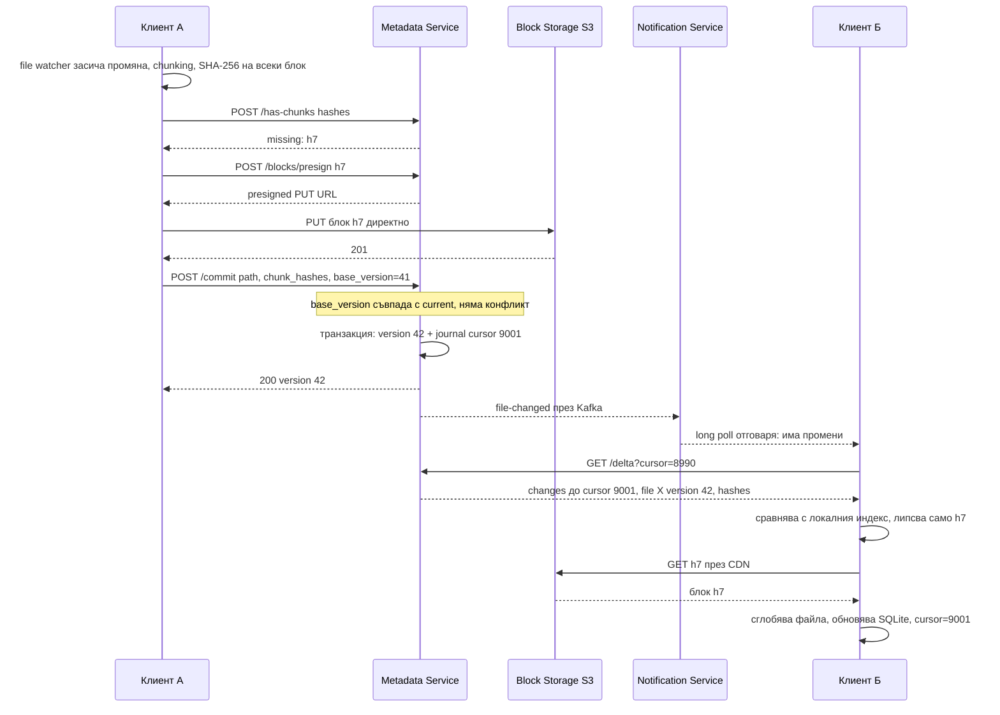
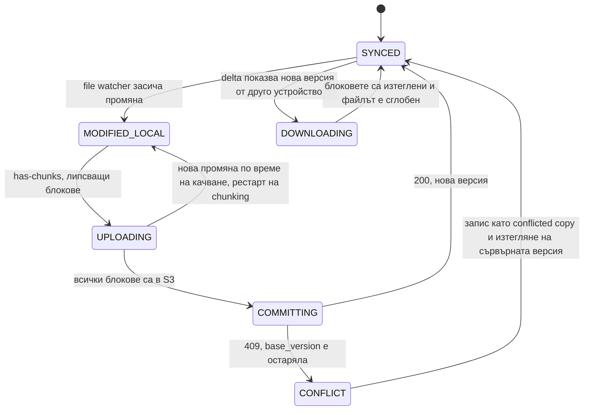

# Файлова синхронизация (Dropbox, Google Drive) - System Design

Ключовото прозрение, около което се върти целият дизайн: **никога не изпращай данни, които вече
съществуват някъде.** Файл от 4 GB, в който е сменена една дума, трябва да струва един блок трафик,
не 4 GB. Всичко останало следва от това.

## Архитектурна диаграма



**Как да четеш диаграмата:** Плътните стрелки са пътят на качване: клиент А пита Metadata Service
кои блокове липсват, качва само тях директно в S3 с presigned URL и накрая прави commit, който
записва новата версия и ред в журнала в една транзакция. Пунктираните стрелки са пътят на
разпространението: събитието минава през Kafka към Notification Service, който събужда другите
устройства, а те теглят дельтата по cursor и блоковете през CDN. Блоковете никога не минават през
приложните сървъри, а GC worker-ът е фонов процес, който маха блокове, към които никоя версия вече не
сочи.

## Разделянето, което носи точки: метаданни срещу блокове

Първото, което трябва да кажеш, е че това са **две напълно различни системи**:

| | Metadata Service | Block Storage |
| --- | --- | --- |
| Какво пази | Дърво на папките, версии, права, списък хешове на блокове | Самите байтове |
| База | Релационна (PostgreSQL), защото има връзки и транзакции | Обектно хранилище (S3), immutable |
| Обем | Малък (килобайти на файл) | Огромен (петабайти) |
| Заявки | Много, малки, чести | Малко, големи |
| Консистентност | Строга | Няма нужда, блокът е неизменяем |

Смесването им в едно хранилище е най-честата грешка в отговорите.

## Системен дизайн накратко

Две напълно различни системи под един продукт: метаданни (малки, много заявки, строга консистентност, Postgres) и блокове (петабайти, малко заявки, immutable, S3). 5 сървиса плюс клиент, който е пълноправен участник с локален SQLite индекс.

### Сървиси

| # | Сървис | Какво прави | Как комуникира |
| --- | --- | --- | --- |
| 1 | **Клиент** | File watcher, chunking (content-defined, около 4 MB), SHA-256, локален индекс, опашка от операции, конфликти по `base_version` | REST към API; PUT директно в S3; long poll / WebSocket към Notification |
| 2 | **API Gateway** | Auth, rate limit | HTTPS REST |
| 3 | **Metadata Service** | Дърво, версии, права, `has-chunks`, `commit` (нова версия + journal ред в една транзакция), `delta` по cursor, конфликти (409) | SQL към Postgres; Kafka `file-changed` |
| 4 | **Block Service** | Издава presigned URL-и за блокове по хеш | REST; S3 |
| 5 | **Notification Service** (около 500 инстанции) | Събужда другите устройства: "има промени" | Kafka consumer; long poll / WebSocket към клиентите |
| 6 | **GC Worker** | Трие блокове с `ref_count = 0` с отлагане от дни | Чете Postgres; DELETE в S3 |

### Хранилища

| Компонент | Роля |
| --- | --- |
| Postgres (шард по `namespace_id`) | `files`, `versions`, `chunks` с `ref_count`, `journal` с монотонен cursor |
| S3 | Immutable блокове, ключ = хеш; `ref_count` решава кога се трие |
| Kafka | `file-changed` към Notification |
| CDN | Кеш пред S3 за теглене на блокове |

### Комуникация, backpressure и патерни

- **Синхронно:** REST за метаданни (35k QPS); блоковете минават директно клиент ↔ S3, никога през приложните сървъри.
- **Асинхронно:** commit → Kafka → Notification → wake up → клиентът дърпа дельтата по cursor. Push само за "има нещо", данните са pull.
- **Backpressure:** клиентски лимит на пропускливостта и приоритизация (малки файлове първи); long poll вместо polling от 100 млн. устройства; GC е отложен и фонов.
- **Патерни:** metadata/data разделение, content-addressed storage и дедупликация, content-defined chunking (rolling hash), presigned URL, cursor-based delta (не timestamp), optimistic locking по `base_version` и conflicted copy вместо сливане, namespace като shard key за споделени папки, reference counting + отложен GC, LAN sync.

## Описание на архитектурата стъпка по стъпка

### 1. Chunking (разбиване на блокове)

Файлът се реже на блокове (Dropbox използва 4 MB) и **всеки блок се хешира** със SHA-256. Хешът е и
името на блока в хранилището.

- **Фиксирани блокове:** просто, но вмъкването на един байт в началото на файла измества всичко и
  прави всички блокове различни.
- **Content-defined chunking (Rabin fingerprinting):** границите се определят от съдържанието, а не
  от позицията, така че вмъкването променя само един блок. По-сложно, но е причината синхронизацията
  на голям документ да е моментална.

#### Как работи content-defined chunking отвътре

Интервюиращият може да попита "как точно съдържанието определя границата". Механизмът:

- Върху файла се плъзга **прозорец** от ~48 байта и за всяка позиция се смята **rolling hash**
  (Rabin fingerprint или Gear hash), който се обновява за O(1) при преместване с един байт, вместо
  да се хешира целият прозорец наново.
- Позицията е **граница на блок**, когато `hash mod N == 0`, където `N` задава средния размер:
  при `N = 4 MB` статистически на всеки ~4 MB има граница. Понеже решението зависи само от локалните
  байтове в прозореца, вмъкване в началото на файла не мести границите след себе си: първите блокове
  се сменят, а всички останали се "засичат" отново на същите места.
- **Минимален и максимален размер** се налагат принудително (напр. 1 MB и 8 MB). Без минимум
  повторяем шаблон в данните създава хиляди микроскопични блокове; без максимум дълга поредица от
  еднакви байтове (нули в диск образ) никога не удря граница.
- **Защо 4 MB за Dropbox, а не 64 KB?** Компромис между дедупликация и overhead. По-малки блокове
  дедупликират по-добре, но всеки блок е ред в метаданните, HTTP заявка и обект в S3. При 4 MB
  списъкът хешове за файл от 1 GB е 250 записа; при 64 KB е 16 000. За хранилище на source code
  (git-подобно) малки блокове са оправдани; за снимки, видео и офис документи 1-4 MB е достатъчно.

### 2. Дедупликация

Преди да качи каквото и да е, клиентът праща **само списъка хешове** и пита кои липсват на сървъра.

- **На ниво потребител:** повторно качване на същия файл не праща нищо.
- **На ниво цялата система:** ако някой вече е качил същия PDF, блоковете съществуват и новият
  потребител получава само указател към тях. Спестява огромно количество съхранение, но има
  **security нюанс**, който интервюиращият може да подхване: по времето за отговор потребителят може
  да установи дали даден файл вече съществува в системата. Затова глобалната дедупликация често се
  ограничава в рамките на един акаунт или организация.

#### Дельта компресия: chunk дедупликация срещу rsync

Две различни техники решават "прати само промененото" и е добре да ги разграничиш:

| | Chunk дедупликация (Dropbox) | Rolling checksum дельта (rsync, rdiff) |
| --- | --- | --- |
| Единица | Блок с фиксиран или content-defined размер | Произволен байтов диапазон |
| Какво се праща | Липсващите блокове цели | Инструкции "копирай байтове 100-500 от старата версия, вмъкни тези 12 байта" |
| Ефективност при малка промяна | Един блок от 1-4 MB | Само променените байтове плюс инструкции |
| Изисква ли старата версия на сървъра | Не, работи с глобален индекс на хешове | Да, дельтата е спрямо конкретна базова версия |
| Дедупликация между потребители | Да | Не |
| Сложност | Ниска, блоковете са независими обекти | Висока, сървърът трябва да пази и прилага дельти или да ги "сплесква" |

Dropbox исторически комбинира двете: блокове за съхранение и дедупликация, а вътре в променен блок
rsync-подобна дельта, за да не праща целите 4 MB при промяна на един параграф. За интервю е
достатъчно да кажеш, че блоковата дедупликация е базата, а байтовата дельта е оптимизация отгоре.

### 3. Комит на метаданните

Чак когато всички блокове са в хранилището, Metadata Service записва **нова версия** на файла:
`file_id → [hash1, hash2, ...]`, номер на версия и cursor за журнала на промените.

- Записът е транзакционен. Ако падне по средата, файлът остава на старата версия, а качените
  блокове са безобидни сираци, които garbage collector-ът чисти после.
- **Версиите са безплатни.** Нова версия е нов списък от указатели; общите блокове не се дублират.
  Затова "история на файла за 30 дни назад" е евтина функция.
- **Преместване и преименуване са само метаданни.** Влачене на папка с 50 GB на друго място е един
  `UPDATE` на `path` (или на `parent_id`) плюс ред в журнала. Никакъв блок не се пипа, никакъв байт
  не пътува. Ако клиентът не разпознае преместването и го третира като "изтрий + създай", ще качи
  50 GB, които сървърът вече има; затова file watcher-ът следи inode/файлов ID, а не само пътя, и
  клиентът праща `move`, а не `delete` + `create`.

Пълният път на една промяна от устройство А до устройство Б:



### 4. Синхронизация към другите устройства

- Клиентът държи **long poll или WebSocket** връзка към Notification Service. Polling на всеки N
  секунди от 500 млн. устройства е трафик, който няма нужда да съществува.
- При събитие клиентът пита `GET /delta?cursor=<последно видяно>` и получава списък с промените.
  **Курсорът, а не времевата марка**, е механизмът: часовниците на устройствата не са синхронни и
  устройство, което е било офлайн седмица, трябва да получи точно пропуснатото.
- Клиентът тегли само блоковете, които няма локално.

#### LAN sync и контрол на трафика

- **LAN sync:** ако две устройства на един потребител са в една локална мрежа (лаптоп и десктоп в
  офиса), клиентът открива съседа през multicast/UDP broadcast и тегли блоковете директно от него по
  хеш, вместо от S3. Сървърът остава източник на истината за **метаданните** (кои блокове трябват),
  а байтовете идват отблизо. Пести и трафик на потребителя, и egress на доставчика.
- **Ограничаване на пропускливостта:** клиентът има настройка за максимална скорост на качване и
  автоматичен режим, който отстъпва, когато потребителят използва мрежата за друго. Без това
  синхронизация на 20 GB заглушава видео разговора и хората изключват приложението.
- **Приоритизация:** малки файлове и текущо редактираният документ се качват първи; големите архиви
  чакат. Един 10 GB файл не бива да блокира 200 малки промени след него.

### 5. Конфликти

Два офлайн клиента редактират един файл. При връщането им онлайн:

- **Откриване:** клиентът праща базовата версия, върху която е работил. Ако сървърът вече е на
  по-нова, има конфликт (същият механизъм като optimistic locking).
- **Разрешаване:** Dropbox не се опитва да слива. Създава `document (conflicted copy from Ivan).docx`
  и оставя човека да реши. За произволни бинарни файлове автоматичното сливане е невъзможно, а
  тихата загуба на данни е много по-лоша от втори файл в папката.
- Google Docs решава друг проблем (едновременно редактиране на **един** документ) и затова използва
  съвсем друга технология: Operational Transformation или CRDT върху поток от операции, не
  синхронизация на файлове.

Състоянията, през които минава един файл в локалния клиент:



### 6. Шифроване и защо глобалната дедупликация му противоречи

- **Шифроване при пренос и при съхранение (at rest)** е стандарт: TLS по пътя, AES-256 в S3 с
  ключове, управлявани от доставчика (Dropbox работи така). Доставчикът може да чете блоковете, което
  е и причината дедупликацията да работи.
- **Клиентско (end-to-end) шифроване** прави дедупликацията невъзможна: същият файл, шифрован с
  различни потребителски ключове, дава напълно различни блокове. Всеки потребител плаща пълния обем и
  сървърът не може да "види", че двама са качили същия PDF.
- **Convergent encryption** е компромисът: ключът за блока се извежда от хеша на самия блок
  (`key = H(plaintext)`), така че еднакво съдържание дава еднакъв шифротекст при всеки потребител и
  дедупликацията работи, а доставчикът няма ключ, докато не притежава оригинала. Цената е
  **side-channel атака "потвърждение на файл"**: нападател, който има кандидат-файл (изтекъл документ,
  конкретна версия на филм), може да го шифрова по същата схема и да провери дали блоковете вече
  съществуват. За интервю: "дедупликация, поверителност и ниска цена са три неща, от които можеш да
  имаш две."

## Оразмеряване (Back-of-the-envelope)

Допускане: **500 млн. потребители**, 100 млн. дневно активни, средно 100 файла по 1 MB на човек.

| Метрика | Изчисление | Резултат |
| --- | --- | --- |
| Съхранение (без дедупликация) | 500M × 100 MB | 50 PB |
| След дедупликация (~30% спестени) | 50 PB × 0.7 | ≈ 35 PB |
| Промени на ден | 100M × 10 файла | 1 млрд. |
| Заявки към метаданните | 1G / 86 400 × ~3 | ≈ 35 000 заявки/сек |
| Качен обем | 1G × 1 MB × 0.1 (дедупликация) | ≈ 100 TB/ден ≈ 9.3 Gbps |
| Отворени връзки | 100M устройства онлайн | Отделен слой от long-poll сървъри |
| Редове в `chunks` | 35 PB / 4 MB | ≈ 9 млрд. реда, шардирани по хеш |
| Long-poll сървъри | 100M връзки / ~200k на инстанс | ≈ 500 инстанции |

Изводът: **метаданните са 35k QPS върху малка база, а блоковете са петабайти при малко заявки.**
Точно затова се скалират поотделно.

## Модел на данните

```text
POST /api/v1/has-chunks   { hashes: [...] }            → { missing: [...] }
POST /api/v1/blocks/presign { hash, size }              → { url, expires_at }
PUT  <presigned S3 URL>    <binary>                     → 201 (директно към S3)
POST /api/v1/commit       { path, chunk_hashes, base_version } → 200 { version } | 409 конфликт
POST /api/v1/move         { file_id, new_path, base_version }  → 200 (само метаданни)
GET  /api/v1/delta?cursor= → { changes: [...], next_cursor }
```

| Таблица | Ключови колони |
| --- | --- |
| `files` | `file_id`, `namespace_id`, `owner_id`, `path`, `current_version` |
| `versions` | `file_id`, `version`, `chunk_hashes[]`, `size`, `created_at` |
| `chunks` | `hash` (PK), `size`, `ref_count`, `storage_url` |
| `journal` | `cursor` (монотонен, на namespace), `namespace_id`, `file_id`, `change_type` |

`ref_count` върху блоковете е това, което позволява безопасно триене: блок се маха от S3 чак когато
никоя версия на никой файл не го сочи. Броячът се променя в същата транзакция като commit-а на
версията; GC worker-ът чисти `ref_count = 0` с отлагане от няколко дни, за да покрие "възстанови
изтрит файл" и качване, което е записало блока, но още не е направило commit.

### Шардиране на метаданните и споделените папки

Метаданните се шардират, защото 35k QPS и милиарди редове не се побират в една Postgres инстанция.
Естественият ключ е `user_id`: всички файлове на потребителя са на един шард и "покажи ми папката" е
single-shard заявка.

Проблемът са **споделените папки**. Папка, споделена между 50 души, принадлежи на 50 потребители,
които са на 50 различни шарда. Ако се копира при всеки, всяка промяна е 50 записа и 50 журнала; ако
живее само при собственика, всеки друг чете cross-shard.

Решението на Dropbox е **namespace**: споделената папка е отделно пространство от имена със свой
`namespace_id`, и **това**, а не `user_id`, е shard key-ят. Всеки потребител има личен namespace
плюс списък с "монтирани" споделени namespace-и. Журналът е на namespace, така че клиентът държи по
един cursor за всеки монтиран namespace и `GET /delta` е няколко single-shard заявки вместо една
cross-shard. Промяна в споделената папка е един запис в един журнал, а 50-те устройства я откриват
чрез собствения си cursor към същия namespace.

## Ключови въпроси за интервюто

### Защо блоковете не минават през вашите сървъри?

Минават директно към S3 с presigned URL, по същата причина както при видео платформата: 10 Gbps
файлов трафик през Node.js процеси е чист разход без добавена стойност. Приложните сървъри пипат
само метаданните.

### Как работи офлайн режимът?

Клиентът има локална SQLite база с огледало на метаданните и опашка от чакащи операции. При връщане
онлайн изпълнява опашката, засича конфликтите по базова версия и дърпа дельтата по курсора. Тоест
клиентът е пълноправна част от системата, не тънък изглед.

### Как се пести трафик при малка промяна в голям файл?

Content-defined chunking плюс дедупликация: сменя се един блок, качва се един блок. Ако chunking-ът
беше по фиксирани позиции, вмъкване в началото щеше да измести всичко и цената щеше да е целият файл.

### Как се споделя папка с 50 души?

Метаданните носят ACL на ниво папка, наследяван надолу. Споделената папка е отделен namespace със свой
журнал, така че всяко от 50-те устройства я следи по собствен cursor към същия namespace. Блоковете не
се копират, всички сочат същите хешове.

### Кое е тясното място?

Metadata Service-ът, не хранилището. S3 скалира сам, а релационната база с 35k QPS и голямо дърво на
папките е това, което ще се шардира (по `namespace_id`) и ще получи read replicas за списъчните заявки.

### Какво става, ако клиентът падне между качването на блоковете и commit-а?

Нищо лошо, и това е следствие от подредбата на стъпките. Блоковете са immutable обекти с `ref_count`
0, които никой не сочи; клиентът при рестарт пуска отново `has-chunks`, сървърът отговаря, че вече ги
има, и се прави само commit-ът. GC worker-ът чисти сираците чак след дни, така че прекъснато качване
не е загубена работа. Обратната подредба (първо commit, после блокове) би създала версия, която сочи
към несъществуващи данни.

### Как бихте направили "възстанови изтрит файл" и "версия от преди 30 дни"?

Изтриването е нова версия с флаг `deleted` и ред в журнала, не физическо триене; блоковете остават
докато `ref_count` не падне до 0 и не мине retention периодът. Възстановяването е нова версия, която
сочи към старите хешове, тоест пак е само метаданни. Цената на 30-дневната история е само редовете
във `versions` и задържаните уникални блокове, което е малка част от общия обем, защото повечето
версии споделят почти всичките си блокове.

### Как клиентът разбира, че файлът е преместен, а не изтрит и създаден наново?

File watcher-ът следи стабилен идентификатор (inode на Linux/macOS, file ID на NTFS), а не само пътя.
При събитие "изчезна от A, появи се в B с същия идентификатор" клиентът праща `move`. Ако все пак
пропусне и го третира като нов файл, `has-chunks` ще върне "нищо не липсва" и трафик няма да има, но
историята на версиите ще се прекъсне и споделените линкове към стария път ще се счупят. Затова
операцията е отделна в API-то.
