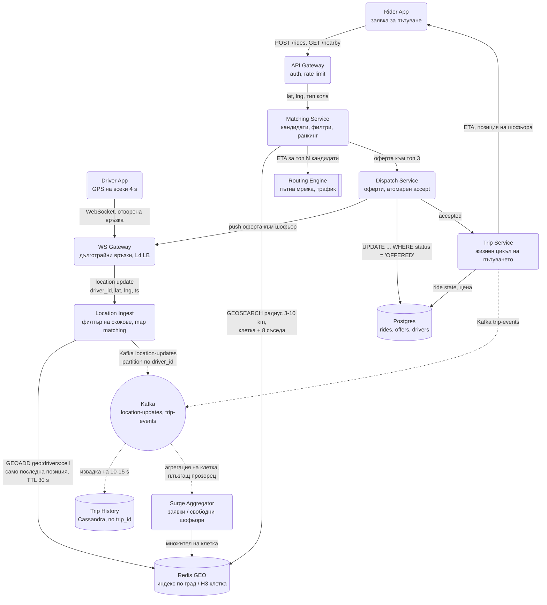
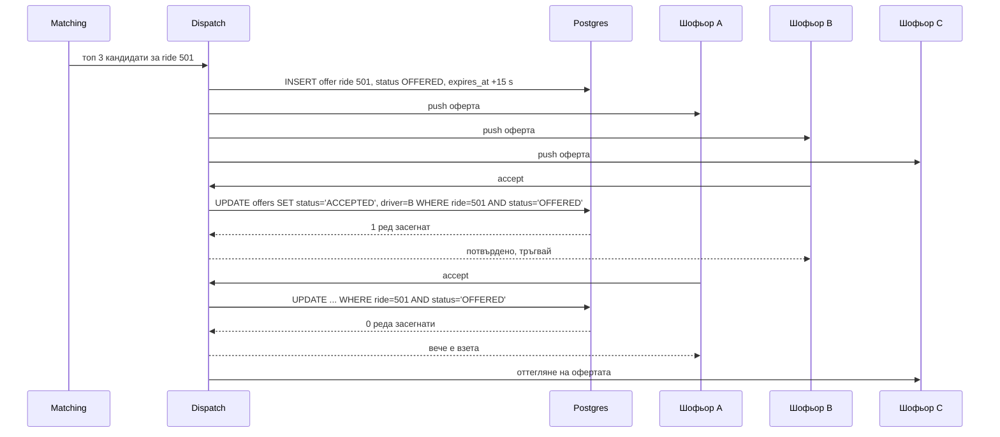
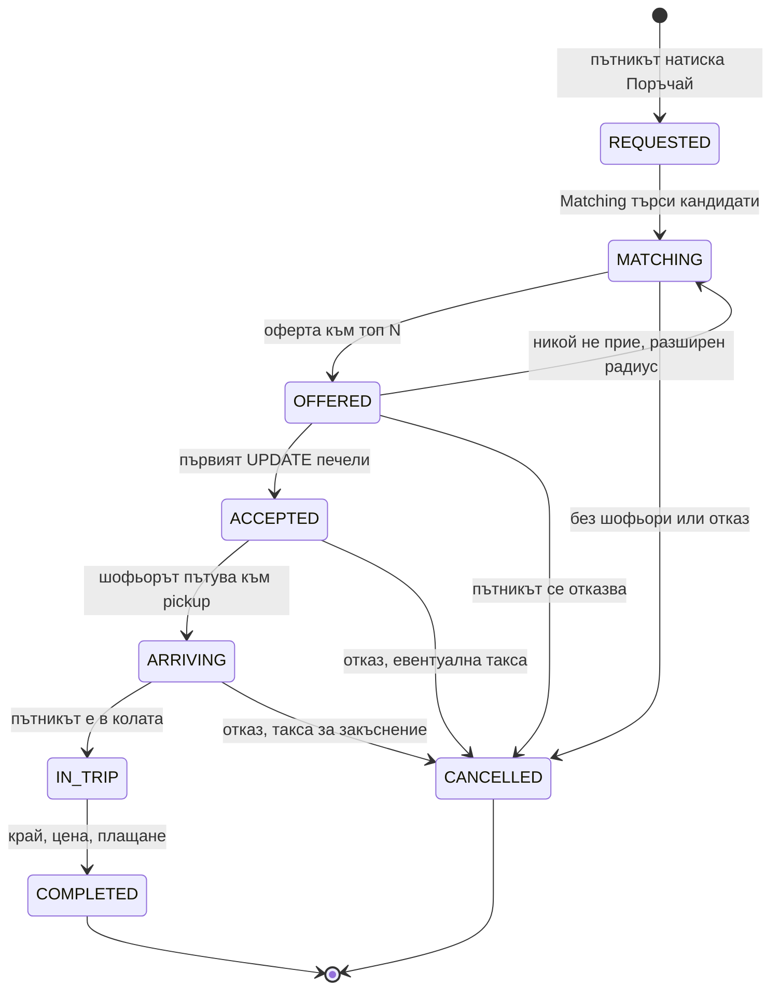

# Geo-Proximity Service (Uber, Lyft, Yelp) - System Design

Две различни задачи с общ индекс: **намери близките обекти** и **следи милиони движещи се точки**.
Yelp има само първата (ресторантите не мърдат). Uber има и двете, и втората е тази, която чупи
наивните решения.

## Архитектурна диаграма

**Как да четеш диаграмата:** Левият поток е write path-ът: шофьорът праща координати по вече отворен
WebSocket, Ingest ги филтрира и ги записва в горещия Redis GEO индекс (само последна позиция), а
копие тръгва асинхронно през Kafka към историята и към surge агрегатора. Десният поток е read
path-ът: пътникът иска кола, Matching пита същия Redis индекс за кандидати, взима реална ETA само за
топ N през routing engine-а и подава оферта на Dispatch, който гарантира, че точно един шофьор я
приема. Чак тогава Trip Service създава пътуването в Postgres, който е системата на истината за
пари и състояние, но никога не участва в горещия път на локациите.

## Защо `WHERE lat BETWEEN ... AND lng BETWEEN ...` не работи

Първият инстинкт е SQL заявка с правоъгълник около потребителя. Проблемите:

- **Двумерен индекс не съществува в обикновен B-tree.** Базата ползва индекса по `lat`, връща
  милиони реда, и филтрира `lng` в паметта. При 5 млн. шофьора това е пълно сканиране.
- Правоъгълникът не е кръг, а разстоянието по градуса дължина зависи от географската ширина.
- Не решава как да разширяваш радиуса, ако наблизо няма никого.

Затова двумерното пространство се **свежда до едно измерение**, което вече може да се индексира.

## Трите начина да индексираш пространство

| Подход | Как работи | Кога |
| --- | --- | --- |
| **Geohash** | Рекурсивно делене на света на квадранти; всеки квадрант е символ в низ. `dr5ru` е квадрат ~5 km, `dr5ru7` е ~1 km. Общ префикс = географска близост. | Стандартът. Работи с всяка база, която индексира низове, включително Redis, Postgres и Cassandra. Redis GEO вътрешно е точно geohash в sorted set. |
| **QuadTree** | Дърво в паметта, което дели квадрант само когато обектите в него надхвърлят праг. | Адаптира се към плътността: Манхатън се дели дълбоко, океанът остава един лист. Изисква собствена структура в паметта и преизграждане. |
| **S2 / H3 (Google, Uber)** | Клетки върху сфера (S2) или шестоъгълници (H3). H3 решава, че квадратите нямат равно разстояние до съседите си. | Това, което Uber реално използва. Шестоъгълниците имат 6 равноотдалечени съседа, което прави изчисленията на съседство коректни. |

**Ключовият проблем при geohash:** два съседни обекта могат да са от двете страни на границата на
квадрант и да нямат общ префикс. Затова търсенето винаги пита **текущата клетка плюс 8-те ѝ
съседа**, не само собствената. При H3 същото правило е "клетката плюс пръстен от 6 съседа" (`kRing`).

### H3 резолюции (приблизително)

| Резолюция | Средна площ на клетка | Ръб | Типична употреба |
| --- | --- | --- | --- |
| 6 | ~36 km² | ~3.2 km | Регионални агрегации, surge на ниво квартал в провинция |
| 7 | ~5 km² | ~1.2 km | Шард на индекса, surge pricing в град |
| 8 | ~0.7 km² | ~460 m | Търсене на шофьори в градски център |
| 9 | ~0.1 km² | ~175 m | Pickup точки, плътни зони (летище, стадион) |

Стойностите са средни за глобуса и варират с около ±30% по клетки, което е достатъчно за
оразмеряване. Ключовият избор: индексът се пази на една резолюция (напр. 8), а агрегациите се правят
на по-груба (7 или 6) чрез `h3ToParent`, което е чиста аритметика, без нова заявка.

## Системен дизайн накратко

Две задачи с общ индекс: 1.25 млн. локации в секунда (write path в паметта) и 17k търсения в секунда (read path с ETA само за топ N). 7 сървиса; Postgres е истината за пари и състояние, но никога не е в горещия път на локациите.

### Сървиси

| # | Сървис | Какво прави | Как комуникира |
| --- | --- | --- | --- |
| 1 | **WS Gateway** | Дълготрайни връзки с шофьори и пътници, push на оферти и ETA | WebSocket през L4 LB |
| 2 | **Location Ingest** | Филтрира GPS скокове, map matching, записва само последната позиция | `GEOADD` в Redis (ZREM + GEOADD при смяна на клетка, в Lua); Kafka `location-updates` по `driver_id` |
| 3 | **Surge Aggregator** | Заявки / свободни шофьори на клетка в плъзгащ прозорец, пише множител | Kafka consumer; пише в Redis по клетка |
| 4 | **API Gateway** | Auth, rate limit за пътниците | REST `POST /rides`, `GET /nearby` |
| 5 | **Matching Service** | `GEOSEARCH` клетка + 8 съседа с разширяващ се радиус, евтини филтри, ETA само за топ N | Sync към Redis GEO и Routing Engine |
| 6 | **Dispatch Service** | Оферта към топ 3 шофьора, атомарен accept с условен `UPDATE ... WHERE status = 'OFFERED'` | Push през WS Gateway; Postgres |
| 7 | **Trip Service** | Жизнен цикъл на пътуването (state machine), цена | Postgres с условни UPDATE по състояние; Kafka `trip-events` |

### Хранилища

| Компонент | Роля |
| --- | --- |
| Redis GEO | Горещ индекс по град / H3 клетка, само последна позиция, TTL около 30 s, шард по регион |
| Kafka | `location-updates` (извадка към историята и surge), `trip-events` |
| Cassandra | Trip history по `trip_id`, рядка извадка на 10-15 s |
| Postgres | rides, offers, drivers; system of record |
| Routing Engine (външен) | Реална ETA по пътна мрежа; най-скъпият компонент при четене |

### Комуникация, backpressure и патерни

- **Синхронно:** локациите по вече отворен WebSocket (не HTTP на 4 s); REST за заявка за пътуване; Matching → Redis → Routing в бюджета на заявката.
- **Асинхронно:** историята и surge през Kafka; всеки преход на пътуването е събитие.
- **Backpressure:** записът е обновяване на място в паметта, не нов ред; историята е извадка, не всеки ъпдейт; ETA се смята за топ 5, не за всички кандидати; офертата е паралелна към 3 с изтичане 15 s, за да не чака минута последователно.
- **Патерни:** свеждане на 2D до 1D индекс (geohash / H3), клетка + съседи заради границите, производен и възстановим индекс (пълни се сам за 10 s), условен UPDATE вместо лок за dispatch, state machine с условни преходи, шардиране по географска клетка, scatter-gather само по границите на шардове.

## Описание на архитектурата стъпка по стъпка

### 1. Приемане на локации (write path)

Това е най-натовареният път в системата, но и най-евтиният за обслужване:

- Шофьорът праща координати на всеки 4 секунди по **вече отворена WebSocket връзка**. HTTP заявка с
  ново TCP и TLS ръкостискане на всеки 4 секунди би била няколко пъти по-скъпа от самите данни.
- Пази се **само последната позиция**, не история, в Redis GEO ключ на град или клетка. Записът е
  `GEOADD`, тоест обновяване на място, не нов ред.
- Ключът има TTL: шофьор, който не се е обадил 30 секунди, изчезва от индекса сам. Redis GEO е
  sorted set и няма TTL на член, затова TTL-ът се реализира или с отделен `driver:<id>:seen` ключ и
  периодично чистене, или с score, който включва времето, или с малки ключове на клетка, които
  изтичат цели. За интервю е достатъчно да кажеш, че "изчезването" е автоматично и не изисква
  отделен процес, който да търси изгубени шофьори.
- **Смяна на клетка:** когато шофьорът премине от клетка A в клетка B, Ingest прави `ZREM` от A и
  `GEOADD` в B. Двете операции са в един Lua скрипт или pipeline, за да няма момент, в който
  шофьорът е в две клетки или в никоя.
- Историята на пътуването е **отделен** асинхронен поток през Kafka към Cassandra. Тя трябва за
  отчети и ценообразуване, но няма място в горещия индекс.

### 2. Търсене (read path)

- `GEOSEARCH` в радиус около пътника връща кандидатите, подредени по разстояние.
- Ако наблизо няма никого, радиусът се разширява на стъпки (3 km → 5 km → 10 km), вместо да се
  започне с голям радиус, който връща хиляди кандидати.
- **Разстоянието по права линия не е ETA.** Шофьор от другата страна на реката е на 500 метра и на
  15 минути. Финалното подреждане минава през пътната мрежа (собствен routing engine или доставчик
  на карти) само за топ N кандидати, защото е скъпо (десетки милисекунди на заявка).
- Филтрите преди ETA са евтини и се правят първи: свободен ли е, тип кола, рейтинг, посока на
  движение (шофьор, който се отдалечава по магистрала, е лош кандидат дори да е близо).

### 3. Разпределяне (dispatch)

- Офертата отива до няколко шофьора едновременно или последователно (първо най-добрият, след 10 s
  следващият).
- **Точно един** трябва да я приеме. Това е същият проблем като двойната резервация в
  Ticketmaster: атомарен условен `UPDATE` (`WHERE status = 'OFFERED'`) или Redis лок, а не проверка
  и после запис.

Условният `UPDATE` е гаранцията за коректност. Броят засегнати редове е отговорът: 1 означава
"ти печелиш", 0 означава "някой те изпревари". Няма нужда от `SELECT` преди това, нито от
разпределен лок. Изтекла оферта (`expires_at < NOW()`) се третира като отказ и Dispatch подава на
следващия кандидат.

### 4. Жизнен цикъл на пътуването

Всеки преход е събитие в Kafka (`trip-events`), от което се хранят ценообразуването, известията към
двете страни и отчетите. Самото състояние живее в Postgres и преходът е условен `UPDATE ... WHERE
status = <очаквано>`, за да не могат две събития (шофьорът натиска "пристигнах" и пътникът натиска
"отказ" в същата секунда) да доведат до невалидно състояние.

## Yelp вариантът: статични обекти

Ако системата е Yelp, а не Uber, задачата се променя изцяло, макар индексът да е "същият":

- Обектите **не се движат**. Записите са редки (нов ресторант, смяна на адрес), четенията са
  много. Това е класически read-heavy профил, при който PostGIS (GiST индекс върху `geography`) или
  Elasticsearch с `geo_point` са правилният избор: богати филтри (кухня, цена, отворено сега),
  сортиране по рейтинг, пълнотекстово търсене, всичко в една заявка.
- Резултатите се **кешират по клетка**: "ресторанти в geohash `dr5ru`" е един и същ отговор за
  всички потребители в тази клетка за минути напред. Redis или CDN кеш с ключ по клетка + филтри.
- Ранкингът не е по разстояние, а по комбинация: разстояние, рейтинг, брой ревюта, отворено ли е.
  Това е скъпо в реално време при хиляди кандидати, затова кандидатите се ограничават географски
  първо (индексът) и се ранкират след това (приложението).
- Няма dispatch, няма TTL, няма 1.25 млн. записа в секунда. Ако кандидат предложи Redis GEO с TTL
  за Yelp, показва, че не е разбрал разликата между двете задачи.

## Оразмеряване (Back-of-the-envelope)

Допускане: **5 млн. активни шофьора**, ъпдейт на локация на 4 секунди, 1 млн. търсения на минута в пик.

| Метрика | Изчисление | Резултат |
| --- | --- | --- |
| Ъпдейти на локация | 5M / 4 s | ≈ 1.25 млн. записа/сек |
| Обем на данните | 1.25M × ~40 B | ≈ 50 MB/s входящ трафик |
| Памет за индекса | 5M × ~100 B | ≈ 500 MB (тривиално, шардирано по град) |
| Търсения | 1M / 60 s | ≈ 17 000 заявки/сек |
| ETA заявки | 17k × топ 5 кандидати | ≈ 85 000 routing заявки/сек, най-скъпият компонент |
| История на пътувания | 1.25M/s × 40 B × 86 400 | ≈ 4.3 TB/ден, ако се пише всичко |
| История (извадка на 15 s, само в пътуване) | ~4.3 TB / 4 / 3 | ≈ 350 GB/ден |
| Едновременни WS връзки | 5M шофьори + активни пътници | ≈ 6-7 млн., отделен stateless WS слой |

Трите извода за интервюто:

1. **1.25 млн. записа/сек не отиват в релационна база.** Затова индексът е в паметта, а записът е
   обновяване на място, не нов ред.
2. **Пълната история е 4 TB на ден.** Реално се записва рядка извадка (на 10-15 секунди) или само
   траекторията при активно пътуване.
3. **Routing engine-ът, не Redis, е скъпият компонент при четене.** Затова ETA се смята само за
   топ N след евтините филтри, а не за всички кандидати в радиуса.

## Шардиране

По **географски регион**, не по `driver_id`:

- Заявката "кой е близо до мен" винаги е локална, така че локалният шард има всичко необходимо и
  няма scatter-gather между възли.
- Проблемът е неравномерността: Манхатън в петък вечер срещу селски район. Затова шардовете се
  делят по плътност (QuadTree/H3 логика), а не по равни правоъгълници на картата.
- Големите събития (концерт, стадион) създават временен hot shard. Решение: динамично разделяне на
  клетката и репликиране на четенето.

### Границите на градове и шардове

Пътник на границата между два шарда (например град и предградие, или две H3 клетки на резолюция 7
в различни Redis инстанси) трябва да види шофьори от двете страни:

- Търсенето винаги пита клетката + съседите. Ако съседна клетка е на друг шард, Matching праща
  паралелни заявки към двата шарда и слива резултатите (малък scatter-gather, но само по границите,
  тоест за малък процент от заявките).
- Шардирането е по **клетка на груба резолюция** (7), а не по административна граница на град, така
  че "границата" е предвидима и еднаква навсякъде.
- Шофьор, който пресича граница на шард, се премества от единия Redis в другия със същия
  `ZREM` + `GEOADD` механизъм като при смяна на клетка.

## Поверителност и съхранение на локации

Историята на локациите е чувствителни лични данни и това се пита все по-често:

- **Retention:** сурови GPS точки се пазят кратко (дни до седмици), агрегатите за отчети и surge
  дълго. Траекторията на завършено пътуване се пази толкова, колкото изискват спорове и
  счетоводство, после се обобщава (начало, край, разстояние).
- **Разделяне на идентичността:** в Kafka и Cassandra локацията върви с `driver_id`, но за
  аналитични цели се псевдонимизира или се агрегира по клетка, преди да стигне до data warehouse.
- **Достъп:** четенето на конкретна траектория е одитирано действие (support случай, спор), не
  обикновена заявка.
- **Шофьор офлайн = невидим:** щом излезе от смяна, позицията му изтича от индекса и не се записва.

## Ключови въпроси за интервюто

### Защо Redis, а не PostGIS?

PostGIS е отличен за **статични** обекти с богати заявки (ресторанти в полигон, с филтри и
сортиране). При 1.25 млн. обновявания в секунда обаче всеки ъпдейт е дисков запис плюс поддръжка на
GiST индекс. Redis държи всичко в паметта и обновяването е O(log N) без диск. Ако системата е Yelp,
а не Uber, PostGIS е правилният избор.

### Какво става, ако Redis падне?

Индексът е **производна, възстановима** структура, не източник на истината. Шофьорите се обаждат на
всеки 4 секунди, така че нов празен инстанс се напълва напълно за под 10 секунди. Точно затова е
приемливо да се държи в паметта без durability. Единствената грижа е стартовият пик: празният
индекс за 10 секунди означава "няма шофьори" за пътниците в този шард, така че Matching трябва да
разпознае "индексът се пълни" и да върне "опитайте след малко", а не "няма коли".

### Как се справяте с неточни GPS данни?

Филтриране на скокове (позиция, която предполага 300 km/h), map matching към най-близкия път и
изглаждане (Kalman филтър). Без това иконката на колата подскача по картата, а ETA-та става безсмислена.

### Колко голяма да е geohash клетката?

Компромис: голяма клетка → малко заявки, но много кандидати за филтриране. Малка клетка → малко
кандидати, но повече клетки за обхождане. На практика се избира прецизност, при която средната
клетка съдържа десетки, не хиляди обекти, и тя е различна за градски център и за провинция. Точно
това адаптиране е причината Uber да мине на H3 вместо фиксиран geohash.

### Как работи surge pricing върху същите данни?

Съотношението заявки към свободни шофьори се смята **на клетка** през плъзгащ се прозорец. Понеже
индексът вече е клетъчен, това е агрегация върху същата структура, а не отделна система. Множителят
се пише обратно в Redis по клетка и Matching го чете при ценообразуване. Изглажда се във времето и в
пространството (съседните клетки не могат да се различават 3x), за да не "мига" цената.

### Защо офертата отива до няколко шофьора, а не само до най-добрия?

Защото шофьорът е човек с ~15 секунди за реакция. Последователен dispatch (един по един) означава
до минута чакане при три отказа. Паралелната оферта към топ 3 скъсява времето до първо приемане,
а атомарният `UPDATE` решава кой печели. Цената: двама шофьори виждат оферта, която "изчезва".
Продуктът я плаща съзнателно.

### Как се гарантира, че шофьор не приема две пътувания едновременно?

Същият условен `UPDATE`, но върху реда на шофьора: `UPDATE drivers SET current_ride = 501 WHERE id
= B AND current_ride IS NULL`. Двете условни операции (върху офертата и върху шофьора) са в една
транзакция. Ако втората върне 0 реда, транзакцията се отменя и офертата остава `OFFERED` за
следващия.

### Как се тества matching алгоритъмът?

Офлайн върху записана история: replay на реални заявки и позиции през нов алгоритъм и сравнение на
средно време до pickup, процент откази и празни километри. Онлайн чак след това, като A/B по град,
не по потребител, защото ефектът е върху целия пазар (шофьорите са споделен ресурс), а не върху
отделния пътник.
