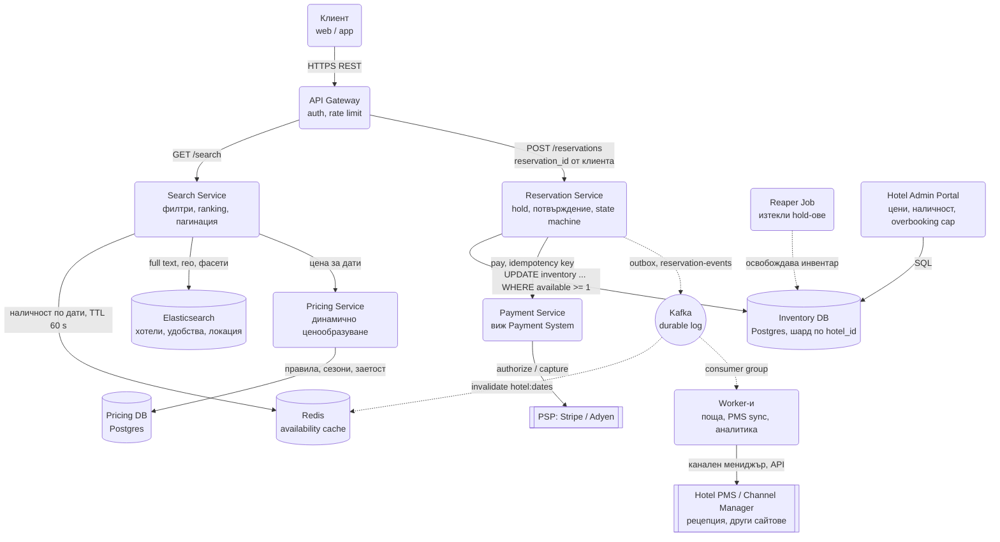
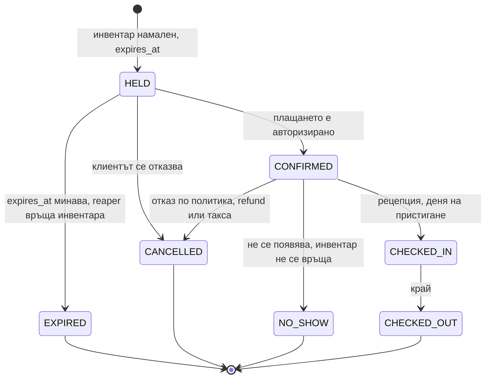
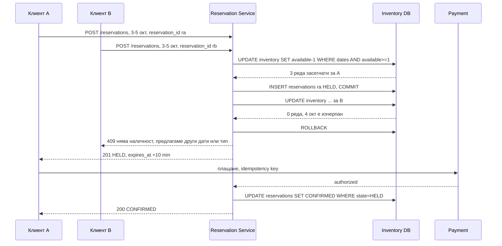

# Резервационна система (Hotel / Airbnb / Booking тип) - System Design

Прилича на [Ticketmaster](Ticketmaster.md), но с една разлика, която сменя целия модел на данните:
билетът е за **едно място в един момент**, а хотелската стая е за **тип стая в диапазон от дати**.
Резервация за три нощи е три реда инвентар, които трябва да се намалят атомарно, и ако само два от
тях минат, системата е продала стая, която не съществува. Плюс нещо, което шокира кандидатите:
хотелите **нарочно** продават повече стаи, отколкото имат.

Централните идеи: **инвентар по (хотел, тип стая, дата), не по физическа стая**; **търсенето е
eventually consistent, резервацията е строго консистентна**; и **hold с изтичане**, за да не
държи никой стая, докато си търси картата.

## Архитектурна диаграма



**Как да четеш диаграмата:** горе вляво е пътят на търсенето, който минава през кеш, Elasticsearch и
Pricing Service и никога не докосва Inventory DB. В средата е пътят на резервацията: Reservation
Service намалява инвентара с условен `UPDATE` в Postgres, взима плащане и публикува събитие през
outbox. Събитието инвалидира кеша на наличността и синхронизира външните системи на хотела. Reaper
Job връща инвентара на изтеклите hold-ове. Двете пътеки са нарочно разделени: търсенето може да
показва стая, която току-що е продадена, резервацията не може да продаде стая, която няма.

## Системен дизайн накратко

Два нарочно разделени пътя: търсене (100 пъти по-често, eventually consistent, кеш + Elasticsearch) и резервация (рядко, строго консистентно, един условен UPDATE в Postgres). 8 сървиса; инвентарът е по `(hotel_id, room_type_id, date)`, не по физическа стая.

### Сървиси

| # | Сървис | Какво прави | Как комуникира |
| --- | --- | --- | --- |
| 1 | **API Gateway** | Auth, rate limit | HTTPS REST от клиента; gRPC към Search и Reservation Service (синхронно) |
| 2 | **Search Service** | Филтри, гео, фасети, ranking, наличност по дати от кеш | gRPC от Gateway; HTTP заявка към Elasticsearch; Redis `MGET avail:<hotel>:<type>:<date>` с TTL 60 s; gRPC към Pricing (синхронно); при cache miss SQL `SELECT` към Inventory DB (read replica) |
| 3 | **Pricing Service** | Динамично ценообразуване по сезон, заетост, ден; преизчислява на партиди | gRPC от Search; SQL към Pricing DB; фонов batch job пише `rates` |
| 4 | **Reservation Service** | Условен `UPDATE inventory ... WHERE available >= 1` за всички нощи, HELD с `expires_at`, идемпотентност по `reservation_id` от клиента, state machine | gRPC от Gateway; една SQL транзакция в Inventory DB (синхронно); gRPC към Payment Service; outbox ред → Kafka `reservation-events` (асинхронно) |
| 5 | **Payment Service** | Authorize при потвърждение, capture по политика | gRPC от Reservation; HTTPS REST към PSP с idempotency key (виж Payment System) |
| 6 | **Worker-и** | Поща, синхронизация с PMS / channel manager, аналитика | Kafka consumer group `reservation-events` (pull); HTTPS към API-тата на хотелските системи и каналите |
| 7 | **Reaper Job** | На всяка минута връща инвентара на изтекли HELD | Cron; Redis `SET NX` lease, за да работи само един инстанс; SQL UPDATE |
| 8 | **Hotel Admin Portal** | Цени, наличност, `overbooking_cap` | HTTPS; SQL към Inventory DB |

### Хранилища

| Компонент | Роля |
| --- | --- |
| Inventory DB (Postgres, шард по `hotel_id`) | `inventory`, `reservations`, `reservation_events` (append-only одит), `rates` |
| Redis | Availability cache, инвалидиран от събитие; lease за reaper-а |
| Elasticsearch | Хотели, удобства, локация, текст |
| Kafka | `reservation-events` през outbox; инвалидира кеша, храни worker-ите |
| PMS / Channel Manager (външни) | Рецепция и други канали за продажба |

### Комуникация, backpressure и патерни

- **Синхронно:** HTTPS REST за търсене и резервация; gRPC между сървисите; резервацията е една SQL транзакция плюс плащане.
- **Асинхронно:** outbox → Kafka → инвалидация на кеша, PMS sync, поща; reaper на минута.
- **Backpressure:** търсенето никога не докосва primary Inventory DB (кеш с TTL поглъща 600 RPS); Pricing се смята на партиди, не при всяко търсене; синхронизацията с каналите е eventually consistent, а overbooking cap поглъща разминаванията.
- **Патерни:** CQRS разделение на търсене и резервация, условен UPDATE (или `FOR UPDATE` с `ORDER BY date` срещу deadlock), hold с изтичане + reaper, идемпотентен INSERT `ON CONFLICT`, Transactional Outbox, event sourcing за одит, overbooking като бизнес параметър, single-shard транзакции по `hotel_id`.

### Flow: сценариите стъпка по стъпка

**Търсене.** Гостът пише "Барселона, 3-5 октомври, 2 души, басейн". `GET /search` стига през Gateway до Search Service. Той пита Elasticsearch "хотели в Барселона с басейн", което връща 200 кандидата с гео точка и удобства, но без цени и наличност (Elasticsearch не знае кое е свободно утре). За всеки кандидат проверява наличността в Redis: ключове `avail:<hotel>:DOUBLE:2026-10-03`, `...-04`, `...-05` с TTL 60 секунди, един `MGET`. Ключовете, които липсват, се зареждат от read replica на Inventory DB и се записват в кеша. Цената идва от Pricing Service по gRPC, който я чете от предварително изчислената таблица `rates` (сезон, заетост, ден от седмицата се смятат на партиди, не при всяко търсене). Search ранкира и връща първата страница. Кешът може да изостава със секунди: ако някой е взел последната стая преди 20 секунди, гостът ще я види и ще получи "току-що се изчерпа" при клик. Това е съзнателен компромис: алтернативата, всяко търсене да пита базата за резервации за 365 дни × 20 типа стаи × 200 хотела, би убила и търсенето, и резервациите.

**Двама за последната стая.** Анна и Борис едновременно избират последната двойна стая в хотел H-17 за 3-5 октомври. Всеки от тях е получил `reservation_id` (UUID), генериран от браузъра при отваряне на страницата за плащане. Двете заявки `POST /reservations` стигат до Reservation Service, който за всяка пуска една SQL транзакция: `UPDATE inventory SET available = available - 1 WHERE hotel_id = 'H-17' AND room_type_id = 'DOUBLE' AND date BETWEEN '2026-10-03' AND '2026-10-05' AND available >= 1`. Няма предварителен `SELECT`, защото проверката в кода между SELECT и UPDATE е точно race condition-ът; базата проверява и намалява атомарно ред по ред. За Анна Postgres връща "3 реда засегнати", колкото са нощите: тя взима стаята. Следва `INSERT INTO reservations (reservation_id, state = 'HELD', expires_at = now + 10 min) ON CONFLICT (reservation_id) DO NOTHING` в същата транзакция плюс outbox ред, и `COMMIT`. За Борис същият UPDATE връща "2 реда", защото 4 октомври вече е на нула; засегнатите редове са по-малко от нощите, транзакцията се връща с `ROLLBACK` и той получава 409 с предложение за други дати. Всичко това е в един шард, защото всички редове на хотела живеят заедно по `hotel_id`. Анна въвежда картата; Reservation Service вика Payment по gRPC, при `authorized` прави `UPDATE reservations SET state = 'CONFIRMED' WHERE state = 'HELD'` и записва събитие. Outbox relay-ът пуска `reservation-created` в Kafka: един консуматор трие `avail:H-17:DOUBLE:*` от Redis, друг праща имейла, трети казва на channel manager-а на хотела да намали стаите в Booking и Expedia.

**Изтекъл hold и анулиране.** Борис от друг хотел е взел стая, но е затворил таба, без да плати. Инвентарът му е намален, резервацията е `HELD` с `expires_at` след 10 минути. Reaper Job се събужда на всяка минута, взима lease в Redis (за да не работят два reaper-а едновременно и да върнат стаята два пъти) и прави `UPDATE reservations SET state = 'EXPIRED' WHERE state = 'HELD' AND expires_at < now() RETURNING ...`, после връща `available + 1` за всяка нощ на върнатите резервации и записва събитие. Стаята се появява пак в търсенето след инвалидацията на кеша. Друг гост с `CONFIRMED` резервация анулира седмица преди датата: политиката е данни, не код ("безплатно до 7 дни преди, после 50% такса"), и се проверява спрямо локалното време на хотела, не UTC, иначе `expires_at` прескача деня. Ако датите са бъдещи, инвентарът се връща; refund-ът е отделна идемпотентна операция в Payment System; в `reservation_events` се записва `CANCELLED` с приложената политика, така че спорът след шест месеца се решава по лога, не по спомени. При промяна на дати се прави нова резервация плюс анулиране на старата в една транзакция, никога "първо анулирай, после резервирай", защото между двете стаята може да изчезне.

## Описание на архитектурата стъпка по стъпка

### 1. Моделът на инвентара: защо не ред на стая

Наивният модел е таблица `rooms` с 200 реда за 200 стаи и резервация, която сочи стая 412. Проблеми:

- Гостът не резервира стая 412, а "двойна стая с изглед". Коя точно физическа стая получава, се
  решава на рецепцията в деня на настаняване, според чистене, ремонти и предпочитания.
- При 200 стаи и заявка за 3 нощи търсенето на свободна стая е обхождане на 200 × 3 реда с проверка
  за припокриване на диапазони, което не се индексира добре.
- Overbooking е невъзможен по конструкция, а хотелите го искат.

Правилният модел е **инвентар по (hotel_id, room_type_id, date)** с брояч:

```text
hotel_id  room_type_id  date        total  available  overbooking_cap
H-17      DOUBLE        2026-10-03  40     3          44
H-17      DOUBLE        2026-10-04  40     0          44
H-17      DOUBLE        2026-10-05  40     12         44
```

Резервация за три нощи намалява `available` с 1 в три реда. Физическата стая се назначава отделно,
в PMS-а на хотела, и системата ни изобщо не я знае.

### 2. Търсене: eventually consistent по дизайн

Търсенето е 100 пъти по-често от резервацията и трябва да отговаря за под 300 ms с филтри по
локация, цена, удобства и наличност за диапазон.

- **Elasticsearch** пази хотелите с гео точка, удобства и текст. Той отговаря "кои хотели в Барселона
  с басейн".
- **Наличността** за конкретни дати идва от Redis кеш `avail:<hotel>:<room_type>:<date>` с TTL 60 s,
  попълван от Inventory DB при miss и **инвалидиран от събитието** `reservation-created`.
- **Цената** идва от Pricing Service, който е отделен read path: динамичното ценообразуване зависи от
  заетост, сезон, ден от седмицата и конкуренция, и се преизчислява на партиди, не при всяко търсене.

Кешът може да изостава с секунди. Следствието е приемливо и **трябва да се каже на глас**: клиентът
понякога вижда стая, която при клик вече е продадена, и получава "току-що се изчерпа". Алтернативата,
всяко търсене да пита Inventory DB за 365 × 20 реда на хотел, би превърнала базата за резервации в
база за търсене и би убила и двете.

### 3. Резервация: два коректни начина да намалиш инвентара

Двама клиенти искат последната стая за 3-5 октомври. Точно един трябва да успее.

**Вариант А, песимистичен:**

```sql
BEGIN;
SELECT available FROM inventory
 WHERE hotel_id = $1 AND room_type_id = $2 AND date BETWEEN $3 AND $4
 ORDER BY date
 FOR UPDATE;
-- проверка в кода: всеки ред има available >= 1
UPDATE inventory SET available = available - 1
 WHERE hotel_id = $1 AND room_type_id = $2 AND date BETWEEN $3 AND $4;
INSERT INTO reservations (...) VALUES (...);
COMMIT;
```

`FOR UPDATE` заключва редовете за датите, вторият клиент чака и след commit-а на първия вижда
`available = 0`. Просто, четимо, работи. Цената: заключените редове държат всеки, който пипа същите
дати, включително резервации за припокриващи се диапазони, а `ORDER BY date` е задължителен, иначе
две транзакции заключват редовете в различен ред и се получава deadlock.

**Вариант Б, оптимистичен, с една заявка:**

```sql
UPDATE inventory SET available = available - 1
 WHERE hotel_id = $1 AND room_type_id = $2
   AND date BETWEEN $3 AND $4
   AND available >= 1;
-- ако rowCount != брой нощи → ROLLBACK, "няма наличност"
```

Един `UPDATE` без предварителен `SELECT`. Базата проверява и намалява атомарно ред по ред. Ако
засегнатите редове са по-малко от броя нощи, поне една нощ е била изчерпана и цялата транзакция се
връща. Няма явни локове, няма deadlock по ред на заключване, една мрежова обиколка. Това е същият
принцип като условния `UPDATE` на мястото в Ticketmaster: **базата е арбитърът**.

За интервю: назови и двата, избери Б за високо натоварване, А когато логиката между четенето и
записа е сложна (например избор между няколко типа стаи).

### 4. Hold, плащане и изтичане

Между "избрах стая" и "платих" минават минути. Инвентарът се намалява **веднага**, но резервацията е
в състояние `HELD` с `expires_at = now + 10 min`.



- **Reaper Job** на всяка минута: `UPDATE reservations SET state = 'EXPIRED' WHERE state = 'HELD' AND
  expires_at < now() RETURNING ...`, после връща инвентара за всяка. Изпълнява се от един инстанс
  (lease в Redis), за да не върне инвентар два пъти.
- Плащането е отделна система (виж [Payment System](Payment_System_Stripe_Wallet.md)); резервацията
  се потвърждава при `authorized`, а capture-ът често е при настаняване или по политиката за
  анулиране.
- Прекратяването на `CONFIRMED` връща инвентара **само ако** датите са в бъдещето и политиката
  позволява; иначе стаята остава блокирана и гостът плаща такса.

### 5. Идемпотентност на резервацията

Клиентът генерира `reservation_id` (UUID) при отваряне на страницата за плащане и го праща във
всяка заявка. `INSERT INTO reservations (reservation_id, ...) ON CONFLICT (reservation_id) DO
NOTHING`; при конфликт се връща съществуващата резервация. Retry след изгубен отговор не намалява
инвентара втори път, защото намаляването и insert-ът са в една транзакция, а вторият insert не минава.

### 6. Overbooking като бизнес правило

Средно 5-10% от резервациите с безплатно анулиране не се появяват. Хотел, който продава точно 40
стаи, спи с 36 заети. Затова `overbooking_cap` е отделна колона, определяна от хотела (например
110%), и условието в `UPDATE` е `AND (total + overbooking_extra - booked) >= 1`, изразено чрез
`available`, което е инициализирано с cap-а, не с физическия брой. Когато все пак дойдат всички,
хотелът "премества" гост в партнерски хотел (walk). Това не е бъг на системата, а параметър, който
трябва да е видим и управляем в Hotel Admin Portal.

### 7. Шардиране и hot spots

Всички редове на един хотел, за всички дати и типове стаи, живеят в един шард по `hotel_id`. Така
резервацията за 3 нощи е single-shard транзакция, което е единствената причина условният `UPDATE`
да е атомарен. Обемът на хотел е малък (20 типа × 730 дни напред ≈ 15 000 реда), затова дори
най-горещият хотел не е проблем за един шард; горещият хотел е проблем за **кеша**, който се
инвалидира често, и там помага кратък TTL плюс версия на наличността в събитието, а не пълно триене.

### 8. Event sourcing за одит

Всяка промяна на резервация (създаване, промяна на дати, анулиране, промяна на цена, no-show) е събитие
в `reservation_events`, append-only. Текущото състояние е производно. Причината е спорът с гост
след шест месеца: "анулирах навреме" се решава по лога, не по спомени. Същите събития хранят Kafka
и синхронизацията с PMS-а на хотела и с други канали (Booking, Expedia), където хотелът продава
същите стаи.



## Оразмеряване (Back-of-the-envelope)

Допускане: **5 000 хотела**, 20 типа стаи, инвентар 365 дни напред, 10 млн. търсения на ден,
съотношение търсене към резервация 100:1, средно 3 нощи.

| Метрика | Изчисление | Резултат |
| --- | --- | --- |
| Редове инвентар | 5 000 × 20 × 365 | ≈ 36.5 млн. реда, ~4 GB, един Postgres |
| Търсения | 10M / 86 400 | ≈ 115 заявки/сек, пик x5 ≈ 600 |
| Резервации | 10M / 100 / 86 400 | ≈ 1.2/сек, пик ≈ 6/сек |
| Редове, засегнати при резервация | 3 нощи + 1 insert | 4 реда, една транзакция |
| Кеш на наличността | 36.5M ключа × ~60 B | ≈ 2 GB Redis, ако се кешира всичко |
| Резервации за 5 години | 100k/ден × 365 × 5 × ~1 KB | ≈ 180 GB, тривиално |

Числото, което носи точки: **6 резервации в секунда в пик срещу 600 търсения.** Резервацията не е
проблем на мащаба, а на коректността, и се решава с един условен `UPDATE`. Търсенето е проблем на
мащаба и се решава с кеш и Elasticsearch, като се приема, че изостава.

## Модел на данните

```text
GET    /api/v1/search?city=&checkin=&checkout=&guests=&page=       → { hotels[], next_cursor }
GET    /api/v1/hotels/:id/availability?checkin=&checkout=           → { room_types[]: { available, price } }
POST   /api/v1/reservations      { reservation_id, hotel_id, room_type_id, checkin, checkout, guests }
                                                                    → 201 { state: HELD, expires_at } | 409
POST   /api/v1/reservations/:id/confirm   { payment_method }        → 200 { state: CONFIRMED }
DELETE /api/v1/reservations/:id                                     → 200 { state: CANCELLED, refund }
```

| Таблица | Ключови колони | Бележка |
| --- | --- | --- |
| `hotels` | `hotel_id` (PK), `name`, `location`, `timezone`, `policies` | Timezone е задължителна, виж въпросите |
| `room_types` | `room_type_id` (PK), `hotel_id`, `name`, `capacity`, `total_rooms` | Типът, не физическата стая |
| `inventory` | `(hotel_id, room_type_id, date)` (PK), `available`, `total`, `overbooking_cap` | Шард по `hotel_id`; всички дати на хотел заедно |
| `reservations` | `reservation_id` (PK, от клиента), `hotel_id`, `room_type_id`, `checkin`, `checkout`, `state`, `expires_at`, `amount_minor` | Индекс по `(state, expires_at)` за reaper-а |
| `reservation_events` | `event_id`, `reservation_id`, `type`, `payload`, `created_at` | Append-only одит и източник за Kafka |
| `rates` | `(hotel_id, room_type_id, date)`, `price_minor`, `currency` | Отделна от инвентара; Pricing Service я пише на партиди |

**Partition key:** `hotel_id`. Всяка резервация пипа редове само на един хотел, така че транзакцията
е локална за шарда. Търсенето по град не минава през тази база, затова липсата на индекс по локация
тук не е проблем.

## Ключови въпроси за интервюто

### Защо не ред на физическа стая?

Защото гостът купува тип стая, а не номер на врата; защото проверката за диапазон от дати върху
редове с начало и край не се индексира добре; и защото overbooking става невъзможен. Физическото
назначаване е задача на рецепцията и живее в PMS-а на хотела, който се синхронизира през събития.

### Как се решава, ако двама вземат последната стая едновременно?

С един условен `UPDATE ... WHERE available >= 1` за всички дати и проверка, че засегнатите редове са
равни на броя нощи. Който мине първи през базата, печели; вторият вижда по-малко засегнати редове и
прави rollback. Няма Redis лок и няма проверка в кода, защото проверката в кода между `SELECT` и
`UPDATE` е точно race condition-ът.

### Как работи анулирането и връщането на пари?

Политиката е данни, не код: безплатно до X дни преди, после такса от Y%. При анулиране се проверява
политиката към **локалното време на хотела**, инвентарът се връща само ако датите са бъдещи, а
refund-ът е отделна идемпотентна операция в Payment System. Записва се събитие с приложената
политика, за да може спорът после да се реши по лога.

### Какво става с часовите зони?

"Check-in на 3 октомври" означава 3 октомври в часовата зона на хотела, не на клиента и не UTC.
Затова `inventory.date` е календарна дата без час, а `hotels.timezone` се използва за всичко, което
зависи от "сега": изтичане на политика за анулиране, автоматичен no-show в полунощ, отваряне на
инвентар за следващ ден. Класическа грешка е `expires_at` в UTC да прескочи деня.

### Как се синхронизира с другите сайтове, на които хотелът продава?

Хотелът продава същите 40 стаи и през Booking, и през нас, и на рецепцията. Channel manager-ът получава
всяка наша резервация през събитие и намалява инвентара в другите канали, и обратно. Синхронизацията е
eventually consistent за секунди до минути, затова overbooking cap-ът има и техническа роля: поглъща
разминаванията между каналите.

### Каква е разликата при Airbnb?

Всеки listing е тип стая с `total = 1`, така че моделът е същият, но с инвентар 0 или 1 и без
overbooking. Разликите са в потока: host-ът може да иска ръчно одобрение (`REQUESTED` състояние
преди `HELD`, с 24 часа за отговор), правилата за минимален брой нощи и празнини между резервации
(gap rules) стават част от условието в `UPDATE`, а календарът на host-а е двупосочен (може да
блокира дати ръчно).

### Как се променя резервация (други дати или друг тип стая)?

Като нова резервация плюс анулиране на старата, в една транзакция на същия шард: намалява новите
дати с условен `UPDATE`, връща старите, записва събитие `MODIFIED`. Ако новите дати не са налични,
цялата транзакция се връща и старата резервация остава непокътната. Никога не се прави "първо
анулирай, после резервирай", защото между двете стаята може да изчезне.

### Къде би се счупила системата първо?

В синхронизацията с външните канали и в кеша на наличността, не в базата. Разминаването между
канали води до реален overbooking над cap-а, а стар кеш води до лошо потребителско изживяване
("изчерпа се" след клик). Метриките, по които се алармира: процент неуспешни резервации след успешно
търсене (кешът изостава), брой walk-нати гости (каналите се разминават), брой изтекли hold-ове
(проблем в плащането).
